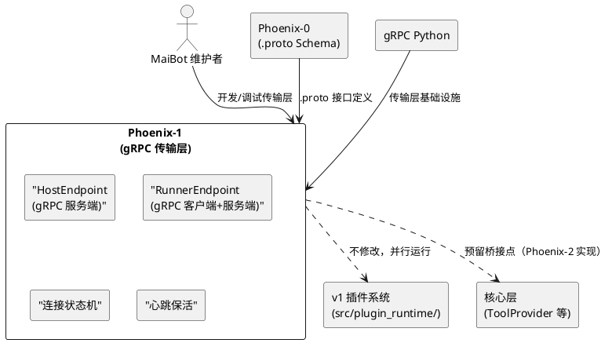
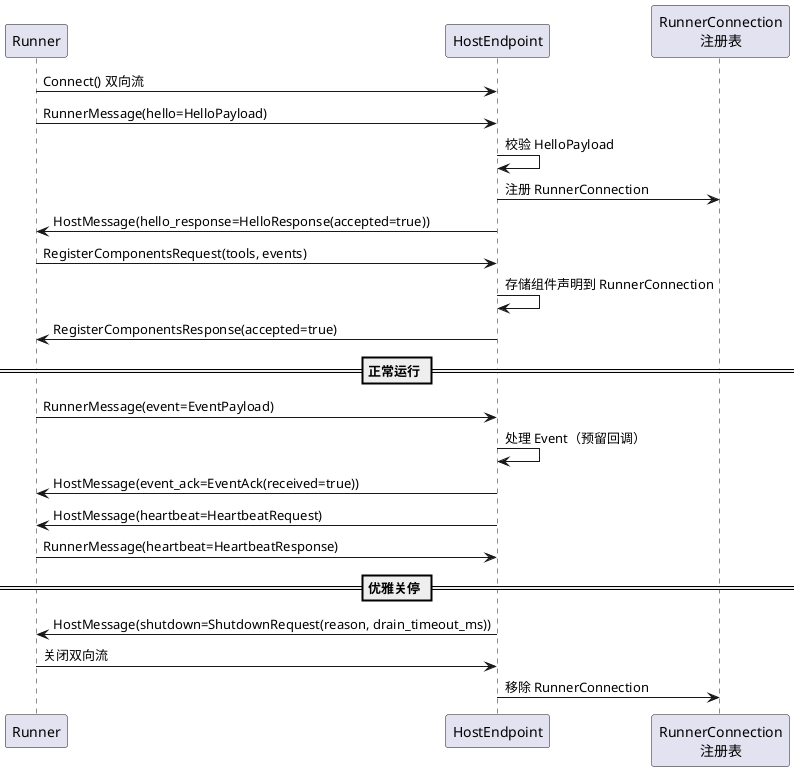
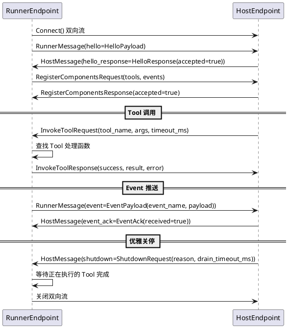
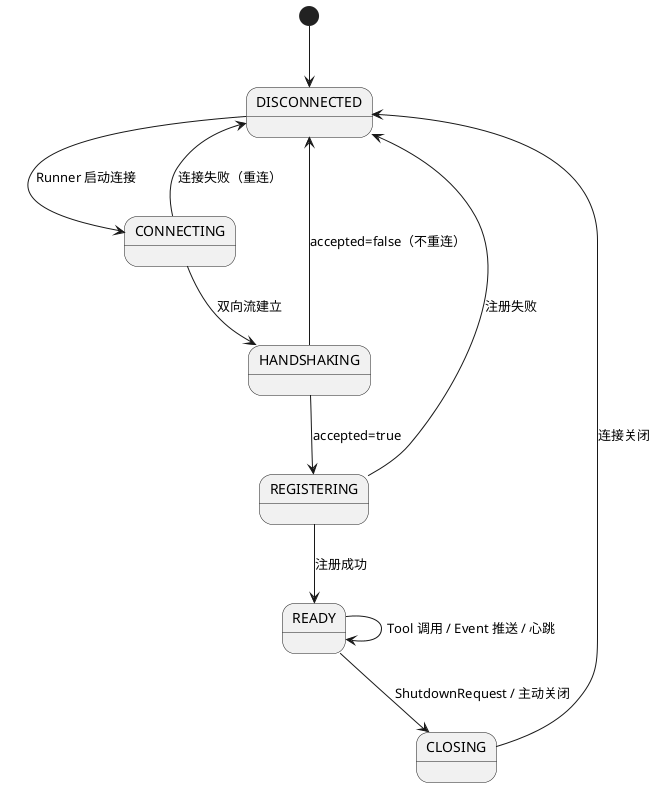
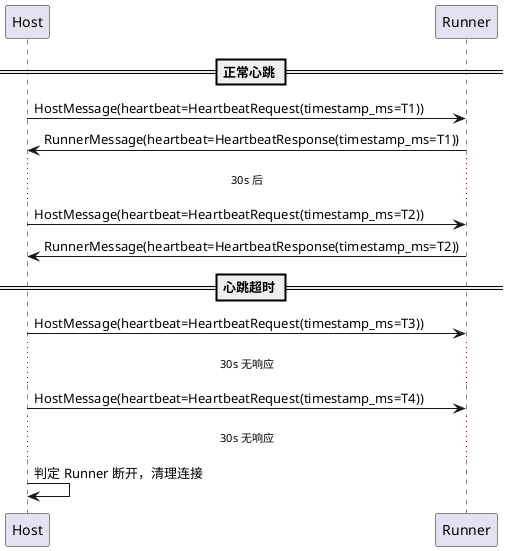
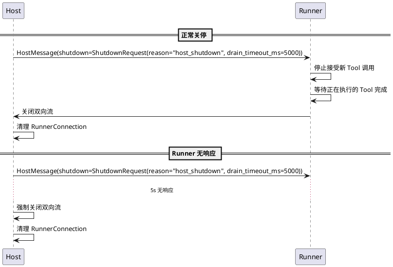

# Phoenix-1：gRPC 传输层 — 需求规格

# **1. 组件定位**

## **1.1 核心职责**

本组件负责实现 gRPC 双向流传输层，替换 v1 的自研 4-byte prefix + MsgPack IPC，为插件 Runner 与 Host 之间提供标准化、跨语言的通信管道。

## **1.2 核心输入**

1. **Runner 连接请求**：Runner 进程启动后，通过 `PluginHost.Connect` 双向流发起连接，首条消息携带 HelloPayload（runner_id, sdk_version, session_token, scopes）
2. **组件注册请求**：Runner 通过 `PluginHost.RegisterComponents` 一元 RPC 上报 Tool/Event 声明
3. **Tool 调用请求**：Host 通过 `PluginRunner.InvokeTool` 一元 RPC 请求 Runner 执行指定 Tool
4. **Event 推送**：Runner 通过双向流向 Host 推送 EventPayload
5. **心跳消息**：Host 和 Runner 通过双向流交换 HeartbeatRequest/HeartbeatResponse
6. **关停请求**：Host 通过双向流向 Runner 发送 ShutdownRequest
7. **Phoenix-0 产出的 .proto Schema**：`src/plugin_runtime_v2/proto/` 中的 .proto 文件和生成代码

## **1.3 核心输出**

1. **gRPC Host 服务端**：实现 `service PluginHost`（Connect 双向流 + RegisterComponents 一元 RPC），管理 Runner 连接生命周期
2. **gRPC Runner 客户端**：实现 `service PluginRunner`（InvokeTool 一元 RPC），执行插件 Tool 调用
3. **连接生命周期管理**：DISCONNECTED → CONNECTING → HANDSHAKING → REGISTERING → READY → CLOSING 状态机
4. **心跳保活机制**：基于 gRPC 双向流的心跳检测
5. **优雅关停流程**：ShutdownRequest + drain_timeout 排空机制

## **1.4 职责边界**

- **不修改** `src/plugin_runtime/` 下的任何现有代码（v1/v2 并行运行）
- **不实现** MCP Tool/Event 组件模型的运行时逻辑（Phoenix-2 的职责）
- **不实现** Scope 授权的签发/校验逻辑（Phoenix-3 的职责），握手阶段仅透传 scope 列表
- **不实现** 能力层 Protocol 化的代码迁移（Phoenix-4 的职责）
- **不实现** SDK v4 的装饰器和 PluginContext（Phoenix-2 的职责）
- **不实现** Host 端的 ToolProvider 桥接（将远程 Tool 注册到 ToolRegistry，Phoenix-2 的职责）
- **不实现** Runner 进程的启动/监督（沿用 v1 的进程管理，或由 Phoenix-2/4 统一改造）
- **不修改** Phoenix-0 产出的 .proto 文件（如需变更需回溯 Phoenix-0）

# **2. 领域术语**

**gRPC Host**
: gRPC 服务端，运行在主程序进程内，监听 Runner 的 Connect 双向流连接和 RegisterComponents 一元 RPC 调用。负责连接生命周期管理、心跳保活、优雅关停。
: 备注：对应 v1 的 `src/plugin_runtime/host/supervisor.py` + `rpc_server.py`，但传输层从自研 IPC 替换为 gRPC。

**gRPC Runner**
: gRPC 客户端，运行在插件进程内，主动连接 Host 的 Connect 双向流，并暴露 `PluginRunner` 服务供 Host 调用 InvokeTool。
: 备注：对应 v1 的 `src/plugin_runtime/runner/rpc_client.py` + `runner_main.py`。

**Connect 双向流**
: `PluginHost.Connect` RPC，Runner 通过此流建立持久连接。首条消息为 HelloPayload（握手），后续可推送 EventPayload 和 HeartbeatResponse；Host 通过此流回复 HelloResponse、发送 HeartbeatRequest 和 ShutdownRequest。
: 备注：替代 v1 的 TransportClient.connect() → Connection.send_frame/recv_frame 循环。

**连接状态机**
: Runner 与 Host 之间连接的生命周期状态：DISCONNECTED → CONNECTING → HANDSHAKING → REGISTERING → READY → CLOSING → DISCONNECTED。每个状态有明确的进入条件和退出条件。
: 备注：v1 无显式状态机，连接状态散落在多个 flag 变量中。

**drain_timeout**
: 优雅关停时 Host 给 Runner 的排空超时时间。Runner 收到 ShutdownRequest 后，应在 drain_timeout_ms 内完成正在执行的 Tool 调用，然后主动关闭连接。
: 备注：对应 v1 的 ShutdownPayload，但增加了超时控制。

**RunnerConnection**
: Host 端维护的单个 Runner 连接上下文，包含 runner_id、连接状态、双向流句柄、已注册的组件列表等元数据。
: 备注：v1 中对应 `PluginRunnerSupervisor` 实例，但 Phoenix-1 中大幅简化（不含进程管理）。

**HostEndpoint**
: Host 端的 gRPC 服务器实例，监听指定地址，接受 Runner 连接。
: 备注：替代 v1 的 `TransportServer` 抽象。

**RunnerEndpoint**
: Runner 端的 gRPC 客户端+服务端组合：客户端连接 Host 的 Connect 双向流，服务端暴露 InvokeTool RPC。
: 备注：替代 v1 的 `TransportClient` + `RPCClient` 组合。

# **3. 角色与边界**

## **3.1 核心角色**

- **MaiBot 维护者**：需要可维护、可调试的 gRPC 传输层，替换 2000+ 行自研 IPC 代码
- **插件开发者**：间接使用者，通过 SDK v4（Phoenix-2）调用传输层能力，不直接接触 gRPC API

## **3.2 外部系统**

- **Phoenix-0 .proto Schema**：`src/plugin_runtime_v2/proto/` 中的 service 和 message 定义，Phoenix-1 必须严格实现这些接口
- **v1 插件系统**：`src/plugin_runtime/`，与 v2 并行运行，Phoenix-1 不修改 v1 代码
- **核心层 Protocol 接口**：`src/core/protocols.py`，Phoenix-1 的 Host 端暂不实现 ToolProvider（Phoenix-2 职责），但代码结构需预留桥接点
- **gRPC Python 库**：`grpcio` + `grpcio-health-checking`，提供 gRPC 服务器/客户端实现和健康检查协议
- **protobuf 运行时**：`google.protobuf`，提供消息序列化/反序列化

## **3.3 交互上下文**

# **4. DFX约束**

## **4.1 性能**

1. gRPC 双向流单条消息（≤4KB）端到端延迟（不含业务逻辑）必须 ≤5ms（同机通信）
2. Host 端必须支持至少 10 个 Runner 同时连接且正常工作
3. InvokeTool 一元 RPC 的 gRPC 层开销（序列化+网络+反序列化）必须 ≤2ms（同机通信）
4. 心跳检测必须在 60s 内发现连接断开（心跳间隔 30s，2 次未响应判定断开）

## **4.2 可靠性**

1. Runner 异常断开后，Host 必须在心跳超时后自动清理连接资源，不影响其他 Runner
2. Host 重启后，Runner 必须自动重连（指数退避，最大间隔 30s，最多重试 10 次）
3. 双向流断开时，正在执行的 InvokeTool 调用必须返回错误而非永久挂起
4. gRPC 通道必须启用 `GRPC_ARG_KEEPALIVE_TIME_MS=30000` 和 `GRPC_ARG_KEEPALIVE_TIMEOUT_MS=10000` 保持连接活性

## **4.3 安全性**

1. Host 监听地址必须默认绑定 `localhost`（127.0.0.1），禁止暴露到公网
2. session_token 字段在握手阶段透传，Phoenix-1 不做校验（Phoenix-3 签发和校验）
3. Host 必须记录每个 Runner 的连接/断开/握手失败事件，用于审计
4. Runner 连接时必须验证 Host 的 server_id（防止误连到错误的 Host 实例）

## **4.4 可维护性**

1. 所有 gRPC 相关日志必须使用 `src/common/logger.py` 的 `get_logger`，模块名前缀为 `plugin_runtime_v2.`
2. 连接状态变更必须记录 INFO 级别日志，包含 runner_id 和新旧状态
3. 心跳超时和重连事件必须记录 WARNING 级别日志
4. 必须提供 `HostEndpoint.get_status()` 方法返回所有 Runner 连接状态快照，供 WebUI 调试页使用
5. gRPC 服务器必须启用反射服务（`grpc_reflection`），便于运行时调试

## **4.5 兼容性**

1. Phoenix-1 代码必须在 `src/plugin_runtime_v2/host/` 和 `src/plugin_runtime_v2/runner/` 目录内，不修改 v1 代码
2. v2 代码禁止导入 v1 的任何模块（`from src.plugin_runtime` 在 v2 目录下零匹配）
3. .proto Schema 如需变更，必须回溯到 Phoenix-0 修改，Phoenix-1 不直接修改 .proto 文件
4. Python 版本要求与主程序一致（≥3.11）
5. gRPC 传输层必须支持 Windows 和 Linux 双平台（UDS 仅 Linux，Windows 使用 TCP localhost）

# **5. 核心能力**

## **5.1 gRPC Host 服务端**

### **5.1.1 业务规则**

1. **服务实现**：HostEndpoint 必须实现 `service PluginHost` 的两个 RPC 方法：Connect（双向流）和 RegisterComponents（一元 RPC）
   a. 验收条件：[启动 HostEndpoint] → [gRPC 反射服务可见 PluginHost 服务定义]

2. **Connect 双向流处理**：Host 收到 Runner 的 Connect 调用后，必须按以下顺序处理：
   - 等待首条 RunnerMessage，验证 payload 为 hello
   - 校验 HelloPayload 的必填字段（runner_id, sdk_version, session_token, scopes）
   - 返回 HelloResponse（accepted=true 或 accepted=false + reason）
   - 如果 accepted=true，进入消息循环：接收 EventPayload/HeartbeatResponse，发送 HeartbeatRequest/ShutdownRequest
   a. 验收条件：[Runner 发起 Connect 并发送 HelloPayload] → [Host 返回 HelloResponse 并进入消息循环]

3. **RegisterComponents 处理**：Host 收到 RegisterComponentsRequest 后，必须：
   - 验证 plugin_id 非空
   - 验证 tools 和 events 列表中的 name 非空且无重复
   - 将组件声明存储到 RunnerConnection 上下文中
   - 返回 RegisterComponentsResponse（accepted=true 或 accepted=false + reasons）
   a. 验收条件：[Runner 发送 RegisterComponentsRequest] → [Host 存储组件声明并返回 accepted=true]

4. **Runner 连接注册表**：Host 必须维护 `dict[runner_id, RunnerConnection]` 注册表，支持按 runner_id 查找连接
   a. 验收条件：[Runner 连接成功] → [Host 注册表中存在对应 runner_id 的 RunnerConnection]

5. **重复连接处理**：同一 runner_id 的第二个连接必须被拒绝（HelloResponse.accepted=false, reason="RUNNER_ALREADY_CONNECTED"）
   a. 验收条件：[同一 runner_id 发起第二次 Connect] → [Host 返回 accepted=false, reason="RUNNER_ALREADY_CONNECTED"]

6. **连接断开清理**：Runner 的双向流断开后（无论正常或异常），Host 必须：
   - 从注册表中移除 RunnerConnection
   - 记录 INFO 日志（runner_id, 断开原因）
   - 通知上层（预留回调，Phoenix-2 使用）
   a. 验收条件：[Runner 双向流断开] → [Host 注册表中不存在该 runner_id，日志记录断开事件]

7. **禁止项**：Host 端禁止直接导入 `src/plugin_runtime/` 下的任何模块
   a. 验收条件：[grep `from src.plugin_runtime` in src/plugin_runtime_v2/host/] → [零匹配]

8. **禁止项**：Host 端禁止直接导入 `global_config` 或 `config_manager`
   a. 验收条件：[grep `global_config\|config_manager` in src/plugin_runtime_v2/host/] → [零匹配]

### **5.1.2 交互流程**

### **5.1.3 异常场景**

1. **HelloPayload 必填字段缺失**
   a. 触发条件：Runner 发送的 HelloPayload 缺少 runner_id 或 sdk_version 或 session_token
   b. 系统行为：Host 返回 HelloResponse(accepted=false, reason="MISSING_REQUIRED_FIELD: {field_name}")
   c. 用户感知：Runner 日志记录"握手失败：缺少必填字段 {field_name}"

2. **SDK 版本不兼容**
   a. 触发条件：Runner 的 sdk_version 不在 Host 支持的版本范围内
   b. 系统行为：Host 返回 HelloResponse(accepted=false, reason="SDK_VERSION_MISMATCH")
   c. 用户感知：Runner 日志记录"握手失败：SDK 版本不兼容"

3. **重复 runner_id 连接**
   a. 触发条件：已连接的 runner_id 再次发起 Connect
   b. 系统行为：Host 返回 HelloResponse(accepted=false, reason="RUNNER_ALREADY_CONNECTED")
   c. 用户感知：Runner 日志记录"握手失败：runner_id 已存在"

4. **Runner 双向流异常断开**
   a. 触发条件：Runner 进程崩溃或网络中断，双向流断开
   b. 系统行为：Host 检测到流断开，从注册表移除 RunnerConnection，记录 WARNING 日志
   c. 用户感知：Host 日志记录"Runner {runner_id} 连接异常断开"

5. **RegisterComponents 中组件名称重复**
   a. 触发条件：tools 列表中存在相同 name 的 Tool，或 events 列表中存在相同 name 的 Event
   b. 系统行为：Host 返回 RegisterComponentsResponse(accepted=false, reasons=["DUPLICATE_TOOL_NAME: {name}"])
   c. 用户感知：Runner 日志记录"组件注册失败：Tool 名称重复"

6. **首条消息非 HelloPayload**
   a. 触发条件：Runner 的 Connect 双向流首条消息的 payload 不是 hello
   b. 系统行为：Host 返回 HelloResponse(accepted=false, reason="FIRST_MESSAGE_MUST_BE_HELLO")，关闭流
   c. 用户感知：Runner 日志记录"握手失败：首条消息必须是 HelloPayload"

## **5.2 gRPC Runner 客户端**

### **5.2.1 业务规则**

1. **Connect 双向流建立**：RunnerEndpoint 必须主动调用 Host 的 Connect 双向流，首条消息发送 HelloPayload
   a. 验收条件：[RunnerEndpoint 启动] → [成功建立双向流并发送 HelloPayload]

2. **InvokeTool 服务实现**：RunnerEndpoint 必须实现 `service PluginRunner` 的 InvokeTool 一元 RPC
   a. 验收条件：[Host 调用 InvokeTool] → [RunnerEndpoint 收到请求并返回 InvokeToolResponse]

3. **InvokeTool 路由**：RunnerEndpoint 收到 InvokeToolRequest 后，必须根据 tool_name 查找已注册的 Tool 处理函数并执行。Phoenix-1 阶段使用占位实现（返回 success=false, error="NOT_IMPLEMENTED"），Phoenix-2 接入 SDK v4 的 @Tool 装饰器
   a. 验收条件：[Host 调用 InvokeTool(tool_name="test")] → [RunnerEndpoint 返回 InvokeToolResponse(success=false, error="NOT_IMPLEMENTED")]

4. **Event 推送**：RunnerEndpoint 必须提供 `emit_event(event_name, payload)` 方法，通过双向流向 Host 推送 EventPayload。Phoenix-1 阶段仅实现传输层推送，不含业务逻辑
   a. 验收条件：[调用 emit_event("test", {"key": "value"})] → [Host 收到 RunnerMessage(event=EventPayload)]

5. **自动重连**：RunnerEndpoint 检测到连接断开后，必须自动重连（指数退避：初始 1s，倍增，最大 30s，最多 10 次）
   a. 验收条件：[Host 重启] → [RunnerEndpoint 自动重连并重新握手+注册]

6. **优雅关停响应**：RunnerEndpoint 收到 ShutdownRequest 后，必须：
   - 停止接受新的 InvokeTool 调用
   - 等待正在执行的 Tool 调用完成（不超过 drain_timeout_ms）
   - 关闭双向流
   a. 验收条件：[收到 ShutdownRequest(drain_timeout_ms=5000)] → [5s 内关闭双向流]

7. **禁止项**：Runner 端禁止直接导入 `src/plugin_runtime/` 下的任何模块
   a. 验收条件：[grep `from src.plugin_runtime` in src/plugin_runtime_v2/runner/] → [零匹配]

### **5.2.2 交互流程**

### **5.2.3 异常场景**

1. **Host 不可达**
   a. 触发条件：RunnerEndpoint 启动时 Host 未运行
   b. 系统行为：RunnerEndpoint 按指数退避重试连接，记录 WARNING 日志
   c. 用户感知：Runner 日志记录"连接 Host 失败，{n}秒后重试"

2. **握手被拒绝**
   a. 触发条件：Host 返回 HelloResponse(accepted=false)
   b. 系统行为：RunnerEndpoint 记录 ERROR 日志，不重试（握手拒绝是业务决策，不是临时故障）
   c. 用户感知：Runner 日志记录"握手被拒绝：{reason}"

3. **InvokeTool 超时**
   a. 触发条件：Host 发送 InvokeToolRequest(timeout_ms=30000)，Runner 30s 内未返回
   b. 系统行为：gRPC 层返回 DEADLINE_EXCEEDED 状态码，Host 记录 WARNING 日志
   c. 用户感知：Host 日志记录"Tool {tool_name} 调用超时"

4. **重连耗尽重试次数**
   a. 触发条件：RunnerEndpoint 重连 10 次均失败
   b. 系统行为：RunnerEndpoint 记录 ERROR 日志，停止重连，进入 DISCONNECTED 终态
   c. 用户感知：Runner 日志记录"重连失败，已达最大重试次数"

5. **双向流断开后 InvokeTool 调用**
   a. 触发条件：Host 在双向流断开后仍尝试调用 InvokeTool
   b. 系统行为：gRPC 返回 UNAVAILABLE 状态码，Host 将此 Runner 标记为不可用
   c. 用户感知：Host 日志记录"Runner {runner_id} 不可用，Tool 调用失败"

## **5.3 连接生命周期管理**

### **5.3.1 业务规则**

1. **状态机定义**：Runner 与 Host 之间的连接必须遵循以下状态机：
   - DISCONNECTED：初始状态，未连接
   - CONNECTING：Runner 正在建立 gRPC 通道
   - HANDSHAKING：双向流已建立，等待握手响应
   - REGISTERING：握手成功，正在注册组件
   - READY：注册完成，正常运行
   - CLOSING：收到关停请求或主动关闭中
   a. 验收条件：[检查 RunnerConnection 状态字段] → [状态值仅为上述 6 种之一]

2. **状态转换规则**：
   - DISCONNECTED → CONNECTING：Runner 启动连接
   - CONNECTING → HANDSHAKING：双向流建立成功
   - CONNECTING → DISCONNECTED：连接失败（进入重连）
   - HANDSHAKING → REGISTERING：HelloResponse.accepted=true
   - HANDSHAKING → DISCONNECTED：HelloResponse.accepted=false
   - REGISTERING → READY：RegisterComponentsResponse.accepted=true
   - REGISTERING → DISCONNECTED：RegisterComponentsResponse.accepted=false
   - READY → CLOSING：收到 ShutdownRequest 或主动关闭
   - CLOSING → DISCONNECTED：连接关闭完成
   a. 验收条件：[模拟各状态转换路径] → [每次转换后状态值正确]

3. **非法状态转换**：任何不在上述规则中的状态转换必须被拒绝，并记录 ERROR 日志
   a. 验收条件：[尝试从 READY 直接转换到 HANDSHAKING] → [操作被拒绝，日志记录非法转换]

4. **状态查询**：Host 必须提供 `get_status()` 方法返回所有 Runner 连接的状态快照
   a. 验收条件：[调用 HostEndpoint.get_status()] → [返回包含所有 runner_id 及其当前状态的字典]

5. **重连时状态重置**：Runner 重连时，Host 必须将 RunnerConnection 状态重置为 DISCONNECTED → CONNECTING → HANDSHAKING → REGISTERING → READY 的完整流程
   a. 验收条件：[Runner 断开后重连] → [Host 端状态经历完整握手流程]

### **5.3.2 交互流程**

### **5.3.3 异常场景**

1. **状态转换竞态**
   a. 触发条件：Runner 在 HANDSHAKING 状态时同时收到 ShutdownRequest
   b. 系统行为：以 ShutdownRequest 优先，状态转为 CLOSING
   c. 用户感知：Host 日志记录"Runner {runner_id} 握手期间收到关停请求"

2. **注册超时**
   a. 触发条件：Runner 握手成功后 30s 内未发送 RegisterComponentsRequest
   b. 系统行为：Host 主动关闭双向流，状态转为 CLOSING → DISCONNECTED
   c. 用户感知：Host 日志记录"Runner {runner_id} 注册超时"

3. **READY 状态下双向流断开**
   a. 触发条件：Runner 在 READY 状态时双向流异常断开
   b. 系统行为：Host 直接将状态设为 DISCONNECTED，清理资源
   c. 用户感知：Host 日志记录"Runner {runner_id} 运行中连接断开"

## **5.4 心跳保活**

### **5.4.1 业务规则**

1. **心跳发起**：Host 必须每隔 30s 通过双向流向 Runner 发送 HeartbeatRequest（timestamp_ms 为当前时间戳）
   a. 验收条件：[Host 与 Runner 连接空闲 30s] → [Host 发送 HeartbeatRequest]

2. **心跳响应**：Runner 收到 HeartbeatRequest 后，必须在 10s 内回复 HeartbeatResponse（timestamp_ms 为收到请求的时间戳）
   a. 验收条件：[Runner 收到 HeartbeatRequest] → [10s 内发送 HeartbeatResponse]

3. **超时判定**：Host 连续 2 次 HeartbeatRequest 未收到 HeartbeatResponse（即 60s 无响应），必须判定连接断开
   a. 验收条件：[Host 发送 2 次 HeartbeatRequest 均未收到响应] → [Host 判定 Runner 断开，清理连接]

4. **gRPC keepalive 配置**：gRPC 通道必须配置以下 keepalive 参数：
   - `GRPC_ARG_KEEPALIVE_TIME_MS=30000`
   - `GRPC_ARG_KEEPALIVE_TIMEOUT_MS=10000`
   - `GRPC_ARG_KEEPALIVE_PERMIT_WITHOUT_CALLS=1`
   a. 验收条件：[检查 gRPC 通道配置] → [keepalive 参数值与上述一致]

5. **禁止项**：心跳机制禁止替代 gRPC 自带的 keepalive，两者必须同时启用。应用层心跳用于业务状态感知，gRPC keepalive 用于传输层连接检测
   a. 验收条件：[检查代码] → [应用层心跳和 gRPC keepalive 均已启用]

### **5.4.2 交互流程**

### **5.4.3 异常场景**

1. **单次心跳超时**
   a. 触发条件：Host 发送 HeartbeatRequest 后 10s 内未收到 HeartbeatResponse
   b. 系统行为：Host 记录 WARNING 日志，但不判定断开（等待第二次超时）
   c. 用户感知：Host 日志记录"Runner {runner_id} 心跳响应超时（第 1 次）"

2. **连续两次心跳超时**
   a. 触发条件：Host 连续 2 次 HeartbeatRequest 均未收到 HeartbeatResponse
   b. 系统行为：Host 判定 Runner 断开，清理 RunnerConnection，记录 WARNING 日志
   c. 用户感知：Host 日志记录"Runner {runner_id} 心跳连续超时，判定断开"

## **5.5 优雅关停**

### **5.5.1 业务规则**

1. **关停请求**：Host 通过双向流向 Runner 发送 ShutdownRequest，包含 reason 和 drain_timeout_ms（默认 5000ms）
   a. 验收条件：[Host 发送 ShutdownRequest] → [Runner 收到关停请求]

2. **排空等待**：Runner 收到 ShutdownRequest 后，必须：
   - 停止接受新的 InvokeTool 调用（返回 UNAVAILABLE）
   - 等待正在执行的 Tool 调用完成（不超过 drain_timeout_ms）
   - 在 drain_timeout_ms 内主动关闭双向流
   a. 验收条件：[Runner 收到 ShutdownRequest(drain_timeout_ms=5000)] → [5s 内双向流关闭]

3. **强制关闭**：如果 Runner 在 drain_timeout_ms 后仍未关闭双向流，Host 必须强制关闭
   a. 验收条件：[Runner 5s 后仍未关闭] → [Host 强制关闭双向流]

4. **Host 主动关闭**：Host 自身关停时，必须向所有已连接的 Runner 发送 ShutdownRequest，等待 drain_timeout_ms 后强制关闭
   a. 验收条件：[Host 关停] → [所有 Runner 收到 ShutdownRequest，Host 等待排空后关闭]

5. **Runner 主动断开**：Runner 主动断开时（非收到 ShutdownRequest），必须直接关闭双向流，无需等待
   a. 验收条件：[Runner 主动关闭双向流] → [Host 检测到断开并清理资源]

### **5.5.2 交互流程**

### **5.5.3 异常场景**

1. **关停期间新的 Tool 调用**
   a. 触发条件：Runner 收到 ShutdownRequest 后，Host 又发来 InvokeToolRequest
   b. 系统行为：Runner 返回 InvokeToolResponse(success=false, error="SHUTTING_DOWN")
   c. 用户感知：Host 日志记录"Runner {runner_id} 正在关停，Tool 调用被拒"

2. **排空超时后仍有 Tool 未完成**
   a. 触发条件：drain_timeout_ms 到期，但仍有 Tool 调用未返回
   b. 系统行为：Host 强制关闭双向流，未完成的 Tool 调用收到 UNAVAILABLE 错误
   c. 用户感知：Host 日志记录"Runner {runner_id} 排空超时，强制关闭"

# **6. 数据约束**

## **6.1 RunnerConnection**

1. **runner_id**：Runner 进程唯一标识（string, 必填，由 Runner 生成，格式为 UUID v4）
2. **state**：连接状态（enum, 必填，取值为 DISCONNECTED/CONNECTING/HANDSHAKING/REGISTERING/READY/CLOSING）
3. **sdk_version**：Runner 使用的 SDK 版本（string, 必填，来自 HelloPayload）
4. **session_token**：握手令牌（string, 必填，来自 HelloPayload，Phoenix-3 校验）
5. **scopes**：Runner 声明的 scope 列表（list[string], 必填，来自 HelloPayload）
6. **tools**：已注册的 Tool 声明列表（list[ToolDeclaration], 来自 RegisterComponentsRequest）
7. **events**：已注册的 Event 声明列表（list[EventDeclaration], 来自 RegisterComponentsRequest）
8. **plugin_id**：插件 ID（string, 来自 RegisterComponentsRequest）
9. **plugin_version**：插件版本（string, 来自 RegisterComponentsRequest）
10. **connected_at**：连接建立时间（float, Unix 时间戳，READY 状态时有值）
11. **last_heartbeat_at**：最后一次心跳响应时间（float, Unix 时间戳，READY 状态时有值）

## **6.2 HostEndpoint 配置**

1. **listen_address**：gRPC 服务监听地址（string, 默认 "127.0.0.1:50051"）
2. **heartbeat_interval_s**：心跳发送间隔（int, 默认 30, 单位秒）
3. **heartbeat_timeout_s**：单次心跳超时（int, 默认 10, 单位秒）
4. **max_heartbeat_misses**：最大心跳丢失次数（int, 默认 2）
5. **register_timeout_s**：注册超时时间（int, 默认 30, 单位秒）
6. **default_drain_timeout_ms**：默认排空超时（int, 默认 5000, 单位毫秒）
7. **max_runners**：最大 Runner 连接数（int, 默认 10）

## **6.3 RunnerEndpoint 配置**

1. **host_address**：Host 的 gRPC 地址（string, 必填）
2. **runner_id**：Runner 唯一标识（string, 自动生成 UUID v4）
3. **sdk_version**：SDK 版本（string, 自动读取）
4. **session_token**：握手令牌（string, 必填）
5. **scopes**：声明的 scope 列表（list[string], 必填，至少 1 项）
6. **reconnect_max_retries**：最大重连次数（int, 默认 10）
7. **reconnect_initial_delay_s**：重连初始延迟（float, 默认 1.0, 单位秒）
8. **reconnect_max_delay_s**：重连最大延迟（float, 默认 30.0, 单位秒）
9. **tool_timeout_ms**：Tool 调用默认超时（int, 默认 30000, 单位毫秒）