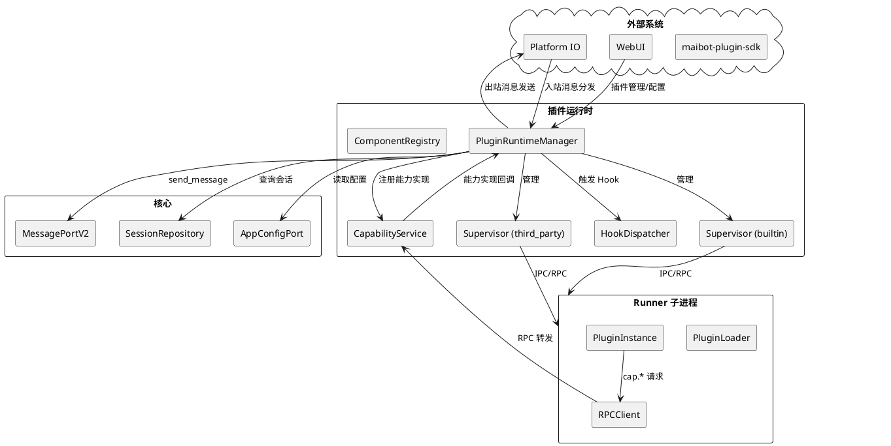
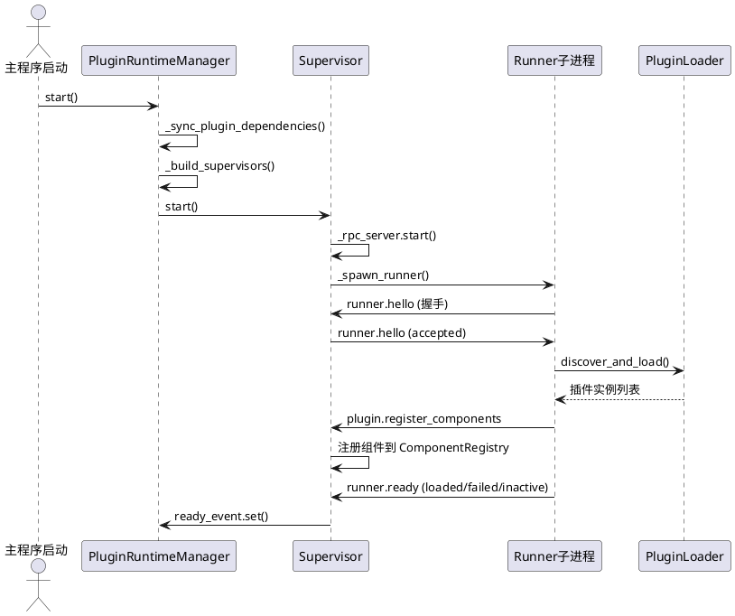
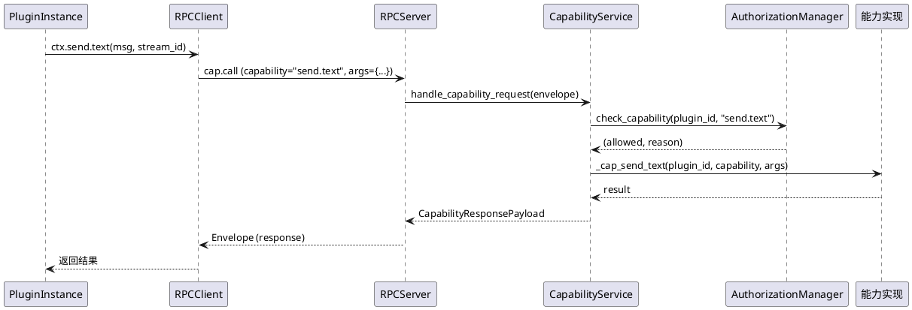
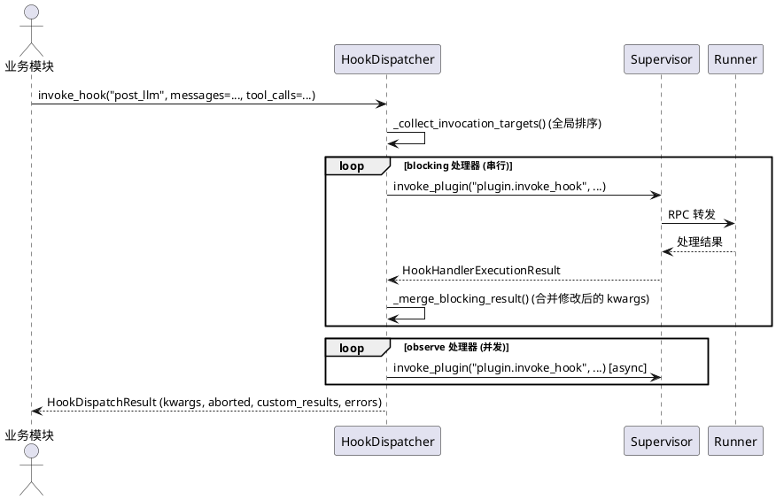
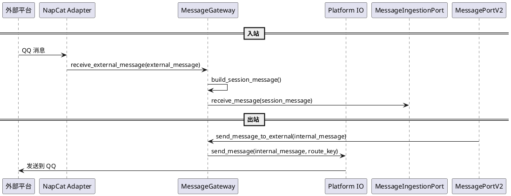
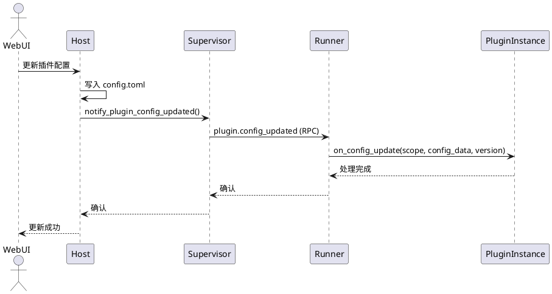
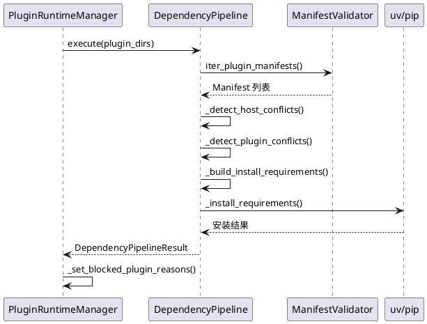
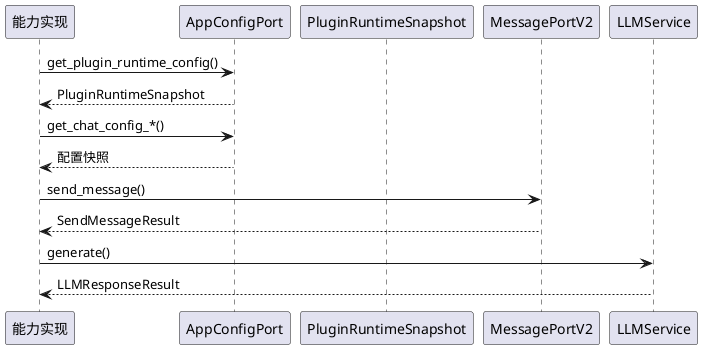

# 1. 组件定位

## 1.1 核心职责

本组件负责重构 MaiBot 插件运行时系统，使其与微内核架构对齐、消除 global_config 直接依赖、建立插件能力协议化接口，实现插件系统的可扩展性和核心隔离。

## 1.2 核心输入

1. **插件 Manifest（`_manifest.json`）**：插件声明其 ID、版本、能力需求、依赖关系、配置 Schema
2. **插件代码（`plugin.py`）**：基于 `maibot_sdk` 编写的插件实现，声明组件（Action/Command/Tool/EventHandler/HookHandler/MessageGateway/HomeCard）
3. **插件配置（`config.toml`）**：插件运行时配置，支持 WebUI 热更新
4. **主程序配置变更事件**：全局配置热重载时，通知订阅了对应 scope 的插件
5. **主程序消息链事件**：入站消息、出站消息、LLM 调用前后等 Hook 触发信号
6. **Platform IO 入站消息**：通过消息网关插件接收的外部平台消息

## 1.3 核心输出

1. **插件组件注册结果**：插件启动后向 Host 注册的组件列表及状态（loaded/failed/inactive）
2. **能力调用响应**：插件通过 `cap.*` 调用主程序功能后的返回结果
3. **Hook 调度结果**：命名 Hook 触发后，各处理器返回的聚合结果（含修改后参数、中止状态、自定义结果）
4. **事件分发结果**：EventHandler 处理后的消息修改和流程控制信号
5. **消息网关出站消息**：通过 Platform IO 发送到外部平台的消息
6. **LLM Provider 调用结果**：插件声明的 LLM Provider 对 LLM 请求的处理结果
7. **插件运行时诊断事件**：写入 `logs/plugin_runtime_debug/runner_rpc_debug.jsonl` 的 Host 侧诊断数据

## 1.4 职责边界

本组件**不负责**：

1. **核心业务逻辑**：消息处理、智能体思考、回复生成等核心管道不属于插件运行时
2. **具体平台适配**：NapCat 等具体平台适配器是插件，不属于插件运行时框架本身
3. **SDK 实现**：`maibot_sdk` 是独立仓库（`maibot-plugin-sdk`），本组件只提供 Host 侧对接
4. **WebUI 渲染**：插件配置管理页面由 WebUI 独立实现，本组件只提供配置读写能力
5. **Python 包管理**：依赖安装由 `PluginDependencyPipeline` 调用 `uv`/`pip` 完成，本组件不自行管理虚拟环境

# 2. 领域术语

**Host**
: 主程序进程，运行 `PluginRuntimeManager` 和 `PluginRunnerSupervisor`，管理 Runner 子进程的生命周期。

**Runner**
: 独立子进程，加载并执行插件代码，通过 IPC 与 Host 通信。

**Supervisor**
: Host 侧的 Runner 监督器，负责单个 Runner 子进程的启动、健康检查、RPC 转发和重载协调。

**PluginRuntimeManager**
: 插件运行时管理器（单例），管理内置/第三方两个 Supervisor，桥接 EventType 到 Hook/Event 分发。

**Manifest**
: 插件元数据声明文件（`_manifest.json`），包含 ID、版本、能力需求、依赖、配置 Schema 等。

**Capability（能力）**
: 插件向 Host 请求的主程序功能，如 `send.text`、`llm.generate`、`database.query` 等。插件在 Manifest 中声明所需能力，Host 签发能力令牌后插件方可调用。

**Component（组件）**
: 插件向 Host 注册的功能单元，类型包括 Action、Command、Tool、EventHandler、HookHandler、MessageGateway、HomeCard。

**Hook（命名 Hook）**
: 主程序在特定执行点触发的扩展机制，插件通过 HookHandler 组件订阅。分为 blocking（可修改参数、可中止）和 observe（旁路观察）两种模式。

**EventHandler**
: 旧式事件处理器，按 `event_type`（如 `on_message`、`post_llm`）订阅，按 weight 排序执行。

**MessageGateway**
: 消息网关组件，插件通过它实现外部平台的消息收发（入站/出站/双向）。

**Circuit Breaker（熔断器）**
: 按插件 ID 隔离的运行时保护机制，连续失败达到阈值后自动熔断，冷却后半开测试恢复。

**PluginContext**
: Runner 注入给插件实例的运行时上下文，提供 `ctx.send.*`、`ctx.emoji.*` 等便捷方法，底层通过 `cap.*` RPC 调用 Host。

**LLM Provider**
: 插件声明的 LLM 客户端类型，Host 将匹配的 LLM 请求路由到对应插件的 Provider 处理。

**Dependency Pipeline**
: 插件 Python 依赖流水线，负责扫描依赖冲突、自动安装缺失包、产出拒绝加载列表。

**IPC**
: Host 与 Runner 之间的进程间通信，当前支持 UDS、Named Pipe、TCP 三种传输后端，使用 MsgPack 编码。

# 3. 角色与边界

## 3.1 核心角色

**插件开发者**：使用 `maibot_sdk` 编写插件，声明组件和能力需求，通过 PluginContext 调用主程序功能。

**系统管理员**：通过 WebUI 或配置文件管理插件启用/禁用、配置参数、查看运行状态。

## 3.2 外部系统

**maibot-plugin-sdk**：独立仓库，提供 `maibot_sdk` Python 包，定义 `MaiBotPlugin` 基类、组件装饰器、`PluginContext` 接口。

**Platform IO**：主程序的消息平台抽象层，插件通过 MessageGateway 组件注册路由绑定，实现跨平台消息收发。

**核心 Protocol 层**：`src/core/protocols.py` 定义的所有 Protocol 接口（MessagePortV2、SessionRepository、AgentRoutingService 等），插件运行时通过适配器层间接使用。

**WebUI**：主程序的 Web 管理界面，消费插件运行时提供的组件信息、配置 Schema、运行状态等。

**A_memorix**：主程序的记忆系统，插件通过 `cap.*` 能力间接访问（当前未暴露记忆相关能力）。

## 3.3 交互上下文

# 4. DFX约束

## 4.1 性能

1. **Hook 调度延迟**：单次 Hook 触发到所有 blocking 处理器返回的端到端延迟应 ≤ 500ms（不含插件自身执行时间）
2. **能力调用延迟**：单次 `cap.*` 调用的 Host 侧处理延迟应 ≤ 50ms（不含下游服务耗时）
3. **IPC 吞吐**：Host ↔ Runner 单连接吞吐应 ≥ 1000 msg/s（小载荷场景）
4. **启动时间**：插件运行时从 `start()` 到 `ready_event.set()` 应 ≤ 10s（含依赖安装时 ≤ 30s）

## 4.2 可靠性

1. **Runner 崩溃恢复**：Runner 子进程异常退出后，Supervisor 应在 30s 内自动重启（最多 3 次）
2. **熔断保护**：单个插件连续失败 3 次后自动熔断，冷却期 60s 起步，指数退避至 300s 上限
3. **消息不丢失**：Runner 崩溃时，Host 侧已接收的 RPC 请求应返回错误而非静默丢弃
4. **配置一致性**：插件配置热更新后，Host 和 Runner 的配置视图必须一致

## 4.3 安全性

1. **能力授权**：插件只能调用 Manifest 中声明的 `capabilities` 对应的能力，未授权调用返回 `E_CAPABILITY_DENIED`
2. **IPC 认证**：Runner 启动时必须通过 session_token 握手认证，拒绝未认证连接
3. **LLM Provider 隔离**：同一 `client_type` 只允许一个插件声明，冲突时阻止所有冲突插件加载
4. **Python 依赖安全**：插件 Python 依赖与主程序冲突时阻止加载，不自动降级

## 4.4 可维护性

1. **诊断日志**：Host 侧关键事件写入独立 JSONL 文件（`logs/plugin_runtime_debug/runner_rpc_debug.jsonl`）
2. **Runner 日志桥接**：Runner 侧所有 stdlib logging 通过 IPC 转发到 Host 统一输出
3. **熔断状态可观测**：`PluginCircuitBreaker.get_plugin_statuses()` 返回当前所有熔断状态快照
4. **插件加载状态可查询**：`Supervisor.get_plugin_load_statuses()` 返回 loaded/failed/inactive 分类

## 4.5 兼容性

1. **SDK 版本兼容**：Host 通过 `MIN_SDK_VERSION` / `MAX_SDK_VERSION` 约束 Runner 使用的 SDK 版本范围
2. **Host 版本兼容**：插件 Manifest 声明 `host_application.min_version` / `max_version`，Runner 启动时校验
3. **配置版本迁移**：插件配置升级时，以最新默认配置为骨架，仅迁移类型匹配的旧字段值
4. **传输后端可替换**：IPC 传输层抽象为 `TransportServer`/`TransportClient`，支持 UDS/Named Pipe/TCP 切换

# 5. 核心能力

## 5.1 插件生命周期管理

### 5.1.1 业务规则

1. **双 Supervisor 隔离**：内置插件和第三方插件分别运行在独立的 Runner 子进程中，通过 `group_name` 区分（`builtin` / `third_party`）
   - 验收条件：启动第三方插件 → 第三方 Runner 子进程独立运行 → 内置插件崩溃不影响第三方插件

2. **依赖顺序启动**：根据跨 Supervisor 的插件依赖关系决定 Runner 启动顺序，检测到循环依赖时拒绝启动
   - 验收条件：内置插件依赖第三方插件 → 第三方 Supervisor 先启动 → 内置 Supervisor 后启动

3. **插件加载三态**：插件加载结果分为 loaded（成功）、inactive（禁用或依赖不满足）、failed（初始化失败）三种状态
   - 验收条件：插件依赖的另一个插件未加载 → 当前插件标记为 inactive 而非 failed

4. **热重载**：支持按插件 ID 精确重载和批量重载，重载时先卸载旧实例再加载新实例
   - 验收条件：修改插件代码后触发文件监视器 → 对应插件自动重载 → 其他插件不受影响

5. **自动重启**：Runner 子进程异常退出后，Supervisor 自动重启（最多 `max_restart_attempts` 次），超过后停止尝试
   - 验收条件：手动 kill Runner 进程 → Supervisor 检测到断连 → 自动重启 Runner → 插件重新注册

6. **禁止项**：禁止在 Runner 子进程内直接导入主程序模块（`src.*`），所有交互必须通过 IPC/RPC
   - 验收条件：插件代码中 `import src.config.config` → Runner 启动失败或运行时抛出 ImportError

### 5.1.2 交互流程

### 5.1.3 异常场景

1. **Runner 启动超时**
   - 触发条件：Runner 子进程在 `runner_spawn_timeout_sec` 内未完成连接或初始化
   - 系统行为：Supervisor 记录警告日志，继续运行但不保证插件可用
   - 用户感知：日志警告 "Runner 未在限定时间内完成连接/初始化"

2. **插件依赖循环**
   - 触发条件：内置插件和第三方插件之间存在循环依赖
   - 系统行为：`_build_group_start_order()` 抛出 `RuntimeError`
   - 用户感知：插件运行时启动失败，日志显示 "检测到跨 Supervisor 循环依赖"

3. **重复插件 ID**
   - 触发条件：不同目录下存在相同 ID 的插件
   - 系统行为：拒绝启动插件运行时
   - 用户感知：日志显示 "检测到重复插件 ID，拒绝启动"

4. **依赖安装失败**
   - 触发条件：`uv pip install` 或 `pip install` 执行失败
   - 系统行为：受影响的插件被加入阻止加载列表
   - 用户感知：插件标记为 failed，原因为 "自动安装 Python 依赖失败"

## 5.2 插件能力调用

### 5.2.1 业务规则

1. **能力声明制**：插件必须在 Manifest 的 `capabilities` 字段中声明所需能力，Host 在插件注册时签发 `CapabilityPermissionToken`
   - 验收条件：插件未声明 `send.text` 但调用 `cap.send.text` → 返回 `E_CAPABILITY_DENIED`

2. **能力实现注册**：Host 侧通过 `CapabilityService.register_capability()` 注册能力实现函数，当前共 80+ 个能力
   - 验收条件：调用未注册的能力名 → 返回 `E_METHOD_NOT_ALLOWED`

3. **全局配置访问能力**：`config.get`、`config.get_plugin`、`config.get_all` 三个能力允许插件读取配置，但禁止写入
   - 验收条件：插件调用 `cap.config.get` → 返回配置快照 → 插件无法通过能力接口修改配置

4. **消息发送能力**：`send.text`、`send.emoji`、`send.image`、`send.hybrid`、`send.forward`、`send.command`、`send.custom` 均通过 `MessagePortV2` 发送
   - 验收条件：插件调用 `cap.send.text` → 消息通过 `MessagePortV2.send_message()` 发出 → 不绕过 MessagePort

5. **LLM 能力**：`llm.generate`、`llm.generate_with_tools`、`llm.embed`、`llm.transcribe_audio`、`llm.get_available_models` 通过 `LLMService` Protocol 调用
   - 验收条件：插件调用 `cap.llm.generate` → 请求通过 `LLMService` 处理 → 不直接导入 `LLMServiceClient`

6. **禁止项**：禁止能力实现直接导入 `global_config` 整体对象（当前 `capabilities/core.py` 存在 `# noqa: TID251` 违规，需消除）
   - 验收条件：`capabilities/core.py` 中 `from src.config.config import global_config` 被替换为通过 `AppConfigPort` 访问

### 5.2.2 交互流程

### 5.2.3 异常场景

1. **能力未授权**
   - 触发条件：插件调用未在 Manifest 中声明的能力
   - 系统行为：`AuthorizationManager` 拒绝，返回 `E_CAPABILITY_DENIED`
   - 用户感知：插件收到错误响应 "插件 {plugin_id} 未获授权能力: {capability}"

2. **能力实现异常**
   - 触发条件：能力实现函数抛出未预期异常
   - 系统行为：`CapabilityService` 捕获异常，返回 `E_CAPABILITY_FAILED`
   - 用户感知：插件收到错误响应，包含异常信息

3. **RPC 超时**
   - 触发条件：能力实现执行时间超过 `timeout_ms`
   - 系统行为：`asyncio.wait_for` 抛出 `TimeoutError`，熔断器记录失败
   - 用户感知：插件收到超时错误

## 5.3 命名 Hook 系统

### 5.3.1 业务规则

1. **Hook 规格注册**：主程序各业务模块通过 `HookSpecRegistrar` 注册 Hook 规格，定义参数 Schema、超时、是否允许 blocking/observe/abort/kwargs_mutation
   - 验收条件：注册 `HookSpec(name="post_llm", allow_blocking=True, allow_observe=True)` → 插件可注册该 Hook 的 blocking 和 observe 处理器

2. **全局排序**：Hook 处理器按 mode（blocking < observe）→ order（early < normal < late）→ source_rank（内置 < 第三方）→ plugin_id → handler_name 排序
   - 验收条件：内置插件 early blocking 处理器先于第三方插件 normal observe 处理器执行

3. **blocking 串行**：blocking 处理器串行执行，可修改 kwargs，也可中止后续处理
   - 验收条件：处理器 A 返回 `action=abort` → 后续处理器不再执行 → `dispatch_result.aborted=True`

4. **observe 并发**：observe 处理器后台并发执行，不参与主流程控制，不修改 kwargs
   - 验收条件：observe 处理器抛出异常 → 不影响 blocking 处理器的执行

5. **禁止项**：禁止 `allow_blocking=False` 的 Hook 注册 blocking 处理器，违反时跳过并记录错误
   - 验收条件：Hook 规格声明 `allow_blocking=False` → 插件注册 blocking 处理器 → 调度时跳过该处理器

### 5.3.2 交互流程

### 5.3.3 异常场景

1. **Hook 处理器超时**
   - 触发条件：单个处理器执行时间超过 `timeout_ms`
   - 系统行为：`asyncio.wait_for` 抛出 `TimeoutError`，熔断器记录失败，跳过该处理器
   - 用户感知：`dispatch_result.errors` 包含超时错误信息

2. **Hook 处理器 RPC 失败**
   - 触发条件：Runner 崩溃或 RPC 通信异常
   - 系统行为：捕获 `RPCError`，熔断器记录失败，跳过该处理器
   - 用户感知：`dispatch_result.errors` 包含 RPC 错误信息

3. **Hook 名称未注册**
   - 触发条件：触发一个未显式注册规格的 Hook
   - 系统行为：`HookDispatcher` 按系统默认值生成运行时规格（`allow_blocking=True` 等）
   - 用户感知：Hook 正常调度，无错误

## 5.4 消息网关

### 5.4.1 业务规则

1. **路由绑定**：插件通过 MessageGateway 组件声明路由类型（send/receive/duplex）、平台、账号、作用域
   - 验收条件：NapCat 适配器声明 `route_type="duplex", platform="qq"` → Platform IO 将 QQ 消息路由到该网关

2. **入站消息转换**：外部消息通过 `MessageGateway.build_session_message()` 转换为 `SessionMessage`，送入 `MessageIngestionPort`
   - 验收条件：NapCat 适配器收到 QQ 原始消息 → 转换为 `SessionMessage` → 进入主消息链

3. **出站消息发送**：内部消息通过 `MessageGateway.send_message_to_external()` 经 Platform IO 发送到外部平台
   - 验收条件：主程序生成回复 → 通过 MessageGateway → Platform IO → QQ 平台发送

4. **网关状态同步**：Host 维护每个 MessageGateway 的运行时连接状态（ready/platform/account_id/scope/metadata）
   - 验收条件：NapCat 适配器连接成功 → 上报网关状态 → Host 更新 `_MessageGatewayRuntimeState`

5. **禁止项**：禁止核心直接调用 `send_service` 发送消息，必须通过 `MessagePortV2` 或 MessageGateway
   - 验收条件：核心模块调用 `send_service.send_message()` → ruff TID251 检查报错

### 5.4.2 交互流程

### 5.4.3 异常场景

1. **消息转换失败**
   - 触发条件：外部消息字典结构不合法
   - 系统行为：`build_session_message()` 抛出 `ValueError`，`receive_external_message()` 捕获并记录错误
   - 用户感知：消息丢失，日志记录转换失败原因

2. **Platform IO 未启动**
   - 触发条件：出站消息时 Platform IO 尚未启动
   - 系统行为：`send_message_to_external()` 返回 `False`
   - 用户感知：消息发送失败，日志警告 "Platform IO 尚未启动"

## 5.5 插件配置管理

### 5.5.1 业务规则

1. **声明式配置**：插件通过 `PluginConfigBase` 子类定义配置结构，SDK 自动生成 WebUI 配置 Schema
   - 验收条件：插件定义 `class MyConfig(PluginConfigBase)` → WebUI 自动渲染配置表单

2. **配置版本迁移**：插件配置升级时，以最新默认配置为骨架，仅迁移类型匹配的旧字段值，新增字段自动补齐，废弃字段自动移除
   - 验收条件：插件 v1 配置有 `greeting: "hi"` → v2 新增 `language: "zh-CN"` → 迁移后保留 `greeting` 并补齐 `language`

3. **配置热更新**：WebUI 修改插件配置后，Host 通过 `notify_plugin_config_updated()` 推送到 Runner，Runner 调用插件的 `on_config_update()` 生命周期钩子
   - 验收条件：WebUI 修改插件配置 → Host 推送更新 → 插件 `on_config_update()` 被调用

4. **全局配置订阅**：插件在 Manifest 的 `config_reload_subscriptions` 中声明订阅的配置范围（self/bot/model），对应范围变更时收到通知
   - 验收条件：插件订阅 `model` 范围 → 模型配置变更 → 插件收到 `config_updated` 事件

5. **禁止项**：禁止插件直接修改主程序配置，只能通过 `config.get*` 能力读取
   - 验收条件：插件调用 `cap.config.get` → 返回只读快照 → 插件无法修改主程序配置

### 5.5.2 交互流程

### 5.5.3 异常场景

1. **配置版本缺失**
   - 触发条件：插件配置文件缺少 `[plugin]` 配置节或 `config_version` 字段
   - 系统行为：`extract_plugin_config_version()` 抛出 `PluginConfigVersionError`
   - 用户感知：插件加载失败，日志显示 "插件配置文件缺少 plugin.config_version 版本号"

2. **配置归一化变更**
   - 触发条件：配置归一化过程中自动补齐了缺失字段
   - 系统行为：`InspectPluginConfigResultPayload.changed=True`，归一化后的配置可选择性持久化
   - 用户感知：WebUI 提示配置已自动修正

## 5.6 插件依赖管理

### 5.6.1 业务规则

1. **Python 依赖冲突检测**：检测插件 Python 依赖与主程序依赖之间的版本冲突，冲突时阻止插件加载
   - 验收条件：插件要求 `numpy>=2.0` 但主程序约束 `numpy<2` → 插件被阻止加载

2. **插件间依赖冲突检测**：检测不同插件之间对同一 Python 包的版本约束不兼容
   - 验收条件：插件 A 要求 `requests>=2.28`，插件 B 要求 `requests<2.28` → 两者均被阻止加载

3. **自动安装缺失依赖**：通过 `uv pip install` 或 `pip install` 自动安装插件声明的缺失 Python 包
   - 验收条件：插件声明 `dependencies=[{type: "python_package", name: "httpx", version_spec: ">=0.24"}]` → 自动安装 httpx

4. **插件级依赖**：插件可在 Manifest 的 `dependencies` 中声明对其他插件的依赖，Runner 启动时校验依赖是否满足
   - 验收条件：插件 A 依赖插件 B → 插件 B 未加载 → 插件 A 标记为 inactive

5. **LLM Provider 冲突**：同一 `client_type` 被多个插件声明时，所有冲突插件被阻止加载
   - 验收条件：插件 A 和插件 B 都声明 `client_type="openai"` → 两者均被阻止加载

6. **禁止项**：禁止自动降级主程序依赖来满足插件需求
   - 验收条件：插件要求与主程序冲突的包版本 → 阻止插件加载 → 不修改主程序依赖

### 5.6.2 交互流程

### 5.6.3 异常场景

1. **依赖安装失败**
   - 触发条件：`uv pip install` 或 `pip install` 返回非零退出码
   - 系统行为：受影响的插件被加入阻止加载列表，原因为 "自动安装 Python 依赖失败"
   - 用户感知：插件标记为 failed

2. **循环依赖**
   - 触发条件：内置插件和第三方插件之间存在循环的插件级依赖
   - 系统行为：`_build_group_start_order()` 抛出 `RuntimeError`
   - 用户感知：插件运行时启动失败

## 5.7 核心隔离与协议化改造

### 5.7.1 业务规则

1. **消除 global_config 直接导入**：`supervisor.py` 和 `capabilities/core.py` 中的 `from src.config.config import global_config` 必须替换为通过 `AppConfigPort` 访问
   - 验收条件：`supervisor.py` 不再包含 `# noqa: TID251` 注释 → 所有配置访问通过 `get_app_config_port()` 完成

2. **PluginRuntimeSnapshot 扩展**：当前 `PluginRuntimeSnapshot` 缺少 `ipc_socket_path`、`plugin_dirs`、`local_plugin_sdk_path` 等字段，需补充以消除 `supervisor.py` 对 `global_config.plugin_runtime` 的整体对象访问
   - 验收条件：`supervisor.py` 通过 `AppConfigPort.get_plugin_runtime_config()` 获取 `PluginRuntimeSnapshot` → 不再直接访问 `global_config.plugin_runtime`

3. **能力实现协议化**：`RuntimeCoreCapabilityMixin` 中的能力实现函数当前直接导入主程序模块（如 `get_message_port_v2()`、`get_chat_runtime_registry()`），需评估是否通过 Protocol 接口间接访问
   - 验收条件：能力实现函数不直接导入 `src.maisaka.*` 等组件模块 → 通过已注册的 Protocol 接口访问

4. **配置反射访问消除**：`capabilities/core.py` 中的 `_get_nested_config_value(global_config, key)` 使用点号分隔路径动态反射访问配置，需替换为类型安全的 Port 方法
   - 验收条件：`_get_nested_config_value` 不再接受 `global_config` 作为参数 → 通过 `AppConfigPort` 的具名方法访问

5. **禁止项**：禁止核心模块直接导入 `plugin_runtime` 内部模块（适配器层除外）
   - 验收条件：`src/core/` 下无 `from src.plugin_runtime.host.supervisor import ...` 等直接导入

### 5.7.2 交互流程

### 5.7.3 异常场景

1. **Port 未注册**
   - 触发条件：能力实现调用 `get_app_config_port()` 但 Port 尚未注册
   - 系统行为：返回 `None` 或抛出运行时异常
   - 用户感知：插件能力调用失败，日志显示 "AppConfigPort 未初始化"

2. **Snapshot 字段缺失**
   - 触发条件：`PluginRuntimeSnapshot` 缺少插件运行时需要的配置字段
   - 系统行为：使用默认值或抛出 `AttributeError`
   - 用户感知：插件运行时行为异常（如使用错误的超时配置）

# 6. 数据约束

## 6.1 PluginManifest

1. **id**：必须匹配 `^[A-Za-z0-9_]+(?:[.-][A-Za-z0-9_]+)+$`，全局唯一
2. **manifest_version**：必须为 `2`
3. **version**：必须为严格三段式语义版本号（`X.Y.Z`）
4. **host_application.min_version / max_version**：必须为严格三段式语义版本号，min ≤ max
5. **sdk.min_version / max_version**：必须为严格三段式语义版本号
6. **capabilities**：字符串列表，每项必须是已注册的能力名称
7. **dependencies**：依赖声明列表，每项必须包含 `type`、`id`/`name`、`version_spec`
8. **i18n.default_locale**：非空字符串，当 `supported_locales` 非空时必须包含在其中

## 6.2 ComponentDeclaration

1. **name**：非空字符串，组件名称
2. **component_type**：枚举值，必须为 `action`/`command`/`tool`/`event_handler`/`hook_handler`/`message_gateway` 之一
3. **plugin_id**：非空字符串，所属插件 ID
4. **chat_scope**：枚举值，必须为 `all`/`group`/`private` 之一
5. **allowed_session**：字符串列表，空列表表示不限制

## 6.3 HookSpec

1. **name**：非空字符串，Hook 唯一名称
2. **parameters_schema**：必须是 `type: "object"` 的 JSON Schema 或属性映射
3. **default_timeout_ms**：非负整数，为 0 时退回系统默认值
4. **allow_blocking**：布尔值
5. **allow_observe**：布尔值
6. **allow_abort**：布尔值
7. **allow_kwargs_mutation**：布尔值

## 6.4 HookHandlerEntry

1. **hook**：非空字符串，订阅的 Hook 名称
2. **mode**：必须为 `blocking` 或 `observe`
3. **order**：必须为 `early`、`normal` 或 `late`
4. **error_policy**：必须为 `abort`、`skip` 或 `log`
5. **timeout_ms**：非负整数

## 6.5 PluginRuntimeSnapshot

1. **enabled**：布尔值，插件运行时是否启用
2. **health_check_interval_sec**：正浮点数，健康检查间隔
3. **runner_spawn_timeout_sec**：正浮点数，Runner 启动超时
4. **max_restart_attempts**：正整数，最大重启次数
5. **hook_blocking_timeout_sec**：正浮点数，Hook blocking 处理器默认超时
6. **ipc_socket_path**：可选字符串，IPC 地址前缀（需新增）
7. **plugin_dirs**：可选字符串列表，插件目录（需新增）
8. **local_plugin_sdk_path**：可选字符串，本地 SDK 路径（需新增）

## 6.6 Envelope（RPC 信封）

1. **protocol_version**：必须为 `"1.0.0"`
2. **request_id**：单调递增 int64
3. **message_type**：枚举值，`request`/`response`/`broadcast`
4. **method**：RPC 方法名
5. **plugin_id**：目标插件 ID
6. **timeout_ms**：正整数，默认 30000
7. **payload**：业务数据字典
8. **error**：可选错误信息，仅 response 类型使用