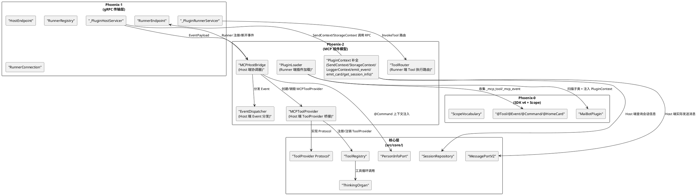
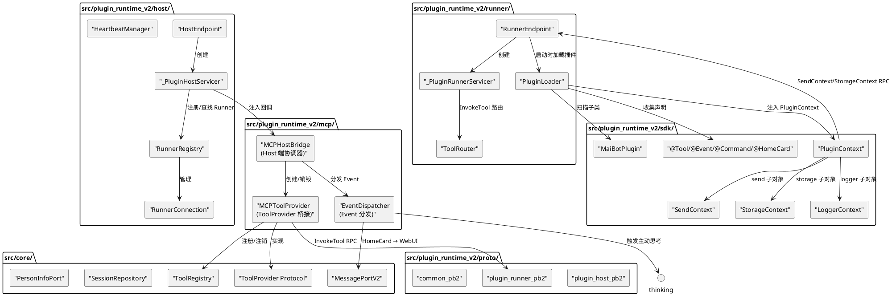
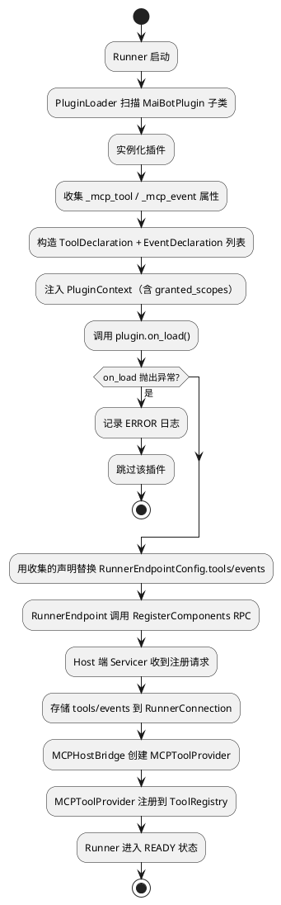
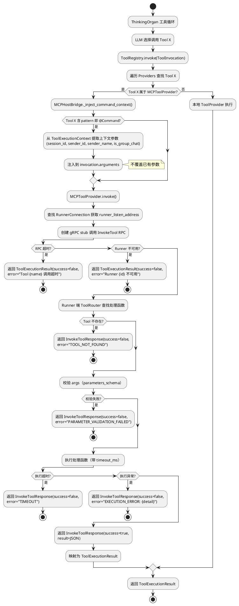
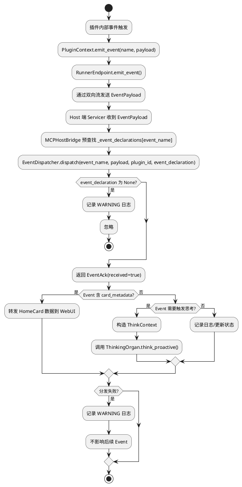
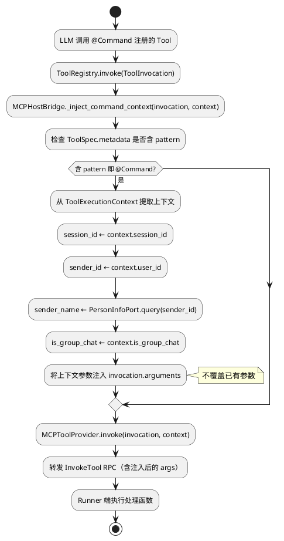
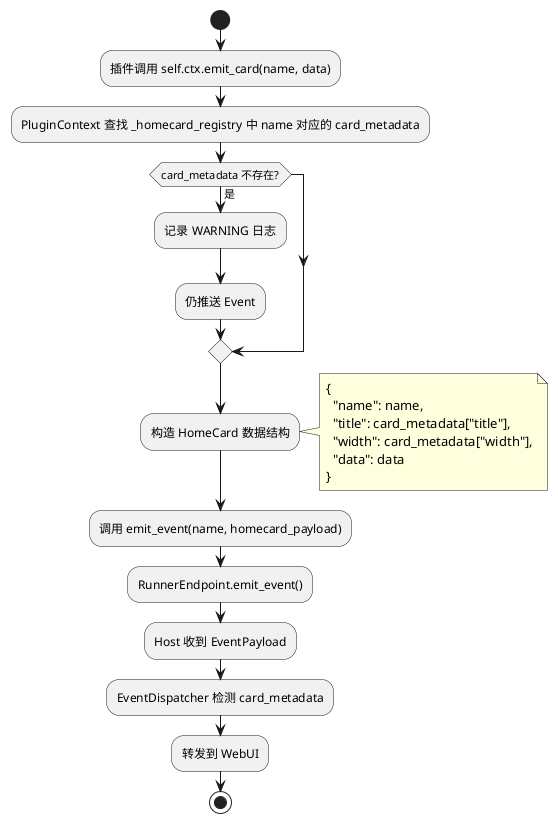
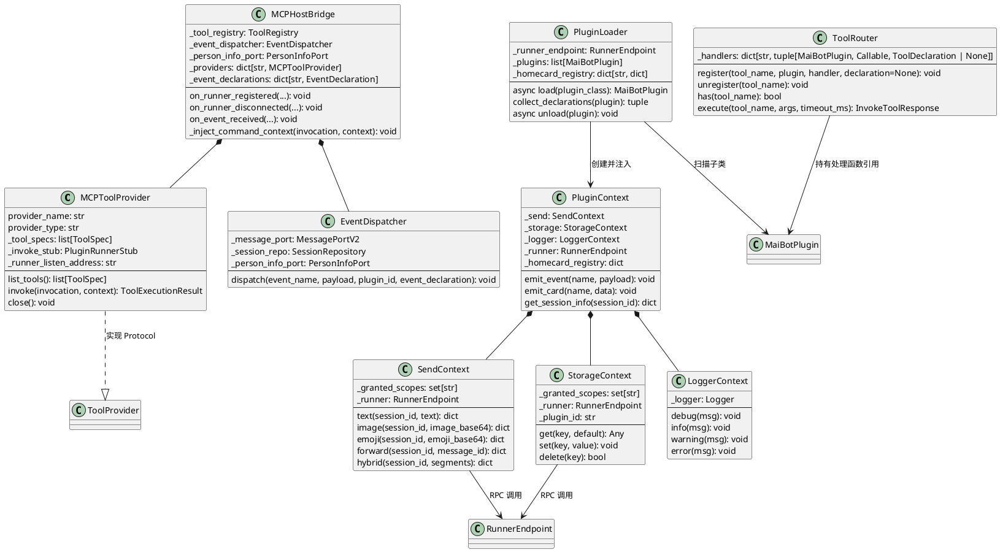

# Phoenix-2：MCP 组件模型 — 增量设计方案

# 一、需求与存量功能关系分析

## 1.1 需求功能与存量功能对比

### 1.1.1 已实现功能

| 需求功能 | 存量功能 | 代码位置 | 匹配度 |
|---------|---------|---------|--------|
| SDK v4 MaiBotPlugin 基类 | MaiBotPlugin 基类（plugin_id/scopes/ctx/on_load/on_unload/on_config_update） | `src/plugin_runtime_v2/sdk/plugin.py:15-45` | 100% |
| SDK v4 @Tool 装饰器 | @Tool 装饰器（name/description/parameters_schema/output_schema → func._mcp_tool） | `src/plugin_runtime_v2/sdk/decorators.py:34-66` | 100% |
| SDK v4 @Event 装饰器 | @Event 装饰器（name/description/event_schema → func._mcp_event） | `src/plugin_runtime_v2/sdk/decorators.py:69-97` | 100% |
| SDK v4 @Command 装饰器 | @Command 装饰器（底层为 @Tool，含 pattern） | `src/plugin_runtime_v2/sdk/decorators.py:100-131` | 100% |
| SDK v4 @HomeCard 装饰器 | @HomeCard 装饰器（底层为 @Event，含 card_metadata） | `src/plugin_runtime_v2/sdk/decorators.py:134-168` | 100% |
| SDK v4 ToolDeclaration 数据类 | ToolDeclaration（frozen dataclass，含 name/description/parameters_schema/output_schema/pattern） | `src/plugin_runtime_v2/sdk/decorators.py:14-21` | 100% |
| SDK v4 EventDeclaration 数据类 | EventDeclaration（frozen dataclass，含 name/description/event_schema/card_metadata） | `src/plugin_runtime_v2/sdk/decorators.py:24-31` | 100% |
| SDK v4 PluginContext 骨架 | PluginContext（send/storage/logger 子对象 + emit_event/emit_card 占位） | `src/plugin_runtime_v2/sdk/context.py:128-167` | 75% |
| SDK v4 ScopeDeniedError | ScopeDeniedError 异常类 | `src/plugin_runtime_v2/sdk/context.py:12-13` | 100% |
| SDK v4 SendContext + Scope 校验 | SendContext（5 个方法 + _SCOPE_CHECK + _check_scope） | `src/plugin_runtime_v2/sdk/context.py:16-73` | 75% |
| SDK v4 StorageContext + Scope 校验 | StorageContext（get/set/delete + scope 校验） | `src/plugin_runtime_v2/sdk/context.py:76-106` | 75% |
| SDK v4 LoggerContext | LoggerContext（debug/info/warning/error 占位） | `src/plugin_runtime_v2/sdk/context.py:109-125` | 50% |
| Host 端 HostEndpoint | HostEndpoint（start/stop/get_status/listen_address） | `src/plugin_runtime_v2/host/endpoint.py:40-121` | 100% |
| Host 端 PluginHostServicer | _PluginHostServicer（Connect 双向流 + RegisterComponents 一元 RPC） | `src/plugin_runtime_v2/host/servicer.py:51-336` | 100% |
| Host 端 RunnerRegistry | RunnerRegistry（register/unregister/get/get_all/has） | `src/plugin_runtime_v2/host/registry.py:8-45` | 100% |
| Host 端 RunnerConnection | RunnerConnection（状态机 + tools/events 列表 + to_snapshot） | `src/plugin_runtime_v2/host/connection.py:47-100` | 100% |
| Host 端 HeartbeatManager | HeartbeatManager（start/stop/record_response） | `src/plugin_runtime_v2/host/heartbeat.py` | 100% |
| Runner 端 RunnerEndpoint | RunnerEndpoint（start/stop/emit_event/state/is_ready） | `src/plugin_runtime_v2/runner/endpoint.py:45-301` | 100% |
| Runner 端 PluginRunnerServicer | _PluginRunnerServicer（InvokeTool 占位，返回 NOT_IMPLEMENTED） | `src/plugin_runtime_v2/runner/servicer.py:16-29` | 50% |
| Runner 端 ReconnectPolicy | ReconnectPolicy（指数退避重连） | `src/plugin_runtime_v2/runner/reconnect.py:37-56` | 100% |
| .proto Schema | 3 个 .proto 文件 + 6 个生成代码 | `src/plugin_runtime_v2/proto/` | 100% |
| Scope 词汇表 | ScopeVocabulary（54 个 ScopeEntry + validate/lookup/map_capability） | `src/plugin_runtime_v2/scope/vocabulary.py:221-242` | 100% |
| 核心 ToolProvider Protocol | ToolProvider（list_tools/invoke/close + provider_name/provider_type） | `src/core/tooling.py:230-254` | 100% |
| 核心 ToolRegistry | ToolRegistry（register_provider/unregister_provider/list_tools/invoke） | `src/core/tooling.py:257-414` | 100% |
| 核心 ToolSpec | ToolSpec（name/description/parameters_schema/output_schema/provider_name/provider_type/metadata） | `src/core/tooling.py:78-152` | 100% |
| 核心 ToolInvocation | ToolInvocation（tool_name/arguments/call_id/session_id/metadata） | `src/core/tooling.py:155-165` | 100% |
| 核心 ToolExecutionResult | ToolExecutionResult（tool_name/success/content/error_message/structured_content） | `src/core/tooling.py:194-227` | 100% |
| 核心 ToolExecutionContext | ToolExecutionContext（session_id/user_id/is_group_chat/metadata） | `src/core/tooling.py:168-179` | 100% |
| Manifest v3 格式 | ManifestV3（manifest_version=3/scopes/dependencies/i18n） | `src/plugin_runtime_v2/sdk/manifest.py:49-81` | 100% |

**匹配度评估依据**：
- **100%**：Phoenix-0/1 已完整实现，Phoenix-2 直接使用或仅扩展调用点
- **75%**：骨架已实现，方法体为占位（如 SendContext.text 返回 mock dict），Phoenix-2 补全实际 RPC 调用
- **50%**：接口签名已定义但核心逻辑未实现（如 LoggerContext 方法体为 pass，PluginRunnerServicer.InvokeTool 返回 NOT_IMPLEMENTED）

### 1.1.2 需要扩展的功能

| 需求功能 | 存量功能 | 差异说明 | 扩展方向 |
|---------|---------|---------|---------|
| PluginContext.send 实际发送 | SendContext 方法体返回 mock dict | 当前 text/image/emoji/forward/hybrid 只做 scope 校验后返回占位 dict，不实际通过 RPC 发送消息。Phoenix-2 需通过 Runner→Host 能力调用通道实际发送 | Phoenix-4 实现（Phoenix-2 保留 scope 校验 + 占位返回，标注 `# TODO: Phoenix-4 实现 RPC 通道`） |
| PluginContext.storage 实际读写 | StorageContext 方法体返回默认值 | 当前 get/set/delete 只做 scope 校验后返回占位值。Phoenix-2 需通过 Runner→Host 能力调用通道实际读写 | Phoenix-4 实现（Phoenix-2 保留 scope 校验 + 占位返回，标注 `# TODO: Phoenix-4 实现 RPC 通道`） |
| PluginContext.logger 实际桥接 | LoggerContext 方法体为 pass | 当前 debug/info/warning/error 方法体为空。Phoenix-2 需桥接到 `src/common/logger.py` 的 get_logger | LoggerContext 内部持有 get_logger 返回的 logger 实例，前缀为 `plugin.{plugin_id}` |
| PluginContext.emit_event 实际推送 | emit_event 方法体为 pass | 当前 emit_event 不推送 Event。Phoenix-2 需调用 RunnerEndpoint.emit_event() | emit_event 内部调用 RunnerEndpoint.emit_event() |
| PluginContext.emit_card 实际构造 | emit_card 方法体为 pass | 当前 emit_card 不构造 HomeCard 数据。Phoenix-2 需自动构造 HomeCard 数据结构并调用 emit_event | emit_card 内部查找 @HomeCard 声明的 card_metadata，构造完整数据后调用 emit_event |
| PluginContext.get_session_info | 不存在 | 当前 PluginContext 无 get_session_info 方法。Phoenix-2 需新增 | Phoenix-4 实现（Phoenix-2 新增方法签名 + scope 校验 + 占位返回，标注 `# TODO: Phoenix-4 实现 RPC 通道`） |
| PluginRunnerServicer.InvokeTool 实际路由 | InvokeTool 返回 NOT_IMPLEMENTED | 当前所有 Tool 调用返回失败。Phoenix-2 需根据 tool_name 查找 @Tool 处理函数并执行 | _PluginRunnerServicer 注入 Tool 路由表，InvokeTool 内查找并执行处理函数 |
| Host 端 ToolProvider 桥接 | 不存在 | 当前 Host 端未实现 ToolProvider Protocol。Runner 注册组件后 tools 仅存储在 RunnerConnection 中，未桥接到 ToolRegistry | 新建 MCPToolProvider 类实现 ToolProvider Protocol，在 Runner 注册/断开时注册/注销到 ToolRegistry |
| Host 端 Event 分发 | Servicer 仅返回 EventAck | 当前 Connect 双向流中收到 EventPayload 后仅记录 debug 日志并返回 EventAck，未分发到核心事件系统 | Servicer 收到 EventPayload 后调用 EventDispatcher 分发，EventDispatcher 根据类型分发到核心事件系统或 WebUI |
| 装饰器收集机制 | 装饰器仅设置 func._mcp_tool/_mcp_event | 当前 @Tool/@Event 装饰器只在函数对象上设置属性，无自动收集机制。Phoenix-2 需 Runner 启动时扫描插件类收集所有声明 | Runner 启动时通过 inspect 扫描 MaiBotPlugin 子类的方法，收集 _mcp_tool/_mcp_event 属性 |
| @Command 上下文注入 | 不存在 | 当前 @Command 注册的 Tool 被 LLM 调用时无上下文注入。Phoenix-2 需自动注入 session_id/sender_id/sender_name/is_group_chat | MCPHostBridge 层负责上下文注入：MCPHostBridge 在调用 MCPToolProvider.invoke 之前，检测 Tool 是否含 pattern（@Command），若是则从 ToolExecutionContext 提取上下文参数注入到 invocation.arguments 中。MCPHostBridge 持有 PersonInfoPort 用于查询 sender_name |
| @HomeCard 自动构造 | 不存在 | 当前 @HomeCard 注册的 Event 无自动构造逻辑。Phoenix-2 需 emit_card 自动查找 card_metadata 构造完整数据 | PluginContext.emit_card 内部查找 _homecard_registry 中的 card_metadata，构造完整 HomeCard 数据后调用 emit_event |

### 1.1.3 需要新增的功能或接口

**Host 端 MCPToolProvider**（`src/plugin_runtime_v2/mcp/tool_provider.py`）：
- 实现 ToolProvider Protocol，将远程插件的 ToolDeclaration 映射为 ToolSpec
- 输入：plugin_id, runner_id, tool_declarations, InvokeTool RPC stub
- 输出：list_tools() 返回 ToolSpec 列表，invoke() 转发 InvokeTool RPC
- 核心逻辑：ToolDeclaration→ToolSpec 映射、InvokeTool RPC 调用、Runner 断开时注销

**Host 端 EventDispatcher**（`src/plugin_runtime_v2/mcp/event_dispatcher.py`）：
- 接收 EventPayload，根据 event_name 查找 EventDeclaration，分发到核心事件系统
- 输入：EventPayload（event_name + payload JSON）
- 输出：分发到 ThinkingOrgan.think_proactive() 或 WebUI
- 核心逻辑：Event 类型判断（普通 Event vs HomeCard）、分发失败隔离

**Runner 端 ToolRouter**（`src/plugin_runtime_v2/runner/tool_router.py`）：
- 根据 tool_name 查找 @Tool/@Command 装饰器注册的处理函数并执行
- 输入：tool_name, args JSON, timeout_ms
- 输出：InvokeToolResponse（success/result/error）
- 核心逻辑：处理函数查找、参数校验、执行超时、异常捕获

**Runner 端 PluginLoader**（`src/plugin_runtime_v2/runner/plugin_loader.py`）：
- 扫描 MaiBotPlugin 子类，收集装饰器声明，管理插件生命周期
- 输入：MaiBotPlugin 子类
- 输出：ToolDeclaration 列表 + EventDeclaration 列表
- 核心逻辑：inspect 扫描、on_load/on_unload 调用、PluginContext 注入

**Host 端 MCPHostBridge**（`src/plugin_runtime_v2/mcp/host_bridge.py`）：
- 协调 MCPToolProvider 注册/注销和 EventDispatcher 分发
- 输入：Runner 注册/断开事件
- 输出：ToolRegistry 注册/注销、Event 分发
- 核心逻辑：Runner 注册成功时创建 MCPToolProvider 并注册到 ToolRegistry，Runner 断开时注销

**SDK v4 PluginContext 补全**（`src/plugin_runtime_v2/sdk/context.py`）：
- SendContext/StorageContext 注入 RunnerEndpoint 引用，方法内实际调用 RPC
- LoggerContext 桥接到 get_logger
- 新增 emit_event/emit_card/get_session_info 实际实现

## 1.2 存量功能详细分析

### 1.2.1 SDK v4 装饰器（`src/plugin_runtime_v2/sdk/decorators.py`）

**接口契约**：
- `@Tool(name, description, parameters_schema=None, output_schema=None)` → 设置 `func._mcp_tool = ToolDeclaration(...)`
- `@Event(name, description, event_schema=None)` → 设置 `func._mcp_event = EventDeclaration(...)`
- `@Command(name, pattern, description="", parameters_schema=None)` → 设置 `func._mcp_tool = ToolDeclaration(..., pattern=pattern)`
- `@HomeCard(name, title="", description="", width="medium")` → 设置 `func._mcp_event = EventDeclaration(..., card_metadata={title, width})`

**业务规则**：
- @Command 底层为 @Tool，pattern 存储在 ToolDeclaration.pattern 字段
- @HomeCard 底层为 @Event，card_metadata 存储在 EventDeclaration.card_metadata 字段
- 装饰器只设置函数属性，不做收集——收集由 Runner 端 PluginLoader 负责

**约束**：
- Phoenix-2 不修改装饰器签名，只扩展收集和使用逻辑
- @HomeCard 的 width 参数当前无校验，Phoenix-2 需增加 "small"/"medium"/"large"/"wide"/"full" 校验

### 1.2.2 SDK v4 PluginContext（`src/plugin_runtime_v2/sdk/context.py`）

**接口契约**：
- `PluginContext(plugin_id, granted_scopes)` → 初始化 send/storage/logger 子对象
- `SendContext(granted_scopes)` → 5 个发送方法 + _SCOPE_CHECK + _check_scope
- `StorageContext(granted_scopes)` → get/set/delete + scope 校验
- `LoggerContext(plugin_id)` → debug/info/warning/error（当前为 pass）
- `emit_event(name, payload)` / `emit_card(name, data)` → 当前为 pass

**业务规则**：
- SendContext._SCOPE_CHECK 定义了 5 个方法到 scope 的映射（text→message:send:text 等）
- _check_scope 在每个方法调用前校验 scope，未授权抛出 ScopeDeniedError
- granted_scopes 为 set[str]，来自 HelloPayload.scopes 经 Host 审批后的子集

**扩展点**：
- SendContext/StorageContext 的 RPC 调用由 Phoenix-4 实现，Phoenix-2 保留 scope 校验 + 占位返回
- LoggerContext 需持有 get_logger 实例
- PluginContext 需新增 get_session_info 方法（RPC 调用由 Phoenix-4 实现）
- emit_event/emit_card 需实际调用 RunnerEndpoint.emit_event()

**约束**：
- 所有方法必须先校验 scope 再调用 RPC
- emit_event/emit_card 无特定 scope 要求（Event 已注册即可推送）
- logger 方法无需 scope 校验

### 1.2.3 Host 端 _PluginHostServicer（`src/plugin_runtime_v2/host/servicer.py`）

**接口契约**：
- `Connect(request_iterator, context)` → 双向流：握手 → 消息循环
- `RegisterComponents(request, context)` → 一元 RPC：组件注册
- `request_shutdown(runner_id, reason, drain_ms)` → 向 Runner 发送 ShutdownRequest
- `_cleanup_connection(runner_id)` → 清理 Runner 连接资源

**业务规则**：
- Connect 双向流中，收到 EventPayload 时仅记录 debug 日志并返回 EventAck
- RegisterComponents 成功后，将 tools/events 存储到 RunnerConnection
- _resolve_runner_id 通过 peer 地址匹配 runner_id

**扩展点**：
- 收到 EventPayload 后需调用 EventDispatcher 分发
- RegisterComponents 成功后需触发 MCPHostBridge 注册 MCPToolProvider
- _cleanup_connection 中需触发 MCPHostBridge 注销 MCPToolProvider

**约束**：
- Phoenix-2 不重构 Servicer 核心逻辑，只在关键点注入回调
- Event 分发失败不得影响 EventAck 返回

### 1.2.4 Runner 端 _PluginRunnerServicer（`src/plugin_runtime_v2/runner/servicer.py`）

**接口契约**：
- `InvokeTool(request, context)` → 当前返回 NOT_IMPLEMENTED

**业务规则**：
- Phoenix-1 占位实现，所有 Tool 调用返回 success=false, error="NOT_IMPLEMENTED"

**扩展点**：
- Phoenix-2 需注入 ToolRouter，InvokeTool 内查找并执行处理函数
- 处理函数返回 dict[str, Any]，序列化为 JSON 放入 InvokeToolResponse.result
- 异常捕获：处理函数抛出异常 → EXECUTION_ERROR，超时 → TIMEOUT，参数校验失败 → PARAMETER_VALIDATION_FAILED

**约束**：
- 不修改 InvokeTool 方法签名
- Runner 关停期间收到 InvokeTool → 返回 SHUTTING_DOWN

### 1.2.5 核心 ToolProvider Protocol（`src/core/tooling.py`）

**接口契约**：
- `provider_name: str` / `provider_type: str` — Provider 标识
- `list_tools(context=None) -> list[ToolSpec]` — 列出工具
- `invoke(invocation, context=None) -> ToolExecutionResult` — 执行工具
- `close() -> None` — 释放资源

**业务规则**：
- ToolRegistry.register_provider 按 provider_name 去重（先注册的优先）
- ToolRegistry.invoke 遍历 providers 查找匹配工具
- invoke 中 Provider 抛出异常时，ToolRegistry 捕获并返回 ToolExecutionResult(success=false)

**扩展点**：
- MCPToolProvider 需实现此 Protocol，provider_type = "mcp_remote"
- list_tools 返回缓存的 ToolSpec 列表（不重新构造）
- invoke 将 ToolInvocation 转发为 InvokeTool RPC，将 InvokeToolResponse 映射为 ToolExecutionResult

**约束**：
- MCPToolProvider 不得绕过 ToolRegistry 的去重逻辑
- invoke 超时/失败时返回 ToolExecutionResult(success=false)，不得抛出未捕获异常

### 1.2.6 Runner 端 RunnerEndpoint（`src/plugin_runtime_v2/runner/endpoint.py`）

**接口契约**：
- `start()` → 连接 Host、握手、注册、进入接收循环
- `stop()` → 断开连接、停止服务
- `emit_event(event_name, payload)` → 推送 Event 到 Host
- `state` / `is_ready` — 连接状态

**业务规则**：
- emit_event 通过双向流写入 RunnerMessage(event=EventPayload(...))
- 状态非 READY 时 emit_event 抛出 ConnectionError
- _connect_and_handshake 中 RegisterComponents 使用 RunnerEndpointConfig.tools/events 构造 proto 声明

**扩展点**：
- Phoenix-2 需在 start() 中加入 PluginLoader 逻辑：扫描插件类 → 收集声明 → 注入 PluginContext → 调用 on_load → 用收集到的声明替换 config.tools/events
- PluginContext 的 send/storage/logger 需持有 RunnerEndpoint 引用以调用 RPC

**约束**：
- 不修改 start/stop/emit_event 核心逻辑
- 插件 on_load 在 RegisterComponents 之前调用

### 1.2.7 v1 Supervisor 参考（`src/plugin_runtime/host/supervisor.py`）

**接口契约**：
- `invoke_plugin(method, plugin_id, component_name, args, timeout_ms)` → 调用插件
- `dispatch_event(event_type, message, extra_args)` → 分发事件
- `invoke_hook(hook_name, **kwargs)` → 触发 Hook

**业务规则**：
- 8 种组件类型注册和分发（ACTION/COMMAND/TOOL/EVENT_HANDLER/HOOK_HANDLER/MESSAGE_GATEWAY/HOME_CARD/API）
- ComponentRegistry 按类型注册、命名空间（plugin_id.name）、命令正则匹配
- CapabilityService 60+ capabilities 注册和分发

**参考价值**：
- v1 的组件注册和分发逻辑是 Phoenix-2 的行为对照参考
- Phoenix-2 将 8 种组件收敛为 Tool + Event 两种，但行为语义不变
- v1 的 Command 正则匹配逻辑在 Phoenix-2 中简化为 pattern 元数据

**约束**：
- v2 禁止导入 v1 模块，仅作为行为参考

# 二、增量设计方案

## 2.1 实现模型

### 2.1.1 上下文视图



### 2.1.2 服务/组件总体架构



### 2.1.3 实现设计文档

#### 2.1.3.1 插件加载→装饰器收集→组件注册流程



#### 2.1.3.2 LLM 工具调用→InvokeTool RPC→Tool 执行→结果返回流程



#### 2.1.3.3 Event 推送→Host 分发→核心事件系统流程



#### 2.1.3.4 @Command 自动注入上下文流程



#### 2.1.3.5 @HomeCard 自动构造卡片流程



## 2.2 接口设计

### 2.2.1 总体设计

**接口分类**：

| 分类 | 接口 | 稳定性 | 说明 |
|------|------|--------|------|
| Host 端 MCP | MCPToolProvider | 稳定 | 实现 ToolProvider Protocol，桥接远程 Tool |
| Host 端 MCP | EventDispatcher | 稳定 | Event 分发到核心事件系统 |
| Host 端 MCP | MCPHostBridge | 内部 | 协调 ToolProvider 注册/注销和 Event 分发 |
| Runner 端 MCP | PluginLoader | 稳定 | 插件类扫描、装饰器收集、生命周期管理 |
| Runner 端 MCP | ToolRouter | 内部 | Tool 执行路由（tool_name → 处理函数） |
| SDK v4 扩展 | PluginContext | 稳定 | 补全 send/storage/logger/emit_event/emit_card/get_session_info |
| SDK v4 扩展 | SendContext | 稳定 | 补全实际 RPC 发送 |
| SDK v4 扩展 | StorageContext | 稳定 | 补全实际 RPC 读写 |
| SDK v4 扩展 | LoggerContext | 稳定 | 补全实际日志桥接 |

**接口变更策略**：
- SDK v4 公共 API（MaiBotPlugin、装饰器、PluginContext）签名不变，只补全方法实现
- MCPToolProvider/EventDispatcher 是新增模块，不影响 Phoenix-0/1 代码
- Host/Runner 端通过注入回调扩展，不修改核心逻辑

### 2.2.2 接口清单

#### 2.2.2.1 MCPToolProvider

```python
class MCPToolProvider:
    """Host 端 ToolProvider 桥接 — 将远程插件的 Tool 桥接到本地 ToolRegistry。

    实现 ToolProvider Protocol，将 Runner 上报的 ToolDeclaration 映射为 ToolSpec，
    将 ToolInvocation 转发为 InvokeTool RPC 调用。

    注意：Phoenix-2 阶段假设 1 Runner = 1 Plugin。
    """

    provider_name: str  # 等于 plugin_id
    provider_type: str  # 固定为 "mcp_remote"

    def __init__(
        self,
        plugin_id: str,
        runner_id: str,
        tool_declarations: list[ToolDeclaration],  # protobuf 对象
        runner_listen_address: str,
    ) -> None:
        """初始化 MCPToolProvider。

        在 __init__ 中创建 gRPC channel 和 stub，避免每次 invoke 创建新连接。
        close() 中关闭 channel。

        Args:
            plugin_id: 插件 ID
            runner_id: Runner 标识
            tool_declarations: Runner 上报的 Tool 声明列表
            runner_listen_address: Runner 的 InvokeTool 侦听地址
        """

    async def list_tools(
        self, context: ToolAvailabilityContext | None = None,
    ) -> list[ToolSpec]:
        """返回缓存的 ToolSpec 列表。

        前置条件：__init__ 中已完成 ToolDeclaration→ToolSpec 映射。
        后置条件：返回缓存的列表，不重新构造。
        """

    async def invoke(
        self, invocation: ToolInvocation, context: ToolExecutionContext | None = None,
    ) -> ToolExecutionResult:
        """转发 ToolInvocation 为 InvokeTool RPC。

        注意：@Command 上下文注入由 MCPHostBridge._inject_command_context() 在调用
        本方法之前完成，本方法只做纯粹的 RPC 转发。

        前置条件：Runner 处于 READY 状态。
        后置条件：返回 ToolExecutionResult。
        异常映射：
            - RPC 超时 → success=false, error="Tool {name} 调用超时"
            - Runner 不可用 → success=false, error="Runner {id} 不可用"
            - RPC 异常 → success=false, error="{exc.__class__.__name__}: {detail}"
        """

    async def close(self) -> None:
        """释放资源 — 关闭 gRPC channel。"""
```

**ToolDeclaration → ToolSpec 映射规则**：

| protobuf ToolDeclaration 字段 | ToolSpec 字段 | 转换逻辑 |
|------------------------------|---------------|---------|
| name | name | 直接映射 |
| description | description | 直接映射 |
| parameters_schema | parameters_schema | JSON 字符串 → dict（json.loads），剥离 `x-maibot-command-pattern` 扩展字段后赋值给 ToolSpec.parameters_schema，剥离出的值赋值给 ToolSpec.metadata["pattern"]；json.loads 失败时记录 WARNING 日志（含 tool_name 和原始 schema）并跳过该 Tool |
| output_schema | output_schema | JSON 字符串 → dict（json.loads），失败时设为 None |
| — | provider_name | 等于 plugin_id |
| — | provider_type | 固定 "mcp_remote" |
| — | metadata | 初始为空 dict；从 parameters_schema 剥离的 `x-maibot-command-pattern` 值赋值给 metadata["pattern"] |

**@Command pattern 映射**：
- Runner 上报的 ToolDeclaration 无 pattern 字段（.proto 未定义）
- Phoenix-2 在 RegisterComponentsRequest 中通过 ToolDeclaration 的 metadata 扩展传递 pattern
- **最终方案**：Runner 端 PluginLoader 收集声明时，将 @Command 的 pattern 存入 ToolDeclaration 的 `parameters_schema` 的 `x-maibot-command-pattern` 扩展字段；Host 端 MCPToolProvider 映射时**从 parameters_schema 中剥离 `x-maibot-command-pattern` 扩展字段**，只将清理后的 schema 赋值给 ToolSpec.parameters_schema，剥离出的值赋值给 ToolSpec.metadata["pattern"]

**InvokeToolResponse → ToolExecutionResult 映射规则**：

| protobuf InvokeToolResponse 字段 | ToolExecutionResult 字段 | 转换逻辑 |
|----------------------------------|-------------------------|---------|
| success | success | 直接映射 |
| result | content | 直接映射（JSON 字符串） |
| error | error_message | 直接映射 |

#### 2.2.2.2 EventDispatcher

```python
class EventDispatcher:
    """Host 端 Event 分发器 — 将 Runner 推送的 Event 分发到核心事件系统。"""

    def __init__(
        self,
        message_port: MessagePortV2,
        session_repo: SessionRepository,
        person_info_port: PersonInfoPort,
    ) -> None:
        """初始化 EventDispatcher。

        Args:
            message_port: 消息发送接口（HomeCard 转发到 WebUI）
            session_repo: 会话查询接口
            person_info_port: 人物信息查询接口
        """

    async def dispatch(
        self,
        event_name: str,
        payload: dict[str, Any],
        plugin_id: str,
        event_declaration: EventDeclaration | None,  # 单个声明，由 MCPHostBridge 预查找
    ) -> None:
        """分发 Event 到核心事件系统。

        前置条件：event_declaration 已由 MCPHostBridge 预查找匹配。
        后置条件：Event 分发完成或失败已记录。
        异常：分发失败仅记录 WARNING 日志，不抛出。

        Args:
            event_name: 事件名称
            payload: 事件载荷（已解析为 dict）
            plugin_id: 插件 ID
            event_declaration: 匹配的 Event 声明（None 表示未注册）
        """
```

**Event 分发策略**：

| Event 类型 | 判断依据 | 分发目标 | 说明 |
|-----------|---------|---------|------|
| HomeCard | EventDeclaration 含 card_metadata | WebUI | 转发 HomeCard 数据 |
| 触发思考 | event_name 在预定义列表中（如 timer、environment_change） | ThinkingOrgan.think_proactive() | 触发智能体主动思考 |
| 普通 Event | 其他 | 日志记录 | 仅记录 INFO 日志 |

**设计决策**：Phoenix-2 阶段，Event 分发策略采用简单规则判断（event_name 匹配预定义列表），不引入复杂的 Event 路由表。后续可扩展为 Event→Handler 注册机制。

#### 2.2.2.3 MCPHostBridge

```python
class MCPHostBridge:
    """Host 端 MCP 协调器 — 协调 ToolProvider 注册/注销和 Event 分发。

    注意：Phoenix-2 阶段假设 1 Runner = 1 Plugin。
    """

    def __init__(
        self,
        tool_registry: ToolRegistry,
        event_dispatcher: EventDispatcher,
        person_info_port: PersonInfoPort,
    ) -> None:
        """初始化 MCPHostBridge。

        Args:
            tool_registry: 核心 ToolRegistry，MCPToolProvider 注册到其中
            event_dispatcher: Event 分发器
            person_info_port: 人物信息查询接口，用于 @Command 上下文注入
        """

    def _inject_command_context(
        self, invocation: ToolInvocation, context: ToolExecutionContext | None,
    ) -> None:
        """为 @Command 注册的 Tool 注入群消息上下文参数。

        检测 Tool 是否含 pattern（@Command），若是则从 ToolExecutionContext
        提取上下文参数注入到 invocation.arguments 中。

        注入参数：session_id, sender_id, sender_name（通过 PersonInfoPort 查询）,
        is_group_chat。不覆盖已有参数。

        Args:
            invocation: 工具调用请求（arguments 会被原地修改）
            context: 工具执行上下文
        """

    def on_runner_registered(
        self,
        runner_id: str,
        plugin_id: str,
        tools: list[ToolDeclaration],  # protobuf 对象
        events: list[EventDeclaration],  # protobuf 对象
        runner_listen_address: str,
    ) -> None:
        """Runner 注册成功回调 — 创建 MCPToolProvider 并注册到 ToolRegistry。

        注意：Runner 重连后会重新执行 Connect 握手 + RegisterComponents，
        Servicer 会再次收到注册请求触发此回调。此方法需处理重复注册场景：
        如果该 plugin_id 已有 MCPToolProvider，先注销旧的再注册新的。

        Args:
            runner_id: Runner 标识
            plugin_id: 插件 ID
            tools: Tool 声明列表
            events: Event 声明列表
            runner_listen_address: Runner 的 InvokeTool 侦听地址
        """

    def on_runner_disconnected(self, runner_id: str, plugin_id: str) -> None:
        """Runner 断开回调 — 从 ToolRegistry 注销 MCPToolProvider。

        Args:
            runner_id: Runner 标识
            plugin_id: 插件 ID
        """

    async def on_event_received(
        self,
        runner_id: str,
        plugin_id: str,
        event_name: str,
        payload: dict[str, Any],
    ) -> None:
        """Event 接收回调 — 预查找 EventDeclaration 后分发到 EventDispatcher。

        MCPHostBridge 维护 _event_declarations: dict[str, EventDeclaration]，
        在 on_runner_registered 时从 events 列表构建映射，
        在此方法中预查找匹配的 declaration 后传给 EventDispatcher.dispatch。

        Args:
            runner_id: Runner 标识
            plugin_id: 插件 ID
            event_name: 事件名称
            payload: 事件载荷
        """
```

#### 2.2.2.4 PluginLoader

```python
class PluginLoader:
    """Runner 端插件加载器 — 扫描插件类、收集声明、管理生命周期。"""

    def __init__(self, runner_endpoint: RunnerEndpoint) -> None:
        """初始化 PluginLoader。

        Args:
            runner_endpoint: RunnerEndpoint 引用，用于 PluginContext 调用 RPC
        """

    async def load(self, plugin_class: type[MaiBotPlugin]) -> MaiBotPlugin:
        """加载单个插件：实例化 → 收集声明 → 注入 PluginContext → 调用 on_load。

        使用 inspect.iscoroutinefunction 判断 on_load 是否为协程，
        是则 await，否则直接调用。

        Args:
            plugin_class: MaiBotPlugin 子类

        Returns:
            加载后的插件实例

        Raises:
            Exception: on_load 抛出异常时上浮
        """

    def collect_declarations(
        self, plugin: MaiBotPlugin,
    ) -> tuple[list[ToolDeclaration], list[EventDeclaration]]:
        """收集插件的 Tool 和 Event 声明。

        扫描插件类中所有被 @Tool/@Event/@Command/@HomeCard 装饰的方法，
        收集 func._mcp_tool 和 func._mcp_event 属性。

        Args:
            plugin: 插件实例

        Returns:
            (tool_declarations, event_declarations)
        """

    async def unload(self, plugin: MaiBotPlugin) -> None:
        """卸载插件：调用 on_unload。

        使用 inspect.iscoroutinefunction 判断 on_unload 是否为协程，
        是则 await，否则直接调用。
        """
```

**装饰器收集算法**：
1. 使用 `inspect.getmembers(plugin, predicate=inspect.ismethod)` 扫描所有方法
2. 对每个方法检查是否有 `_mcp_tool` 属性（@Tool/@Command）或 `_mcp_event` 属性（@Event/@HomeCard）
3. 收集为 SDK 层的 ToolDeclaration/EventDeclaration 列表
4. 转换为 proto 层的 ToolDeclaration/EventDeclaration 用于 RegisterComponents RPC

**SDK 层 → proto 层转换**：

| SDK 层 ToolDeclaration 字段 | proto 层 ToolDeclaration 字段 | 转换逻辑 |
|----------------------------|------------------------------|---------|
| name | name | 直接映射 |
| description | description | 直接映射 |
| parameters_schema | parameters_schema | dict → JSON 字符串（json.dumps） |
| output_schema | output_schema | dict → JSON 字符串（json.dumps），None → "{}" |
| pattern | — | 存入 parameters_schema 的 `x-maibot-command-pattern` 扩展字段 |

| SDK 层 EventDeclaration 字段 | proto 层 EventDeclaration 字段 | 转换逻辑 |
|----------------------------|------------------------------|---------|
| name | name | 直接映射 |
| description | description | 直接映射 |
| event_schema | event_schema | dict → JSON 字符串，None → "{}" |
| card_metadata | — | 存入 event_schema 的 `x-maibot-card-metadata` 扩展字段 |

#### 2.2.2.5 ToolRouter

```python
class ToolRouter:
    """Runner 端 Tool 执行路由 — 根据 tool_name 查找处理函数并执行。"""

    def __init__(self) -> None:
        self._handlers: dict[str, tuple[MaiBotPlugin, Callable, ToolDeclaration | None]] = {}

    def register(
        self, tool_name: str, plugin: MaiBotPlugin, handler: Callable,
        declaration: ToolDeclaration | None = None,
    ) -> None:
        """注册 Tool 处理函数。

        Args:
            tool_name: 工具名称
            plugin: 插件实例（作为 self 传入处理函数）
            handler: 处理函数引用
            declaration: SDK 层 ToolDeclaration（含 parameters_schema，用于参数校验）
        """

    def unregister(self, tool_name: str) -> None:
        """注销 Tool 处理函数。"""

    def has(self, tool_name: str) -> bool:
        """判断 Tool 是否已注册。"""

    async def execute(
        self, tool_name: str, args: dict[str, Any], timeout_ms: int = 30000,
    ) -> InvokeToolResponse:
        """执行 Tool 处理函数。

        Args:
            tool_name: 工具名称
            args: 调用参数（已解析为 dict）
            timeout_ms: 超时时间

        Returns:
            InvokeToolResponse
        """
```

**Tool 执行流程**：
1. 查找 tool_name → (plugin, handler, declaration)
2. 不存在 → 返回 success=false, error="TOOL_NOT_FOUND"
3. 参数校验（使用 declaration.parameters_schema，如果 declaration 不为 None）→ 失败返回 PARAMETER_VALIDATION_FAILED
4. 执行 `handler(plugin, args)` 带 asyncio.wait_for 超时
5. 超时 → 返回 TIMEOUT
6. 异常 → 返回 EXECUTION_ERROR
7. 成功 → 返回 success=true, result=json.dumps(result)

#### 2.2.2.6 PluginContext 补全

```python
class SendContext:
    """消息发送上下文 — 补全实际 RPC 发送。"""

    def __init__(
        self,
        granted_scopes: set[str],
        runner_endpoint: RunnerEndpoint,  # 新增
    ) -> None:
        self._granted_scopes = granted_scopes
        self._runner = runner_endpoint

    async def text(self, session_id: str, text: str) -> dict[str, Any]:
        """发送文本消息。需要 message:send:text scope。

        # TODO: Phoenix-4 实现 RPC 通道
        Phoenix-2 阶段仅实现 scope 校验 + 占位返回，
        实际通过 Runner→Host 能力调用通道发送由 Phoenix-4 实现。
        Host 端通过 MessagePortV2.send_message() 发送。
        """

    # image/emoji/forward/hybrid 同理


class StorageContext:
    """键值存储上下文 — 补全实际 RPC 读写。"""

    def __init__(
        self,
        granted_scopes: set[str],
        runner_endpoint: RunnerEndpoint,  # 新增
        plugin_id: str,  # 新增
    ) -> None:
        self._granted_scopes = granted_scopes
        self._runner = runner_endpoint
        self._plugin_id = plugin_id

    async def get(self, key: str, default: Any = None) -> Any:
        """读取键值。需要 database:read:self scope。

        # TODO: Phoenix-4 实现 RPC 通道
        Phoenix-2 阶段仅实现 scope 校验 + 占位返回，
        实际通过 Runner→Host 能力调用通道读写由 Phoenix-4 实现。
        Host 端读写 plugin_id 命名空间的键值存储。
        """

    # set/delete 同理


class LoggerContext:
    """日志桥接上下文 — 补全实际日志输出。"""

    def __init__(self, plugin_id: str) -> None:
        from src.common.logger import get_logger
        self._logger = get_logger(f"plugin.{plugin_id}")

    def debug(self, msg: str, *args: Any) -> None:
        self._logger.debug(msg, *args)

    def info(self, msg: str, *args: Any) -> None:
        self._logger.info(msg, *args)

    def warning(self, msg: str, *args: Any) -> None:
        self._logger.warning(msg, *args)

    def error(self, msg: str, *args: Any) -> None:
        self._logger.error(msg, *args)


class PluginContext:
    """插件运行时上下文 — 补全所有方法实现。"""

    def __init__(
        self,
        plugin_id: str,
        granted_scopes: set[str],
        runner_endpoint: RunnerEndpoint,  # 新增
        homecard_registry: dict[str, dict[str, Any]],  # 新增：@HomeCard 的 card_metadata
    ) -> None:
        self._send = SendContext(granted_scopes, runner_endpoint)
        self._storage = StorageContext(granted_scopes, runner_endpoint, plugin_id)
        self._logger = LoggerContext(plugin_id)
        self._granted_scopes = granted_scopes
        self._runner = runner_endpoint
        self._plugin_id = plugin_id
        self._homecard_registry = homecard_registry

    async def emit_event(self, name: str, payload: dict[str, Any]) -> None:
        """推送事件 — 通过 RunnerEndpoint.emit_event() 实际推送。

        前置条件：Runner 处于 READY 状态。
        异常：ConnectionError（Runner 未连接）。
        """

    async def emit_card(self, name: str, data: dict[str, Any]) -> None:
        """推送卡片数据 — 自动构造 HomeCard 数据结构。

        从 _homecard_registry 查找 name 对应的 card_metadata，
        构造完整 HomeCard 数据后调用 emit_event。

        Args:
            name: 卡片标识（对应 @HomeCard 的 name）
            data: 卡片数据
        """

    async def get_session_info(self, session_id: str) -> dict[str, Any]:
        """查询会话信息。需要 session:read:detail scope。

        # TODO: Phoenix-4 实现 RPC 通道
        Phoenix-2 阶段仅实现 scope 校验 + 占位返回，
        实际通过 Runner→Host 能力调用通道查询 SessionRepository 由 Phoenix-4 实现。

        Returns:
            包含 session_name/platform/is_group_session 的字典
        """
```

**SendContext/StorageContext 的 RPC 调用通道设计**：

当前 .proto 未定义能力调用 RPC（如 SendMessageRequest/StorageGetRequest）。Phoenix-2 阶段采用以下方案：

**方案**：通过双向流的 RunnerMessage 扩展字段传递能力调用请求，Host 通过 HostMessage 返回响应。但 .proto 不可修改。

**最终方案**：Phoenix-2 阶段，SendContext/StorageContext 的实际 RPC 调用通过 **新增 CapabilityCall RPC** 实现——在 `plugin_runner.proto` 中新增 `service PluginRunner` 的方法不现实（不修改 proto），因此采用 **双向流内嵌能力调用** 的方式：

1. **Runner → Host 能力调用**：通过 Connect 双向流的 RunnerMessage 新增 `capability_call` oneof 字段传递——但 .proto 不可修改
2. **替代方案**：Phoenix-2 阶段，SendContext/StorageContext/get_session_info 的实际调用暂不实现 RPC 通道，保留 scope 校验逻辑，方法体标注为"Phoenix-4 实现"（能力层 Protocol 化后统一解决）

**设计决策**：Phoenix-2 聚焦于 ToolProvider 桥接、Event 分发、Tool 执行路由这三个核心链路。SendContext/StorageContext/get_session_info 的实际 RPC 调用需要能力调用通道（.proto 需新增 RPC 或 oneof 字段），属于 Phoenix-1 传输层扩展或 Phoenix-4 能力层 Protocol 化的范畴。Phoenix-2 只补全 LoggerContext 和 emit_event/emit_card（这两个走已有的双向流通道），其余保留占位。

**修正**：emit_event 已有双向流通道（RunnerMessage.event），emit_card 内部调用 emit_event，LoggerContext 直接用 get_logger。SendContext/StorageContext/get_session_info 需要新的能力调用通道，**Phoenix-2 阶段保留 scope 校验 + 占位返回，方法体标注 `# TODO: Phoenix-4 实现 RPC 通道`，实际 RPC 调用由 Phoenix-4 实现**。

## 2.3 数据模型

### 2.3.1 设计目标

1. **支持的业务场景**：
   - 插件通过 @Tool/@Event/@Command/@HomeCard 声明组件
   - Host 端将远程 Tool 桥接到本地 ToolRegistry
   - Host 端将 Event 分发到核心事件系统
   - Runner 端根据 tool_name 路由到处理函数
   - @Command 自动注入群消息上下文
   - @HomeCard 自动构造卡片数据

2. **性能目标**：
   - ToolProvider 桥接全链路延迟 ≤50ms（不含插件业务逻辑）
   - Event 分发延迟 ≤20ms
   - list_tools() 返回缓存列表，不重新构造
   - ToolRouter 查找 O(1)

3. **兼容策略**：
   - 不修改 .proto 文件和 scope/ 目录
   - 不修改 Phoenix-1 的 host/runner 核心逻辑
   - v2 禁止导入 v1 模块
   - 通过注入回调扩展 Phoenix-1 代码

### 2.3.2 模型实现

#### 2.3.2.1 文件结构

```
src/plugin_runtime_v2/
├── mcp/
│   ├── __init__.py
│   ├── tool_provider.py     # MCPToolProvider（Host 端 ToolProvider 桥接）
│   ├── event_dispatcher.py  # EventDispatcher（Host 端 Event 分发）
│   └── host_bridge.py       # MCPHostBridge（Host 端协调器）
├── host/                     # Phoenix-1 产出，只扩展
│   ├── endpoint.py           # HostEndpoint（注入 MCPHostBridge 回调）
│   ├── servicer.py           # _PluginHostServicer（注入 Event 分发回调）
│   ├── connection.py         # RunnerConnection（不变）
│   ├── registry.py           # RunnerRegistry（不变）
│   └── heartbeat.py          # HeartbeatManager（不变）
├── runner/                   # Phoenix-1 产出，只扩展
│   ├── endpoint.py           # RunnerEndpoint（注入 PluginLoader）
│   ├── servicer.py           # _PluginRunnerServicer（注入 ToolRouter）
│   ├── tool_router.py        # ToolRouter（新增）
│   ├── plugin_loader.py      # PluginLoader（新增）
│   └── reconnect.py          # ReconnectPolicy（不变）
├── sdk/                      # Phoenix-0 产出，补全实现
│   ├── plugin.py             # MaiBotPlugin（不变）
│   ├── decorators.py         # @Tool/@Event/@Command/@HomeCard（不变）
│   ├── context.py            # PluginContext（补全实现）
│   └── manifest.py           # ManifestV3（不变）
├── proto/                    # Phoenix-0 产出，不修改
└── scope/                    # Phoenix-0 产出，不修改
```

#### 2.3.2.2 核心类图



#### 2.3.2.3 Host 端回调注入点

Phoenix-2 通过以下方式扩展 Phoenix-1 的 Host 端，不修改核心逻辑：

**_PluginHostServicer 扩展**：
- `__init__` 新增 `host_bridge: MCPHostBridge | None = None` 参数
- `RegisterComponents` 成功后调用 `host_bridge.on_runner_registered(...)`
- `_cleanup_connection` 中调用 `host_bridge.on_runner_disconnected(...)`
- Connect 双向流中收到 EventPayload 后调用 `host_bridge.on_event_received(runner_id, plugin_id, event_name, payload)`

**_PluginRunnerServicer 扩展**：
- `__init__` 新增 `tool_router: ToolRouter | None = None` 参数
- `InvokeTool` 中调用 `tool_router.execute(...)` 替代 NOT_IMPLEMENTED

**HostEndpoint 扩展**：
- `__init__` 新增 `host_bridge: MCPHostBridge | None = None` 参数
- 将 host_bridge 传递给 _PluginHostServicer
- MCPHostBridge 构造时需传入 tool_registry、event_dispatcher、person_info_port

**RunnerEndpoint 扩展**：
- `__init__` 新增 `plugin_loader: PluginLoader | None = None` 参数
- `start()` 中在 RegisterComponents 之前调用 plugin_loader.load() 收集声明
- 将 tool_router 传递给 _PluginRunnerServicer

#### 2.3.2.4 日志规范

所有 Phoenix-2 代码使用 `src/common/logger.py` 的 `get_logger`，模块名前缀为 `plugin_runtime_v2.`：

| 模块 | logger 名称 | 日志级别 |
|------|------------|---------|
| MCPToolProvider | `plugin_runtime_v2.mcp.tool_provider` | INFO（Tool 注册/注销）/ WARNING（调用失败） |
| EventDispatcher | `plugin_runtime_v2.mcp.event_dispatcher` | INFO（Event 分发）/ WARNING（分发失败） |
| MCPHostBridge | `plugin_runtime_v2.mcp.host_bridge` | INFO（Runner 注册/断开） |
| PluginLoader | `plugin_runtime_v2.runner.plugin_loader` | INFO（插件加载/卸载）/ ERROR（on_load 失败） |
| ToolRouter | `plugin_runtime_v2.runner.tool_router` | INFO（Tool 执行）/ WARNING（执行失败） |

**必记日志事件**：
- MCPToolProvider 注册/注销：INFO 级别，含 plugin_id 和 tool 数量
- MCPToolProvider invoke 失败：WARNING 级别，含 tool_name、runner_id、错误信息
- EventDispatcher 分发：INFO 级别，含 event_name 和分发目标
- EventDispatcher 分发失败：WARNING 级别，含 event_name 和异常信息
- PluginLoader 插件加载：INFO 级别，含 plugin_id 和组件数量
- PluginLoader on_load 失败：ERROR 级别，含 plugin_id 和异常信息
- ToolRouter Tool 执行：INFO 级别，含 tool_name
- ToolRouter Tool 执行失败：WARNING 级别，含 tool_name 和错误类型