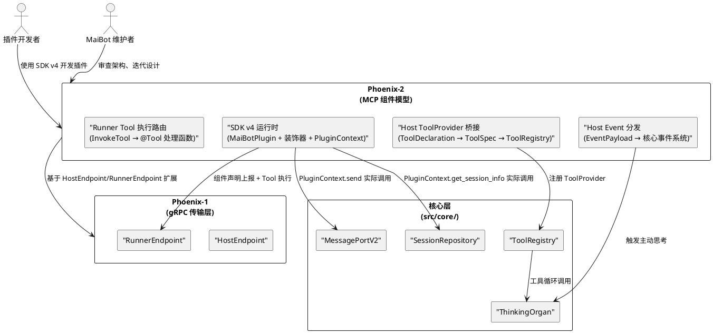
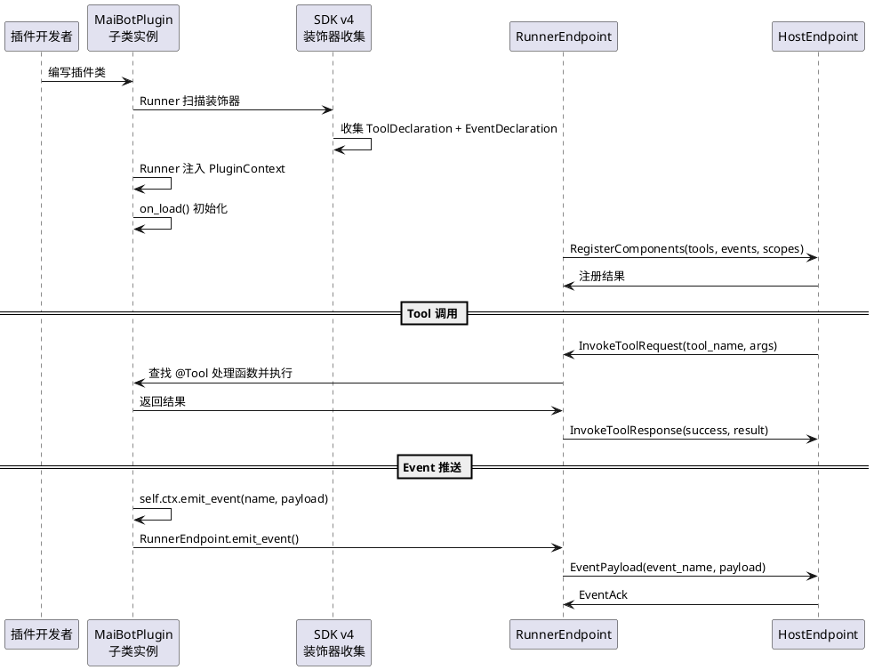
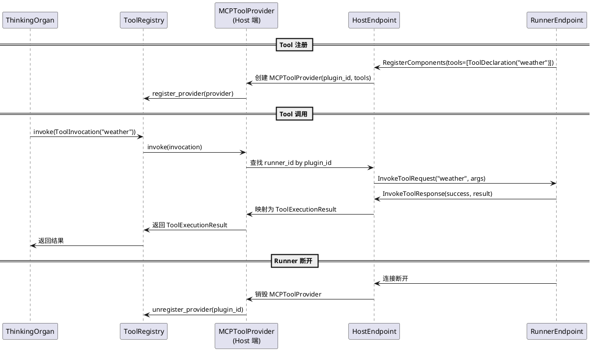
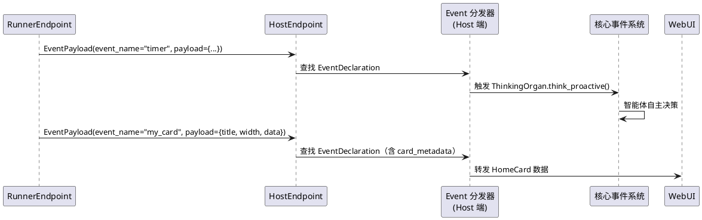
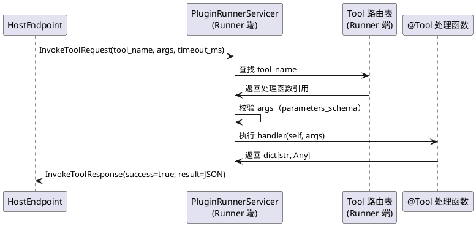
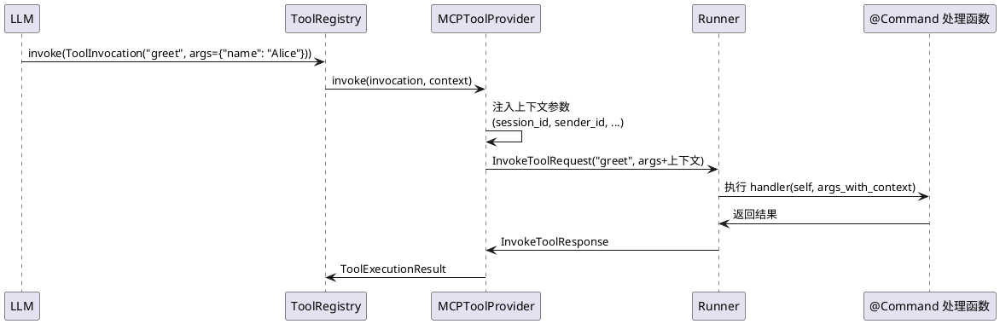
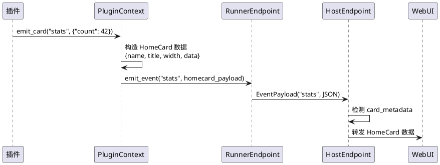

# Phoenix-2：MCP 组件模型 — 需求规格

# **1. 组件定位**

## **1.1 核心职责**

本组件负责实现 MCP Tool/Event 统一组件模型，将现有 8 种组件类型收敛为 2 种（Tool 拉取式 + Event 推送式），实现 SDK v4 运行时、Host 端 ToolProvider 桥接和 Event 分发。

## **1.2 核心输入**

1. **Phoenix-1 产出的 HostEndpoint**：`src/plugin_runtime_v2/host/` 中已实现的 gRPC 服务端，管理 Runner 连接生命周期，Runner 注册成功后携带 tools/events 声明
2. **Phoenix-1 产出的 RunnerEndpoint**：`src/plugin_runtime_v2/runner/` 中已实现的 gRPC 客户端+服务端，提供 `emit_event()` 方法和 InvokeTool 服务占位
3. **Phoenix-0 产出的 SDK v4 接口占位**：`src/plugin_runtime_v2/sdk/` 中的 MaiBotPlugin 基类、@Tool/@Event/@Command/@HomeCard 装饰器、PluginContext 上下文对象（均为占位实现，Phoenix-2 补全运行时逻辑）
4. **Phoenix-0 产出的 Scope 词汇表**：`src/plugin_runtime_v2/scope/vocabulary.py` 中的 54 个 ScopeEntry（Phoenix-2 不修改）
5. **核心 ToolProvider Protocol**：`src/core/tooling.py` 中的 ToolProvider/ToolSpec/ToolInvocation/ToolExecutionResult，Host 端需实现此 Protocol 将远程 Tool 桥接到 ToolRegistry
6. **核心 Protocol 接口**：`src/core/protocols.py` 中的 MessagePortV2、SessionRepository、PersonInfoPort 等，PluginContext 的实际能力调用需通过这些接口
7. **v1 Supervisor 参考**：`src/plugin_runtime/host/supervisor.py` 中 8 种组件的注册和分发逻辑，作为行为对照参考

## **1.3 核心输出**

1. **SDK v4 运行时实现**：补全 MaiBotPlugin 生命周期、@Tool/@Event/@Command/@HomeCard 装饰器的运行时收集、PluginContext 的实际能力调用（logger/emit_event/emit_card；send/storage/get_session_info 的 RPC 通道由 Phoenix-4 实现）
2. **Host 端 ToolProvider 桥接**：实现 ToolProvider Protocol，将远程插件的 Tool 声明映射为 ToolSpec 注册到 ToolRegistry，将 ToolInvocation 转发为 InvokeTool RPC 调用
3. **Host 端 Event 分发**：接收 Runner 推送的 EventPayload，分发到核心层的事件系统
4. **Runner 端 Tool 执行路由**：替换 Phoenix-1 的 NOT_IMPLEMENTED 占位，根据 tool_name 查找 @Tool 装饰器注册的处理函数并执行
5. **@Command 兼容层**：SDK 层自动注入群消息上下文参数（session_id, sender_id 等）
6. **@HomeCard 兼容层**：SDK 层自动构造 HomeCard 数据结构并推送

## **1.4 职责边界**

- **不修改** `src/plugin_runtime/` 下的任何现有代码（v1/v2 并行运行）
- **不修改** `src/plugin_runtime_v2/proto/` 下的 .proto 文件和生成代码
- **不修改** `src/plugin_runtime_v2/scope/` 下的 Scope 词汇表
- **不修改** Phoenix-1 的 `src/plugin_runtime_v2/host/` 和 `src/plugin_runtime_v2/runner/` 核心逻辑（只扩展，不重构）
- **不实现** Scope 授权的签发/校验逻辑（Phoenix-3 的职责）
- **不实现** 能力层 Protocol 化的代码迁移（Phoenix-4 的职责）
- **不实现** 插件进程的启动/监督（沿用 v1 的进程管理）
- **不实现** WebUI 的插件管理界面（Phoenix-3/4 的职责）

# **2. 领域术语**

**MCP Tool**
: 拉取式组件，由 Host 在工具循环中主动调用。插件声明 Tool 的名称、描述、参数 Schema，Host 将其注册到 ThinkingOrgan 的工具列表中，LLM 决定何时调用。
: 备注：替代现有 SDK v3 的 `@Tool` 和 `@Action`，Phoenix 中统一为 MCP Tool。

**MCP Event**
: 推送式组件，由插件在特定事件发生时主动推送给 Host。插件声明 Event 的名称和载荷 Schema，Host 订阅后接收推送。
: 备注：替代现有 SDK v3 的 `@EventHandler` 和 `@HookHandler`，Phoenix 中统一为 MCP Event。

**ToolProvider 桥接**
: Host 端实现 `ToolProvider` Protocol，将远程插件的 ToolDeclaration 映射为本地 ToolSpec，注册到 ToolRegistry，并将 ToolInvocation 转发为 InvokeTool RPC 调用。
: 备注：这是 MCP Tool 与 ThinkingOrgan 工具循环的关键对接点。

**Event 分发**
: Host 端收到 Runner 推送的 EventPayload 后，根据 event_name 查找对应的处理逻辑，分发到核心层的事件系统（如触发 ThinkingOrgan 主动思考、转发到 WebUI 等）。
: 备注：替代 v1 的 `Supervisor.dispatch_event`。

**@Command 兼容层**
: @Command 装饰器注册的 Tool，SDK 层自动注入群消息上下文参数（session_id, sender_id, sender_name 等），插件开发者无需手动从参数中提取。
: 备注：v1 的 Command 组件有 chat_scope 和 allowed_session 过滤，Phoenix-2 简化为 SDK 层自动注入。

**@HomeCard 兼容层**
: @HomeCard 装饰器注册的 Event，SDK 层自动构造 HomeCard 数据结构（title/width/data）并推送到 Host，Host 转发到 WebUI。
: 备注：v1 的 HomeCard 组件有专门的渲染逻辑，Phoenix-2 简化为 Event + 元数据。

**PluginContext API**
: 插件运行时上下文，提供 logger、config、emit_event、emit_card、get_session_info 等方法，替代 v3 的 `self.ctx.send`/`self.ctx.emoji` 等分散接口。
: 备注：所有方法使用 session_id 替代 v3 的 stream_id，调用前 SDK 本地校验 scope。

**ScopeDeniedError**
: 插件调用 PluginContext 方法时，如果未声明对应 scope，SDK 在本地抛出此异常，无需等待 Host 端拒绝。
: 备注：Phoenix-0 已定义占位，Phoenix-2 补全实际校验逻辑。

**ToolDeclaration（SDK 层）**
: SDK v4 中 @Tool/@Command 装饰器产生的声明信息，包含 name、description、parameters_schema、output_schema、pattern（仅 Command）。
: 备注：与 .proto 中的 ToolDeclaration 语义一致但类型不同（SDK 层是 Python dataclass，proto 层是 protobuf message）。

**EventDeclaration（SDK 层）**
: SDK v4 中 @Event/@HomeCard 装饰器产生的声明信息，包含 name、description、event_schema、card_metadata（仅 HomeCard）。
: 备注：与 .proto 中的 EventDeclaration 语义一致但类型不同。

# **3. 角色与边界**

## **3.1 核心角色**

- **插件开发者**：使用 SDK v4 开发插件的第三方开发者，需要清晰、简洁的 API 和完善的类型提示
- **MaiBot 维护者**：MaiBot 核心团队，需要可维护、可扩展的 MCP 组件模型架构

## **3.2 外部系统**

- **ThinkingOrgan**：核心思维管道，MCP Tool 通过 ToolProvider 桥接注册到其工具循环，MCP Event 可触发其主动思考
- **ToolRegistry**：统一工具注册表，Host 端的 ToolProvider 桥接需注册到其中
- **MessagePortV2**：统一消息发送接口，PluginContext.send 的实际能力通过此接口实现
- **SessionRepository**：会话查询接口，PluginContext.get_session_info 的实际能力通过此接口实现
- **PersonInfoPort**：人物信息查询接口，PluginContext 可查询人物信息
- **Phoenix-1 HostEndpoint**：gRPC 服务端，管理 Runner 连接，Phoenix-2 在其基础上扩展 ToolProvider 桥接和 Event 分发
- **Phoenix-1 RunnerEndpoint**：gRPC 客户端+服务端，Phoenix-2 替换其 InvokeTool 占位为实际 Tool 执行路由

## **3.3 交互上下文**

# **4. DFX约束**

## **4.1 性能**

1. ToolProvider 桥接的 ToolInvocation → InvokeTool RPC → ToolExecutionResult 全链路延迟（不含插件业务逻辑）必须 ≤50ms（同机通信）
2. Event 分发从 Host 收到 EventPayload 到触发核心事件系统必须 ≤20ms
3. SDK 层装饰器收集组件声明的操作必须在插件 on_load 之前完成，不得阻塞插件初始化
4. ToolProvider.list_tools() 必须返回缓存的 ToolSpec 列表，不得每次调用都重新构造

## **4.2 可靠性**

1. Runner 断开后，Host 必须自动从 ToolRegistry 注销该 Runner 的 ToolProvider，避免 ThinkingOrgan 调用不可达的 Tool
2. Runner 重连后，Host 必须重新注册该 Runner 的 ToolProvider 到 ToolRegistry
3. InvokeTool RPC 超时或失败时，ToolProvider 桥接必须返回 ToolExecutionResult(success=false)，不得抛出未捕获异常
4. Event 分发失败（如核心事件系统异常）不得影响 Host 对其他 Event 的处理

## **4.3 安全性**

1. PluginContext 的每个方法调用前必须校验 scope，未授权时抛出 ScopeDeniedError
2. Host 端 ToolProvider 桥接不得绕过 ToolRegistry 的去重逻辑
3. @Command 注入的群消息上下文参数必须来自核心层 Protocol 接口，不得由插件伪造
4. 插件通过 PluginContext 发送的消息必须经过 MessagePortV2，不得绕过核心消息管道

## **4.4 可维护性**

1. 所有 Phoenix-2 代码的日志必须使用 `src/common/logger.py` 的 `get_logger`，模块名前缀为 `plugin_runtime_v2.`
2. ToolProvider 桥接和 Event 分发的关键操作必须记录 INFO 级别日志（Tool 注册/注销、Event 分发）
3. InvokeTool 调用失败必须记录 WARNING 级别日志，包含 tool_name、runner_id、错误信息
4. SDK v4 的公共 API 必须有完整的中文文档字符串和类型注解

## **4.5 兼容性**

1. Phoenix-2 代码必须在 `src/plugin_runtime_v2/mcp/` 和 `src/plugin_runtime_v2/sdk/` 目录内，不修改 Phoenix-1 的 host/runner 核心逻辑
2. v2 代码禁止导入 v1 的任何模块（`from src.plugin_runtime` 在 v2 目录下零匹配）
3. v2 代码禁止直接导入 `global_config` 或 `config_manager`
4. SDK v4 的 Python 版本要求与主程序一致（≥3.11）
5. 不修改 .proto 文件和 scope/ 目录

# **5. 核心能力**

## **5.1 SDK v4 运行时实现**

### **5.1.1 业务规则**

1. **MaiBotPlugin 生命周期**：Runner 启动时必须按顺序执行：实例化插件 → 注入 PluginContext → 收集装饰器声明 → 调用 on_load → 上报组件声明到 Host。Runner 关停时必须调用 on_unload
   a. 验收条件：[Runner 启动] → [插件 on_load 被调用，组件声明已上报到 Host]

2. **装饰器收集**：Runner 必须自动扫描 MaiBotPlugin 子类中所有被 @Tool/@Event/@Command/@HomeCard 装饰的方法，收集为 ToolDeclaration/EventDeclaration 列表，用于 RegisterComponents 上报
   a. 验收条件：[插件定义了 3 个 @Tool 和 2 个 @Event] → [Runner 收集到 3 个 ToolDeclaration 和 2 个 EventDeclaration]

3. **PluginContext 注入**：Runner 必须在调用 on_load 之前将 PluginContext 实例注入到 self.ctx，包含已授权的 scope 集合
   a. 验收条件：[插件 on_load 中访问 self.ctx.send] → [不抛出 AttributeError]

4. **PluginContext.send 实现**：SendContext 的 text/image/emoji/forward/hybrid 方法必须校验 scope，RPC 通道由 Phoenix-4 实现
   a. 验收条件：[插件调用 self.ctx.send.text(session_id, "hello")] → [scope 校验逻辑已实现，RPC 通道由 Phoenix-4 实现]

5. **PluginContext.storage 实现**：StorageContext 的 get/set/delete 方法必须校验 scope，RPC 通道由 Phoenix-4 实现
   a. 验收条件：[插件调用 self.ctx.storage.set("key", "value")] → [scope 校验逻辑已实现，RPC 通道由 Phoenix-4 实现]

6. **PluginContext.logger 实现**：LoggerContext 的 debug/info/warning/error 方法必须桥接到 `src/common/logger.py` 的 get_logger，前缀为 `plugin.{plugin_id}`
   a. 验收条件：[插件调用 self.ctx.logger.info("test")] → [主程序日志中出现 `[plugin.org.example.my_plugin] test`]

7. **PluginContext.emit_event 实现**：emit_event 方法必须通过 RunnerEndpoint.emit_event() 推送 Event 到 Host
   a. 验收条件：[插件调用 self.ctx.emit_event("my_event", {"key": "value"})] → [Host 收到 EventPayload(event_name="my_event")]

8. **PluginContext.emit_card 实现**：emit_card 方法必须自动构造 HomeCard 数据结构（包含 name/title/width/data），通过 RunnerEndpoint.emit_event() 推送到 Host
   a. 验收条件：[插件调用 self.ctx.emit_card("my_card", {"data": 123})] → [Host 收到 EventPayload(event_name="my_card", payload 含 title/width/data)]

9. **PluginContext.get_session_info 实现**：get_session_info 方法必须校验 scope，RPC 通道由 Phoenix-4 实现
   a. 验收条件：[插件调用 self.ctx.get_session_info(session_id)] → [scope 校验逻辑已实现，RPC 通道由 Phoenix-4 实现]

10. **ScopeDeniedError 校验**：PluginContext 的每个需要 scope 的方法调用前必须本地校验 scope，未授权时抛出 ScopeDeniedError，不得发出 RPC 调用
    a. 验收条件：[插件未声明 message:send:text scope 但调用 self.ctx.send.text()] → [抛出 ScopeDeniedError，Host 未收到任何请求]

11. **禁止项**：SDK v4 禁止暴露 capabilities 概念，统一替换为 scope
    a. 验收条件：[审查 SDK v4 代码] → [不存在 `capabilities`、`capabilities_required` 等术语]

12. **禁止项**：SDK v4 禁止暴露 stream_id 概念，统一替换为 session_id
    a. 验收条件：[审查 SDK v4 代码] → [不存在 `stream_id` 参数名]

### **5.1.2 交互流程**

### **5.1.3 异常场景**

1. **插件 on_load 抛出异常**
   a. 触发条件：插件的 on_load 方法抛出未捕获异常
   b. 系统行为：Runner 记录 ERROR 日志，跳过该插件的组件注册，该插件不可用
   c. 用户感知：Host 日志记录"插件 {plugin_id} 加载失败"

2. **Tool 处理函数抛出异常**
   a. 触发条件：@Tool 装饰的方法执行时抛出未捕获异常
   b. 系统行为：Runner 捕获异常，返回 InvokeToolResponse(success=false, error="EXECUTION_ERROR: {detail}")
   c. 用户感知：LLM 收到工具执行失败的反馈

3. **ScopeDeniedError 未被插件捕获**
   a. 触发条件：插件调用 self.ctx.send.text() 但未声明 scope，且未 try-except
   b. 系统行为：异常上浮到 Tool 处理函数，Runner 捕获后返回 InvokeToolResponse(success=false, error="SCOPE_DENIED: message:send:text")
   c. 用户感知：LLM 收到工具执行失败的反馈

4. **PluginContext 方法调用时 Runner 未连接**
   a. 触发条件：插件在 Runner 断开连接后调用 self.ctx.send.text()
   b. 系统行为：SDK 抛出 ConnectionError，提示"Runner 未连接"
   c. 用户感知：插件日志记录"Runner 未连接，无法发送消息"

## **5.2 Host 端 ToolProvider 桥接**

### **5.2.1 业务规则**

1. **ToolProvider 实现**：Host 端必须实现 ToolProvider Protocol，将远程插件的 Tool 桥接到本地 ToolRegistry
   a. 验收条件：[Runner 注册成功] → [Host 创建 ToolProvider 实例并注册到 ToolRegistry]

2. **ToolDeclaration → ToolSpec 映射**：Host 必须将 Runner 上报的 ToolDeclaration 映射为 ToolSpec，映射规则：name→name, description→description, parameters_schema→parameters_schema（JSON 字符串→dict）, output_schema→output_schema（JSON 字符串→dict）, provider_name→plugin_id, provider_type→"mcp_remote"
   a. 验收条件：[Runner 上报 ToolDeclaration(name="weather")] → [ToolRegistry 中存在 ToolSpec(name="weather", provider_type="mcp_remote")]

3. **ToolInvocation → InvokeTool RPC**：Host 收到 ToolInvocation 后，必须根据 provider_name 查找对应的 Runner，通过 InvokeTool RPC 转发调用
   a. 验收条件：[ThinkingOrgan 调用 ToolInvocation(tool_name="weather")] → [Host 通过 InvokeTool RPC 调用对应 Runner]

4. **InvokeToolResponse → ToolExecutionResult 映射**：Host 必须将 InvokeToolResponse 映射为 ToolExecutionResult，映射规则：success→success, result→content（JSON 字符串→str）, error→error_message
   a. 验收条件：[Runner 返回 InvokeToolResponse(success=true, result='{"temp": 25}')] → [ToolExecutionResult(success=true, content='{"temp": 25}')]

5. **Runner 断开时注销 ToolProvider**：Runner 连接断开后，Host 必须从 ToolRegistry 注销该 Runner 的 ToolProvider
   a. 验收条件：[Runner 断开连接] → [ToolRegistry 中不存在该 Runner 的 Tool]

6. **Runner 重连时重新注册**：Runner 重连并重新注册组件后，Host 必须重新创建 ToolProvider 并注册到 ToolRegistry
   a. 验收条件：[Runner 重连成功] → [ToolRegistry 中重新出现该 Runner 的 Tool]

7. **Tool 名称冲突处理**：如果不同 Runner 注册了同名 Tool，ToolRegistry 的去重逻辑保留先注册的，Host 必须记录 WARNING 日志
   a. 验收条件：[Runner A 注册 Tool "foo"，Runner B 也注册 Tool "foo"] → [保留 Runner A 的 Tool，日志记录冲突]

8. **禁止项**：ToolProvider 桥接禁止直接导入 `src/plugin_runtime/` 下的任何模块
   a. 验收条件：[grep `from src.plugin_runtime` in src/plugin_runtime_v2/mcp/] → [零匹配]

9. **禁止项**：ToolProvider 桥接禁止直接导入 `global_config` 或 `config_manager`
   a. 验收条件：[grep `global_config\|config_manager` in src/plugin_runtime_v2/mcp/] → [零匹配]

### **5.2.2 交互流程**

### **5.2.3 异常场景**

1. **InvokeTool RPC 超时**
   a. 触发条件：Host 发送 InvokeToolRequest 后 Runner 在 timeout_ms 内未返回
   b. 系统行为：gRPC 返回 DEADLINE_EXCEEDED，ToolProvider 返回 ToolExecutionResult(success=false, error_message="Tool {tool_name} 调用超时")
   c. 用户感知：LLM 收到工具执行超时的反馈

2. **Runner 断开时 Tool 调用**
   a. 触发条件：ThinkingOrgan 调用某 Tool，但对应 Runner 已断开
   b. 系统行为：ToolProvider 检测到 Runner 不可用，返回 ToolExecutionResult(success=false, error_message="Runner {runner_id} 不可用")
   c. 用户感知：LLM 收到工具不可用的反馈

3. **ToolDeclaration 映射失败**
   a. 触发条件：ToolDeclaration 的 parameters_schema 不是合法 JSON
   b. 系统行为：Host 跳过该 Tool，记录 WARNING 日志，不影响其他 Tool 注册
   c. 用户感知：Host 日志记录"Tool {name} 参数 Schema 解析失败"

4. **InvokeToolResponse 映射失败**
   a. 触发条件：InvokeToolResponse.result 不是合法 JSON
   b. 系统行为：ToolProvider 将原始 result 字符串作为 content 返回
   c. 用户感知：LLM 收到原始字符串结果

## **5.3 Host 端 Event 分发**

### **5.3.1 业务规则**

1. **Event 接收**：Host 收到 Runner 推送的 EventPayload 后，必须根据 event_name 查找对应的 EventDeclaration，确认该 Event 已注册
   a. 验收条件：[Runner 推送 EventPayload(event_name="timer")] → [Host 查找 EventDeclaration("timer") 并确认已注册]

2. **Event 分发到核心事件系统**：Host 必须将 Event 分发到核心层的事件系统。分发策略：
   - 如果 Event 关联了 @HomeCard 元数据，转发到 WebUI
   - 如果 Event 需要触发智能体思考（如定时器、环境变化），构造 ThinkContext 调用 ThinkingOrgan.think_proactive()
   - 其他 Event 记录日志
   a. 验收条件：[Runner 推送含 card_metadata 的 Event] → [Host 转发到 WebUI]

3. **未注册 Event 处理**：Host 收到未注册的 Event（event_name 不在任何 RunnerConnection 的 events 列表中），必须记录 WARNING 日志并忽略
   a. 验收条件：[Runner 推送 EventPayload(event_name="unknown")] → [Host 记录 WARNING 日志，不触发任何分发]

4. **Event 分发失败隔离**：单个 Event 的分发失败不得影响后续 Event 的处理
   a. 验收条件：[Event A 分发抛出异常] → [Event B 正常分发]

5. **Event 与 Runner 生命周期**：Runner 断开后，Host 不得再接收该 Runner 的 Event
   a. 验收条件：[Runner 断开] → [Host 不再处理来自该 Runner 的 Event]

### **5.3.2 交互流程**

### **5.3.3 异常场景**

1. **Event 分发到核心事件系统失败**
   a. 触发条件：ThinkingOrgan.think_proactive() 抛出异常
   b. 系统行为：Host 记录 WARNING 日志，不影响后续 Event 处理
   c. 用户感知：Host 日志记录"Event {event_name} 分发失败"

2. **Event 载荷解析失败**
   a. 触发条件：EventPayload.payload 不是合法 JSON
   b. 系统行为：Host 记录 WARNING 日志，跳过该 Event
   c. 用户感知：Host 日志记录"Event {event_name} 载荷解析失败"

3. **HomeCard 转发到 WebUI 失败**
   a. 触发条件：WebUI 不可用或连接断开
   b. 系统行为：Host 记录 WARNING 日志，不重试
   c. 用户感知：WebUI 未显示卡片，Host 日志记录转发失败

## **5.4 Runner 端 Tool 执行路由**

### **5.4.1 业务规则**

1. **InvokeTool 路由**：Runner 收到 InvokeToolRequest 后，必须根据 tool_name 查找 @Tool/@Command 装饰器注册的处理函数并执行
   a. 验收条件：[Host 调用 InvokeTool(tool_name="weather", args='{"city": "Beijing"}')] → [Runner 找到 @Tool(name="weather") 处理函数并执行]

2. **Tool 执行结果返回**：Tool 处理函数必须返回 dict[str, Any]，Runner 将其序列化为 JSON 字符串放入 InvokeToolResponse.result
   a. 验收条件：[Tool 处理函数返回 {"temp": 25}] → [InvokeToolResponse(success=true, result='{"temp": 25}')]

3. **Tool 不存在**：Runner 收到未注册的 tool_name 调用时，必须返回 InvokeToolResponse(success=false, error="TOOL_NOT_FOUND")
   a. 验收条件：[Host 调用 InvokeTool(tool_name="nonexistent")] → [Runner 返回 success=false, error="TOOL_NOT_FOUND"]

4. **参数校验**：Runner 必须在调用 Tool 处理函数前校验 args 是否符合 Tool 声明的 parameters_schema。校验失败返回 InvokeToolResponse(success=false, error="PARAMETER_VALIDATION_FAILED: {detail}")
   a. 验收条件：[Host 传入不符合 parameters_schema 的 args] → [Runner 返回 success=false, error="PARAMETER_VALIDATION_FAILED"]

5. **Tool 执行超时**：Runner 必须为每个 Tool 执行设置超时（使用 InvokeToolRequest.timeout_ms），超时后返回 InvokeToolResponse(success=false, error="TIMEOUT")
   a. 验收条件：[Tool 处理函数执行超过 timeout_ms] → [Runner 返回 success=false, error="TIMEOUT"]

6. **禁止项**：Runner 端 Tool 执行路由禁止直接导入 `src/plugin_runtime/` 下的任何模块
   a. 验收条件：[grep `from src.plugin_runtime` in src/plugin_runtime_v2/runner/] → [零匹配]

### **5.4.2 交互流程**

### **5.4.3 异常场景**

1. **Tool 处理函数抛出异常**
   a. 触发条件：@Tool 装饰的方法执行时抛出未捕获异常
   b. 系统行为：Runner 捕获异常，返回 InvokeToolResponse(success=false, error="EXECUTION_ERROR: {exc.__class__.__name__}: {detail}")
   c. 用户感知：LLM 收到工具执行失败的反馈

2. **Tool 执行超时**
   a. 触发条件：Tool 处理函数执行时间超过 timeout_ms
   b. 系统行为：Runner 取消执行，返回 InvokeToolResponse(success=false, error="TIMEOUT")
   c. 用户感知：LLM 收到工具执行超时的反馈

3. **args JSON 解析失败**
   a. 触发条件：InvokeToolRequest.args 不是合法 JSON
   b. 系统行为：Runner 返回 InvokeToolResponse(success=false, error="INVALID_ARGS_JSON")
   c. 用户感知：LLM 收到工具参数错误的反馈

## **5.5 @Command 兼容层**

### **5.5.1 业务规则**

1. **@Command 底层为 Tool**：@Command 装饰器注册的组件底层必须是 MCP Tool，pattern 作为 Tool 的 metadata 传递
   a. 验收条件：[@Command(name="greet", pattern=r"^/greet")] → [产生 ToolDeclaration(name="greet", pattern=r"^/greet")]

2. **群消息上下文自动注入**：当 @Command 注册的 Tool 被 LLM 调用时，SDK 必须自动注入群消息上下文参数（session_id, sender_id, sender_name, is_group_chat），插件开发者无需手动从参数中提取
   a. 验收条件：[LLM 调用 @Command 注册的 Tool] → [Tool 处理函数的 args 中包含 session_id/sender_id/sender_name/is_group_chat]

3. **上下文参数来源**：注入的群消息上下文参数必须来自 ToolInvocation 的 session_id 和 ToolExecutionContext 的 user_id/is_group_chat，不得由插件伪造
   a. 验收条件：[审查上下文注入代码] → [session_id 来自 ToolInvocation.session_id，sender_id 来自 ToolExecutionContext.user_id]

4. **pattern 匹配**：Host 端可选实现 pattern 匹配逻辑——当用户消息匹配 @Command 的 pattern 时，LLM 优先调用此 Tool。Phoenix-2 阶段不强制实现，pattern 仅作为 Tool 的 metadata 传递
   a. 验收条件：[审查 Host 端代码] → [pattern 存储在 ToolSpec.metadata 中]

### **5.5.2 交互流程**

### **5.5.3 异常场景**

1. **上下文参数缺失**
   a. 触发条件：ToolExecutionContext 为 None 或缺少 user_id
   b. 系统行为：SDK 注入空值或默认值，不抛出异常
   c. 用户感知：Tool 处理函数收到空字符串的 sender_id

2. **pattern 格式错误**
   a. 触发条件：@Command 的 pattern 不是合法正则表达式
   b. 系统行为：SDK 在装饰器阶段抛出 ValueError
   c. 用户感知：插件启动失败，日志记录"pattern 格式错误"

## **5.6 @HomeCard 兼容层**

### **5.6.1 业务规则**

1. **@HomeCard 底层为 Event**：@HomeCard 装饰器注册的组件底层必须是 MCP Event，卡片元数据（title/width）作为 Event 的 card_metadata 传递
   a. 验收条件：[@HomeCard(name="stats", title="统计卡片", width="medium")] → [产生 EventDeclaration(name="stats", card_metadata={"title": "统计卡片", "width": "medium"})]

2. **emit_card 自动构造数据**：插件调用 self.ctx.emit_card(name, data) 时，SDK 必须自动构造完整的 HomeCard 数据结构，包含 name、title、width、data 字段，然后通过 emit_event 推送
   a. 验收条件：[self.ctx.emit_card("stats", {"count": 42})] → [Host 收到 EventPayload(event_name="stats", payload 含 title="统计卡片", width="medium", data={"count": 42})]

3. **Host 转发到 WebUI**：Host 收到含 card_metadata 的 Event 后，必须将卡片数据转发到 WebUI
   a. 验收条件：[Host 收到含 card_metadata 的 Event] → [WebUI 收到 HomeCard 数据]

4. **width 取值约束**：@HomeCard 的 width 参数必须为 "small"/"medium"/"large"/"wide"/"full" 之一，其他值在装饰器阶段抛出 ValueError
   a. 验收条件：[@HomeCard(name="test", width="invalid")] → [抛出 ValueError]

### **5.6.2 交互流程**

### **5.6.3 异常场景**

1. **emit_card 时 Runner 未连接**
   a. 触发条件：插件在 Runner 断开连接后调用 self.ctx.emit_card()
   b. 系统行为：SDK 抛出 ConnectionError
   c. 用户感知：插件日志记录"Runner 未连接，无法推送卡片"

2. **未注册的 HomeCard 名称**
   a. 触发条件：插件调用 self.ctx.emit_card("unknown_card", data)，但 "unknown_card" 未被 @HomeCard 声明
   b. 系统行为：SDK 记录 WARNING 日志，仍推送 Event（Host 端会忽略未注册 Event）
   c. 用户感知：WebUI 未显示卡片

# **6. 数据约束**

## **6.1 ToolDeclaration（SDK 层）**

1. **name**：工具名称（string, 必填, 全局唯一, 建议格式 `plugin_id.tool_name`）
2. **description**：工具描述（string, 必填, 供 LLM 理解用途）
3. **parameters_schema**：参数 JSON Schema（dict[str, Any] | None, 可选, 描述工具接受的参数）
4. **output_schema**：输出 JSON Schema（dict[str, Any] | None, 可选, 描述工具返回的结果）
5. **pattern**：命令匹配模式（string | None, 仅 @Command, 正则表达式）

## **6.2 EventDeclaration（SDK 层）**

1. **name**：事件名称（string, 必填, 全局唯一, 建议格式 `plugin_id.event_name`）
2. **description**：事件描述（string, 必填）
3. **event_schema**：事件载荷 JSON Schema（dict[str, Any] | None, 可选）
4. **card_metadata**：卡片元数据（dict[str, Any] | None, 仅 @HomeCard, 含 title/width）

## **6.3 MCPToolProvider 配置**

1. **plugin_id**：插件 ID（string, 必填, 来自 RegisterComponentsRequest）
2. **runner_id**：Runner 标识（string, 必填, 来自 HelloPayload）
3. **tool_declarations**：Tool 声明列表（list[ToolDeclaration], 来自 RegisterComponentsRequest）
4. **provider_name**：等于 plugin_id（string, 用于 ToolRegistry 去重）
5. **provider_type**：固定为 "mcp_remote"（string, 标识远程插件 Tool）

## **6.4 HomeCard 数据结构**

1. **name**：卡片标识（string, 必填, 对应 @HomeCard 的 name）
2. **title**：卡片标题（string, 来自 @HomeCard 的 title）
3. **width**：卡片宽度（string, 取值 small/medium/large/wide/full, 来自 @HomeCard 的 width）
4. **data**：卡片数据（dict[str, Any], 来自 emit_card 的 data 参数）

## **6.5 群消息上下文参数（@Command 注入）**

1. **session_id**：会话 ID（string, 来自 ToolInvocation.session_id）
2. **sender_id**：发送者 ID（string, 来自 ToolExecutionContext.user_id）
3. **sender_name**：发送者名称（string, 通过 PersonInfoPort 查询, 查询失败时为空字符串）
4. **is_group_chat**：是否群聊（bool, 来自 ToolExecutionContext.is_group_chat）

## **6.6 PluginContext 方法与 Scope 对应关系**

1. **send.text** → `message:send:text`
2. **send.image** → `message:send:image`
3. **send.emoji** → `message:send:emoji`
4. **send.forward** → `message:send:forward`
5. **send.hybrid** → `message:send:hybrid`
6. **storage.get** → `database:read:self`
7. **storage.set** → `database:write:self`
8. **storage.delete** → `database:write:self`
9. **emit_event** → 无特定 scope（Event 已注册即可推送）
10. **emit_card** → 无特定 scope（HomeCard 已注册即可推送）
11. **get_session_info** → `session:read:detail`
12. **logger.*** → 无需 scope