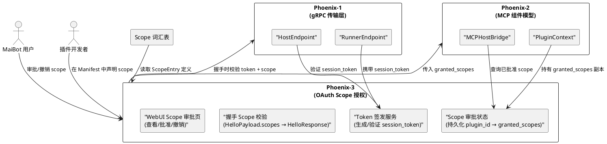
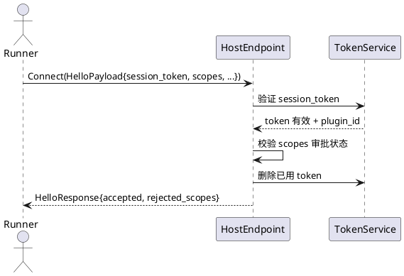
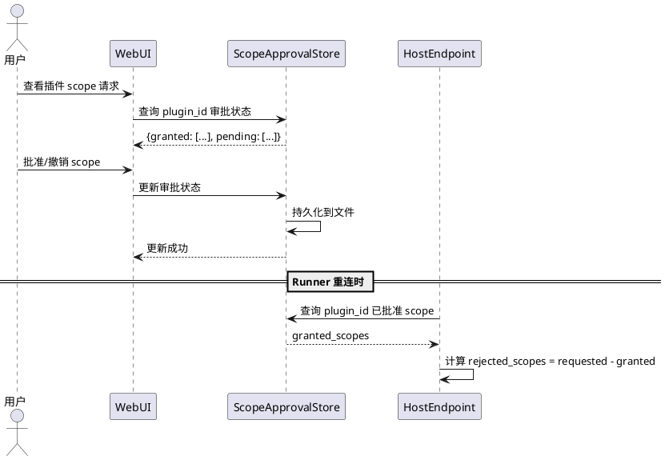
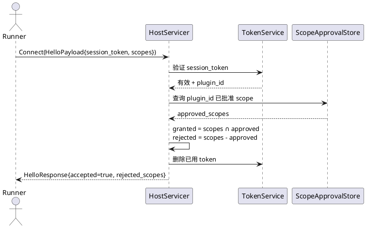
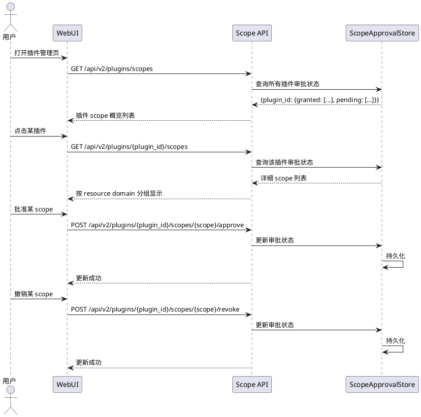

# Phoenix-3：OAuth Scope 授权 — 需求规格

# **1. 组件定位**

## **1.1 核心职责**

本组件负责实现插件 Scope 的声明、签发、校验全生命周期，将粗粒度 capabilities 替换为细粒度 scope 授权模型，支持用户通过 WebUI 逐项审批和撤销。

## **1.2 核心输入**

1. **Phoenix-0 产出的 Scope 词汇表**：`src/plugin_runtime_v2/scope/vocabulary.py` 中的 54 个 ScopeEntry（三段式格式 `资源域:操作:资源类型`，含 risk_level 和 approval_required 标记）
2. **Phoenix-0 产出的 Manifest v3**：`src/plugin_runtime_v2/sdk/manifest.py` 中的 `scopes: list[str]` 字段（插件声明所需 scope）
3. **Phoenix-1 产出的 .proto 字段**：`HelloPayload.session_token`（一次性会话令牌）、`HelloPayload.scopes`（所需 scope 列表）、`HelloResponse.rejected_scopes`（未批准的 scope 列表）
4. **Phoenix-2 产出的 SDK 本地校验**：`SendContext._check_scope` / `StorageContext` / `PluginContext._check_scope` + `ScopeDeniedError`（本地 scope 校验已实现，但 granted_scopes 来源是硬编码的 RunnerEndpointConfig）
5. **Phoenix-2 产出的 HostServicer 握手流程**：`_validate_hello` 校验 runner_id/sdk_version/session_token/scopes，但 session_token 未实际签发，scopes 未实际校验审批状态
6. **WebUI 前端**：`src/webui/` 中的 Vue3 + shadcn/ui 组件库，用于实现 scope 审批界面

## **1.3 核心输出**

1. **Session Token 签发服务**：Host 端为每个 Runner 连接签发一次性 session_token，绑定 plugin_id 和已批准的 scope 集合
2. **Scope 审批状态持久化**：每个 plugin_id 对应的已批准 scope 集合持久化到本地存储，重启后恢复
3. **握手阶段 Scope 校验**：Host 端在 Connect 双向流握手时，校验 Runner 请求的 scope 是否已被用户批准，返回 `accepted` + `rejected_scopes`
4. **运行时 Scope 校验**：Runner 端 SDK 只持有被批准的 scope，调用 PluginContext 方法时本地校验；Host 端 ToolProvider 桥接在转发调用前也做 scope 校验
5. **WebUI Scope 审批页面**：用户可查看每个插件的 scope 请求，逐项批准或撤销

## **1.4 职责边界**

- **不修改** `src/plugin_runtime_v2/scope/vocabulary.py` 中的 Scope 词汇表（54 个 ScopeEntry 不变）
- **不修改** `src/plugin_runtime_v2/proto/` 下的 .proto 文件和生成代码（字段已预留）
- **不修改** `src/plugin_runtime_v2/sdk/context.py` 中的 `_check_scope` 逻辑（已正确实现）
- **不修改** `src/plugin_runtime_v2/sdk/manifest.py` 中的 `_validate_scopes` 逻辑（已正确实现）
- **不实现** 能力层 Protocol 化的代码迁移（Phoenix-4 的职责）
- **不实现** 插件进程的启动/监督（沿用 v1 的进程管理）
- **不实现** 跨 MaiBot 实例的 scope 同步（单实例本地存储即可）

# **2. 领域术语**

**Scope**
: 三段式细粒度授权标识，格式为 `资源域:操作:资源类型`（如 `message:send:text`）。每个 scope 对应一个具体的系统能力，插件必须声明并获得批准后才能使用。
: 备注：替代 v3 的粗粒度 `capabilities_required`。

**ScopeEntry**
: Scope 词汇表中的条目，包含 scope 标识、描述、替代的旧 capability、风险等级（low/medium/high）、是否需要用户审批（approval_required）。
: 备注：Phoenix-0 已定义 54 个 ScopeEntry，Phoenix-3 不修改。

**Session Token**
: Host 签发的一次性会话令牌，Runner 在握手时携带。Token 绑定 plugin_id 和已批准的 scope 集合，握手后失效。
: 备注：不是 JWT，不需要跨服务验证，仅用于 Runner→Host 握手认证。

**Scope 审批**
: 用户通过 WebUI 对插件请求的 scope 进行批准或拒绝的操作。`approval_required=False` 的 scope 自动批准，`approval_required=True` 的 scope 需要用户显式批准。
: 备注：用户可随时撤销已批准的 scope，撤销后下次握手时 Runner 将收到 `rejected_scopes`。

**Granted Scopes**
: 插件当前被批准的 scope 集合。Runner 端 SDK 的 PluginContext 持有此集合的副本，调用方法时本地校验。
: 备注：Phoenix-2 中 granted_scopes 来源是硬编码的 RunnerEndpointConfig，Phoenix-3 改为从审批状态派生。

**ScopeDeniedError**
: 插件调用 PluginContext 方法时，如果未声明对应 scope，SDK 在本地抛出此异常。
: 备注：Phoenix-0 已定义占位，Phoenix-2 已补全校验逻辑，Phoenix-3 不修改。

# **3. 角色与边界**

## **3.1 核心角色**

- **插件开发者**：在 Manifest v3 中声明插件所需的 scope 列表，通过 SDK v4 使用已授权的能力
- **MaiBot 用户（管理员）**：通过 WebUI 审批或撤销插件的 scope 请求，控制插件可访问的系统资源
- **MaiBot 维护者**：维护 Scope 词汇表，决定哪些 scope 需要用户审批

## **3.2 外部系统**

- **Phoenix-1 HostEndpoint**：gRPC 服务端，握手阶段需校验 session_token 和 scope 审批状态
- **Phoenix-1 RunnerEndpoint**：gRPC 客户端，握手时携带 session_token 和 scopes，接收 rejected_scopes
- **Phoenix-2 MCPHostBridge**：Host 端协调器，on_runner_registered 时需传入已批准的 scope 集合
- **Phoenix-2 PluginContext**：SDK 运行时上下文，持有 granted_scopes 副本进行本地校验
- **WebUI 前端**：Vue3 + shadcn/ui，提供 scope 审批管理界面
- **Scope 词汇表**：54 个 ScopeEntry 的权威定义，Phoenix-3 只读取不修改

## **3.3 交互上下文**

# **4. DFX约束**

## **4.1 性能**

1. Session Token 签发延迟必须 ≤5ms（纯本地操作，无网络调用）
2. Scope 审批状态查询延迟必须 ≤2ms（内存缓存 + 本地文件）
3. 握手阶段 Scope 校验增加的延迟必须 ≤10ms（集合交集运算）
4. WebUI Scope 审批页面加载时间必须 ≤1s（插件数量 ≤100）

## **4.2 可靠性**

1. Scope 审批状态必须持久化到本地文件，MaiBot 重启后审批状态不丢失
2. Session Token 必须一次性使用，握手成功后立即失效，防止重放攻击
3. 撤销 scope 后，已连接的 Runner 在下次重连时生效（不强制断开当前连接）

## **4.3 安全性**

1. Session Token 必须使用加密安全随机数生成（`secrets.token_urlsafe`），长度 ≥32 字节
2. 未签发的 session_token 必须被握手拒绝（防止伪造）
3. `approval_required=False` 的 scope 自动批准，无需用户干预
4. `approval_required=True` 的 scope 必须用户显式批准，默认拒绝
5. 所有 scope 审批/撤销操作必须记录审计日志

## **4.4 可维护性**

1. Scope 审批状态文件必须使用人类可读格式（JSON），支持手动编辑
2. Scope 审批 API 必须遵循 RESTful 风格，便于 WebUI 调用
3. 审计日志必须包含 plugin_id、scope、操作类型（approve/revoke）、时间戳

## **4.5 兼容性**

1. 已批准的 scope 在词汇表版本升级后必须保持有效（新增 scope 不影响已有审批）
2. 词汇表中删除的 scope 必须在审批状态中自动清理（下次加载时）
3. Manifest v3 的 `_validate_scopes` 已校验 scope 在词汇表中存在，Phoenix-3 不重复校验

# **5. 核心能力**

## **5.1 Session Token 签发**

### **5.1.1 业务规则**

1. **Token 生成规则**：Host 端在 Runner 发起连接前签发一次性 session_token，使用 `secrets.token_urlsafe(32)` 生成，绑定 plugin_id
   a. 验收条件：签发的 token 长度 ≥43 字符（base64url 编码 32 字节）→ 签发成功

2. **Token 生命周期**：Token 在握手成功后立即从签发表中删除，不可重用
   a. 验收条件：同一 token 第二次握手 → 返回 `accepted=false, reason="TOKEN_ALREADY_USED"`

3. **Token 过期**：Token 签发后 300 秒内有效，超时自动清理
   a. 验收条件：签发 300 秒后使用 token 握手 → 返回 `accepted=false, reason="TOKEN_EXPIRED"`

4. **禁止项**：禁止使用可预测的 token 生成方式（如 UUID v4 之外的顺序 ID、时间戳等）
   a. 验收条件：连续签发 1000 个 token → 无碰撞、无规律

### **5.1.2 交互流程**

### **5.1.3 异常场景**

1. **Token 不存在**
   a. 触发条件：Runner 携带的 session_token 不在签发表中
   b. 系统行为：握手拒绝，返回 `accepted=false, reason="TOKEN_NOT_FOUND"`
   c. 用户感知：Runner 日志显示握手被拒，不重连

2. **Token 已使用**
   a. 触发条件：Runner 携带的 session_token 已被标记为已使用
   b. 系统行为：握手拒绝，返回 `accepted=false, reason="TOKEN_ALREADY_USED"`
   c. 用户感知：Runner 日志显示握手被拒

3. **Token 已过期**
   a. 触发条件：Runner 携带的 session_token 签发时间超过 300 秒
   b. 系统行为：握手拒绝，返回 `accepted=false, reason="TOKEN_EXPIRED"`，清理过期 token
   c. 用户感知：Runner 日志显示握手被拒，可重试获取新 token

## **5.2 Scope 审批状态管理**

### **5.2.1 业务规则**

1. **自动批准规则**：`approval_required=False` 的 scope 在插件首次请求时自动批准，无需用户干预
   a. 验收条件：插件请求 `message:send:text`（approval_required=False）→ 自动出现在 granted_scopes 中

2. **显式批准规则**：`approval_required=True` 的 scope 必须用户通过 WebUI 显式批准，默认拒绝
   a. 验收条件：插件请求 `message:send:image`（approval_required=True）→ 未批准时出现在 rejected_scopes 中

3. **审批状态持久化**：每个 plugin_id 的已批准 scope 集合持久化到 `data/plugin_runtime_v2/scope_approvals.json`
   a. 验收条件：批准 scope → 重启 MaiBot → scope 仍为已批准状态

4. **撤销规则**：用户可随时撤销已批准的 scope，撤销后下次 Runner 重连时生效
   a. 验收条件：撤销 `message:send:image` → Runner 重连 → `message:send:image` 出现在 rejected_scopes 中

5. **增量审批**：插件升级后新增 scope 请求，已批准的 scope 不受影响，新增的 scope 按规则 1/2 处理
   a. 验收条件：插件从 v1.0 升级到 v2.0 新增 `llm:execute:generate` → 已有审批不变，新 scope 需审批

6. **词汇表清理**：词汇表中已删除的 scope 在审批状态加载时自动清理
   a. 验收条件：词汇表删除某 scope → 加载审批状态 → 该 scope 不在 granted_scopes 中

7. **禁止项**：禁止在未获用户批准的情况下授予 `approval_required=True` 的 scope
   a. 验收条件：任何高/中风险 scope 未经用户审批 → 出现在 rejected_scopes 中

### **5.2.2 交互流程**

### **5.2.3 异常场景**

1. **审批状态文件损坏**
   a. 触发条件：`scope_approvals.json` 文件格式错误或不存在
   b. 系统行为：以空审批状态启动，记录 WARNING 日志，所有 `approval_required=True` 的 scope 需重新审批
   c. 用户感知：WebUI 显示所有高/中风险 scope 为"待审批"状态

2. **并发审批冲突**
   a. 触发条件：用户在 WebUI 批准 scope 的同时，Runner 正在握手
   b. 系统行为：握手使用当前内存中的审批状态快照，新审批在下次重连时生效
   c. 用户感知：无感知，行为一致

3. **插件请求未知 scope**
   a. 触发条件：Manifest v3 中声明了词汇表不存在的 scope
   b. 系统行为：Manifest 校验阶段拒绝（`_validate_scopes` 已实现），不会到达审批阶段
   c. 用户感知：插件安装失败，提示"无效的 scope"

## **5.3 握手 Scope 校验**

### **5.3.1 业务规则**

1. **Scope 交集计算**：握手时，Host 计算 `granted_scopes = requested_scopes ∩ approved_scopes`，`rejected_scopes = requested_scopes - approved_scopes`
   a. 验收条件：插件请求 [A, B, C]，已批准 [A, C] → granted=[A, C], rejected=[B]

2. **部分批准**：即使部分 scope 被拒绝，握手仍可成功（`accepted=true`），但 rejected_scopes 非空
   a. 验收条件：插件请求 [A, B]，已批准 [A] → accepted=true, rejected_scopes=[B]

3. **全部拒绝**：如果所有 requested_scopes 都被拒绝，握手仍可成功但 Runner 只能使用无需 scope 的功能
   a. 验收条件：插件请求 [A, B]，已批准 [] → accepted=true, rejected_scopes=[A, B]

4. **Runner 端降级**：Runner 收到 `rejected_scopes` 后，SDK 从 granted_scopes 中移除被拒绝的 scope，PluginContext 的 `_check_scope` 将拒绝未授权的方法调用
   a. 验收条件：Runner 收到 rejected_scopes=[B] → 调用需要 B 的方法 → 抛出 ScopeDeniedError

5. **禁止项**：禁止 Host 端在握手阶段授予未在审批状态中的 `approval_required=True` 的 scope
   a. 验收条件：未审批的高风险 scope → 必须出现在 rejected_scopes 中

### **5.3.2 交互流程**

### **5.3.3 异常场景**

1. **Token 无效但 scope 校验仍需执行**
   a. 触发条件：session_token 不存在或已过期
   b. 系统行为：直接拒绝握手，不查询审批状态
   c. 用户感知：Runner 日志显示握手被拒

2. **审批状态查询失败**
   a. 触发条件：ScopeApprovalStore 读取异常
   b. 系统行为：握手拒绝，返回 `accepted=false, reason="SCOPE_CHECK_FAILED"`
   c. 用户感知：Runner 日志显示握手被拒，管理员需检查审批状态文件

## **5.4 WebUI Scope 审批页面**

### **5.4.1 业务规则**

1. **插件列表视图**：显示所有已安装插件的 scope 请求概览，包含插件名、请求 scope 数量、已批准/待审批数量
   a. 验收条件：安装 3 个插件 → 页面显示 3 行，每行显示 scope 统计

2. **Scope 详情视图**：点击插件后显示所有请求的 scope，按资源域分组，每个 scope 显示名称、描述、风险等级、当前状态（已批准/待审批/已撤销）
   a. 验收条件：点击插件 → 显示按资源域分组的 scope 列表，每个 scope 有状态标记

3. **批量批准**：用户可一键批准所有 `approval_required=True` 的待审批 scope
   a. 验收条件：点击"全部批准" → 所有待审批 scope 状态变为"已批准"

4. **逐项撤销**：用户可撤销单个已批准的 scope
   a. 验收条件：点击某 scope 的"撤销" → 该 scope 状态变为"已撤销"

5. **风险提示**：`risk_level=high` 的 scope 在批准前显示二次确认对话框
   a. 验收条件：批准高风险 scope → 弹出确认对话框 → 确认后才生效

6. **禁止项**：禁止在 WebUI 中添加词汇表不存在的 scope
   a. 验收条件：WebUI 只显示插件 Manifest 中声明的 scope，不允许手动添加

### **5.4.2 交互流程**

### **5.4.3 异常场景**

1. **API 调用失败**
   a. 触发条件：WebUI 调用 Scope API 时网络错误或服务端异常
   b. 系统行为：WebUI 显示错误提示，不改变当前页面状态
   c. 用户感知：看到"操作失败，请重试"提示

2. **并发审批冲突**
   a. 触发条件：两个浏览器标签页同时操作同一插件的 scope
   b. 系统行为：后提交的操作覆盖先提交的，以最后一次为准
   c. 用户感知：刷新页面后看到最终状态

# **6. 数据约束**

## **6.1 Session Token**

1. **token**：加密安全随机字符串，长度 ≥43 字符（base64url 编码 32 字节），一次性使用
2. **plugin_id**：关联的插件标识，格式为 `组织名.插件名`
3. **created_at**：签发时间戳（秒级 Unix 时间戳），用于过期判断
4. **used**：是否已使用，布尔值

## **6.2 Scope 审批状态**

1. **plugin_id**：插件标识，格式为 `组织名.插件名`，作为主键
2. **granted_scopes**：已批准的 scope 集合，每个 scope 必须在词汇表中存在
3. **updated_at**：最后更新时间戳（秒级 Unix 时间戳），用于审计
4. **updated_by**：最后操作者（"system" 表示自动批准，"user" 表示用户操作）

## **6.3 Scope 审计日志**

1. **timestamp**：操作时间戳（毫秒级 Unix 时间戳）
2. **plugin_id**：操作的插件标识
3. **scope**：操作的 scope 标识
4. **action**：操作类型，枚举值：`approve` / `revoke` / `auto_approve`
5. **operator**：操作者，"system" 或 "user"