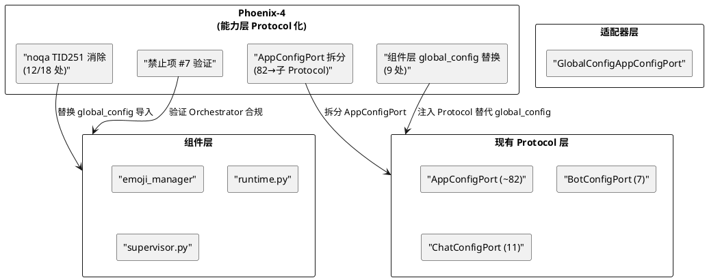

# Phoenix-4：能力层 Protocol 化 — 需求规格

# **1. 组件定位**

## **1.1 核心职责**

本组件负责将组件层对 global_config/config_manager 的直接访问替换为 Protocol 接口调用，消除 noqa TID251 整体对象遗留，实现能力模块化。

## **1.2 核心输入**

1. **SSD-13 已完成的 25 个 Protocol 接口**：`src/core/protocols.py` 中的 SessionRepository、AgentRoutingService、ChatRuntime、MessagePortV2、BotConfigPort、ChatConfigPort、AppConfigPort 等
2. **SSD-13 已完成的适配器层**：`src/core/adapters/` 中的 GlobalConfigBotConfigPort、GlobalConfigChatConfigPort、GlobalConfigAppConfigPort 等（适配器层合法导入 global_config）
3. **noqa TID251 整体对象遗留 18 处**：分布在 emoji_manager、expression_selector、reply、supervisor、api、emoji_cache_cleanup、image_cache_cleanup、runtime、utils_config、routes、config、core 等 16 个文件中
4. **核心禁止项第 7 项**：Orchestrator 禁止通过 enqueue_proactive_task 模拟多智能体（唯一未 ✅ 的禁止项）
5. **AppConfigPort 方法膨胀**：~82 个方法，需按配置域模块化拆分

## **1.3 核心输出**

1. **noqa TID251 整体对象消除**：18 处中可消除 12 处（5 处可立即拆解 + 7 处需新增 Port 方法），6 处暂不可拆解保留 noqa 并标注原因
2. **新增 Protocol 方法**：为 7 处"需新增 Port 方法"的场景在现有 Protocol 上扩展方法
3. **AppConfigPort 模块化拆分**：将 ~82 个方法按配置域拆分为子 Protocol（如 EmojiConfigPort、VisualConfigPort、PluginRuntimeConfigPort 等）
4. **核心禁止项第 7 项验证**：确认 Orchestrator 不再通过 enqueue_proactive_task 模拟多智能体
5. **组件层 global_config 消除**：组件层 9 处直接导入 global_config 替换为 Protocol 注入

## **1.4 职责边界**

- **不修改** `src/core/protocols.py` 中已有 Protocol 的方法签名（只扩展，不破坏兼容性）
- **不修改** `src/core/adapters/` 中适配器层的合法导入（适配器是唯一允许导入具体类的地方）
- **不修改** `src/main.py` 的入口初始化逻辑（入口文件导入 global_config 是合法的）
- **不修改** `src/A_memorix/` 内部代码（A_memorix 有独立的 MODIFICATION_POLICY.md）
- **不修改** `src/plugin_runtime/` v1 代码（v1/v2 并行运行，v1 不动）
- **不重构** WebUI 配置管理面（routes.py/config.py 3 处暂不可拆解，需重新设计接口，超出 Phoenix-4 范围）
- **不实现** 新的 Protocol 注册机制（沿用现有的 registry 模式）

# **2. 领域术语**

**noqa TID251**
: ruff 规则 TID251（禁止导入 global_config）的 noqa 豁免标记。标注此标记的导入表示"已知违规但因架构原因暂无法消除"。
: 备注：SSD-11 已将核心层 TID251 从 41 降至 0，剩余 18 处在组件层。

**整体对象**
: noqa TID251 的一种分类，指代码需要访问 global_config 的整个配置对象（而非单个属性），无法通过逐属性 Port 化消除。
: 备注：如 `global_config.plugin_runtime`（动态遍历插件列表）、`global_config.emoji.cache_cleanup`（缓存清理配置）。

**能力模块化**
: 将 AppConfigPort 的 ~82 个方法按配置域拆分为多个子 Protocol，每个子 Protocol 只暴露一个配置域的方法。
: 备注：如 EmojiConfigPort 只暴露 emoji 相关配置，VisualConfigPort 只暴露 visual 相关配置。

**适配器层合法导入**
: `src/core/adapters/` 中的代码允许导入 global_config，因为适配器是 Protocol 接口与具体实现之间的桥梁。
: 备注：这是微内核架构的核心设计——核心只依赖 Protocol，适配器依赖具体实现。

# **3. 角色与边界**

## **3.1 核心角色**

- **MaiBot 维护者**：需要消除架构债务，提升代码可维护性
- **插件开发者**：需要清晰的 Protocol 接口，而非直接访问 global_config

## **3.2 外部系统**

- **AppConfigPort**：~82 个方法的超大 Protocol，Phoenix-4 需要拆分
- **BotConfigPort / ChatConfigPort**：已完成的 Protocol，Phoenix-4 不修改
- **适配器层**：`src/core/adapters/` 中的 GlobalConfig*Port 实现，Phoenix-4 扩展但不重构
- **组件层**：emoji_manager、expression_selector、reply、supervisor 等需要消除 global_config 直接导入的模块

## **3.3 交互上下文**

# **4. DFX约束**

## **4.1 性能**

1. Protocol 方法调用增加的间接层延迟必须 ≤1μs（Python 函数调用开销）
2. AppConfigPort 拆分后，子 Protocol 的方法调用不得增加额外的注册表查找开销

## **4.2 可靠性**

1. Protocol 拆分必须保持向后兼容——现有代码使用 AppConfigPort 的方式不受影响
2. noqa TID251 消除后，ruff check 必须通过（TID251 违规数从 18 降至 6）

## **4.3 安全性**

1. 新增 Protocol 方法不得暴露比现有 global_config 访问更多的信息
2. 适配器层实现必须保持与现有行为一致

## **4.4 可维护性**

1. 每个 noqa TID251 消除必须附带对应的单元测试
2. AppConfigPort 拆分后，每个子 Protocol 的方法数应 ≤20

## **4.5 兼容性**

1. AppConfigPort 拆分采用"继承组合"模式——AppConfigPort 继承所有子 Protocol，现有代码无需修改
2. 新增 Protocol 方法必须有对应的适配器实现
3. 暂不可拆解的 6 处 noqa 保留，标注原因和预期解决时间

# **5. 核心能力**

## **5.1 noqa TID251 可立即拆解（5 处）**

### **5.1.1 业务规则**

1. **emoji_manager.py**：`config_manager` 导入用于获取模型配置 → 改用 ModelConfigPort
   a. 验收条件：emoji_manager 不再导入 config_manager → ruff TID251 通过

2. **expression_selector.py**：`model_config` 导入 → 改用 ModelConfigPort
   a. 验收条件：expression_selector 不再导入 model_config → ruff TID251 通过

3. **reply.py**：`config_module` 导入（未使用）→ 直接删除
   a. 验收条件：reply.py 无 config_module 导入 → ruff F401 通过

4. **remote.py**：`MMC_VERSION` 常量导入 → 改用 AppConfigPort.get_mmc_version()
   a. 验收条件：remote.py 不再导入 MMC_VERSION → ruff TID251 通过

5. **service_task_resolver.py**：过渡期回退导入 → SSD-12 已建 registry，回退路径不再触发，可删除
   a. 验收条件：service_task_resolver 不再有 noqa TID251 → ruff 通过

### **5.1.2 异常场景**

1. **回退路径仍被触发**
   a. 触发条件：删除 service_task_resolver 的回退导入后，运行时出现 ImportError
   b. 系统行为：恢复回退导入并标注"需进一步调查"
   c. 用户感知：无影响（回退路径是防御性代码）

## **5.2 noqa TID251 需新增 Port 方法（7 处）**

### **5.2.1 业务规则**

1. **mode_utils.py**：动态遍历模型配置 → 在 ModelConfigPort 新增 `list_models()` 方法
   a. 验收条件：mode_utils 通过 ModelConfigPort.list_models() 获取模型列表

2. **send_emoji.py**：动态 getattr 获取配置 → 在 BotConfigPort 或 ChatConfigPort 新增 emoji 相关方法
   a. 验收条件：send_emoji 通过 Protocol 获取 emoji 配置

3. **emoji_cache_cleanup.py**：`global_config.emoji.cache_cleanup` 整体对象 → 在 AppConfigPort 新增 `get_emoji_cache_cleanup_config()` 方法
   a. 验收条件：emoji_cache_cleanup 不再导入 global_config

4. **image_cache_cleanup.py**：`global_config.visual.image_cache_cleanup` 整体对象 → 在 AppConfigPort 新增 `get_image_cache_cleanup_config()` 方法
   a. 验收条件：image_cache_cleanup 不再导入 global_config

5. **runtime.py + utils_config.py**：多域混合（expression/experimental/jargon/reply_style/a_memorix）→ 在 ChatConfigPort 或 AppConfigPort 新增对应方法
   a. 验收条件：runtime.py 和 utils_config.py 不再导入 global_config

6. **supervisor.py**：`global_config.plugin_runtime` 快照扩展 → 在 AppConfigPort 新增 `get_plugin_runtime_snapshot()` 方法
   a. 验收条件：supervisor 不再导入 global_config

7. **api.py**：`global_config.maim_message` 快照 → 在 AppConfigPort 新增 `get_maim_message_config()` 方法
   a. 验收条件：api.py 不再导入 global_config

### **5.2.2 异常场景**

1. **Port 方法签名设计不当**
   a. 触发条件：新增的 Port 方法返回类型过于具体（如返回 Pydantic model 而非快照）
   b. 系统行为：重新设计返回类型为 dataclass 快照
   c. 用户感知：无影响

## **5.3 AppConfigPort 模块化拆分**

### **5.3.1 业务规则**

1. **子 Protocol 定义**：按配置域拆分为 5 个子 Protocol
   - EmojiConfigPort：emoji 相关配置（~5 方法）
   - VisualConfigPort：visual/图片相关配置（~5 方法）
   - PluginRuntimeConfigPort：插件运行时配置（~6 方法）
   - ExpressionConfigPort：表情/语气相关配置（~8 方法）
   - SystemConfigPort：系统级配置（~10 方法）
   a. 验收条件：每个子 Protocol 方法数 ≤20

2. **AppConfigPort 继承组合**：AppConfigPort 继承所有子 Protocol，现有代码无需修改
   a. 验收条件：`isinstance(adapter, EmojiConfigPort)` 返回 True

3. **适配器层对应拆分**：GlobalConfigAppConfigPort 拆分为多个子适配器
   a. 验收条件：每个子适配器只访问 global_config 的对应配置域

4. **禁止项**：禁止拆分后增加注册表数量——子 Protocol 共享同一个 registry
   a. 验收条件：registry 数量不变

### **5.3.2 异常场景**

1. **拆分后循环依赖**
   a. 触发条件：子 Protocol 之间产生交叉引用
   b. 系统行为：将交叉方法保留在 AppConfigPort 基类中
   c. 用户感知：无影响

## **5.4 核心禁止项第 7 项验证**

### **5.4.1 业务规则**

1. **验证 Orchestrator 不使用 enqueue_proactive_task 模拟多智能体**：搜索 Orchestrator 代码确认无此调用
   a. 验收条件：`grep enqueue_proactive_task src/core/` 无匹配 → 禁止项 #7 标记为 ✅

2. **如果发现违规**：重构为通过 AgentRoutingService Protocol 路由
   a. 验收条件：违规代码替换为 Protocol 调用

## **5.5 暂不可拆解的 6 处 noqa（保留）**

以下 6 处因架构原因暂不可拆解，保留 noqa 并标注原因：

1. **routes.py (heartflow_manager)**：WebUI 直接访问 heartflow_manager 整体字典
2. **routes.py (global_config 读写)**：chat.reply_style 整体对象待后续协议化
3. **config.py (配置管理面)**：WebUI 配置管理 CRUD 需直接操作配置对象
4. **core.py (动态反射访问)**：插件动态配置需要 global_config 整体对象反射访问
5. **runtime.py (MCPConfig 整体传递)**：MCPConfig 整体对象无法逐属性 Port 化
6. **mcp_module/__init__.py**：MCP 模块初始化需直接访问配置

# **6. 数据约束**

## **6.1 子 Protocol 快照类型**

1. **EmojiCacheCleanupConfig**：cleanup_interval, max_age, enabled 等字段
2. **ImageCacheCleanupConfig**：cleanup_interval, max_age, enabled 等字段
3. **PluginRuntimeSnapshot**：enabled_plugins, ipc_socket_path 等字段（已在 AGENTS.md 中定义）
4. **MaimMessageConfig**：api_url, token 等字段

## **6.2 AppConfigPort 拆分约束**

1. **方法总数守恒**：拆分后所有子 Protocol 方法总数 + AppConfigPort 自身方法 = 原 ~82 方法
2. **继承关系**：AppConfigPort 继承所有子 Protocol，不破坏现有 isinstance 检查
3. **注册表不变**：子 Protocol 共享 AppConfigPort 的 registry，不新增注册点