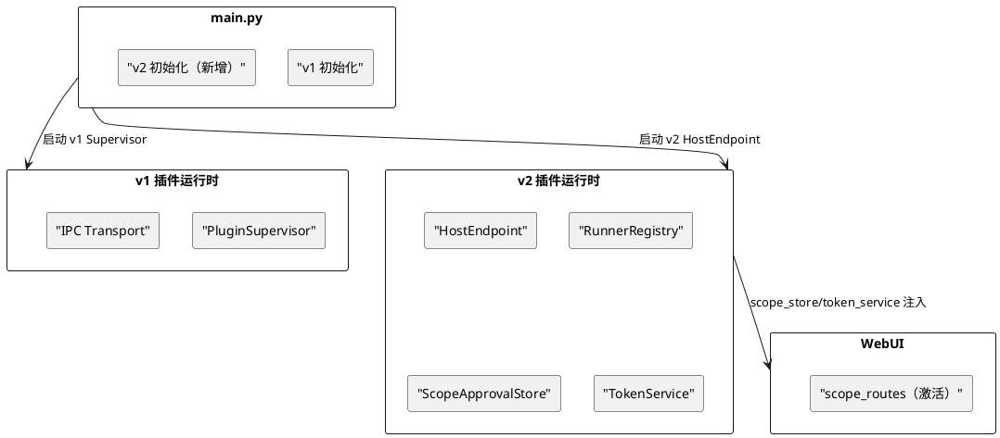

# Phoenix-5：v2 主程序集成 — 需求规格

# **1. 组件定位**

## **1.1 核心职责**

将 plugin_runtime_v2 的 gRPC Host/Runner 接入主程序生命周期，实现 v2 启动/停止/健康检查，清理重复子目录，注册 Scope 审批 WebUI 路由，让 v2 插件系统真正可运行。

## **1.2 核心输入**

1. **Phoenix-1 gRPC 传输层**：`src/plugin_runtime_v2/host/`（HostEndpoint、Servicer、Connection、Registry、Heartbeat）和 `src/plugin_runtime_v2/runner/`（RunnerEndpoint、Servicer、PluginLoader、ToolRouter、Reconnect）
2. **Phoenix-2 MCP 组件模型**：`src/plugin_runtime_v2/mcp/`（MCPHostBridge、ToolProvider、EventDispatcher）
3. **Phoenix-3 OAuth Scope 授权**：`src/plugin_runtime_v2/scope/`（TokenService、ScopeApprovalStore、ScopeVocabulary）
4. **Phoenix-4 Protocol 化**：AppConfigPort、ModelConfigPort 等 Protocol 接口
5. **v1 插件运行时**：`src/plugin_runtime/`（当前主程序使用的 47 个文件，Supervisor + IPC + 8 种 capabilities）
6. **主程序入口**：`src/main.py`（当前无任何 v2 初始化代码）

## **1.3 核心输出**

1. **v2 主程序集成**：main.py 启动时初始化 HostEndpoint，停止时优雅关闭
2. **Scope 审批 WebUI 激活**：scope_routes 注册到 WebUI，scope_store/token_service 注入 app.state
3. **重复子目录清理**：删除 `src/plugin_runtime_v2/plugin_runtime_v2/`（31 个文件的完整拷贝）
4. **v1/v2 并行运行**：v1 和 v2 同时运行，v1 处理现有插件，v2 处理新格式插件
5. **Runner 进程管理**：Host 端 spawn Runner 子进程、健康检查、自动重启

## **1.4 职责边界**

- **不删除** v1 插件运行时（v1/v2 并行运行，v1 在 v2 完全就绪后废弃）
- **不实现** SDK RPC 通道（SendContext/StorageContext 占位方法 → Phoenix-6）
- **不重写** napcat-adapter（→ Phoenix-7）
- **不实现** Scope 审批前端 UI（→ Phoenix-9）
- **不修改** .proto 文件（Proto 定义已完整）

# **2. 领域术语**

**v2 主程序集成**
: 将 plugin_runtime_v2 的 HostEndpoint/RunnerEndpoint 接入 main.py 的启动/停止生命周期，使 v2 插件系统可运行。

**v1/v2 并行运行**
: v1 和 v2 插件运行时同时运行，v1 处理现有 v2/v3 格式插件，v2 处理 v4 格式插件。两者通过不同的 Supervisor/HostEndpoint 管理，互不干扰。

**Runner 进程管理**
: Host 端 spawn Runner 子进程、健康检查、自动重启、热重载。v1 的 PluginSupervisor 已实现此功能，v2 需要等价实现。

**Scope 审批 WebUI 激活**
: 将 scope_routes.py 注册到 WebUI 路由，创建 scope_store/token_service 实例并注入 app.state，使 Scope 审批 API 可用。

# **3. 角色与边界**

## **3.1 核心角色**

- **MaiBot 维护者**：需要 v2 插件系统真正可运行，以便开始 v4 插件开发
- **插件开发者**：需要 v2 运行时环境来测试 v4 格式插件

## **3.2 外部系统**

- **main.py**：主程序入口，需要新增 v2 初始化代码
- **WebUI**：FastAPI 应用，需要注册 scope_routes 和注入 scope_store/token_service
- **v1 Supervisor**：当前管理 v1/v2/v3 格式插件的进程管理器，v2 集成后并行运行
- **Docker 容器**：运行环境，v2 需要在 Docker 中正常启动

## **3.3 交互上下文**



# **4. DFX约束**

## **4.1 性能**

1. v2 HostEndpoint 启动时间 ≤2s（gRPC 服务端启动 + Runner 连接等待）
2. v2 初始化不得阻塞 v1 初始化（并行启动）

## **4.2 可靠性**

1. v2 启动失败不得影响 v1 运行（容错隔离）
2. Runner 进程崩溃后 Host 自动重启（健康检查 + 自动重启）
3. Scope 审批数据持久化到 JSON 文件（ScopeApprovalStore 已实现）

## **4.3 安全性**

1. Scope 审批 API 需要认证（WebUI 现有认证机制）
2. Token 签发仅限已批准 scope 的插件

## **4.4 可维护性**

1. v2 初始化代码集中在 main.py 的一个函数中，不散落
2. v1/v2 并行运行的切换通过配置开关控制（`global_config.plugin_runtime.enabled` + 新增 v2 开关）

## **4.5 兼容性**

1. v1 插件运行时不受 v2 集成影响
2. Docker 部署中 v2 正常运行
3. 现有测试不回归

# **5. 核心能力**

## **5.1 v2 主程序集成**

### **5.1.1 业务规则**

1. **main.py 新增 v2 初始化函数**：`init_plugin_runtime_v2()` 在 v1 初始化之后调用
   a. 验收条件：main.py 中有 `init_plugin_runtime_v2()` 调用

2. **HostEndpoint 生命周期管理**：创建 HostEndpoint 实例，注入 MCPHostBridge 依赖，调用 `start()` 启动 gRPC 服务端
   a. 验收条件：v2 HostEndpoint 在 main.py 启动时正常启动

3. **HostEndpoint 优雅关闭**：main.py 停止时调用 `HostEndpoint.stop()`
   a. 验收条件：v2 HostEndpoint 在 main.py 停止时优雅关闭

4. **MCPHostBridge 依赖组装**：创建 ToolRegistry、EventDispatcher 实例，注入 PersonInfoPort 等依赖
   a. 验收条件：MCPHostBridge 的 ToolProvider 注册/注销功能可用

5. **配置开关**：通过 AppConfigPort 新增 `get_plugin_runtime_v2_enabled()` 方法控制 v2 是否启动
   a. 验收条件：配置关闭时 v2 不启动，v1 不受影响

### **5.1.2 异常场景**

1. **v2 启动失败**
   a. 触发条件：gRPC 端口被占用、Runner 无法连接
   b. 系统行为：记录错误日志，v1 继续运行，不影响主程序
   c. 用户感知：WebUI 显示 v2 状态为"未运行"

2. **Runner 连接超时**
   a. 触发条件：Runner 进程未在超时时间内连接 Host
   b. 系统行为：Host 继续等待，不阻塞主程序
   c. 用户感知：该 Runner 的插件不可用

## **5.2 Scope 审批 WebUI 激活**

### **5.2.1 业务规则**

1. **scope_routes 注册**：在 `src/webui/routers/plugin/__init__.py` 中 include scope_routes
   a. 验收条件：`GET /plugins/scopes` 返回 200

2. **scope_store/token_service 注入**：在 WebUI 应用启动时创建 ScopeApprovalStore 和 TokenService 实例，挂载到 `app.state`
   a. 验收条件：scope_routes 的 API 端点可正常调用

3. **ScopeVocabulary 初始化**：scope_routes 中使用 ScopeVocabulary 的 scope 定义
   a. 验收条件：`GET /plugins/scopes` 返回完整的 scope 词汇表

### **5.2.2 异常场景**

1. **scope_store 持久化失败**
   a. 触发条件：JSON 文件写入失败
   b. 系统行为：内存数据仍可用，下次启动从空状态开始
   c. 用户感知：已批准的 scope 丢失，需重新审批

## **5.3 重复子目录清理**

### **5.3.1 业务规则**

1. **删除 `src/plugin_runtime_v2/plugin_runtime_v2/`**：31 个 .py 文件的完整拷贝，应为误操作产物
   a. 验收条件：`src/plugin_runtime_v2/plugin_runtime_v2/` 目录不存在

2. **确认无外部引用**：删除前 grep 确认无其他文件导入该子目录
   a. 验收条件：`grep "plugin_runtime_v2.plugin_runtime_v2" src/` 无匹配

## **5.4 Runner 进程管理**

### **5.4.1 业务规则**

1. **Host spawn Runner 子进程**：HostEndpoint 启动后，根据配置 spawn 指定数量的 Runner 进程
   a. 验收条件：Runner 进程由 Host 自动启动，无需手动运行

2. **健康检查**：HeartbeatManager 已实现，确认与 HostEndpoint 集成
   a. 验收条件：Runner 连接丢失后 Host 检测到并记录日志

3. **自动重启**：Runner 进程崩溃后 Host 自动重新 spawn
   a. 验收条件：Runner 崩溃后 30s 内自动恢复

4. **配置驱动**：Runner spawn 数量、超时、重启策略通过 AppConfigPort 配置
   a. 验收条件：修改配置后重启生效

### **5.4.2 异常场景**

1. **Runner 反复崩溃**
   a. 触发条件：Runner 在短时间内崩溃超过 max_restart_attempts 次
   b. 系统行为：停止重启，标记该 Runner 为 failed
   c. 用户感知：该 Runner 的插件不可用，WebUI 显示 failed 状态

2. **Runner spawn 超时**
   a. 触发条件：Runner 进程启动后未在 runner_spawn_timeout_sec 内连接 Host
   b. 系统行为：kill 该进程，标记为 failed
   c. 用户感知：同上

## **5.5 v1/v2 并行运行配置**

### **5.5.1 业务规则**

1. **配置开关**：`bot_config.toml` 新增 `[plugin_runtime_v2]` 配置段
   a. 验收条件：配置文件中有 v2 配置段

2. **v2 默认关闭**：`plugin_runtime_v2.enabled = false`，需手动开启
   a. 验收条件：默认安装下 v2 不启动

3. **v1 不受影响**：v2 开启/关闭不影响 v1 运行
   a. 验收条件：v1 插件在 v2 开启和关闭时均正常工作

# **6. 数据约束**

## **6.1 新增配置项**

```toml
[plugin_runtime_v2]
enabled = false
host_listen_address = "0.0.0.0:50051"
runner_spawn_count = 1
runner_spawn_timeout_sec = 30.0
health_check_interval_sec = 60.0
max_restart_attempts = 3
scope_approval_file = "data/scope_approvals.json"
```

## **6.2 新增 AppConfigPort 方法**

| 方法 | 签名 | 用途 |
|------|------|------|
| `get_plugin_runtime_v2_enabled` | `def get_plugin_runtime_v2_enabled(self) -> bool` | v2 开关 |
| `get_plugin_runtime_v2_host_listen_address` | `def get_plugin_runtime_v2_host_listen_address(self) -> str` | Host 监听地址 |
| `get_plugin_runtime_v2_runner_spawn_count` | `def get_plugin_runtime_v2_runner_spawn_count(self) -> int` | Runner 数量 |
| `get_plugin_runtime_v2_runner_spawn_timeout_sec` | `def get_plugin_runtime_v2_runner_spawn_timeout_sec(self) -> float` | spawn 超时 |
| `get_plugin_runtime_v2_health_check_interval_sec` | `def get_plugin_runtime_v2_health_check_interval_sec(self) -> float` | 健康检查间隔 |
| `get_plugin_runtime_v2_max_restart_attempts` | `def get_plugin_runtime_v2_max_restart_attempts(self) -> int` | 最大重启次数 |
| `get_plugin_runtime_v2_scope_approval_file` | `def get_plugin_runtime_v2_scope_approval_file(self) -> str` | Scope 审批文件路径 |

## **6.3 新增快照类型**

```python
@dataclass(frozen=True)
class PluginRuntimeV2Snapshot:
    """v2 插件运行时配置快照。"""
    enabled: bool = False
    host_listen_address: str = "0.0.0.0:50051"
    runner_spawn_count: int = 1
    runner_spawn_timeout_sec: float = 30.0
    health_check_interval_sec: float = 60.0
    max_restart_attempts: int = 3
    scope_approval_file: str = "data/scope_approvals.json"
```