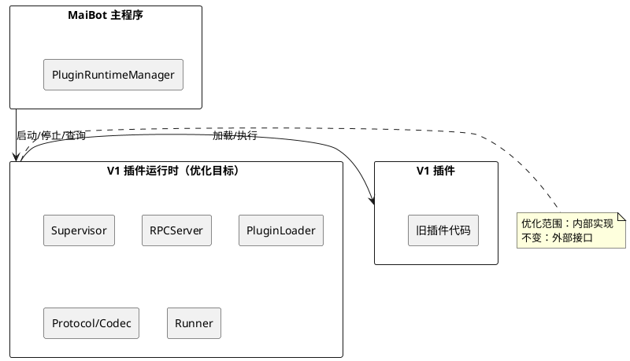

# Phoenix-7b：V1 插件系统内部优化

## 1. 组件定位

### 1.1 核心职责

本组件负责在不改变 V1 插件外部接口的前提下，优化 V1 插件运行时的性能、可靠性和代码质量。

### 1.2 核心输入

1. V1 插件运行时的现有代码（`src/plugin_runtime/`）
2. 性能分析数据（轮询开销、协程切换、编解码延迟）
3. 错误诊断数据（异常吞没、日志缺失）

### 1.3 核心输出

1. 优化后的 V1 插件运行时代码（接口不变）
2. 性能改善指标（无效唤醒消除、协程切换减少）
3. 可诊断性改善（异常不再被静默吞没）

### 1.4 职责边界

- **不负责**：V1 插件 API 的变更——`maibot_sdk` 接口不变
- **不负责**：V1 插件 manifest 格式的变更——`_manifest.json` v2 格式不变
- **不负责**：V1 组件模型的变更——8 种组件类型不变
- **不负责**：V1 IPC 协议的变更——Envelope/MsgPack 分帧协议不变
- **负责**：V1 运行时内部的性能优化、错误处理改善、代码质量提升

## 2. 领域术语

**V1 插件运行时**
: `src/plugin_runtime/` 下的完整插件系统，包含 Host/Runner 双进程架构、IPC 传输、组件注册、Hook 分发等。

**轮询等待**
: 使用 `asyncio.sleep(interval)` 循环检查条件是否满足，浪费 CPU 周期的等待模式。

**Event 通知**
: 使用 `asyncio.Event.set()` / `wait()` 的条件通知模式，零开销等待。

**宽泛异常捕获**
: `except Exception:` 不绑定异常变量，导致异常信息丢失，无法诊断问题。

**Pydantic 热路径**
: 高频调用的编解码路径（每条消息、每次 RPC 请求），Pydantic v2 的 `model_validate` 开销比直接构造大。

## 3. 角色与边界

### 3.1 核心角色

- **MaiBot 开发者**：维护和优化 V1 插件运行时代码
- **V1 插件开发者**：无感知——接口不变，行为不变

### 3.2 外部系统

- **V4 兼容层**（Phoenix-8）：依赖 V1 运行时的稳定性，优化后桥接更可靠
- **MaiBot 主程序**：调用 V1 PluginRuntimeManager，优化后启动更快、资源占用更低

### 3.3 交互上下文

## 4. DFX 约束

### 4.1 性能

- Runner 主循环 SHALL NOT 每秒无效唤醒
- RPC 请求 ID 生成 SHALL NOT 引入无意义的协程切换
- Runner 连接等待 SHALL NOT 使用 100ms 级轮询

### 4.2 可靠性

- 优化 SHALL NOT 改变 V1 插件的加载顺序
- 优化 SHALL NOT 改变 V1 插件的错误传播语义（该抛的异常仍抛，该捕获的仍捕获）
- 优化 SHALL NOT 引入新的竞态条件

### 4.3 安全性

- 优化 SHALL NOT 绕过现有的 session_token 校验
- 优化 SHALL NOT 绕过现有的 capabilities 校验

### 4.4 可维护性

- 宽泛异常捕获 SHALL 补充异常变量绑定和日志记录
- 反射调用 SHALL 改为直接方法调用（类型安全）
- 冗余映射表 SHALL 清理

### 4.5 兼容性

- V1 插件开发者 API SHALL NOT 变化
- `_manifest.json` v2 格式 SHALL NOT 变化
- IPC 协议（Envelope + MsgPack）SHALL NOT 变化
- 8 种组件类型 SHALL NOT 变化
- V1 Runner 子进程启动参数（环境变量）SHALL NOT 变化

## 5. 核心能力

### 5.1 性能优化

#### 5.1.1 业务规则

1. **请求 ID 同步化规则**：`RequestIdGenerator.next()` SHALL 改为同步方法（`def next()` → `def next()`，移除 `async`）
   - 验收条件：[调用 `RequestIdGenerator.next()`] → [不再产生协程切换，直接返回递增 ID]

2. **Runner 主循环 Event 化规则**：Runner 主循环 SHALL 使用 `asyncio.Event.wait()` 替代 `asyncio.sleep(1.0)` 轮询
   - 验收条件：[Runner 空闲时] → [不产生每秒唤醒，等待 Event 通知]
   - 验收条件：[收到 shutdown 信号] → [Event.set() 立即唤醒，无延迟]

3. **Runner 连接等待 Event 化规则**：`_wait_for_runner_connection` 和 `_wait_for_runner_ready` SHALL 使用 Event 通知替代轮询
   - 验收条件：[Host 等待 Runner 连接] → [Runner 连接后立即通知，无 100ms 延迟]

4. **禁止项**：SHALL NOT 修改 IPC 协议格式
   - 验收条件：[优化前后] → [Envelope 结构和 MsgPack 编解码结果一致]

#### 5.1.2 异常场景

1. **Event 通知丢失**
   - 触发条件：Event.set() 在 wait() 之前调用
   - 系统行为：Event 内部状态已设置，wait() 立即返回，不影响正确性
   - 用户感知：无影响

### 5.2 错误处理改善

#### 5.2.1 业务规则

1. **异常变量绑定规则**：所有 `except Exception:` SHALL 改为 `except Exception as exc:`，并至少在 `logger.debug` 级别记录异常信息
   - 验收条件：[异常被捕获] → [日志中可见异常类型和消息]

2. **豁免规则**：日志系统内部的宽泛异常捕获（`log_handler.py` 3 处）可保留原样——避免日志系统自身异常引发递归
   - 验收条件：[日志系统异常] → [不引发递归，静默处理]

3. **禁止项**：SHALL NOT 改变异常的传播语义——原来吞掉的异常不能改为抛出，原来抛出的异常不能改为吞掉
   - 验收条件：[优化前后] → [插件可见的异常行为一致]

#### 5.2.2 异常场景

1. **日志记录本身失败**
   - 触发条件：`logger.debug(exc)` 抛出异常
   - 系统行为：Python logging 内部已处理此情况，不会引发递归
   - 用户感知：无影响

### 5.3 代码质量提升

#### 5.3.1 业务规则

1. **反射调用消除规则**：`getattr(supervisor, "method", None) + callable()` 模式 SHALL 改为直接方法调用
   - 验收条件：[调用 supervisor 方法] → [直接调用，类型安全，IDE 可追踪]

2. **私有属性访问消除规则**：`getattr(supervisor, "_registered_plugins", {})` SHALL 改为通过公开方法访问
   - 验收条件：[访问 Supervisor 内部状态] → [通过公开方法，不访问私有属性]

3. **冗余映射清理规则**：`_EVENT_TYPE_MAP` 中 key==value 的条目 SHALL 删除，仅保留有实际映射的条目
   - 验收条件：[事件类型映射] → [仅保留 key≠value 的映射]

4. **反射构造消除规则**：`inspect.signature` 反射构造 Supervisor SHALL 改为直接传参构造
   - 验收条件：[创建 Supervisor 实例] → [直接传参，无反射]

5. **禁止项**：SHALL NOT 改变 Supervisor 的构造签名
   - 验收条件：[优化前后] → [Supervisor 构造参数不变]

### 5.4 编解码优化（P2，可选）

#### 5.4.1 业务规则

1. **热路径跳过 validate 规则**：高频 RPC 路径的 Envelope 反序列化 SHALL 支持跳过 Pydantic `model_validate`，直接从 dict 构造
   - 验收条件：[RPC 热路径] → [可选跳过 validate，减少 CPU 开销]
   - 验收条件：[调试模式] → [仍可启用 validate，保证正确性]

2. **禁止项**：SHALL NOT 改变 Envelope 的序列化格式
   - 验收条件：[优化前后] → [MsgPack 编解码结果一致]

## 6. 数据约束

### 6.1 优化优先级

1. **P0（必须）**：请求 ID 同步化、Runner 主循环 Event 化
2. **P1（应该）**：连接等待 Event 化、宽泛异常改善、代码质量提升
3. **P2（可以）**：编解码优化、健康检查自适应、诊断写入优化
4. **P3（待定）**：模块级单例合并、SDK 副作用移除

### 6.2 受影响文件清单

1. **protocol/envelope.py**：RequestIdGenerator.next() 同步化
2. **runner/runner_main.py**：主循环 Event 化
3. **host/supervisor.py**：连接等待 Event 化、宽泛异常改善
4. **integration.py**：反射调用消除、冗余映射清理
5. **protocol/codec.py**：编解码优化（P2）
6. **host/component_registry.py**：ActionEntry 空子类（P2）
7. **host/message_gateway.py**：无用参数移除（P2）
8. **component_query.py**：单例合并（P3）