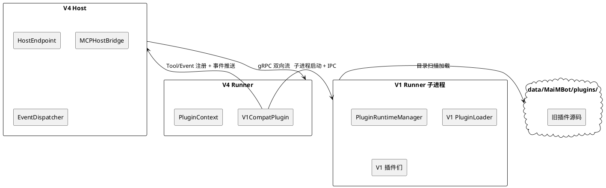
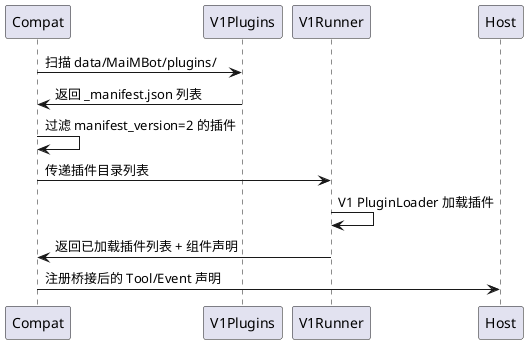
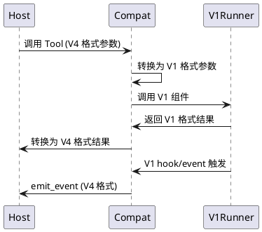

# Phoenix-8：V1 兼容层插件

## 1. 组件定位

### 1.1 核心职责

本组件负责将 V1 插件运行时封装为 V4 插件，使旧插件零修改继续运行。

### 1.2 核心输入

1. V4 Host 的 gRPC 连接请求（Runner 注册、Tool 调用、Event 推送）
2. V1 插件目录扫描结果（`data/MaiMBot/plugins/` 下的 `_manifest.json` + `plugin.py`）
3. V1 插件运行时产生的消息发送、存储读写请求
4. Scope 审批结果（全量 scope 一次性审批）

### 1.3 核心输出

1. 向 V4 Host 注册的 Tool/Event 声明（桥接 V1 的 8 种组件类型）
2. 向 V4 Host 推送的事件（桥接 V1 的 gateway/hook/component 输出）
3. V1 插件的日志输出（桥接到 V4 LoggerContext）
4. V1 插件的运行时数据（config.toml、数据库等，保持原有存储路径）

### 1.4 职责边界

- **不负责**：V1 插件的重写或迁移——旧插件代码零修改
- **不负责**：V1 PluginLoader 的修改——兼容层复用现有 V1 加载器
- **不负责**：V1 插件的 Scope 细粒度控制——兼容层声明全量 scope，用户一次性审批
- **不负责**：V1 插件的热重载——兼容层随 V4 Runner 生命周期启停
- **负责**：V1↔V4 的消息桥接、组件声明桥接、生命周期桥接

## 2. 领域术语

**V1 插件**
: 使用 `maibot_sdk`（SDK v3）编写的旧版插件，manifest_version 为 2，支持 8 种组件类型。

**V4 插件**
: 使用 `src.plugin_runtime_v2.sdk`（SDK v4）编写的新版插件，manifest_version 为 3，仅支持 Tool + Event 两种组件类型。

**兼容层插件**
: 一个特殊的 V4 插件（`maibot-team.v1-compat`），内部启动 V1 Runner 子进程，将 V1 插件桥接到 V4 运行时。
: 备注：别名 compat-layer、v1-bridge。

**组件桥接**
: 将 V1 的 8 种组件类型（component/hook/event/gateway/llm_provider/api/homecard/command）映射到 V4 的 Tool/Event 两种类型。

**全量 Scope**
: 兼容层插件声明所有可用 scope，用户一次性审批，V1 插件无需单独审批。

## 3. 角色与边界

### 3.1 核心角色

- **MaiBot 运维者**：部署和配置兼容层插件，审批全量 scope
- **V1 插件开发者**：无需关心兼容层存在，旧插件代码零修改

### 3.2 外部系统

- **V4 Host**：gRPC 服务端，管理 Runner 连接、Tool 调用、Event 接收
- **V1 PluginRuntimeManager**：V1 插件加载器，兼容层在子进程中启动它
- **V1 Runner 子进程**：兼容层启动的 V1 运行时进程，加载和执行旧插件
- **NapCat 适配器**：V1 消息网关，向 V1 插件推送消息事件

### 3.3 交互上下文

## 4. DFX 约束

### 4.1 性能

- 兼容层启动时间 SHALL 不超过 V1 Runner 正常启动时间的 120%
- V1→V4 事件桥接延迟 SHALL 不超过 50ms（单条消息）
- 兼容层 SHALL 不引入额外的 LLM 调用

### 4.2 可靠性

- V1 Runner 子进程崩溃时，兼容层 SHALL 自动重启（最多 3 次，间隔递增）
- 兼容层 SHALL 保留 V1 插件的运行时数据（config.toml、数据库等），不迁移不修改
- 兼容层崩溃 SHALL 不影响其他 V4 插件的运行

### 4.3 安全性

- 兼容层 SHALL 声明全量 scope，用户一次性审批
- 兼容层 SHALL 对 V1 插件的发送请求做速率限制（继承 V4 的 rate_limiter）
- 兼容层 SHALL NOT 绕过 V4 的 scope 校验

### 4.4 可维护性

- 兼容层 SHALL 记录 V1 Runner 子进程的启动/崩溃/重启日志
- 兼容层 SHALL 通过 V4 LoggerContext 桥接 V1 插件的日志输出
- 兼容层 SHALL 在 WebUI 中展示已加载的 V1 插件列表

### 4.5 兼容性

- 兼容层 SHALL 支持 V1 的所有 8 种组件类型
- 兼容层 SHALL 支持 V1 的 `_manifest.json` v2 格式
- 兼容层 SHALL 支持 V1 的 `maibot_sdk` v3 API
- 兼容层 SHALL NOT 修改 V1 PluginLoader 的代码

## 5. 核心能力

### 5.1 V1 插件发现与加载

#### 5.1.1 业务规则

1. **目录扫描规则**：兼容层 SHALL 扫描 `data/MaiMBot/plugins/` 目录，发现所有包含 `_manifest.json` 的子目录
   - 验收条件：[兼容层启动] → [扫描 data/MaiMBot/plugins/ 下所有子目录，收集 manifest_version=2 的插件]

2. **过滤规则**：兼容层 SHALL 跳过 manifest_version=3 的插件（已是 V4 格式）
   - 验收条件：[扫描到 manifest_version=3 的目录] → [跳过，不加载]

3. **依赖解析规则**：兼容层 SHALL 复用 V1 的依赖解析逻辑（Kahn 拓扑排序）
   - 验收条件：[V1 插件有依赖关系] → [按依赖顺序加载]

4. **禁止项**：兼容层 SHALL NOT 扫描 `plugins/` 目录（那是 V4 专用目录）
   - 验收条件：[兼容层启动] → [不扫描 plugins/ 目录]

#### 5.1.2 交互流程

#### 5.1.3 异常场景

1. **V1 插件加载失败**
   - 触发条件：V1 PluginLoader 加载某个插件时抛出异常
   - 系统行为：记录错误日志，跳过该插件，继续加载其他插件
   - 用户感知：WebUI 日志中显示加载失败信息

2. **无 V1 插件**
   - 触发条件：`data/MaiMBot/plugins/` 下没有 manifest_version=2 的插件
   - 系统行为：兼容层正常启动，不加载任何 V1 插件
   - 用户感知：WebUI 显示"无 V1 插件需要加载"

### 5.2 组件桥接

#### 5.2.1 业务规则

1. **Tool 桥接规则**：V1 的 component/command/api/llm_provider SHALL 映射为 V4 的 Tool
   - 验收条件：[V1 插件声明了 command 组件] → [V4 Host 注册同名 Tool]

2. **Event 桥接规则**：V1 的 event/gateway/homecard SHALL 映射为 V4 的 Event
   - 验收条件：[V1 插件声明了 event 组件] → [V4 Host 注册同名 Event]

3. **Hook 桥接规则**：V1 的 hook SHALL 映射为 V4 的 Event（hook 触发时推送事件）
   - 验收条件：[V1 插件声明了 hook 组件] → [hook 触发时通过 V4 emit_event 推送]

4. **参数转换规则**：V1 的参数格式 SHALL 转换为 V4 的 JSON Schema 格式
   - 验收条件：[V1 Tool 接收 dict 参数] → [V4 Tool 的 parameters_schema 描述该 dict 结构]

5. **禁止项**：兼容层 SHALL NOT 对 V1 插件的参数做业务逻辑修改
   - 验收条件：[V1 插件返回结果] → [透传到 V4 Host，不修改]

#### 5.2.2 交互流程

#### 5.2.3 异常场景

1. **V1 组件执行超时**
   - 触发条件：V1 组件执行时间超过 V4 Tool 超时阈值
   - 系统行为：返回超时错误，记录日志
   - 用户感知：LLM 收到工具执行超时的反馈

2. **V1 组件执行异常**
   - 触发条件：V1 组件抛出未捕获异常
   - 系统行为：捕获异常，返回错误结果，记录日志
   - 用户感知：LLM 收到工具执行失败的反馈

### 5.3 消息桥接

#### 5.3.1 业务规则

1. **发送桥接规则**：V1 插件调用 `ctx.send.text()` 等 API 时，兼容层 SHALL 通过 V4 的 `PluginContext.send` 发送
   - 验收条件：[V1 插件调用 send.text] → [通过 V4 SendContext.text 发送]

2. **存储桥接规则**：V1 插件调用存储 API 时，兼容层 SHALL 通过 V4 的 `PluginContext.storage` 读写
   - 验收条件：[V1 插件调用 storage.get] → [通过 V4 StorageContext.get 读取]

3. **日志桥接规则**：V1 插件的日志输出 SHALL 通过 V4 的 `PluginContext.logger` 桥接
   - 验收条件：[V1 插件调用 logger.info] → [通过 V4 LoggerContext.info 输出]

4. **禁止项**：兼容层 SHALL NOT 绕过 V4 的 scope 校验直接调用底层服务
   - 验收条件：[V1 插件发送消息] → [必须经过 V4 scope 校验]

### 5.4 生命周期管理

#### 5.4.1 业务规则

1. **启动规则**：兼容层在 `on_load()` 时 SHALL 启动 V1 Runner 子进程
   - 验收条件：[V4 Runner 启动] → [兼容层 on_load() 启动 V1 Runner 子进程]

2. **关闭规则**：兼容层在 `on_unload()` 时 SHALL 优雅关闭 V1 Runner 子进程
   - 验收条件：[V4 Runner 关闭] → [兼容层 on_unload() 向 V1 Runner 发送终止信号]

3. **健康检查规则**：兼容层 SHALL 定期检查 V1 Runner 子进程状态
   - 验收条件：[V1 Runner 子进程崩溃] → [兼容层检测到并自动重启]

4. **重启限制规则**：兼容层 SHALL 限制 V1 Runner 子进程的重启次数（最多 3 次，间隔递增）
   - 验收条件：[V1 Runner 连续崩溃 3 次] → [兼容层停止重启，记录错误日志]

## 6. 数据约束

### 6.1 兼容层插件配置

1. **v1_plugin_dir**：V1 插件源码目录路径，默认 `data/MaiMBot/plugins/`
2. **max_restart_attempts**：V1 Runner 子进程最大重启次数，默认 3
3. **restart_interval_sec**：重启间隔基数（秒），默认 5.0，实际间隔 = base × 2^attempt
4. **health_check_interval_sec**：健康检查间隔（秒），默认 30.0
5. **enabled**：是否启用兼容层，默认 true

### 6.2 V1 插件运行时快照

1. **plugin_id**：V1 插件标识符（来自 `_manifest.json` 的 id 字段）
2. **status**：插件状态（loaded/running/error/unloaded）
3. **component_count**：桥接后的 V4 组件数量
4. **last_error**：最近一次错误信息（空字符串表示无错误）