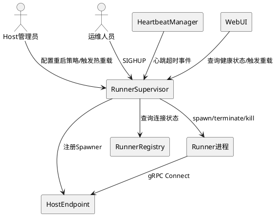
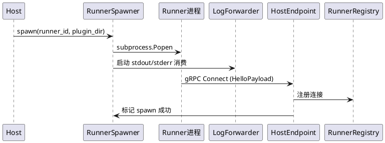
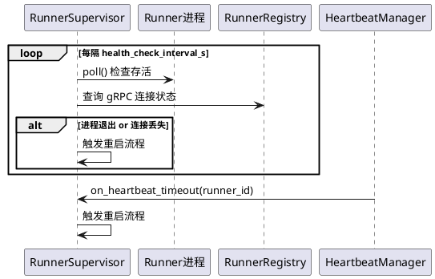
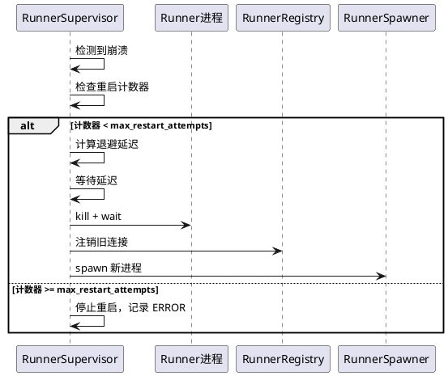
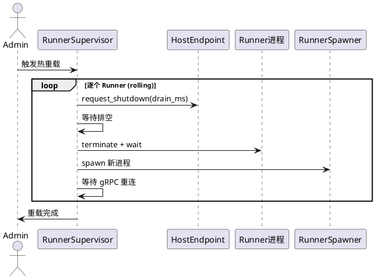

# Phoenix-9：Runner 进程管理增强

# 1. 组件定位

## 1.1 核心职责

本组件负责增强 V2 插件运行时 Runner 子进程的生命周期管理，实现 Host 主动 spawn、健康巡检、崩溃自动重启、配置热重载。

## 1.2 核心输入

1. Host 启动时的 Runner spawn 配置（数量、插件目录、重启策略）
2. gRPC 心跳超时事件（HeartbeatManager 触发）
3. Runner 子进程退出信号（进程 returncode 变化）
4. 热重载触发信号（SIGHUP 或 WebUI 配置变更通知）
5. Host 优雅关停指令

## 1.3 核心输出

1. Runner 子进程的 spawn/terminate/kill 操作
2. 健康状态变更通知（供 WebUI 展示和日志记录）
3. 重启事件记录（重启次数、原因、时间戳）
4. 热重载执行结果（成功/失败/跳过）

## 1.4 职责边界

- **不做**：不管理 Runner 内部插件加载逻辑（那是 Runner 的职责）
- **不做**：不实现跨主机 Runner 调度（单机场景）
- **不做**：不实现插件代码热替换（只做 Runner 进程级重载）
- **不做**：不修改 gRPC 协议或心跳机制（复用现有 HeartbeatManager）

# 2. 领域术语

**Runner 进程**
: 由 Host 通过 subprocess.Popen 启动的 V2 Runner 子进程，承载一个或多个插件的运行时。

**健康巡检**
: Host 定期检查 Runner 子进程存活状态和 gRPC 连接状态的主动探测机制。

**崩溃重启**
: Runner 子进程异常退出或 gRPC 连接断开后，Host 自动重新 spawn 的恢复机制。

**热重载**
: 在不停止 Host 的前提下，向 Runner 发送重载信号使其重新加载插件配置和代码的机制。

**重启计数器**
: 记录单个 Runner 在时间窗口内被重启次数的计数器，用于防止重启风暴。

**重启风暴**
: Runner 反复崩溃重启的恶性循环，通常由配置错误或环境问题导致。

**排空期**
: Runner 关停前等待正在执行的 Tool 调用完成的时间窗口。

# 3. 角色与边界

## 3.1 核心角色

- **Host 管理员**：通过 WebUI 或配置文件设定 Runner 数量、重启策略、热重载触发
- **运维人员**：通过信号（SIGHUP）或 Docker 重启触发热重载

## 3.2 外部系统

- **HeartbeatManager**：提供 gRPC 心跳超时事件，触发 Runner 崩溃判定
- **HostEndpoint**：V2 gRPC 服务端，提供 Runner 连接注册表和关停接口
- **RunnerRegistry**：维护 Runner 连接状态，供健康巡检查询
- **WebUI**：展示 Runner 健康状态、触发热重载操作

## 3.3 交互上下文

# 4. DFX约束

## 4.1 性能

- 健康巡检间隔 SHALL 不小于 5 秒（避免 CPU 空转）
- Runner spawn 到 gRPC 连接就绪 SHALL 在 30 秒内完成（超时视为启动失败）
- 热重载 SHALL 在 10 秒内完成（包括排空 + 重启 + 重连）

## 4.2 可靠性

- 单个 Runner 崩溃 SHALL 在 60 秒内自动恢复（检测 + 重启 + 重连）
- 重启计数器 SHALL 在稳定运行 5 分钟后重置（避免永久放弃）
- 重启风暴 SHALL 被检测并停止（时间窗口内超过阈值则停止重启）

## 4.3 安全性

- Runner 子进程 SHALL 以与 Host 相同的用户权限运行（不提权）
- 热重载 SHALL 验证新配置合法性后再执行（防止错误配置导致崩溃循环）

## 4.4 可维护性

- Runner 生命周期事件 SHALL 记录结构化日志（spawn/restart/crash/reload + 原因 + 时间戳）
- stdout/stderr SHALL 被消费并转发到 Host 日志系统（当前被 PIPE 但未消费）

## 4.5 兼容性

- SHALL 复用现有 HeartbeatManager 和 RunnerRegistry，不修改其接口
- SHALL 复用现有 ReconnectPolicy，不修改其逻辑
- SHALL 与 V1 CompatBridge 的健康检查机制共存不冲突

# 5. 核心能力

## 5.1 Runner 进程 Spawn

### 5.1.1 业务规则

1. **Spawn 超时**：Host spawn Runner 后 SHALL 在 spawn_timeout_sec 内等待 gRPC 连接建立，超时则标记为启动失败
   - 验收条件：[spawn 后 30s 内 Runner 未通过 gRPC Connect 注册] → [标记该 Runner 为 FAILED，记录日志]

2. **stdout/stderr 消费**：Runner 子进程的 stdout/stderr SHALL 被异步读取并转发到 Host 日志系统
   - 验收条件：[Runner 打印日志到 stderr] → [Host 日志中出现对应内容]

3. **Spawner 正式注入**：RunnerSpawner SHALL 通过 HostEndpoint 构造函数或 setter 注入，而非私有属性
   - 验收条件：[HostEndpoint 初始化] → [_runner_spawner 通过正式接口设置，无 _ 前缀私有属性访问]

### 5.1.2 交互流程

### 5.1.3 异常场景

1. **Spawn 超时**
   - 触发条件：Runner 进程启动但 30s 内未完成 gRPC Connect
   - 系统行为：标记 Runner 为 FAILED，kill 子进程，记录日志
   - 用户感知：WebUI 显示 Runner 状态为 "failed"，日志记录超时原因

2. **Spawn 立即失败**
   - 触发条件：subprocess.Popen 失败（如 Python 解释器不存在）
   - 系统行为：记录异常，不创建进程条目
   - 用户感知：日志记录 spawn 错误

## 5.2 健康巡检

### 5.2.1 业务规则

1. **定时巡检**：RunnerSupervisor SHALL 以 health_check_interval_s 为间隔定期执行健康巡检
   - 验收条件：[Runner 进程退出（returncode != None）] → [下次巡检时检测到并触发重启]

2. **双轨检测**：健康巡检 SHALL 同时检查进程存活（poll）和 gRPC 连接状态（registry）
   - 验收条件：[进程存活但 gRPC 连接丢失] → [判定为 ZOMBIE 状态，触发重启]

3. **心跳联动**：HeartbeatManager 心跳超时事件 SHALL 触发 RunnerSupervisor 的崩溃处理
   - 验收条件：[心跳连续 2 次超时] → [RunnerSupervisor 收到通知并触发重启]

### 5.2.2 交互流程

### 5.2.3 异常场景

1. **僵尸 Runner**
   - 触发条件：进程存活（poll=None）但 gRPC 连接不在 registry 中
   - 系统行为：标记为 ZOMBIE，kill 子进程，触发重启
   - 用户感知：日志记录 "zombie runner detected"，WebUI 显示 "zombie"

2. **巡检期间 Runner 正在重启**
   - 触发条件：巡检发现 Runner FAILED 但重启已在进行中
   - 系统行为：跳过，不重复触发
   - 用户感知：无（幂等）

## 5.3 崩溃自动重启

### 5.3.1 业务规则

1. **重启计数器**：每个 Runner SHALL 维护独立重启计数器，记录时间窗口内的重启次数
   - 验收条件：[Runner 崩溃] → [计数器 +1；若超过 max_restart_attempts 则停止重启]

2. **计数器重置**：重启计数器 SHALL 在 Runner 稳定运行 stability_window_s 后重置为 0
   - 验收条件：[Runner 重启后稳定运行 300s] → [计数器归零，可再次重启]

3. **重启风暴检测**：若在 storm_window_s 内重启次数超过 storm_threshold，SHALL 停止重启并告警
   - 验收条件：[60s 内同一 Runner 重启 5 次] → [停止重启，记录 ERROR 日志]

4. **指数退避**：连续重启间隔 SHALL 采用指数退避（initial_delay * 2^attempt，上限 max_delay）
   - 验收条件：[第 3 次重启] → [等待 1*2^2=4s 后再 spawn]

5. **重启前清理**：重启前 SHALL 先清理旧进程（kill + wait）和旧 gRPC 连接（registry 注销）
   - 验收条件：[触发重启] → [旧进程已终止，旧连接已注销，再 spawn 新进程]

### 5.3.2 交互流程

### 5.3.3 异常场景

1. **重启风暴**
   - 触发条件：短时间内 Runner 反复崩溃
   - 系统行为：超过 storm_threshold 后停止重启，记录 ERROR
   - 用户感知：WebUI 显示 Runner 状态 "storm_stopped"，需人工介入

2. **kill 旧进程失败**
   - 触发条件：旧进程已退出但 kill 抛异常
   - 系统行为：try/except 忽略，继续 spawn 新进程
   - 用户感知：无（旧进程已退出，kill 失败无影响）

## 5.4 热重载

### 5.4.1 业务规则

1. **重载信号**：RunnerSupervisor SHALL 支持通过 SIGHUP 信号或 API 调用触发所有 Runner 的热重载
   - 验收条件：[收到 SIGHUP] → [对所有 Runner 执行热重载序列]

2. **重载序列**：热重载 SHALL 按序执行：发送 ShutdownRequest(drain_ms) → 等待排空 → kill → spawn → 等待重连
   - 验收条件：[触发热重载] → [Runner 完成排空后重启并重连]

3. **排空期**：热重载 SHALL 给予 Runner drain_ms 毫秒的排空时间，让正在执行的 Tool 调用完成
   - 验收条件：[Runner 有正在执行的 Tool] → [等待 drain_ms 后再 kill]

4. **渐进式重载**：当有多个 Runner 时，SHALL 逐个重载（rolling reload），确保服务不中断
   - 验收条件：[3 个 Runner 触发重载] → [依次重载 runner-0, runner-1, runner-2，每时刻至少 N-1 个可用]

5. **重载跳过**：若 Runner 当前状态不是 READY，SHALL 跳过该 Runner 的重载
   - 验收条件：[Runner 状态为 FAILED] → [跳过重载，记录 WARNING]

### 5.4.2 交互流程

### 5.4.3 异常场景

1. **重载期间 Runner 崩溃**
   - 触发条件：排空期间 Runner 进程异常退出
   - 系统行为：跳过排空等待，直接 spawn 新进程
   - 用户感知：日志记录 "reload: runner crashed during drain, respawning"

2. **重载后重连超时**
   - 触发条件：新 spawn 的 Runner 30s 内未完成 gRPC Connect
   - 系统行为：标记为 FAILED，走正常崩溃重启流程
   - 用户感知：WebUI 显示 "reload_failed"

# 6. 数据约束

## 6.1 RunnerSpawnerConfig

1. **max_restart_attempts**：单个时间窗口内最大重启次数，默认 3，取值范围 [1, 100]
2. **spawn_timeout_sec**：spawn 后等待 gRPC 连接的超时秒数，默认 30.0，取值范围 [5.0, 300.0]
3. **restart_initial_delay_s**：重启指数退避初始延迟秒数，默认 1.0，取值范围 [0.1, 60.0]
4. **restart_max_delay_s**：重启指数退避最大延迟秒数，默认 30.0，取值范围 [1.0, 300.0]
5. **stability_window_s**：重启计数器重置的稳定运行窗口秒数，默认 300.0，取值范围 [60.0, 3600.0]
6. **storm_window_s**：重启风暴检测时间窗口秒数，默认 60.0，取值范围 [10.0, 600.0]
7. **storm_threshold**：重启风暴检测阈值次数，默认 5，取值范围 [3, 50]
8. **health_check_interval_s**：健康巡检间隔秒数，默认 10.0，取值范围 [5.0, 120.0]
9. **drain_ms**：热重载排空期毫秒数，默认 5000，取值范围 [0, 60000]

## 6.2 RunnerHealthStatus

1. **runner_id**：Runner 唯一标识符，非空字符串
2. **status**：健康状态枚举，取值 {RUNNING, STOPPED, FAILED, ZOMBIE, STARTING}
3. **restart_count**：当前时间窗口内重启次数，非负整数
4. **last_restart_at**：最近一次重启的时间戳，可为 None
5. **last_failure_reason**：最近一次失败原因，可为 None
6. **pid**：子进程 PID，可为 None（未启动时）
7. **uptime_s**：进程运行时长秒数，可为 None