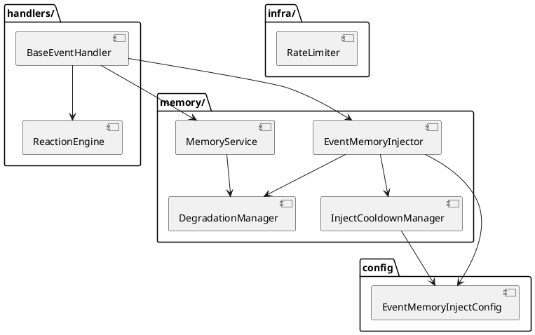
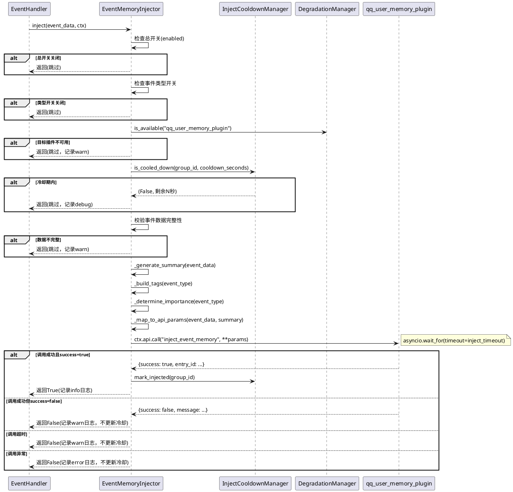
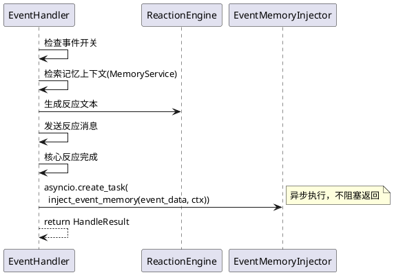
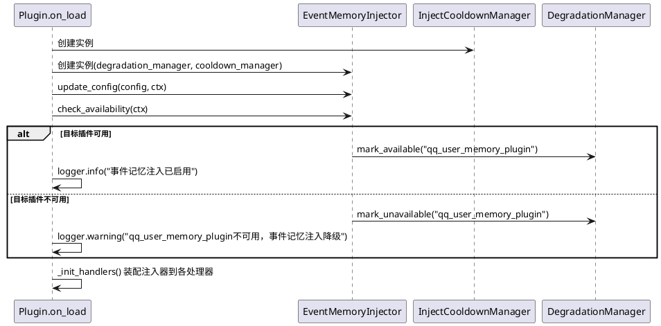
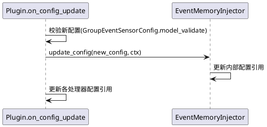

# **1. 实现模型**

## **1.1 上下文视图**

本功能增强在现有 `group_event_sensor` 插件基础上，新增事件记忆注入能力，将群事件感知结果通过 `qq_user_memory_plugin` 的 `inject_event_memory` API 注入到用户记忆中。

```plantuml
@startuml
!define COMPONENT rect
!define SERVICE package

left to right direction

actor "QQ群事件" as event
actor "群管理员" as admin

SERVICE "group_event_sensor" as sensor {
  COMPONENT "EventHandler\n(事件路由)" as handler
  COMPONENT "BaseEventHandler\n(5个具体处理器)" as processors
  COMPONENT "ReactionEngine\n(反应引擎)" as reaction
  COMPONENT "MemoryService\n(A_Memorix交互)" as memory
  COMPONENT "**EventMemoryInjector**\n(事件记忆注入)" as injector
  COMPONENT "InjectCooldownManager\n(注入冷却管理)" as cooldown
  COMPONENT "DegradationManager\n(降级管理)" as degradation
}

SERVICE "qq_user_memory_plugin" as qum {
  COMPONENT "inject_event_memory\n(跨插件注入API)" as inject_api
}

database "A_Memorix" as amemorix

event --> handler : notify消息
admin --> sensor : 配置开关与参数
handler --> processors : 路由事件
processors --> memory : 检索记忆上下文
processors --> reaction : 生成反应文本
processors --> injector : 传递事件数据(异步)
injector --> cooldown : 查询/更新冷却状态
injector --> inject_api : ctx.api.call() 注入记忆
inject_api --> qum : 写入用户记忆
memory --> amemorix : 检索/写入记忆
@enduml
```

### 集成关系说明

| 上游模块 | 下游模块 | 交互方式 | 说明 |
|---------|---------|---------|------|
| BaseEventHandler（5个具体处理器） | EventMemoryInjector | 方法调用 | 处理器在完成核心反应后，异步调用注入器 |
| EventMemoryInjector | InjectCooldownManager | 方法调用 | 注入前查询冷却状态，注入成功后更新冷却 |
| EventMemoryInjector | qq_user_memory_plugin | ctx.api.call() | 调用 `inject_event_memory` API |
| EventMemoryInjector | DegradationManager | 方法调用 | 探测目标插件可用性、标记降级状态 |
| GroupEventSensorPlugin | EventMemoryInjector | 初始化装配 | 插件加载时创建注入器实例并注入到处理器 |

## **1.2 服务/组件总体架构**

### 新增模块

| 模块 | 位置 | 职责 |
|------|------|------|
| `EventMemoryInjector` | `memory/injector.py` | 事件记忆注入核心服务：摘要生成、参数映射、API调用、异常处理 |
| `InjectCooldownManager` | `memory/cooldown.py` | 注入频率控制：基于群ID维度的冷却窗口管理 |
| `EventMemoryInjectConfig` | `config.py`（扩展） | 注入功能配置模型：总开关、事件类型开关、冷却参数、超时参数 |

### 现有模块变更

| 模块 | 变更类型 | 变更内容 |
|------|---------|---------|
| `config.py` | 扩展 | 新增 `EventMemoryInjectConfig` 配置节，挂载到顶层 `GroupEventSensorConfig` |
| `plugin.py` | 扩展 | `on_load` 中初始化 `EventMemoryInjector`，装配到各处理器；`on_config_update` 中传递配置更新 |
| `handlers/base.py` | 扩展 | `BaseEventHandler` 新增 `event_memory_injector` 属性，提供 `inject_event_memory` 公共方法 |
| `infra/degradation.py` | 扩展 | 新增 `qq_user_memory_plugin` 服务标识的可用性管理 |

### 模块依赖关系



## **1.3 实现设计文档**

### 1.3.1 EventMemoryInjector（事件记忆注入器）

**位置**：`memory/injector.py`

**职责**：
1. 接收 `EventData`，生成事件摘要文本
2. 将事件数据映射为 `inject_event_memory` API 参数
3. 通过 `ctx.api.call()` 调用目标插件 API
4. 处理注入结果（成功/失败/超时），更新冷却计时器
5. 记录结构化日志

**关键方法**：

| 方法 | 签名 | 说明 |
|------|------|------|
| `__init__` | `(degradation_manager, cooldown_manager)` | 注入降级管理器和冷却管理器 |
| `update_config` | `(config, ctx)` | 更新配置引用和 PluginContext |
| `check_availability` | `async (ctx) -> bool` | 探测 `qq_user_memory_plugin` 可用性 |
| `inject` | `async (event_data, ctx) -> bool` | 执行事件记忆注入（主入口） |
| `_generate_summary` | `(event_data) -> str` | 根据事件类型生成摘要文本 |
| `_build_tags` | `(event_type) -> str` | 构建逗号分隔的标签字符串 |
| `_determine_importance` | `(event_type) -> int` | 根据事件类型确定重要性等级 |
| `_map_to_api_params` | `(event_data, summary) -> dict` | 将事件数据映射为 API 调用参数 |
| `_call_inject_api` | `async (params, ctx) -> dict` | 执行 API 调用（含超时控制） |

**摘要文本生成规则**：

| 事件类型 | 摘要模板 | 示例 |
|---------|---------|------|
| `red_packet` | `{operator}在群{group}发了红包` | 小明在群测试群发了红包 |
| `poke` | `{operator}戳了戳{target}` | 小明戳了戳小红 |
| `group_ban` | `{operator}禁言了{target}，时长{duration}秒 | 管理员禁言了小明，时长600秒 |
| `group_ban`(解禁) | `{operator}解禁了{target}` | 管理员解禁了小明 |
| `group_increase` | `{operator}加入了群{group}` | 小明加入了群测试群 |
| `group_decrease` | `{operator}退出了群{group}` | 小明退出了群测试群 |

**重要性等级映射**：

| 事件类型 | 默认重要性 | 理由 |
|---------|-----------|------|
| `red_packet` | 1 | 红包为临时性事件，记忆价值低 |
| `poke` | 1 | 戳一戳为临时互动，记忆价值低 |
| `group_ban` | 3 | 禁言涉及群管理行为，有一定记忆价值 |
| `group_increase` | 2 | 入群为中等价值的社会关系事件 |
| `group_decrease` | 2 | 退群为中等价值的社会关系事件 |

**API 参数映射**：

调用 `ctx.api.call("qq_user_memory_plugin", "inject_event_memory", **params)`，参数构建如下：

| API参数 | 来源 | 映射逻辑 |
|---------|------|---------|
| `target_user_id` | `event_data.operator.user_id` | 事件操作者QQ号（主要关联用户） |
| `content` | `_generate_summary()` | 事件摘要文本 |
| `category` | 固定值 `"relation"` | 群事件属于关系类记忆 |
| `importance` | `_determine_importance()` | 按事件类型映射 |
| `group_id` | `event_data.group.group_id` | 事件发生的群号 |
| `tags` | `_build_tags()` | `"group_event,{event_type}"` 格式 |

**多参与者注入策略**：

对于涉及多个用户的事件（如禁言事件有操作者和被操作者），对每个参与者分别调用一次 `inject_event_memory`：
- 禁言事件：分别为被禁言者注入记忆（`target_user_id` = 被禁言者），摘要从被禁言者视角描述
- 戳一戳事件：分别为被戳者注入记忆（`target_user_id` = 被戳者）
- 红包/入群/退群事件：仅对操作者注入记忆

### 1.3.2 InjectCooldownManager（注入冷却管理器）

**位置**：`memory/cooldown.py`

**职责**：
1. 维护以群ID为维度的冷却计时器
2. 查询指定群是否处于冷却期
3. 注入成功时更新冷却计时器
4. 定期清理过期计时器记录防止内存泄漏

**关键方法**：

| 方法 | 签名 | 说明 |
|------|------|------|
| `__init__` | `()` | 初始化计时器存储 |
| `is_cooled_down` | `(group_id, cooldown_seconds) -> tuple[bool, float]` | 查询群是否已冷却，返回 (是否允许, 剩余秒数) |
| `mark_injected` | `(group_id)` | 标记该群注入成功，更新冷却时间 |
| `reset` | `(group_id)` | 重置指定群的冷却计时器（异常恢复用） |
| `_cleanup_expired` | `()` | 清理超过1小时未更新的计时器记录 |

**冷却判定逻辑**：

```
当前时间 - 上次注入时间 >= cooldown_seconds → 允许注入
当前时间 - 上次注入时间 < cooldown_seconds → 拒绝注入，返回剩余秒数
cooldown_seconds == 0 → 始终允许（禁用频率控制）
```

**内存管理**：计时器存储使用 `dict[str, float]`（群ID → 上次注入时间戳），每300秒执行一次过期清理，移除超过3600秒未更新的记录。

### 1.3.3 BaseEventHandler 扩展

**变更内容**：

1. 新增类属性 `event_memory_injector: Any = None`
2. 新增公共方法 `async inject_event_memory(event_data, ctx) -> None`：
   - 检查注入器是否存在
   - 检查配置中注入功能总开关是否启用
   - 检查该事件类型开关是否启用
   - 调用 `event_memory_injector.inject(event_data, ctx)`
   - 异常捕获：注入失败不影响处理器返回结果

**各具体处理器变更**：

在 `handle` 方法的反应发送逻辑之后、`return` 之前，调用 `await self.inject_event_memory(event_data, ctx)`。该调用使用 `asyncio.create_task` 包装为异步任务，不阻塞当前处理流程。

### 1.3.4 插件入口扩展

**`plugin.py` 变更**：

1. `on_load` 方法中：
   - 创建 `InjectCooldownManager` 实例
   - 创建 `EventMemoryInjector` 实例（注入降级管理器和冷却管理器）
   - 调用 `injector.update_config(self.config, self.ctx)` 传递配置
   - 调用 `await injector.check_availability(self.ctx)` 探测目标插件可用性
   - 在 `_init_handlers` 中将注入器装配到各处理器

2. `on_config_update` 方法中：
   - 调用 `injector.update_config(new_config, self.ctx)` 传递配置更新

3. `_init_handlers` 方法中：
   - 为每个处理器实例设置 `handler.event_memory_injector = self._event_memory_injector`

---

# **2. 接口设计**

## **2.1 总体设计**

本功能增强涉及两类接口：

1. **对外调用接口**：通过 `ctx.api.call()` 调用 `qq_user_memory_plugin` 的 `inject_event_memory` API
2. **内部模块接口**：`EventMemoryInjector` 与各处理器、冷却管理器、降级管理器之间的交互

## **2.2 接口清单**

### 2.2.1 对外调用：inject_event_memory API

**调用方式**：
```
result = await ctx.api.call(
    "qq_user_memory_plugin",
    "inject_event_memory",
    target_user_id=str,
    content=str,
    category=str,        # 默认 "relation"
    importance=int,       # 默认 2
    group_id=str,         # 群号
    tags=str,             # 逗号分隔标签
)
```

**参数说明**：

| 参数 | 类型 | 必填 | 说明 |
|------|------|------|------|
| `target_user_id` | str | 是 | 事件相关用户的QQ号 |
| `content` | str | 是 | 事件描述内容（摘要文本） |
| `category` | str | 否 | 记忆类别，默认 `"relation"` |
| `importance` | int | 否 | 重要性1-5，默认2 |
| `group_id` | str | 否 | 群号（群事件必填） |
| `tags` | str | 否 | 标签，逗号分隔 |

**返回值**：

```json
{
  "success": true,
  "entry_id": "xxx",
  "hashed_user_id": "xxx",
  "category": "relation",
  "importance": 2
}
```

失败时：
```json
{
  "success": false,
  "message": "错误描述"
}
```

**白名单约束**：`target_user_id` 对应的用户必须在 `qq_user_memory_plugin` 的被记忆用户白名单中，否则返回 `success: false`。此为正常业务逻辑，不应视为异常。

### 2.2.2 对外调用：可用性探测

**调用方式**：
```
result = await ctx.api.call(
    "qq_user_memory_plugin",
    "retrieve_user_memory",
    limit=1,
    user_id="probe",
)
```

探测逻辑：调用 `retrieve_user_memory` 并传入一个探测用 user_id，若不抛出异常则认为目标插件已注册且可用。超时3秒。探测失败时通过 `DegradationManager` 标记 `qq_user_memory_plugin` 不可用。

### 2.2.3 内部接口：EventMemoryInjector

| 方法 | 入参 | 出参 | 说明 |
|------|------|------|------|
| `inject` | `event_data: EventData, ctx: Any` | `bool` | 执行事件记忆注入，返回是否成功 |
| `update_config` | `config: Any, ctx: Any` | `None` | 更新配置和上下文引用 |
| `check_availability` | `ctx: Any` | `bool` | 探测目标插件可用性 |
| `is_available` | 无 | `bool`（属性） | 查询当前可用性状态 |

### 2.2.4 内部接口：InjectCooldownManager

| 方法 | 入参 | 出参 | 说明 |
|------|------|------|------|
| `is_cooled_down` | `group_id: str, cooldown_seconds: int` | `tuple[bool, float]` | 查询冷却状态，返回(是否允许, 剩余秒数) |
| `mark_injected` | `group_id: str` | `None` | 标记注入成功 |
| `reset` | `group_id: str` | `None` | 重置冷却计时器 |

---

# **3. 数据模型**

## **3.1 设计目标**

1. 在现有 `config.py` 配置模型基础上扩展，不破坏已有配置结构
2. 遵循 Pydantic v2 + PluginConfigBase 的配置模型规范
3. 配置项支持 WebUI 展示（`__ui_label__`、`__ui_icon__`、`__ui_order__`）
4. 所有新增配置项均有合理默认值，功能默认关闭

## **3.2 模型实现**

### 3.2.1 EventMemoryInjectConfig（新增配置节）

**位置**：`config.py`

**字段定义**：

| 字段 | 类型 | 默认值 | 约束 | 说明 |
|------|------|--------|------|------|
| `enabled` | bool | `False` | - | 功能总开关，默认关闭 |
| `red_packet_enabled` | bool | `True` | - | 红包事件注入开关 |
| `poke_enabled` | bool | `True` | - | 戳一戳事件注入开关 |
| `group_ban_enabled` | bool | `True` | - | 禁言事件注入开关 |
| `group_increase_enabled` | bool | `True` | - | 入群事件注入开关 |
| `group_decrease_enabled` | bool | `True` | - | 退群事件注入开关 |
| `cooldown_seconds` | int | `30` | `ge=0, le=3600` | 冷却窗口时长（秒），0=禁用 |
| `inject_timeout` | float | `5.0` | `ge=1.0, le=30.0` | 注入API调用超时时间（秒） |
| `target_plugin_id` | str | `"qq_user_memory_plugin"` | - | 目标记忆插件ID |

**UI元数据**：
- `__ui_label__` = `"事件记忆注入"`
- `__ui_icon__` = `"syringe"`
- `__ui_order__` = `10`

### 3.2.2 GroupEventSensorConfig 扩展

在顶层配置类中新增字段：

| 字段 | 类型 | 默认值 | 说明 |
|------|------|--------|------|
| `event_memory_inject` | `EventMemoryInjectConfig` | `EventMemoryInjectConfig()` | 事件记忆注入配置节 |

### 3.2.3 InjectCooldownState（运行时状态，非持久化）

**位置**：`memory/cooldown.py`（内部使用，无需独立模型文件）

冷却计时器使用 `dict[str, float]` 存储，键为群ID，值为上次成功注入的 Unix 时间戳。此为纯内存状态，插件重启后自动重置。

---

# **4. 关键流程**

## **4.1 事件记忆注入主流程**



## **4.2 处理器集成流程**

各具体处理器（以 `RedPacketHandler` 为例）的 `handle` 方法变更：



**关键约束**：注入操作通过 `asyncio.create_task` 异步执行，确保不增加核心反应的响应延迟。`inject_event_memory` 方法内部捕获所有异常，确保任何注入失败都不影响 `HandleResult` 的返回。

## **4.3 插件初始化流程**



## **4.4 配置热更新流程**



冷却管理器无需配置更新，其冷却参数由 `EventMemoryInjector` 在每次调用时从配置中读取。

## **4.5 降级与异常处理流程**

### 4.5.1 目标插件不可用

```
check_availability 失败
  → DegradationManager.mark_unavailable("qq_user_memory_plugin")
  → 后续所有 inject 调用直接跳过
  → 群事件核心反应不受影响
```

### 4.5.2 注入API调用失败

```
ctx.api.call 抛出异常
  → 捕获异常，记录 error 日志（含异常类型和消息）
  → 不更新冷却计时器
  → 返回 False
```

### 4.5.3 注入API调用超时

```
asyncio.wait_for 超时
  → 捕获 asyncio.TimeoutError
  → 记录 warn 日志（含超时时间和群ID）
  → 不更新冷却计时器
  → 返回 False
```

### 4.5.4 API返回业务失败（白名单拒绝等）

```
result.success == False
  → 记录 warn 日志（含失败原因 message）
  → 不更新冷却计时器
  → 返回 False
  → 注意：白名单拒绝为正常业务逻辑，使用 debug 级别日志
```

### 4.5.5 事件数据不完整

```
event_data.operator.user_id 为空
  → 跳过注入
  → 记录 warn 日志（含缺失字段名）
  → 返回 False
```

### 4.5.6 冷却计时器数据异常

```
计时器存储的时间戳为未来时间或负数
  → 重置该群冷却计时器
  → 允许本次注入
  → 记录 warn 日志
```

### 4.5.7 注入失败率告警

`EventMemoryInjector` 内部维护注入成功/失败计数，当连续失败次数超过10次时，输出 warn 级别告警日志，提示管理员检查目标插件状态。

---

# **5. 配置扩展**

## **5.1 config.toml 模板扩展**

在现有 `config.toml` 中新增 `[event_memory_inject]` 节：

```toml
[event_memory_inject]
enabled = false
red_packet_enabled = true
poke_enabled = true
group_ban_enabled = true
group_increase_enabled = true
group_decrease_enabled = true
cooldown_seconds = 30
inject_timeout = 5.0
target_plugin_id = "qq_user_memory_plugin"
```

## **5.2 配置版本升级**

将 `config_version` 从 `"1.0.0"` 升级至 `"1.1.0"`，新增 `event_memory_inject` 配置节。

## **5.3 _manifest.json 变更**

确认 `capabilities` 中已包含 `"api.call"`（当前已有），无需变更。

---

# **6. 需求追踪**

| 需求编号 | 实现模块 | 实现要点 |
|---------|---------|---------|
| FR-01 | EventMemoryInjector.inject | 总开关+类型开关检查 → 摘要生成 → API调用 |
| FR-02 | EventMemoryInjector._generate_summary | 按事件类型分支生成摘要，覆盖5种类型 |
| FR-03 | EventMemoryInjector._generate_summary | 摘要包含事件类型名、参与者昵称/QQ号、时间 |
| FR-04 | EventMemoryInjector.inject | 多参与者场景分别调用API，person_ids包含所有相关用户 |
| FR-05 | EventMemoryInjector._build_tags | 返回 `"group_event,{event_type}"` 格式标签 |
| FR-06 | qq_user_memory_plugin内部 | 幂等性由目标插件的去重机制保证，本模块不重复处理 |
| FR-07 | EventMemoryInjector.inject | 所有异常捕获，降级跳过，核心反应不受影响 |
| FR-08 | InjectCooldownManager.is_cooled_down | 冷却期内返回(False, 剩余秒数) |
| FR-09 | InjectCooldownManager.is_cooled_down | 冷却过期返回(True, 0) |
| FR-10 | InjectCooldownManager | 冷却维度为群ID，同群所有类型共享计时器 |
| FR-11 | EventMemoryInjectConfig.cooldown_seconds | 可配置，0=禁用 |
| FR-12 | InjectCooldownManager.mark_injected | 注入成功后更新计时器 |
| FR-13 | EventMemoryInjector.inject | 注入失败时不调用 mark_injected |
| FR-14 | EventMemoryInjectConfig.enabled | 总开关默认false |
| FR-15 | EventMemoryInjectConfig 各类型开关 | 独立控制各事件类型 |
| FR-16 | Pydantic Field约束 | ge/le约束+默认值兜底 |
| FR-17 | EventMemoryInjector.check_availability | 探测失败→DegradationManager标记不可用 |
| FR-18 | asyncio.wait_for | 超时控制，超时后取消并记录日志 |
| FR-19 | EventMemoryInjector.inject | 数据完整性校验，缺失时跳过+告警 |
| FR-20 | asyncio.create_task | 注入操作异步执行，不阻塞处理器返回 |
| NFR-01 | asyncio.wait_for(timeout=5) | 单次注入不超过5秒 |
| NFR-02 | asyncio.create_task | 注入异步执行，不增加核心反应延迟 |
| NFR-03 | 异常捕获+降级 | 注入失败不影响核心反应 |
| NFR-04 | 连续失败计数 | 超过10次连续失败输出告警 |
| NFR-05 | SDK 2.4.0+ | 使用ctx.api.call()标准接口 |
| NFR-06 | 配置模型+manifest | Docker环境通过配置模型管理 |
| NFR-07 | 仅调用公开API | 不修改qq_user_memory_plugin代码 |