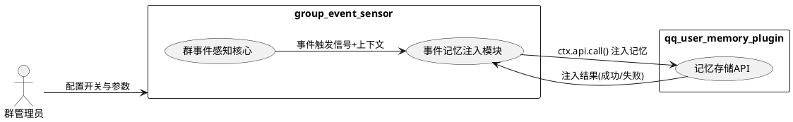
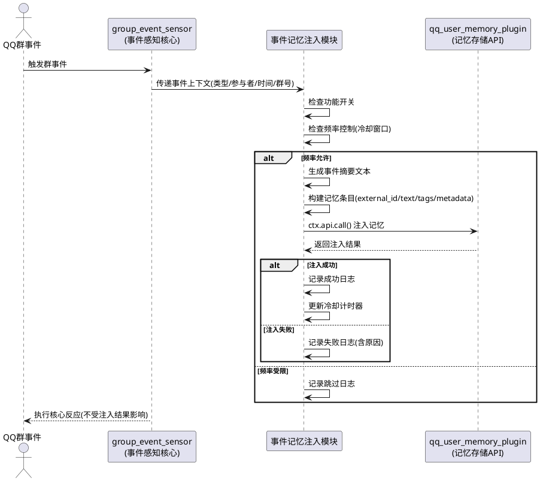
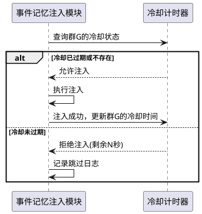
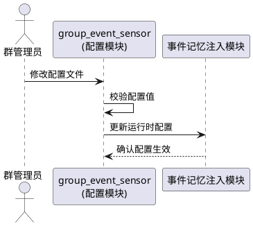

# **1. 组件定位**

## **1.1 核心职责**

本组件负责将群事件感知结果注入到用户记忆插件，实现群行为事件与用户记忆的深度关联。

## **1.2 核心输入**

1. QQ群事件信号：红包、戳一戳、禁言、入群、退群等5种事件的触发通知
2. 事件上下文数据：事件类型、参与者QQ号/昵称、目标对象、时间戳、群号等
3. 配置指令：功能开关、频率控制参数、注入模板等配置项
4. qq_user_memory_plugin API响应：记忆注入操作的成功/失败结果

## **1.3 核心输出**

1. 注入到qq_user_memory_plugin的记忆条目：包含事件摘要文本、参与者信息、时间信息、标签等
2. 注入结果日志：记录每次注入操作的成功/失败状态及原因
3. 频率控制状态：当前冷却计时器状态、已跳过的事件计数

## **1.4 职责边界**

1. 不负责群事件的原始感知与反应（由group_event_sensor核心功能承担）
2. 不负责记忆的存储、检索、合并逻辑（由qq_user_memory_plugin承担）
3. 不修改qq_user_memory_plugin的代码或配置
4. 不负责A_Memorix的直接调用（记忆注入通过qq_user_memory_plugin API间接完成）
5. 注入失败时不中断群事件的核心反应流程

# **2. 领域术语**

**群事件**
: QQ群内发生的可感知行为，包括红包雨、戳一戳、禁言、入群、退群五种类型。

**事件记忆注入**
: 将群事件的关键信息转化为结构化记忆条目，通过API写入用户记忆插件的过程。

**注入频率控制**
: 对同一用户或同一群的事件记忆注入进行时间窗口限制，防止高频事件导致记忆写入过载的机制。

**冷却窗口**
: 自上次成功注入起，同一目标（用户或群）必须等待的最小时间间隔。

**事件摘要文本**
: 由群事件信息生成的、面向LLM可读的自然语言描述，包含事件类型、参与者、时间等关键信息。

**记忆条目**
: 注入到qq_user_memory_plugin的单条记忆数据单元，包含文本、标签、元数据等字段。

**注入降级**
: 当qq_user_memory_plugin不可用或注入失败时，系统跳过注入步骤、仅执行核心反应的容错行为。

# **3. 角色与边界**

## **3.1 核心角色**

群管理员：通过配置文件控制事件记忆注入功能的开关和参数。

## **3.2 外部系统**

group_event_sensor核心：提供群事件触发信号和事件上下文数据，是本功能增强的上游依赖。

qq_user_memory_plugin：提供用户记忆存储API，是记忆注入的下游目标系统，通过ctx.api.call()调用其公开接口。

## **3.3 交互上下文**

# **4. DFX约束**

## **4.1 性能**

1. 单次事件记忆注入的API调用耗时不得超过5秒，超时视为注入失败
2. 冷却窗口默认值不低于30秒，防止高频事件导致API过载
3. 事件记忆注入不得增加群事件核心反应的响应延迟超过100毫秒（注入操作应异步执行）

## **4.2 可靠性**

1. 注入失败率超过50%时，应在日志中输出告警信息
2. qq_user_memory_plugin不可用时，群事件核心反应功能必须100%正常运行
3. 注入操作必须具备幂等性，同一事件重复触发不产生重复记忆条目

## **4.3 安全性**

1. 禁言事件涉及的管理操作信息，注入时不得暴露操作者与管理权限细节
2. 注入的记忆条目必须遵守qq_user_memory_plugin的数据过滤规则

## **4.4 可维护性**

1. 每次注入操作必须记录结构化日志，包含事件类型、目标用户、注入结果、耗时
2. 频率控制跳过事件时必须记录debug级别日志，包含跳过原因和事件摘要
3. 配置变更应支持热更新，无需重启插件

## **4.5 兼容性**

1. 必须兼容MaiBot插件SDK 2.4.0及以上版本
2. 当qq_user_memory_plugin未安装或版本不兼容时，必须优雅降级，不得抛出未捕获异常
3. 必须适配Docker部署环境，配置项通过_manifest.json和插件配置模型管理

# **5. 核心能力**

## **5.1 事件记忆注入**

### **5.1.1 业务规则**

1. **事件触发注入规则**：当群事件发生且功能开关启用时，必须将事件信息转化为记忆条目并注入到qq_user_memory_plugin

   a. 验收条件：[红包事件触发且开关启用] → [生成包含"红包"类型、发送者、时间的记忆条目并调用注入API]

2. **事件类型覆盖规则**：必须支持以下5种群事件类型的记忆注入：红包、戳一戳、禁言、入群、退群

   a. 验收条件：[任意一种5类事件触发] → [均能生成对应类型的记忆条目并注入]

3. **摘要文本生成规则**：事件摘要文本必须包含事件类型名称、参与者标识（昵称或QQ号）、事件发生时间，使用简体中文

   a. 验收条件：[戳一戳事件：A戳了B] → [摘要文本包含"戳一戳"、A的标识、B的标识、时间信息]

4. **参与者信息关联规则**：注入记忆时必须将事件相关用户（发送者、接收者、被操作者）的person_ids传入API

   a. 验收条件：[禁言事件：管理员A禁言用户B] → [person_ids包含A和B的标识]

5. **标签分类规则**：每条注入记忆必须携带标签，标签体系为：`group_event` + 事件类型标签（如`red_packet`、`poke`、`mute`、`join`、`leave`）

   a. 验收条件：[红包事件注入] → [tags包含"group_event"和"red_packet"]

6. **幂等性规则**：同一事件的重复触发不得产生重复记忆条目，必须使用事件的唯一标识作为external_id

   a. 验收条件：[同一红包事件因网络重传触发2次] → [仅产生1条记忆条目]

7. **禁止项**：禁止在注入记忆时修改qq_user_memory_plugin的内部状态或数据结构

   a. 验收条件：[任何注入操作] → [仅通过公开API调用，不直接操作数据库或内部变量]

### **5.1.2 交互流程**

### **5.1.3 异常场景**

1. **qq_user_memory_plugin不可用**

   a. 触发条件：ctx.api.call()调用时目标插件未注册或返回连接错误

   b. 系统行为：跳过注入步骤，记录warn级别日志，继续执行群事件核心反应

   c. 用户感知：群事件正常反应，无感知；管理员可在日志中看到注入失败记录

2. **注入API调用超时**

   a. 触发条件：ctx.api.call()调用超过5秒未返回

   b. 系统行为：取消本次注入，记录warn级别日志含超时信息，继续执行核心反应

   c. 用户感知：群事件正常反应；管理员可在日志中看到超时记录

3. **注入API返回业务错误**

   a. 触发条件：API调用返回错误码或异常结果（如参数校验失败、数据格式不匹配）

   b. 系统行为：记录error级别日志含错误详情，继续执行核心反应

   c. 用户感知：群事件正常反应；管理员可在日志中看到具体错误信息

4. **事件上下文数据不完整**

   a. 触发条件：事件触发时缺少必要字段（如参与者QQ号为空）

   b. 系统行为：跳过本次注入，记录warn级别日志含缺失字段信息

   c. 用户感知：群事件正常反应；管理员可在日志中看到数据不完整告警

5. **频率控制冷却期内重复事件**

   a. 触发条件：同一目标在冷却窗口内再次触发事件

   b. 系统行为：跳过注入，记录debug级别日志含跳过原因和剩余冷却时间

   c. 用户感知：无感知；管理员可在debug日志中查看跳过统计

## **5.2 注入频率控制**

### **5.2.1 业务规则**

1. **冷却窗口规则**：同一群内的事件记忆注入必须受冷却窗口约束，上次成功注入后必须等待冷却时间结束才能再次注入

   a. 验收条件：[群A在T1时刻成功注入，冷却窗口30秒] → [群A在T1+20秒时的事件被跳过，T1+31秒时的事件可注入]

2. **冷却维度规则**：冷却窗口的判定维度为群ID，即同一群内所有类型事件共享冷却计时器

   a. 验收条件：[群A红包事件注入后] → [群A的戳一戳事件在冷却期内也被跳过]

3. **冷却窗口可配置规则**：冷却窗口时长必须可通过配置文件调整，支持设为0（禁用频率控制）

   a. 验收条件：[配置冷却窗口为60秒] → [实际冷却间隔为60秒]；[配置冷却窗口为0] → [不进行频率控制]

4. **冷却重置规则**：仅在注入成功时更新冷却计时器，注入失败不重置冷却时间

   a. 验收条件：[注入失败后] → [冷却计时器保持上次成功注入的时间]

### **5.2.2 交互流程**

### **5.2.3 异常场景**

1. **冷却计时器数据异常**

   a. 触发条件：计时器存储的时间戳为非法值（如未来时间或负数）

   b. 系统行为：重置该群的冷却计时器，允许本次注入，记录warn日志

   c. 用户感知：无感知；管理员可在日志中看到计时器重置记录

## **5.3 配置管理**

### **5.3.1 业务规则**

1. **功能总开关规则**：必须提供全局开关控制是否启用事件记忆注入功能，默认为关闭

   a. 验收条件：[开关为false] → [所有群事件均不触发记忆注入]；[开关为true] → [按其他条件判断是否注入]

2. **事件类型开关规则**：必须支持按事件类型独立控制是否注入记忆，每种事件类型有独立开关

   a. 验收条件：[红包事件开关关闭、戳一戳开关开启] → [红包事件不注入、戳一戳事件注入]

3. **冷却窗口配置规则**：冷却窗口时长必须可配置，单位为秒，默认30秒，最小值0

   a. 验收条件：[配置cooldown_seconds=60] → [冷却窗口为60秒]；[配置cooldown_seconds=0] → [禁用频率控制]

4. **配置校验规则**：配置值必须在合法范围内，非法配置必须使用默认值并输出告警日志

   a. 验收条件：[配置cooldown_seconds=-5] → [使用默认值30秒，输出warn日志]

### **5.3.2 交互流程**

### **5.3.3 异常场景**

1. **配置文件缺失或格式错误**

   a. 触发条件：配置文件不存在或JSON/TOML解析失败

   b. 系统行为：使用全部默认配置，功能开关默认关闭，记录warn日志

   c. 用户感知：插件正常启动但记忆注入功能未启用；管理员可在日志中看到配置加载失败信息

# **6. 数据约束**

## **6.1 事件记忆条目**

1. **external_id**：事件的唯一标识，格式为`group_event:{group_id}:{event_type}:{event_timestamp}`，用于幂等去重，必填

2. **source_type**：固定为`group_event`，标识记忆来源类型，必填

3. **text**：事件摘要文本，简体中文，长度1-500字符，必填

4. **chat_id**：事件发生的群对应的session_id，必填

5. **person_ids**：事件相关用户的QQ号列表，至少包含1个用户ID，必填

6. **participants**：事件相关用户的昵称列表，与person_ids一一对应，必填

7. **timestamp**：事件发生的Unix时间戳（秒级），必填

8. **tags**：标签列表，必须包含`group_event`和事件类型标签，必填

9. **metadata**：元数据字典，必须包含`event_type`、`group_id`字段，可选包含`operator_id`、`duration`等事件特有字段

## **6.2 频率控制状态**

1. **group_id**：群ID，作为冷却计时器的键，必填

2. **last_inject_time**：上次成功注入的Unix时间戳（秒级），必填

3. **cooldown_seconds**：冷却窗口时长（秒），取值范围[0, 3600]，默认30

## **6.3 注入配置**

1. **enabled**：功能总开关，布尔值，默认false

2. **event_type_enabled**：各事件类型开关字典，键为事件类型名，值为布尔值，默认全部true

3. **cooldown_seconds**：冷却窗口时长（秒），取值范围[0, 3600]，默认30

4. **inject_timeout**：注入API调用超时时间（秒），取值范围[1, 30]，默认5

5. **target_plugin_id**：目标记忆插件ID，字符串，默认为qq_user_memory_plugin的注册ID

---

# **EARS格式需求汇总**

以下为全部功能需求的EARS格式表述，便于追踪与验证。

## FR-01: 事件触发记忆注入

When 群事件发生且功能总开关启用且该事件类型开关启用, the 事件记忆注入模块 shall 将事件信息转化为记忆条目并通过ctx.api.call()注入到qq_user_memory_plugin

## FR-02: 五种事件类型覆盖

When 任意一种群事件（红包/戳一戳/禁言/入群/退群）触发, the 事件记忆注入模块 shall 生成对应事件类型的记忆条目

## FR-03: 摘要文本内容

When 群事件触发记忆注入, the 事件记忆注入模块 shall 生成包含事件类型名称、参与者标识、事件时间的简体中文摘要文本

## FR-04: 参与者关联

When 事件涉及多个用户（如禁言事件的操作者与被操作者）, the 事件记忆注入模块 shall 将所有相关用户的person_ids传入注入API

## FR-05: 标签分类

When 事件记忆注入执行, the 事件记忆注入模块 shall 为记忆条目添加"group_event"标签和对应事件类型标签

## FR-06: 注入幂等性

When 同一群事件因重传等原因重复触发, the 事件记忆注入模块 shall 仅产生一条记忆条目，不产生重复记录

## FR-07: 注入失败降级

If qq_user_memory_plugin不可用或注入API调用失败或超时, the 事件记忆注入模块 shall 跳过注入步骤并记录日志，群事件核心反应功能不受影响

## FR-08: 冷却窗口控制

While 同一群处于冷却窗口内, the 事件记忆注入模块 shall 跳过该群的事件记忆注入并记录debug日志

## FR-09: 冷却窗口过期恢复

When 冷却窗口过期, the 事件记忆注入模块 shall 允许该群的下次事件记忆注入

## FR-10: 冷却维度为群

While 同一群内任意类型事件刚完成注入且冷却未过期, the 事件记忆注入模块 shall 跳过该群所有类型事件的记忆注入

## FR-11: 冷却窗口可配置

Where 冷却窗口配置项存在, the 事件记忆注入模块 shall 按配置值设定冷却间隔；配置为0时禁用频率控制

## FR-12: 注入成功更新冷却

When 事件记忆注入成功, the 事件记忆注入模块 shall 更新该群的冷却计时器为当前时间

## FR-13: 注入失败不更新冷却

If 事件记忆注入失败, the 事件记忆注入模块 shall 不更新该群的冷却计时器

## FR-14: 功能总开关

Where 功能总开关配置为false, the 事件记忆注入模块 shall 不执行任何记忆注入操作

## FR-15: 事件类型独立开关

Where 某事件类型开关配置为false, the 事件记忆注入模块 shall 不注入该类型事件的记忆

## FR-16: 配置校验与默认值

If 配置值超出合法范围, the 事件记忆注入模块 shall 使用默认值并输出告警日志

## FR-17: 目标插件不可用降级

If qq_user_memory_plugin未安装或版本不兼容, the 事件记忆注入模块 shall 优雅降级，不抛出未捕获异常，功能开关自动视为关闭

## FR-18: 注入API超时

If 注入API调用超过配置的超时时间, the 事件记忆注入模块 shall 取消本次注入并记录超时日志

## FR-19: 事件上下文不完整

If 事件触发时缺少必要字段（如参与者ID为空）, the 事件记忆注入模块 shall 跳过本次注入并记录数据不完整告警

## FR-20: 注入操作异步执行

When 群事件触发记忆注入, the 事件记忆注入模块 shall 异步执行注入操作，不阻塞群事件核心反应流程

---

# **非功能需求**

## NFR-01: 性能

The 事件记忆注入模块 shall 单次注入API调用耗时不超过5秒

The 事件记忆注入模块 shall 注入操作不增加核心反应延迟超过100毫秒

## NFR-02: 可靠性

The 事件记忆注入模块 shall 注入失败时群事件核心反应100%正常运行

The 事件记忆注入模块 shall 注入失败率超过50%时输出告警日志

## NFR-03: 兼容性

The 事件记忆注入模块 shall 兼容MaiBot插件SDK 2.4.0及以上版本

The 事件记忆注入模块 shall 适配Docker部署环境

The 事件记忆注入模块 shall 不修改qq_user_memory_plugin的代码

---

# **接口需求**

## 与qq_user_memory_plugin的接口

### 调用方式

通过 `ctx.api.call(plugin_id, api_name, **kwargs)` 调用qq_user_memory_plugin的公开API。

### API探测

在插件初始化阶段，通过 `ctx.api.call("qq_user_memory_plugin", "memory_stats")` 或等效的健康检查API探测目标插件可用性。

### 记忆注入API

调用名称：待qq_user_memory_plugin确认的注入API名称（预期为`ingest_text`或等效接口）

调用参数映射：

| 本模块字段 | API参数 | 说明 |
|-----------|---------|------|
| external_id | external_id | 幂等去重ID，格式`group_event:{group_id}:{event_type}:{timestamp}` |
| - | source_type | 固定值`group_event` |
| text | text | 事件摘要文本 |
| chat_id | chat_id | 群session_id |
| person_ids | person_ids | 事件相关用户QQ号列表 |
| participants | participants | 事件相关用户昵称列表 |
| timestamp | timestamp | 事件时间戳 |
| tags | tags | 标签列表 |
| metadata | metadata | 元数据字典 |

### 返回值处理

- 成功：记录info日志，更新冷却计时器
- 失败：记录error/warn日志（含错误码和原因），不更新冷却计时器
- 超时：取消调用，记录warn日志

---

# **约束条件**

1. 技术约束：使用MaiBot插件SDK 2.4.0+，通过ctx.api.call()调用外部插件API
2. 代码约束：不修改qq_user_memory_plugin的任何代码
3. 语言约束：事件摘要文本、日志信息、配置描述均使用简体中文
4. 部署约束：适配Docker部署环境，配置通过_manifest.json和插件配置模型管理
5. 异步约束：注入操作必须异步执行，不得阻塞事件处理主流程
6. 降级约束：注入失败不得影响group_event_sensor的核心感知与反应功能

---

# **需求追踪矩阵**

| 需求编号 | 需求名称 | EARS模式 | 对应业务规则 | 验证方式 |
|---------|---------|---------|------------|---------|
| FR-01 | 事件触发记忆注入 | Event-Driven | 5.1.1 规则1 | 功能测试：触发事件+开关启用→注入成功 |
| FR-02 | 五种事件类型覆盖 | Event-Driven | 5.1.1 规则2 | 功能测试：逐类型触发→均生成记忆 |
| FR-03 | 摘要文本内容 | Event-Driven | 5.1.1 规则3 | 功能测试：检查摘要包含类型/参与者/时间 |
| FR-04 | 参与者关联 | Event-Driven | 5.1.1 规则4 | 功能测试：检查person_ids包含所有相关用户 |
| FR-05 | 标签分类 | Event-Driven | 5.1.1 规则5 | 功能测试：检查tags包含group_event+类型标签 |
| FR-06 | 注入幂等性 | Event-Driven | 5.1.1 规则6 | 功能测试：同事件触发2次→仅1条记忆 |
| FR-07 | 注入失败降级 | Unwanted Behavior | 5.1.3 场景1-3 | 异常测试：模拟API失败→核心反应正常 |
| FR-08 | 冷却窗口控制 | State-Driven | 5.2.1 规则1 | 功能测试：冷却期内触发→跳过注入 |
| FR-09 | 冷却窗口过期恢复 | Event-Driven | 5.2.1 规则1 | 功能测试：冷却过期→允许注入 |
| FR-10 | 冷却维度为群 | State-Driven | 5.2.1 规则2 | 功能测试：同群不同类型事件→共享冷却 |
| FR-11 | 冷却窗口可配置 | Optional Feature | 5.2.1 规则3 | 配置测试：修改冷却值→生效 |
| FR-12 | 注入成功更新冷却 | Event-Driven | 5.2.1 规则4 | 功能测试：注入成功→计时器更新 |
| FR-13 | 注入失败不更新冷却 | Unwanted Behavior | 5.2.1 规则4 | 异常测试：注入失败→计时器不变 |
| FR-14 | 功能总开关 | Optional Feature | 5.3.1 规则1 | 配置测试：开关关→不注入 |
| FR-15 | 事件类型独立开关 | Optional Feature | 5.3.1 规则2 | 配置测试：单类型开关关→该类型不注入 |
| FR-16 | 配置校验与默认值 | Unwanted Behavior | 5.3.1 规则4 | 异常测试：非法配置→使用默认值+告警 |
| FR-17 | 目标插件不可用降级 | Unwanted Behavior | 5.1.3 场景1 | 异常测试：卸载目标插件→优雅降级 |
| FR-18 | 注入API超时 | Unwanted Behavior | 5.1.3 场景2 | 异常测试：模拟超时→取消+日志 |
| FR-19 | 事件上下文不完整 | Unwanted Behavior | 5.1.3 场景4 | 异常测试：缺必要字段→跳过+告警 |
| FR-20 | 注入操作异步执行 | Ubiquitous | 5.1.1 规则1 | 性能测试：注入不阻塞核心反应 |
| NFR-01 | 注入耗时上限 | Ubiquitous | 4.1 | 性能测试：单次注入<5秒 |
| NFR-02 | 核心反应无延迟影响 | Ubiquitous | 4.1 | 性能测试：延迟增加<100ms |
| NFR-03 | 核心反应可靠性 | Ubiquitous | 4.2 | 异常测试：注入失败→核心100%正常 |
| NFR-04 | 失败率告警 | Ubiquitous | 4.2 | 异常测试：失败率>50%→告警日志 |
| NFR-05 | SDK版本兼容 | Ubiquitous | 4.5 | 兼容性测试：SDK 2.4.0+运行正常 |
| NFR-06 | Docker适配 | Ubiquitous | 4.5 | 部署测试：Docker环境功能正常 |
| NFR-07 | 不修改目标插件 | Ubiquitous | 约束条件 | 代码审查：无对目标插件的代码修改 |