# **1. 实现模型**

## **1.1 上下文视图**

```plantuml
@startuml
left to right direction

actor "群成员" as member
actor "机器人管理员" as admin

rectangle "群行为感知插件 (group_event_sensor)" as plugin {
    package "事件监听层" {
        [EventHandler\n事件分发器]
    }
    package "事件处理层" {
        [红包处理器]
        [戳一戳处理器]
        [禁言处理器]
        [入群处理器]
        [退群处理器]
    }
    package "智能反应层" {
        [反应决策引擎]
        [模板反应生成器]
        [LLM反应生成器]
    }
    package "记忆协同层" {
        [记忆检索服务]
        [记忆注入服务]
        [记忆写入服务]
    }
    package "配置管理层" {
        [配置模型]
        [热重载回调]
    }
    package "基础设施层" {
        [频率控制器]
        [安全哈希工具]
        [降级策略管理器]
    }
}

system "MaiBot主程序" as maibot {
    [PluginContext API]
    [EventHandler分发]
    [WebUI]
}

system "A_Memorix" as memory {
    [search_memory]
    [get_person_profile]
    [ingest_text]
}

system "QQ协议端" as qq

member --> qq : 触发群行为事件
qq --> maibot : 上报notify消息
maibot --> [EventHandler\n事件分发器] : 分发ON_MESSAGE事件
[EventHandler\n事件分发器] --> [红包处理器] : sub_type路由
[EventHandler\n事件分发器] --> [戳一戳处理器] : sub_type路由
[EventHandler\n事件分发器] --> [禁言处理器] : sub_type路由
[EventHandler\n事件分发器] --> [入群处理器] : sub_type路由
[EventHandler\n事件分发器] --> [退群处理器] : sub_type路由

[红包处理器] --> [反应决策引擎]
[戳一戳处理器] --> [反应决策引擎]
[禁言处理器] --> [反应决策引擎]
[入群处理器] --> [反应决策引擎]
[退群处理器] --> [反应决策引擎]

[反应决策引擎] --> [记忆检索服务]
[记忆检索服务] --> memory : search_memory/get_person_profile
[记忆检索服务] --> [记忆注入服务]
[记忆注入服务] --> [LLM反应生成器] : 注入记忆上下文
[反应决策引擎] --> [模板反应生成器] : template模式
[反应决策引擎] --> [LLM反应生成器] : llm模式
[LLM反应生成器] --> maibot : ctx.llm.generate()
[模板反应生成器] --> maibot : ctx.send.text()
[LLM反应生成器] --> maibot : ctx.send.text()
[记忆写入服务] --> memory : ingest_text

admin --> [WebUI] : 修改配置
[WebUI] --> [热重载回调] : on_config_update

@enduml
```

## **1.2 服务/组件总体架构**

插件采用**分层架构**，自上而下分为五层：

| 层次 | 职责 | 关键组件 |
|------|------|----------|
| 事件监听层 | 捕获MaiBot分发的ON_MESSAGE事件，识别notify消息并路由到对应处理器 | `GroupEventHandler` |
| 事件处理层 | 各事件类型的业务逻辑处理，包括事件识别、信息提取、前置校验 | `RedPacketHandler`, `PokeHandler`, `GroupBanHandler`, `GroupIncreaseHandler`, `GroupDecreaseHandler` |
| 智能反应层 | 根据配置模式选择反应生成策略，生成个性化反应文本 | `ReactionEngine`, `TemplateReactor`, `LLMReactor` |
| 记忆协同层 | 与A_Memorix交互，完成记忆检索、上下文注入、事件记忆写入 | `MemoryService` |
| 基础设施层 | 提供横切关注点支持 | `RateLimiter`, `SafeHash`, `DegradationManager`, `PluginConfig` |

**依赖关系原则**：
- 上层可依赖下层，下层不可依赖上层
- 事件处理层各处理器之间无交叉依赖（NFR-03-03/NFR-03-04）
- 记忆协同层仅通过A_Memorix公开接口交互（FR-06-05）
- 所有层均可访问基础设施层

## **1.3 实现设计文档**

### **1.3.1 插件目录结构**

```
plugins/
    group_event_sensor/          # 插件根目录（独立Git仓库）
        _manifest.json           # 插件元信息
        plugin.py                # 插件入口（create_plugin + GroupEventSensorPlugin类）
        config.py                # Pydantic v2配置模型
        handlers/                # 事件处理器包
            __init__.py
            base.py              # BaseEventHandler抽象基类
            red_packet.py        # 红包事件处理器
            poke.py              # 戳一戳事件处理器
            group_ban.py         # 禁言事件处理器
            group_increase.py    # 入群事件处理器
            group_decrease.py    # 退群事件处理器
        reaction/                # 智能反应包
            __init__.py
            engine.py            # ReactionEngine反应决策引擎
            template.py          # TemplateReactor模板反应生成器
            llm.py               # LLMReactor LLM反应生成器
        memory/                  # 记忆协同包
            __init__.py
            service.py           # MemoryService记忆服务
        infra/                   # 基础设施包
            __init__.py
            rate_limiter.py      # RateLimiter频率控制器
            safe_hash.py         # SafeHash安全哈希工具
            degradation.py       # DegradationManager降级策略管理器
        templates/               # 反应模板资源目录
            zh-CN/               # 中文模板
                red_packet.toml
                poke.toml
                group_ban.toml
                group_increase.toml
                group_decrease.toml
        _locales/                # 国际化资源（可选）
            zh-CN/
                messages.json
        __init__.py
```

### **1.3.2 模块职责详述**

#### **plugin.py — 插件入口与生命周期管理**

职责：
- 定义 `GroupEventSensorPlugin(MaiBotPlugin)` 主类，声明 `config_model`
- 实现 `on_load()`：初始化各层组件、注册事件处理器、记录启动日志
- 实现 `on_unload()`：清理资源、记录关闭日志
- 实现 `on_config_update()`：接收配置变更通知，热重载配置到各组件
- 定义 `create_plugin()` 工厂函数

关键设计决策：
- `on_load()` 中实例化 `MemoryService`、`ReactionEngine`、`RateLimiter`、`DegradationManager`，并注入到各事件处理器
- 使用 `@EventHandler` 装饰器注册单一的 `ON_MESSAGE` 事件处理器作为入口，在处理器内部根据 `is_notify` 和 `sub_type` 路由到具体处理器
- 配置热重载通过 `on_config_update` 回调实现，更新 `self.config` 后通知各组件刷新

#### **config.py — 配置模型**

职责：
- 使用 Pydantic v2 + `PluginConfigBase` 定义完整配置模型
- 每个配置分组设置 `__ui_label__`、`__ui_icon__`、`__ui_order__` 以支持 WebUI 展示
- 所有字段提供 `description` 和合理的 `default` 值

配置模型结构（详见第4节数据模型）：
- `PluginSectionConfig`：插件总开关与版本
- `RedPacketConfig`：红包事件配置
- `PokeConfig`：戳一戳事件配置
- `GroupBanConfig`：禁言事件配置
- `GroupIncreaseConfig`：入群事件配置
- `GroupDecreaseConfig`：退群事件配置
- `ReactionConfig`：反应模式配置
- `MemoryConfig`：记忆协同配置
- `LLMConfig`：LLM生成参数配置
- `GroupOverrideConfig`：群级配置覆盖
- `GroupEventSensorConfig`：顶层配置聚合

#### **handlers/ — 事件处理层**

**base.py — BaseEventHandler 抽象基类**

职责：
- 定义事件处理器的统一接口 `async def handle(self, event_data: EventData, ctx: PluginContext) -> HandleResult`
- 提供公共的事件信息提取方法（操作者信息、群信息、被操作者信息）
- 提供配置开关检查前置逻辑
- 提供异常捕获兜底，确保单次处理失败不影响后续

**各具体处理器（red_packet.py / poke.py / group_ban.py / group_increase.py / group_decrease.py）**

每个处理器职责：
1. 从事件载荷中提取该事件类型的特有信息
2. 执行事件特有的前置校验（如戳一戳方向判断、禁言/解禁区分）
3. 调用 `MemoryService` 检索记忆上下文
4. 调用 `ReactionEngine` 生成反应文本
5. 通过 `ctx.send.text()` 发送反应消息
6. 可选调用 `MemoryService` 写入事件记忆

#### **reaction/ — 智能反应层**

**engine.py — ReactionEngine 反应决策引擎**

职责：
- 根据 `reaction_mode` 配置选择 `TemplateReactor` 或 `LLMReactor`
- 组装反应上下文（事件信息 + 记忆上下文 + 配置参数）
- 调用选定的反应生成器生成反应文本
- 处理生成失败降级（LLM生成失败时降级为模板反应）

**template.py — TemplateReactor 模板反应生成器**

职责：
- 从 `templates/zh-CN/` 目录加载对应事件类型的模板文件
- 根据事件上下文变量填充模板占位符
- 支持多条模板随机选择，增加反应多样性

**llm.py — LLMReactor LLM反应生成器**

职责：
- 构建包含事件信息和记忆上下文的LLM提示词
- 调用 `ctx.llm.generate(prompt=..., model="utils", max_tokens=300, temperature=0.7)` 生成反应
- 处理LLM返回值类型兼容（dict/list/str）
- 限制生成文本长度不超过500字符

#### **memory/ — 记忆协同层**

**service.py — MemoryService 记忆服务**

职责：
- 封装与A_Memorix的交互逻辑
- `search_context(person_id, group_id)` → 调用 `A_Memorix.search_memory` 和 `get_person_profile` 检索成员画像和互动记录
- `inject_context(memory_result, prompt)` → 将记忆检索结果格式化注入LLM提示词
- `write_event_summary(event_data)` → 调用 `A_Memorix.ingest_text` 写入事件摘要
- 实现超时控制（`asyncio.wait_for` + 配置的 `query_timeout_seconds`）
- 实现降级策略：检索失败/超时时返回空记忆上下文，触发模板降级
- 维护A_Memorix可用性状态标记，避免反复尝试不可用服务

#### **infra/ — 基础设施层**

**rate_limiter.py — RateLimiter 频率控制器**

职责：
- 基于内存的滑动窗口频率控制
- `check(user_id, event_type, cooldown_seconds) -> bool`：判断是否允许反应
- 使用 `dict[str, float]` 记录用户最后反应时间戳
- 定期清理过期记录，防止内存泄漏

**safe_hash.py — SafeHash 安全哈希工具**

职责：
- `hash_user_id(user_id: str) -> str`：对QQ号进行SHA-256截断哈希
- 用于日志记录和记忆写入时的用户标识脱敏

**degradation.py — DegradationManager 降级策略管理器**

职责：
- 维护各外部服务的可用性状态（A_Memorix、LLM）
- `mark_unavailable(service_name)` / `mark_available(service_name)`：标记服务状态
- `is_available(service_name) -> bool`：查询服务可用性
- `get_fallback_mode() -> str`：根据服务状态返回当前应使用的降级模式

### **1.3.3 事件处理流水线设计**

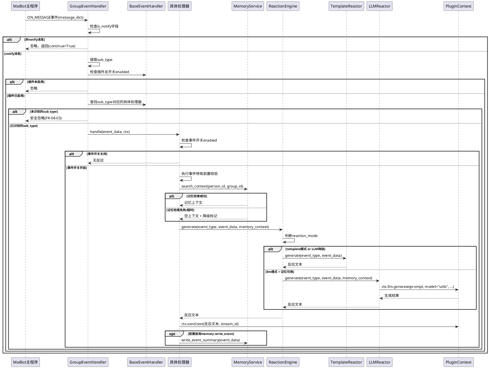

### **1.3.4 与MaiBot主程序集成方式**

1. **事件接收**：通过 `@EventHandler` 装饰器注册 `ON_MESSAGE` 事件处理器，在处理器内部通过 `message["is_notify"]` 字段筛选notify消息
2. **消息发送**：通过 `ctx.send.text(text, stream_id)` 向目标群发送反应消息，`stream_id` 从事件的 `session_id` 字段获取
3. **LLM调用**：通过 `ctx.llm.generate(prompt=..., model="utils", max_tokens=..., temperature=...)` 生成智能反应，必须传入 `model` 参数
4. **配置获取**：声明 `config_model`，通过 `self.config` 访问强类型配置
5. **机器人信息**：通过 `getattr(self.ctx, "bot_info", None)` 安全获取机器人自身信息
6. **聊天流查询**：通过 `ctx.chat.get_stream_by_group_id(group_id, platform="qq")` 获取目标群的 `stream_id`
7. **日志输出**：通过 `ctx.logger` 记录中文日志

### **1.3.5 与A_Memorix集成方式**

1. **记忆检索**：通过 `ctx.api.call("a_memorix", "search_memory", query=..., person_id=..., group_id=..., limit=5)` 检索成员相关记忆
2. **人物画像**：通过 `ctx.api.call("a_memorix", "get_person_profile", person_id=..., chat_id=...)` 获取成员画像
3. **记忆写入**：通过 `ctx.api.call("a_memorix", "ingest_text", text=..., person_ids=..., tags=..., metadata=...)` 写入事件摘要
4. **接口约束**：仅通过 `ctx.api.call()` 调用A_Memorix公开接口，不直接操作向量存储、元数据存储或图存储
5. **超时控制**：使用 `asyncio.wait_for(coro, timeout=config.memory.query_timeout_seconds)` 实现检索超时控制
6. **可用性探测**：插件加载时尝试调用 `memory_stats` 探测A_Memorix可用性，不可用时标记降级并记录警告日志

### **1.3.6 Docker环境适配设计**

1. **插件目录**：插件位于 `/plugins/group_event_sensor/`，该目录通过Docker卷挂载实现持久化，插件修改后容器restart即生效
2. **配置文件持久化**：`config.toml` 位于插件目录内，随卷挂载自动持久化
3. **模板文件**：`templates/zh-CN/` 目录下的模板文件随插件目录一起挂载，无需额外配置
4. **容器内路径**：所有文件操作使用相对于插件目录的相对路径，不依赖宿主机绝对路径
5. **容器网络**：与A_Memorix的通信通过容器内部网络（Docker Compose网络），使用服务名访问，无需关心容器IP
6. **容器重启状态恢复**：
   - 频率控制状态（`RateLimiter`）为内存态，容器重启后自动重置，不影响功能
   - 降级状态（`DegradationManager`）为内存态，重启后重新探测服务可用性
   - 配置通过卷挂载持久化，重启后自动加载
7. **无状态设计**：插件核心业务逻辑无状态依赖，所有持久化数据通过A_Memorix外部存储

---

# **2. 接口设计**

## **2.1 总体设计**

插件对外接口分为四类：

1. **插件生命周期接口**：MaiBot主程序调用，管理插件加载/卸载/配置更新
2. **事件处理接口**：MaiBot主程序通过EventHandler分发调用
3. **A_Memorix交互接口**：插件主动调用A_Memorix公开API
4. **配置接口**：通过WebUI展示和修改，由Pydantic模型自动生成Schema

## **2.2 接口清单**

### **2.2.1 插件生命周期接口**

| 接口 | 方向 | 签名 | 说明 |
|------|------|------|------|
| `create_plugin` | 主程序→插件 | `() -> GroupEventSensorPlugin` | 插件工厂函数 |
| `on_load` | 主程序→插件 | `async (self) -> None` | 插件加载，初始化各组件 |
| `on_unload` | 主程序→插件 | `async (self) -> None` | 插件卸载，清理资源 |
| `on_config_update` | 主程序→插件 | `async (self, scope: str, config_data: dict, version: str) -> None` | 配置热重载回调 |

### **2.2.2 事件处理接口**

| 接口 | 方向 | 签名 | 说明 |
|------|------|------|------|
| `handle_group_event` | 主程序→插件 | `async (self, message: dict, **kwargs) -> tuple` | EventHandler入口，筛选notify消息并路由 |
| `BaseEventHandler.handle` | 内部 | `async (self, event_data: EventData, ctx: PluginContext) -> HandleResult` | 事件处理器统一接口 |
| `RedPacketHandler.handle` | 内部 | `async (self, event_data: EventData, ctx: PluginContext) -> HandleResult` | 红包事件处理 |
| `PokeHandler.handle` | 内部 | `async (self, event_data: EventData, ctx: PluginContext) -> HandleResult` | 戳一戳事件处理 |
| `GroupBanHandler.handle` | 内部 | `async (self, event_data: EventData, ctx: PluginContext) -> HandleResult` | 禁言事件处理 |
| `GroupIncreaseHandler.handle` | 内部 | `async (self, event_data: EventData, ctx: PluginContext) -> HandleResult` | 入群事件处理 |
| `GroupDecreaseHandler.handle` | 内部 | `async (self, event_data: EventData, ctx: PluginContext) -> HandleResult` | 退群事件处理 |

### **2.2.3 智能反应接口**

| 接口 | 方向 | 签名 | 说明 |
|------|------|------|------|
| `ReactionEngine.generate` | 处理器→反应层 | `async (event_type: str, event_data: EventData, memory_context: MemoryContext) -> str` | 反应决策与生成 |
| `TemplateReactor.generate` | 引擎→模板 | `(event_type: str, event_data: EventData) -> str` | 模板反应生成 |
| `LLMReactor.generate` | 引擎→LLM | `async (event_type: str, event_data: EventData, memory_context: MemoryContext) -> str` | LLM反应生成 |

### **2.2.4 记忆协同接口**

| 接口 | 方向 | 签名 | 说明 |
|------|------|------|------|
| `MemoryService.search_context` | 处理器→记忆层 | `async (person_id: str, group_id: str) -> MemoryContext` | 检索成员记忆上下文 |
| `MemoryService.inject_context` | 记忆层→LLM层 | `(memory_context: MemoryContext, prompt: str) -> str` | 将记忆注入LLM提示词 |
| `MemoryService.write_event_summary` | 处理器→记忆层 | `async (event_data: EventData) -> bool` | 写入事件摘要到A_Memorix |
| `MemoryService.check_availability` | 记忆层→A_Memorix | `async () -> bool` | 探测A_Memorix可用性 |

### **2.2.5 基础设施接口**

| 接口 | 方向 | 签名 | 说明 |
|------|------|------|------|
| `RateLimiter.check` | 处理器→频率控制 | `(user_id: str, event_type: str, cooldown: int) -> bool` | 频率控制检查 |
| `SafeHash.hash_user_id` | 全局→安全工具 | `(user_id: str) -> str` | QQ号安全哈希 |
| `DegradationManager.mark_unavailable` | 记忆层→降级管理 | `(service: str) -> None` | 标记服务不可用 |
| `DegradationManager.is_available` | 全局→降级管理 | `(service: str) -> bool` | 查询服务可用性 |

### **2.2.6 与A_Memorix的交互接口（通过ctx.api.call）**

| A_Memorix接口 | 调用方式 | 用途 | 关键参数 |
|---------------|----------|------|----------|
| `search_memory` | `ctx.api.call("a_memorix", "search_memory", ...)` | 检索成员相关记忆 | `query`, `person_id`, `group_id`, `limit=5`, `mode="search"` |
| `get_person_profile` | `ctx.api.call("a_memorix", "get_person_profile", ...)` | 获取成员画像 | `person_id`, `chat_id` |
| `ingest_text` | `ctx.api.call("a_memorix", "ingest_text", ...)` | 写入事件摘要 | `text`, `person_ids`, `tags`, `metadata`, `timestamp` |
| `memory_stats` | `ctx.api.call("a_memorix", "memory_stats", ...)` | 探测服务可用性 | 无 |

---

# **3. 关键流程设计**

## **3.1 事件处理总体流程**

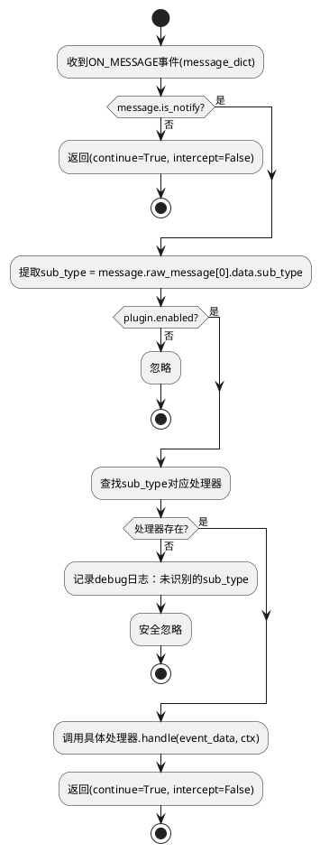

## **3.2 红包事件处理流程**

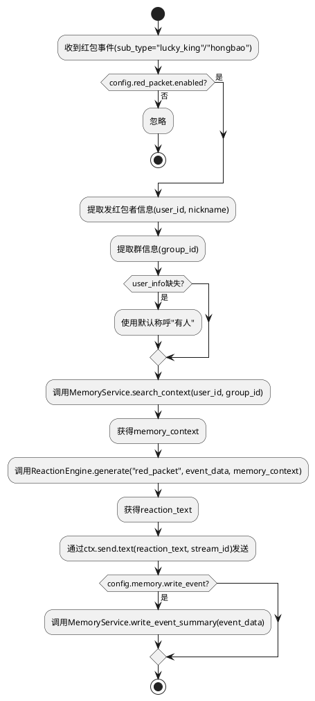

## **3.3 戳一戳事件处理流程**

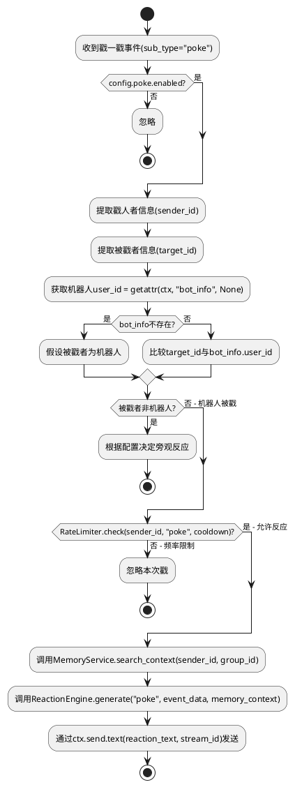

## **3.4 禁言事件处理流程**

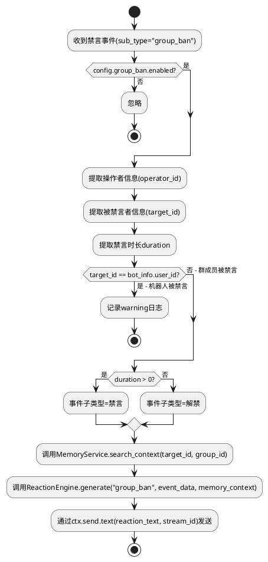

## **3.5 入群事件处理流程**

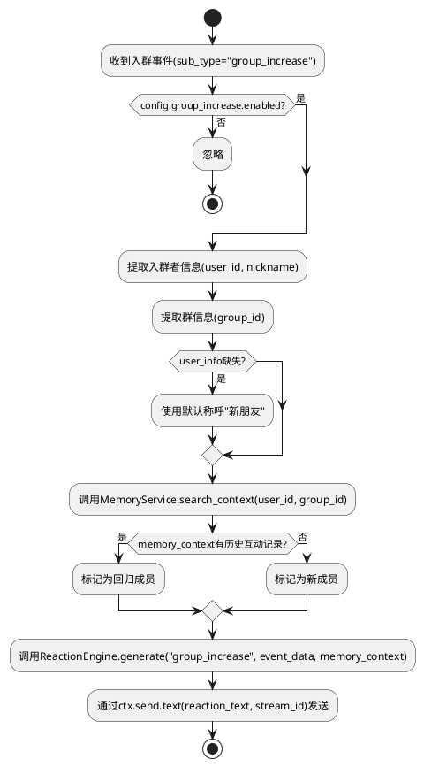

## **3.6 退群事件处理流程**

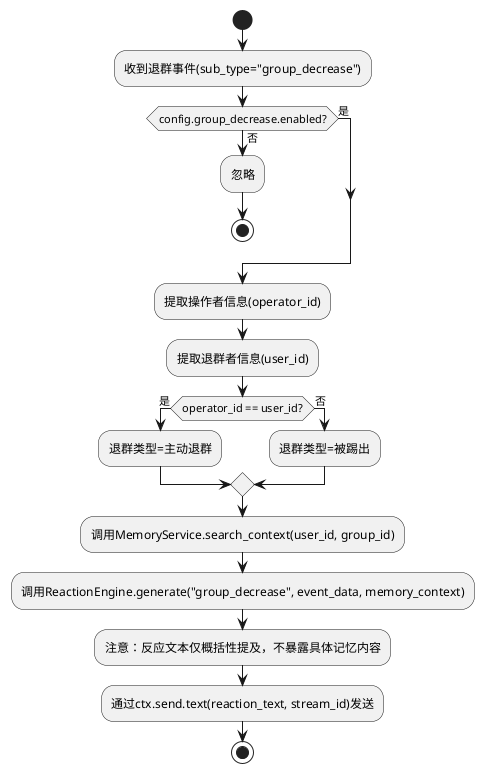

## **3.7 智能反应决策流程**

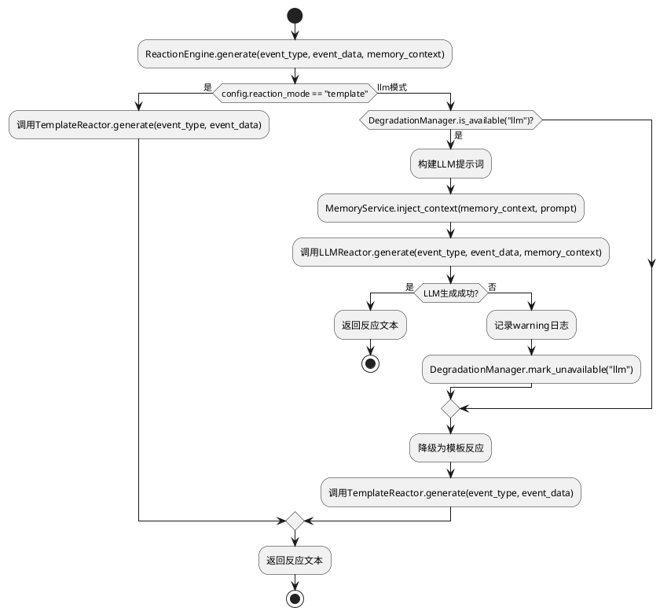

## **3.8 记忆检索与注入流程**

```plantuml
@startuml
start
:MemoryService.search_context(person_id, group_id);

if (DegradationManager.is_available("a_memorix")?) then (否)
    :返回空MemoryContext + 降级标记;
    stop
else (是)
endif

fork
    :异步调用search_memory(query=..., person_id=..., group_id=..., limit=5);
fork again
    :异步调用get_person_profile(person_id=..., chat_id=...);
end fork

:设置超时 = config.memory.query_timeout_seconds;

try
    :await asyncio.wait_for(结果, timeout);
catch (超时)
    :记录warning日志：记忆检索超时;
    :DegradationManager.mark_unavailable("a_memorix");
    :返回空MemoryContext + 降级标记;
    stop;
catch (异常)
    :记录warning日志：记忆检索异常;
    :返回空MemoryContext + 降级标记;
    stop;
endtry

:组装MemoryContext(画像, 互动记录, 是否有历史);

:返回MemoryContext;
stop
@enduml
```

## **3.9 配置热重载流程**

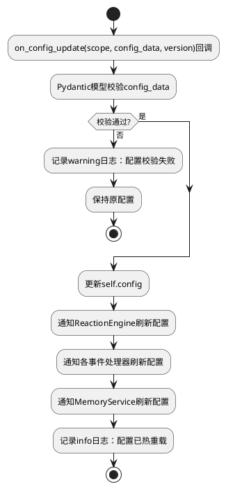

---

# **4. 数据模型**

## **4.1 设计目标**

1. 所有数据模型使用 Pydantic v2 定义，确保类型安全和WebUI Schema自动生成
2. 事件数据模型与MaiBot主程序消息格式对齐，避免不必要的转换
3. 配置模型继承 `PluginConfigBase`，支持WebUI展示和热重载
4. 记忆上下文模型独立定义，与A_Memorix返回格式解耦

## **4.2 模型实现**

### **4.2.1 事件数据模型**

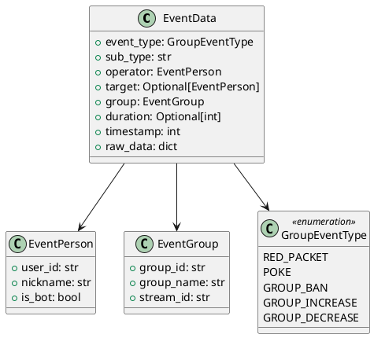

**EventData**：事件统一数据模型，所有处理器接收此模型
- `event_type`：枚举化的事件类型，用于路由和反应生成
- `sub_type`：原始sub_type字符串，保留用于日志
- `operator`：事件操作者（发红包者、戳人者、禁言操作者、入群者、退群者）
- `target`：事件被操作者（被戳者、被禁言者），可选，红包事件无此字段
- `group`：事件发生的群信息，包含 `stream_id` 用于发送反应消息
- `duration`：禁言时长（秒），仅 `GROUP_BAN` 事件适用
- `timestamp`：事件时间戳，用于频率控制和记忆写入
- `raw_data`：原始消息字典，用于调试和扩展

**EventPerson**：事件中的人员信息
- `is_bot`：是否为机器人自身，由处理器在提取时判断

**EventGroup**：事件发生的群信息
- `stream_id`：通过 `ctx.chat.get_stream_by_group_id()` 获取的有效聊天流ID

### **4.2.2 反应数据模型**

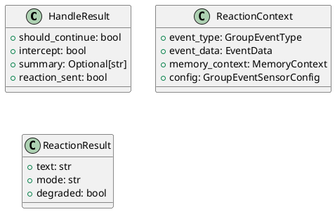

**HandleResult**：事件处理器返回结果，对应EventHandler的返回值约定
- `should_continue`：是否继续事件处理链（始终为True）
- `intercept`：是否拦截消息（始终为False，插件不拦截）
- `summary`：处理摘要，用于日志
- `reaction_sent`：是否已发送反应消息

**ReactionContext**：传递给反应层的完整上下文
**ReactionResult**：反应生成结果，包含生成的文本、使用的模式和是否发生降级

### **4.2.3 配置数据模型**

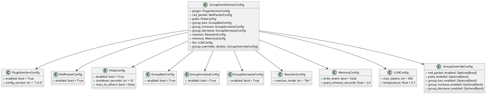

**配置字段约束**：
- `PokeConfig.cooldown_seconds`：`ge=1`，最小冷却时间1秒
- `ReactionConfig.reaction_mode`：枚举值 `"template"` 或 `"llm"`
- `MemoryConfig.query_timeout_seconds`：`ge=0.5, le=10.0`
- `LLMConfig.max_tokens`：`ge=50, le=500`
- `LLMConfig.temperature`：`ge=0.1, le=1.0`
- `GroupOverrideConfig` 中所有字段为 `Optional`，`None` 表示不覆盖全局配置

**群级配置覆盖逻辑**：
1. 获取事件对应的 `group_id`
2. 查找 `group_overrides` 中是否存在该群的覆盖配置
3. 若存在，用覆盖值替换全局值（仅替换非None字段）
4. 若不存在，使用全局配置

### **4.2.4 记忆上下文数据模型**

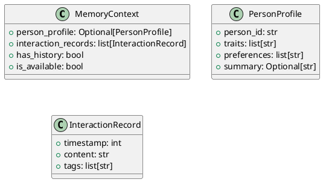

**MemoryContext**：记忆检索结果的封装
- `person_profile`：成员画像，包含性格特征、偏好等
- `interaction_records`：历史互动记录列表
- `has_history`：是否有历史互动（用于入群事件区分新成员/回归成员）
- `is_available`：记忆服务是否可用（用于降级判断）

**PersonProfile**：从A_Memorix `get_person_profile` 返回结果中提取
**InteractionRecord**：从A_Memorix `search_memory` 返回结果中提取

---

# **5. 异常处理设计**

## **5.1 事件处理异常**

| 异常场景 | 处理策略 | 日志级别 | 用户感知 |
|---------|---------|---------|---------|
| 单次事件处理抛出未预期异常 | 捕获异常，记录日志，继续处理后续事件 | `error` | 无感知（不发送错误消息到群） |
| EventHandler入口异常 | 捕获异常，返回 `(True, False, "异常摘要", None, None)` | `error` | 无感知 |
| 事件载荷格式异常 | 使用默认值填充缺失字段，继续处理 | `warning` | 可能收到泛化表述的反应 |

**实现方式**：每个具体处理器的 `handle` 方法外层包裹 `try-except`，确保异常不向上传播。

## **5.2 A_Memorix不可用降级策略**

| 阶段 | 触发条件 | 处理策略 | 恢复机制 |
|------|---------|---------|---------|
| 插件加载时 | A_Memorix服务不可达 | 标记 `DegradationManager.mark_unavailable("a_memorix")`，记录warning日志 | 每次事件处理时检查可用性，若标记不可用则跳过检索 |
| 记忆检索时 | `search_memory` / `get_person_profile` 调用超时或异常 | 标记不可用，返回空 `MemoryContext`，触发模板降级 | 下次 `on_config_update` 时重新探测 |
| 记忆写入时 | `ingest_text` 调用失败 | 记录warning日志，不影响反应发送 | 写入失败不标记全局不可用（读取可能正常） |
| 返回数据格式异常 | A_Memorix返回数据结构不符合预期 | 忽略异常数据，降级为模板反应 | 同检索降级 |

**降级流转**：
```
A_Memorix不可用 → MemoryContext.is_available=False → ReactionEngine选择TemplateReactor → 模板反应
```

## **5.3 LLM调用失败降级策略**

| 异常场景 | 处理策略 | 日志级别 |
|---------|---------|---------|
| `ctx.llm.generate()` 抛出异常 | 捕获异常，降级为模板反应 | `warning` |
| LLM返回值类型异常（非str/dict/list） | 尝试类型兼容处理，失败则降级 | `warning` |
| LLM生成文本为空 | 降级为模板反应 | `warning` |
| LLM生成文本超过500字符 | 截断至500字符 | `debug` |

**降级流转**：
```
LLM生成失败 → DegradationManager.mark_unavailable("llm") → 当前事件降级为模板反应 → 后续事件继续尝试LLM（不永久标记）
```

注意：LLM降级不永久标记，每次事件都重新尝试LLM生成，仅当前次失败时降级。原因：LLM服务可能间歇性不可用，不应因单次失败永久放弃。

## **5.4 配置异常处理**

| 异常场景 | 处理策略 | 用户感知 |
|---------|---------|---------|
| 配置值类型错误 | Pydantic校验拒绝，保持原配置 | WebUI显示校验错误提示 |
| 配置缺失必要字段 | 使用Pydantic模型默认值 | 插件正常加载，使用默认配置 |
| 配置热重载校验失败 | 记录warning日志，保持原配置 | WebUI显示校验错误提示 |
| 模板文件加载失败 | 记录error日志，使用硬编码默认模板 | 反应消息为硬编码默认内容 |

---

# **6. Docker部署设计**

## **6.1 插件目录结构与卷挂载策略**

```
Docker Compose 卷挂载：
maibot-data:/app/data/MaiMBot     # MaiBot数据卷（包含plugins目录）

容器内插件完整路径：
/app/data/MaiMBot/plugins/group_event_sensor/
```

**卷挂载策略**：
- 插件整体目录通过MaiBot数据卷挂载，无需额外卷配置
- 插件目录下所有文件（代码、配置、模板）随数据卷持久化
- 插件作为独立Git仓库，其 `.git` 目录也随卷持久化

## **6.2 配置文件持久化**

- `config.toml` 位于插件目录内：`/app/data/MaiMBot/plugins/group_event_sensor/config.toml`
- 通过MaiBot数据卷自动持久化
- WebUI修改配置后，MaiBot主程序自动写入 `config.toml`
- 容器重启后自动从 `config.toml` 加载配置

## **6.3 容器内路径适配**

- 所有文件操作使用相对于插件目录的路径（通过 `__file__` 获取插件目录基准路径）
- 模板文件路径：`Path(__file__).parent / "templates" / "zh-CN" / f"{event_type}.toml"`
- 不依赖宿主机绝对路径，完全适配容器内路径

## **6.4 容器重启状态恢复**

| 状态类型 | 持久化方式 | 重启恢复 |
|---------|-----------|---------|
| 插件配置 | `config.toml` 文件（卷挂载） | 自动加载，完全恢复 |
| 事件处理器注册 | `on_load()` 重新注册 | 自动恢复 |
| 频率控制状态 | 内存态（`RateLimiter`） | 重置为空，不影响功能（仅短暂失去冷却记忆） |
| 降级状态标记 | 内存态（`DegradationManager`） | 重置，`on_load()` 重新探测服务可用性 |
| A_Memorix连接 | `on_load()` 重新探测 | 自动恢复 |

**关键设计**：插件核心业务逻辑无状态依赖，所有需要持久化的数据通过A_Memorix外部存储，容器重启后插件可完全恢复工作状态。

---

# **7. 部署设计**

## **7.1 _manifest.json配置**

```json
{
    "manifest_version": 2,
    "version": "1.0.0",
    "name": "群行为感知",
    "description": "感知QQ群内行为事件（红包、戳一戳、禁言、入群、退群），基于记忆上下文实现智能反应",
    "author": {
        "name": "MaiBot插件开发者",
        "url": "https://github.com/MaiM-with-u"
    },
    "license": "GPL-v3.0-or-later",
    "urls": {
        "repository": "https://github.com/MaiM-with-u/group-event-sensor"
    },
    "host_application": {
        "min_version": "1.0.0",
        "max_version": "1.0.0"
    },
    "sdk": {
        "min_version": "2.4.0",
        "max_version": "2.99.99"
    },
    "dependencies": [],
    "capabilities": [
        "send.text",
        "config.get",
        "llm.generate",
        "api.call"
    ],
    "i18n": {
        "default_locale": "zh-CN",
        "locales_path": "_locales",
        "supported_locales": ["zh-CN"]
    },
    "id": "maibot-team.group-event-sensor"
}
```

**capabilities 说明**：
- `send.text`：发送文本反应消息
- `config.get`：获取插件配置
- `llm.generate`：LLM生成智能反应文本
- `api.call`：调用A_Memorix公开API

## **7.2 依赖声明**

插件无额外Python包依赖，所有功能通过MaiBot插件SDK和标准库实现：
- `maibot-plugin-sdk >= 2.4.0`：插件SDK（由MaiBot主程序提供）
- `pydantic >= 2.0`：配置模型（由SDK依赖传递）
- Python标准库：`asyncio`、`hashlib`、`time`、`random`、`pathlib`

**无需在插件中声明额外依赖**，所有交互通过 `ctx` 能力代理完成。

## **7.3 模板文件格式**

以红包模板 `templates/zh-CN/red_packet.toml` 为例：

```toml
# 红包事件反应模板
# 支持变量：{nickname} 发红包者昵称, {group_name} 群名称

templates = [
    "哇，{nickname}发红包啦！",
    "红包来啦！感谢{nickname}！",
    "{nickname}发红包了，手速要快！",
    "又到了拼手速的时候了，{nickname}发红包啦！",
]
```

每个事件类型对应一个模板文件，包含多条模板文本，运行时随机选择一条，填充变量占位符后作为反应消息。