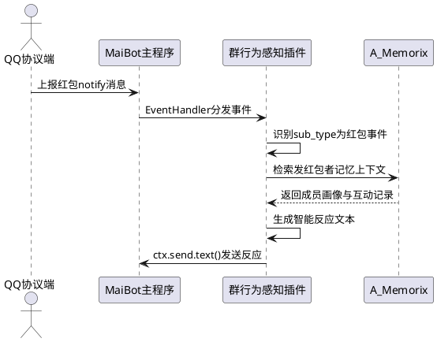
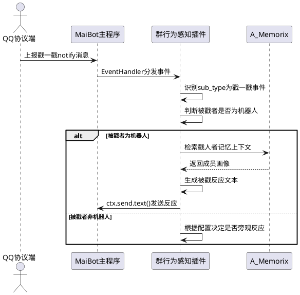
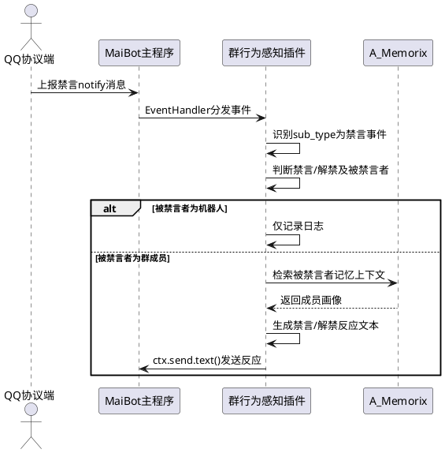
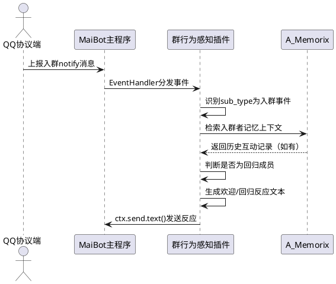
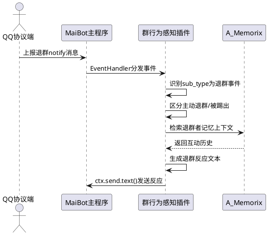
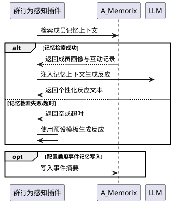
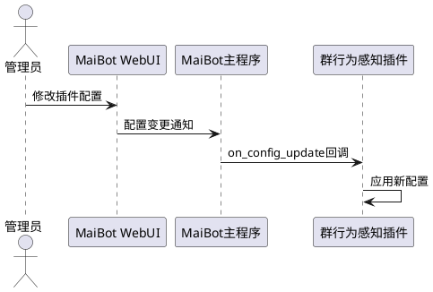

# **1. 组件定位**

## **1.1 核心职责**

本组件负责感知QQ群内行为事件（红包、戳一戳、禁言、入群、退群），实现基于记忆上下文的智能反应。

## **1.2 核心输入**

1. QQ协议端上报的群通知事件（notify消息，含sub_type区分事件类型）
2. MaiBot主程序分发的EventHandler事件载荷（包含message_info、message_segment等）
3. A_Memorix返回的记忆检索结果（群成员画像、历史互动记录）
4. 插件配置（各事件开关、反应模板、记忆查询策略等）

## **1.3 核心输出**

1. 向目标群聊流发送的智能反应文本消息
2. 向A_Memorix写入的事件记忆片段（可选，用于后续记忆增强）
3. 插件日志（事件感知与反应记录）

## **1.4 职责边界**

1. 本组件不负责QQ协议端的事件采集与转换，仅消费MaiBot主程序已标准化的notify消息
2. 本组件不负责A_Memorix的存储与检索逻辑，仅通过PluginContext API调用记忆服务
3. 本组件不负责群管理操作（如主动禁言、踢人），仅对事件做出被动反应
4. 本组件不修改MaiBot主程序代码，仅通过插件SDK接口交互
5. 本组件不直接处理普通聊天消息（ON_MESSAGE），仅处理notify类事件

# **2. 领域术语**

**群行为事件**
: QQ群内除普通聊天消息外的通知类事件，包括红包、戳一戳、禁言、入群、退群等。

**notify消息**
: MaiBot主程序中message_id为"notice"的消息，通过message_segment.type="notify"标识，其data字段包含sub_type区分具体事件类型。

**事件感知**
: 插件通过EventHandler捕获群行为事件并识别事件类型的过程。

**智能反应**
: 基于事件上下文和A_Memorix记忆检索结果，生成具有个性化和上下文感知能力的反应消息，而非固定模板回复。

**记忆上下文**
: 从A_Memorix检索到的与事件相关方（操作者、被操作者）相关的历史记忆，包括群成员画像、互动偏好等。

**sub_type**
: notify消息中用于区分具体事件类型的字段，如"poke"表示戳一戳，"group_ban"表示禁言等。

**stream_id**
: MaiBot中聊天流的唯一标识，插件通过此标识向目标群发送反应消息。

# **3. 角色与边界**

## **3.1 核心角色**

- **群成员**：群行为事件的参与者（发红包者、戳一戳者、被禁言者、入群者、退群者），是事件的触发方或受影响方
- **机器人管理员**：通过插件配置控制各事件感知开关和反应策略的运维人员

## **3.2 外部系统**

- **MaiBot主程序**：提供插件运行时环境、EventHandler事件分发、PluginContext API（消息发送、LLM调用、配置获取）
- **A_Memorix**：提供向量记忆检索与写入能力，用于获取群成员画像和历史互动记忆
- **QQ协议端（适配器）**：上报原始群通知事件，经MaiBot主程序标准化后以notify消息形式到达插件

## **3.3 交互上下文**

```plantuml
@startuml
left to right direction

actor "群成员" as member
actor "机器人管理员" as admin

rectangle "群行为感知插件" as plugin {
}

system "MaiBot主程序" as maibot
system "A_Memorix" as memory
system "QQ协议端" as qq

member --> qq : 触发群行为事件
qq --> maibot : 上报notify消息
maibot --> plugin : 分发EventHandler事件
plugin --> maibot : ctx.send.text() 发送反应
plugin --> memory : 检索/写入记忆
memory --> plugin : 返回记忆上下文
maibot --> member : 机器人反应消息
admin --> plugin : 配置事件开关与策略

@enduml
```

# **4. DFX约束**

## **4.1 性能**

1. 事件感知到反应消息发送的端到端延迟应不超过3秒（不含LLM生成时间）
2. A_Memorix记忆检索调用应不超过2秒，超时后降级为无记忆上下文反应
3. LLM生成反应文本的max_tokens应不超过300，避免生成过长反应

## **4.2 可靠性**

1. 单次事件处理失败不得影响后续事件的处理，异常应被捕获并记录日志
2. A_Memorix不可用时，插件应降级为基于模板的反应模式，不得抛出未处理异常
3. 插件加载失败不得导致MaiBot主程序崩溃

## **4.3 安全性**

1. 群成员QQ号不得以明文存储或写入日志，应使用SHA-256截断哈希
2. 插件不得主动发起群管理操作（禁言、踢人等）
3. 反应消息内容不得包含敏感信息（如完整QQ号、IP地址等）

## **4.4 可维护性**

1. 所有事件处理器应使用中文日志，记录事件类型、操作者、目标群等关键信息
2. 插件配置变更应支持热重载，无需重启MaiBot
3. 各事件类型的感知与反应逻辑应相互独立，新增事件类型无需修改已有逻辑

## **4.5 兼容性**

1. 插件SDK版本要求：min_version=2.4.0，max_version=2.99.99
2. 插件应兼容MaiBot主程序host_application min_version=1.0.0
3. 当notify消息的sub_type为插件未识别的类型时，应安全忽略而非报错
4. A_Memorix接口变更时，插件应通过版本检测给出明确的兼容性提示

# **5. 核心能力**

## **5.1 红包事件感知与反应**

### **5.1.1 业务规则**

1. **红包事件识别**：当notify消息的sub_type为"lucky_king"或"hongbao"时，插件必须识别为红包事件
   - 验收条件：[收到sub_type="lucky_king"的notify消息] → [插件识别为红包事件并触发反应流程]

2. **红包事件信息提取**：插件必须从事件载荷中提取发红包者信息（user_id、nickname）和目标群信息（group_id）
   - 验收条件：[红包事件载荷包含user_info和group_info] → [插件正确提取操作者昵称和群ID]

3. **红包智能反应生成**：插件应基于A_Memorix记忆上下文生成个性化反应消息
   - 验收条件：[发红包者为群内活跃成员] → [反应消息体现对该成员的熟悉感]；[发红包者为新成员] → [反应消息体现欢迎语气]

4. **红包事件开关控制**：当配置中红包事件感知关闭时，插件必须忽略红包事件
   - 验收条件：[配置red_packet.enabled=False] → [收到红包事件时不产生任何反应]

5. **禁止项**：插件禁止抢红包或对红包做任何自动化操作
   - 验收条件：[任何红包事件] → [插件仅发送文本反应，不触发任何红包操作]

### **5.1.2 交互流程**



### **5.1.3 异常场景**

1. **红包事件载荷缺失用户信息**
   - 触发条件：notify消息中user_info为空或缺失
   - 系统行为：使用默认称呼"有人"替代，继续生成反应
   - 用户感知：反应消息中出现"有人发红包啦"等泛化表述

2. **A_Memorix检索超时**
   - 触发条件：记忆检索调用超过2秒未返回
   - 系统行为：放弃记忆上下文，使用预设模板生成反应
   - 用户感知：反应消息为通用模板内容，无个性化

## **5.2 戳一戳事件感知与反应**

### **5.2.1 业务规则**

1. **戳一戳事件识别**：当notify消息的sub_type为"poke"时，插件必须识别为戳一戳事件
   - 验收条件：[收到sub_type="poke"的notify消息] → [插件识别为戳一戳事件并触发反应流程]

2. **戳一戳方向识别**：插件必须区分"戳机器人"和"戳其他人"两种情况
   - 验收条件：[被戳者user_id等于机器人user_id] → [触发被戳反应]；[被戳者user_id不等于机器人user_id] → [触发旁观反应或不反应]

3. **戳一戳智能反应生成**：当机器人被戳时，应基于记忆上下文生成个性化反应
   - 验收条件：[戳机器人者为熟人] → [反应体现亲昵语气]；[戳机器人者为陌生人] → [反应体现好奇或礼貌语气]

4. **戳一戳频率控制**：同一用户短时间内连续戳机器人时，插件应进行频率限制
   - 验收条件：[同一用户10秒内连续戳3次以上] → [仅对第一次戳做出反应，后续忽略]

5. **戳一戳事件开关控制**：当配置中戳一戳事件感知关闭时，插件必须忽略戳一戳事件
   - 验收条件：[配置poke.enabled=False] → [收到戳一戳事件时不产生任何反应]

### **5.2.2 交互流程**



### **5.2.3 异常场景**

1. **无法获取机器人自身user_id**
   - 触发条件：ctx.bot_info不存在或user_id字段缺失
   - 系统行为：默认对戳一戳事件做出反应（假设被戳者为机器人）
   - 用户感知：正常收到戳一戳反应

2. **戳一戳事件载荷缺少被戳者信息**
   - 触发条件：事件载荷中target_id或被戳者信息缺失
   - 系统行为：默认假设被戳者为机器人，触发被戳反应
   - 用户感知：正常收到戳一戳反应

## **5.3 禁言事件感知与反应**

### **5.3.1 业务规则**

1. **禁言事件识别**：当notify消息的sub_type为"group_ban"时，插件必须识别为禁言事件
   - 验收条件：[收到sub_type="group_ban"的notify消息] → [插件识别为禁言事件并触发反应流程]

2. **禁言/解禁区分**：插件必须区分禁言（duration>0）和解禁（duration=0）两种情况
   - 验收条件：[duration>0] → [触发禁言反应]；[duration=0] → [触发解禁反应]

3. **自我禁言检测**：当被禁言者为机器人自身时，插件必须特殊处理
   - 验收条件：[被禁言者user_id等于机器人user_id] → [记录日志但不发送反应消息（机器人已被禁言无法发送）]

4. **禁言智能反应生成**：插件应基于记忆上下文和禁言时长生成差异化反应
   - 验收条件：[禁言时长较短（<5分钟）] → [反应语气轻松]；[禁言时长较长（>1小时）] → [反应语气严肃或同情]

5. **禁言事件开关控制**：当配置中禁言事件感知关闭时，插件必须忽略禁言事件
   - 验收条件：[配置group_ban.enabled=False] → [收到禁言事件时不产生任何反应]

### **5.3.2 交互流程**



### **5.3.3 异常场景**

1. **禁言事件载荷缺少duration字段**
   - 触发条件：事件载荷中未包含禁言时长信息
   - 系统行为：默认按禁言处理，不区分禁言/解禁
   - 用户感知：收到通用禁言反应消息

2. **机器人自身被禁言时尝试发送反应**
   - 触发条件：机器人被禁言后插件仍尝试发送消息
   - 系统行为：ctx.send.text()调用失败，插件捕获异常并记录日志
   - 用户感知：群内无反应消息（因禁言无法发送）

## **5.4 入群事件感知与反应**

### **5.4.1 业务规则**

1. **入群事件识别**：当notify消息的sub_type为"group_increase"时，插件必须识别为入群事件
   - 验收条件：[收到sub_type="group_increase"的notify消息] → [插件识别为入群事件并触发反应流程]

2. **入群者信息提取**：插件必须从事件载荷中提取入群者信息（user_id、nickname）和目标群信息
   - 验收条件：[入群事件载荷包含user_info和group_info] → [插件正确提取入群者昵称和群ID]

3. **入群智能反应生成**：插件应基于A_Memorix记忆上下文判断入群者是否为"回归成员"并生成差异化反应
   - 验收条件：[入群者在记忆中有历史互动记录] → [反应体现"欢迎回来"的回归语气]；[入群者在记忆中无记录] → [反应体现"欢迎新成员"的初次见面语气]

4. **入群事件开关控制**：当配置中入群事件感知关闭时，插件必须忽略入群事件
   - 验收条件：[配置group_increase.enabled=False] → [收到入群事件时不产生任何反应]

### **5.4.2 交互流程**



### **5.4.3 异常场景**

1. **入群事件载荷缺失入群者信息**
   - 触发条件：notify消息中user_info为空
   - 系统行为：使用默认称呼"新朋友"替代，继续生成反应
   - 用户感知：反应消息中出现"欢迎新朋友"等泛化表述

## **5.5 退群事件感知与反应**

### **5.5.1 业务规则**

1. **退群事件识别**：当notify消息的sub_type为"group_decrease"时，插件必须识别为退群事件
   - 验收条件：[收到sub_type="group_decrease"的notify消息] → [插件识别为退群事件并触发反应流程]

2. **主动退群与被踢区分**：插件应尽可能区分主动退群和被踢出两种情况
   - 验收条件：[操作者user_id等于退群者user_id] → [识别为主动退群]；[操作者user_id不等于退群者user_id] → [识别为被踢出]

3. **退群智能反应生成**：插件应基于记忆上下文生成差异化反应
   - 验收条件：[退群者为长期活跃成员] → [反应体现惋惜语气]；[退群者为新成员] → [反应语气平淡]

4. **退群事件开关控制**：当配置中退群事件感知关闭时，插件必须忽略退群事件
   - 验收条件：[配置group_decrease.enabled=False] → [收到退群事件时不产生任何反应]

5. **禁止项**：插件禁止在退群反应中泄露退群者的敏感记忆信息
   - 验收条件：[退群者有记忆画像] → [反应消息仅概括性提及，不暴露具体记忆内容]

### **5.5.2 交互流程**



### **5.5.3 异常场景**

1. **退群事件载荷无法区分退群类型**
   - 触发条件：事件载荷中操作者信息与退群者信息无法区分
   - 系统行为：默认按主动退群处理
   - 用户感知：收到通用退群反应消息

## **5.6 记忆上下文增强**

### **5.6.1 业务规则**

1. **记忆检索触发**：当任意群行为事件触发智能反应生成时，插件必须向A_Memorix检索相关成员的记忆上下文
   - 验收条件：[群行为事件触发反应] → [插件调用A_Memorix检索事件相关方的记忆]

2. **记忆上下文注入**：检索到的记忆上下文必须注入到LLM生成提示中，作为反应生成的参考信息
   - 验收条件：[A_Memorix返回成员画像"性格活泼"] → [LLM提示中包含该画像信息，影响反应语气]

3. **记忆降级策略**：当A_Memorix不可用或检索无结果时，插件必须降级为基于配置模板的反应
   - 验收条件：[A_Memorix调用失败] → [使用预设模板生成反应，不抛出异常]

4. **事件记忆写入（可选）**：当配置启用事件记忆写入时，插件应将群行为事件摘要写入A_Memorix
   - 验收条件：[配置memory.write_event=True] → [群行为事件处理后向A_Memorix写入事件摘要]

5. **禁止项**：插件禁止绕过A_Memorix直接操作向量存储或元数据存储
   - 验收条件：[任何记忆操作] → [仅通过PluginContext API或A_Memorix公开接口调用]

### **5.6.2 交互流程**



### **5.6.3 异常场景**

1. **A_Memorix服务未启动**
   - 触发条件：插件加载时A_Memorix服务不可达
   - 系统行为：记录警告日志，标记记忆服务不可用，后续事件使用模板反应
   - 用户感知：反应消息为通用模板内容

2. **记忆检索返回数据格式异常**
   - 触发条件：A_Memorix返回的数据结构不符合预期
   - 系统行为：忽略异常数据，降级为模板反应
   - 用户感知：反应消息为通用模板内容

## **5.7 插件配置管理**

### **5.7.1 业务规则**

1. **配置模型定义**：插件必须使用Pydantic v2 + PluginConfigBase定义配置模型，支持WebUI展示
   - 验收条件：[配置类继承PluginConfigBase] → [配置项在MaiBot WebUI中可展示和修改]

2. **各事件独立开关**：每种群行为事件必须有独立的启用/禁用开关
   - 验收条件：[配置包含red_packet.enabled、poke.enabled、group_ban.enabled、group_increase.enabled、group_decrease.enabled五个独立布尔字段]

3. **反应模式配置**：插件必须支持"模板模式"和"LLM模式"两种反应生成策略
   - 验收条件：[配置reaction_mode="template"] → [使用预设模板生成反应]；[配置reaction_mode="llm"] → [使用LLM生成个性化反应]

4. **配置热重载**：插件必须支持配置变更热重载，通过on_config_update回调实现
   - 验收条件：[WebUI修改配置后] → [插件立即使用新配置，无需重启]

5. **群级配置覆盖（可选）**：当配置启用群级覆盖时，特定群可使用独立的事件开关和反应模板
   - 验收条件：[配置group_overrides包含群12345的poke.enabled=False] → [群12345中戳一戳事件不产生反应]

### **5.7.2 交互流程**



### **5.7.3 异常场景**

1. **配置值类型错误**
   - 触发条件：WebUI传入的配置值类型不符合Pydantic模型定义
   - 系统行为：Pydantic校验拒绝，保持原配置不变
   - 用户感知：WebUI显示配置校验错误提示

2. **配置缺失必要字段**
   - 触发条件：配置文件缺少必要字段
   - 系统行为：使用Pydantic模型中定义的默认值
   - 用户感知：插件正常加载，使用默认配置

# **6. 数据约束**

## **6.1 群行为事件**

1. **sub_type**：必须为以下枚举值之一："poke"、"group_ban"、"group_increase"、"group_decrease"、"lucky_king"、"hongbao"；其他值应安全忽略
2. **操作者user_id**：字符串类型，不得为空；用于记忆检索和反应生成
3. **目标群group_id**：字符串类型，不得为空；用于确定反应消息发送目标stream_id
4. **被操作者user_id**：字符串类型，可为空（部分事件无被操作者，如红包事件）；用于禁言、戳一戳等事件的目标识别
5. **禁言时长duration**：整数类型，单位为秒；0表示解禁，大于0表示禁言时长；仅group_ban事件适用
6. **事件时间戳**：整数类型，Unix时间戳；用于频率控制和事件记忆写入

## **6.2 反应消息**

1. **消息内容**：字符串类型，最大长度不超过500字符；由LLM生成或模板填充
2. **目标stream_id**：字符串类型，必须为MaiBot主程序中已注册的有效聊天流ID；不得自行计算fallback hash
3. **消息语言**：必须为简体中文，与MaiBot主程序语言规范一致

## **6.3 插件配置**

1. **enabled**：布尔类型，控制插件总开关；默认为True
2. **red_packet.enabled**：布尔类型，控制红包事件感知；默认为True
3. **poke.enabled**：布尔类型，控制戳一戳事件感知；默认为True
4. **poke.cooldown_seconds**：整数类型，戳一戳频率控制冷却时间；最小值1，默认值10
5. **group_ban.enabled**：布尔类型，控制禁言事件感知；默认为True
6. **group_increase.enabled**：布尔类型，控制入群事件感知；默认为True
7. **group_decrease.enabled**：布尔类型，控制退群事件感知；默认为True
8. **reaction_mode**：字符串枚举，必须为"template"或"llm"之一；默认为"llm"
9. **memory.write_event**：布尔类型，控制是否向A_Memorix写入事件记忆；默认为False
10. **memory.query_timeout_seconds**：浮点数类型，A_Memorix检索超时时间；最小值0.5，最大值10.0，默认值2.0
11. **llm.max_tokens**：整数类型，LLM生成最大token数；最小值50，最大值500，默认值300
12. **llm.temperature**：浮点数类型，LLM生成温度；最小值0.1，最大值1.0，默认值0.7

---

# **EARS格式功能需求汇总**

## FR-01 红包事件感知

**FR-01-01** When 收到sub_type为"lucky_king"或"hongbao"的群notify消息, the 群行为感知插件 shall 识别为红包事件并提取发红包者信息和群信息

**FR-01-02** Where 配置red_packet.enabled为True, the 群行为感知插件 shall 对红包事件触发智能反应生成流程

**FR-01-03** Where 配置red_packet.enabled为False, the 群行为感知插件 shall 忽略红包事件，不产生任何反应

**FR-01-04** When 红包事件触发智能反应生成, the 群行为感知插件 shall 向A_Memorix检索发红包者的记忆上下文并注入LLM提示

**FR-01-05** When 红包事件触发且A_Memorix不可用, the 群行为感知插件 shall 降级为基于预设模板的红包反应

## FR-02 戳一戳事件感知

**FR-02-01** When 收到sub_type为"poke"的群notify消息, the 群行为感知插件 shall 识别为戳一戳事件并提取戳人者和被戳者信息

**FR-02-02** When 被戳者user_id等于机器人自身user_id, the 群行为感知插件 shall 触发被戳智能反应生成流程

**FR-02-03** When 被戳者user_id不等于机器人自身user_id, the 群行为感知插件 shall 根据配置决定是否触发旁观反应

**FR-02-04** Where 配置poke.enabled为True, the 群行为感知插件 shall 对戳一戳事件执行感知与反应流程

**FR-02-05** Where 配置poke.enabled为False, the 群行为感知插件 shall 忽略戳一戳事件

**FR-02-06** While 同一用户在cooldown_seconds时间内连续戳机器人, the 群行为感知插件 shall 仅对首次戳做出反应，后续忽略

## FR-03 禁言事件感知

**FR-03-01** When 收到sub_type为"group_ban"的群notify消息, the 群行为感知插件 shall 识别为禁言事件并提取操作者、被禁言者和禁言时长

**FR-03-02** When 禁言事件中duration大于0, the 群行为感知插件 shall 触发禁言反应生成流程

**FR-03-03** When 禁言事件中duration等于0, the 群行为感知插件 shall 触发解禁反应生成流程

**FR-03-04** When 被禁言者为机器人自身, the 群行为感知插件 shall 仅记录日志，不发送反应消息

**FR-03-05** Where 配置group_ban.enabled为True, the 群行为感知插件 shall 对禁言事件执行感知与反应流程

**FR-03-06** Where 配置group_ban.enabled为False, the 群行为感知插件 shall 忽略禁言事件

## FR-04 入群事件感知

**FR-04-01** When 收到sub_type为"group_increase"的群notify消息, the 群行为感知插件 shall 识别为入群事件并提取入群者信息和群信息

**FR-04-02** When 入群者在A_Memorix中有历史互动记录, the 群行为感知插件 shall 生成"欢迎回来"的回归反应

**FR-04-03** When 入群者在A_Memorix中无历史记录, the 群行为感知插件 shall 生成"欢迎新成员"的初次见面反应

**FR-04-04** Where 配置group_increase.enabled为True, the 群行为感知插件 shall 对入群事件执行感知与反应流程

**FR-04-05** Where 配置group_increase.enabled为False, the 群行为感知插件 shall 忽略入群事件

## FR-05 退群事件感知

**FR-05-01** When 收到sub_type为"group_decrease"的群notify消息, the 群行为感知插件 shall 识别为退群事件并提取退群者信息和群信息

**FR-05-02** When 操作者user_id等于退群者user_id, the 群行为感知插件 shall 识别为主动退群

**FR-05-03** When 操作者user_id不等于退群者user_id, the 群行为感知插件 shall 识别为被踢出

**FR-05-04** Where 配置group_decrease.enabled为True, the 群行为感知插件 shall 对退群事件执行感知与反应流程

**FR-05-05** Where 配置group_decrease.enabled为False, the 群行为感知插件 shall 忽略退群事件

**FR-05-06** The 群行为感知插件 shall 不在退群反应中泄露退群者的具体记忆内容

## FR-06 记忆上下文增强

**FR-06-01** When 任意群行为事件触发智能反应生成, the 群行为感知插件 shall 向A_Memorix检索事件相关方的记忆上下文

**FR-06-02** When A_Memorix返回有效记忆上下文, the 群行为感知插件 shall 将记忆上下文注入LLM生成提示

**FR-06-03** If A_Memorix检索超时或返回异常, the 群行为感知插件 shall 降级为基于预设模板的反应

**FR-06-04** Where 配置memory.write_event为True, the 群行为感知插件 shall 在事件处理后向A_Memorix写入事件摘要

**FR-06-05** The 群行为感知插件 shall 仅通过PluginContext API或A_Memorix公开接口进行记忆操作，禁止直接操作存储层

## FR-07 插件配置管理

**FR-07-01** The 群行为感知插件 shall 使用Pydantic v2 + PluginConfigBase定义配置模型，支持MaiBot WebUI展示

**FR-07-02** The 群行为感知插件 shall 为每种群行为事件提供独立的启用/禁用开关

**FR-07-03** The 群行为感知插件 shall 支持"template"和"llm"两种反应生成模式

**FR-07-04** When 配置发生变更, the 群行为感知插件 shall 通过on_config_update回调立即应用新配置

**FR-07-05** Where 配置启用群级覆盖, the 群行为感知插件 shall 允许特定群使用独立的事件开关和反应模板

## FR-08 异常处理与降级

**FR-08-01** If 单次事件处理过程中发生异常, the 群行为感知插件 shall 捕获异常、记录日志，并继续处理后续事件

**FR-08-02** If A_Memorix服务不可用, the 群行为感知插件 shall 降级为模板反应模式，不抛出未处理异常

**FR-08-03** If notify消息的sub_type为未识别类型, the 群行为感知插件 shall 安全忽略该事件

**FR-08-04** If 事件载荷缺少必要字段, the 群行为感知插件 shall 使用合理默认值继续处理，不中断流程

**FR-08-05** The 群行为感知插件 shall 不因自身加载失败导致MaiBot主程序崩溃

---

# **非功能需求**

## NFR-01 性能需求

**NFR-01-01** The 群行为感知插件 shall 在事件感知到反应发送的端到端延迟不超过3秒（不含LLM生成时间）

**NFR-01-02** The 群行为感知插件 shall 在A_Memorix检索调用超时2秒后降级为模板反应

**NFR-01-03** The 群行为感知插件 shall 限制LLM生成max_tokens不超过300

## NFR-02 可靠性需求

**NFR-02-01** The 群行为感知插件 shall 保证单次事件处理失败不影响后续事件处理

**NFR-02-02** While A_Memorix不可用, the 群行为感知插件 shall 持续以模板模式提供反应服务

**NFR-02-03** The 群行为感知插件 shall 不因自身异常导致MaiBot主程序崩溃

## NFR-03 可维护性需求

**NFR-03-01** The 群行为感知插件 shall 使用简体中文记录所有日志

**NFR-03-02** The 群行为感知插件 shall 支持配置热重载，无需重启MaiBot

**NFR-03-03** The 群行为感知插件 shall 保持各事件类型的感知与反应逻辑相互独立

**NFR-03-04** Where 新增事件类型, the 群行为感知插件 shall 无需修改已有事件处理逻辑

## NFR-04 兼容性需求

**NFR-04-01** The 群行为感知插件 shall 兼容MaiBot插件SDK 2.4.0至2.99.99版本

**NFR-04-02** The 群行为感知插件 shall 兼容MaiBot主程序host_application 1.0.0及以上版本

**NFR-04-03** If notify消息的sub_type为插件未识别类型, the 群行为感知插件 shall 安全忽略

**NFR-04-04** The 群行为感知插件 shall 不修改MaiBot主程序代码

---

# **接口需求**

## IF-01 与MaiBot主程序的接口

1. **EventHandler注册**：通过@EventHandler装饰器注册ON_MESSAGE事件处理器，接收notify类消息
2. **消息发送**：通过ctx.send.text(text, stream_id)向目标群发送反应消息
3. **LLM调用**：通过ctx.llm.generate(prompt=..., model="utils", max_tokens=300, temperature=0.7)生成智能反应文本
4. **配置获取**：通过ctx.config.get_plugin()获取插件配置
5. **机器人信息**：通过getattr(ctx, "bot_info", None)安全获取机器人自身信息（user_id等）
6. **日志输出**：通过ctx.logger.info/debug/warning/error记录插件日志

## IF-02 与A_Memorix的接口

1. **记忆检索**：通过A_Memorix公开API或PluginContext提供的记忆接口检索群成员画像和互动记录
2. **记忆写入**：当配置启用时，通过A_Memorix公开API写入事件摘要记忆片段
3. **接口约束**：不得直接操作A_Memorix的向量存储（vector_store）、元数据存储（metadata_store）或图存储（graph_store）

## IF-03 与QQ协议端的接口

1. **事件接收**：通过MaiBot主程序标准化的notify消息接收群行为事件，不直接与QQ协议端交互
2. **消息格式**：消费MaiBot主程序已标准化的SessionMessage格式，包含message_info、message_segment等字段
3. **sub_type映射**：依赖MaiBot主程序对QQ协议端原始事件的sub_type映射，插件不自行解析原始协议数据

---

# **约束条件**

## 技术约束

1. 插件必须使用MaiBot插件SDK 2.4.0+，使用@EventHandler装饰器捕获事件
2. 插件必须使用PluginContext API与主程序交互，不得直接调用主程序内部模块
3. 插件必须使用_manifest.json配置插件元信息，manifest_version=2
4. 插件必须放在/plugins目录下作为独立Git仓库，不修改主程序代码
5. 插件必须使用Pydantic v2 + PluginConfigBase定义配置模型
6. 插件与A_Memorix协同必须通过公开接口，遵守MODIFICATION_POLICY.md规定
7. ctx.llm.generate()必须传入model参数（如"utils"），不得使用默认embedding任务
8. 导入规范：标准库/第三方库在前，本地模块在后，同包内使用相对导入

## 业务约束

1. 反应消息语言必须为简体中文
2. 群成员QQ号不得明文存储或出现在日志中，使用SHA-256截断哈希
3. 插件不得主动发起群管理操作（禁言、踢人等）
4. 不得在退群反应中泄露退群者的具体记忆内容
5. 不得自行计算session_id的fallback hash写入数据库，应通过chat_manager解析真实聊天流
6. 插件不得修改根目录的.gitignore

---

# **需求追踪矩阵**

| 需求ID | 需求描述 | 优先级 | 验证方法 |
|--------|---------|--------|---------|
| FR-01-01 | 红包事件识别与信息提取 | P0 | 单元测试：模拟sub_type="lucky_king"的notify消息，验证事件识别和信息提取 |
| FR-01-02 | 红包事件开关启用时触发反应 | P0 | 集成测试：配置enabled=True，发送红包事件，验证反应消息发送 |
| FR-01-03 | 红包事件开关禁用时忽略 | P1 | 集成测试：配置enabled=False，发送红包事件，验证无反应 |
| FR-01-04 | 红包事件记忆上下文检索 | P0 | 集成测试：Mock A_Memorix返回记忆，验证LLM提示包含记忆信息 |
| FR-01-05 | 红包事件记忆降级 | P1 | 集成测试：Mock A_Memorix超时，验证降级为模板反应 |
| FR-02-01 | 戳一戳事件识别与信息提取 | P0 | 单元测试：模拟sub_type="poke"的notify消息 |
| FR-02-02 | 机器人被戳触发反应 | P0 | 集成测试：被戳者=机器人user_id，验证反应发送 |
| FR-02-03 | 其他人被戳的旁观反应 | P2 | 集成测试：被戳者≠机器人user_id，验证旁观行为 |
| FR-02-04 | 戳一戳开关启用 | P0 | 集成测试：配置enabled=True，验证反应 |
| FR-02-05 | 戳一戳开关禁用 | P1 | 集成测试：配置enabled=False，验证无反应 |
| FR-02-06 | 戳一戳频率控制 | P1 | 集成测试：同一用户连续戳3次，验证仅首次反应 |
| FR-03-01 | 禁言事件识别与信息提取 | P0 | 单元测试：模拟sub_type="group_ban"的notify消息 |
| FR-03-02 | 禁言反应（duration>0） | P0 | 集成测试：duration=3600，验证禁言反应 |
| FR-03-03 | 解禁反应（duration=0） | P0 | 集成测试：duration=0，验证解禁反应 |
| FR-03-04 | 机器人自身被禁言 | P1 | 集成测试：被禁言者=机器人user_id，验证仅记录日志 |
| FR-03-05 | 禁言开关启用 | P0 | 集成测试：配置enabled=True，验证反应 |
| FR-03-06 | 禁言开关禁用 | P1 | 集成测试：配置enabled=False，验证无反应 |
| FR-04-01 | 入群事件识别与信息提取 | P0 | 单元测试：模拟sub_type="group_increase"的notify消息 |
| FR-04-02 | 入群回归成员反应 | P1 | 集成测试：Mock A_Memorix返回历史记录，验证"欢迎回来"语气 |
| FR-04-03 | 入群新成员反应 | P1 | 集成测试：Mock A_Memorix返回空记录，验证"欢迎新成员"语气 |
| FR-04-04 | 入群开关启用 | P0 | 集成测试：配置enabled=True，验证反应 |
| FR-04-05 | 入群开关禁用 | P1 | 集成测试：配置enabled=False，验证无反应 |
| FR-05-01 | 退群事件识别与信息提取 | P0 | 单元测试：模拟sub_type="group_decrease"的notify消息 |
| FR-05-02 | 主动退群识别 | P1 | 集成测试：操作者=退群者，验证主动退群反应 |
| FR-05-03 | 被踢出识别 | P1 | 集成测试：操作者≠退群者，验证被踢出反应 |
| FR-05-04 | 退群开关启用 | P0 | 集成测试：配置enabled=True，验证反应 |
| FR-05-05 | 退群开关禁用 | P1 | 集成测试：配置enabled=False，验证无反应 |
| FR-05-06 | 退群反应不泄露记忆 | P0 | 安全审查：验证反应消息不包含具体记忆内容 |
| FR-06-01 | 记忆检索触发 | P0 | 集成测试：事件触发时验证A_Memorix检索调用 |
| FR-06-02 | 记忆上下文注入LLM | P0 | 集成测试：验证LLM提示包含记忆上下文 |
| FR-06-03 | 记忆降级策略 | P1 | 集成测试：Mock A_Memorix失败，验证模板降级 |
| FR-06-04 | 事件记忆写入 | P2 | 集成测试：配置write_event=True，验证A_Memorix写入调用 |
| FR-06-05 | 禁止直接操作存储层 | P0 | 代码审查：验证无直接存储层调用 |
| FR-07-01 | 配置模型WebUI支持 | P1 | 手动测试：在WebUI中查看和修改配置 |
| FR-07-02 | 各事件独立开关 | P0 | 单元测试：验证配置模型包含5个独立enabled字段 |
| FR-07-03 | 双反应模式支持 | P0 | 集成测试：分别测试template和llm模式 |
| FR-07-04 | 配置热重载 | P1 | 集成测试：修改配置后验证立即生效 |
| FR-07-05 | 群级配置覆盖 | P2 | 集成测试：配置群级覆盖，验证特定群行为 |
| FR-08-01 | 单次事件异常不影响后续 | P0 | 集成测试：注入异常后验证后续事件正常处理 |
| FR-08-02 | A_Memorix不可用降级 | P1 | 集成测试：停止A_Memorix后验证模板模式运行 |
| FR-08-03 | 未识别sub_type安全忽略 | P0 | 单元测试：发送未知sub_type，验证无异常 |
| FR-08-04 | 缺失字段使用默认值 | P1 | 单元测试：发送缺失字段的载荷，验证默认值处理 |
| FR-08-05 | 插件加载失败不影响主程序 | P0 | 集成测试：模拟插件加载异常，验证主程序正常运行 |
| NFR-01-01 | 端到端延迟≤3秒 | P1 | 性能测试：测量事件感知到反应发送的延迟 |
| NFR-01-02 | A_Memorix检索超时2秒降级 | P1 | 性能测试：Mock A_Memorix延迟>2秒，验证降级 |
| NFR-01-03 | LLM max_tokens≤300 | P0 | 代码审查：验证llm.generate调用参数 |
| NFR-02-01 | 单次失败不影响后续 | P0 | 集成测试：同FR-08-01 |
| NFR-02-02 | A_Memorix不可用持续服务 | P1 | 集成测试：同FR-08-02 |
| NFR-02-03 | 不导致主程序崩溃 | P0 | 集成测试：同FR-08-05 |
| NFR-03-01 | 中文日志 | P1 | 代码审查：验证日志使用中文 |
| NFR-03-02 | 配置热重载 | P1 | 集成测试：同FR-07-04 |
| NFR-03-03 | 事件逻辑独立 | P1 | 代码审查：验证各事件处理器无交叉依赖 |
| NFR-03-04 | 新增事件无需修改已有逻辑 | P2 | 代码审查：验证事件处理器注册机制的可扩展性 |
| NFR-04-01 | SDK版本兼容 | P0 | 验证_manifest.json中sdk版本范围 |
| NFR-04-02 | 主程序版本兼容 | P0 | 验证_manifest.json中host_application版本范围 |
| NFR-04-03 | 未识别sub_type安全忽略 | P0 | 单元测试：同FR-08-03 |
| NFR-04-04 | 不修改主程序代码 | P0 | 代码审查：验证插件目录独立性 |