# QQ用户记忆插件 — 需求规格文档

> 版本：7.0.0  
> 日期：2026-05-29  
> 状态：修订  
> 语言：简体中文
> 变更说明：v7.0.0 重大版本升级——深度结合 MaiBot 1.0.0-rc.2 新能力：(1) P0 replyer.before_model_request Hook 主动注入记忆上下文；(2) P1 WebUI 全面升级为现代化前端；(3) P1 与新消息上下文深度结合。保留 v6.2.0 全部需求

---

# **1. 组件定位**

## **1.1 核心职责**

本组件负责按用户哈希ID维度隔离和管理记忆数据，实现针对白名单用户的智能记忆提取、语义向量嵌入检索、记忆合并去重、自然交互、分级维护、WebUI可视化管理、群聊维度双重隔离记忆、群聊记忆归属优化（发送者前缀策略）、跨用户记忆检索（LLM指定目标用户）、A_Memorix双向深度协同能力、replyer Hook主动注入记忆上下文、现代化WebUI管理界面、消息上下文深度结合，同时保护用户隐私。

## **1.2 核心输入**

1. **LLM Tool 调用**：LLM 在对话过程中主动调用的记忆检索/写入请求（系统自动注入 user_id、group_id，LLM 可选传入 target_user_name 指定目标用户）
2. **用户命令**：白名单操作者通过QQ聊天界面发送的记忆管理指令（/记忆查看、/记忆添加、/记忆删除、/记忆合并）
3. **HookHandler 事件**：MaiBot 框架对话链路关键节点触发的事件（如对话结束后自动记忆、replyer构建完模型请求后改写messages、回复完成后后处理）
4. **对话上下文**：当前对话的上下文信息（用于语义检索和自动记忆判断，含群聊标识 group_id、平台标识 platform、是否@机器人、消息发送者身份）
5. **配置更新事件**：WebUI 或 config.toml 修改触发的 on_config_update 信号
6. **插件加载/卸载信号**：MaiBot 框架触发的 on_load / on_unload 生命周期事件
7. **WebUI 页面请求**：管理员通过 MaiBot WebUI 插件路由访问记忆管理页面的 HTTP 请求（需鉴权）
8. **WebUI 高级操作请求**：管理员通过WebUI发起的批量删除、向量补算、合并去重、数据导出等高级操作请求
9. **群聊消息事件**：包含 group_id 信息的群聊消息，用于记忆条目的群聊归属标识和群维度隔离
10. **A_Memorix 检索结果**：从A_Memorix长期记忆系统检索到的用户记忆摘要（双向协同时作为输入）
11. **replyer.before_model_request Hook 上下文**：MaiBot replyer 构建完模型请求后的上下文（含 messages、任务名、请求类型、候选模型、重试次数、reply 工具参数），允许插件改写实际发送的 messages
12. **replyer.after_response Hook 上下文**：MaiBot replyer 回复完成后的上下文（含实际任务名、指定模型名、reply_tool_args）

## **1.3 核心输出**

1. **记忆查询结果**：返回给 LLM 或用户的特定用户记忆列表（按语义相关度排序，含时间衰减权重，含群维度过滤）
2. **操作反馈消息**：通过 ctx.send 返回给用户的操作成功/失败提示
3. **A_Memorix 双向同步写入**：将用户记忆通过标准 Tool/Service 接口同步写入 A_Memorix 长期记忆系统（可选）
4. **A_Memorix 检索请求**：检索记忆时向 A_Memorix 发起 search_memory 请求获取长期记忆摘要（可选，携带 chat_id 参数实现群聊隔离对齐）
5. **日志输出**：通过 ctx.logger 输出的插件运行日志
6. **WebUI 页面响应**：返回给浏览器的记忆管理页面 HTML/JSON 数据（仅白名单用户记忆，需鉴权）
7. **WebUI 高级操作响应**：返回批量操作结果统计、数据导出文件（JSON格式）
8. **群聊归属数据**：记忆条目附带来源群聊信息（group_id），支持群维度和用户维度的双重隔离查询
9. **记忆拒绝日志**：被白名单或权限拒绝的记忆操作记录（用于排查白名单不生效等问题）
10. **改写后的 messages**：通过 replyer.before_model_request Hook 返回的改写后 messages（含注入的记忆上下文摘要）
11. **记忆注入统计**：通过 replyer.after_response Hook 记录的记忆注入使用统计（哪些记忆被注入、注入数量）

## **1.4 职责边界**

1. 本组件**不负责**全局记忆搜索（即不按内容语义跨用户检索，仅按用户哈希ID维度隔离管理）
2. 本组件**不负责** A_Memorix 内部实现（存储、嵌入、图谱），仅通过其公开 Tool/Service 标准接口作为可选同步下游和检索上游
3. 本组件**不直接操作** A_Memorix 内部存储（不读写其 SQLite/Faiss 索引，不绕过其隔离机制）
4. 本组件**不负责**消息收发适配层（由 MaiBot 框架和适配器完成）
5. 本组件**不负责**用户认证与权限管理（由框架层完成，本插件通过白名单机制控制记忆操作权限）
6. 本组件**不存储**明文QQ号，仅存储QQ号的哈希值
7. 本组件**不修改** MaiBot 主项目任何文件，不影响外层 Git 仓库
8. 本组件**不使用** ON_MESSAGE 事件处理器（已被框架废弃，不在主消息链中自动触发）
9. 本组件**不在** ctx.db 中注册新的数据模型（ctx.db 需预注册 SQLModel，插件无法动态注册）
10. 本组件**不负责** LLM 调用的计费与限流（由 MaiBot 框架的 ctx.llm 管理，本插件仅在必要时调用）
11. 本组件**不负责**嵌入模型的训练与部署（使用预训练模型或API，不自行训练）
12. 本组件**不负责**MaiBot WebUI框架的路由注册（仅通过插件路由扩展机制提供页面，不修改WebUI核心代码）
13. 本组件**不负责**WebUI全局鉴权机制（依赖MaiBot WebUI框架的鉴权，插件层面做白名单过滤和操作权限校验）
14. 本组件**不负责**群聊消息的精确语义归属判定（即不判断"用户A提到用户B喜欢X"中的X应归属到用户B，而是采用发送者前缀策略丰富记忆内容，让 LLM 在检索时自行判断归属）
15. 本组件**不负责**MaiBot框架的插件能力授权机制（通过 _manifest.json 的 capabilities 声明所需能力，由框架负责授权决策）
16. 本组件**不负责**replyer 的模型选择和请求构建逻辑（仅在 replyer 构建完请求后改写 messages，不改变模型选择或请求参数）
17. 本组件**不负责**WebUI前端框架的打包构建（使用MaiBot WebUI插件路由机制提供的静态资源服务，不引入独立构建流程）

---

# **2. 领域术语**

**用户ID（user_id）**
: 指QQ号，作为记忆数据隔离维度的原始标识，为字符串类型的数字。仅在运行时用于白名单校验和哈希计算，不持久化存储。

**用户哈希ID（hashed_user_id）**
: 对QQ号进行 SHA-256 哈希后截断前16字节（32个十六进制字符）的结果，作为持久化存储和索引的标识，保护用户隐私。

**被记忆用户白名单（memorized_user_whitelist）**
: 允许被记忆的QQ号列表。仅白名单中的用户才会被记忆系统记录，非白名单用户的记忆操作将被拒绝。配置中以明文QQ号输入，运行时转为哈希比对。

**操作者白名单（operator_whitelist）**
: 允许执行记忆管理操作（查看/添加/删除）的QQ号列表。仅白名单中的操作者才能执行记忆管理命令。配置中以明文QQ号输入。

**白名单访问校验（access_check）**
: 对记忆操作进行权限校验的统一入口，区分操作者权限和被记忆对象权限两阶段校验。自动记忆钩子场景下，操作者和被记忆对象为同一用户，仅需校验被记忆用户白名单。

**用户记忆（user_memory）**
: 与特定用户哈希ID绑定的记忆条目，包含内容文本、创建时间、来源标记、群聊归属等元信息。

**记忆条目（memory_entry）**
: 一条具体的记忆记录，属于某个用户哈希ID，具有唯一标识、内容、时间戳、标签、重要性、过期时间、群聊归属。

**记忆类别（memory_category）**
: 记忆的语义分类标签，包括：偏好（preference）、习惯（habit）、事实（fact）、关系（relationship）、临时（temporary）、时段（period）、通用（general）。由 LLM 提取时自动标注或由用户手动指定。

**记忆重要性（memory_importance）**
: 记忆条目的保留优先级，取值 1-5（1最低，5最高）。重要性越高，越不容易被淘汰。默认值为 3，由 LLM 评估或由用户手动指定。

**记忆过期时间（memory_expiry）**
: 记忆条目的可选过期时间戳。过期后该记忆在检索时自动排除，但物理删除由维护任务执行。null 表示永不过期。

**时间衰减权重（time_decay_weight）**
: 记忆在检索排序中的时间衰减因子，根据记忆创建时间与当前时间的差值计算，近期记忆权重更高，远期记忆权重按指数或线性衰减。用于检索排序和智能淘汰。

**语义相似度（semantic_similarity）**
: 两条记忆内容之间的语义相关程度，取值 0.0-1.0。通过 LLM 判断或基于关键词的近似计算得出，用于去重判断和检索排序。

**语义嵌入向量（embedding_vector）**
: 将记忆内容通过嵌入模型转换成的固定维度浮点数数组，用于计算余弦相似度实现语义检索和去重。维度取决于嵌入模型（如384维或768维）。

**嵌入模型（embedding_model）**
: 将文本转换为语义向量的模型。支持两种模式：本地模式（sentence-transformers，如all-MiniLM-L6-v2）和API模式（通过ctx.llm调用嵌入API）。

**余弦相似度（cosine_similarity）**
: 两个向量之间夹角的余弦值，取值-1.0到1.0（归一化后为0.0到1.0），用于衡量语义相关程度。值越接近1.0表示语义越相似。

**向量索引（vector_index）**
: 存储记忆嵌入向量并支持高效相似度检索的数据结构。支持两种实现：SQLite+numpy（轻量，适合小规模）和FAISS（高性能，适合大规模）。

**智能提取（smart_extract）**
: LLM 在添加记忆前对原始内容进行提取、提炼、去噪的过程。将对话片段转化为简洁的要点式记忆，而非存储原始文本。包含JSON修复和降级策略。

**智能提取降级策略（smart_extract_fallback）**
: 当智能提取 LLM 返回结果无法解析为合法 JSON 时，系统逐步降级的策略链：裸 key 名检测 → 直接降级 → 简单存储原始内容。不再对已知无效模式重试，节省 LLM 调用预算。

**裸 key 名模式（bare_key_pattern）**
: LLM 返回仅包含 JSON 对象的 key 名称而非完整对象的模式，如返回 `'"refined"'` 而非 `{"content": "...", "category": "..."}`。此模式表明 LLM 未理解输出格式要求，应直接降级而非重试。

**记忆合并（memory_merge）**
: 当新记忆与已有记忆语义相似度过高时，将两者合并为一条更完整的记忆，而非重复添加。支持向量相似度检测和LLM辅助合并两种机制。合并时优先保留更新的信息。

**A_Memorix 双向协同（amemorix_bidirectional_sync）**
: 插件与A_Memorix之间双向交互的记忆协同机制：写入方向——插件新增/合并记忆时同步到A_Memorix（ingest_text）；读取方向——插件检索记忆时优先从A_Memorix获取长期记忆摘要（search_memory）作为补充上下文。

**插件能力授权（plugin_capability）**
: MaiBot 框架的插件能力授权机制，要求插件在 _manifest.json 的 capabilities 列表中显式声明所需能力（如 api.call），框架据此授权插件调用其他子系统 Tool/Service 接口的权限。

**配置模型（config_model）**
: 基于 PluginConfigBase + Field 的强类型配置声明，支持 WebUI Schema 自动生成。

**对话介入方式（conversation_intervention）**
: 插件在对话中发挥作用的三种机制：@Tool（LLM主动调用）、@Command（用户手动命令）、@HookHandler（框架链路钩子自动触发）。

**自管理SQLite（self_managed_sqlite）**
: 插件在自身目录下创建和管理的 SQLite 数据库文件，用于存储记忆数据。通过 Docker 卷映射实现持久化，无需在 ctx.db 中预注册模型。

**LLM 调用预算（llm_budget）**
: 控制插件调用 LLM 频率的机制，包含每日调用次数上限和关键操作的调用策略，防止 LLM 调用成本失控。

**WebUI记忆管理页面（webui_memory_page）**
: 通过MaiBot WebUI插件路由扩展机制提供的记忆数据管理页面，支持记忆的查看、搜索、筛选、编辑、删除和手动添加。仅展示被记忆用户白名单中的用户记忆。

**群聊ID（group_id）**
: 记忆条目来源的QQ群标识，为QQ群号字符串。记录记忆产生于哪个群聊环境，支持按群筛选和归属追踪。私聊产生的记忆 group_id 为空。

**群聊记忆（group_chat_memory）**
: 在群聊环境中产生的记忆条目，其 group_id 字段记录来源群号，用于区分同一用户在不同群聊中的记忆上下文。

**群维度记忆隔离（group_dimension_isolation）**
: 记忆存储和检索时按 group_id 进行维度的隔离，支持"全局记忆"（group_id为空，跨群可见）和"群聊上下文记忆"（group_id非空，仅在该群上下文中可见）两种层级。

**用户维度记忆隔离（user_dimension_isolation）**
: 记忆存储和检索时按 hashed_user_id 进行维度的隔离，不同用户的记忆完全独立，群聊中他人提及的信息不会归属到当前用户。

**双重隔离检索（dual_isolation_retrieve）**
: 检索记忆时同时应用用户维度和群维度隔离，返回结果为用户全局记忆 ∪ 用户在该群的记忆，按综合相关度排序。

**群聊消息分类（group_message_classification）**
: 群聊消息按与机器人交互意图分为：@指令（@机器人触发的指令）、回复指令（回复机器人消息触发的指令）、闲聊（未@机器人且非回复的普通消息），不同分类影响自动记忆策略。

**A_Memorix chat_id 对齐（amemorix_chat_id_alignment）**
: 插件的 group_id 与 A_Memorix 的 chat_id 参数对齐，确保群聊隔离在两个系统间一致。群聊场景下 group_id 直接作为 A_Memorix 的 chat_id 传入。

**记忆检索联合排序（joint_retrieve_sort）**
: 检索时先从插件获取中短期记忆，再从A_Memorix获取长期记忆，两路结果合并后按综合相关度（语义相似度×重要性×时间衰减）统一排序返回。

**记忆写入分工（write_division）**
: 实时对话产生的记忆写入插件中短期记忆；标记为重要或持久的记忆同时同步到A_Memorix长期记忆，由 importance 阈值或显式标记控制。

**WebUI鉴权（webui_auth）**
: WebUI记忆管理页面和API端点必须经过鉴权，未鉴权请求返回401，且仅展示/操作被记忆用户白名单中的用户数据。

**机器人回复记忆（bot_reply_memory）**
: 机器人自身回复内容产生的记忆条目。默认禁止记录机器人回复记忆（enable_bot_reply_memory=False），历史遗留的机器人回复记忆需可识别和可清理。

**群聊记忆发送者前缀（group_memory_sender_prefix）**
: 群聊环境中自动记忆时，在记忆内容前添加消息发送者昵称前缀（如"小明说：我喜欢火锅"），使记忆内容携带归属信息，便于 LLM 检索时判断信息主体。记忆仍存储在发送者的 hashed_user_id 下，不改变归属逻辑。

**目标用户名（target_user_name）**
: LLM 在群聊中调用 retrieve_user_memory 时可选传入的参数，指定想了解的用户昵称。插件通过昵称查找对应的 user_id，实现跨用户记忆检索。

**用户昵称映射（nickname_mapping）**
: 群聊环境中用户昵称与 user_id 的对应关系，用于将 LLM 传入的 target_user_name 解析为 user_id。来源包括群成员列表、历史消息中的发送者信息。

**MaiBot 配置健康提醒（config_health_reminder）**
: 插件在启动或运行时检测 MaiBot 关键配置项（如 model_config.toml 的 temperature）的合理性，对异常值输出警告提醒，不修改配置。

**replyer 记忆注入（replyer_memory_injection）**
: 通过 maisaka.replyer.before_model_request Hook，在 replyer 构建完模型请求消息后，将检索到的用户记忆摘要注入到 messages 中，使 LLM 在生成回复时直接参考记忆，而非仅通过 Tool Call 间接获取。

**注入记忆摘要（injected_memory_summary）**
: 从用户记忆中检索并格式化后的文本摘要，用于注入到 replyer 的 messages 中。包含当前用户的关键记忆要点，按重要性排序截断，受 token 预算约束。

**注入 token 预算（injection_token_budget）**
: 控制注入记忆摘要的最大 token 数量上限，避免记忆注入占用过多上下文空间导致 LLM 性能下降或请求超限。

**记忆注入策略（memory_injection_strategy）**
: 决定何时、如何将记忆注入到 messages 中的策略配置，包括注入位置（system message 末尾或独立 user message）、触发条件（任务类型、请求类型过滤）、摘要模板等。

**记忆注入追踪（memory_injection_tracking）**
: 通过 replyer.after_response Hook 记录每次记忆注入的统计信息，包括注入的记忆数量、token 占用、注入的用户ID、是否被 LLM 参考等，用于效果评估和优化。

**消息上下文增强（message_context_enhancement）**
: 利用 MaiBot 1.0.0-rc.2 提供的更完整的消息上下文信息（含 group_id、platform 等），改进记忆的自动提取触发判断和检索上下文构建。

**平台标识（platform）**
: 消息来源的平台标识（如 qq、wechat 等），rc.2 中 Action/Command/Tool 可获得该信息。可用于平台感知的记忆隔离策略。

---

# **3. 角色与边界**

## **3.1 核心角色**

- **Bot 管理员**：配置插件参数（白名单、默认条数、智能记忆开关、LLM 预算、嵌入模型、A_Memorix协同参数、记忆注入策略等），可通过 WebUI 和 config.toml 操作；通过 WebUI 管理页面查看和管理记忆数据
- **白名单操作者**：在操作者白名单中的用户，可通过聊天命令查看、添加、删除、合并记忆
- **白名单被记忆用户**：在被记忆用户白名单中的用户，其记忆可被系统自动记录
- **LLM**：通过 @Tool 装饰器暴露的工具，在对话过程中智能检索/写入/维护用户记忆；通过 replyer Hook 注入的记忆上下文直接参考记忆生成回复

## **3.2 外部系统**

- **MaiBot 框架**：提供插件运行时、ctx 能力（send/logger/person/chat/message/config/llm）、生命周期管理、@Tool/@Command/@HookHandler 装饰器、插件能力授权机制、replyer Hook（before_model_request/after_response）
- **MaiBot WebUI**：提供插件路由扩展机制和鉴权机制，允许插件注册自定义页面路由和API端点，提供静态资源服务
- **A_Memorix**：现有长期记忆子系统，提供 search_memory / ingest_text / ingest_summary / get_person_profile 等 Tool/Service 标准接口（作为可选双向协同上游/下游，禁止直接操作其内部存储）
- **嵌入模型服务**：本地 sentence-transformers 模型或远程嵌入API，提供文本到向量的转换能力
- **Docker 运行环境**：插件代码卷映射到 /MaiMBot/plugins/，数据持久化在 /MaiMBot/data/ 下

## **3.3 交互上下文**

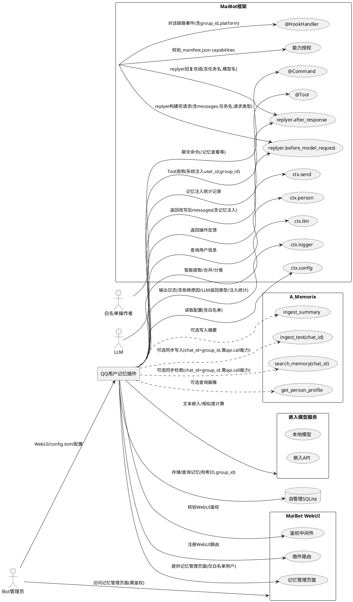

---

# **4. DFX约束**

## **4.1 性能**

1. 单次记忆查询响应时间不超过 2 秒（含 SQLite 查询，不含 LLM 调用）
2. 单次记忆写入响应时间不超过 1 秒（不含 LLM 智能提取耗时）
3. 智能提取（含 LLM 调用）响应时间不超过 10 秒（裸 key 名检测后直接降级，不重试）
4. 语义去重判断响应时间不超过 5 秒（含 LLM 调用）
5. 单用户记忆条目上限默认为 200 条（可配置），超过上限时按重要性×时间衰减加权淘汰
6. 插件 on_load 初始化时间不超过 5 秒（含 SQLite 建表，不含嵌入模型预热）
7. 嵌入模型预热时间不超过 30 秒（本地模型首次加载）
8. 单次嵌入向量计算时间不超过 200 毫秒（本地模型预热后）/ 不超过 2 秒（API模式）
9. 向量检索响应时间不超过 500 毫秒（100条以内）/ 不超过 2 秒（1000条以内）
10. 哈希计算时间不超过 1 毫秒
11. 记忆维护任务单次执行时间不超过 30 秒
12. WebUI 记忆管理页面首屏加载时间不超过 3 秒
13. WebUI 记忆列表分页查询响应时间不超过 1 秒
14. 群聊归属信息提取和记录不超过 1 毫秒（仅字符串赋值）
15. 时间衰减权重计算时间不超过 1 毫秒/条
16. A_Memorix检索请求超时不超过 5 秒，超时后降级为仅使用本地记忆
17. 自动合并检测响应时间不超过 3 秒（异步执行，不阻塞主流程）
18. 群维度+用户维度双重过滤查询响应时间不超过 500 毫秒
19. 记忆检索联合排序（插件+ A_Memorix）总响应时间不超过 8 秒（含 A_Memorix 5秒超时）
20. 白名单访问校验时间不超过 5 毫秒（两次哈希比对）
21. 裸 key 名模式检测时间不超过 1 毫秒（正则匹配）
22. A_Memorix能力授权校验时间不超过 10 毫秒（配置读取比对）
23. 发送者前缀拼接时间不超过 1 毫秒（字符串拼接操作）
24. 昵称映射查找时间不超过 50 毫秒（缓存命中）/ 不超过 500 毫秒（缓存未命中需获取群成员列表）
25. 配置健康检查时间不超过 100 毫秒（读取配置文件+检查逻辑）
26. 跨用户检索额外耗时不超过 100 毫秒（昵称映射查找，不含实际检索耗时）
27. **[v7.0.0 新增]** 记忆注入摘要检索和格式化时间不超过 500 毫秒（检索+排序+格式化+截断）
28. **[v7.0.0 新增]** 记忆注入 messages 改写时间不超过 10 毫秒（字符串拼接和列表操作）
29. **[v7.0.0 新增]** replyer.before_model_request Hook 处理总时间不超过 1 秒（含检索+格式化+改写）
30. **[v7.0.0 新增]** replyer.after_response Hook 处理时间不超过 50 毫秒（统计记录）
31. **[v7.0.0 新增]** 注入 token 计数时间不超过 10 毫秒/条（基于字符数估算）
32. **[v7.0.0 新增]** WebUI 统计面板数据聚合响应时间不超过 2 秒
33. **[v7.0.0 新增]** WebUI 暗色主题切换响应时间不超过 200 毫秒（CSS变量切换，无页面重载）

## **4.2 可靠性**

1. 数据持久化依赖自管理 SQLite 文件，通过 Docker 卷映射持久化
2. SQLite 数据库文件位于插件目录下，随 Docker 卷自动备份
3. 插件异常崩溃不导致 MaiBot 主进程退出
4. A_Memorix 同步失败时，本地记忆数据不受影响（同步为尽力而为）
5. A_Memorix 检索失败时，降级为仅使用本地记忆检索结果，不影响对话
6. 配置热重载不丢失已有记忆数据
7. 哈希算法使用 SHA-256 截断，具备抗碰撞性，不同QQ号产生相同哈希的概率可忽略
8. SQLite 操作使用 WAL 模式，支持并发读取
9. LLM 调用失败时降级为简单 CRUD 模式，不阻塞记忆操作
10. 记忆合并失败时不丢失数据，保留原始条目
11. 嵌入模型加载失败时降级为关键词检索模式，不阻塞记忆操作
12. 嵌入向量计算失败时该条记忆不生成向量，仍可按关键词检索
13. 向量索引损坏时可从记忆内容重新构建
14. 批量删除操作支持事务回滚，删除过程中断不产生部分删除
15. 向量补算操作支持断点续算，中断后已补算的向量保留，未补算的可再次触发
16. JSON修复逻辑无法修复时降级为简单存储，不丢失原始内容
17. 裸 key 名模式检测后直接降级为简单存储，不重试，不丢失原始内容
18. 自动合并异步执行失败时静默记录日志，不影响记忆添加主流程
19. 白名单访问校验逻辑变更后，不影响已有记忆数据的完整性
20. 群聊消息发送者前缀策略下，记忆内容携带归属信息（如"小明说：喜欢火锅"），LLM检索时可自行判断信息主体，归属错误可通过WebUI手动删除
21. A_Memorix api.call 能力未授权时，插件降级为独立运行模式，不影响本地记忆功能
22. 发送者前缀策略关闭时（enable_group_sender_prefix=False），行为与 v6.1.0 完全一致，无功能回归
23. 昵称映射缓存失效后重新获取不影响正在进行的检索操作（降级为当前用户检索）
24. 配置健康检查异常不影响插件正常启动和运行
25. **[v7.0.0 新增]** replyer.before_model_request Hook 处理异常时不影响 replyer 正常流程，降级为不注入记忆
26. **[v7.0.0 新增]** 记忆注入关闭时（enable_memory_injection=False），replyer Hook 不改写 messages，行为与不注册 Hook 一致
27. **[v7.0.0 新增]** 注入 token 预算耗尽时截断记忆摘要，不截断原始 messages 内容
28. **[v7.0.0 新增]** replyer.after_response Hook 异常时静默记录日志，不影响回复结果
29. **[v7.0.0 新增]** WebUI 前端资源加载失败时显示降级提示，不阻塞 MaiBot WebUI 框架
30. **[v7.0.0 新增]** 暗色主题 CSS 变量缺失时回退为亮色主题

## **4.3 安全性**

1. **禁止存储明文QQ号**：SQLite 数据库中仅存储QQ号的SHA-256截断哈希值，不存储明文QQ号
2. **被记忆用户白名单**：仅对白名单中的QQ号进行记忆，非白名单用户的记忆操作被拒绝
3. **操作者白名单**：仅白名单中的操作者可执行记忆管理操作（查看/添加/删除）
4. 不同用户的记忆数据通过 hashed_user_id 完全隔离，禁止跨用户访问
5. 记忆内容不记录到 MaiBot 主日志中（仅在 debug 级别输出摘要）
6. **禁止直接操作 A_Memorix 内部存储**：不读写其 SQLite/Faiss 索引，不绕过其隔离机制
7. **白名单配置中允许明文QQ号**：配置文件中用户以明文QQ号输入（方便配置），插件内部自动转为哈希进行比对和存储
8. **LLM 提取内容安全**：智能提取时传入 LLM 的对话内容仅包含当前用户的消息，不泄露其他用户信息
9. **WebUI 鉴权必须**：WebUI 记忆管理页面和API端点必须经过鉴权，未鉴权请求返回401 Unauthorized
10. **WebUI 白名单过滤**：WebUI 仅展示被记忆用户白名单中的用户记忆，不展示非白名单用户的任何记忆数据
11. **嵌入向量不暴露原始文本**：向量仅用于内部相似度计算，不通过API对外暴露原始记忆内容
12. **高级操作二次确认**：批量删除、合并去重等影响范围大的操作，WebUI必须弹出二次确认对话框
13. **导出数据不含无关用户**：单用户数据导出仅包含该用户的记忆数据，不泄露其他用户信息
14. **群聊ID存储安全**：group_id存储群号明文（群号为公开信息，不属于隐私数据），但与hashed_user_id关联时不暴露用户QQ号
15. **机器人回复记忆隔离**：机器人自身回复产生的记忆条目须标记 source="bot_reply"，可通过开关和清理机制控制
16. **拒绝操作审计日志**：所有被白名单/权限拒绝的记忆操作必须记录审计日志，包含操作者ID、被记忆对象ID、拒绝原因、时间戳
17. **A_Memorix 能力授权失败不暴露内部信息**：api.call 能力未授权时，日志仅记录授权失败提示，不暴露 A_Memorix 内部接口细节
18. **跨用户检索受白名单约束**：LLM 通过 target_user_name 检索其他用户记忆时，目标用户必须在被记忆用户白名单中，非白名单用户记忆不可检索
19. **target_user_name 不暴露用户ID**：target_user_name 仅接受昵称，不直接接受 user_id，防止通过ID枚举用户
20. **[v7.0.0 新增] 记忆注入内容受白名单约束**：注入到 messages 中的记忆摘要仅包含被记忆用户白名单中的用户记忆，不注入非白名单用户的任何记忆
21. **[v7.0.0 新增] 注入记忆不暴露哈希ID**：注入的记忆摘要中不包含 hashed_user_id 原始值，仅包含格式化后的可读文本
22. **[v7.0.0 新增] 注入记忆不暴露向量数据**：注入内容仅为文本摘要，不包含嵌入向量和相似度分数
23. **[v7.0.0 新增] WebUI API 防止 CSRF**：WebUI 写操作 API（DELETE/POST/PUT）须包含 CSRF token 校验或同源策略保护

## **4.4 可维护性**

1. 所有日志使用 ctx.logger，日志语言为简体中文
2. 插件配置通过 config_model 声明，支持 WebUI 可视化编辑
3. 白名单配置支持 config.toml 和 WebUI 两种管理方式
4. 插件代码使用独立 Git 仓库管理，不影响外层 MaiBot Git
5. 遵循 maibot-plugin-sdk 2.5.2 API 规范
6. 智能记忆各功能模块可独立开关，方便逐步启用和排查问题
7. 嵌入模型选择和向量存储方案通过配置切换，无需修改代码
8. 向量索引支持重建命令，修复损坏或更新模型后可重新生成
9. A_Memorix 协同参数（开关、重要性阈值、chat_id对齐）通过配置调整
10. 智能提取 LLM 返回结果类型记录到日志，便于调试和 prompt 优化
11. 群聊记忆发送者前缀策略可独立开关（enable_group_sender_prefix），关闭后行为与 v6.1.0 一致
12. 跨用户检索可独立开关（enable_target_user_retrieve），关闭后 LLM 无法指定目标用户
13. 昵称映射缓存可配置刷新周期（nickname_mapping_cache_ttl），避免频繁获取群成员列表
14. 配置健康检查可独立开关（enable_config_health_check），关闭后不检查 MaiBot 配置
15. **[v7.0.0 新增]** 记忆注入策略可独立开关和详细配置（enable_memory_injection、注入位置、token预算、任务类型过滤等）
16. **[v7.0.0 新增]** replyer Hook 注册和注销通过配置控制，关闭后不注册 Hook
17. **[v7.0.0 新增]** 注入统计日志可独立开关（enable_injection_tracking），关闭后 after_response Hook 不记录详细统计
18. **[v7.0.0 新增]** WebUI 前端资源独立维护，不依赖 MaiBot WebUI 框架的构建流程
19. **[v7.0.0 新增]** 暗色主题通过 CSS 变量实现，主题切换无需重新构建前端资源

## **4.5 兼容性**

1. SDK 版本要求：min_version = 2.5.2, max_version = 2.99.99
2. manifest_version = 2
3. host_application: min_version = 1.0.0, max_version = 1.99.99
4. 不依赖 A_Memorix 的内部实现，仅通过其公开 Tool/Service 标准接口交互
5. 不在 ctx.db 中注册新的 SQLModel，使用自管理 SQLite 避免与主库模型冲突
6. **向后兼容**：关闭所有智能功能开关时，行为与 v3.0.0 完全一致（简单 CRUD 模式）
7. **Docker 环境适配**：本地嵌入模型在 Docker 中需预装依赖，API 模式无额外依赖
8. **数据库迁移**：新增字段需支持从 v4.0.0/v5.1.0/v6.0.0/v6.1.0/v6.2.0 数据库自动迁移，v7.0.0新增字段需支持从旧版自动迁移
9. **_manifest.json capabilities 向后兼容**：capabilities 中新增 api.call 不影响不支持该字段的旧版框架（旧版忽略未知字段）
10. **向后兼容 v6.1.0**：关闭 enable_group_sender_prefix、enable_target_user_retrieve、enable_config_health_check 时，行为与 v6.1.0 完全一致
11. **[v7.0.0 新增] 向后兼容 v6.2.0**：关闭 enable_memory_injection 时，行为与 v6.2.0 完全一致，不注册 replyer Hook
12. **[v7.0.0 新增] replyer Hook 框架兼容**：MaiBot 1.0.0-rc.2 以下版本不支持 replyer Hook 时，插件降级为不注册 Hook，仅通过 Tool Call 方式提供记忆
13. **[v7.0.0 新增] WebUI 升级兼容**：升级后的 WebUI 页面兼容现有 API 端点路径和数据格式，旧版 API 客户端不受影响

---

# **5. 核心能力**

## **5.1 QQ号哈希处理**

### **5.1.1 业务规则**

1. **哈希计算**：对QQ号进行 SHA-256 哈希，取前16字节（32个十六进制字符）作为 hashed_user_id
   - 验收条件：[输入QQ号"123456789"] → [输出固定的32字符十六进制字符串，相同QQ号始终产生相同哈希]

2. **不可逆性**：hashed_user_id 无法反推出原始QQ号
   - 验收条件：[数据库泄露] → [攻击者无法从hashed_user_id还原任何QQ号]

3. **哈希一致性**：同一QQ号在不同时间、不同操作中计算出的哈希值完全一致
   - 验收条件：[同一QQ号先后进行添加和查询操作] → [两次计算产生的hashed_user_id完全相同]

4. **禁止明文存储**：SQLite 数据库中任何字段不得存储明文QQ号
   - 验收条件：[审查数据库中所有记忆条目] → [不含任何明文QQ号]

5. **白名单哈希比对流程**：配置中的明文QQ号在运行时转为哈希后进行白名单校验
   - 验收条件：[配置memorized_user_ids=["123456"]，传入user_id="123456"] → [对"123456"计算哈希，与白名单中"123456"的预计算哈希比对，匹配则通过]

### **5.1.2 交互流程**

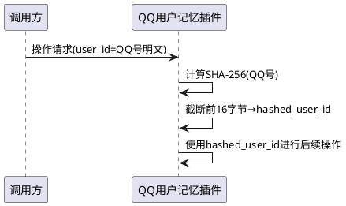

### **5.1.3 异常场景**

1. **QQ号格式非法**
   - 触发条件：传入的 user_id 不是合法的QQ号格式（纯数字字符串，5-12位）
   - 系统行为：拒绝操作，记录警告日志
   - 用户感知：返回"用户ID格式无效"

---

## **5.2 对话介入方式**

### **5.2.1 业务规则**

1. **@Tool 方式**：通过 @Tool 装饰器暴露记忆工具供 LLM 主动调用
   - 验收条件：[LLM在对话中决定调用 retrieve_user_memory 工具] → [系统自动注入当前对话用户的 user_id 到 kwargs，插件通过 kwargs.get("user_id", "") 获取]

2. **@Tool user_id/group_id 获取**：@Tool 方法的 kwargs 中由系统自动注入 user_id（QQ号）、group_id（群号，私聊为空）、stream_id、chat_id
   - 验收条件：[LLM调用 @Tool 方法] → [kwargs 中包含系统注入的 user_id 和 group_id 字段]

3. **@Command 方式**：通过 @Command 装饰器暴露记忆管理命令供用户手动触发
   - 验收条件：[用户在聊天中输入"/记忆查看"] → [触发对应的 @Command 方法]

4. **@Command user_id/group_id 获取**：@Command 方法通过 message 参数获取 SessionMessage，从中提取 user_id 和 group_id
   - 验收条件：[用户发送"/记忆查看"命令] → [通过 message.message_info.user_info.user_id 获取发送者QQ号，通过 message.message_info.group_info.group_id 获取群号（私聊为空）]

5. **@HookHandler 方式（可选）**：通过 @HookHandler 装饰器在对话链路关键节点介入，用于自动触发场景
   - 验收条件：[配置 enable_auto_memory=True 且对话结束] → [通过 @HookHandler(chat.receive.after_process) 自动提取对话内容并智能记录记忆]

6. **禁止使用 ON_MESSAGE**：ON_MESSAGE 事件已被框架废弃，不在主消息链中自动触发
   - 验收条件：[代码审查] → [无任何 @EventHandler(ON_MESSAGE) 使用]

7. **三种方式职责划分**：@Tool 负责对话中 LLM 主动调用，@Command 负责用户手动管理，@HookHandler 负责自动触发场景
   - 验收条件：[记忆检索] → [由 @Tool 暴露，LLM 主动调用]
   - 验收条件：[记忆管理操作] → [由 @Command 暴露，用户手动触发]
   - 验收条件：[自动记忆] → [由 @HookHandler 暴露，框架链路自动触发]

### **5.2.2 交互流程**

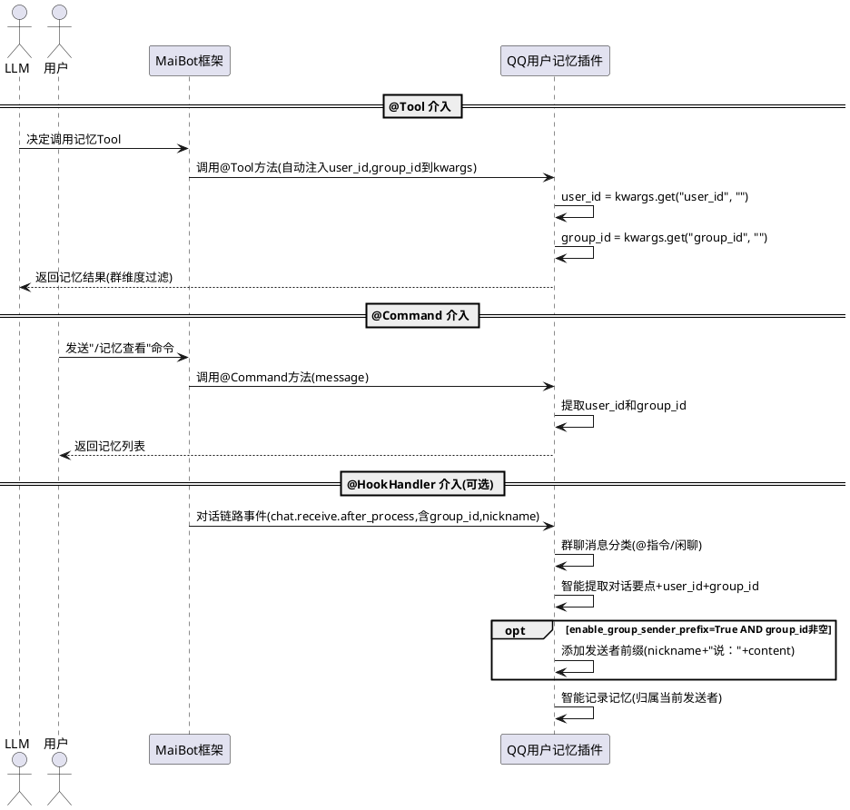

### **5.2.3 异常场景**

1. **@Tool kwargs 中无 user_id**
   - 触发条件：系统未注入 user_id（框架异常或非标准调用）
   - 系统行为：使用空字符串作为 user_id，记录警告日志
   - 用户感知：LLM 调用返回"无法识别当前用户"

2. **@Command message 中无 user_id**
   - 触发条件：SessionMessage 中 user_info 或 user_id 字段缺失
   - 系统行为：拒绝操作，记录错误日志
   - 用户感知：返回"无法识别操作者身份"

3. **@HookHandler 事件中无 user_id**
   - 触发条件：对话链路事件中无法提取 user_id
   - 系统行为：跳过本次自动记忆，记录警告日志
   - 用户感知：无感知（自动记忆静默失败）

---

## **5.3 白名单控制与访问校验**

### **5.3.1 业务规则**

**REQ-030**：**被记忆用户白名单校验**：When 执行记忆添加操作，the 插件 shall 校验被记忆用户的QQ号是否在被记忆用户白名单（memorized_user_ids）中
- 验收条件：[被记忆用户QQ号在memorized_user_ids中] → [允许记忆操作]
- 验收条件：[被记忆用户QQ号不在memorized_user_ids中] → [拒绝记忆操作，返回"该用户不在可记忆名单中"，记录审计日志]
- 优先级：P0
- 状态：已有

**REQ-031**：**操作者白名单校验**：When 用户通过@Command手动执行记忆管理操作，the 插件 shall 校验操作者的QQ号是否在操作者白名单（operator_user_ids）中
- 验收条件：[操作者QQ号在operator_user_ids或为admin] → [允许执行记忆管理操作]
- 验收条件：[操作者QQ号不在operator_user_ids且非admin] → [拒绝操作，返回"您无权执行记忆管理操作"，记录审计日志]
- 优先级：P0
- 状态：已有

**REQ-032**：**自动记忆钩子的访问校验**：When @HookHandler自动记忆钩子触发，the 插件 shall 仅校验被记忆用户是否在memorized_user_ids白名单中，不校验操作者白名单
- 验收条件：[自动记忆钩子触发，user_id="非admin用户"在memorized_user_ids中] → [允许自动记录该用户记忆，不被操作者白名单拒绝]
- 验收条件：[自动记忆钩子触发，user_id不在memorized_user_ids中] → [拒绝自动记录，记录审计日志含拒绝原因]
- 优先级：P0
- 状态：已有

**REQ-033**：**白名单两阶段校验模型**：The 插件 shall 将访问校验分为两阶段：(1)操作者权限校验——仅对@Command手动操作校验操作者白名单；(2)被记忆对象校验——对所有记忆添加操作校验被记忆用户白名单
- 验收条件：[@Command手动操作，操作者不在白名单] → [第一阶段拒绝，不进入第二阶段]
- 验收条件：[@Command手动操作，操作者在白名单，被记忆用户不在白名单] → [第一阶段通过，第二阶段拒绝]
- 验收条件：[@HookHandler自动记忆，被记忆用户在白名单] → [跳过第一阶段，第二阶段通过，允许记忆]
- 验收条件：[@Tool调用，被记忆用户在白名单] → [跳过第一阶段，第二阶段通过，允许记忆]
- 优先级：P0
- 状态：已有

**REQ-034**：**admin自动纳入操作者白名单**：Where admin QQ号已在MaiBot全局配置中设定，the 插件 shall 将admin自动纳入操作者白名单，无需在operator_user_ids中显式配置
- 验收条件：[operator_user_ids为空，admin(936658939)发送/记忆查看] → [admin可正常执行操作]
- 优先级：P1
- 状态：已有

**REQ-035**：**白名单配置方式**：白名单通过 config.toml 的 [access] 段和 WebUI 两种方式配置，实时生效
- 验收条件：[在config.toml中配置 memorized_user_ids = ["123456"] 并保存] → [触发 on_config_update，用户123456立即可被记忆]
- 优先级：P1
- 状态：已有

**REQ-036**：**LLM Tool调用白名单**：LLM通过Tool调用记忆添加操作时，同样受被记忆用户白名单约束
- 验收条件：[LLM调用add_user_memory，目标用户不在memorized_user_ids中] → [返回"该用户不在可记忆名单中"]
- 优先级：P0
- 状态：已有

**REQ-037**：**拒绝操作审计日志**：When 记忆操作被白名单或权限拒绝，the 插件 shall 记录审计日志包含操作者ID、被记忆对象ID、拒绝原因、操作类型、时间戳
- 验收条件：[非白名单用户触发自动记忆被拒绝] → [日志包含：user_id=哈希值, reason="不在被记忆用户白名单", operation="auto_memory", timestamp]
- 优先级：P0
- 状态：已有

### **5.3.2 交互流程**

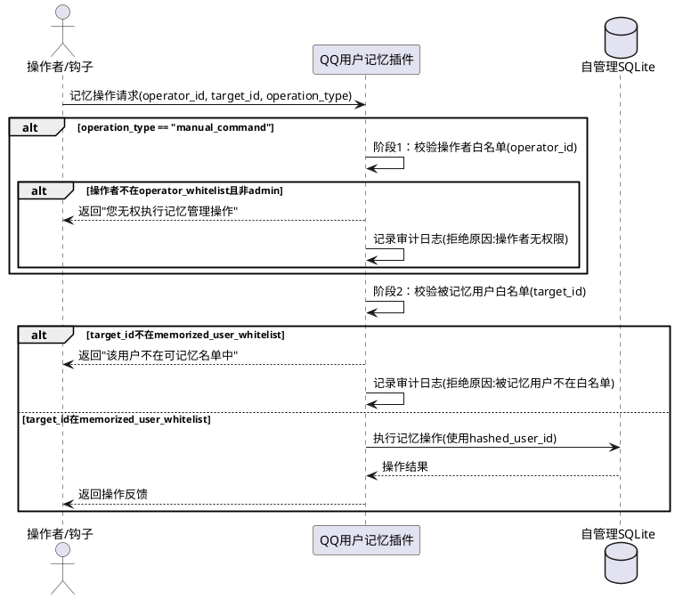

### **5.3.3 异常场景**

1. **操作者不在白名单（手动操作）**
   - 触发条件：手动命令操作时，操作者的QQ号不在 operator_whitelist 且非 admin
   - 系统行为：拒绝操作，记录审计日志
   - 用户感知：返回"您无权执行记忆管理操作"

2. **被记忆用户不在白名单**
   - 触发条件：被记忆用户的QQ号不在 memorized_user_whitelist
   - 系统行为：拒绝记忆操作，记录审计日志
   - 用户感知：返回"该用户不在可记忆名单中"

3. **白名单为空**
   - 触发条件：memorized_user_whitelist 配置为空列表
   - 系统行为：所有记忆添加操作被拒绝，日志提示被记忆用户白名单未配置
   - 用户感知：返回"被记忆用户白名单未配置，请联系管理员"

4. **操作者白名单为空但admin存在**
   - 触发条件：operator_user_ids 为空，但 admin 已配置
   - 系统行为：仅 admin 可执行手动管理操作，其他用户被拒绝
   - 用户感知：非admin返回"您无权执行记忆管理操作"

---

## **5.4 记忆存储与双重隔离**

### **5.4.1 业务规则**

**REQ-040**：**用户维度隔离**：The 插件 shall 保证每条记忆绑定一个 hashed_user_id，不同用户的记忆数据完全隔离
- 验收条件：[用户A查询记忆] → [仅返回用户A的记忆（通过hashed_user_id隔离），不含用户B的任何记忆]
- 优先级：P0
- 状态：已有

**REQ-041**：**群维度记忆隔离**：Where 记忆条目的 group_id 字段非空，the 插件 shall 按群维度隔离记忆，区分"群聊上下文记忆"（group_id非空）和"全局记忆"（group_id为空）
- 验收条件：[用户A在群G1产生记忆M1(group_id=G1)，在私聊产生记忆M2(group_id=空)] → [M1为群聊上下文记忆，仅在群G1上下文中检索可见；M2为全局记忆，在所有上下文中检索可见]
- 优先级：P0
- 状态：已有

**REQ-042**：**双重隔离检索**：When 在群聊环境中检索用户记忆，the 插件 shall 同时返回该用户的全局记忆（group_id为空）和该群聊上下文记忆（group_id等于当前群号），按综合相关度排序
- 验收条件：[用户A在群G1中检索记忆，A有全局记忆M1、群G1记忆M2、群G2记忆M3] → [返回M1和M2，不含M3]
- 验收条件：[用户A在私聊中检索记忆，A有全局记忆M1、群G1记忆M2] → [仅返回M1（全局记忆），不含M2]
- 优先级：P0
- 状态：已有

**REQ-043**：**群聊消息发送者归属**：When 在群聊环境中自动记录记忆，the 插件 shall 将记忆归属到消息的实际发送者（user_id），而非被@的用户或被提及的用户
- 验收条件：[群聊中用户B发言提到"我喜欢猫"，但当前会话用户是A] → [该记忆归属到用户B（user_id=B），不归属到A]
- 验收条件：[群聊中用户A发言"我今天很开心"] → [该记忆归属到用户A（user_id=A），group_id=当前群号]
- 优先级：P0
- 状态：已有

**REQ-091**：**群聊记忆发送者前缀策略**：When 群聊环境中自动记忆钩子触发且 enable_group_sender_prefix=True，the 插件 shall 在记忆内容前添加发送者昵称前缀，格式为"{发送者昵称}说：{原始记忆内容}"，记忆仍归属到发送者的 hashed_user_id
- 验收条件：[群聊中用户"小明"发言"我喜欢火锅"，enable_group_sender_prefix=True] → [记忆内容存储为"小明说：我喜欢火锅"，hashed_user_id为小明的哈希]
- 验收条件：[群聊中用户"小红"发言"今天天气不错"，enable_group_sender_prefix=True] → [记忆内容存储为"小红说：今天天气不错"，hashed_user_id为小红的哈希]
- 验收条件：[私聊中用户发言"我喜欢看书"，enable_group_sender_prefix=True] → [记忆内容存储为"我喜欢看书"（私聊不添加前缀）]
- 验收条件：[enable_group_sender_prefix=False] → [群聊记忆不添加发送者前缀，行为与v6.1.0一致]
- 优先级：P0
- 状态：已有

**REQ-092**：**群聊记忆发送者前缀与智能提取的协作**：When 群聊中启用发送者前缀策略且启用智能提取，the 插件 shall 先对原始消息内容执行智能提取，再将发送者前缀添加到提取后的记忆内容前
- 验收条件：[群聊中用户"小明"发言"我最近在学Python和Go"，智能提取后得到"在学习Python和Go"] → [最终存储为"小明说：在学习Python和Go"]
- 验收条件：[智能提取降级为简单存储时] → [最终存储为"小明说：我最近在学Python和Go"（原文+前缀）]
- 优先级：P0
- 状态：已有

**REQ-093**：**群聊记忆发送者昵称获取**：When 群聊记忆需要添加发送者前缀，the 插件 shall 从消息上下文中获取发送者昵称，优先使用群昵称，其次使用QQ昵称，最后使用user_id
- 验收条件：[群成员设置了群昵称"小码"] → [前缀使用"小码说："]
- 验收条件：[群成员未设置群昵称，QQ昵称为"张三"] → [前缀使用"张三说："]
- 验收条件：[无法获取任何昵称，user_id="123456"] → [前缀使用"123456说："]
- 优先级：P1
- 状态：已有

**REQ-044**：**记忆条目结构**：每条记忆包含 entry_id、hashed_user_id、content、category、importance、expiry_at、created_at、updated_at、tags、source、embedding_vector、vector_updated_at、group_id、time_decay_weight 字段
- 验收条件：[新增记忆] → [写入的数据包含上述全部字段且值合法，不含明文QQ号]
- 优先级：P1
- 状态：已有

**REQ-045**：**智能淘汰策略**：When 用户记忆条数达到上限，the 插件 shall 按 importance × time_decay_weight 的加权分数升序淘汰（加权分数最低的优先淘汰，importance=5保护不淘汰）
- 验收条件：[用户记忆达到200条上限后新增] → [淘汰加权分数最低的记忆，importance=5的记忆不被淘汰]
- 优先级：P1
- 状态：已有

**REQ-046**：**禁止跨用户写入**：记忆写入时 hashed_user_id 必须由当前消息发送者的QQ号哈希计算得出
- 验收条件：[普通用户通过命令添加记忆] → [hashed_user_id 为消息发送者QQ号的哈希，不可指定他人]
- 优先级：P0
- 状态：已有

### **5.4.2 交互流程**

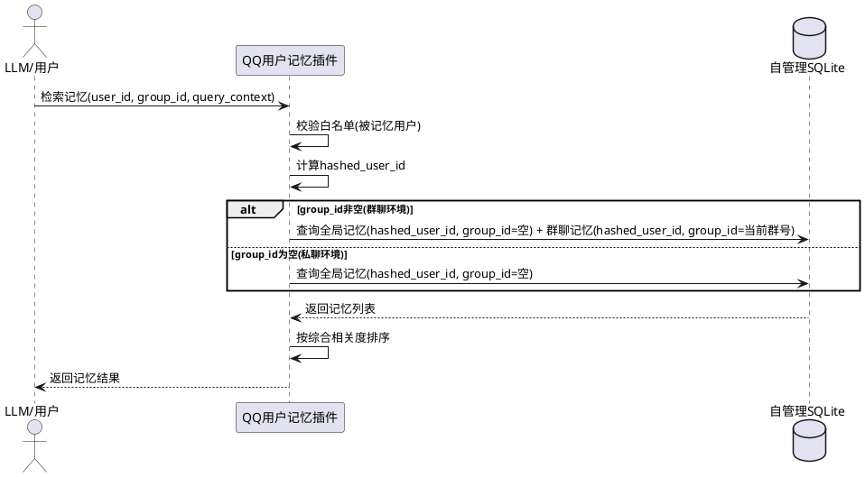

### **5.4.3 异常场景**

1. **SQLite 文件创建失败**
   - 触发条件：插件目录无写权限或磁盘空间不足
   - 系统行为：插件进入降级模式，记录错误日志
   - 用户感知：记忆相关命令返回"插件暂不可用"

2. **数据库写入失败**
   - 触发条件：SQLite 写入操作返回异常
   - 系统行为：捕获异常，记录错误日志，不重试
   - 用户感知：返回"记忆写入失败，请稍后再试"

3. **群聊归属误判**
   - 触发条件：群聊中他人发言被错误归属到当前用户
   - 系统行为：记忆已写入（以消息发送者为准，此场景为极端边界情况）
   - 用户感知：可通过WebUI手动删除错误归属的记忆

---

## **5.5 群聊环境深度优化**

### **5.5.1 业务规则**

**REQ-050**：**群聊消息分类**：When 群聊消息到达，the 插件 shall 将消息分为以下类别：@指令（@机器人触发的指令）、回复指令（回复机器人消息触发的指令）、闲聊（未@机器人且非回复的普通消息）
- 验收条件：[群聊消息包含@机器人] → [分类为@指令]
- 验收条件：[群聊消息是回复机器人消息] → [分类为回复指令]
- 验收条件：[群聊消息未@机器人且非回复] → [分类为闲聊]
- 优先级：P1
- 状态：已有

**REQ-051**：**群聊消息分类影响自动记忆策略**：Where enable_auto_memory=True，When 自动记忆钩子在群聊中触发，the 插件 shall 根据消息分类采用不同记忆策略
- 验收条件：[消息分类为@指令] → [不自动记录记忆（指令为操作意图，非个人信息）]
- 验收条件：[消息分类为回复指令] → [不自动记录记忆（指令为操作意图，非个人信息）]
- 验收条件：[消息分类为闲聊] → [执行自动记忆提取和记录]
- 优先级：P1
- 状态：已有

**REQ-052**：**群聊与私聊记忆分离存储**：Where 记忆产生于群聊环境，the 插件 shall 将 group_id 记录到记忆条目中；Where 记忆产生于私聊环境，the 插件 shall 将 group_id 设为空字符串
- 验收条件：[群聊环境产生记忆] → [记忆条目group_id字段为当前QQ群号]
- 验收条件：[私聊环境产生记忆] → [记忆条目group_id字段为空字符串]
- 优先级：P0
- 状态：已有

**REQ-053**：**群聊记忆检索上下文感知**：When LLM在群聊对话中调用retrieve_user_memory，the 插件 shall 优先返回与当前群聊上下文相关的记忆（group_id匹配），全局记忆作为补充
- 验收条件：[群G1对话中检索用户A记忆，A有群G1记忆"在这个群喜欢聊技术"、全局记忆"喜欢吃苹果"、群G2记忆"在那个群喜欢聊游戏"] → [返回结果按顺序：群G1记忆 > 全局记忆，不含群G2记忆]
- 优先级：P0
- 状态：已有

**REQ-054**：**群聊环境记忆手动添加**：When 用户在群聊中通过/记忆添加命令添加记忆，the 插件 shall 将记忆归属到当前群聊（group_id=当前群号），而非全局记忆
- 验收条件：[用户在群G1中发送/记忆添加 喜欢这个群的氛围] → [记忆条目group_id=G1]
- 验收条件：[用户在私聊中发送/记忆添加 喜欢吃苹果] → [记忆条目group_id=空]
- 优先级：P1
- 状态：已有

**REQ-055**：**群聊记忆WebUI筛选**：Where WebUI记忆管理页面已加载，the 用户 shall 可按group_id筛选记忆，查看指定群聊的记忆或全局记忆
- 验收条件：[WebUI选择群G1筛选] → [仅显示group_id=G1的记忆条目]
- 验收条件：[WebUI选择"全局"筛选] → [仅显示group_id为空的记忆条目]
- 验收条件：[WebUI选择"全部"筛选] → [显示所有记忆条目]
- 优先级：P1
- 状态：已有

### **5.5.2 交互流程**

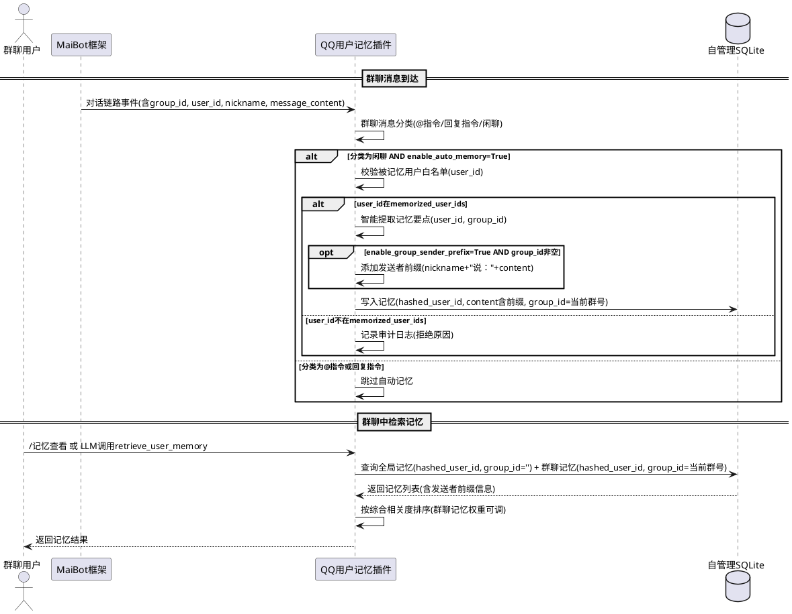

### **5.5.3 异常场景**

1. **群聊消息分类模糊**
   - 触发条件：消息同时包含@机器人和闲聊内容
   - 系统行为：优先分类为@指令，不自动记录记忆
   - 用户感知：无感知（遵循"指令优先"原则）

2. **群聊中非白名单用户发言**
   - 触发条件：群聊中非被记忆用户白名单的用户发言
   - 系统行为：跳过自动记忆，记录审计日志
   - 用户感知：无感知（静默跳过）

3. **群号提取失败**
   - 触发条件：群聊消息事件中 group_id 字段缺失
   - 系统行为：将记忆作为全局记忆存储（group_id=空），记录警告日志
   - 用户感知：无感知（降级为全局记忆）

---

## **5.6 语义嵌入检索**

### **5.6.1 业务规则**

1. **嵌入检索开关**：通过 enable_embedding_retrieve 配置项控制是否启用语义向量嵌入检索
   - 验收条件：[enable_embedding_retrieve=True] → [检索时使用向量嵌入计算余弦相似度排序]
   - 验收条件：[enable_embedding_retrieve=False] → [降级为关键词重叠检索]

2. **嵌入模型选择**：通过 embedding_model_mode 配置项选择嵌入模型来源
   - 验收条件：[embedding_model_mode="local"] → [使用本地 sentence-transformers 模型]
   - 验收条件：[embedding_model_mode="api"] → [通过 ctx.llm 调用嵌入API]

3. **向量生成时机**：记忆添加时同步生成嵌入向量并存储
   - 验收条件：[enable_embedding_retrieve=True，添加新记忆] → [调用嵌入模型生成向量，与记忆条目一同存入SQLite]

4. **查询向量检索**：检索时将查询文本转为向量，与候选记忆向量计算余弦相似度，按相似度降序返回
   - 验收条件：[enable_embedding_retrieve=True，查询"推荐餐厅"，用户有记忆"喜欢吃苹果"和"今天修了电脑"] → ["喜欢吃苹果"相似度更高排在前面]

5. **语义检索增强**：嵌入可用时优先用向量相似度排序，关键词作为fallback
   - 验收条件：[enable_embedding_retrieve=True且嵌入模型可用] → [使用向量余弦相似度排序]
   - 验收条件：[enable_embedding_retrieve=True但嵌入模型不可用] → [降级为关键词重叠排序，记录警告日志]

6. **向量缺失降级**：当记忆条目缺少嵌入向量时，对该条目降级为关键词匹配
   - 验收条件：[某记忆条目embedding_vector为空] → [该条目不参与向量排序，但仍可通过关键词匹配返回]

7. **向量批量构建**：首次启用嵌入检索时，支持对已有记忆批量生成向量
   - 验收条件：[enable_embedding_retrieve从False改为True，已有记忆无向量] → [提供批量生成向量命令]

8. **过期记忆排除**：检索时自动排除已过期的记忆条目（expiry_at < 当前时间）
   - 验收条件：[记忆A的expiry_at已过期，记忆B未过期] → [检索结果仅包含记忆B]

9. **默认条数**：查询时未指定条数则使用配置中的默认值
   - 验收条件：[传入user_id未传limit] → [返回条数等于配置中的default_query_limit]

10. **记忆检索Tool**：通过 @Tool 装饰器暴露 retrieve_user_memory 工具供 LLM 调用，user_id 和 group_id 通过 kwargs 自动注入
    - 验收条件：[LLM调用retrieve_user_memory] → [从kwargs获取user_id和group_id，执行双重隔离检索]

**REQ-094**：**retrieve_user_memory 支持指定目标用户**：When LLM 调用 retrieve_user_memory 且传入 target_user_name 参数，the 插件 shall 通过昵称映射查找目标用户的 user_id，检索目标用户的记忆而非当前消息发送者的记忆
- 验收条件：[群聊中LLM调用retrieve_user_memory(target_user_name="小明")] → [查找"小明"对应的user_id，检索"小明"的记忆并返回]
- 验收条件：[群聊中LLM调用retrieve_user_memory(target_user_name="小明")，"小明"对应user_id不在被记忆用户白名单中] → [返回"目标用户不在可记忆名单中"]
- 验收条件：[群聊中LLM调用retrieve_user_memory(target_user_name="小明")，昵称映射中找不到"小明"] → [返回"未找到用户：小明，请使用准确的用户昵称"，降级检索当前发送者记忆]
- 验收条件：[LLM调用retrieve_user_memory未传入target_user_name] → [行为与v6.1.0一致，检索当前消息发送者的记忆]
- 优先级：P1
- 状态：已有

**REQ-095**：**target_user_name 参数定义**：Where retrieve_user_memory Tool 的参数定义中，the 插件 shall 暴露可选的 target_user_name（字符串类型）参数供 LLM 传入，参数描述说明用于指定想了解的用户昵称
- 验收条件：[Tool 参数列表中包含 target_user_name] → [类型为string，required=False，描述包含"指定想了解的用户昵称，不传则查询当前用户"]
- 优先级：P1
- 状态：已有

**REQ-096**：**昵称映射查找策略**：When 需要将 target_user_name 解析为 user_id，the 插件 shall 按以下优先级查找：(1)群成员列表中群昵称精确匹配；(2)群成员列表中QQ昵称精确匹配；(3)历史消息中发送者昵称精确匹配
- 验收条件：[群成员列表中群昵称="小明"对应user_id=111] → [target_user_name="小明"解析为user_id=111]
- 验收条件：[群昵称无匹配，QQ昵称="小明"对应user_id=222] → [target_user_name="小明"解析为user_id=222]
- 验收条件：[群成员列表无匹配，历史消息中发送者昵称="小明"对应user_id=333] → [target_user_name="小明"解析为user_id=333]
- 验收条件：[所有来源均无匹配] → [返回查找失败，降级检索当前发送者记忆]
- 优先级：P1
- 状态：已有

**REQ-097**：**跨用户检索的权限校验**：When LLM 通过 target_user_name 指定目标用户检索记忆，the 插件 shall 校验目标用户是否在被记忆用户白名单中，非白名单用户记忆不可检索
- 验收条件：[目标用户在被记忆用户白名单中] → [返回目标用户记忆]
- 验收条件：[目标用户不在被记忆用户白名单中] → [返回"目标用户不在可记忆名单中"，不返回任何记忆数据]
- 优先级：P0
- 状态：已有

### **5.6.2 交互流程**

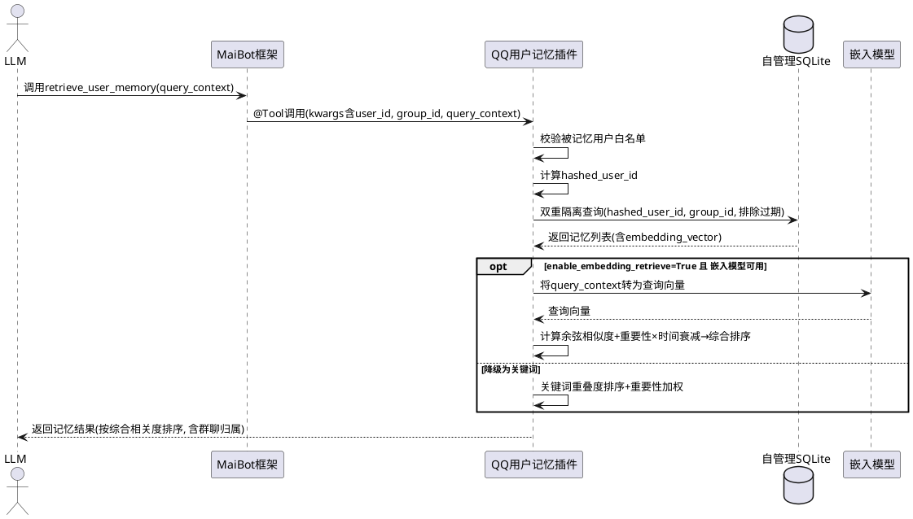

### **5.6.3 异常场景**

1. **嵌入模型加载失败**
   - 触发条件：本地模型文件缺失或API不可用
   - 系统行为：降级为关键词检索模式，记录错误日志
   - 用户感知：检索功能可用但精度降低

2. **向量计算超时**
   - 触发条件：嵌入API响应超过2秒
   - 系统行为：该条记忆跳过向量生成，降级为关键词匹配
   - 用户感知：无感知（检索仍可用）

---

## **5.7 智能提取与合并去重**

### **5.7.1 业务规则**

1. **智能提取开关**：通过 enable_smart_extract 配置项控制是否启用 LLM 智能提取
   - 验收条件：[enable_smart_extract=True] → [添加记忆前调用LLM提取要点、分类、评估重要性]
   - 验收条件：[enable_smart_extract=False] → [直接存储原始文本，category=general，importance=3]

2. **LLM提取内容**：智能提取时传入当前用户消息内容，LLM返回结构化JSON（content, category, importance, tags）
   - 验收条件：[用户消息"我最近在学Python"] → [LLM提取：content="在学习Python", category="habit", importance=3, tags=["编程"]]

3. **JSON修复逻辑**：LLM返回非法JSON时，通过提取花括号内内容、修复截断JSON等方式尝试修复
   - 验收条件：[LLM返回`{content: "喜欢蓝色"`（缺少闭合括号）] → [修复为`{"content": "喜欢蓝色"}`]

4. **LLM重试机制**：LLM调用返回非法格式时，自动重试最多3次
   - 验收条件：[LLM第1次返回非法格式，第2次返回合法JSON] → [使用第2次结果]
   - 验收条件：[LLM 3次均返回非法格式] → [降级为简单存储，不丢失原始内容]

5. **合并去重开关**：通过 enable_merge_dedup 配置项控制是否启用语义合并去重
   - 验收条件：[enable_merge_dedup=True] → [新增记忆后自动检测相似度，触发合并]
   - 验收条件：[enable_merge_dedup=False] → [不检测相似度，直接添加]

6. **自动合并触发**：新增记忆后异步检测与已有记忆的相似度，超过阈值时自动触发合并
   - 验收条件：[新增记忆"喜欢蓝色和绿色"，已有记忆"喜欢蓝色"，相似度>阈值] → [异步触发合并为"喜欢蓝色和绿色"]

7. **合并时保留更新信息**：合并后的记忆内容优先保留更新的信息，旧信息作为补充
   - 验收条件：[旧记忆"喜欢蓝色"，新记忆"喜欢蓝色和绿色"] → [合并为"喜欢蓝色和绿色"，保留新记忆的时间戳]

**REQ-083**：**智能提取 prompt 优化**：When 智能提取调用 LLM，the 插件 shall 使用优化后的 prompt 模板，明确要求 LLM 返回完整 JSON 对象而非仅返回 key 名称
- 验收条件：[智能提取 prompt 中包含"返回完整JSON对象"的明确指令] → [LLM返回完整JSON对象的比例提升]
- 验收条件：[智能提取 prompt 中包含 JSON schema 约束或示例] → [LLM返回格式符合 schema 的比例提升]
- 优先级：P1
- 状态：已有

**REQ-084**：**裸 key 名模式检测与直接降级**：When 智能提取 LLM 返回结果匹配裸 key 名模式（如仅返回 `'"refined"'`、`'"content"'` 等 JSON key 名而非完整对象），the 插件 shall 直接降级为简单存储原始内容，不重试
- 验收条件：[LLM返回 `'"refined"'`（裸 key 名）] → [检测为裸 key 名模式，直接降级，不调用 LLM 重试]
- 验收条件：[LLM返回 `'"content"'`（裸 key 名）] → [检测为裸 key 名模式，直接降级，不调用 LLM 重试]
- 验收条件：[LLM返回 `{"content": "喜欢蓝色", "category": "preference"}`（合法完整 JSON）] → [正常使用，不触发降级]
- 验收条件：[裸 key 名检测后降级] → [原始对话内容以 content=原文、category=general、importance=3 存储，不丢失数据]
- 优先级：P1
- 状态：已有

**REQ-085**：**智能提取 prompt JSON schema 约束**：Where 智能提取 prompt 模板中，the 插件 shall 使用更严格的 JSON schema 约束，包含完整的输出格式示例和字段类型要求
- 验收条件：[prompt 模板中包含 JSON schema 或等效格式约束] → [LLM 返回结果中合法 JSON 对象比例提升]
- 验收条件：[prompt 模板中包含期望输出的完整示例] → [LLM 返回结构匹配示例的比例提升]
- 优先级：P1
- 状态：已有

**REQ-086**：**LLM 返回结果类型日志**：When 智能提取 LLM 返回结果，the 插件 shall 记录 LLM 返回结果的类型分类日志，便于调试和 prompt 优化
- 验收条件：[LLM返回合法完整JSON] → [日志记录：llm_result_type="valid_json"]
- 验收条件：[LLM返回裸 key 名] → [日志记录：llm_result_type="bare_key", raw_response=原始返回值（截断至200字符）]
- 验收条件：[LLM返回非法JSON但可修复] → [日志记录：llm_result_type="repairable_json"]
- 验收条件：[LLM返回完全无法解析的内容] → [日志记录：llm_result_type="unparseable", raw_response=原始返回值（截断至200字符）]
- 优先级：P1
- 状态：已有

### **5.7.2 交互流程**

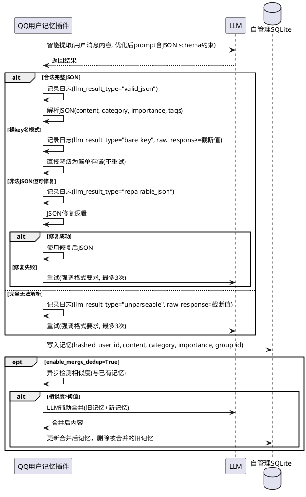

### **5.7.3 异常场景**

1. **LLM提取返回空内容**
   - 触发条件：LLM返回的JSON中content为空
   - 系统行为：降级为简单存储原始文本
   - 用户感知：无感知

2. **合并过程中LLM失败**
   - 触发条件：LLM辅助合并调用失败
   - 系统行为：保留原始条目，不执行合并，记录警告日志
   - 用户感知：无感知

3. **LLM持续返回裸 key 名**
   - 触发条件：LLM多次调用均返回裸 key 名模式（如 `'"refined"'`）
   - 系统行为：每次检测到裸 key 名均直接降级，不重试，避免浪费 LLM 预算
   - 用户感知：记忆以简单存储方式写入，功能不受影响

---

## **5.8 A_Memorix 深度协同**

### **5.8.1 业务规则**

**REQ-060**：**A_Memorix协同开关**：Where enable_amemorix_sync=True，the 插件 shall 启用与A_Memorix的双向协同功能；Where enable_amemorix_sync=False，the 插件 shall 独立运行，不与A_Memorix交互
- 验收条件：[enable_amemorix_sync=True] → [检索时联合A_Memorix，写入时分流到A_Memorix]
- 验收条件：[enable_amemorix_sync=False] → [所有记忆操作仅在本地SQLite，不调用A_Memorix接口]
- 优先级：P1
- 状态：已有

**REQ-061**：**检索联合排序**：When 检索用户记忆且enable_amemorix_sync=True，the 插件 shall 先从本地获取中短期记忆，再从A_Memorix获取长期记忆（search_memory），两路结果合并后按综合相关度统一排序返回
- 验收条件：[本地有短期记忆"最近在学Python"，A_Memorix有长期记忆"职业是程序员"，查询"编程相关"] → [合并排序后返回两条记忆，按综合相关度排序]
- 验收条件：[A_Memorix检索超时5秒] → [降级为仅返回本地记忆，记录警告日志]
- 优先级：P0
- 状态：已有

**REQ-062**：**写入分工**：When 新增记忆且enable_amemorix_sync=True，the 插件 shall 将记忆写入本地中短期记忆；Where 记忆的importance >= amemorix_sync_importance_threshold，the 插件 shall 同时通过ingest_text同步到A_Memorix长期记忆
- 验收条件：[新增记忆importance=3，threshold=4] → [仅写入本地，不同步到A_Memorix]
- 验收条件：[新增记忆importance=5，threshold=4] → [写入本地 + 通过ingest_text同步到A_Memorix]
- 验收条件：[A_Memorix同步失败] → [本地记忆不受影响，记录警告日志，标记该条目待重试]
- 优先级：P1
- 状态：已有

**REQ-063**：**群聊隔离对齐**：Where 记忆操作涉及群聊环境（group_id非空），the 插件 shall 将group_id作为A_Memorix的chat_id参数传入，确保群聊隔离在两个系统间一致
- 验收条件：[群G1中检索记忆，调用A_Memorix search_memory] → [传入chat_id=G1]
- 验收条件：[群G1中写入重要记忆到A_Memorix，调用ingest_text] → [传入chat_id=G1]
- 验收条件：[私聊中检索记忆，调用A_Memorix search_memory] → [不传入chat_id或传入空值]
- 优先级：P0
- 状态：已有

**REQ-064**：**A_Memorix接口调用规范**：The 插件 shall 仅通过A_Memorix的公开Tool/Service标准接口（search_memory, ingest_text, ingest_summary, get_person_profile）与其交互，禁止直接操作其内部存储
- 验收条件：[代码审查] → [不包含对A_Memorix SQLite/Faiss的直接读写操作]
- 优先级：P0
- 状态：已有

**REQ-065**：**A_Memorix协同降级**：If A_Memorix接口调用失败或超时，the 插件 shall 降级为仅使用本地记忆，不影响用户对话和记忆操作
- 验收条件：[A_Memorix search_memory超时] → [仅返回本地记忆结果，记录警告日志]
- 验收条件：[A_Memorix ingest_text失败] → [本地记忆写入成功，标记待重试，不影响对话]
- 优先级：P0
- 状态：已有

**REQ-066**：**A_Memorix同步重要性阈值配置**：The amemorix_sync_importance_threshold 参数 shall 支持通过config.toml和WebUI配置，控制哪些重要性级别的记忆同步到A_Memorix
- 验收条件：[配置amemorix_sync_importance_threshold=4] → [仅importance>=4的记忆同步到A_Memorix]
- 优先级：P1
- 状态：已有

**REQ-080**：**_manifest.json capabilities 声明 api.call**：The 插件 shall 在 _manifest.json 的 capabilities 列表中包含 `api.call`，声明调用其他子系统（A_Memorix）Tool/Service 接口所需的能力
- 验收条件：[_manifest.json 中 capabilities 包含 "api.call"] → [MaiBot 框架授权后，插件可正常调用 A_Memorix 的 ingest_text 和 search_memory 接口]
- 验收条件：[_manifest.json 中 capabilities 不包含 "api.call"] → [调用 A_Memorix 接口报错 E_CAPABILITY_DENIED]
- 优先级：P0
- 状态：已有

**REQ-081**：**A_Memorix 接口调用权限验证**：When _manifest.json 中 capabilities 包含 `api.call` 且框架完成授权，the 插件 shall 可正常调用 A_Memorix 的 ingest_text 和 search_memory 接口，不报 E_CAPABILITY_DENIED 错误
- 验收条件：[enable_amemorix_sync=True，capabilities 含 api.call，框架已授权] → [ingest_text 调用成功，search_memory 调用成功]
- 验收条件：[enable_amemorix_sync=True，capabilities 含 api.call，但框架未授权] → [记录错误日志含 E_CAPABILITY_DENIED，降级为独立运行模式]
- 优先级：P0
- 状态：已有

**REQ-082**：**A_Memorix 能力授权失败降级**：If 插件调用 A_Memorix 接口时报错 E_CAPABILITY_DENIED，the 插件 shall 降级为独立运行模式，本地记忆功能不受影响
- 验收条件：[A_Memorix 接口返回 E_CAPABILITY_DENIED] → [记录错误日志"插件未获授权能力: api.call，请检查_manifest.json capabilities 或插件配置"，降级为独立运行]
- 验收条件：[降级为独立运行后] → [本地记忆的增删改查功能正常，仅 A_Memorix 协同功能不可用]
- 优先级：P0
- 状态：已有

### **5.8.2 交互流程**

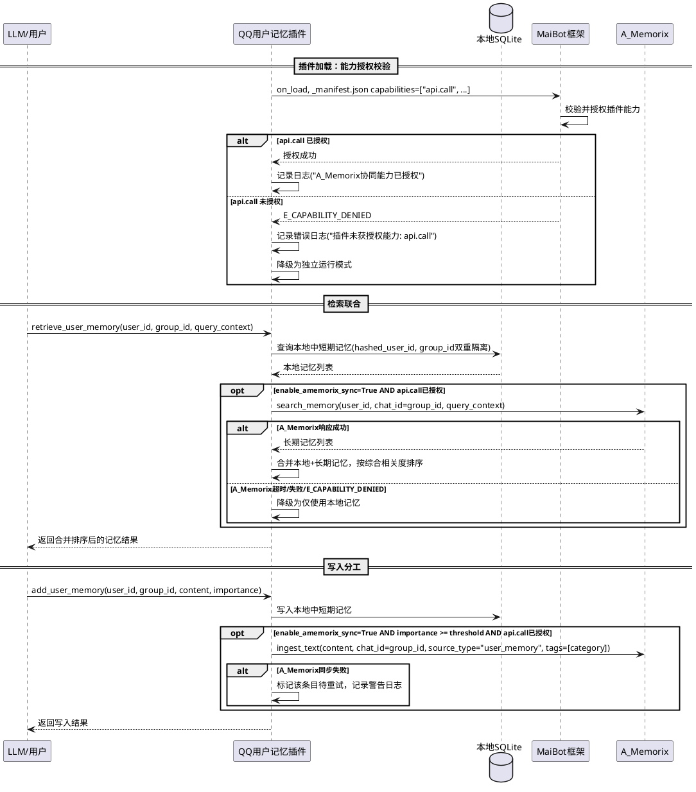

### **5.8.3 异常场景**

1. **A_Memorix服务不可用**
   - 触发条件：enable_amemorix_sync=True但A_Memorix服务未启动或不可达
   - 系统行为：降级为独立运行模式，记录错误日志，定期重试检测
   - 用户感知：记忆功能正常，但仅使用本地数据

2. **A_Memorix接口返回异常数据**
   - 触发条件：search_memory返回格式不符合预期
   - 系统行为：忽略A_Memorix结果，仅使用本地记忆
   - 用户感知：无感知

3. **A_Memorix同步写入失败**
   - 触发条件：ingest_text调用失败
   - 系统行为：本地记忆已写入不受影响，标记待重试
   - 用户感知：记忆添加成功（本地）

4. **A_Memorix 能力授权失败（E_CAPABILITY_DENIED）**
   - 触发条件：_manifest.json 中缺少 api.call 或框架未授权该能力
   - 系统行为：降级为独立运行模式，记录错误日志含 E_CAPABILITY_DENIED 和修复建议
   - 用户感知：本地记忆功能正常，A_Memorix 协同功能不可用

---

## **5.9 WebUI安全与展示优化**

### **5.9.1 业务规则**

**REQ-070**：**WebUI 鉴权必须**：The WebUI 记忆管理页面和所有API端点 shall 必须经过鉴权，未鉴权请求返回401 Unauthorized
- 验收条件：[未登录用户访问WebUI记忆管理页面] → [重定向到登录页面或返回401]
- 验收条件：[未鉴权API请求（如DELETE /api/memory/xxx）] → [返回401 Unauthorized]
- 优先级：P0
- 状态：已有

**REQ-071**：**WebUI 白名单过滤展示**：Where WebUI记忆管理页面已鉴权，the 页面 shall 仅展示被记忆用户白名单（memorized_user_ids）中的用户记忆，不展示非白名单用户的任何记忆数据
- 验收条件：[memorized_user_ids=[A, B]，数据库有A、B、C三个用户的记忆] → [WebUI仅展示A和B的记忆，不展示C的任何数据]
- 验收条件：[用户C从memorized_user_ids中移除] → [WebUI立即不再展示C的记忆，但数据库中C的记忆不物理删除]
- 优先级：P0
- 状态：已有

**REQ-072**：**WebUI API 操作权限校验**：When WebUI API接收到删除/修改/批量操作请求，the 插件 shall 校验操作权限，仅允许对白名单用户的记忆执行操作
- 验收条件：[API请求删除白名单用户的记忆] → [执行删除操作]
- 验收条件：[API请求删除非白名单用户的记忆] → [返回403 Forbidden]
- 优先级：P0
- 状态：已有

**REQ-073**：**机器人回复记忆标记**：Where 记忆条目的source为机器人回复产生（source="bot_reply"），the 插件 shall 在记忆条目中标记该来源
- 验收条件：[机器人回复产生的记忆] → [source字段为"bot_reply"]
- 验收条件：[用户发言产生的记忆] → [source字段为"auto"或"manual"]
- 优先级：P1
- 状态：已有

**REQ-074**：**机器人回复记忆开关**：Where enable_bot_reply_memory=False，the 插件 shall 禁止记录机器人回复产生的记忆
- 验收条件：[enable_bot_reply_memory=False，机器人回复消息] → [不触发自动记忆记录]
- 验收条件：[enable_bot_reply_memory=True，机器人回复消息] → [触发自动记忆记录，source标记为"bot_reply"]
- 优先级：P1
- 状态：已有

**REQ-075**：**历史遗留机器人回复记忆清理**：Where WebUI记忆管理页面已加载，the 用户 shall 可筛选并批量删除source="bot_reply"的历史遗留记忆条目
- 验收条件：[WebUI按source筛选"bot_reply"，显示10条机器人回复记忆] → [可选择批量删除这些记忆]
- 优先级：P2
- 状态：已有

**REQ-076**：**WebUI 群聊维度筛选**：Where WebUI记忆管理页面已加载，the 用户 shall 可按群聊维度（group_id）筛选记忆，支持查看指定群的记忆、全局记忆或全部记忆
- 验收条件：[WebUI选择群G1筛选] → [仅显示group_id=G1的记忆条目]
- 验收条件：[WebUI选择"全局记忆"筛选] → [仅显示group_id为空的记忆条目]
- 验收条件：[WebUI选择"全部"筛选] → [显示所有记忆条目，并标注群聊归属]
- 优先级：P1
- 状态：已有

**REQ-087**：**WebUI 记忆列表新增群聊列**：When WebUI记忆管理页面的记忆列表表格渲染，the 表格 shall 包含"群聊"列，显示该记忆条目的 group_id
- 验收条件：[记忆条目 group_id="123456"] → [群聊列显示"123456"]
- 验收条件：[记忆条目 group_id为空字符串] → [群聊列显示"全局"]
- 优先级：P1
- 状态：已有

**REQ-088**：**WebUI 群聊筛选下拉框新增全局记忆选项**：Where WebUI记忆管理页面的群聊筛选下拉框，the 下拉框 shall 包含"全局记忆"选项，筛选 group_id 为空的记忆条目
- 验收条件：[下拉框选项包含"全局记忆"] → [选择"全局记忆"后，列表仅显示group_id为空的记忆条目]
- 优先级：P1
- 状态：已有

**REQ-089**：**WebUI 批量删除机器人回复记忆按钮**：Where WebUI记忆管理页面已加载，the 页面 shall 提供"批量删除机器人回复记忆"按钮/操作，一键删除所有 source="bot_reply" 的记忆条目
- 验收条件：[点击"批量删除机器人回复记忆"按钮] → [弹出二次确认对话框]
- 验收条件：[确认删除] → [删除所有source="bot_reply"的记忆条目，返回删除数量统计]
- 优先级：P1
- 状态：已有

**REQ-090**：**WebUI 记忆详情展示 source 和 category 信息**：When 用户查看记忆条目详情，the 详情页/弹窗 shall 显示该记忆的 source（来源标记）和 category（记忆类别）信息
- 验收条件：[记忆条目 source="auto", category="preference"] → [详情中显示"来源：自动记忆"和"类别：偏好"]
- 优先级：P1
- 状态：已有

### **5.9.2 交互流程**

（与 v6.2.0 一致，省略以减少冗余）

### **5.9.3 异常场景**

（与 v6.2.0 一致，省略以减少冗余）

---

## **5.10 记忆维护与时间衰减**

### **5.10.1 业务规则**

1. **时间衰减权重计算**：记忆的time_decay_weight = 0.5^(时间差/半衰期)，时间差为当前时间与记忆创建时间的差值（秒），半衰期默认30天
   - 验收条件：[记忆创建于30天前，半衰期=30天] → [time_decay_weight≈0.5]
   - 验收条件：[记忆刚创建] → [time_decay_weight=1.0]

2. **时间衰减在检索排序中的应用**：检索排序综合分数 = 语义相似度 × importance × time_decay_weight
   - 验收条件：[近期高重要性记忆] → [综合分数高于远期低重要性记忆]

3. **时间衰减参数可配置**：time_decay_half_life（半衰期）通过配置调整
   - 验收条件：[配置time_decay_half_life=60天] → [60天前的记忆权重约为0.5]

4. **记忆维护任务**：定时执行过期记忆物理删除、时间衰减权重重算
   - 验收条件：[维护任务触发] → [物理删除已过期的记忆条目，更新time_decay_weight]

5. **时段性记忆自动过期**：category=period的记忆可设置expiry_at，过期后在检索时自动排除
   - 验收条件：[时段性记忆"最近在学Python"设置expiry_at=30天后] → [30天后检索不返回该记忆]

### **5.10.2 交互流程**

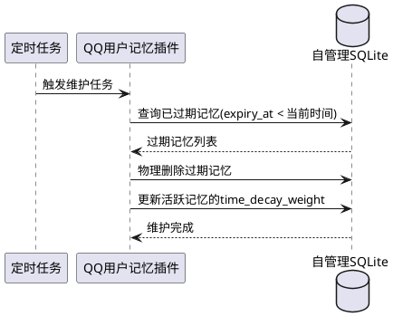

### **5.10.3 异常场景**

1. **维护任务执行超时**
   - 触发条件：维护任务执行超过30秒
   - 系统行为：中断当前维护，下次定时继续
   - 用户感知：无感知

---

## **5.11 A_Memorix 权限授权**

### **5.11.1 业务规则**

（与 v6.2.0 的 REQ-080/REQ-081/REQ-082 一致，状态：已有）

### **5.11.2 交互流程**

（与 v6.2.0 一致）

### **5.11.3 异常场景**

（与 v6.2.0 一致）

---

## **5.12 智能提取 LLM 优化**

### **5.12.1 业务规则**

（与 v6.2.0 的 REQ-083/REQ-084/REQ-085/REQ-086 一致，状态：已有）

### **5.12.2 交互流程**

（与 v6.2.0 一致）

### **5.12.3 异常场景**

（与 v6.2.0 一致）

---

## **5.13 WebUI 体验优化**

### **5.13.1 业务规则**

（与 v6.2.0 的 REQ-087/REQ-088/REQ-089/REQ-090 一致，状态：已有）

### **5.13.2 交互流程**

（与 v6.2.0 一致）

### **5.13.3 异常场景**

（与 v6.2.0 一致）

---

## **5.14 群聊记忆归属优化**

### **5.14.1 业务规则**

（与 v6.2.0 的 REQ-091/REQ-092/REQ-093 一致，状态：已有）

### **5.14.2 交互流程**

（与 v6.2.0 一致）

### **5.14.3 异常场景**

（与 v6.2.0 一致）

---

## **5.15 跨用户记忆检索**

### **5.15.1 业务规则**

（与 v6.2.0 的 REQ-094/REQ-095/REQ-096/REQ-097 一致，状态：已有）

### **5.15.2 交互流程**

（与 v6.2.0 一致）

### **5.15.3 异常场景**

（与 v6.2.0 一致）

---

## **5.16 MaiBot 配置健康检查**

### **5.16.1 业务规则**

（与 v6.2.0 的 REQ-098/REQ-099/REQ-100 一致，状态：已有）

### **5.16.2 交互流程**

（与 v6.2.0 一致）

### **5.16.3 异常场景**

（与 v6.2.0 一致）

---

## **5.17 Replyer Hook 记忆上下文注入**

> **[v7.0.0 新增]** 利用 MaiBot 1.0.0-rc.2 新增的 maisaka.replyer.before_model_request Hook，在 replyer 构建完模型请求消息后，将检索到的用户记忆摘要主动注入到 messages 中，让 LLM 在生成回复时直接参考记忆，提高回复质量和记忆利用率。这是记忆介入方式的核心升级，从"被动等待 Tool Call"转变为"主动注入上下文"。

### **5.17.1 业务规则**

**REQ-110**：**replyer.before_model_request Hook 注册**：Where enable_memory_injection=True，the 插件 shall 在 on_load 时注册 maisaka.replyer.before_model_request Hook 处理器；Where enable_memory_injection=False，the 插件 shall 不注册该 Hook
- 验收条件：[enable_memory_injection=True，插件加载] → [成功注册 replyer.before_model_request Hook，框架在 replyer 构建完请求后调用插件处理器]
- 验收条件：[enable_memory_injection=False，插件加载] → [不注册该 Hook，replyer 流程不受影响]
- 优先级：P0
- 状态：**新增**

**REQ-111**：**记忆注入到 messages**：When replyer.before_model_request Hook 触发且 enable_memory_injection=True，the 插件 shall 从 Hook 上下文中获取当前对话的 user_id 和 group_id，检索用户记忆摘要，将摘要注入到 messages 中并返回改写后的 messages
- 验收条件：[replyer 构建完请求，Hook 触发，user_id=A 在白名单中] → [检索用户A的记忆摘要，注入到 messages 中，返回改写后的 messages 给 replyer]
- 验收条件：[user_id 不在被记忆用户白名单中] → [不注入任何记忆，返回原始 messages 不改写]
- 验收条件：[用户无任何记忆] → [不注入任何记忆，返回原始 messages 不改写]
- 优先级：P0
- 状态：**新增**

**REQ-112**：**注入记忆摘要格式与 token 预算**：When 记忆注入到 messages，the 插件 shall 将记忆摘要格式化为结构化文本，按重要性排序截断至不超过 injection_token_budget 指定的 token 数量
- 验收条件：[注入摘要 token 数 <= injection_token_budget] → [注入成功，摘要包含最重要的记忆]
- 验收条件：[记忆总 token 数超过 budget] → [按重要性降序截断，仅注入最重要的记忆直到 budget 耗尽，记录日志含截断信息]
- 验收条件：[injection_token_budget=0] → [不注入任何记忆，等效关闭注入]
- 优先级：P0
- 状态：**新增**

**REQ-113**：**注入位置策略**：When 记忆注入到 messages，the 插件 shall 根据 injection_position 配置决定注入位置
- 验收条件：[injection_position="system_append"] → [将记忆摘要追加到 system message 末尾（若 system message 存在），或作为首个 system message 插入]
- 验收条件：[injection_position="standalone_user"] → [将记忆摘要作为独立的 user message 插入到 messages 最后一条 user message 之前]
- 优先级：P1
- 状态：**新增**

**REQ-114**：**注入任务类型过滤**：When replyer.before_model_request Hook 触发，the 插件 shall 根据 injection_task_filter 配置决定是否执行记忆注入
- 验收条件：[injection_task_filter=["chat", "reply"]，当前任务类型="chat"] → [执行记忆注入]
- 验收条件：[injection_task_filter=["chat", "reply"]，当前任务类型="summarize"] → [跳过记忆注入，返回原始 messages]
- 验收条件：[injection_task_filter=[]（空列表）] → [所有任务类型均执行记忆注入]
- 优先级：P1
- 状态：**新增**

**REQ-115**：**注入内容双重隔离**：When 记忆注入到 messages 且当前对话在群聊环境中（group_id非空），the 插件 shall 检索用户全局记忆和当前群聊上下文记忆（双重隔离检索），而非仅检索全局记忆
- 验收条件：[群聊 G1 对话中注入记忆，用户A有全局记忆M1、群G1记忆M2、群G2记忆M3] → [注入摘要包含M1和M2，不含M3]
- 验收条件：[私聊对话中注入记忆，用户A有全局记忆M1、群G1记忆M2] → [注入摘要仅包含M1]
- 优先级：P0
- 状态：**新增**

**REQ-116**：**注入摘要模板**：When 记忆注入到 messages，the 插件 shall 使用可配置的注入摘要模板格式化记忆内容，模板支持占位符替换
- 验收条件：[模板为"[用户记忆摘要]\n{memory_list}"，记忆列表含"喜欢吃苹果"和"职业是程序员"] → [注入文本为"[用户记忆摘要]\n1. 喜欢吃苹果\n2. 职业是程序员"]
- 验收条件：[模板为空或非法] → [使用默认模板"[用户记忆摘要]\n{memory_list}"]
- 优先级：P2
- 状态：**新增**

**REQ-117**：**replyer.after_response Hook 注册与统计**：Where enable_injection_tracking=True，the 插件 shall 在 on_load 时注册 maisaka.replyer.after_response Hook 处理器，记录记忆注入的统计信息
- 验收条件：[enable_injection_tracking=True，插件加载] → [成功注册 replyer.after_response Hook]
- 验收条件：[enable_injection_tracking=False，插件加载] → [不注册该 Hook]
- 优先级：P1
- 状态：**新增**

**REQ-118**：**记忆注入统计记录**：When replyer.after_response Hook 触发且 enable_injection_tracking=True，the 插件 shall 记录本次回复的记忆注入统计信息
- 验收条件：[本次注入了5条记忆，token占用300] → [日志记录：injection_count=5, injection_tokens=300, user_id=哈希值, task_name=任务名, model_name=模型名]
- 验收条件：[本次未注入记忆（用户无记忆或被过滤）] → [日志记录：injection_count=0, skipped_reason="no_memory"]
- 优先级：P1
- 状态：**新增**

**REQ-119**：**注入与 Tool Call 的互补关系**：When enable_memory_injection=True，the 插件 shall 同时保留 retrieve_user_memory Tool 的可用性，两者互补而非替代
- 验收条件：[记忆注入后 LLM 仍可调用 retrieve_user_memory 获取更详细的记忆] → [Tool 返回完整记忆列表，注入摘要为精简版]
- 验收条件：[记忆注入已包含核心信息] → [LLM 可根据需要选择是否额外调用 Tool]
- 优先级：P1
- 状态：**新增**

### **5.17.2 交互流程**

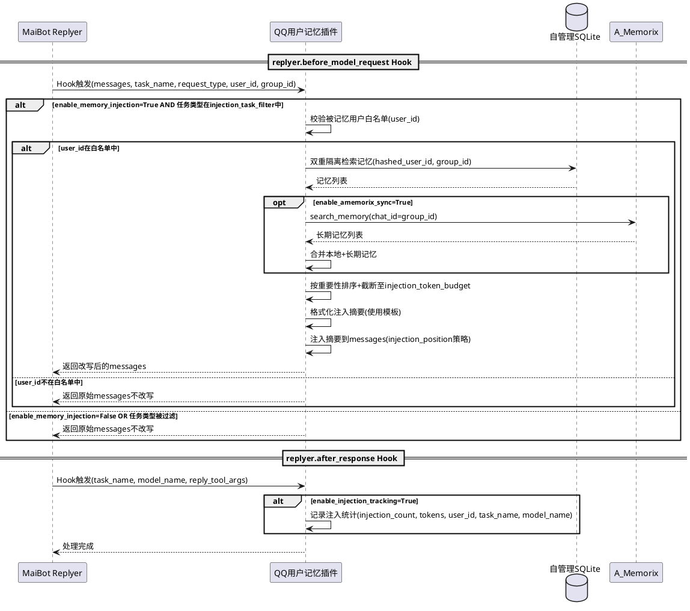

### **5.17.3 异常场景**

1. **replyer Hook 上下文中无 user_id**
   - 触发条件：Hook 上下文中无法获取当前对话的 user_id
   - 系统行为：不注入记忆，返回原始 messages，记录警告日志
   - 用户感知：无感知（LLM 仍可正常回复，仅无记忆参考）

2. **记忆检索失败**
   - 触发条件：Hook 处理中 SQLite 查询异常
   - 系统行为：不注入记忆，返回原始 messages，记录错误日志
   - 用户感知：无感知（降级为无记忆注入）

3. **token 预算计算异常**
   - 触发条件：注入摘要的 token 估算逻辑异常
   - 系统行为：使用保守策略（仅注入前3条记忆），记录警告日志
   - 用户感知：无感知

4. **messages 为空或格式异常**
   - 触发条件：Hook 接收到的 messages 列表为空或格式不符合预期
   - 系统行为：不注入记忆，返回原始 messages，记录警告日志
   - 用户感知：无感知

5. **A_Memorix 检索超时**
   - 触发条件：注入时 A_Memorix search_memory 超时
   - 系统行为：仅使用本地记忆进行注入，记录警告日志
   - 用户感知：注入的记忆可能不完整

6. **Hook 处理超时**
   - 触发条件：Hook 处理总时间超过1秒
   - 系统行为：中断注入，返回已改写的 messages（可能截断），记录警告日志
   - 用户感知：注入记忆可能不完整，但不影响 LLM 回复

---

## **5.18 WebUI 全面升级**

> **[v7.0.0 新增]** 将当前内嵌 HTML 字符串的简陋 WebUI 升级为现代化的前端页面，提升用户体验和功能性。采用卡片式布局、响应式设计、暗色主题支持等现代化 UI 特性。

### **5.18.1 业务规则**

**REQ-120**：**现代化卡片式布局**：The WebUI 记忆管理页面 shall 采用卡片式布局替代原有的表格为主布局，用户记忆按用户分组展示为卡片，每个卡片包含用户标识、记忆数量统计、记忆列表
- 验收条件：[WebUI 加载] → [页面以卡片式布局展示，每个被记忆用户一个卡片，卡片内含记忆列表]
- 验收条件：[响应式布局] → [桌面端多列展示，移动端单列展示，无横向滚动条]
- 优先级：P1
- 状态：**新增**

**REQ-121**：**群聊记忆筛选增强**：Where WebUI记忆管理页面已加载，the 群聊筛选 shall 支持树形/标签式筛选，直观展示群聊分布和记忆数量
- 验收条件：[筛选区域展示群聊标签列表，每个标签显示群号和记忆数量] → [如"G1(15条)"、"G2(8条)"、"全局(23条)"]
- 验收条件：[点击群聊标签] → [记忆列表筛选为该群记忆，标签高亮]
- 验收条件：[支持多选群聊标签] → [记忆列表为所选群的并集]
- 优先级：P1
- 状态：**新增**

**REQ-122**：**记忆详情展示增强**：When 用户查看记忆条目详情，the 详情面板 shall 完整展示以下字段：content、category、importance、source、group_id、created_at、updated_at、tags、时间距离描述、向量状态
- 验收条件：[记忆条目详情面板] → [包含：内容、类别、重要性(1-5星标)、来源、群聊归属、创建时间、更新时间、标签列表、时间距离（如"3天前"）、向量状态（已嵌入/未嵌入）]
- 优先级：P1
- 状态：**新增**

**REQ-123**：**操作反馈增强**：When 用户在 WebUI 执行操作（删除、批量操作、合并等），the 页面 shall 提供操作反馈
- 验收条件：[执行删除操作] → [显示 loading 状态（按钮禁用+旋转图标），操作完成后显示成功/失败提示]
- 验收条件：[批量操作影响超过10条记忆] → [弹出二次确认对话框，显示影响条数]
- 验收条件：[操作失败] → [显示错误提示信息（中文），提供重试按钮]
- 优先级：P1
- 状态：**新增**

**REQ-124**：**批量操作增强**：Where WebUI记忆管理页面已加载，the 用户 shall 可执行以下批量操作
- 验收条件：[按 category 批量删除] → [选择 category="temporary"，弹出确认后删除所有临时记忆]
- 验收条件：[按时间范围批量删除] → [选择"30天前"时间范围，弹出确认后删除30天前的记忆]
- 验收条件：[按 category 和时间范围组合批量删除] → [选择 category="temporary" + "30天前"，删除30天前的临时记忆]
- 验收条件：[按 importance 范围批量删除] → [选择 importance=1，弹出确认后删除重要性为1的记忆]
- 优先级：P1
- 状态：**新增**

**REQ-125**：**统计面板**：Where WebUI记忆管理页面已加载，the 页面 shall 展示统计面板，包含记忆趋势、分类分布、群聊分布
- 验收条件：[统计面板显示"分类分布"图表] → [饼图/环形图展示各 category 的记忆数量占比]
- 验收条件：[统计面板显示"群聊分布"图表] → [柱状图展示各群聊的记忆数量]
- 验收条件：[统计面板显示"记忆趋势"折线图] → [展示近30天每日新增记忆数量趋势]
- 验收条件：[统计面板数据实时更新] → [执行记忆操作后统计面板自动刷新]
- 优先级：P1
- 状态：**新增**

**REQ-126**：**暗色主题支持**：The WebUI 记忆管理页面 shall 支持亮色和暗色两种主题，通过 CSS 变量实现，支持用户切换和跟随系统偏好
- 验收条件：[页面右上角有主题切换按钮] → [点击切换亮色/暗色主题]
- 验收条件：[系统偏好为暗色模式] → [页面默认使用暗色主题]
- 验收条件：[用户手动切换主题后刷新页面] → [保持用户选择的主题（localStorage 持久化）]
- 验收条件：[暗色主题下所有文字可读、对比度满足 WCAG AA 标准] → [无明显可读性问题]
- 优先级：P1
- 状态：**新增**

**REQ-127**：**WebUI 前端资源独立部署**：The WebUI 记忆管理页面的前端资源（HTML/CSS/JS）shall 作为插件静态资源独立维护，通过 MaiBot WebUI 插件路由机制提供，不再使用内嵌 HTML 字符串
- 验收条件：[插件目录下有 webui/ 静态资源目录] → [包含 index.html、CSS、JS 文件]
- 验收条件：[通过插件路由访问记忆管理页面] → [MaiBot WebUI 框架正确提供静态资源服务]
- 优先级：P1
- 状态：**新增**

### **5.18.2 交互流程**

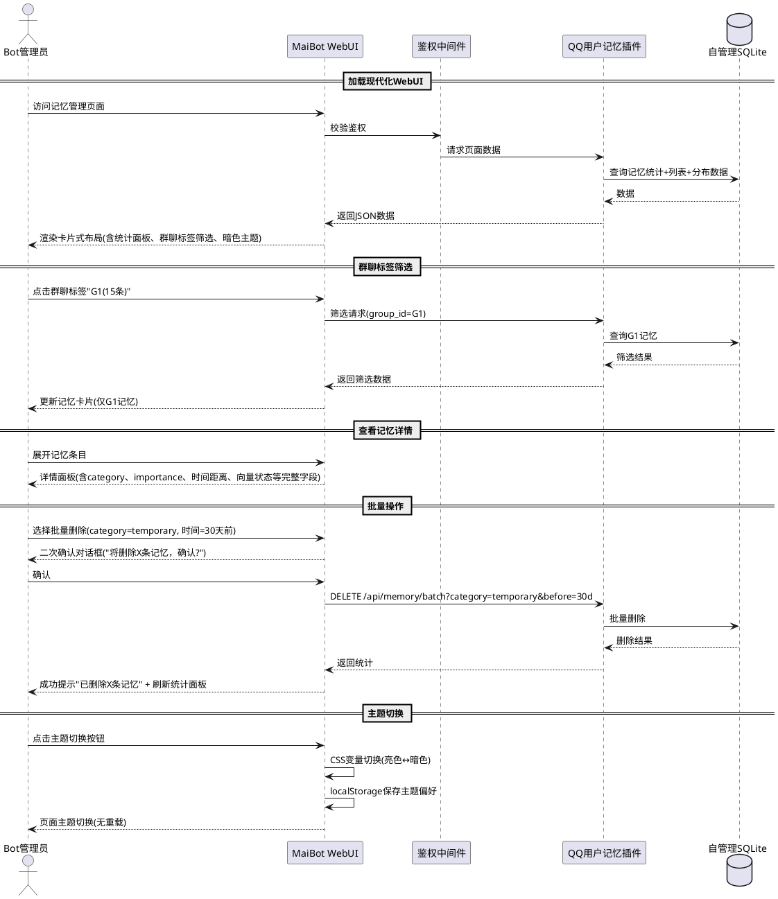

### **5.18.3 异常场景**

1. **统计数据聚合失败**
   - 触发条件：数据库查询统计面板数据异常
   - 系统行为：统计面板显示"统计暂不可用"，记忆列表仍正常展示
   - 用户感知：统计面板不可用，但记忆管理功能正常

2. **前端静态资源加载失败**
   - 触发条件：webui/ 目录下资源缺失或路径错误
   - 系统行为：显示降级提示页面"记忆管理页面加载失败，请检查插件资源"
   - 用户感知：无法使用 WebUI 管理页面

3. **暗色主题 CSS 变量缺失**
   - 触发条件：CSS 变量未定义或文件损坏
   - 系统行为：回退为亮色主题，记录警告日志
   - 用户感知：页面以亮色主题显示

4. **批量操作执行中断**
   - 触发条件：批量删除过程中数据库异常
   - 系统行为：事务回滚，显示错误提示"操作失败，请重试"
   - 用户感知：记忆数据不变

5. **图表渲染失败**
   - 触发条件：统计面板的图表库加载失败或数据格式异常
   - 系统行为：图表区域显示"图表暂不可用"，文字统计仍显示
   - 用户感知：图表不可见，但数字统计可读

---

## **5.19 消息上下文深度结合**

> **[v7.0.0 新增]** 利用 MaiBot 1.0.0-rc.2 提供的更完整的消息上下文信息，改进记忆的自动提取触发判断和检索上下文构建。rc.2 中 Action/Command/Tool 可获得更完整的触发消息信息（含 group_id、platform 等）。

### **5.19.1 业务规则**

**REQ-130**：**Tool/Command 消息上下文完整性利用**：When @Tool 或 @Command 方法被调用，the 插件 shall 从 kwargs/message 中获取完整的消息上下文信息（含 user_id、group_id、platform、message_id 等），用于记忆操作和日志记录
- 验收条件：[@Tool 调用 retrieve_user_memory，kwargs 中包含 platform="qq"] → [日志记录含 platform 信息，记忆操作不受 platform 影响]
- 验收条件：[@Command 调用 /记忆添加，message 中包含 group_id 和 platform] → [记忆条目正确记录 group_id，日志含 platform]
- 优先级：P1
- 状态：**新增**

**REQ-131**：**增强的自动提取触发判断**：When 自动记忆钩子触发，the 插件 shall 利用更完整的消息上下文信息改进自动记忆的触发判断
- 验收条件：[消息包含 platform 信息，platform="qq"] → [正常执行自动记忆逻辑]
- 验收条件：[消息包含更完整的 sender 信息（含 role/title）] → [发送者前缀策略可利用更丰富的身份信息（如角色头衔）]
- 优先级：P2
- 状态：**新增**

**REQ-132**：**智能提取 JSON 解析稳健性改进**：When 智能提取 LLM 返回结果，the 插件 shall 参照 MaiBot 1.0.0-rc.2 中期记忆摘要的解析改进，增强对非标准 JSON 的解析容错能力
- 验收条件：[LLM 返回包含多余逗号的 JSON，如 `{"content": "test",}`] → [解析成功，去除多余逗号后正常使用]
- 验收条件：[LLM 返回包含单引号的 JSON，如 `{'content': 'test'}`] → [解析成功，替换单引号后正常使用]
- 验收条件：[LLM 返回 JSON 前后有非 JSON 文本，如 "结果如下：\n{"content": "test"}\n以上是结果"] → [提取花括号内 JSON 部分解析成功]
- 优先级：P1
- 状态：**新增**

**REQ-133**：**replyer Hook 上下文信息利用**：When replyer.before_model_request Hook 触发，the 插件 shall 利用 Hook 上下文中的任务名（task_name）和请求类型（request_type）优化记忆注入策略
- 验收条件：[task_name="chat"，request_type="normal"] → [正常注入记忆摘要]
- 验收条件：[task_name="summarize"] → [根据 injection_task_filter 决定是否注入，若不在过滤列表中则跳过]
- 验收条件：[request_type 含 retry 指示] → [重试场景下仍注入记忆（保证 LLM 在重试时也有记忆参考）]
- 优先级：P1
- 状态：**新增**

### **5.19.2 交互流程**

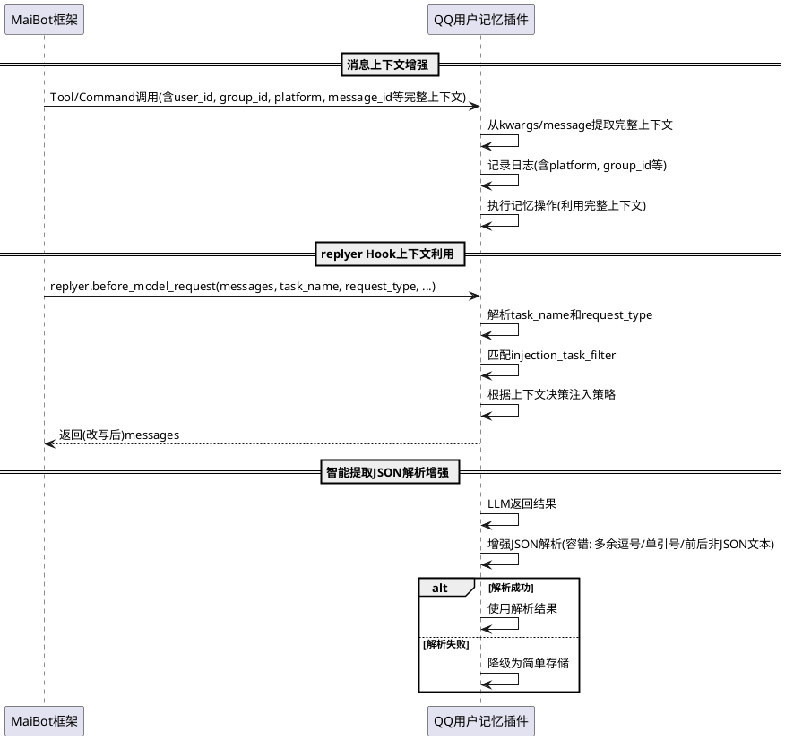

### **5.19.3 异常场景**

1. **消息上下文中缺少 platform 字段**
   - 触发条件：rc.2 以下版本的框架不提供 platform 字段
   - 系统行为：platform 默认为空字符串，不影响记忆操作
   - 用户感知：无感知

2. **replyer Hook 上下文中缺少 task_name**
   - 触发条件：Hook 上下文中无 task_name 字段（框架版本差异）
   - 系统行为：task_name 默认为"unknown"，不跳过注入（保守策略）
   - 用户感知：无感知

3. **增强 JSON 解析后仍失败**
   - 触发条件：LLM 返回结果完全无法解析为 JSON（如纯自然语言）
   - 系统行为：降级为简单存储原始内容，记录日志 llm_result_type="unparseable_after_enhanced_parse"
   - 用户感知：记忆以简单存储方式写入

---

# **6. 数据约束**

## **6.1 记忆条目（memory_entry）**

1. **entry_id**：唯一标识，UUID v4格式，主键
2. **hashed_user_id**：SHA-256截断哈希值，32个十六进制字符，非空，索引字段
3. **content**：记忆内容文本，非空，最大长度1000字符
4. **category**：记忆类别，枚举值：preference/habit/fact/relationship/temporary/period/general，默认general
5. **importance**：重要性等级，整数1-5，默认3
6. **expiry_at**：过期时间戳，可为null（永不过期），整数秒级时间戳
7. **created_at**：创建时间戳，非空，整数秒级时间戳
8. **updated_at**：更新时间戳，非空，整数秒级时间戳
9. **tags**：标签列表，JSON数组字符串，如["编程","Python"]，可为空数组
10. **source**：来源标记，枚举值：auto/manual/bot_reply/merge/amemorix_sync，默认auto
11. **embedding_vector**：嵌入向量，BLOB类型存储numpy float32数组，可为null（未计算向量）
12. **vector_updated_at**：向量计算时间戳，可为null，整数秒级时间戳
13. **group_id**：群聊归属ID，QQ群号字符串，私聊产生则为空字符串，可为空字符串
14. **time_decay_weight**：时间衰减权重，浮点数0.0-1.0，默认1.0

## **6.2 白名单配置（access_config）**

1. **memorized_user_ids**：被记忆用户白名单，QQ号字符串列表，默认空列表
2. **operator_user_ids**：操作者白名单，QQ号字符串列表，默认空列表（admin自动纳入）
3. **admin_user_id**：管理员QQ号，从MaiBot全局配置读取，自动纳入操作者白名单

## **6.3 A_Memorix协同配置（amemorix_config）**

1. **enable_amemorix_sync**：A_Memorix协同开关，布尔值，默认False
2. **amemorix_sync_importance_threshold**：同步重要性阈值，整数1-5，默认4
3. **amemorix_search_timeout**：检索超时时间，整数秒，默认5
4. **amemorix_ingest_retry_count**：写入失败重试次数，整数，默认3

## **6.4 群聊配置（group_chat_config）**

1. **enable_group_isolation**：群维度隔离开关，布尔值，默认True
2. **group_memory_weight_factor**：群聊上下文记忆权重因子，浮点数0.0-2.0，默认1.2
3. **auto_memory_skip_command**：自动记忆跳过指令类消息开关，布尔值，默认True

## **6.5 WebUI配置（webui_config）**

1. **enable_bot_reply_memory**：机器人回复记忆开关，布尔值，默认False
2. **webui_require_auth**：WebUI鉴权必须开关，布尔值，默认True
3. **webui_filter_by_whitelist**：WebUI白名单过滤开关，布尔值，默认True

## **6.6 插件清单配置（manifest_config）**

1. **capabilities**：插件能力声明列表，必须包含 "api.call"，字符串列表
2. **manifest_version**：清单版本，整数，值=2
3. **min_sdk_version**：最小SDK版本，字符串，值="2.5.2"
4. **max_sdk_version**：最大SDK版本，字符串，值="2.99.99"

## **6.7 智能提取配置（smart_extract_config）**

1. **enable_smart_extract**：智能提取开关，布尔值，默认True
2. **smart_extract_max_retry**：智能提取最大重试次数，整数，默认3
3. **bare_key_detect_enabled**：裸 key 名模式检测开关，布尔值，默认True
4. **llm_result_type_log_level**：LLM 返回结果类型日志级别，枚举值：debug/info/warning，默认"debug"

## **6.8 群聊记忆发送者前缀配置（sender_prefix_config）**

1. **enable_group_sender_prefix**：群聊记忆发送者前缀开关，布尔值，默认True
2. **sender_prefix_format**：发送者前缀格式模板，字符串，默认"{nickname}说："
3. **sender_prefix_fallback**：昵称获取失败时的回退值来源，枚举值：user_id/empty，默认"user_id"

## **6.9 跨用户检索配置（cross_user_retrieve_config）**

1. **enable_target_user_retrieve**：跨用户记忆检索开关，布尔值，默认True
2. **nickname_mapping_source**：昵称映射来源，枚举值：group_member_list/message_history/both，默认"both"
3. **nickname_mapping_cache_ttl**：昵称映射缓存有效期，整数秒，默认300

## **6.10 配置健康检查配置（config_health_config）**

1. **enable_config_health_check**：配置健康检查开关，布尔值，默认True
2. **temperature_warning_threshold**：temperature 警告阈值，浮点数，默认1.0

## **6.11 记忆注入配置（memory_injection_config）**

1. **enable_memory_injection**：记忆注入开关，布尔值，默认True（启用 replyer.before_model_request Hook 注入记忆到 messages）
2. **injection_token_budget**：注入 token 预算上限，整数，默认500（注入记忆摘要的最大 token 数量）
3. **injection_position**：注入位置策略，枚举值：system_append/standalone_user，默认"system_append"（追加到 system message 末尾）
4. **injection_task_filter**：注入任务类型过滤，字符串列表，默认["chat", "reply"]（仅在这些任务类型时注入记忆，空列表表示所有类型均注入）
5. **injection_summary_template**：注入摘要模板，字符串，默认"[用户记忆摘要]\n{memory_list}"（支持占位符：{memory_list} 格式化后的记忆列表）
6. **enable_injection_tracking**：注入统计追踪开关，布尔值，默认True（启用 replyer.after_response Hook 记录注入统计）
7. **injection_max_memories**：单次注入最大记忆条数，整数，默认10（即使 token 预算未耗尽，也不超过此条数限制）

## **6.12 WebUI 升级配置（webui_upgrade_config）**

1. **webui_theme**：WebUI 主题，枚举值：light/dark/auto，默认"auto"（auto 跟随系统偏好）
2. **webui_cards_per_row**：卡片每行数量（桌面端），整数1-4，默认2
3. **webui_stats_enabled**：统计面板开关，布尔值，默认True
4. **webui_chart_type**：统计图表类型，枚举值：simple/interactive，默认"simple"（simple 为纯 CSS/SVG 图表，interactive 为交互式图表库）

---
