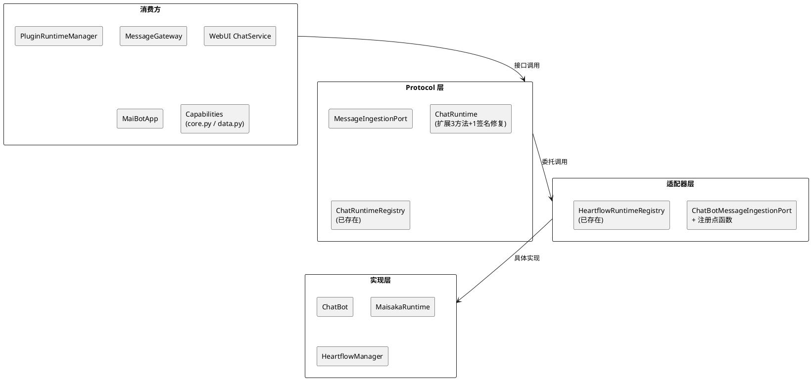
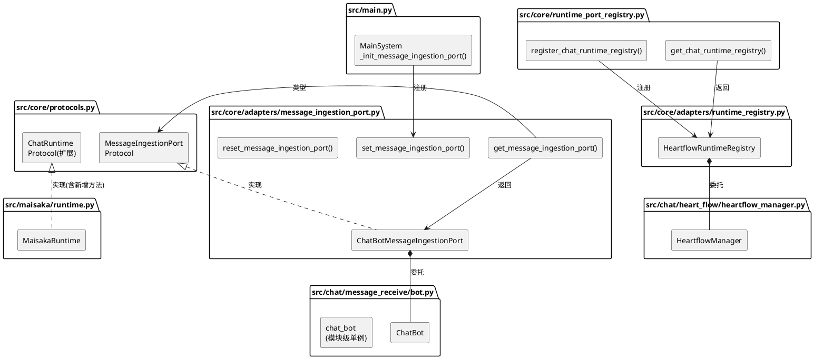
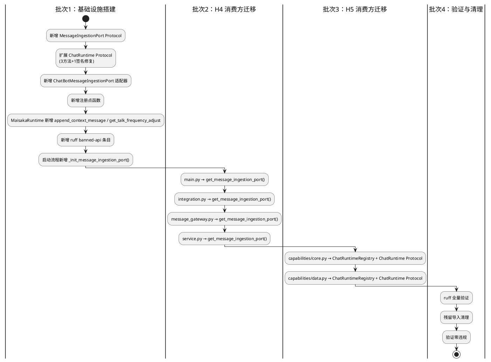
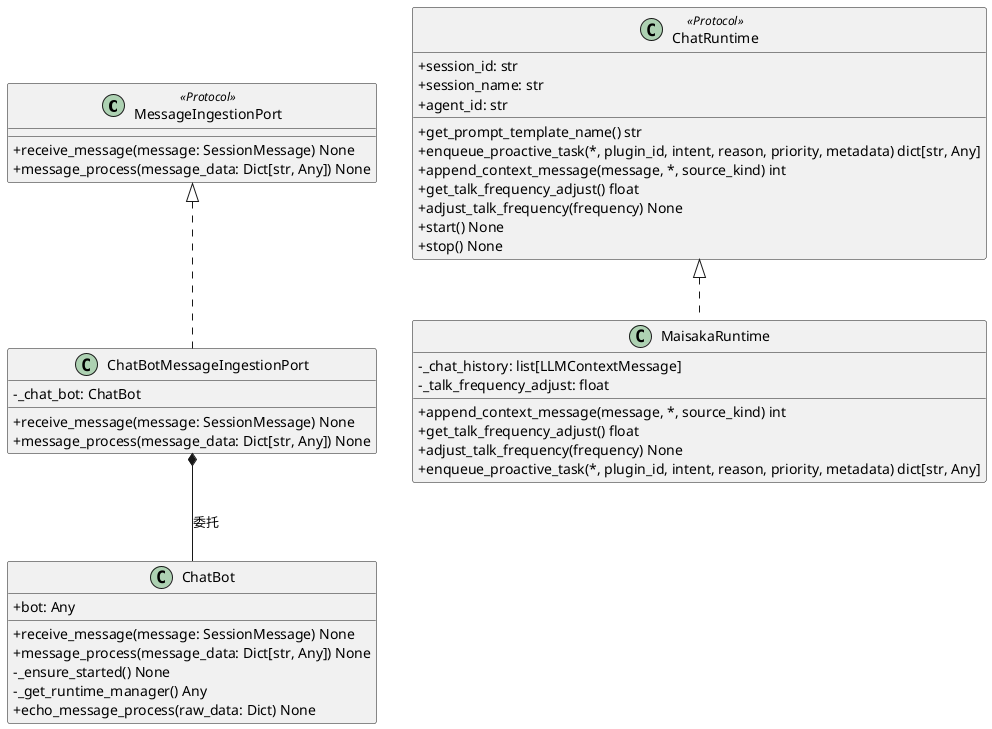

# 一、需求与存量功能关系分析

## 1.1 需求功能与存量功能对比

### 1.1.1 已实现功能

| 需求功能 | 存量功能 | 代码位置 | 匹配度 |
|---------|---------|---------|--------|
| ChatRuntime Protocol 定义 | `ChatRuntime` Protocol 已定义 `session_id`/`session_name`/`agent_id`/`enqueue_proactive_task`/`start`/`stop` | `src/core/protocols.py:112-166` | 75% |
| ChatRuntimeRegistry Protocol 定义 | `ChatRuntimeRegistry` Protocol 已定义 `get_runtime`/`get_or_create_runtime`/`list_runtimes` | `src/core/protocols.py:168-201` | 100% |
| ChatRuntimeRegistry 注册点 | `register_chat_runtime_registry()`/`get_chat_runtime_registry()` 已实现 | `src/core/runtime_port_registry.py:24-36` | 100% |
| HeartflowRuntimeRegistry 适配器 | 已实现 `get_runtime`/`get_or_create_runtime`/`list_runtimes` | `src/core/adapters/runtime_registry.py:13-33` | 100% |
| ChatRuntimeFactory 注册点 | `register_chat_runtime_factory()`/`get_chat_runtime_factory()` 已实现 | `src/core/runtime_port_registry.py:42-57` | 100% |
| 注册点模式（参考） | `get_memory_service_port()`/`set_memory_service_port()`/`reset_memory_service_port()` | `src/core/adapters/memory_service.py` | 100% |
| 适配器纯委托模式（参考） | `LLMServiceAdapter` 包裹 `LLMServiceClient` | `src/core/adapters/llm_service_port.py:46-118` | 100% |
| ruff TID251 守卫（参考） | `pyproject.toml` banned-api 列表 | `pyproject.toml:88-104` | 100% |
| MaisakaRuntime.adjust_talk_frequency | 已实现 `adjust_talk_frequency(frequency: float) -> None` | `src/maisaka/runtime.py:541-544` | 100% |
| MaisakaRuntime.enqueue_proactive_task | 已实现含 `priority` 参数 | `src/maisaka/runtime.py:648-656` | 100% |
| HeartflowManager.adjust_talk_frequency | 已实现委托到 `chat.adjust_talk_frequency()` | `src/chat/heart_flow/heartflow_manager.py:100-108` | 100% |
| ChatBot.receive_message | 已实现 `async def receive_message(self, message: SessionMessage) -> None` | `src/chat/message_receive/bot.py:480` | 100% |
| ChatBot.message_process | 已实现 `async def message_process(self, message_data: Dict[str, Any]) -> None` | `src/chat/message_receive/bot.py:452` | 100% |
| 启动流程注册模式（参考） | `MainSystem._init_runtime_port()` 在 `CORE_SERVICES` 阶段注册 | `src/main.py:322-332` | 100% |

### 1.1.2 需要扩展的功能

| 需求功能 | 存量功能 | 差异说明 | 扩展方向 |
|---------|---------|---------|---------|
| `MessageIngestionPort` Protocol 定义 | 无对应 Protocol | 核心层无消息入站接口契约，4 处消费方直接导入 `chat_bot` 全局单例 | 在 `src/core/protocols.py` 新增 `MessageIngestionPort` Protocol，定义 2 个方法签名 |
| `MessageIngestionPort` 适配器 | 无对应适配器 | 适配器层无消息入站适配器，消费方直接导入 `chat_bot` 实例 | 在 `src/core/adapters/` 新增 `message_ingestion_port.py`，纯委托包裹 `ChatBot` |
| 注册点函数 | 无对应注册点 | 消息入站服务无全局注册点，消费方直接导入 `chat_bot` | 在适配器文件中新增 `get_message_ingestion_port()`/`set_message_ingestion_port()`/`reset_message_ingestion_port()` |
| 启动流程注册 | 无对应启动步骤 | `MainSystem._init_components()` 未注册消息入站端口 | 在 `CORE_SERVICES` 阶段新增 `_init_message_ingestion_port()` 启动步骤 |
| `ChatRuntime.append_context_message` | `MaisakaRuntime._chat_history.append()` | 当前插件通过 `runtime._chat_history.append(context_message)` 直接访问私有列表，缺少公共 Protocol 方法 | 在 `ChatRuntime` Protocol 新增 `append_context_message(message, *, source_kind) -> int` 方法，`MaisakaRuntime` 实现委托到 `_chat_history.append()` |
| `ChatRuntime.get_talk_frequency_adjust` | `MaisakaRuntime._talk_frequency_adjust` 属性 | 当前插件通过 `runtime._talk_frequency_adjust` 直接读取私有属性，缺少公共 Protocol 方法 | 在 `ChatRuntime` Protocol 新增 `get_talk_frequency_adjust() -> float` 方法，`MaisakaRuntime` 实现返回 `_talk_frequency_adjust` |
| `ChatRuntime.adjust_talk_frequency` | `MaisakaRuntime.adjust_talk_frequency()` | `MaisakaRuntime` 已有 `adjust_talk_frequency()` 方法，但 `ChatRuntime` Protocol 未声明此方法 | 在 `ChatRuntime` Protocol 新增 `adjust_talk_frequency(frequency: float) -> None` 方法声明 |
| `ChatRuntime.enqueue_proactive_task` 签名修复 | Protocol 签名缺少 `priority` 参数 | Protocol 定义为 `reason: str = ""`，实际 `MaisakaRuntime` 实现有 `priority: str = ""` 参数；且 Protocol 返回 `Optional[dict]`，实际返回 `dict` | 在 `ChatRuntime` Protocol 的 `enqueue_proactive_task` 签名中新增 `priority: str = ""` 参数，返回类型改为 `dict[str, Any]` |
| ruff banned-api 规则 | 无 `chat_bot` 的 banned 条目 | `pyproject.toml` 的 banned-api 列表中无 `src.chat.message_receive.bot.chat_bot` | 新增 banned-api 条目，阻止消费方直接导入 |
| `main.py` 消费方迁移 | `from src.chat.message_receive.bot import chat_bot` | `main.py:L66` 直接导入 `chat_bot`，用于注册 `chat_bot.message_process` 作为消息处理器回调 | 改为通过 `get_message_ingestion_port()` 获取端口，但 `message_process` 回调引用需特殊处理 |
| `integration.py` 消费方迁移 | `from src.chat.message_receive.bot import chat_bot` | `integration.py:L140` 直接导入 `chat_bot`，调用 `chat_bot.receive_message()` | 改为 `get_message_ingestion_port().receive_message()` |
| `message_gateway.py` 消费方迁移 | `from src.chat.message_receive.bot import chat_bot` | `message_gateway.py:L68` 直接导入 `chat_bot`，调用 `chat_bot.receive_message()` | 改为 `get_message_ingestion_port().receive_message()` |
| `service.py` 消费方迁移 | `from src.chat.message_receive.bot import chat_bot` | `service.py:L13` 模块级导入 `chat_bot`，L1255 调用 `chat_bot.message_process()` | 改为 `get_message_ingestion_port().message_process()` |
| `capabilities/core.py` 消费方迁移 | `from src.chat.heart_flow.heartflow_manager import heartflow_manager` | 2 处导入 `heartflow_manager`，直接调用 `get_or_create_heartflow_chat()` 和 `runtime._chat_history.append()` | 改为通过 `ChatRuntimeRegistry` 获取运行时，再通过 `ChatRuntime` Protocol 方法调用 |
| `capabilities/data.py` 消费方迁移 | `from src.chat.heart_flow.heartflow_manager import heartflow_manager` | 2 处导入 `heartflow_manager`，直接访问 `heartflow_chat_list` 和 `_talk_frequency_adjust`，以及调用 `heartflow_manager.adjust_talk_frequency()` | 改为通过 `ChatRuntimeRegistry` 获取运行时，再通过 `ChatRuntime` Protocol 方法调用 |

### 1.1.3 需要新增的功能或接口

**Protocol 接口层**（`src/core/protocols.py`）：

1. **`MessageIngestionPort` Protocol**：2 个方法
   - `receive_message(session_message: SessionMessage) -> None`：接收并处理入站消息
   - `message_process(envelope: Any) -> None`：处理 Platform IO 入站封装
   - 依赖关系：依赖 `src/core/types.py` 中的 `SessionMessage`

2. **`ChatRuntime` Protocol 扩展**：3 个新方法
   - `append_context_message(message: Any, *, source_kind: str = "plugin") -> int`：向聊天历史追加上下文消息
   - `get_talk_frequency_adjust() -> float`：获取当前回复频率倍率
   - `adjust_talk_frequency(frequency: float) -> None`：调整当前回复频率倍率
   - 1 个签名修复：`enqueue_proactive_task` 新增 `priority: str = ""` 参数，返回类型改为 `dict[str, Any]`

**适配器层**（`src/core/adapters/message_ingestion_port.py`）：

1. **`ChatBotMessageIngestionPort`**：纯委托适配器，包裹 `ChatBot`
   - 构造函数接受 `chat_bot: ChatBot` 参数
   - 2 个方法一一委托到 `ChatBot` 对应方法
   - **设计决策**：`ChatBot` 类本身已满足 `MessageIngestionPort` Protocol 的鸭子类型要求（`receive_message` 和 `message_process` 签名兼容），适配器可选择直接注册 `chat_bot` 实例而非薄包装。但为保持与项目其他适配器模式一致（适配器层是唯一允许导入具体类的地方），仍创建显式适配器。

2. **注册点函数**：`get_message_ingestion_port()`/`set_message_ingestion_port()`/`reset_message_ingestion_port()`

**MaisakaRuntime 扩展**（`src/maisaka/runtime.py`）：

1. **`append_context_message` 方法实现**：委托到 `_chat_history.append()`，返回追加后的索引位置
2. **`get_talk_frequency_adjust` 方法实现**：返回 `_talk_frequency_adjust` 属性值

**启动流程**（`src/main.py`）：

1. **`_init_message_ingestion_port()`**：在 `CORE_SERVICES` 阶段注册 `ChatBotMessageIngestionPort`

**ruff 守卫**（`pyproject.toml`）：

1. **banned-api 条目**：`"src.chat.message_receive.bot.chat_bot"` → 禁止直接导入

## 1.2 存量功能详细分析

### 1.2.1 ChatBot 接口契约

**公共方法**（2 个，纳入 Protocol）：

| 方法 | 入参 | 出参 | 副作用 |
|------|------|------|--------|
| `receive_message` | `message: SessionMessage` | `None` | 触发 Hook 链、命令分发、消息注册、HeartFlow 消息入队 |
| `message_process` | `message_data: Dict[str, Any]` | `None` | 解析消息字典→`SessionMessage`→调用 `receive_message` |

**构造参数**：无（`ChatBot()` 无参构造）

**私有方法/属性**（不纳入 Protocol）：

- `_ensure_started()`：内部启动保障
- `_get_runtime_manager()`：获取插件运行时管理器
- `echo_message_process()`：回声处理器（仅内部使用）
- `bot`：bot 实例引用字段
- `_invoke_message_hook()`：Hook 触发
- `_process_commands()`：命令处理
- `handle_notice_message()`：通知处理

**业务规则**：

1. `message_process` 内部调用 `MessageBase.from_dict()` → `SessionMessage.from_maim_message()` → `self.receive_message()`，是 `receive_message` 的字典入口包装
2. `receive_message` 是核心处理链：Hook 前处理 → 命令分发 → Hook 后处理 → 消息注册 → HeartFlow 入队
3. `message_process` 内部捕获异常并记录日志，不向上传播
4. `receive_message` 内部同样捕获异常并记录日志

**约束**：

1. `ChatBot` 实例为模块级单例（`bot.py:L623`），全局唯一
2. `receive_message` 和 `message_process` 均为异步方法
3. `message_process` 的 `message_data` 参数为 `Dict[str, Any]`，与 Platform IO 出产的入站封装格式耦合

### 1.2.2 MaisakaRuntime 私有属性访问分析

**`_chat_history` 私有列表**：

- 定义位置：`src/maisaka/runtime.py:165`
- 类型：`list[LLMContextMessage]`
- 当前外部访问者：`plugin_runtime/capabilities/core.py:L207`（`runtime._chat_history.append(context_message)`）
- 内部访问者：12 处（`runtime.py` 内部自身使用）
- **关键约束**：`_chat_history` 是有序列表，append 操作是线程安全的（单线程事件循环），但直接访问绕过了 `MaisakaRuntime` 的封装

**`_talk_frequency_adjust` 私有属性**：

- 定义位置：`src/maisaka/runtime.py:188`
- 类型：`float`，初始值 `1.0`
- 当前外部访问者：`plugin_runtime/capabilities/data.py:L807`（读取 `heartflow_chat._talk_frequency_adjust`）
- 内部访问者：3 处（`adjust_talk_frequency`、`_get_effective_reply_frequency`）
- **关键约束**：`adjust_talk_frequency()` 方法已存在且公开（`runtime.py:541`），但 `ChatRuntime` Protocol 未声明此方法

### 1.2.3 消费方导入模式分析

**4 处 `chat_bot` 直接导入**：

| 消费方 | 导入方式 | 调用方式 | 迁移策略 |
|--------|---------|---------|---------|
| `main.py:L66` | 函数内延迟导入 | `chat_bot.message_process` 作为回调引用注册到消息服务器 | 注册点 `get_message_ingestion_port()`，但需保留 `message_process` 方法引用能力 |
| `integration.py:L140` | 函数内延迟导入 | `chat_bot.receive_message(session_message)` | 注册点 `get_message_ingestion_port().receive_message()` |
| `message_gateway.py:L68` | 函数内延迟导入 | `chat_bot.receive_message(session_message)` | 注册点 `get_message_ingestion_port().receive_message()` |
| `service.py:L13` | 模块级导入 | `chat_bot.message_process(message_data)` | 注册点 `get_message_ingestion_port().message_process()` |

**4 处 `heartflow_manager` 直接导入**（均在 `plugin_runtime/` 内）：

| 消费方 | 导入方式 | 调用方式 | 迁移策略 |
|--------|---------|---------|---------|
| `capabilities/core.py:L186` | 函数内延迟导入 | `heartflow_manager.get_or_create_heartflow_chat(stream_id)` → `runtime._chat_history.append()` | 通过 `ChatRuntimeRegistry.get_or_create_runtime()` + `ChatRuntime.append_context_message()` |
| `capabilities/core.py:L232` | 函数内延迟导入 | `heartflow_manager.get_or_create_heartflow_chat(stream_id)` → `runtime.enqueue_proactive_task()` | 通过 `ChatRuntimeRegistry.get_or_create_runtime()` + `ChatRuntime.enqueue_proactive_task()` |
| `capabilities/data.py:L804` | 静态方法内延迟导入 | `heartflow_manager.heartflow_chat_list.get(chat_id)._talk_frequency_adjust` | 通过 `ChatRuntimeRegistry.get_runtime()` + `ChatRuntime.get_talk_frequency_adjust()` |
| `capabilities/data.py:L824` | 函数内延迟导入 | `heartflow_manager.adjust_talk_frequency(chat_id, value)` | 通过 `ChatRuntimeRegistry.get_runtime()` + `ChatRuntime.adjust_talk_frequency()` |

### 1.2.4 现有注册点模式参考

项目中已有 4 套注册点模式，SSD-8 应与之一致：

| 注册点 | 文件位置 | 模式 |
|--------|---------|------|
| `get_memory_service_port()`/`set_memory_service_port()`/`reset_memory_service_port()` | `src/core/adapters/memory_service.py` | 模块级 `_provider` 变量 + 全局函数 |
| `get_agent_config_provider()`/`set_agent_config_provider()`/`reset_agent_config_provider()` | `src/core/adapters/agent_config_port.py` | 模块级 `_provider` 变量 + 全局函数 |
| `get_llm_service()`/`set_llm_service()`/`reset_llm_service()` | `src/core/adapters/llm_service_port.py` | 模块级 `_provider` 变量 + 全局函数 |
| `register_chat_runtime_registry()`/`get_chat_runtime_registry()` | `src/core/runtime_port_registry.py` | 模块级 `_registry` 变量 + 全局函数（无 reset） |

**选择理由**：`MessageIngestionPort` 使用与 `MemoryServicePort`/`LLMService` 一致的注册点模式（`get/set/reset` 三件套），原因：

1. 消费方分散在多个模块（main.py、integration.py、message_gateway.py、service.py），构造注入不现实
2. 注册点模式已在项目中验证过 4 次，团队熟悉
3. 启动流程中统一注册，保证时序可控

### 1.2.5 `enqueue_proactive_task` 签名差异

**Protocol 定义**（`src/core/protocols.py:134-159`）：

```python
async def enqueue_proactive_task(
    self,
    *,
    plugin_id: str,
    intent: str,
    reason: str = "",
    metadata: Optional[dict[str, Any]] = None,
) -> Optional[dict[str, Any]]:
```

**MaisakaRuntime 实现**（`src/maisaka/runtime.py:648-656`）：

```python
async def enqueue_proactive_task(
    self,
    *,
    plugin_id: str,
    intent: str,
    reason: str = "",
    priority: str = "",      # ← Protocol 缺少此参数
    metadata: Optional[dict[str, Any]] = None,
) -> dict[str, Any]:          # ← 返回类型不同（非 Optional）
```

**差异**：

1. Protocol 缺少 `priority: str = ""` 参数
2. Protocol 返回 `Optional[dict[str, Any]]`，实际实现返回 `dict[str, Any]`（永不返回 None）

**修复方向**：在 `ChatRuntime` Protocol 中补充 `priority` 参数，返回类型改为 `dict[str, Any]`。

### 1.2.6 `hook_catalog.py` 导入分析

`hook_catalog.py:L22` 导入 `register_chat_hook_specs`：

```python
from src.chat.message_receive.bot import register_chat_hook_specs
```

**分析**：

1. `register_chat_hook_specs` 是纯函数，不依赖 `chat_bot` 实例
2. 它仅注册 Hook 规格（`HookSpec` 对象），不触发任何业务逻辑
3. 当前 `hook_catalog.py` 已在 `per-file-ignores` 中豁免 TID251（`pyproject.toml:L113`）
4. 将此函数迁移到独立模块（如 `src/plugin_runtime/hook_specs/`）是合理的长期方向，但不在 SSD-8 范围内

**决策**：保留现有导入路径不变。`register_chat_hook_specs` 是函数级导入（非实例导入），架构上可接受。`hook_catalog.py` 已有 TID251 豁免。

# 二、增量设计方案

## 2.1 实现模型

### 2.1.1 上下文视图



**通信协议**：所有消费方通过 Protocol 接口异步调用适配器，适配器内部纯委托到具体实现类。

**调用频率**：
- `MessageIngestionPort`：高频——每条入站消息必经
- `ChatRuntime.append_context_message`：低频——插件按需注入
- `ChatRuntime.enqueue_proactive_task`：低频——插件按需触发
- `ChatRuntime.get_talk_frequency_adjust`/`adjust_talk_frequency`：极低频——插件按需调整

### 2.1.2 服务/组件总体架构



**模块划分**：

| 模块 | 职责 |
|------|------|
| `MessageIngestionPort` Protocol | 定义 2 个方法签名，消费方只依赖此接口 |
| `ChatBotMessageIngestionPort` | 纯委托适配器，包裹 `ChatBot` 实例 |
| 注册点函数 | 全局单例管理，与 `MemoryServicePort`/`LLMService` 模式一致 |
| `ChatRuntime` Protocol 扩展 | 新增 3 个方法 + 1 个签名修复，暴露插件运行时需要的公共能力 |
| 启动注册步骤 | 在 `CORE_SERVICES` 阶段创建适配器并注册 |

**核心类职责**：

- `ChatBotMessageIngestionPort`：2 个公共方法，每个方法直接委托到 `ChatBot` 对应方法，零额外逻辑
- `MaisakaRuntime`（扩展）：新增 `append_context_message()` 和 `get_talk_frequency_adjust()` 方法，分别委托到 `_chat_history.append()` 和返回 `_talk_frequency_adjust`

### 2.1.3 实现设计文档

#### 消息入站端口注册流程

```plantuml
@startuml
|启动流程|
start
:MainSystem._init_message_ingestion_port();

|适配器层|
:from src.chat.message_receive.bot import chat_bot;
adapter = ChatBotMessageIngestionPort(chat_bot);
set_message_ingestion_port(adapter);

|消费方|
port = get_message_ingestion_port();
await port.receive_message(session_message);

|ChatBot|
:处理消息...;

stop
@enduml
```

#### ChatRuntime 扩展方法调用流程

```plantuml
@startuml
|插件能力服务|
start
:registry = get_chat_runtime_registry();
runtime = await registry.get_or_create_runtime(stream_id);

:调用 append_context_message;
index = runtime.append_context_message(message, source_kind="plugin:xxx");

:调用 enqueue_proactive_task;
result = await runtime.enqueue_proactive_task(plugin_id=..., intent=..., priority=...);

:调用 get_talk_frequency_adjust;
value = runtime.get_talk_frequency_adjust();

:调用 adjust_talk_frequency;
runtime.adjust_talk_frequency(1.5);

stop
@enduml
```

#### 4 批次迁移流程



## 2.2 接口设计

### 2.2.1 总体设计

**接口分类**：按功能域分为 2 类

| 接口 | 分类 | 稳定性 | 说明 |
|------|------|--------|------|
| `MessageIngestionPort.receive_message` | 消息入站 | 稳定 | 接收 SessionMessage，核心处理链入口 |
| `MessageIngestionPort.message_process` | 消息入站 | 稳定 | 接收 Dict 消息封装，Platform IO 回调入口 |
| `ChatRuntime.append_context_message` | 运行时能力 | 稳定 | 向聊天历史注入上下文，替代 `_chat_history.append()` |
| `ChatRuntime.get_talk_frequency_adjust` | 运行时能力 | 稳定 | 读取回复频率倍率，替代 `_talk_frequency_adjust` 直接读取 |
| `ChatRuntime.adjust_talk_frequency` | 运行时能力 | 稳定 | 调整回复频率倍率，Protocol 声明已有实现的公开方法 |
| `ChatRuntime.enqueue_proactive_task` | 运行时能力 | 稳定 | 签名修复：新增 `priority` 参数，返回类型改为非 Optional |

**接口变更策略**：

1. `MessageIngestionPort` Protocol 一旦定义，方法签名不再变更
2. `ChatRuntime` Protocol 新增方法为纯增量扩展，不修改已有方法签名（`enqueue_proactive_task` 签名修复除外）
3. `enqueue_proactive_task` 签名修复为向后兼容变更（新增 `priority` 参数有默认值，返回类型收窄）

### 2.2.2 接口清单

#### `MessageIngestionPort` Protocol

**接口签名**：

```python
@runtime_checkable
class MessageIngestionPort(Protocol):
    async def receive_message(self, message: SessionMessage) -> None:
        """接收并处理入站消息。"""

    async def message_process(self, message_data: Dict[str, Any]) -> None:
        """处理 Platform IO 入站封装。"""
```

**业务说明**：`MessageIngestionPort` 是消费方向主链路投递消息的统一接口。消费方不再直接导入 `chat_bot` 全局单例，而是通过 `get_message_ingestion_port()` 获取全局实例后调用方法。

**前置条件**：

1. `set_message_ingestion_port()` 已在启动流程中调用
2. `ChatBot` 实例已创建并完成初始化

**后置条件**：

1. 消息被正确路由到主链路，与直接调用 `chat_bot.receive_message()` / `chat_bot.message_process()` 完全一致

**异常映射**：

| 场景 | 异常类型 | 来源 |
|------|---------|------|
| `MessageIngestionPort` 未注册 | `RuntimeError("MessageIngestionPort 未注册，请先调用 set_message_ingestion_port()")` | 注册点函数 |
| 消息格式错误 | 内部捕获并记录日志 | `ChatBot.message_process` |
| Hook 拦截 | 消息被跳过 | `ChatBot.receive_message` |

**调用示例**：

```python
# 旧模式
from src.chat.message_receive.bot import chat_bot
await chat_bot.receive_message(session_message)

# 新模式
from src.core.adapters.message_ingestion_port import get_message_ingestion_port
port = get_message_ingestion_port()
await port.receive_message(session_message)
```

**`message_process` 回调引用场景**：

```python
# 旧模式（main.py）
from src.chat.message_receive.bot import chat_bot
self.app.register_message_handler(chat_bot.message_process)

# 新模式
from src.core.adapters.message_ingestion_port import get_message_ingestion_port
port = get_message_ingestion_port()
self.app.register_message_handler(port.message_process)
```

#### `ChatRuntime` Protocol 扩展

**新增方法签名**：

```python
@runtime_checkable
class ChatRuntime(Protocol):
    # ... 已有方法省略 ...

    def append_context_message(self, message: Any, *, source_kind: str = "plugin") -> int:
        """向聊天历史追加上下文消息。

        Args:
            message: 上下文消息对象（SessionBackedMessage）
            source_kind: 消息来源标识（默认 "plugin"）

        Returns:
            追加后的索引位置
        """

    def get_talk_frequency_adjust(self) -> float:
        """获取当前回复频率倍率。"""

    def adjust_talk_frequency(self, frequency: float) -> None:
        """调整当前回复频率倍率。

        Args:
            frequency: 频率倍率值，必须 ≥ 0.0
        """
```

**签名修复**：

```python
# 修复前
async def enqueue_proactive_task(
    self,
    *,
    plugin_id: str,
    intent: str,
    reason: str = "",
    metadata: Optional[dict[str, Any]] = None,
) -> Optional[dict[str, Any]]:

# 修复后
async def enqueue_proactive_task(
    self,
    *,
    plugin_id: str,
    intent: str,
    reason: str = "",
    priority: str = "",           # 新增
    metadata: Optional[dict[str, Any]] = None,
) -> dict[str, Any]:              # 返回类型收窄
```

**业务说明**：

- `append_context_message`：替代 `runtime._chat_history.append()`，提供公共接口向聊天历史注入上下文消息。`MaisakaRuntime` 实现委托到 `_chat_history.append()` 并返回 `len(_chat_history) - 1`。
- `get_talk_frequency_adjust`：替代 `runtime._talk_frequency_adjust` 直接读取，提供公共接口查询回复频率倍率。
- `adjust_talk_frequency`：`MaisakaRuntime` 已有此方法实现（`runtime.py:541`），仅需在 Protocol 中声明。
- `enqueue_proactive_task` 签名修复：`priority` 参数有默认值 `""`，向后兼容；返回类型从 `Optional[dict]` 收窄为 `dict`，与实际实现一致。

**前置条件**：

1. `ChatRuntimeRegistry` 已注册（`register_chat_runtime_registry()` 已调用）
2. 对应会话的运行时实例已存在或可创建

**后置条件**：

1. `append_context_message`：消息被追加到 `_chat_history`，返回索引位置
2. `get_talk_frequency_adjust`：返回当前频率倍率值
3. `adjust_talk_frequency`：内部 `_talk_frequency_adjust` 被更新
4. `enqueue_proactive_task`：主动对话任务被追加，主循环被唤醒

**异常映射**：

| 场景 | 异常类型 | 来源 |
|------|---------|------|
| 运行时不存在 | `ChatRuntimeRegistry.get_runtime()` 返回 None | 能力层检查 |
| 频率值非法 | 静默截断为 0.0（`max(0.0, float(frequency))`） | `MaisakaRuntime.adjust_talk_frequency` |
| 上下文消息格式错误 | `TypeError` | `_chat_history.append()` |
| `intent` 为空 | `ValueError` | `MaisakaRuntime.enqueue_proactive_task` |

**调用示例**：

```python
# 旧模式（capabilities/core.py）
from src.chat.heart_flow.heartflow_manager import heartflow_manager
runtime = await heartflow_manager.get_or_create_heartflow_chat(stream_id)
runtime._chat_history.append(context_message)

# 新模式
from src.core.runtime_port_registry import get_chat_runtime_registry
registry = get_chat_runtime_registry()
runtime = await registry.get_or_create_runtime(stream_id)
index = runtime.append_context_message(context_message, source_kind=f"plugin:{plugin_id}")
```

```python
# 旧模式（capabilities/data.py）
from src.chat.heart_flow.heartflow_manager import heartflow_manager
heartflow_chat = heartflow_manager.heartflow_chat_list.get(chat_id)
value = heartflow_chat._talk_frequency_adjust

# 新模式
from src.core.runtime_port_registry import get_chat_runtime_registry
registry = get_chat_runtime_registry()
runtime = await registry.get_runtime(chat_id)
value = runtime.get_talk_frequency_adjust() if runtime else 1.0
```

#### 注册点函数

**接口签名**：

```python
def get_message_ingestion_port() -> MessageIngestionPort:
    """获取全局 MessageIngestionPort 实例。未注册时抛出 RuntimeError。"""

def set_message_ingestion_port(port: MessageIngestionPort) -> None:
    """注册全局 MessageIngestionPort 实例。重复注册时覆盖旧实例并记录 warning 日志。"""

def reset_message_ingestion_port() -> None:
    """重置全局实例（仅用于测试）。"""
```

**业务说明**：与 `MemoryServicePort`/`LLMService` 注册点模式完全一致。

**前置条件**：`set_message_ingestion_port()` 在启动流程 `CORE_SERVICES` 阶段调用。

**后置条件**：`get_message_ingestion_port()` 返回已注册的 `MessageIngestionPort` 实例。

**异常映射**：

| 场景 | 异常 |
|------|------|
| 未注册时调用 `get_message_ingestion_port()` | `RuntimeError("MessageIngestionPort 未注册，请先调用 set_message_ingestion_port()")` |

## 2.3 数据模型

### 2.3.1 设计目标

1. **支持的业务场景**：消息入站投递、上下文注入、主动对话触发、频率调整/查询
2. **性能目标**：适配器层零开销，调用响应时间与直接调用 `chat_bot`/`runtime` 一致
3. **兼容策略**：所有返回类型与现有实现完全一致，不修改 `SessionMessage`/`SessionBackedMessage` 等数据模型

### 2.3.2 模型实现



**对象创建策略**：

- `ChatBotMessageIngestionPort`：启动时由 `MainSystem._init_message_ingestion_port()` 创建并注册，全局单例
- `ChatBot`：模块级单例（`bot.py` 底部），由适配器包裹后通过注册点暴露
- `MaisakaRuntime`：由 `MaisakaRuntimeFactory` 按会话创建，通过 `ChatRuntimeRegistry` 暴露

**持久化策略**：

- `ChatBotMessageIngestionPort` 和 `ChatBot` 均为无状态服务对象，无需持久化
- `MaisakaRuntime` 的 `_chat_history` 由运行时自身管理，SSD-8 不改变其持久化策略

**关键设计决策**：

1. **`ChatBot` 鸭子类型 vs 显式适配器**：`ChatBot` 的 `receive_message` 和 `message_process` 方法签名与 `MessageIngestionPort` Protocol 兼容，理论上可直接注册 `chat_bot` 实例。但为保持与项目其他适配器模式一致（适配器层是唯一允许导入具体类的地方），仍创建 `ChatBotMessageIngestionPort` 显式适配器。这也为未来可能的拦截、日志、指标收集预留了扩展点。

2. **`append_context_message` 返回 int**：返回追加后的索引位置（`len(_chat_history) - 1`），与插件能力返回的 `index` 字段对齐，方便插件追踪注入位置。

3. **`enqueue_proactive_task` 签名修复向后兼容**：新增 `priority: str = ""` 参数有默认值，现有调用方无需修改。返回类型从 `Optional[dict]` 收窄为 `dict`，与 `MaisakaRuntime` 实际行为一致（永不返回 None）。

4. **`get_talk_frequency_adjust` vs 属性**：选择方法而非属性，因为 Protocol 的属性定义需要同时声明 getter/setter，增加复杂度。方法更简洁，且与 `adjust_talk_frequency` 对称。

5. **`ChatRuntimeRegistry.get_runtime()` 返回 Optional**：当运行时不存在时返回 None，消费方需自行处理。`get_or_create_runtime()` 在运行时不存在时自动创建，适用于需要确保运行时存在的场景（如上下文注入、主动对话触发）。