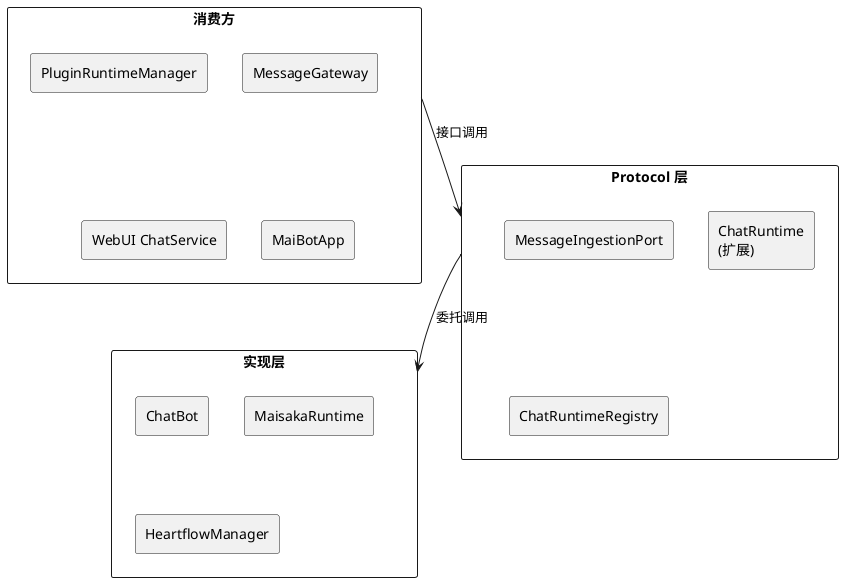
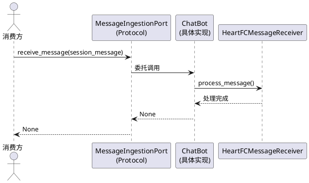
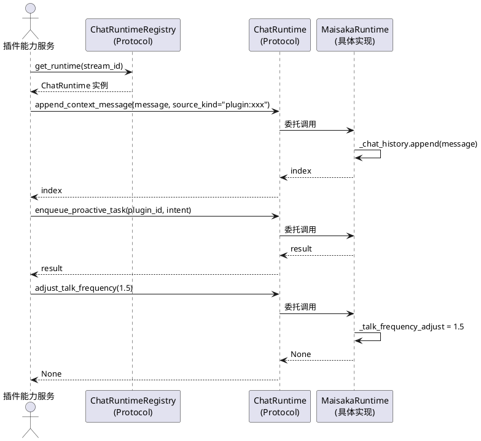
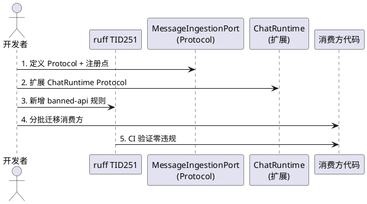

# SSD-8：插件上下文协议化

## 1. 组件定位

### 1.1 核心职责

本组件负责消除插件运行时（`plugin_runtime`）和 WebUI 对 `chat_bot` 全局单例、`heartflow_manager` 全局单例的直接导入，以及插件运行时对 Maisaka 运行时私有属性（`_chat_history`、`_talk_frequency_adjust`）的直接访问。通过扩展 `ChatRuntime` Protocol 和新增 `MessageIngestionPort` Protocol，使插件运行时和 WebUI 通过接口契约访问消息入口和运行时能力，不再依赖具体实现类和私有属性。

### 1.2 核心输入

1. **插件上下文注入请求**：插件通过 `maisaka.context.append` 能力向聊天流注入上下文消息
2. **插件主动对话请求**：插件通过 `maisaka.proactive.trigger` 能力触发智能体主动对话
3. **频率调整请求**：插件通过 `frequency.set_adjust`/`frequency.get_adjust` 能力读写回复频率
4. **入站消息转发**：插件运行时消息网关、WebUI 聊天服务将外部消息转发到主链路
5. **Hook 注册请求**：`hook_catalog` 导入 `register_chat_hook_specs` 注册聊天 Hook 规格

### 1.3 核心输出

1. **上下文注入结果**：`{success: bool, index: int, stream_id: str, visible_text: str, source_kind: str}` 或 `{success: bool, error: str}`
2. **主动对话结果**：`{success: bool, ...result}` 或 `{success: bool, error: str}`
3. **频率调整/查询结果**：`{success: bool, value: float}` 或 `{success: bool, error: str}`
4. **消息入站结果**：消息被正确路由到主链路处理

### 1.4 职责边界

本组件**不负责**：

1. **ChatBot 类内部重构**：不修改 `ChatBot` 的消息处理逻辑、Hook 触发逻辑或命令分发逻辑
2. **HeartflowManager 类内部重构**：不修改 `HeartflowManager` 的运行时生命周期管理逻辑
3. **MaisakaRuntime 类内部重构**：不修改 `MaisakaRuntime` 的核心对话循环、回复生成等逻辑
4. **插件 RPC 框架改造**：不修改插件运行时的 IPC/RPC 通信机制
5. **ChatRuntime 已有方法签名变更**：`session_id`/`session_name`/`agent_id`/`enqueue_proactive_task`/`start`/`stop` 签名不变

## 2. 领域术语

**MessageIngestionPort**
: 消息入站端口 Protocol，定义外部系统向主链路投递消息的契约。核心只依赖此接口，不依赖 `chat_bot` 全局单例。消费方通过 `receive_message(session_message)` 将消息投递到主链路。

**chat_bot 全局单例**
: `ChatBot` 类的模块级实例（`bot.py:L623`），当前被 `main.py`、`integration.py`、`message_gateway.py`、`service.py` 直接导入。SSD-8 后消费方不再直接导入此单例。

**heartflow_manager 全局单例**
: `HeartflowManager` 类的模块级实例（`heartflow_manager.py:L111`），当前被 `plugin_runtime/capabilities/core.py` 和 `data.py` 直接导入以访问运行时私有属性。SSD-8 后消费方通过 `ChatRuntimeRegistry` 获取运行时实例，再通过 `ChatRuntime` Protocol 访问能力。

**maisaka.context.append 能力**
: 插件向指定聊天流注入上下文消息的能力。当前实现直接访问 `runtime._chat_history` 私有列表 append 消息。SSD-8 后改为通过 `ChatRuntime.append_context_message()` Protocol 方法。

**maisaka.proactive.trigger 能力**
: 插件触发智能体主动对话的能力。当前实现直接导入 `heartflow_manager` 获取运行时实例后调用 `enqueue_proactive_task`。SSD-8 后改为通过 `ChatRuntimeRegistry` 获取运行时实例，再通过 `ChatRuntime.enqueue_proactive_task()` Protocol 方法。

**frequency.set_adjust / frequency.get_adjust 能力**
: 插件读写指定聊天流回复频率倍率的能力。当前实现直接访问 `heartflow_manager.heartflow_chat_list` 和 `runtime._talk_frequency_adjust` 私有属性。SSD-8 后改为通过 `ChatRuntime.adjust_talk_frequency()` / `ChatRuntime.get_talk_frequency_adjust()` Protocol 方法。

**register_chat_hook_specs**
: 聊天消息主链内置 Hook 规格注册器函数。当前从 `bot.py` 导入。SSD-8 后该函数从 `hook_catalog.py` 的导入路径不变（它是纯函数，不依赖 `chat_bot` 实例），但需确认其是否应独立到单独模块。

## 3. 角色与边界

### 3.1 核心角色

- **插件运行时（PluginRuntimeManager）**：通过 `MessageIngestionPort` 投递入站消息，通过 `ChatRuntime` Protocol 注入上下文/触发主动对话/调整频率
- **WebUI 聊天服务**：通过 `MessageIngestionPort` 投递用户消息
- **启动入口（MaiBotApp）**：通过 `MessageIngestionPort` 注册消息处理器

### 3.2 外部系统

- **ChatBot**：消息入口协调器，实现 `MessageIngestionPort` Protocol
- **HeartflowManager**：运行时生命周期管理器，通过 `ChatRuntimeRegistry` 暴露运行时实例
- **MaisakaRuntime**：对话运行时，实现 `ChatRuntime` Protocol（含新增方法）
- **HookSpecRegistry**：Hook 规格注册中心，与 `register_chat_hook_specs` 交互

### 3.3 交互上下文

## 4. DFX约束

### 4.1 性能

1. **消息投递延迟**：`MessageIngestionPort.receive_message()` 为零开销委托调用，延迟与直接调用 `chat_bot.receive_message()` 一致
2. **上下文注入延迟**：`ChatRuntime.append_context_message()` 为零开销委托调用，延迟与直接 `runtime._chat_history.append()` 一致
3. **运行时查找开销**：通过 `ChatRuntimeRegistry` 查找运行时实例与直接通过 `heartflow_manager.heartflow_chat_list.get()` 一致

### 4.2 可靠性

1. **调用失败处理**：Protocol 方法调用失败时异常向上传播，适配器层不捕获不兜底
2. **单例一致性**：`MessageIngestionPort` 全局只存在一个实例（通过注册点管理），避免多实例导致消息处理不一致
3. **降级策略**：如果 `MessageIngestionPort` 未注册，查询时必须立即报错（RuntimeError），不用空处理器兜底

### 4.3 安全性

1. **接口隔离**：`ChatRuntime` Protocol 新增方法只暴露插件运行时需要的公共能力，不暴露 `_chat_history`、`_talk_frequency_adjust` 等私有属性
2. **ruff 守卫**：新增 `src.chat.message_receive.bot.chat_bot` 到 banned-api 列表，CI 层面阻止新增违规导入
3. **私有属性保护**：新增 `src.chat.heart_flow.heartflow_manager.heartflow_manager` 到 banned-api 列表（仅限 plugin_runtime 外部消费方）

### 4.4 可维护性

1. **注册点模式**：`MessageIngestionPort` 使用 `get_message_ingestion_port()`/`set_message_ingestion_port()`/`reset_message_ingestion_port()` 注册点管理，与 `MemoryServicePort`/`LLMService` 模式一致
2. **日志规范**：适配器层使用 `core.adapters.message_ingestion` 命名空间的 logger
3. **迁移可追踪**：每批次迁移后通过 `rg "from src.chat.message_receive.bot import chat_bot" src/` 验证剩余引用数

### 4.5 兼容性

1. **方法签名对齐**：`MessageIngestionPort.receive_message()` 签名与 `ChatBot.receive_message()` 一致
2. **返回类型不变**：所有 Protocol 方法的返回类型与现有实现完全一致
3. **渐进式迁移**：适配器先包裹现有实现，不改变内部实现

## 5. 核心能力

### 5.1 消息入站端口（MessageIngestionPort）

#### 5.1.1 业务规则

1. **Protocol 定义规则**：`MessageIngestionPort` Protocol 必须定义以下方法，覆盖消费方实际使用的 `chat_bot` 公共方法：
   - `receive_message(session_message: SessionMessage) -> None`：接收并处理入站消息
   - `message_process(envelope: Any) -> None`：处理 Platform IO 入站封装（仅 `MaiBotApp` 使用）
   a. 验收条件：[消费方调用 `message_ingestion_port.receive_message(session_message)`] → [消息被正确路由到主链路，与直接调用 `chat_bot.receive_message(session_message)` 完全一致]
   b. 验收条件：[消费方调用 `message_ingestion_port.message_process(envelope)`] → [消息被正确处理，与直接调用 `chat_bot.message_process(envelope)` 完全一致]

2. **注册点规则**：必须提供全局注册点函数，与 `MemoryServicePort`/`LLMService` 模式一致：
   - `get_message_ingestion_port() -> MessageIngestionPort`：获取全局实例，未注册时抛出 RuntimeError
   - `set_message_ingestion_port(port: MessageIngestionPort) -> None`：注册全局实例
   - `reset_message_ingestion_port() -> None`：重置全局实例（仅用于测试）
   a. 验收条件：[未注册时调用 `get_message_ingestion_port()`] → [抛出 RuntimeError，提示"MessageIngestionPort 未注册"]
   b. 验收条件：[注册后调用 `get_message_ingestion_port()`] → [返回已注册的实例]

3. **适配器实现规则**：`ChatBotMessageIngestionPort` 直接委托 `ChatBot` 实例：
   - 构造函数接受 `chat_bot: ChatBot` 参数
   - 所有方法直接委托调用，不引入额外缓存、转换或延迟加载逻辑
   a. 验收条件：[适配器的 `receive_message()` 返回值] → [与直接调用 `chat_bot.receive_message()` 完全一致]

4. **ChatBot 直接实现规则**：`ChatBot` 类可直接实现 `MessageIngestionPort` Protocol（鸭子类型），无需显式继承。适配器层可选择薄包装或直接注册 `chat_bot` 实例。
   a. 验收条件：[审查 `ChatBot` 类] → [其 `receive_message` 和 `message_process` 方法签名与 `MessageIngestionPort` Protocol 兼容]

5. **禁止项**：`MessageIngestionPort` Protocol 禁止暴露以下内部实现细节：
   - `_ensure_started` 内部启动方法
   - `_get_runtime_manager` 插件运行时获取方法
   - `echo_message_process` 回声处理器（仅内部使用）
   - `bot` 实例引用字段
   a. 验收条件：[审查 Protocol 定义] → [不包含上述任何私有方法或内部字段]

#### 5.1.2 交互流程

#### 5.1.3 异常场景

1. **MessageIngestionPort 未注册**
   a. 触发条件：消费方调用 `get_message_ingestion_port()` 但尚未注册
   b. 系统行为：抛出 RuntimeError，消息为 "MessageIngestionPort 未注册，请先调用 set_message_ingestion_port()"
   c. 用户感知：启动失败，日志中显示明确的注册时序错误

2. **消息处理失败**
   a. 触发条件：消息格式错误、Hook 拦截等
   b. 系统行为：`ChatBot.receive_message()` 内部捕获并记录异常，不向上传播
   c. 用户感知：消息被跳过，日志中显示处理错误

### 5.2 ChatRuntime Protocol 扩展

#### 5.2.1 业务规则

1. **append_context_message 规则**：`ChatRuntime` Protocol 新增 `append_context_message` 方法，替代对 `runtime._chat_history` 私有列表的直接 append：
   - `append_context_message(message: Any, *, source_kind: str = "plugin") -> int`：向聊天历史追加上下文消息，返回追加后的索引位置
   - `message` 参数接受 `SessionBackedMessage` 对象（当前插件上下文注入使用的类型）
   - `source_kind` 参数标识消息来源（默认 "plugin"）
   a. 验收条件：[插件调用 `runtime.append_context_message(context_message, source_kind="plugin:xxx")`] → [消息被追加到聊天历史，返回索引位置，与直接 `runtime._chat_history.append(context_message)` 效果一致]
   b. 验收条件：[追加后 `runtime._chat_history` 的最后一个元素] → [与传入的 `message` 对象相同]

2. **get_talk_frequency_adjust 规则**：`ChatRuntime` Protocol 新增 `get_talk_frequency_adjust` 方法，替代对 `runtime._talk_frequency_adjust` 私有属性的直接读取：
   - `get_talk_frequency_adjust() -> float`：获取当前回复频率倍率
   a. 验收条件：[调用 `runtime.get_talk_frequency_adjust()`] → [返回值与直接读取 `runtime._talk_frequency_adjust` 一致]

3. **adjust_talk_frequency 规则**：`ChatRuntime` Protocol 已有 `enqueue_proactive_task` 方法，但缺少 `adjust_talk_frequency`。需新增：
   - `adjust_talk_frequency(frequency: float) -> None`：调整当前回复频率倍率
   - `frequency` 参数为倍率值，必须 ≥ 0.0
   a. 验收条件：[调用 `runtime.adjust_talk_frequency(1.5)`] → [内部 `_talk_frequency_adjust` 被设为 1.5，与直接设置 `runtime._talk_frequency_adjust = 1.5` 效果一致]

4. **ChatRuntimeRegistry 查找规则**：插件运行时通过 `ChatRuntimeRegistry` 获取运行时实例，不再直接导入 `heartflow_manager`：
   - `get_or_create_runtime(session_id: str) -> ChatRuntime`：获取或创建指定会话的运行时实例
   - 当前 `ChatRuntimeRegistry` Protocol 已定义 `get_runtime(session_id: str) -> Optional[ChatRuntime]`，需确认是否满足需求
   a. 验收条件：[插件调用 `registry.get_runtime(stream_id)`] → [返回对应的 `ChatRuntime` 实例，与通过 `heartflow_manager.get_or_create_heartflow_chat(stream_id)` 获取的实例相同]

5. **禁止项**：迁移后禁止以下行为：
   - 禁止在 `plugin_runtime/` 中导入 `heartflow_manager`
   - 禁止在 `plugin_runtime/` 中访问 `runtime._chat_history`
   - 禁止在 `plugin_runtime/` 中访问 `runtime._talk_frequency_adjust`
   a. 验收条件：[运行 `rg "heartflow_manager" src/plugin_runtime/`] → [零结果]
   b. 验收条件：[运行 `rg "_chat_history" src/plugin_runtime/`] → [零结果]
   c. 验收条件：[运行 `rg "_talk_frequency_adjust" src/plugin_runtime/`] → [零结果]

#### 5.2.2 交互流程

#### 5.2.3 异常场景

1. **运行时不存在**
   a. 触发条件：插件请求的 `stream_id` 对应的运行时不存在
   b. 系统行为：`ChatRuntimeRegistry.get_runtime()` 返回 None
   c. 用户感知：能力返回 `{success: False, error: "未找到已存在的聊天流: xxx"}`

2. **频率值非法**
   a. 触发条件：`adjust_talk_frequency` 传入负数
   b. 系统行为：`MaisakaRuntime.adjust_talk_frequency()` 内部 `max(0.0, float(frequency))` 截断为 0.0
   c. 用户感知：频率被设为 0.0（静默截断，与现有行为一致）

3. **上下文消息格式错误**
   a. 触发条件：`append_context_message` 传入的消息对象类型不正确
   b. 系统行为：`_chat_history.append()` 可能抛出 TypeError
   c. 用户感知：能力返回 `{success: False, error: "..."}`

### 5.3 消费方迁移

#### 5.3.1 业务规则

1. **H4 迁移规则（chat_bot 直接导入）**：5 处 `chat_bot` 直接导入必须替换为 `MessageIngestionPort` Protocol 调用：
   - `src/main.py:L66`：`from src.chat.message_receive.bot import chat_bot` → `get_message_ingestion_port()`
   - `src/plugin_runtime/integration.py:L140`：同上 → `get_message_ingestion_port()`
   - `src/plugin_runtime/host/message_gateway.py:L68`：同上 → `get_message_ingestion_port()`
   - `src/webui/routers/chat/service.py:L13`：同上 → `get_message_ingestion_port()`
   - `src/plugin_runtime/hook_catalog.py:L22`：`register_chat_hook_specs` 函数导入 → 确认是否需迁移（纯函数，不依赖实例）
   a. 验收条件：[运行 `rg "from src.chat.message_receive.bot import chat_bot" src/`] → [仅剩适配器层和启动入口的 TID251 豁免文件]

2. **H5 迁移规则（heartflow_manager 私有属性访问）**：4 处私有属性访问必须替换为 `ChatRuntime` Protocol 方法调用：
   - `plugin_runtime/capabilities/core.py:L186`：`from src.chat.heart_flow.heartflow_manager import heartflow_manager` → 通过 `ChatRuntimeRegistry` 获取运行时
   - `plugin_runtime/capabilities/core.py:L207`：`runtime._chat_history.append(context_message)` → `runtime.append_context_message(context_message, source_kind=source_kind)`
   - `plugin_runtime/capabilities/data.py:L804`：`from src.chat.heart_flow.heartflow_manager import heartflow_manager` → 通过 `ChatRuntimeRegistry` 获取运行时
   - `plugin_runtime/capabilities/data.py:L806-807`：`heartflow_manager.heartflow_chat_list.get(chat_id)._talk_frequency_adjust` → `runtime.get_talk_frequency_adjust()`
   a. 验收条件：[运行 `rg "heartflow_manager" src/plugin_runtime/`] → [零结果]
   b. 验收条件：[运行 `rg "_chat_history" src/plugin_runtime/`] → [零结果]

3. **迁移优先级规则**：按对核心架构的影响程度分批迁移：
   - **批次1（基础设施搭建）**：Protocol 定义 + 适配器实现 + 注册点 + ruff 守卫
   - **批次2（H4 消费方迁移）**：`main.py`、`integration.py`、`message_gateway.py`、`service.py`
   - **批次3（H5 消费方迁移）**：`plugin_runtime/capabilities/core.py`、`plugin_runtime/capabilities/data.py`
   - **批次4（验证与清理）**：ruff 全量验证 + 残留导入清理
   a. 验收条件：[每批次迁移完成后运行对应的验证命令] → [该批次对应的违规导入不再出现]

4. **hook_catalog 迁移规则**：`register_chat_hook_specs` 是纯函数，不依赖 `chat_bot` 实例，仅注册 Hook 规格。其导入路径 `from src.chat.message_receive.bot import register_chat_hook_specs` 在架构上可接受（函数级导入，非实例导入），但为保持一致性，应考虑将其独立到 `src/plugin_runtime/hook_specs/` 或保留现状并加注释说明。
   a. 验收条件：[审查 `hook_catalog.py`] → [导入路径合理且有明确说明]

5. **禁止项**：迁移过程中禁止以下行为：
   - 禁止在核心层（`src/core/`）导入 `chat_bot`（ruff TID251 守卫阻止）
   - 禁止在 `plugin_runtime/` 中导入 `heartflow_manager`
   - 禁止在 `plugin_runtime/` 中访问 `runtime._chat_history` 或 `runtime._talk_frequency_adjust`
   - 禁止修改 `ChatBot` 类的消息处理逻辑
   - 禁止修改 `MaisakaRuntime` 的核心对话循环逻辑
   a. 验收条件：[运行 ruff check] → [核心层和插件运行时不再有违规导入]

#### 5.3.2 交互流程

#### 5.3.3 异常场景

1. **迁移遗漏**
   a. 触发条件：某文件遗漏迁移，仍直接导入 `chat_bot` 或 `heartflow_manager`
   b. 系统行为：ruff TID251 守卫在 CI 中报错
   c. 用户感知：CI 不通过，错误信息指向具体文件和行号

2. **循环依赖**
   a. 触发条件：`MessageIngestionPort` 的注册点模块导入了消费方模块
   b. 系统行为：Python 启动时 ImportError
   c. 用户感知：启动失败，日志中显示循环导入链

3. **注册时序错误**
   a. 触发条件：消费方在 `set_message_ingestion_port()` 之前调用 `get_message_ingestion_port()`
   b. 系统行为：抛出 RuntimeError
   c. 用户感知：启动失败，日志中显示明确的注册时序错误

### 5.4 ruff 守卫与验证

#### 5.4.1 业务规则

1. **banned-api 规则**：在 `pyproject.toml` 的 `[tool.ruff.lint.flake8-tidy-imports.banned-api]` 中新增：
   - `"src.chat.message_receive.bot.chat_bot"` → 禁止直接导入，提示使用 `MessageIngestionPort` Protocol 接口
   a. 验收条件：[在消费方文件中添加 `from src.chat.message_receive.bot import chat_bot`] → [ruff check 报 TID251 错误]

2. **per-file-ignores 规则**：以下文件允许导入 `chat_bot`（适配器层和启动入口）：
   - `src/core/adapters/*`：已有 TID251 豁免
   - `src/main.py`：启动时注册适配器需要导入（但注册后应通过 `get_message_ingestion_port()` 使用）
   - `src/chat/message_receive/bot.py`：定义文件本身
   a. 验收条件：[审查 per-file-ignores 配置] → [仅适配器层、启动入口和定义文件有 TID251 豁免]

3. **迁移完成验证规则**：全部迁移完成后，运行以下验证：
   - `rg "from src.chat.message_receive.bot import chat_bot" src/` → 仅剩适配器层、main.py 和 bot.py 自身
   - `rg "heartflow_manager" src/plugin_runtime/` → 零结果
   - `rg "_chat_history" src/plugin_runtime/` → 零结果
   - `rg "_talk_frequency_adjust" src/plugin_runtime/` → 零结果
   - `ruff check src/` → 零 TID251 违规
   a. 验收条件：[运行上述 5 条命令] → [结果符合预期，核心层和插件运行时零违规]

## 6. 数据约束

### 6.1 MessageIngestionPort（Protocol 接口）

1. **receive_message**：接受 `session_message`(SessionMessage, 必填)，返回 None
2. **message_process**：接受 `envelope`(Any, 必填)，返回 None

### 6.2 ChatRuntime 扩展方法（新增）

1. **append_context_message**：接受 `message`(Any, 必填)、`source_kind`(str, 可选, 默认"plugin")，返回 int（追加后的索引位置）
2. **get_talk_frequency_adjust**：无参数，返回 float（当前回复频率倍率）
3. **adjust_talk_frequency**：接受 `frequency`(float, 必填)，返回 None

### 6.3 注册点函数

1. **get_message_ingestion_port**：无参数，返回 MessageIngestionPort 实例。未注册时抛出 RuntimeError
2. **set_message_ingestion_port**：接受 MessageIngestionPort 参数，无返回值。重复注册时覆盖旧实例并记录 warning 日志
3. **reset_message_ingestion_port**：无参数，无返回值。清除已注册实例（仅用于测试）

## 附录：不在范围内的事项

1. **ChatBot 类内部重构**：不修改 `ChatBot` 的消息处理逻辑、Hook 触发逻辑或命令分发逻辑
2. **HeartflowManager 类内部重构**：不修改 `HeartflowManager` 的运行时生命周期管理逻辑
3. **MaisakaRuntime 核心对话循环重构**：不修改核心对话循环、回复生成等逻辑
4. **插件 RPC 框架改造**：不修改插件运行时的 IPC/RPC 通信机制
5. **MaisakaRuntime._chat_history 私有属性重命名**：`_chat_history` 作为内部实现细节保留，仅通过 `append_context_message()` Protocol 方法暴露公共能力
6. **MaisakaRuntime 其他私有属性暴露**：除 `append_context_message`/`get_talk_frequency_adjust`/`adjust_talk_frequency` 外，不暴露其他私有属性
7. **ChatRuntimeRegistry.get_or_create_runtime 新增**：当前 `ChatRuntimeRegistry` 已有 `get_runtime()` 方法返回 `Optional[ChatRuntime]`，插件运行时需先获取运行时再调用方法；如果需要"获取或创建"语义，需单独评估
8. **WebUI service.py 的其他直接导入**：`service.py` 中还有 `is_bot_self`、`global_config` 等直接导入，这些属于其他 SSD 范围
9. **MaisakaRuntime 内部的 _chat_history 访问**：Maisaka 内部模块（builtin_tool、focus_mixin 等）对 `_chat_history` 的直接访问不在本期范围，这些是内部实现而非跨层访问