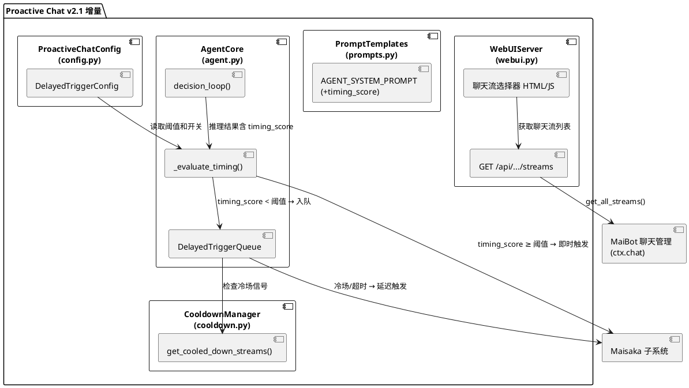
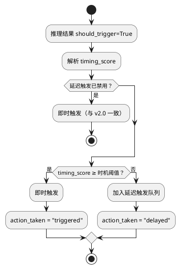
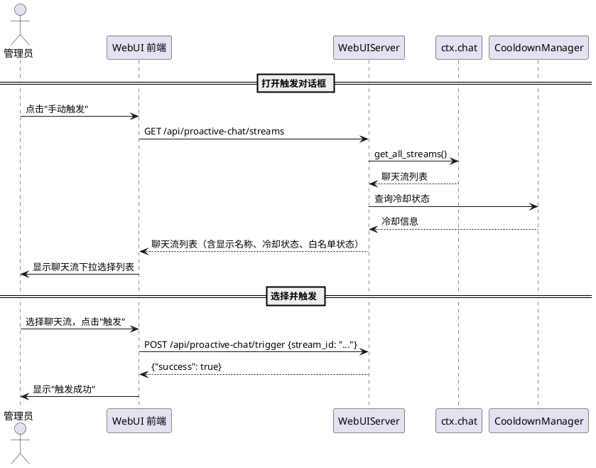

# 1. 实现模型

## 1.1 上下文视图

### 1.1.1 系统上下文

Proactive Chat v2.1 在 v2.0 的智能体决策循环基础上新增两个增量能力：**延迟触发机制**（时机评估 + 延迟队列）和 **WebUI 聊天流选择器**（下拉选择替代哈希 ID 输入）。改动范围严格限定在插件内部，不修改主程序代码。

```plantuml
@startuml
left to right direction

rectangle "Proactive Chat v2.1 增量" as delta {
    rectangle "延迟触发机制\n(时机评估+延迟队列+冷场驱动)" as delayed
    rectangle "聊天流选择器\n(WebUI 下拉选择+API)" as selector
}

rectangle "Proactive Chat v2.0 现有" as existing {
    rectangle "AgentCore\n(感知→推理→行动→反思)" as core
    rectangle "CooldownManager\n(冷却+持久化)" as cd
    rectangle "ScopeMatcher\n(白名单匹配)" as sm
    rectangle "DeepSeekClient\n(HTTP API 调用)" as ds
    rectangle "WebUIServer\n(HTTP+WebSocket)" as webui
}

actor "群聊参与者" as user
actor "Bot 管理员" as admin
system "Maisaka 子系统" as maisaka
system "MaiBot 聊天管理" as chat_mgr
system "DeepSeek API" as deepseek

user --> existing : 发送消息（触发时机评估）
admin --> selector : 选择聊天流手动触发
delayed --> core : 时机评估结果路由
delayed --> maisaka : trigger_proactive（延迟或即时）
selector --> chat_mgr : get_all_streams()
selector --> webui : 下拉选择器渲染
core --> deepseek : 上下文分析（含 timing_score）

@enduml
```

### 1.1.2 部署上下文

与 v2.0 一致，插件部署在 Docker 容器内的 `data/MaiMBot/plugins/proactive-chat/` 下。v2.1 不新增独立模块文件，在现有模块上增量修改：

```
data/MaiMBot/plugins/proactive-chat/
├── plugin.py          ← 修改：启动延迟触发检查循环
├── agent.py           ← 修改：推理结果新增 timing_score，行动阶段路由（即时/延迟）
├── cooldown.py        ← 修改：新增冷场信号查询方法
├── prompts.py         ← 修改：系统提示词新增 timing_score 定义和时机评估维度
├── config.py          ← 修改：新增 DelayedTriggerConfig 配置段
├── persistence.py     ← 修改：DecisionRecord 新增 timing_score 字段，action_taken 新增枚举值
├── scope.py           ← 不变
├── deepseek_client.py ← 不变
├── webui.py           ← 修改：新增 streams API、聊天流选择器前端
├── smart_cleanup.py   ← 不变
├── config.toml        ← 修改：新增 [delayed_trigger] 段
└── _manifest.json     ← 修改：version 更新
```

## 1.2 服务/组件总体架构

### 1.2.1 模块划分

v2.1 不新增独立模块文件，在现有 8 个模块上增量修改：

| 模块 | 文件 | v2.1 改动类型 | 改动说明 |
|------|------|--------------|----------|
| **延迟触发队列** | `agent.py` | 新增内部类 | `DelayedTriggerQueue` 管理 `dict[str, DelayedTriggerRequest]` 内存队列 |
| **时机评估路由** | `agent.py` | 修改 | `decision_loop` 行动阶段根据 `timing_score` 路由到即时触发或延迟队列 |
| **冷场信号查询** | `cooldown.py` | 新增方法 | `get_cooled_down_streams()` 返回已过冷却的聊天流列表 |
| **提示词扩展** | `prompts.py` | 修改 | `AGENT_SYSTEM_PROMPT` 新增 `timing_score` 字段定义和评估维度 |
| **配置模型扩展** | `config.py` | 新增配置段 | `DelayedTriggerConfig` 管理延迟触发开关、阈值、最大等待时长 |
| **决策记录扩展** | `persistence.py` | 修改 | `DecisionRecord` 新增 `timing_score` 字段，`action_taken` 新增 `delayed`/`triggered_delayed` |
| **聊天流列表 API** | `webui.py` | 新增端点 | `GET /api/proactive-chat/streams` 返回活跃聊天流列表 |
| **聊天流选择器** | `webui.py` | 修改前端 | 手动触发对话框从输入框改为下拉选择器 |
| **延迟触发检查循环** | `plugin.py` | 修改 | `on_load` 中启动 `_delayed_trigger_check_loop` |

### 1.2.2 模块交互架构



### 1.2.3 核心处理流程

**延迟触发决策流程（嵌入现有 decision_loop）**：



**延迟触发队列检查循环**：

```plantuml
@startuml
start

:每 30 秒检查一次;

if (延迟触发队列为空？) then (是)
    :跳过;
    stop
endif

:获取已过冷却的聊天流列表\n（冷场信号）;

while (队列中还有待处理请求？) do
    :取出一条请求;

    if (请求超过最大等待时长？) then (是)
        :校验冷却+白名单;
        if (校验通过？) then (是)
            :执行延迟触发;
            :action_taken = "triggered_delayed";
        else (否)
            :跳过，从队列移除;
        endif
    elseif (目标聊天流出现冷场信号？) then (是)
        :校验冷却+白名单;
        if (校验通过？) then (是)
            :执行延迟触发;
            :action_taken = "triggered_delayed";
        else (否)
            :跳过，从队列移除;
        endif
    else (否)
        :保留在队列中;
    endif
endwhile

stop
@enduml
```

**聊天流选择器交互流程**：



### 1.2.4 异步执行模型

延迟触发检查循环作为独立 asyncio.Task 运行，与 v2.0 的 `_cooldown_expiry_loop` 模式一致：

```
on_load()
    │
    ├─ [现有] asyncio.create_task(_cooldown_expiry_loop())    ← 每 30s 检测冷却到期
    ├─ [新增] asyncio.create_task(_delayed_trigger_check_loop())  ← 每 30s 检查延迟触发队列
    │
    └─ _delayed_trigger_check_loop()
          │
          ├─ asyncio.sleep(30)
          ├─ 检查 _agent._delayed_queue 是否为空
          ├─ 获取冷场信号（CooldownManager.get_cooled_down_streams()）
          ├─ 遍历队列，执行到期/冷场触发的请求
          └─ 校验冷却+白名单后调用 maisaka.trigger_proactive
```

## 1.3 实现设计文档

### 1.3.1 延迟触发队列 (agent.py 内部)

**职责**：管理延迟触发请求的内存队列，支持入队、去重、过期检查、冷场驱动触发

**数据结构**：

```python
@dataclass
class DelayedTriggerRequest:
    stream_id: str
    intent: str
    reason: str
    confidence: float
    timing_score: float
    created_at: float        # Unix 时间戳（秒）
    max_delay_seconds: int   # 最大延迟等待时长，默认 600
```

**队列管理类**：

```python
class DelayedTriggerQueue:
    def __init__(self) -> None:
        self._queue: dict[str, DelayedTriggerRequest] = {}  # key = stream_id

    def enqueue(self, request: DelayedTriggerRequest) -> None:
        """入队，同一 stream_id 去重（替换旧请求）"""

    def dequeue(self, stream_id: str) -> DelayedTriggerRequest | None:
        """出队指定聊天流的请求"""

    def get_pending(self) -> list[DelayedTriggerRequest]:
        """获取所有待处理请求"""

    def get_pending_for_stream(self, stream_id: str) -> DelayedTriggerRequest | None:
        """获取指定聊天流的待处理请求"""

    def is_empty(self) -> bool:
        """队列是否为空"""

    def clear(self) -> None:
        """清空队列"""
```

**设计要点**：

1. 队列以 `dict[str, DelayedTriggerRequest]` 存储，以 `stream_id` 为键，天然去重
2. 入队时若已存在同一 `stream_id` 的请求，直接替换为新请求（spec 5.2.1 规则 9）
3. 队列仅存在于内存中，不单独持久化；插件重启时通过决策记录中 `action_taken="delayed"` 的记录恢复（spec 5.2.3 场景 4）
4. 队列内存增量可控：单条请求约 200 字节，100 条请求约 20KB，远低于 5MB 限制

**生命周期管理**：

- **入队时机**：`AgentCore.decision_loop()` 行动阶段，`timing_score < 阈值` 时
- **出队时机**：
  - 冷场信号驱动：`_delayed_trigger_check_loop` 检测到冷场信号时
  - 最大等待超时：请求 `created_at + max_delay_seconds < now` 时
- **跳过时机**：
  - 目标聊天流处于冷却期内
  - 目标聊天流不在白名单范围内
- **恢复时机**：`on_load()` 时扫描决策记录中 `action_taken="delayed"` 的记录

### 1.3.2 时机评估路由 (agent.py 修改)

**职责**：在推理阶段解析 `timing_score`，在行动阶段根据阈值路由到即时触发或延迟队列

**推理结果扩展**：

`AnalysisResult` dataclass 新增字段：

```python
@dataclass
class AnalysisResult:
    should_trigger: bool = False
    intent: str = ""
    reason: str = ""
    confidence: float = 0.0
    timing_score: float = 1.0   # 新增：时机评分，默认 1.0（即时触发）
```

**`parse_analysis_result` 方法修改**：

在现有解析逻辑中新增 `timing_score` 字段解析：

```python
timing_score = float(data.get("timing_score", 1.0))
# 解析失败时默认 1.0，与 v2.0 行为一致
```

**`decision_loop` 行动阶段路由**：

```python
# 现有：should_trigger=True 且 confidence >= 0.5 → act()
# v2.1 新增：在 act 之前插入时机评估路由

if result.should_trigger and result.confidence >= 0.5:
    if not config.delayed_trigger.delayed_trigger_enabled:
        # 延迟触发禁用，即时触发（v2.0 行为）
        action_taken, trigger_time = await self.act(...)
    elif result.timing_score >= config.delayed_trigger.timing_threshold:
        # 时机合适，即时触发
        action_taken, trigger_time = await self.act(...)
    else:
        # 时机不合适，延迟触发
        self._delayed_queue.enqueue(DelayedTriggerRequest(
            stream_id=stream_id,
            intent=result.intent,
            reason=result.reason,
            confidence=result.confidence,
            timing_score=result.timing_score,
            created_at=time.time(),
            max_delay_seconds=config.delayed_trigger.max_delay_seconds,
        ))
        action_taken = "delayed"
        trigger_time = 0.0
```

**决策记录扩展**：

`DecisionRecord` 新增 `timing_score` 字段：

```python
@dataclass
class DecisionRecord:
    # ... 现有字段 ...
    timing_score: float = 1.0   # 新增
```

`analysis_result` 字典中新增 `timing_score` 键：

```python
"analysis_result": {
    "should_trigger": True,
    "intent": "topic_supplement",
    "reason": "...",
    "confidence": 0.85,
    "timing_score": 0.4,   # 新增
}
```

`action_taken` 新增枚举值：

| 值 | 含义 |
|---|---|
| `delayed` | 延迟触发入队 |
| `triggered_delayed` | 延迟触发执行成功 |

### 1.3.3 冷场信号查询 (cooldown.py 修改)

**职责**：提供冷场信号查询接口，供延迟触发检查循环使用

**新增方法**：

```python
def get_cooled_down_streams(self, cooldown_seconds: int) -> list[str]:
    """返回已过冷却期的聊天流 stream_id 列表。

    冷场信号的定义：聊天流在过去一段时间内无消息（已过冷却期），
    意味着该聊天流处于冷场状态，适合执行延迟触发。
    """
    now = time.time()
    return [
        sid for sid, rec in self._records.items()
        if (now - rec.triggered_at) >= cooldown_seconds
    ]
```

**设计要点**：

1. 冷场信号不引入独立的检测机制，而是复用 `CooldownManager` 已有的冷却记录
2. "已过冷却期"意味着该聊天流自上次触发后已有一段时间无新触发，处于冷场状态
3. 此方法仅返回 `stream_id` 列表，延迟触发队列通过 `stream_id` 匹配待执行请求

### 1.3.4 提示词扩展 (prompts.py 修改)

**职责**：在系统提示词中新增 `timing_score` 字段定义和时机评估维度

**AGENT_SYSTEM_PROMPT 修改**：

在"输出格式"段落中扩展 JSON 格式定义：

```
你必须以 JSON 格式返回决策结果：
{"should_trigger": bool, "intent": "意图标签", "reason": "自然语言原因描述", "confidence": float, "timing_score": float}

字段说明：
- should_trigger：是否应触发主动发言
- intent：意图标签，必须为 topic_supplement、silence_break、missed_reply、memory_recall 之一
- reason：触发原因的自然语言描述，不超过 200 字符
- confidence：决策置信度，0.0-1.0 之间的浮点数
- timing_score：触发时机评分，0.0-1.0 之间的浮点数
  - 1.0 表示当前是绝佳时机，应立即触发
  - 0.0 表示当前完全不适合触发，应延迟
  - 中间值表示不同程度的适合性
```

在"决策倾向"段落后新增"时机评估"段落：

```
## 时机评估

当你判断 should_trigger=true 时，还需要评估当前是否是合适的触发时机。请基于以下维度评估 timing_score：

1. **对话活跃度**：群聊正在热烈讨论时评分低（0.2-0.4），对话节奏平缓时评分中等（0.5-0.6），冷场后评分高（0.8-1.0）
2. **话题连贯性**：话题刚切换时评分低（0.3-0.5），话题稳定讨论中评分中等（0.5-0.7），话题间隙评分高（0.7-0.9）
3. **用户注意力**：刚有人提问时评分高（0.7-0.9），用户在闲聊时评分中等（0.4-0.6）
4. **冷场信号**：有冷场信号时评分高（0.8-1.0），无冷场信号时按其他维度评估

注意：
- 如果对话节奏正常且 bot 有明确的介入理由（如漏回补答），timing_score 应较高
- 如果只是话题相关但对话节奏正常，timing_score 应较低
- missed_reply 场景通常 timing_score 较高，因为需要立即补答
```

**同步修改**：需同步修改英文和日文提示词文件（如有）。

### 1.3.5 配置模型扩展 (config.py 修改)

**职责**：新增延迟触发配置段

**新增配置段**：

```python
class DelayedTriggerConfig(PluginConfigBase):
    __ui_label__ = "延迟触发"
    __ui_icon__ = "clock"
    __ui_order__ = 10

    delayed_trigger_enabled: bool = Field(
        default=True,
        description="是否启用延迟触发机制，禁用后所有触发即时执行",
    )
    timing_threshold: float = Field(
        default=0.7,
        ge=0.0,
        le=1.0,
        description="时机评估阈值，timing_score 低于此值时延迟触发",
    )
    max_delay_seconds: int = Field(
        default=600,
        ge=0,
        le=3600,
        description="延迟触发最大等待时长（秒），0 表示禁用延迟触发",
    )
```

**ProactiveChatConfig 新增聚合字段**：

```python
class ProactiveChatConfig(PluginConfigBase):
    # ... 现有字段 ...
    delayed_trigger: DelayedTriggerConfig = Field(default_factory=DelayedTriggerConfig)
```

**配置版本更新**：`PluginSectionConfig.config_version` 从 `"2.0.0"` 更新为 `"2.1.0"`

**config.toml 新增段**：

```toml
[delayed_trigger]
delayed_trigger_enabled = true
timing_threshold = 0.7
max_delay_seconds = 600
```

### 1.3.6 聊天流列表 API (webui.py 修改)

**职责**：提供获取当前活跃聊天流列表的 API 端点

**新增 API 端点**：

`GET /api/proactive-chat/streams`

**后端实现**：

```python
async def _handle_streams(self, request: web.Request) -> web.Response:
    """获取活跃聊天流列表"""
    # 1. 通过 ctx.chat.get_all_streams() 获取聊天流列表
    # 2. 构建返回数据：stream_id, display_name, chat_type,
    #    is_cooled_down, is_in_scope, remaining_cooldown_seconds
    # 3. 排序：群聊在前，私聊在后，同类内按名称排序
    # 4. API 不可用时返回错误响应
```

**聊天流显示名称构建逻辑**：

```python
def _build_display_name(stream: dict) -> tuple[str, str]:
    """构建聊天流显示名称和类型。

    Returns:
        (display_name, chat_type)
    """
    is_group = stream.get("is_group_session", False)
    chat_type = "group" if is_group else "private"

    if is_group:
        # 群聊：优先使用 group_name
        name = stream.get("group_name", "")
        if not name:
            # 降级：stream_id 前 8 位 + "..."
            sid = stream.get("session_id", "") or stream.get("stream_id", "")
            name = sid[:8] + "..." if len(sid) > 8 else sid
        return name, chat_type
    else:
        # 私聊：优先使用 user_nickname/user_cardname
        name = stream.get("user_nickname", "") or stream.get("user_cardname", "")
        if name:
            name = f"{name} 的私聊"
        else:
            sid = stream.get("session_id", "") or stream.get("stream_id", "")
            name = sid[:8] + "..." if len(sid) > 8 else sid
        return name, chat_type
```

**ctx.chat.get_all_streams() 调用方式**：

`WebUIServer` 不直接持有 `ctx` 引用，需要通过 `plugin.py` 传入。设计采用回调模式：

- 在 `WebUIServer.__init__` 中新增 `stream_fetcher: Callable | None = None` 参数
- `plugin.py` 在创建 `WebUIServer` 时传入 `stream_fetcher=lambda: self._fetch_streams()`
- `_fetch_streams()` 方法在 `plugin.py` 中实现，调用 `self.ctx.chat.get_all_streams()`

**响应格式**：

```json
{
  "success": true,
  "streams": [
    {
      "stream_id": "abc123...",
      "display_name": "技术交流群",
      "chat_type": "group",
      "is_cooled_down": true,
      "is_in_scope": true,
      "remaining_cooldown_seconds": null
    },
    {
      "stream_id": "def456...",
      "display_name": "张三 的私聊",
      "chat_type": "private",
      "is_cooled_down": false,
      "is_in_scope": true,
      "remaining_cooldown_seconds": 120
    }
  ]
}
```

**降级策略**：

- `stream_fetcher` 为 None 或调用失败时，返回 `{"success": false, "error": "无法获取聊天流列表"}`
- 前端收到错误响应时降级为文本输入模式

### 1.3.7 聊天流选择器前端 (webui.py 修改)

**职责**：手动触发对话框从文本输入框改为下拉选择器

**HTML/CSS 实现**：

替换现有 `showTriggerDialog()` 中的 `<input id="trigger-stream-id">` 为下拉选择器：

```html
<div class="trigger-dialog">
  <h3>手动触发决策</h3>
  <div id="stream-selector-area">
    <select id="trigger-stream-select" style="width:100%;padding:8px 12px;background:var(--bg);border:1px solid var(--border);color:var(--text);border-radius:6px;margin-bottom:8px">
      <option value="">加载中...</option>
    </select>
    <input id="trigger-stream-id" placeholder="或手动输入聊天流 ID" style="width:100%;padding:8px 12px;background:var(--bg);border:1px solid var(--border);color:var(--text);border-radius:6px;margin-bottom:12px;display:none">
  </div>
  <div class="actions">
    <button onclick="triggerDecision()">触发</button>
    <button onclick="hideTriggerDialog()" style="background:var(--border)">取消</button>
  </div>
</div>
```

**新增 CSS 样式**：

```css
.stream-option { display:flex; justify-content:space-between; align-items:center; }
.stream-option .stream-name { font-size:.85rem; }
.stream-option .stream-tags { display:flex; gap:4px; }
.stream-tag { font-size:.65rem; padding:1px 6px; border-radius:4px; }
.stream-tag.cooldown { background:rgba(253,203,110,.15); color:var(--yellow); }
.stream-tag.out-of-scope { background:rgba(225,112,85,.15); color:var(--red); }
```

**JS 实现逻辑**：

```javascript
async function showTriggerDialog() {
    // 1. 创建对话框 DOM（含下拉选择器）
    // 2. 立即调用 GET /api/proactive-chat/streams 获取聊天流列表
    // 3. 成功时：填充 <select> 选项
    //    - 每个选项 value = stream_id
    //    - 显示文本 = display_name
    //    - 冷却中的选项 disabled，显示"冷却中"标签
    //    - 不在白名单的选项显示"不在白名单"标签
    //    - 按 chat_type 排序：群聊在前，私聊在后
    // 4. 失败时：隐藏 <select>，显示 <input> 文本输入框
    //    - 提示"无法获取聊天流列表，请手动输入聊天流 ID"
}

async function triggerDecision() {
    // 优先从 <select> 获取 stream_id
    // 如果 <select> 不可见，从 <input> 获取
    const select = document.getElementById('trigger-stream-select');
    const input = document.getElementById('trigger-stream-id');
    let sid = '';
    if (select && select.style.display !== 'none') {
        sid = select.value;
    } else {
        sid = input.value.trim();
    }
    // ... 后续触发逻辑不变
}
```

**选择器选项格式**：

由于原生 `<select>` 的 `<option>` 不支持富文本，采用以下策略：

- 选项文本格式：`[群聊] 技术交流群` 或 `[私聊] 张三 的私聊`
- 冷却中的选项：文本追加 `（冷却中 2分30秒）`，设置 `disabled`
- 不在白名单的选项：文本追加 `（不在白名单）`，不设置 disabled（允许触发但会失败）
- 空状态：选项文本为"当前无活跃聊天流"，disabled

### 1.3.8 延迟触发检查循环 (plugin.py 修改)

**职责**：定时检查延迟触发队列，执行到期或冷场驱动的触发

**新增方法**：

```python
async def _delayed_trigger_check_loop(self) -> None:
    """定时检查延迟触发队列"""
    try:
        while True:
            await asyncio.sleep(30)
            config = await self._get_config()
            if not config.delayed_trigger.delayed_trigger_enabled:
                continue

            queue = self._agent._delayed_queue
            if queue.is_empty():
                continue

            now = time.time()
            cd_sec = config.cooldown.cooldown_seconds

            # 获取冷场信号：已过冷却期的聊天流
            cooled_down_streams = set(
                self._cooldown_manager.get_cooled_down_streams(cd_sec)
            )

            pending = queue.get_pending()
            for req in pending:
                should_execute = False

                # 检查最大等待超时
                if now - req.created_at >= req.max_delay_seconds:
                    should_execute = True
                    logger.info(
                        "[proactive-chat] 延迟触发请求超时，聊天流: %s",
                        req.stream_id,
                    )

                # 检查冷场信号
                elif req.stream_id in cooled_down_streams:
                    should_execute = True
                    logger.info(
                        "[proactive-chat] 检测到冷场信号，执行延迟触发，聊天流: %s",
                        req.stream_id,
                    )

                if should_execute:
                    queue.dequeue(req.stream_id)

                    # 校验冷却
                    if not self._cooldown_manager.is_cooled_down(
                        req.stream_id, cd_sec,
                    ):
                        logger.info(
                            "[proactive-chat] 延迟触发跳过，聊天流 %s 冷却中",
                            req.stream_id,
                        )
                        continue

                    # 校验白名单
                    in_scope = await self._scope_matcher.is_stream_in_scope(
                        req.stream_id, self.ctx,
                    )
                    if not in_scope:
                        logger.info(
                            "[proactive-chat] 延迟触发跳过，聊天流 %s 不在白名单",
                            req.stream_id,
                        )
                        continue

                    # 执行延迟触发
                    result = AnalysisResult(
                        should_trigger=True,
                        intent=req.intent,
                        reason=req.reason,
                        confidence=req.confidence,
                        timing_score=req.timing_score,
                    )
                    action_taken, trigger_time = await self._agent.act(
                        req.stream_id, result, self.ctx, config,
                    )

                    # 更新决策记录
                    # ... 通过 persistence 更新 action_taken 为 "triggered_delayed"

    except asyncio.CancelledError:
        pass
    except Exception as e:
        logger.error("[proactive-chat] 延迟触发检查循环异常(%s): %s", type(e).__name__, e)
```

**on_load 修改**：

```python
# 在 on_load 末尾，与 _cooldown_expiry_loop 同级启动
if config.delayed_trigger.delayed_trigger_enabled:
    self._delayed_check_task = asyncio.create_task(self._delayed_trigger_check_loop())
```

**on_unload 修改**：

```python
if hasattr(self, "_delayed_check_task") and self._delayed_check_task:
    self._delayed_check_task.cancel()
```

### 1.3.9 延迟触发恢复 (plugin.py 修改)

**职责**：插件重启时从决策记录恢复延迟触发队列

**新增方法**：

```python
async def _recover_delayed_triggers(self) -> int:
    """从决策记录恢复延迟触发队列"""
    recovered = 0
    try:
        records, _ = await self._persistence_manager.query_decisions(
            action="delayed",
            limit=100,
        )
        for rec in records:
            ar = rec.analysis_result or {}
            self._agent._delayed_queue.enqueue(DelayedTriggerRequest(
                stream_id=rec.stream_id,
                intent=ar.get("intent", ""),
                reason=ar.get("reason", ""),
                confidence=ar.get("confidence", 0.0),
                timing_score=ar.get("timing_score", 1.0),
                created_at=rec.ts,
                max_delay_seconds=self._config.delayed_trigger.max_delay_seconds,
            ))
            recovered += 1

        if recovered:
            logger.info("[proactive-chat] 恢复了 %d 条延迟触发请求", recovered)
    except Exception as e:
        logger.warning("[proactive-chat] 延迟触发恢复异常(%s): %s", type(e).__name__, e)
    return recovered
```

**on_load 中调用**：

```python
# 在 AgentCore 初始化之后
if self._config.delayed_trigger.delayed_trigger_enabled:
    recovered = await self._recover_delayed_triggers()
```

### 1.3.10 降级策略

| 降级场景 | 处理方式 | 用户感知 |
|----------|----------|----------|
| `timing_score` 缺失或解析失败 | 默认 `timing_score=1.0`，即时触发 | 无感知，行为与 v2.0 一致 |
| 延迟触发禁用（`delayed_trigger_enabled=False`） | 所有触发即时执行 | 无感知，行为与 v2.0 一致 |
| `max_delay_seconds=0` | 禁用延迟触发，所有触发即时执行 | 无感知，行为与 v2.0 一致 |
| `ctx.chat.get_all_streams()` 不可用 | WebUI 降级为文本输入模式 | 手动触发需输入哈希 ID |
| 聊天流名称获取失败 | 降级显示 `stream_id[:8] + "..."` | 显示截断哈希值 |
| 延迟触发队列冷却中/不在白名单 | 跳过该请求，记录日志 | bot 不主动发言 |
| 延迟触发最大等待超时 | 自动执行（仍校验冷却+白名单） | bot 在较晚时刻主动发言 |
| 插件重启队列丢失 | 从决策记录 `action_taken="delayed"` 恢复 | 重启后延迟请求可能仍执行 |
| 聊天流列表加载超时（>5s） | 前端显示"加载超时"，提供重试和手动输入切换 | 可重试或切换为手动输入 |

# 2. 接口设计

## 2.1 总体设计

v2.1 的接口变更分为两类：**现有接口扩展**（保持向后兼容）和 **新增接口**。

接口设计原则：
- 现有接口仅新增可选参数和响应字段，不破坏兼容性
- 新增接口遵循现有路径规范 `/api/proactive-chat/` 前缀
- 错误响应统一为 `{success: false, error: "..."}` 格式

## 2.2 接口清单

### 2.2.1 现有接口扩展

#### GET /api/proactive-chat/decisions

**扩展内容**：`action` 参数新增 `delayed` 和 `triggered_delayed` 可选值

#### GET /api/proactive-chat/stats

**扩展内容**：无新增字段（`timing_score` 数据可通过 `confidence_distribution` 间接体现）

### 2.2.2 新增接口

#### GET /api/proactive-chat/streams

**用途**：获取当前活跃聊天流列表

**请求参数**：无

**响应**：

```json
{
  "success": true,
  "streams": [
    {
      "stream_id": "abc123def456...",
      "display_name": "技术交流群",
      "chat_type": "group",
      "is_cooled_down": true,
      "is_in_scope": true,
      "remaining_cooldown_seconds": null
    },
    {
      "stream_id": "def456abc789...",
      "display_name": "张三 的私聊",
      "chat_type": "private",
      "is_cooled_down": false,
      "is_in_scope": true,
      "remaining_cooldown_seconds": 120
    }
  ]
}
```

**错误响应**（API 不可用时）：

```json
{
  "success": false,
  "error": "无法获取聊天流列表"
}
```

**字段说明**：

| 字段 | 类型 | 说明 |
|------|------|------|
| `stream_id` | string | 聊天流唯一标识 |
| `display_name` | string | 显示名称，群聊显示群名称，私聊显示"xxx 的私聊"，无法获取时显示 `stream_id[:8] + "..."` |
| `chat_type` | string | 聊天类型，`"group"` 或 `"private"` |
| `is_cooled_down` | bool | 是否已过冷却期 |
| `is_in_scope` | bool | 是否在白名单范围内 |
| `remaining_cooldown_seconds` | int|null | 剩余冷却时间（秒），仅冷却中时有值 |

**排序规则**：群聊在前，私聊在后，同类内按 `display_name` 拼音排序

# 4. 数据模型

## 4.1 设计目标

v2.1 的数据模型变更在 v2.0 基础上增量扩展，不引入新的持久化存储。变更范围：

1. **内存数据结构**：`DelayedTriggerRequest` dataclass（延迟触发队列项）
2. **DecisionRecord 扩展**：新增 `timing_score` 字段
3. **analysis_result 字典扩展**：新增 `timing_score` 键
4. **action_taken 枚举扩展**：新增 `delayed` 和 `triggered_delayed` 值

## 4.2 模型实现

### 4.2.1 DelayedTriggerRequest（内存数据结构）

```python
@dataclass
class DelayedTriggerRequest:
    stream_id: str            # 目标聊天流 ID
    intent: str               # 触发意图标签
    reason: str               # 触发原因描述（≤200 字符）
    confidence: float         # 决策置信度（0.0-1.0）
    timing_score: float       # 时机评分（0.0-1.0）
    created_at: float         # 请求创建时间戳（Unix 秒）
    max_delay_seconds: int    # 最大延迟等待时长（秒），默认 600
```

**生命周期**：仅存在于内存中，不单独持久化。恢复来源为决策记录中 `action_taken="delayed"` 的记录。

### 4.2.2 DecisionRecord 扩展

```python
@dataclass
class DecisionRecord:
    # ... v2.0 现有字段 ...
    timing_score: float = 1.0   # 新增：时机评分
```

**JSONL 存储格式扩展**：

```json
{
    "ts": 1700000000.0,
    "time": "2024-01-01 00:00:00",
    "stream_id": "xxx",
    "input_summary": "...",
    "analysis_result": {
        "should_trigger": true,
        "intent": "topic_supplement",
        "reason": "对话中讨论了Python异步编程",
        "confidence": 0.85,
        "timing_score": 0.4
    },
    "action_taken": "delayed",
    "timing_score": 0.4,
    "record_status": "completed",
    "error": ""
}
```

**`_fill_record_defaults` 扩展**：

```python
data.setdefault("timing_score", 1.0)
```

### 4.2.3 action_taken 枚举扩展

| 值 | 含义 | v2.1 新增 |
|---|---|---|
| `triggered` | 成功触发主动对话 | 否 |
| `delayed` | 延迟触发入队 | **是** |
| `triggered_delayed` | 延迟触发执行成功 | **是** |
| `skipped_no_trigger` | 分析结果为不需要触发 | 否 |
| `skipped_low_confidence` | 置信度低于 0.5 | 否 |
| `skipped_no_messages` | 无近期消息 | 否 |
| `error_timeout` | DeepSeek API 调用超时 | 否 |
| `error_parse` | 分析结果解析失败 | 否 |
| `error_api` | DeepSeek API 调用失败 | 否 |
| `error_trigger` | 触发主动对话失败 | 否 |
| `intent_disabled` | 对应场景已禁用 | 否 |

### 4.2.4 聊天流信息（API 传输层数据结构）

```python
@dataclass
class StreamInfo:
    stream_id: str
    display_name: str
    chat_type: str           # "group" | "private"
    is_cooled_down: bool
    is_in_scope: bool
    remaining_cooldown_seconds: int | None  # 仅冷却中时有值
```

**生命周期**：仅存在于 API 请求/响应传输层，不持久化。

### 4.2.5 新增配置项

| 配置段 | 字段 | 类型 | 默认值 | 约束 | 说明 |
|--------|------|------|--------|------|------|
| `delayed_trigger` | `delayed_trigger_enabled` | bool | True | - | 是否启用延迟触发机制 |
| `delayed_trigger` | `timing_threshold` | float | 0.7 | 0.0-1.0 | 时机评估阈值 |
| `delayed_trigger` | `max_delay_seconds` | int | 600 | 0-3600 | 最大延迟等待时长（秒），0 禁用 |