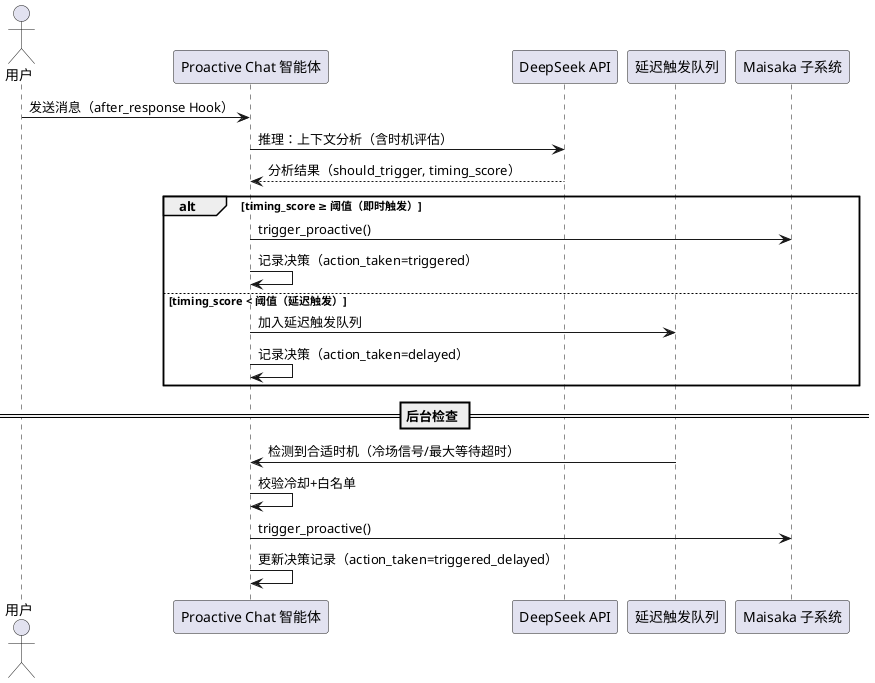
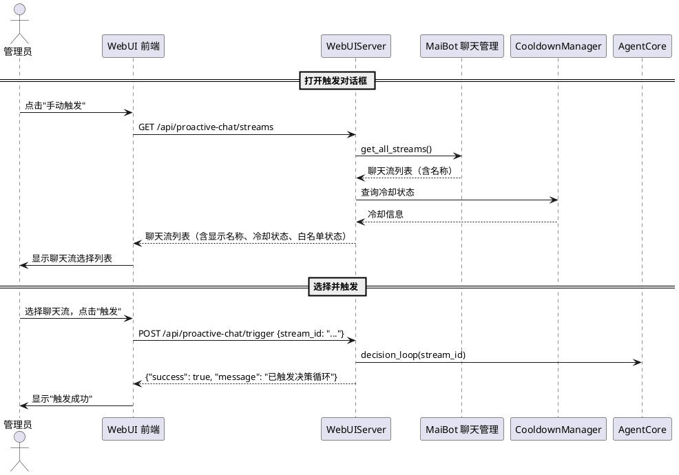

# 1. 组件定位

## 1.1 核心职责

本组件是对 proactive-chat v2.0 插件的增量优化，解决两个核心问题：触发时机过于激进（用户发消息即触发决策循环）和 WebUI 手动触发体验不友好（需输入哈希格式的聊天流 ID）。

## 1.2 核心输入

1. **用户反馈问题**：插件在用户发起的对话中立即触发决策循环，而非基于上下文在合适的未来时刻触发
2. **WebUI 手动触发输入**：当前要求用户输入聊天流 ID（哈希值），对用户不友好
3. **现有插件架构**：v2.0 的智能体决策循环、冷却管理、白名单机制、WebUI 数据面板等完整功能
4. **MaiBot 聊天流信息**：通过 `ctx.chat` API 可获取的活跃聊天流列表及其显示名称

## 1.3 核心输出

1. **延迟触发机制**：上下文分析完成后，若判断需要触发但时机不合适，可延迟到合适时刻再触发
2. **WebUI 聊天流选择器**：手动触发对话框从输入哈希 ID 改为从活跃聊天流列表中选择，显示群名称/私聊名称
3. **需求变更文档**：本 spec.md

## 1.4 职责边界

1. **不负责**修改智能体决策循环的核心逻辑（感知→推理→行动→反思的四阶段架构不变）
2. **不负责**修改 DeepSeek API 独立调用机制
3. **不负责**修改冷却管理、白名单匹配等已有机制的核心语义
4. **不负责**修改主程序代码——仅通过插件 API 和 Hook 交互
5. **不负责**新增独立的定时任务调度框架——延迟触发基于现有 asyncio 机制实现
6. **不负责**修改 @Tool 路径的触发逻辑——@Tool 路径由 LLM Planner 实时调用，不存在时机问题

# 2. 领域术语

**即时触发**
: 当智能体在 after_response Hook 中完成上下文分析并判断 should_trigger=True 后，立即调用 `maisaka.trigger_proactive` 触发主动对话的行为。这是 v2.0 的现有行为。

**延迟触发**
: 当智能体判断需要主动发言，但当前对话节奏不适合立即介入时，将触发请求暂存，等待合适的未来时刻（如冷场时、话题间隙等）再执行触发的行为。

**触发时机评分**
: 智能体在推理阶段输出的附加评估项，表示当前时刻是否为合适的触发时机。分值越低表示当前越不适合触发，应延迟到更合适的时刻。

**延迟触发队列**
: 存储暂未执行的触发请求的内存队列，每条记录包含 stream_id、intent、reason、confidence、建议延迟时长等信息。

**聊天流选择器**
: WebUI 手动触发对话框中的交互组件，以可选择的列表形式展示当前活跃的聊天流，替代原有的文本输入框。

**聊天流显示名称**
: 聊天流在 WebUI 中展示的人类可读名称，群聊显示群名称，私聊显示"xxx 的私聊"格式，而非哈希格式的 session_id。

# 3. 角色与边界

## 3.1 核心角色

- **群聊参与者**：在群聊中发送消息的用户，其消息内容和对话节奏是触发时机判断的主要输入
- **Bot 管理员**：通过 WebUI 手动触发决策、调整配置的运维人员，需要友好的操作界面
- **MaiBot 主程序**：通过 Hook 事件驱动插件决策循环的上游系统

## 3.2 外部系统

- **Maisaka 子系统**：提供 `trigger_proactive`（主动触发）、`context.append`（上下文注入）等 API
- **MaiBot 聊天管理**：提供 `ctx.chat.get_all_streams()` 等查询活跃聊天流的 API
- **DeepSeek API**：插件独立调用的 LLM 服务，用于上下文分析

## 3.3 交互上下文

```plantuml
@startuml
left to right direction

rectangle "Proactive Chat v2.1 增量" as delta {
    rectangle "延迟触发机制\n(时机评估+延迟队列)" as delayed
    rectangle "聊天流选择器\n(WebUI 交互优化)" as selector
}

actor "群聊参与者" as user
actor "Bot 管理员" as admin
system "Maisaka 子系统" as maisaka
system "MaiBot 聊天管理" as chat_mgr
system "DeepSeek API" as deepseek

user --> delta : 发送消息（触发时机评估）
admin --> selector : 选择聊天流手动触发
delta --> maisaka : trigger_proactive（延迟或即时）
delta --> chat_mgr : get_all_streams()（获取活跃聊天流）
delta --> deepseek : 上下文分析（含时机评估）

@enduml
```

# 4. DFX 约束

## 4.1 性能

1. **延迟触发检查延迟**：延迟触发队列的检查间隔不超过 30 秒
2. **聊天流列表 API 响应**：WebUI 获取活跃聊天流列表的响应时间不超过 1 秒
3. **内存增量**：延迟触发队列的内存增量不超过 5MB
4. **WebUI 聊天流选择器渲染**：50 个聊天流的列表渲染时间不超过 200ms

## 4.2 可靠性

1. **延迟触发不丢失**：插件重启后，延迟触发队列中的未执行项应通过决策记录的 pending 状态恢复
2. **降级容错**：`ctx.chat` API 不可用时，WebUI 手动触发应降级为原有的文本输入模式
3. **延迟触发超时保护**：延迟触发队列中的请求超过最大延迟时长仍未执行时，应自动执行或丢弃

## 4.3 安全性

1. **延迟触发白名单校验**：延迟触发执行时仍需校验白名单，聊天流被移出白名单后不应触发
2. **手动触发频率限制**：聊天流选择器不影响现有的 30 秒频率限制

## 4.4 可维护性

1. **日志规范**：延迟触发的执行和跳过必须记录日志，使用 `[proactive-chat]` 前缀
2. **配置热更新**：新增配置项支持通过 WebUI 热更新
3. **语言规范**：注释、日志、WebUI 展示语言优先使用简体中文

## 4.5 兼容性

1. **向后兼容**：v2.1 的所有变更必须与 v2.0 的现有功能兼容，不破坏已有 API 接口
2. **SDK 版本**：继续使用 SDK 2.5.4+ 的 API
3. **Docker 部署**：改动通过卷挂载实时同步，无需修改部署配置

# 5. 核心能力

## 5.1 问题分析

### 5.1.1 问题一：触发时机过于激进

**根因分析**：

当前 v2.0 的触发链路为：用户发消息 → `maisaka.planner.after_response` Hook 触发 → 前置检查通过 → 立即启动智能体决策循环 → DeepSeek 分析上下文 → 若 should_trigger=True → **立即**调用 `maisaka.trigger_proactive`。

问题在于：智能体只判断了"是否应该主动发言"（should_trigger），但没有判断"现在是否是合适的发言时机"。例如：

- 用户刚发了一条消息，对话节奏正常，但智能体判断话题相关可以补充 → 立即触发 → 用户感觉 bot 过于激进
- 群聊正在热烈讨论中，智能体判断可以参与 → 立即触发 → 打断对话节奏

用户期望的行为是：智能体判断"需要主动发言"后，还应评估"当前是否是合适的时机"，如果不是，应延迟到更合适的时刻（如冷场时、话题间隙等）再触发。

**核心矛盾**：v2.0 的 after_response Hook 是事件驱动的（用户发消息时触发），但用户期望的触发时机可能是"未来某个时刻"（如冷场时），两者存在时间差。

### 5.1.2 问题二：WebUI 手动触发体验不友好

**根因分析**：

当前 v2.0 的 WebUI 手动触发对话框（`showTriggerDialog()`）要求用户输入聊天流 ID（一个哈希值，如 `abc123def456`），这对用户极不友好：

1. 用户不知道自己想触发的聊天流的哈希 ID 是什么
2. 哈希 ID 无法记忆和辨识
3. 用户需要先去其他地方查找 ID，再回来粘贴

用户期望的行为是：从当前活跃的聊天流列表中选择，列表中显示群名称或"xxx 的私聊"等可读名称。

## 5.2 延迟触发机制

### 5.2.1 业务规则

1. **时机评估规则**：When 智能体推理结果为 should_trigger=True，the 插件 shall 对当前对话节奏进行时机评估，判断是否适合立即触发

   a. 验收条件：[智能体推理结果 should_trigger=True] → [在推理结果中新增 timing_score 字段，表示当前触发时机的适合程度，取值 0.0-1.0]

2. **即时触发规则**：When 时机评估结果为适合立即触发（timing_score ≥ 时机阈值），the 插件 shall 立即执行主动对话触发

   a. 验收条件：[推理结果 should_trigger=True 且 timing_score ≥ 0.7] → [立即调用 maisaka.trigger_proactive 触发主动对话，与 v2.0 行为一致]

3. **延迟触发规则**：When 时机评估结果为不适合立即触发（timing_score < 时机阈值），the 插件 shall 将触发请求加入延迟触发队列，等待更合适的时机执行

   a. 验收条件：[推理结果 should_trigger=True 且 timing_score < 0.7] → [不立即触发，将 stream_id、intent、reason、confidence、timing_score 加入延迟触发队列]

   b. 验收条件：[延迟触发队列非空] → [后台定期检查队列，当检测到合适的触发时机（如冷场信号）时，执行延迟的触发请求]

4. **时机阈值可配置规则**：时机阈值必须可通过插件配置调整

   a. 验收条件：[管理员将时机阈值配置为 0.5] → [timing_score ≥ 0.5 时立即触发，< 0.5 时延迟触发]

5. **延迟触发最大等待规则**：延迟触发队列中的请求必须有最大等待时长，超过后自动执行或丢弃

   a. 验收条件：[延迟触发请求在队列中等待超过最大延迟时长（默认 10 分钟）] → [自动执行该触发请求]

   b. 验收条件：[管理员将最大延迟时长配置为 0] → [禁用延迟触发机制，所有 should_trigger=True 的请求立即执行，与 v2.0 行为一致]

6. **延迟触发冷却规则**：延迟触发执行时仍需遵守冷却窗口规则

   a. 验收条件：[延迟触发请求执行时该聊天流处于冷却期内] → [跳过该触发请求，记录日志]

7. **延迟触发白名单规则**：延迟触发执行时仍需遵守白名单规则

   a. 验收条件：[延迟触发请求执行时该聊天流已不在白名单范围内] → [跳过该触发请求，记录日志]

8. **冷场信号驱动规则**：When 检测到某聊天流出现冷场信号，the 插件 shall 检查延迟触发队列中是否有该聊天流的待执行请求

   a. 验收条件：[聊天流 A 出现冷场信号，且延迟触发队列中有聊天流 A 的待执行请求] → [执行该延迟触发请求]

9. **延迟触发去重规则**：同一聊天流在延迟触发队列中只保留最新的一条请求

   a. 验收条件：[聊天流 A 已在延迟触发队列中有一条请求，又新增一条] → [替换为新的请求，旧的丢弃]

10. **延迟触发决策记录规则**：延迟触发的决策记录必须完整记录时机评估结果和延迟状态

    a. 验收条件：[延迟触发请求入队时] → [决策记录中包含 timing_score、action_taken 为 "delayed" ]

    b. 验收条件：[延迟触发请求执行时] → [更新决策记录的 action_taken 为 "triggered_delayed"，记录实际触发时间]

11. **禁用延迟触发规则**：The 插件 shall 支持通过配置完全禁用延迟触发机制

    a. 验收条件：[管理员将延迟触发配置设为禁用] → [所有 should_trigger=True 的请求立即执行，与 v2.0 行为完全一致]

### 5.2.2 交互流程



### 5.2.3 异常场景

1. **延迟触发队列中聊天流冷却中**

   a. 触发条件：延迟触发请求执行时，目标聊天流处于冷却窗口内

   b. 系统行为：跳过该触发请求，从队列中移除，记录日志

   c. 用户感知：无感知，bot 不主动发言

2. **延迟触发队列中聊天流不在白名单**

   a. 触发条件：延迟触发请求执行时，目标聊天流已被移出白名单

   b. 系统行为：跳过该触发请求，从队列中移除，记录日志

   c. 用户感知：无感知，bot 不主动发言

3. **延迟触发最大等待超时**

   a. 触发条件：延迟触发请求在队列中等待超过最大延迟时长

   b. 系统行为：自动执行该触发请求（仍需校验冷却和白名单），记录日志

   c. 用户感知：bot 在较晚的时刻主动发言

4. **插件重启时延迟触发队列丢失**

   a. 触发条件：插件重启，内存中的延迟触发队列丢失

   b. 系统行为：通过决策记录中 action_taken="delayed" 的记录恢复未执行的延迟触发请求，恢复后重新校验冷却和白名单

   c. 用户感知：插件重启后，之前延迟的触发请求可能仍会执行

5. **DeepSeek API 返回的 timing_score 格式异常**

   a. 触发条件：推理结果中 timing_score 字段缺失或无法解析为浮点数

   b. 系统行为：默认 timing_score=1.0（倾向于即时触发），与 v2.0 行为一致

   c. 用户感知：无感知，bot 行为与 v2.0 一致

## 5.3 WebUI 聊天流选择器

### 5.3.1 业务规则

1. **聊天流列表 API 规则**：The WebUI shall 提供获取当前活跃聊天流列表的 API 端点

   a. 验收条件：[GET /api/proactive-chat/streams] → [返回活跃聊天流列表，每条记录包含 stream_id、display_name（群名称或"xxx 的私聊"）、chat_type（group/private）]

2. **聊天流显示名称规则**：The WebUI shall 在聊天流列表中显示人类可读的名称而非哈希 ID

   a. 验收条件：[群聊聊天流] → [显示群名称，如"技术交流群"]

   b. 验收条件：[私聊聊天流] → [显示"xxx 的私聊"格式，如"张三的私聊"]

   c. 验收条件：[无法获取显示名称的聊天流] → [显示 stream_id 的前 8 位 + "..."作为降级显示]

3. **手动触发选择器规则**：When 管理员点击"手动触发"按钮，the WebUI shall 弹出聊天流选择对话框，从活跃聊天流列表中选择而非手动输入 ID

   a. 验收条件：[管理员点击"手动触发"] → [弹出对话框，显示活跃聊天流列表，每项显示群名称/私聊名称，支持搜索过滤]

   b. 验收条件：[管理员在搜索框输入"技术"] → [列表仅显示名称包含"技术"的聊天流]

   c. 验收条件：[管理员选择一个聊天流并点击"触发"] → [调用 POST /api/proactive-chat/trigger，传入选中的 stream_id]

4. **聊天流列表刷新规则**：When 管理员打开手动触发对话框，the WebUI shall 自动刷新活跃聊天流列表

   a. 验收条件：[管理员打开触发对话框] → [自动调用 GET /api/proactive-chat/streams 获取最新列表]

5. **聊天流列表空状态规则**：When 活跃聊天流列表为空，the WebUI shall 显示友好的空状态提示

   a. 验收条件：[活跃聊天流列表为空] → [显示"当前无活跃聊天流"提示，触发按钮禁用]

6. **聊天流 API 降级规则**：If `ctx.chat` API 不可用，the WebUI shall 降级为原有的文本输入模式

   a. 验收条件：[GET /api/proactive-chat/streams 返回错误] → [手动触发对话框降级为文本输入框，提示"无法获取聊天流列表，请手动输入聊天流 ID"]

7. **聊天流列表排序规则**：The WebUI shall 对聊天流列表按类型和名称排序

   a. 验收条件：[聊天流列表包含群聊和私聊] → [群聊在前，私聊在后，同类内按名称拼音排序]

8. **冷却状态标注规则**：When 聊天流列表中的某个聊天流处于冷却期内，the WebUI shall 在列表项中标注冷却状态

   a. 验收条件：[聊天流 A 处于冷却期内] → [列表中该聊天流项显示"冷却中"标签和剩余冷却时间，且该行不可选择]

9. **白名单状态标注规则**：When 聊天流列表中的某个聊天流不在白名单范围内，the WebUI shall 在列表项中标注白名单状态

   a. 验收条件：[聊天流 B 不在白名单范围内] → [列表中该聊天流项显示"不在白名单"标签]

### 5.3.2 交互流程



### 5.3.3 异常场景

1. **聊天流列表 API 不可用**

   a. 触发条件：`ctx.chat.get_all_streams()` 调用失败或返回空

   b. 系统行为：WebUI 降级为文本输入模式，显示提示"无法获取聊天流列表，请手动输入聊天流 ID"

   c. 用户感知：手动触发对话框变为文本输入框，功能可用但体验降级

2. **聊天流名称获取失败**

   a. 触发条件：某个聊天流无法获取显示名称（群名称或用户昵称）

   b. 系统行为：降级显示 stream_id 的前 8 位 + "..."

   c. 用户感知：该聊天流显示为截断的哈希值，但仍可选择和触发

3. **选择冷却中的聊天流触发**

   a. 触发条件：管理员选择一个处于冷却期内的聊天流并点击"触发"

   b. 系统行为：该聊天流在列表中不可选择（禁用状态），无法触发

   c. 用户感知：该行灰色显示，无法点击选择

4. **聊天流列表加载超时**

   a. 触发条件：获取聊天流列表超过 5 秒

   b. 系统行为：显示"加载超时"提示，提供"重试"按钮和"手动输入"切换选项

   c. 用户感知：列表未加载，可选择重试或切换为手动输入模式

## 5.4 推理结果格式扩展

### 5.4.1 业务规则

1. **推理结果扩展规则**：The 智能体推理结果 shall 新增 timing_score 字段，表示当前触发时机的适合程度

   a. 验收条件：[推理结果格式] → [包含 should_trigger、intent、reason、confidence、timing_score 五个字段]

2. **时机评估 Prompt 规则**：The 智能体系统提示词 shall 包含时机评估的引导说明

   a. 验收条件：[系统提示词中] → [包含 timing_score 字段的定义和评估标准：1.0 表示当前是绝佳时机应立即触发，0.0 表示当前完全不适合触发应延迟，中间值表示不同程度的适合性]

3. **时机评估标准规则**：When 智能体评估触发时机，the 插件 shall 引导其基于以下维度评估

   a. 验收条件：[Prompt 中包含时机评估维度] → [包含：对话活跃度（正在热烈讨论时评分低）、话题连贯性（话题刚切换时评分低）、用户注意力（刚有人提问时评分高）、冷场信号（有冷场信号时评分高）]

4. **timing_score 默认值规则**：If 推理结果中 timing_score 缺失或解析失败，the 插件 shall 默认 timing_score=1.0

   a. 验收条件：[推理结果无 timing_score 字段] → [默认 timing_score=1.0，行为与 v2.0 一致（即时触发）]

### 5.4.2 交互流程

无新增交互流程，timing_score 作为推理阶段的附加输出，嵌入现有的决策循环中。

### 5.4.3 异常场景

已在 5.2.3 中覆盖。

# 6. 数据约束

## 6.1 延迟触发请求

1. **stream_id**：目标聊天流的唯一标识，必填，字符串类型
2. **intent**：触发意图标签，必填，必须为 topic_supplement、silence_break、missed_reply、memory_recall 之一
3. **reason**：触发原因的自然语言描述，必填，不超过 200 字符
4. **confidence**：决策置信度，必填，0.0-1.0 之间的浮点数
5. **timing_score**：时机评分，必填，0.0-1.0 之间的浮点数
6. **created_at**：请求创建时间戳，必填，Unix 时间戳（秒）
7. **max_delay_seconds**：最大延迟等待时长，必填，正整数，默认 600（10 分钟）

## 6.2 聊天流信息

1. **stream_id**：聊天流的唯一标识，必填，字符串类型
2. **display_name**：聊天流的显示名称，必填，群聊显示群名称，私聊显示"xxx 的私聊"
3. **chat_type**：聊天类型，必填，"group" 或 "private"
4. **is_cooled_down**：是否已过冷却期，必填，布尔值
5. **is_in_scope**：是否在白名单范围内，必填，布尔值
6. **remaining_cooldown_seconds**：剩余冷却时间（秒），可选，仅冷却中时有值

## 6.3 新增配置项

1. **delayed_trigger_enabled**：是否启用延迟触发机制，布尔值，默认 True
2. **timing_threshold**：时机评估阈值，浮点数，0.0-1.0，默认 0.7，低于此值时延迟触发
3. **max_delay_seconds**：延迟触发最大等待时长（秒），整数，0-3600，默认 600，设为 0 时禁用延迟触发