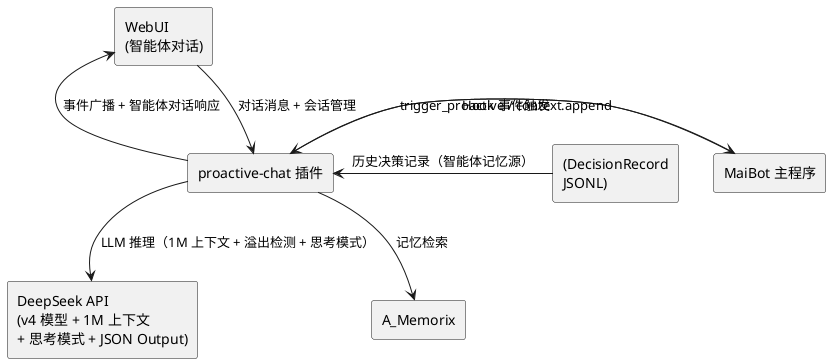
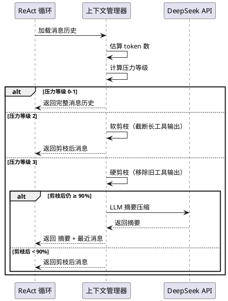
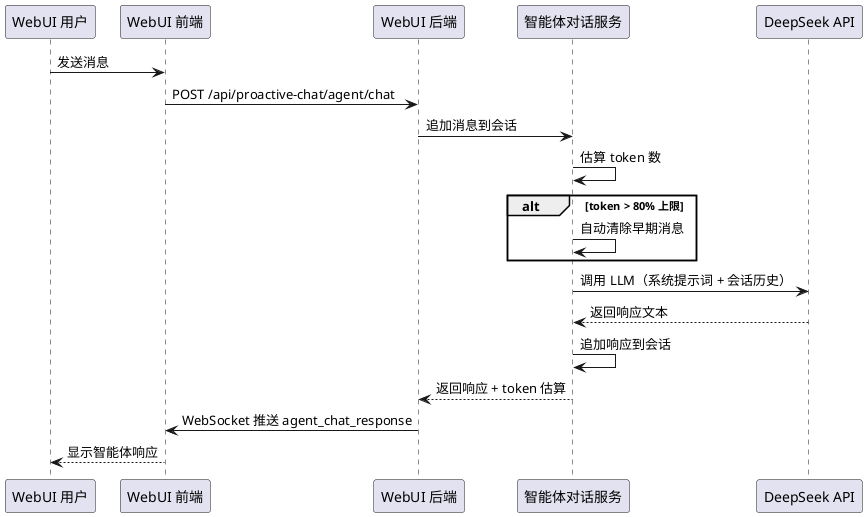
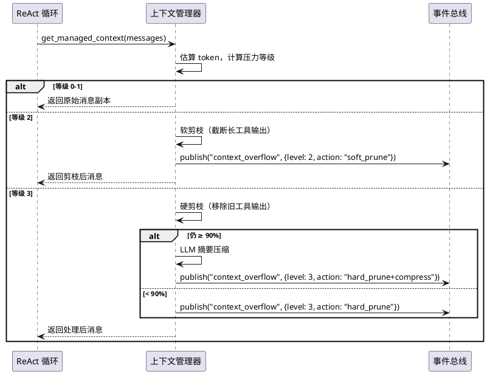
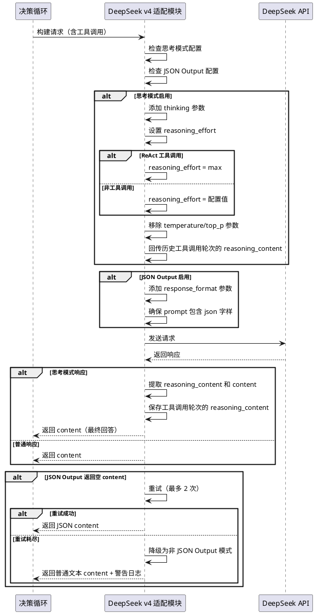
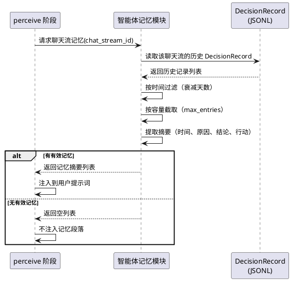

# 1. 组件定位

## 1.1 核心职责

本组件负责为 proactive-chat 插件新增 DeepSeek 1M 上下文窗口支持、WebUI 智能体对话功能、DeepSeek v4 模型适配和智能体记忆机制，使插件能够处理更长的对话历史、适配 DeepSeek 最新 API 特性、支持通过 WebUI 直接与智能体交互，并使智能体具备跨决策循环的记忆能力。

## 1.2 核心输入

1. DeepSeek API 的 1M 上下文模型调用请求（来自 ReAct 循环和上下文压缩）
2. WebUI 用户发起的智能体对话消息
3. 智能体对话会话的上下文管理请求（会话创建、消息追加、会话清除）
4. 插件配置中新增的 1M 上下文、智能体对话、DeepSeek v4 和智能体记忆相关参数
5. DeepSeek v4 模型的思考模式和 JSON Output 调用请求
6. 智能体记忆的注入请求（来自 perceive 阶段）

## 1.3 核心输出

1. 使用 1M 上下文窗口的 LLM 推理响应（含溢出检测和分级压缩）
2. WebUI 智能体对话的实时响应（流式或非流式文本）
3. 智能体对话会话状态（消息历史、token 估算、压缩摘要）
4. 上下文溢出状态事件（供 WebUI 展示和调试）
5. DeepSeek v4 思考模式响应（含 reasoning_content 思维链和 content 最终回答）
6. 智能体记忆条目（历史决策摘要，注入到 perceive 阶段的提示词中）

## 1.4 职责边界

- 不负责修改 MaiBot 主程序的 LLM 调用逻辑
- 不负责实现完整的 ChatGPT 风格对话界面（仅提供智能体调试/测试级对话）
- 不实现 MiMo-Code 的 Checkpoint 系统和 Fork Agent 前缀缓存（Anthropic 专有优化）
- 不实现 Max Mode 并行推理或 Plan/Compose/Max 等多代理模式
- 不实现权限系统（WebUI 智能体对话仅限管理员使用，无细粒度权限需求）
- 不实现跨会话的智能体记忆持久化（对话历史仅保存在内存中，重启后清除）
- 不修改主程序代码
- 不实现 DeepSeek strict 模式（Beta 功能，稳定性不足）
- 不依赖 A_Memorix 实现智能体记忆（使用插件自身的 DecisionRecord 作为记忆源）

# 2. 领域术语

**1M 上下文**
: DeepSeek API 提供的最大 1,000,000 token 上下文窗口能力，允许在单次 LLM 调用中处理更长的对话历史。
: 备注：实际可用 token 数受模型输出 token 限制，usable_limit = 1,000,000 - max_output_tokens。

**溢出检测**
: 基于当前 token 使用量与可用上下文窗口大小的比值，判断上下文压力等级的机制。借鉴 MiMo-Code 的 4 级压力模型。

**压力等级**
: 上下文使用压力的分级指标，分为 0/1/2/3 四级，基于 token_count / usable_limit 比值计算。
: - 等级 0：比值 < 50%，上下文充裕
: - 等级 1：比值 50%-75%，上下文正常
: - 等级 2：比值 75%-90%，上下文紧张，触发软剪枝
: - 等级 3：比值 > 90%，上下文溢出，触发硬剪枝

**软剪枝**
: 上下文压力达到等级 2 时，截断长工具输出以减少 token 消耗的策略。

**硬剪枝**
: 上下文压力达到等级 3 时，移除旧的工具输出消息以避免溢出的策略。

**智能体对话**
: 通过 WebUI 与 proactive-chat 智能体直接交互的功能，用户可以发送消息并获取智能体的实时响应，用于测试和调试智能体行为。

**对话会话**
: WebUI 智能体对话的一次完整交互上下文，包含消息历史、系统提示词、token 估算等状态，生命周期为内存级。

**分级压缩**
: 根据上下文压力等级动态调整压缩策略的机制。等级 0-1 不压缩，等级 2 触发软剪枝，等级 3 触发硬剪枝 + LLM 摘要。

**思考模式（Thinking Mode）**
: DeepSeek v4 模型提供的思维链推理能力，通过 `extra_body={"thinking": {"type": "enabled"}}` 开启，返回 `reasoning_content`（思维链）和 `content`（最终回答）两部分。
: 备注：思考模式下不支持 temperature、top_p 等参数；工具调用轮次的 reasoning_content 必须在后续请求中回传。

**reasoning_effort**
: 控制思考模式强度的参数，可选值为 `high`（默认）和 `max`（Agent 类请求自动设置）。

**reasoning_content**
: 思考模式下 DeepSeek API 返回的思维链内容。工具调用轮次的 reasoning_content 必须在后续所有请求中回传，否则返回 400 错误。
: 备注：非工具调用轮次的 reasoning_content 在后续轮次中会被忽略。

**JSON Output 模式**
: DeepSeek v4 API 提供的强制 JSON 输出能力，通过 `response_format={'type': 'json_object'}` 开启，要求 prompt 中包含 "json" 字样和格式样例。

**智能体记忆**
: 智能体对同一聊天流的历史决策结果形成的记忆，从 DecisionRecord 中提取历史分析结果摘要，在 perceive 阶段注入到提示词中，使智能体具备跨决策循环的上下文感知能力。
: 备注：不依赖 A_Memorix，使用插件自身的 DecisionRecord 作为记忆源。

**记忆衰减**
: 超过配置天数的历史记忆权重降低或不再注入的机制，防止过时记忆干扰当前决策。

# 3. 角色与边界

## 3.1 核心角色

- **MaiBot 管理员**：通过 WebUI 与智能体对话、测试和调试智能体行为、配置 1M 上下文参数
- **MaiBot 主程序**：通过 Hook 事件触发插件决策循环（不变）

## 3.2 外部系统

- **DeepSeek API**：提供 1M 上下文窗口的 LLM 推理服务、v4 模型（含思考模式和 JSON Output）、reasoning_content 回传机制
- **MaiBot SDK**：提供 ctx.message / ctx.chat / ctx.maisaka / ctx.config 等 API（不变）
- **A_Memorix**：提供记忆检索服务（不变）

## 3.3 交互上下文

# 4. DFX 约束

## 4.1 性能

1. 1M 上下文模式下的溢出检测 SHALL 在消息历史加载后 50ms 内完成
2. 智能体对话的首 token 响应时间 SHALL 不超过 5 秒（不含 LLM API 首 token 延迟）
3. 软剪枝和硬剪枝操作 SHALL 在 100ms 内完成（纯本地操作，不调用 LLM）
4. 分级压缩的 LLM 摘要调用 SHALL 不阻塞主决策循环
5. WebUI 智能体对话的 WebSocket 消息推送延迟 SHALL 不超过 200ms

## 4.2 可靠性

1. 1M 上下文模式下的 API 调用失败 SHALL 遵循现有重试逻辑（指数退避，最多 3 次）
2. 智能体对话会话的 LLM 调用失败 SHALL 返回明确的错误信息，不丢失已有消息历史
3. 溢出检测计算错误 SHALL 降级为不压缩，使用原始消息历史（截断到安全阈值）
4. 智能体对话的 WebSocket 连接断开 SHALL 不影响插件核心决策功能

## 4.3 安全性

1. WebUI 智能体对话 SHALL 仅在 WebUI 已启用时可用
2. 智能体对话 SHALL 使用与主决策循环相同的 DeepSeek API Key 和鉴权机制
3. 智能体对话的 LLM 调用 SHALL 使用独立的 max_tokens 限制，防止单次对话消耗过多 token
4. 智能体对话消息 SHALL 不写入持久化存储（纯内存，重启清除），避免污染决策记录

## 4.4 可维护性

1. 溢出检测的压力等级阈值 SHALL 通过配置项调整，无需修改代码
2. 智能体对话的系统提示词 SHALL 复用现有的 `build_system_prompt()` 函数
3. 1M 上下文相关日志 SHALL 记录压力等级、token 估算值、剪枝操作，便于调试
4. DeepSeek v4 思考模式的 reasoning_content 处理逻辑 SHALL 通过配置开关控制，无需修改代码
5. 智能体记忆的衰减天数和容量上限 SHALL 通过配置项调整，无需修改代码

## 4.5 兼容性

1. v3.1 SHALL 向后兼容 v3.0 的所有配置格式（新增配置段有默认值）
2. v3.1 SHALL 向后兼容 v3.0 的决策记录格式（不新增 DecisionRecord 字段）
3. 不启用 1M 上下文时，v3.1 的行为 SHALL 与 v3.0 完全一致
4. 不启用智能体对话时，v3.1 的 WebUI SHALL 与 v3.0 完全一致
5. WebUI 智能体对话 API SHALL 不影响现有 WebUI 端点的行为
6. 不启用 DeepSeek v4 思考模式时，v3.1 的 LLM 调用行为 SHALL 与 v3.0 完全一致
7. 不启用智能体记忆时，v3.1 的决策行为 SHALL 与 v3.0 完全一致
8. DeepSeek v4 模型名称更新 SHALL 不影响使用旧模型名称（如 `deepseek-chat`）的现有配置（旧模型名称在弃用前仍可使用）

# 5. 核心能力

## 5.1 DeepSeek 1M 上下文支持

### 5.1.1 业务规则

1. **1M 上下文启用**：当配置项 `deepseek_context.context_1m_enabled` 为 True 时，SHALL 使用 1M 上下文窗口模式
   - 验收条件：配置启用 → DeepSeek API 调用携带 1M 上下文参数 → 响应正常

2. **溢出检测**：1M 上下文模式下，SHALL 在每次 LLM 调用前计算当前 token 使用量和压力等级
   - 验收条件：消息历史加载 → 计算 token_count / usable_limit → 输出压力等级 0/1/2/3

3. **压力等级计算**：压力等级 SHALL 基于 token_count / usable_limit 比值计算
   - 等级 0：比值 < 50%
   - 等级 1：比值 50%-75%
   - 等级 2：比值 75%-90%
   - 等级 3：比值 > 90%
   - 验收条件：token 比值 0.82 → 压力等级 2

4. **软剪枝**：When 压力等级达到 2，the 上下文管理器 SHALL 截断工具输出消息中超过 500 字符的部分
   - 验收条件：压力等级 2 → 工具输出截断到 500 字符 → token 估算值下降

5. **硬剪枝**：When 压力等级达到 3，the 上下文管理器 SHALL 移除最早的工具输出消息对（assistant tool_calls + tool result）
   - 验收条件：压力等级 3 → 移除最早的工具输出消息 → 压力等级下降至 3 以下或消息耗尽

6. **分级压缩触发**：When 压力等级达到 3 且硬剪枝后仍超过 90%，the 上下文管理器 SHALL 触发 LLM 摘要压缩
   - 验收条件：硬剪枝后压力仍 ≥ 3 → 对剩余早期消息生成 LLM 摘要 → 替换为摘要文本

7. **可用 token 计算**：usable_limit SHALL 为模型最大上下文减去 max_output_tokens
   - 验收条件：1M 模式下 usable_limit = 1,000,000 - max_analysis_tokens

8. **非 1M 模式兼容**：While 1M 上下文未启用，the 上下文管理器 SHALL 保持 v3.0 的压缩行为不变
   - 验收条件：context_1m_enabled=False → 使用 ContextCompressor 的原有逻辑

9. **禁止项**：1M 上下文模式 SHALL 不修改配置中指定的模型名称（1M 是 API 侧能力，模型名称由 DeepseekV4Config 或现有配置决定）
   - 验收条件：API 请求体中 model 字段与配置一致

### 5.1.2 交互流程

### 5.1.3 异常场景

1. **Token 估算严重偏差**
   - 触发条件：估算值与实际 API 返回的 token 数差异超过 30%
   - 系统行为：记录警告日志，按实际值重新计算压力等级，下次调用使用修正后的估算
   - 用户感知：日志中出现 token 估算偏差警告

2. **硬剪枝后消息耗尽**
   - 触发条件：压力等级 3，所有工具输出消息已被移除，但仍超过 90%
   - 系统行为：触发 LLM 摘要压缩，对剩余早期对话消息生成摘要
   - 用户感知：决策记录中 context_compressed=True

3. **1M 上下文 API 调用超时**
   - 触发条件：1M 上下文请求因消息过长导致 API 超时
   - 系统行为：遵循现有重试逻辑，重试耗尽后降级为不触发
   - 用户感知：action_taken="error_api_retry_exhausted"

4. **分级压缩 LLM 调用失败**
   - 触发条件：压力等级 3 触发 LLM 摘要，但 DeepSeek API 返回错误
   - 系统行为：降级为硬剪枝结果（移除最早的非工具消息），不阻塞决策循环
   - 用户感知：决策质量可能略降（早期消息被移除而非摘要）

## 5.2 WebUI 智能体对话

### 5.2.1 业务规则

1. **对话入口**：When WebUI 用户在智能体对话界面发送消息，the 智能体对话服务 SHALL 创建或追加到对话会话并调用 LLM 生成响应
   - 验收条件：用户发送"你好" → 智能体返回响应文本 → 消息追加到会话历史

2. **会话管理**：the 智能体对话服务 SHALL 支持创建新会话、发送消息、清除会话三种操作
   - 验收条件：创建会话 → 发送消息 → 收到响应 → 清除会话 → 再次发送消息创建新会话

3. **系统提示词**：the 智能体对话 SHALL 使用与主决策循环相同的系统提示词（含人格设定、自定义提示词等）
   - 验收条件：智能体对话响应体现 bot_nickname 和 personality 配置

4. **独立 max_tokens**：the 智能体对话的 LLM 调用 SHALL 使用独立的 max_tokens 限制（默认 500）
   - 验收条件：智能体对话 LLM 调用的 max_tokens = chat_max_tokens 配置值

5. **会话 token 估算**：the 智能体对话服务 SHALL 在每次消息发送前估算当前会话的 token 使用量
   - 验收条件：发送消息 → 返回响应中包含 token_estimate 字段

6. **会话自动清除**：When 对话会话的 token 估算值超过 1M 上下文的 80%，the 智能体对话服务 SHALL 自动清除最早的 50% 消息
   - 验收条件：token 估算 > 800,000 → 自动清除早期消息 → 返回提示"会话上下文已自动压缩"

7. **对话上下文注入**：the 智能体对话 SHALL 可选注入指定聊天流的近期消息作为上下文
   - 验收条件：用户选择聊天流 → 智能体对话系统提示词中包含该聊天流的近期消息摘要

8. **WebSocket 实时推送**：the 智能体对话 SHALL 通过 WebSocket 实时推送智能体响应
   - 验收条件：用户发送消息 → WebSocket 推送 agent_chat_response 事件

9. **并发会话限制**：the 智能体对话服务 SHALL 限制同时存在的活跃会话数量（默认 5）
   - 验收条件：第 6 个会话创建请求 → 返回错误"活跃会话数已达上限"

10. **禁止项**：the 智能体对话 SHALL 不支持 ReAct 循环和 AgentTool 调用（仅纯文本对话）
    - 验收条件：智能体对话 LLM 调用不携带 tools 参数

11. **禁止项**：the 智能体对话 SHALL 不写入 DecisionRecord 持久化
    - 验收条件：智能体对话完成后 JSONL 文件中无新增记录

### 5.2.2 交互流程

### 5.2.3 异常场景

1. **LLM 调用失败**
   - 触发条件：DeepSeek API 返回错误或超时
   - 系统行为：返回错误信息给 WebUI，保留已有会话历史不丢失
   - 用户感知：WebUI 显示"智能体响应失败：{错误信息}"

2. **会话不存在**
   - 触发条件：用户发送消息时指定的 session_id 不存在或已过期
   - 系统行为：自动创建新会话，将用户消息作为首条消息
   - 用户感知：无缝切换到新会话

3. **WebSocket 连接断开**
   - 触发条件：智能体对话期间 WebSocket 连接中断
   - 系统行为：LLM 响应仍完成后存入会话，用户重连后可获取历史消息
   - 用户感知：重连后可看到断连期间的对话记录

4. **并发请求冲突**
   - 触发条件：同一会话同时收到多个消息请求
   - 系统行为：仅处理第一个请求，后续请求返回"会话正在响应中"
   - 用户感知：第二条消息发送失败，提示"请等待智能体响应完成"

5. **聊天流上下文注入失败**
   - 触发条件：用户选择注入聊天流上下文，但该聊天流无近期消息
   - 系统行为：不注入上下文，正常创建会话
   - 用户感知：智能体对话正常进行，但无指定聊天流的上下文信息

## 5.3 上下文溢出分级管理

### 5.3.1 业务规则

1. **分级策略**：the 上下文管理器 SHALL 根据压力等级执行不同的上下文管理策略
   - 等级 0：无操作
   - 等级 1：无操作，记录日志
   - 等级 2：软剪枝
   - 等级 3：硬剪枝 + 可选 LLM 摘要
   - 验收条件：压力等级 2 → 仅软剪枝，不调用 LLM

2. **软剪枝规则**：When 执行软剪枝，the 上下文管理器 SHALL 将工具输出消息中超过阈值（默认 500 字符）的部分截断，并追加"[已截断]"标记
   - 验收条件：工具输出 1200 字符 → 截断为 500 字符 + "[已截断]"

3. **硬剪枝规则**：When 执行硬剪枝，the 上下文管理器 SHALL 按时间顺序从最早的消息开始，移除完整的工具调用-响应消息对（assistant tool_calls + tool result），直到压力等级降至 3 以下
   - 验收条件：5 对工具消息 → 移除最早的 2 对 → 压力等级从 3 降至 2

4. **LLM 摘要规则**：When 硬剪枝后压力等级仍 ≥ 3，the 上下文管理器 SHALL 对剩余早期对话消息（非工具消息）生成 LLM 摘要，替换为单条 system 消息
   - 验收条件：硬剪枝后仍 ≥ 3 → 早期对话消息替换为摘要 system 消息 → 压力等级下降

5. **保留最近消息**：the 分级管理 SHALL 始终保留最近 N 条消息（与 ContextCompressConfig.compress_retained_messages 一致）
   - 验收条件：任何剪枝操作后，最近 N 条消息完整保留

6. **事件广播**：When 执行剪枝或压缩操作，the 上下文管理器 SHALL 通过事件总线广播 context_overflow 事件
   - 验收条件：压力等级 3 → 广播 context_overflow 事件，含压力等级、操作类型、剪枝前后 token 估算

7. **禁止项**：分级管理 SHALL 不修改原始消息历史（在副本上操作）
   - 验收条件：剪枝操作后，原始消息列表不变

### 5.3.2 交互流程

### 5.3.3 异常场景

1. **剪枝后消息为空**
   - 触发条件：硬剪枝移除了所有消息，包括最近 N 条
   - 系统行为：不执行剪枝，返回原始消息，记录错误日志
   - 用户感知：决策循环正常执行（使用原始消息）

2. **LLM 摘要生成返回空**
   - 触发条件：分级压缩的 LLM 调用返回空字符串
   - 系统行为：跳过摘要替换，保留硬剪枝后的消息
   - 用户感知：决策质量可能略降

## 5.4 DeepSeek v4 适配

### 5.4.1 业务规则

1. **模型名称更新**：the DeepSeek v4 适配模块 SHALL 将默认模型从 `deepseek-chat` 更新为 `deepseek-v4-flash`，并新增 `deepseek-v4-pro` 选项
   - 验收条件：未指定模型名称时 → API 请求体中 model 字段为 `deepseek-v4-flash`；配置指定 `deepseek-v4-pro` → model 字段为 `deepseek-v4-pro`

2. **旧模型兼容**：While 用户配置中仍使用 `deepseek-chat` 模型名称，the 适配模块 SHALL 允许继续使用，并记录弃用警告日志
   - 验收条件：配置 model=`deepseek-chat` → API 调用正常 → 日志中出现弃用警告

3. **思考模式启用**：When 配置项 `deepseek_v4.thinking_enabled` 为 True，the DeepSeek v4 适配模块 SHALL 在 LLM 调用中通过 `extra_body={"thinking": {"type": "enabled"}}` 开启思考模式
   - 验收条件：thinking_enabled=True → API 请求体中包含 thinking 参数 → 响应包含 reasoning_content 和 content

4. **reasoning_effort 控制**：the DeepSeek v4 适配模块 SHALL 支持 `reasoning_effort` 参数控制思考强度
   - 默认值为 `high`
   - Agent 类请求（ReAct 循环中的工具调用）自动设置为 `max`
   - 验收条件：配置 reasoning_effort=`high` → API 请求体中 reasoning_effort=`high`；ReAct 工具调用轮次 → reasoning_effort=`max`

5. **reasoning_content 回传**：When 思考模式启用且当前 LLM 调用涉及工具调用，the DeepSeek v4 适配模块 SHALL 将工具调用轮次返回的 reasoning_content 在后续所有请求中回传
   - 验收条件：工具调用轮次返回 reasoning_content → 后续请求的对应 assistant 消息中包含 reasoning_content → API 不返回 400 错误

6. **非工具调用 reasoning_content 忽略**：the DeepSeek v4 适配模块 SHALL 不回传非工具调用轮次的 reasoning_content（DeepSeek API 会自动忽略）
   - 验收条件：非工具调用轮次的 reasoning_content 不出现在后续请求消息中

7. **思考模式与温度参数互斥**：While 思考模式启用，the DeepSeek v4 适配模块 SHALL 不传递 temperature、top_p 等参数
   - 验收条件：thinking_enabled=True → API 请求体中不包含 temperature 和 top_p 字段

8. **JSON Output 模式**：When 配置项 `deepseek_v4.json_output_enabled` 为 True，the DeepSeek v4 适配模块 SHALL 在决策分析调用中使用 `response_format={'type': 'json_object'}` 强制 JSON 输出
   - 验收条件：json_output_enabled=True → 决策分析 API 请求体中包含 response_format 参数 → 响应 content 为合法 JSON

9. **JSON Output prompt 约束**：When JSON Output 模式启用，the 决策分析调用的 prompt 中 SHALL 包含 "json" 字样和格式样例
   - 验收条件：json_output_enabled=True → 系统提示词或用户提示词中包含 "json" 字样和 JSON 格式样例

10. **JSON Output 空响应处理**：If JSON Output 模式下 DeepSeek API 返回空 content，the 适配模块 SHALL 重试该请求（最多 2 次），重试耗尽后降级为非 JSON Output 模式
    - 验收条件：API 返回空 content → 重试 → 仍为空 → 降级为普通文本模式 → 记录警告日志

11. **思考模式 + ReAct 工具调用组合**：When 思考模式启用且 ReAct 循环执行工具调用，the 适配模块 SHALL 确保工具调用轮次的 reasoning_content 在后续所有请求中完整回传
    - 验收条件：ReAct 循环中工具调用轮次 → reasoning_content 被保存 → 后续请求中 assistant 消息携带 reasoning_content → 无 400 错误

12. **思考模式响应解析**：When 思考模式启用，the 适配模块 SHALL 分别处理 `reasoning_content`（思维链）和 `content`（最终回答），仅将 `content` 用于后续决策逻辑
    - 验收条件：思考模式响应 → reasoning_content 记录到日志 → content 传入决策解析逻辑

13. **strict 模式**：When 配置项 `deepseek_v4.strict_mode_enabled` 为 True，the DeepSeek v4 适配模块 SHALL 在工具调用中使用 strict 模式（`base_url="https://api.deepseek.com/beta"`，工具定义中设置 `strict: true`，`additionalProperties: false`）
    - 验收条件：strict_mode_enabled=True → API 请求使用 beta base_url → 工具定义包含 strict: true → 工具调用输出严格遵循 JSON Schema

### 5.4.2 交互流程

### 5.4.3 异常场景

1. **reasoning_content 回传遗漏导致 400 错误**
   - 触发条件：思考模式下工具调用轮次的 reasoning_content 未在后续请求中回传
   - 系统行为：捕获 400 错误，记录错误日志（含遗漏的轮次信息），重试时自动补全 reasoning_content
   - 用户感知：决策循环正常执行（重试成功），日志中出现 reasoning_content 回传警告

2. **思考模式与温度参数冲突**
   - 触发条件：思考模式启用但请求中仍携带 temperature 参数
   - 系统行为：适配模块在发送请求前自动移除 temperature/top_p 参数，记录调试日志
   - 用户感知：无感知（自动处理）

3. **JSON Output 返回非 JSON 内容**
   - 触发条件：JSON Output 模式启用但 API 返回的 content 不是合法 JSON
   - 系统行为：尝试 JSON 解析失败后，降级为文本解析模式（兼容 v3.0 行为），记录警告日志
   - 用户感知：决策循环正常执行，日志中出现 JSON 解析降级警告

4. **旧模型名称弃用后不可用**
   - 触发条件：`deepseek-chat` 模型在 2026/07/24 后被 DeepSeek API 正式弃用，API 返回模型不存在错误
   - 系统行为：捕获错误，记录错误日志（提示用户更新模型名称配置），不自动切换模型
   - 用户感知：决策循环执行失败，日志中提示模型名称已弃用

5. **reasoning_effort 参数无效**
   - 触发条件：配置的 reasoning_effort 值不在 `high`/`max` 范围内
   - 系统行为：降级为默认值 `high`，记录警告日志
   - 用户感知：决策循环正常执行

## 5.5 智能体记忆机制

### 5.5.1 业务规则

1. **记忆启用**：When 配置项 `agent_memory.memory_enabled` 为 True，the 智能体记忆模块 SHALL 在 perceive 阶段为同一聊天流注入历史决策记忆
   - 验收条件：memory_enabled=True → perceive 阶段提示词中包含历史决策摘要

2. **记忆来源**：the 智能体记忆模块 SHALL 从 DecisionRecord JSONL 文件中提取同一聊天流的历史决策结果摘要
   - 验收条件：聊天流 A 有 3 条历史 DecisionRecord → 记忆模块提取 3 条摘要

3. **记忆注入位置**：the 智能体记忆模块 SHALL 将记忆注入到 perceive 阶段的用户提示词中，格式为结构化的历史决策摘要列表
   - 验收条件：记忆启用 → 用户提示词中包含"历史决策记忆"段落 → 段落内容为结构化摘要列表

4. **记忆衰减**：When 历史决策记录的时间戳超过配置项 `agent_memory.memory_decay_days` 天，the 智能体记忆模块 SHALL 降低该记忆的权重或不再注入
   - 验收条件：memory_decay_days=7 → 8 天前的决策记录不再注入 → 5 天前的决策记录正常注入

5. **记忆容量限制**：the 智能体记忆模块 SHALL 限制单次注入的记忆条数不超过配置项 `agent_memory.memory_max_entries` 的值
   - 验收条件：memory_max_entries=10 → 聊天流有 15 条历史决策 → 仅注入最近 10 条摘要

6. **记忆摘要提取**：the 智能体记忆模块 SHALL 从 DecisionRecord 中提取以下信息作为记忆摘要：决策时间、触发原因、分析结论、采取行动
   - 验收条件：DecisionRecord 包含 trigger_reason、analysis_result、action_taken → 记忆摘要包含这四项信息

7. **记忆与 A_Memorix 独立**：the 智能体记忆模块 SHALL 不依赖 A_Memorix 服务，仅使用插件自身的 DecisionRecord 作为记忆源
   - 验收条件：A_Memorix 不可用时 → 智能体记忆功能正常工作

8. **记忆加载性能**：the 智能体记忆模块 SHALL 在 perceive 阶段加载记忆的耗时不超过 100ms
   - 验收条件：记忆加载 → 耗时 < 100ms → 提示词注入完成

9. **无记忆时的降级**：If 聊天流无历史 DecisionRecord 或所有记录均已衰减，the 智能体记忆模块 SHALL 不注入记忆段落，正常执行 perceive 阶段
   - 验收条件：新聊天流首次决策 → 提示词中无"历史决策记忆"段落 → 决策正常执行

10. **禁止项**：the 智能体记忆模块 SHALL 不修改 DecisionRecord 的持久化格式
    - 验收条件：记忆模块仅读取 DecisionRecord，不写入新字段

### 5.5.2 交互流程

### 5.5.3 异常场景

1. **DecisionRecord 文件读取失败**
   - 触发条件：JSONL 文件不存在、损坏或被占用
   - 系统行为：跳过记忆加载，不注入记忆段落，记录警告日志
   - 用户感知：决策循环正常执行（无记忆辅助），日志中出现记忆加载失败警告

2. **DecisionRecord 格式异常**
   - 触发条件：JSONL 文件中某行不是合法 JSON 或缺少必要字段
   - 系统行为：跳过该条记录，继续处理后续记录，记录警告日志（含行号）
   - 用户感知：记忆条数可能少于实际记录数，决策循环正常执行

3. **记忆注入后提示词超长**
   - 触发条件：记忆摘要注入后用户提示词超过 token 预算
   - 系统行为：按时间从旧到新逐条移除记忆，直到提示词在预算内
   - 用户感知：注入的记忆条数可能少于 memory_max_entries 配置值

4. **并发读取 DecisionRecord**
   - 触发条件：多个聊天流同时请求记忆加载，读取同一 JSONL 文件
   - 系统行为：使用文件读取锁或原子读取，确保不读取到部分写入的数据
   - 用户感知：无感知

# 6. 数据约束

## 6.1 OverflowState

1. **pressure_level**：压力等级，必须为 0/1/2/3 之一
2. **token_count**：当前 token 估算值，正整数
3. **usable_limit**：可用 token 上限，正整数
4. **ratio**：token_count / usable_limit 比值，0.0-1.0 浮点数
5. **action_taken**：执行的操作，字符串，可选值："none" / "soft_prune" / "hard_prune" / "hard_prune+compress"

## 6.2 AgentChatMessage

1. **role**：消息角色，必须为 "user" / "assistant" / "system" 之一
2. **content**：消息内容，字符串，最大 4000 字符
3. **timestamp**：消息时间戳，Unix 时间戳（毫秒）

## 6.3 AgentChatSession

1. **session_id**：会话唯一标识，UUID 格式字符串
2. **messages**：消息历史列表，AgentChatMessage 数组
3. **created_at**：会话创建时间，Unix 时间戳
4. **last_active_at**：最后活跃时间，Unix 时间戳
5. **token_estimate**：当前会话 token 估算值，正整数
6. **stream_context_id**：注入的聊天流 ID，字符串，为空表示无注入

## 6.4 DeepseekContextConfig（新增配置段）

1. **context_1m_enabled**：是否启用 1M 上下文模式，布尔值，默认 False
2. **soft_prune_threshold**：软剪枝的字符截断阈值，正整数，默认 500，范围 100-2000
3. **pressure_level_2_ratio**：压力等级 2 的比值阈值，浮点数，默认 0.75，范围 0.5-0.9
4. **pressure_level_3_ratio**：压力等级 3 的比值阈值，浮点数，默认 0.90，范围 0.75-0.98
5. **context_max_tokens**：1M 模式下的最大上下文 token 数，正整数，默认 1000000

## 6.5 AgentChatConfig（新增配置段）

1. **agent_chat_enabled**：是否启用 WebUI 智能体对话，布尔值，默认 False
2. **chat_max_tokens**：智能体对话 LLM 调用的最大 token 数，正整数，默认 500，范围 100-2000
3. **chat_max_sessions**：最大同时活跃会话数，正整数，默认 5，范围 1-20
4. **chat_session_token_limit**：会话自动清除的 token 阈值，正整数，默认 800000，范围 100000-900000
5. **chat_temperature**：智能体对话的 LLM 温度，浮点数，默认 0.7，范围 0.0-2.0

## 6.6 DecisionRecord（不变）

v3.1 不新增 DecisionRecord 字段。上下文溢出状态通过事件总线广播，不持久化到决策记录。

## 6.7 DeepseekV4Config（新增配置段）

1. **thinking_enabled**：是否启用 DeepSeek v4 思考模式，布尔值，默认 False
2. **reasoning_effort**：思考模式强度，字符串，可选值 "high" / "max"，默认 "high"
3. **json_output_enabled**：是否启用 JSON Output 模式（决策分析调用），布尔值，默认 True
4. **default_model**：默认模型名称，字符串，默认 "deepseek-v4-flash"，可选值 "deepseek-v4-flash" / "deepseek-v4-pro" / "deepseek-chat"（已弃用）
5. **strict_mode_enabled**：是否启用 strict 模式（Beta），布尔值，默认 False

## 6.8 AgentMemoryConfig（新增配置段）

1. **memory_enabled**：是否启用智能体记忆，布尔值，默认 False
2. **memory_decay_days**：记忆衰减天数，正整数，默认 7，范围 1-90
3. **memory_max_entries**：单次注入记忆条数上限，正整数，默认 10，范围 1-50

## 6.9 AgentMemoryEntry（新增数据对象）

1. **chat_stream_id**：聊天流唯一标识，字符串，非空
2. **summary**：决策摘要文本，字符串，最大 500 字符
3. **timestamp**：决策时间戳，Unix 时间戳（毫秒）
4. **weight**：记忆权重，浮点数，0.0-1.0，基于衰减天数计算（1.0 = 未衰减，0.0 = 已衰减）
5. **trigger_reason**：触发原因，字符串，最大 200 字符
6. **action_taken**：采取行动，字符串，最大 200 字符