# 1. 组件定位

## 1.1 核心职责

本组件负责对 proactive-chat 插件进行两大方向的优化：（1）针对 DeepSeek API 的深度适配优化，通过健壮的 reasoning_content 回传、自适应 reasoning_effort 调节、步骤分类器、循环检测、strict 模式集成、专用 prompt 优化和 SSE 超时重试策略，使 ReAct 循环在 DeepSeek 思考模式下更稳定、更高效、更精准；（2）通用智能体决策质量优化，通过话题追踪、情感分析、参与者画像、记忆增强注入等感知增强和 ReAct 循环效率优化，使智能体的主动对话决策更具上下文感知力。

## 1.2 核心输入

1. MaiBot planner 响应完成事件（`maisaka.planner.after_response` Hook，不变）
2. ReAct 循环中 LLM 返回的 tool_use 指令和 submit_decision 结果
3. DeepSeek API 返回的思考模式响应（含 reasoning_content 和 content）
4. 智能体记忆模块提供的历史决策记忆（v3.1 已有，v3.2 增强格式）
5. A_Memorix 返回的语义记忆检索结果（v3.1 已有，v3.2 增强利用）
6. 新增感知工具返回的结构化数据（话题追踪、情感分析、参与者画像）
7. 反思子智能体返回的评估结果（v3.1 已有，v3.2 增强维度）
8. 插件配置中新增的 DeepSeek 深度优化和智能体优化相关参数
9. DeepSeek API 的 SSE 流式响应 chunk（用于超时检测）

## 1.3 核心输出

1. 更高质量的主动对话触发决策（含增强的意图识别和时机评估）
2. DeepSeek 思考模式下的健壮 ReAct 循环执行结果（无 400 错误、无死循环）
3. 步骤分类结果（final/continue/tool-call/filtered/think-only/invalid/failed）
4. 循环检测结果（重复步骤签名告警、n-gram 文本循环告警）
5. 自适应 reasoning_effort 调节结果（按场景复杂度动态选择 high/max）
6. 话题追踪状态（当前话题、话题切换事件、话题关联度评分）
7. 情感分析结果（对话情感倾向、情感转折点）
8. 参与者画像数据（发言频率、话题偏好、与 bot 的互动模式）
9. ReAct 循环效率指标（平均步数、工具调用命中率、决策耗时）
10. 增强的反思评估结果（多维度的决策质量评估）
11. 智能体决策质量统计（触发准确率、误触发率、漏触发率估算）

## 1.4 职责边界

- 不负责修改 MaiBot 主程序的 LLM 调用逻辑
- 不负责实现完整的自然语言理解管线（仅利用 LLM 的推理能力）
- 不实现独立的情感分析模型（通过 LLM 推理实现轻量级情感感知）
- 不实现跨插件的状态共享机制（所有状态在插件内部管理）
- 不修改 DecisionRecord 的持久化格式（v3.2 新增数据通过事件总线广播或内存缓存）
- 不实现多智能体协作（如 Plan/Compose/Max 等多代理模式）
- 不实现 A_Memorix 的写入操作（仅读取）
- 不修改主程序代码
- 不实现 DeepSeek FIM 补全和对话前缀续写（Beta 功能，与 ReAct 循环场景不匹配）
- 不实现 MiMo-Code 的 Checkpoint 系统和 Fork Agent 前缀缓存（Anthropic 专有优化）
- 不实现三级上下文压缩的 compact/checkpoint 层级（v3.2 仅在 v3.1 的 prune 基础上增强，不引入 LLM 摘要的新层级）

# 2. 领域术语

**步骤分类器**
: 将 ReAct 循环中 LLM 返回的助手步骤分为不同类别的机制，借鉴 MiMo-Code 的 classifyAssistantStep()。分类包括：final（最终决策）、continue（继续推理）、tool-call（工具调用）、filtered（被过滤的无效输出）、think-only（仅思考无输出）、invalid（无效响应）、failed（失败响应）。
: 备注：v3.1 仅简单判断 has_tool_calls，v3.2 通过步骤分类器实现更精细的步骤处理。

**循环检测**
: 在 ReAct 循环中检测 LLM 陷入重复行为的机制，包括重复步骤签名检测和 n-gram 文本循环检测。
: 备注：重复步骤签名指连续多次调用相同工具且参数相似；n-gram 文本循环指 LLM 输出文本中出现重复的 n-gram 模式。

**重复步骤签名**
: ReAct 循环中连续出现的具有相同工具名和相似参数的工具调用步骤，通过签名（tool_name + 参数哈希）标识。
: 备注：当同一签名出现次数超过阈值（默认 3 次），判定为循环。

**n-gram 文本循环**
: LLM 输出文本中连续出现的重复 n 元组模式，表明 LLM 陷入了文本生成循环。
: 备注：通常检测 3-gram 或 4-gram 的重复。

**reasoning_effort 自适应调节**
: 根据当前决策场景的复杂度动态调整 DeepSeek 思考模式 reasoning_effort 参数的机制。简单场景使用 high（快速推理），复杂 Agent 类场景使用 max（深度推理）。
: 备注：v3.1 仅区分工具调用轮次（max）和非工具调用轮次（配置值），v3.2 基于场景复杂度、信号强度、话题关联度等多维度动态调节。

**strict 模式**
: DeepSeek API 提供的严格 JSON Schema 约束模式，通过 beta base_url + `strict: true` + `additionalProperties: false` 确保工具调用参数严格遵循 JSON Schema 定义。
: 备注：v3.1 将 strict 模式列为 Beta 且不实现，v3.2 正式集成。strict 模式可显著减少工具调用参数格式错误。

**DeepSeek 专用 prompt**
: 针对 DeepSeek 模型特性优化的系统提示词策略，包括 6 步工作流（Understand → Explore → Plan → Execute → Verify → Summarize）和 5 步工具使用协议。
: 备注：借鉴 MiMo-Code 的 DeepSeek 专用 prompt 设计，使 DeepSeek 模型在 ReAct 循环中更规范地使用工具。

**SSE 超时检测**
: 在 DeepSeek API 的 SSE 流式响应中检测 chunk 间隔超时的机制，当超过指定时间未收到新 chunk 时判定为超时。
: 备注：借鉴 MiMo-Code 的 8 分钟 chunk timeout 设计，防止长时间无响应的挂起。

**指数退避重试**
: API 调用失败时按指数增长的间隔进行重试的策略，间隔公式为 base_delay * 2^k（k 为重试次数），最多重试 N 次。
: 备注：v3.1 使用固定重试逻辑（最多 3 次），v3.2 增强为可配置的指数退避策略。

**思考模式参数兼容**
: DeepSeek 思考模式启用时，API 不支持 temperature、top_p、presence_penalty、frequency_penalty 参数的处理机制。适配模块需在请求发送前自动移除这些参数。
: 备注：v3.1 已有基础处理，v3.2 增强为在配置层即标记参数互斥，避免运行时遗漏。

**话题追踪**
: 智能体对聊天流中当前讨论话题的持续跟踪能力，包括话题识别、话题切换检测和话题关联度评分。
: 备注：话题追踪在 perceive 阶段执行，结果注入到提示词中辅助决策。

**情感分析**
: 智能体对聊天流中对话情感倾向的感知能力，包括整体情感极性（积极/中性/消极）和情感转折点检测。
: 备注：通过 LLM 推理实现，不使用独立的情感分析模型。

**参与者画像**
: 智能体对聊天流中活跃参与者的行为模式总结，包括发言频率、话题偏好、与 bot 的互动历史。
: 备注：画像数据缓存在内存中，定期从 DecisionRecord 和消息历史中提取。

**工具调用命中率**
: ReAct 循环中有效工具调用（返回非错误结果）占总工具调用次数的比例，用于衡量工具使用的效率。
: 备注：命中率高表示 LLM 善于选择合适的工具和参数；命中率低表示工具使用策略需要优化。

**决策质量评估**
: 反思子智能体对主智能体决策的多维度评估，v3.2 在 v3.1 的基础上新增话题相关性、时机合理性、重复触发风险三个维度。
: 备注：v3.1 反思仅评估"决策是否与感知数据一致"等基础维度。

**提示词优化**
: 通过改进系统提示词的结构和内容，使 LLM 更准确地理解决策场景和输出更合理的决策结果。
: 备注：包括提示词分段组织、场景示例注入、决策边界条件明确化、DeepSeek 专用工作流等策略。

**自适应步数**
: ReAct 循环根据感知数据的复杂度动态调整最大步数的能力，简单场景减少步数节省 token，复杂场景增加步数提高决策质量。
: 备注：自适应步数在配置的最大步数范围内调整，不超过 max_react_steps 上限。

**记忆增强注入**
: v3.2 对 v3.1 智能体记忆的格式和注入策略的改进，包括记忆分类（触发/未触发）、记忆上下文关联、记忆去重等。
: 备注：v3.1 记忆仅按时间排序注入，无分类和关联。

**上下文感知压缩**
: 在上下文压缩/溢出管理中保留与当前决策最相关的信息，而非简单按时间顺序截断。
: 备注：v3.1 的软剪枝和硬剪枝仅按消息位置和角色操作，不考虑内容相关性。

# 3. 角色与边界

## 3.1 核心角色

- **MaiBot 管理员**：配置 DeepSeek 深度优化参数和智能体优化参数、查看决策质量统计、通过 WebUI 监控智能体行为
- **MaiBot 主程序**：通过 Hook 事件触发插件决策循环（不变）

## 3.2 外部系统

- **DeepSeek API**：提供 LLM 推理服务（含思考模式、JSON Output、strict 模式、SSE 流式响应）
- **MaiBot SDK**：提供 ctx.message / ctx.chat / ctx.maisaka / ctx.config 等 API（不变）
- **A_Memorix**：提供记忆检索服务（不变）

## 3.3 交互上下文

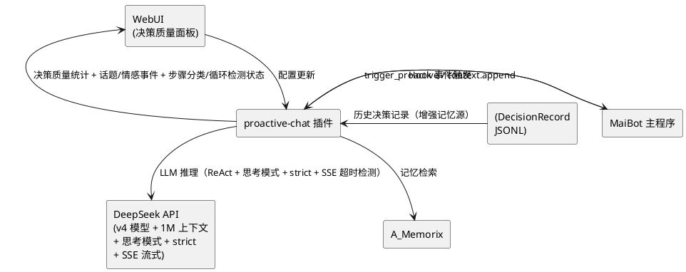

# 4. DFX 约束

## 4.1 性能

1. 话题追踪分析 SHALL 在 perceive 阶段内完成，额外耗时不超过 500ms
2. 情感分析 SHALL 在 perceive 阶段内完成，额外耗时不超过 300ms
3. 参与者画像更新 SHALL 在 perceive 阶段内完成，额外耗时不超过 200ms
4. 记忆增强注入的格式化处理 SHALL 在 50ms 内完成（纯本地操作）
5. ReAct 循环总耗时 SHALL 不超过 30 秒（含新增工具调用，不变）
6. 新增感知工具的单次执行耗时 SHALL 不超过 10 秒
7. 步骤分类器的分类判定 SHALL 在 10ms 内完成（纯本地逻辑判断）
8. 循环检测的签名计算和 n-gram 分析 SHALL 在 50ms 内完成
9. reasoning_effort 自适应调节的计算 SHALL 在 10ms 内完成（纯本地计算）
10. SSE 超时检测 SHALL 不增加额外的 API 调用延迟

## 4.2 可靠性

1. 话题追踪分析失败 SHALL 不影响决策循环的正常执行（降级为无话题信息）
2. 情感分析失败 SHALL 不影响决策循环的正常执行（降级为无情感信息）
3. 参与者画像更新失败 SHALL 不影响决策循环的正常执行（使用上次的缓存画像）
4. 自适应步数计算异常 SHALL 降级为配置的默认 max_react_steps
5. 记忆增强注入格式化失败 SHALL 降级为 v3.1 的原始格式
6. 新增感知工具执行失败 SHALL 遵循现有工具错误处理逻辑（返回错误信息给 LLM）
7. reasoning_content 回传失败（API 返回 400）SHALL 自动补全 reasoning_content 后重试，重试耗尽后降级为非思考模式
8. 步骤分类器分类失败 SHALL 降级为 v3.1 的简单 has_tool_calls 判断
9. 循环检测误判 SHALL 不中断 ReAct 循环，仅记录警告日志
10. strict 模式 API 调用失败 SHALL 自动降级为非 strict 模式重试
11. SSE 超时触发后 SHALL 按指数退避策略重试，重试耗尽后降级为非流式调用

## 4.3 安全性

1. 新增感知工具 SHALL 只能执行只读查询，禁止任何写操作（与 v3.1 一致）
2. 参与者画像数据 SHALL 仅缓存在内存中，不持久化到磁盘
3. 情感分析结果 SHALL 不包含用户原始消息内容（仅包含极性标签和置信度）
4. 话题追踪状态 SHALL 不持久化到磁盘（重启后重新构建）
5. reasoning_content（思维链内容）SHALL 仅记录到调试日志，不通过事件总线广播给 WebUI
6. strict 模式 SHALL 仅影响工具调用的参数格式约束，不改变工具的执行权限

## 4.4 可维护性

1. 新增感知工具 SHALL 采用声明式注册，与现有 AgentTool 注册机制一致
2. 话题追踪、情感分析的提示词 SHALL 通过 prompts.py 中的常量管理，便于调试和修改
3. 决策质量统计指标 SHALL 通过事件总线广播，WebUI 可订阅展示
4. 自适应步数的阈值 SHALL 通过配置项调整，无需修改代码
5. 记忆增强注入的格式模板 SHALL 通过 prompts.py 中的常量管理
6. 步骤分类器的分类规则 SHALL 通过配置项调整分类阈值，无需修改代码
7. 循环检测的重复阈值和 n-gram 窗口大小 SHALL 通过配置项调整
8. DeepSeek 专用 prompt 模板 SHALL 通过 prompts.py 中的常量管理
9. SSE 超时时间和重试策略参数 SHALL 通过配置项调整
10. reasoning_effort 自适应调节的复杂度评估权重 SHALL 通过配置项调整

## 4.5 兼容性

1. v3.2 SHALL 向后兼容 v3.1 的所有配置格式（新增配置段有默认值）
2. v3.2 SHALL 向后兼容 v3.1 的 DecisionRecord 格式（不新增持久化字段）
3. 不启用任何 v3.2 新功能时，v3.2 的行为 SHALL 与 v3.1 完全一致
4. v3.2 的 WebUI SHALL 同时展示 v3.1 和 v3.2 的决策记录
5. v3.2 新增的感知工具 SHALL 不影响现有工具的定义和执行
6. v3.2 的记忆增强注入 SHALL 在记忆未启用时与 v3.1 行为一致
7. v3.2 的 DeepSeek 深度优化 SHALL 在 deepseek_v4.thinking_enabled 为 False 时与 v3.1 行为一致
8. v3.2 的 strict 模式 SHALL 在 strict_mode_enabled 为 False 时与 v3.1 行为一致
9. v3.2 的步骤分类器 SHALL 在 step_classifier_enabled 为 False 时降级为 v3.1 的 has_tool_calls 判断
10. v3.2 的循环检测 SHALL 在 loop_detection_enabled 为 False 时与 v3.1 行为一致
11. DeepSeek 专用 prompt SHALL 在 deepseek_prompt_enabled 为 False 时使用 v3.1 的通用提示词

# 5. 核心能力

## 5.1 reasoning_content 回传健壮性

### 5.1.1 业务规则

1. **工具调用轮次 reasoning_content 必须回传**：When 思考模式启用且 LLM 响应包含工具调用和 reasoning_content，the 适配模块 SHALL 将该轮次的 reasoning_content 在后续所有请求中完整回传
   - 验收条件：工具调用轮次返回 reasoning_content → 后续请求的对应 assistant 消息中包含 reasoning_content → API 不返回 400 错误

2. **非工具调用轮次 reasoning_content 不回传**：When 思考模式启用且 LLM 响应不包含工具调用，the 适配模块 SHALL 不将该轮次的 reasoning_content 在后续请求中回传（DeepSeek API 会自动忽略）
   - 验收条件：非工具调用轮次的 reasoning_content 不出现在后续请求消息中 → API 调用正常

3. **简化回传写法**：When 追加 assistant 消息到消息历史，the 适配模块 SHALL 使用 `messages.append(response.choices[0].message)` 的等效写法，自动包含 reasoning_content 和 tool_calls 等所有字段
   - 验收条件：assistant 消息包含 role、content、tool_calls、reasoning_content 等所有返回字段 → 无字段遗漏

4. **回传遗漏自动修复**：If DeepSeek API 因 reasoning_content 回传遗漏返回 400 错误，the 适配模块 SHALL 捕获错误、自动补全遗漏的 reasoning_content 并重试
   - 验收条件：400 错误 → 自动补全 reasoning_content → 重试成功 → 记录警告日志

5. **回传完整性验证**：When ReAct 循环构建请求消息列表，the 适配模块 SHALL 验证所有包含工具调用的 assistant 消息均携带 reasoning_content
   - 验收条件：消息列表构建完成 → 遍历所有 assistant 消息 → 工具调用消息均包含 reasoning_content → 无遗漏

6. **回传健壮性启用控制**：Where 配置项 `deepseek_optimization.robust_reasoning_enabled` 为 True，the 适配模块 SHALL 启用 reasoning_content 回传健壮性增强
   - 验收条件：robust_reasoning_enabled=True → 回传完整性验证和自动修复启用；robust_reasoning_enabled=False → 使用 v3.1 的基础回传逻辑

7. **禁止项**：reasoning_content 回传逻辑 SHALL 不修改 reasoning_content 的原始内容
   - 验收条件：回传的 reasoning_content 与 API 返回的原始内容完全一致

### 5.1.2 交互流程

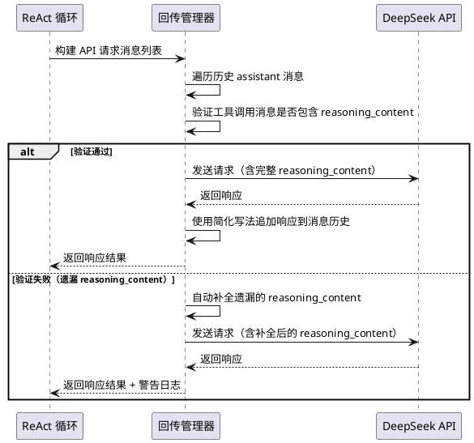

### 5.1.3 异常场景

1. **400 错误自动修复失败**
   - 触发条件：自动补全 reasoning_content 后重试仍返回 400 错误
   - 系统行为：降级为非思考模式重新执行当前 ReAct 步骤，记录错误日志
   - 用户感知：决策循环继续执行（非思考模式），日志中出现回传修复失败警告

2. **reasoning_content 内容过大导致 token 溢出**
   - 触发条件：回传的 reasoning_content 累积 token 数超过上下文窗口
   - 系统行为：截断最早的 reasoning_content（保留最近 N 轮），记录警告日志
   - 用户感知：早期思维链信息可能丢失，决策循环正常执行

3. **简化写法追加消息时字段缺失**
   - 触发条件：API 返回的 message 对象缺少预期字段（如 tool_calls 为 None）
   - 系统行为：使用默认值填充缺失字段（tool_calls 默认为空列表），记录调试日志
   - 用户感知：无感知（自动处理）

## 5.2 reasoning_effort 自适应调节

### 5.2.1 业务规则

1. **场景复杂度评估**：When ReAct 循环启动或每步执行前，the 适配模块 SHALL 评估当前决策场景的复杂度
   - 评估维度：信号数量、消息数量、话题关联度、情感复杂度、历史决策记忆条数
   - 简单场景（1 个信号、消息少于 5 条、无复杂情感）：复杂度低
   - 普通场景（1-2 个信号、消息 5-15 条、有情感转折）：复杂度中
   - 复杂场景（3+ 个信号、消息 15+ 条、多话题切换、情感复杂）：复杂度高
   - 验收条件：3 个信号 + 20 条消息 + 情感转折 → 复杂度高

2. **effort 级别映射**：the 适配模块 SHALL 根据场景复杂度映射 reasoning_effort 参数
   - 复杂度低 → reasoning_effort=high
   - 复杂度中 → reasoning_effort=high（默认）
   - 复杂度高 → reasoning_effort=max
   - 工具调用轮次（ReAct 循环中 step > 1）→ reasoning_effort=max（覆盖复杂度评估）
   - 验收条件：复杂度低 + 非工具调用轮次 → effort=high；复杂度高 + 非工具调用轮次 → effort=max

3. **effort 参数值约束**：the 适配模块 SHALL 仅传递 DeepSeek API 支持的 reasoning_effort 值（high/max）
   - low/medium 映射为 high
   - xhigh 映射为 max
   - 验收条件：配置值 reasoning_effort=low → 实际传递 effort=high

4. **effort 动态切换**：When ReAct 循环执行过程中场景复杂度发生变化，the 适配模块 SHALL 动态调整后续步骤的 reasoning_effort
   - 验收条件：步骤 1 复杂度低 → effort=high → 步骤 2 检测到工具调用 → effort=max

5. **effort 自适应启用控制**：Where 配置项 `deepseek_optimization.adaptive_effort_enabled` 为 True，the 适配模块 SHALL 启用 reasoning_effort 自适应调节
   - 验收条件：adaptive_effort_enabled=True → 根据复杂度动态调节 effort；adaptive_effort_enabled=False → 使用 v3.1 的固定逻辑（工具调用轮次 max，其余 high）

6. **禁止项**：reasoning_effort 自适应调节 SHALL 不在非思考模式下传递 reasoning_effort 参数
   - 验收条件：thinking_enabled=False → API 请求体中不包含 reasoning_effort 字段

### 5.2.2 交互流程

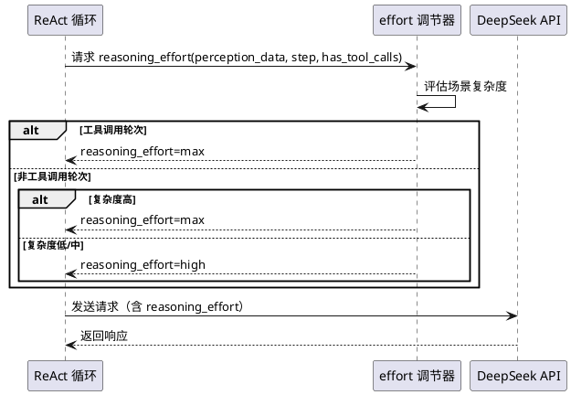

### 5.2.3 异常场景

1. **场景复杂度评估异常**
   - 触发条件：感知数据为空或格式异常导致无法评估复杂度
   - 系统行为：降级为默认值 high，记录警告日志
   - 用户感知：决策循环使用默认 effort 执行

2. **reasoning_effort 参数无效**
   - 触发条件：配置或计算得到的 reasoning_effort 值不在 high/max 范围内
   - 系统行为：映射为最接近的有效值（low/medium→high, xhigh→max），记录警告日志
   - 用户感知：决策循环正常执行

## 5.3 步骤分类器

### 5.3.1 业务规则

1. **步骤分类**：When ReAct 循环中 LLM 返回响应，the 步骤分类器 SHALL 将助手步骤分为以下类别：
   - **final**：LLM 返回 submit_decision 或明确的最终决策（无工具调用，content 包含决策结果）
   - **continue**：LLM 返回工具调用，需要继续执行
   - **tool-call**：LLM 返回有效的工具调用（与 continue 的区别在于 tool-call 侧重分类，continue 侧重流程控制）
   - **filtered**：LLM 返回的内容被过滤（如包含不安全内容、格式异常但可恢复）
   - **think-only**：思考模式下 LLM 仅返回 reasoning_content，content 为空且无工具调用
   - **invalid**：LLM 返回无法解析的响应（content 和 tool_calls 均为空或格式严重异常）
   - **failed**：LLM 调用本身失败（API 错误、超时等）
   - 验收条件：LLM 返回工具调用 → 分类为 tool-call；LLM 返回空 content + 空 tool_calls + 有 reasoning_content → 分类为 think-only

2. **分类驱动的处理策略**：When 步骤分类完成，the ReAct 循环 SHALL 根据分类结果执行不同的处理策略
   - final：结束 ReAct 循环，解析决策结果
   - tool-call/continue：执行工具调用，追加结果到消息历史，继续循环
   - filtered：记录警告，重新提示 LLM（不消耗步数）
   - think-only：追加 reasoning_content 到消息历史，重新请求 LLM（消耗步数）
   - invalid：记录错误，重新提示 LLM（最多重试 2 次，不消耗步数）
   - failed：根据重试策略处理
   - 验收条件：分类为 think-only → 追加 reasoning_content → 重新请求 LLM → 步数 +1

3. **think-only 步骤处理**：When 思考模式下 LLM 返回 think-only 步骤（仅有 reasoning_content，无 content 和 tool_calls），the ReAct 循环 SHALL 将 reasoning_content 作为 assistant 消息追加到消息历史并重新请求 LLM
   - 验收条件：think-only 步骤 → 追加 {"role": "assistant", "content": "", "reasoning_content": "..."} → 重新调用 LLM

4. **filtered 步骤处理**：When LLM 返回的内容被分类为 filtered，the ReAct 循环 SHALL 追加一条系统消息提示 LLM 调整输出格式，不消耗步数
   - 验收条件：filtered 步骤 → 追加 {"role": "user", "content": "请调整输出格式，确保符合要求"} → 步数不变

5. **invalid 步骤重试限制**：When 连续出现 invalid 步骤，the ReAct 循环 SHALL 最多重试 2 次，重试耗尽后结束循环并返回错误
   - 验收条件：连续 3 次 invalid → 结束循环 → action_taken="error_invalid_response"

6. **步骤分类器启用控制**：Where 配置项 `deepseek_optimization.step_classifier_enabled` 为 True，the 步骤分类器 SHALL 启用步骤分类
   - 验收条件：step_classifier_enabled=True → ReAct 循环使用步骤分类器；step_classifier_enabled=False → 使用 v3.1 的 has_tool_calls 判断

7. **禁止项**：步骤分类器 SHALL 不修改 LLM 的原始响应内容
   - 验收条件：分类后的响应内容与 API 返回的原始内容一致

### 5.3.2 交互流程

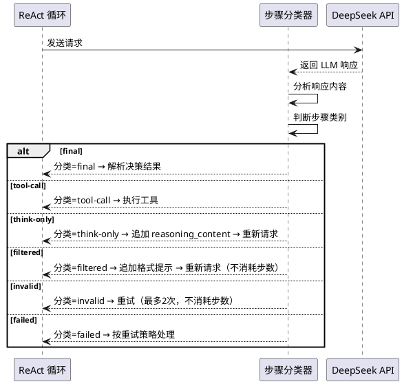

### 5.3.3 异常场景

1. **步骤分类器判断失败**
   - 触发条件：LLM 响应格式异常，无法确定分类
   - 系统行为：降级为 v3.1 的 has_tool_calls 判断，记录警告日志
   - 用户感知：决策循环使用简单判断继续执行

2. **think-only 步骤连续出现**
   - 触发条件：连续 3 次以上 think-only 步骤，LLM 陷入仅思考不输出状态
   - 系统行为：追加提示"请直接给出最终决策或调用工具"，若仍为 think-only 则结束循环
   - 用户感知：决策循环可能提前结束，action_taken="error_think_only_loop"

3. **filtered 步骤连续出现**
   - 触发条件：连续 2 次以上 filtered 步骤
   - 系统行为：降级为普通步骤处理（视为 continue），记录警告日志
   - 用户感知：决策循环继续执行

## 5.4 循环检测

### 5.4.1 业务规则

1. **重复步骤签名检测**：When ReAct 循环执行工具调用，the 循环检测模块 SHALL 计算工具调用的步骤签名（tool_name + 参数哈希），并检测重复签名
   - 验收条件：连续 3 次调用 get_recent_messages(limit=10) → 签名相同 → 检测到循环

2. **重复签名阈值**：the 循环检测模块 SHALL 在同一签名的出现次数超过配置项 `deepseek_optimization.repeated_step_threshold`（默认 3）时判定为循环
   - 验收条件：repeated_step_threshold=3 → 同一签名第 3 次出现 → 判定为循环

3. **n-gram 文本循环检测**：When LLM 返回文本响应，the 循环检测模块 SHALL 检测响应文本中的 n-gram 重复模式
   - 检测窗口：3-gram 或 4-gram
   - 判定条件：同一 n-gram 在响应中出现次数超过阈值（默认 3 次）
   - 验收条件：LLM 输出中 "我认为应该" 出现 4 次 → 检测到文本循环

4. **循环中断策略**：When 检测到循环，the ReAct 循环 SHALL 执行以下策略：
   - 重复步骤签名循环：拒绝当前工具调用，返回错误信息给 LLM，提示换策略
   - n-gram 文本循环：追加系统消息提示 LLM 避免重复表述
   - 验收条件：重复步骤签名循环 → 工具调用被拒绝 → LLM 收到"重复调用同一工具，请尝试其他策略"

5. **循环检测与步数的关系**：the 循环检测 SHALL 独立于自适应步数机制，循环检测触发不消耗步数
   - 验收条件：循环检测触发 → 步数计数不变 → ReAct 循环继续

6. **循环检测启用控制**：Where 配置项 `deepseek_optimization.loop_detection_enabled` 为 True，the 循环检测模块 SHALL 启用循环检测
   - 验收条件：loop_detection_enabled=True → ReAct 循环包含循环检测；loop_detection_enabled=False → 无循环检测

7. **禁止项**：循环检测 SHALL 不修改 LLM 的原始响应内容或工具调用参数
   - 验收条件：循环检测仅影响是否执行工具调用，不修改工具调用参数

### 5.4.2 交互流程

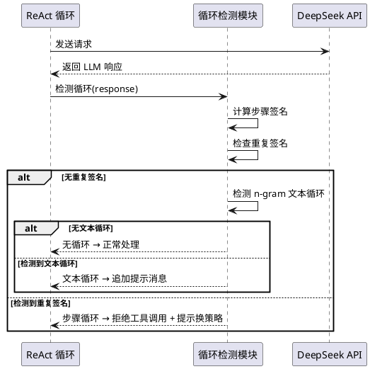

### 5.4.3 异常场景

1. **步骤签名哈希冲突**
   - 触发条件：不同参数的工具调用产生相同的签名哈希
   - 系统行为：允许调用，记录调试日志（哈希冲突率极低）
   - 用户感知：工具正常执行

2. **n-gram 检测误判**
   - 触发条件：LLM 合理地重复使用某些短语（如列表项的开头）
   - 系统行为：仅当重复次数显著超过阈值（2 倍以上）时才触发循环中断
   - 用户感知：正常重复表述不会被误判为循环

3. **循环检测导致 ReAct 循环无法结束**
   - 触发条件：LLM 持续尝试不同的工具调用策略，但每次都被循环检测拦截
   - 系统行为：连续 3 次循环检测触发后，强制结束 ReAct 循环，返回当前最佳决策
   - 用户感知：决策循环提前结束，action_taken 包含 "loop_detected" 标记

## 5.5 strict 模式集成

### 5.5.1 业务规则

1. **strict 模式启用**：When 配置项 `deepseek_optimization.strict_mode_enabled` 为 True，the 适配模块 SHALL 在工具调用中使用 strict 模式
   - 验收条件：strict_mode_enabled=True → API 请求使用 beta base_url（https://api.deepseek.com/beta）→ 工具定义包含 strict: true → additionalProperties: false

2. **strict 模式工具定义**：When strict 模式启用，the 适配模块 SHALL 为每个工具的 function 定义添加 strict: true 和 parameters.additionalProperties: false
   - 验收条件：工具定义中 function.strict=True → function.parameters.additionalProperties=False

3. **strict 模式参数格式保证**：When strict 模式启用，DeepSeek API SHALL 保证工具调用参数严格遵循 JSON Schema 定义，不包含额外字段
   - 验收条件：strict 模式下工具调用参数 → 无额外字段 → 参数解析成功率提升

4. **strict 模式降级**：If strict 模式下 API 调用返回错误（如 beta 端点不可用），the 适配模块 SHALL 自动降级为非 strict 模式重试
   - 验收条件：strict 模式 API 错误 → 降级为非 strict 模式 → 重试成功 → 记录警告日志

5. **strict 模式与思考模式组合**：When strict 模式和思考模式同时启用，the 适配模块 SHALL 确保两者兼容（beta base_url + thinking 参数）
   - 验收条件：strict_mode_enabled=True + thinking_enabled=True → API 请求同时包含 beta base_url 和 thinking 参数 → 响应正常

6. **strict 模式 JSON Schema 支持**：the strict 模式 SHALL 支持 DeepSeek API 的完整 JSON Schema 类型：object/string/number/integer/boolean/array/enum/anyOf/$ref/$def
   - 验收条件：工具参数使用 enum 类型 → strict 模式下参数值严格匹配枚举值

7. **禁止项**：strict 模式 SHALL 不改变工具的执行逻辑，仅影响参数格式约束
   - 验收条件：strict 模式下工具执行逻辑与非 strict 模式完全一致

### 5.5.2 交互流程

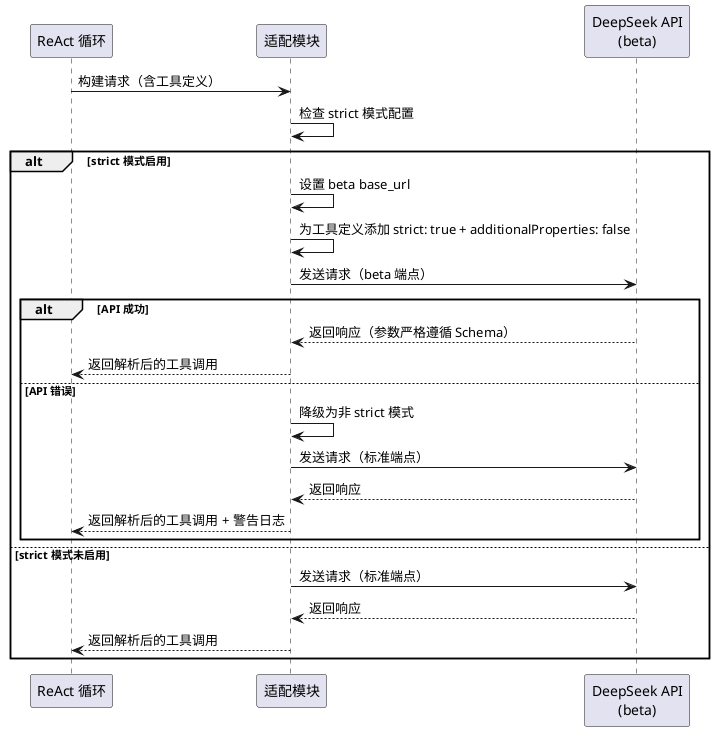

### 5.5.3 异常场景

1. **beta 端点不可用**
   - 触发条件：DeepSeek API 的 beta 端点返回 404 或 503
   - 系统行为：自动降级为标准端点重试，记录警告日志
   - 用户感知：决策循环正常执行（非 strict 模式）

2. **strict 模式下工具定义不兼容**
   - 触发条件：工具的 JSON Schema 包含 DeepSeek strict 模式不支持的特性
   - 系统行为：移除不支持的特性后重试，若仍失败则降级为非 strict 模式
   - 用户感知：工具参数约束可能略有放宽

3. **strict 模式 + 思考模式组合冲突**
   - 触发条件：beta base_url 与 thinking 参数组合导致 API 错误
   - 系统行为：优先保留思考模式，降级 strict 模式，记录警告日志
   - 用户感知：决策循环在思考模式下正常执行，无 strict 约束

## 5.6 思考模式参数兼容

### 5.6.1 业务规则

1. **参数互斥标记**：When 思考模式启用，the 适配模块 SHALL 在配置层标记以下参数与思考模式互斥：temperature、top_p、presence_penalty、frequency_penalty
   - 验收条件：thinking_enabled=True → 配置中标记互斥参数 → 请求构建时自动跳过这些参数

2. **参数自动移除**：When 思考模式启用，the 适配模块 SHALL 在发送 API 请求前自动移除互斥参数，不传递给 DeepSeek API
   - 验收条件：thinking_enabled=True → API 请求体中不包含 temperature、top_p、presence_penalty、frequency_penalty 字段

3. **参数互斥警告**：When 用户配置中同时启用了思考模式和设置了互斥参数值，the 适配模块 SHALL 在启动时记录警告日志
   - 验收条件：thinking_enabled=True + temperature=0.7 → 启动日志中出现"思考模式下 temperature 参数不生效"警告

4. **非思考模式参数恢复**：When 思考模式未启用，the 适配模块 SHALL 正常传递所有参数
   - 验收条件：thinking_enabled=False → API 请求体中包含 temperature 和 top_p 字段

5. **禁止项**：思考模式参数兼容处理 SHALL 不修改用户配置文件中的参数值
   - 验收条件：用户配置中 temperature=0.7 → 思考模式启用时 API 请求不携带 temperature → 配置文件中 temperature 仍为 0.7

### 5.6.2 交互流程

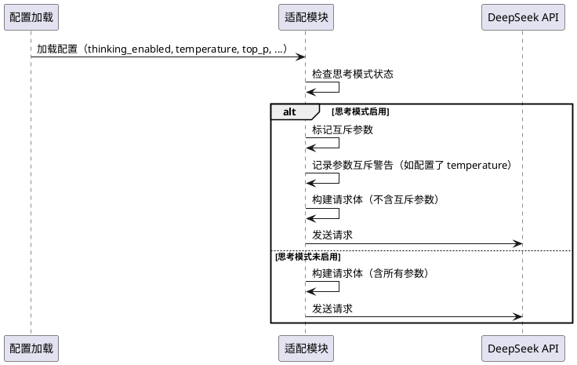

### 5.6.3 异常场景

1. **运行时思考模式切换导致参数状态不一致**
   - 触发条件：ReAct 循环中动态切换思考模式开关
   - 系统行为：每次 API 调用前重新检查思考模式状态，确保参数一致性
   - 用户感知：无感知（每次调用独立检查）

2. **第三方代码传递了互斥参数**
   - 触发条件：其他模块调用 DeepSeekClient 时传递了 temperature 参数，但思考模式已启用
   - 系统行为：适配模块在请求构建时统一移除互斥参数，记录调试日志
   - 用户感知：无感知（自动处理）

## 5.7 DeepSeek 专用 prompt 优化

### 5.7.1 业务规则

1. **6 步工作流注入**：When DeepSeek 专用 prompt 启用，the 提示词模块 SHALL 在系统提示词中注入 6 步工作流指导
   - 步骤：Understand（理解场景）→ Explore（探索信息）→ Plan（制定计划）→ Execute（执行决策）→ Verify（验证结果）→ Summarize（总结输出）
   - 验收条件：deepseek_prompt_enabled=True → 系统提示词包含 6 步工作流指导 → LLM 按步骤执行

2. **5 步工具使用协议**：When DeepSeek 专用 prompt 启用且 ReAct 循环包含工具定义，the 提示词模块 SHALL 注入 5 步工具使用协议
   - 步骤：(1) 确认需要什么信息 → (2) 选择合适的工具 → (3) 构造正确的参数 → (4) 执行工具并分析结果 → (5) 基于结果做出决策
   - 验收条件：deepseek_prompt_enabled=True + react_enabled=True → 系统提示词包含 5 步工具使用协议

3. **模型感知适配**：When 检测到当前使用 DeepSeek 模型家族，the 提示词模块 SHALL 自动应用 DeepSeek 专用 prompt 优化
   - 验收条件：model 包含 "deepseek" → 自动启用 DeepSeek 专用 prompt（即使 deepseek_prompt_enabled 未显式配置）

4. **专用 prompt 与通用 prompt 的兼容**：When DeepSeek 专用 prompt 启用，the 提示词模块 SHALL 在通用提示词的基础上追加专用指导，不替换通用提示词的核心内容
   - 验收条件：DeepSeek 专用 prompt 启用 → 系统提示词包含通用内容 + DeepSeek 专用工作流指导

5. **专用 prompt 分段组织**：the DeepSeek 专用 prompt SHALL 按功能分段组织，与通用提示词的分段结构一致
   - 验收条件：DeepSeek 专用 prompt 包含"工作流指导"和"工具使用协议"两个独立分段

6. **DeepSeek 专用 prompt 启用控制**：Where 配置项 `deepseek_optimization.deepseek_prompt_enabled` 为 True，the 提示词模块 SHALL 使用 DeepSeek 专用 prompt 优化
   - 验收条件：deepseek_prompt_enabled=True → 系统提示词包含 DeepSeek 专用工作流和工具协议；deepseek_prompt_enabled=False → 使用 v3.1 的通用提示词

7. **禁止项**：DeepSeek 专用 prompt SHALL 不改变 LLM 的输出格式要求
   - 验收条件：专用 prompt 仍要求 JSON 格式输出，字段与 v3.1 一致

### 5.7.2 交互流程

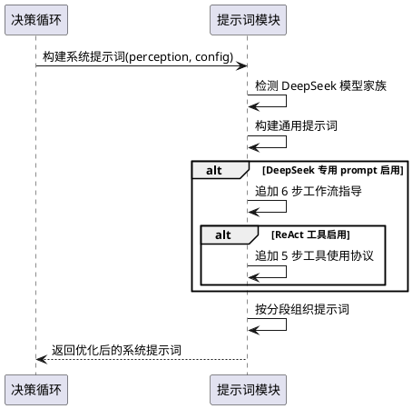

### 5.7.3 异常场景

1. **DeepSeek 专用 prompt 模板缺失**
   - 触发条件：prompts.py 中缺少 DeepSeek 专用 prompt 常量
   - 系统行为：降级为通用提示词，记录错误日志
   - 用户感知：系统提示词不包含 DeepSeek 专用工作流指导

2. **专用 prompt 注入后提示词超长**
   - 触发条件：通用提示词 + 专用 prompt 超过 token 预算
   - 系统行为：截断专用 prompt 的详细描述，保留核心指导要点
   - 用户感知：DeepSeek 专用指导可能不够详细

3. **非 DeepSeek 模型误触发专用 prompt**
   - 触发条件：模型名称包含 "deepseek" 但实际不是 DeepSeek API
   - 系统行为：正常注入专用 prompt（DeepSeek 专用 prompt 对其他模型通常无害）
   - 用户感知：无负面影响

## 5.8 SSE 超时与重试策略

### 5.8.1 业务规则

1. **SSE chunk 超时检测**：When DeepSeek API 使用 SSE 流式响应，the 适配模块 SHALL 检测 chunk 间隔超时
   - 默认超时时间：8 分钟（480 秒）
   - 验收条件：SSE 流中超过 480 秒未收到新 chunk → 判定为超时

2. **超时后指数退避重试**：When SSE 超时或 API 调用失败，the 适配模块 SHALL 按指数退避策略重试
   - 退避公式：base_delay * 2^k（k 为重试次数，从 0 开始）
   - 默认 base_delay：500ms
   - 最大重试次数：10 次
   - 最大退避时间：60 秒（超过 60 秒按 60 秒计算）
   - 验收条件：第 1 次重试延迟 500ms → 第 2 次延迟 1000ms → 第 3 次延迟 2000ms → ...

3. **重试耗尽降级**：When 指数退避重试耗尽（达到最大重试次数），the 适配模块 SHALL 降级处理
   - SSE 超时降级：尝试非流式调用
   - API 错误降级：记录错误日志，返回失败结果
   - 验收条件：10 次重试耗尽 → 尝试非流式调用 → 仍失败 → 返回错误

4. **SSE 超时时间配置**：the SSE chunk 超时时间 SHALL 通过配置项 `deepseek_optimization.sse_chunk_timeout_seconds` 调整
   - 验收条件：sse_chunk_timeout_seconds=300 → 超过 300 秒未收到 chunk → 判定为超时

5. **重试策略配置**：the 指数退避重试的参数 SHALL 通过配置项调整
   - base_delay：`deepseek_optimization.retry_base_delay_ms`（默认 500ms）
   - max_retries：`deepseek_optimization.retry_max_retries`（默认 10）
   - max_backoff：`deepseek_optimization.retry_max_backoff_ms`（默认 60000ms）
   - 验收条件：修改配置 → 重试策略按新参数执行

6. **SSE 超时与重试启用控制**：Where 配置项 `deepseek_optimization.enhanced_retry_enabled` 为 True，the 适配模块 SHALL 启用 SSE 超时检测和指数退避重试
   - 验收条件：enhanced_retry_enabled=True → SSE 流包含超时检测 + 失败使用指数退避重试；enhanced_retry_enabled=False → 使用 v3.1 的固定重试逻辑

7. **禁止项**：SSE 超时检测 SHALL 不影响正常的流式响应处理
   - 验收条件：正常 SSE 流（chunk 间隔 < 超时时间）→ 无额外延迟或中断

### 5.8.2 交互流程

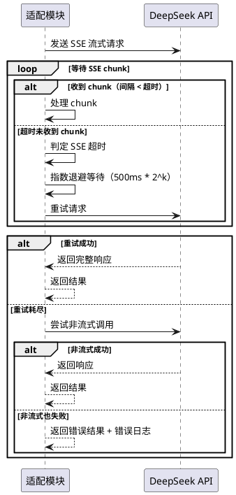

### 5.8.3 异常场景

1. **SSE 超时频繁触发**
   - 触发条件：网络不稳定导致 SSE chunk 频繁超时
   - 系统行为：按指数退避重试，若连续 3 次超时则尝试非流式调用
   - 用户感知：决策响应延迟增加，但最终能获取结果

2. **指数退避重试期间上下文变化**
   - 触发条件：重试等待期间消息历史发生变化
   - 系统行为：使用原始消息历史重试（不使用变更后的历史），确保请求一致性
   - 用户感知：无感知

3. **非流式降级也失败**
   - 触发条件：SSE 超时重试耗尽后非流式调用也失败
   - 系统行为：记录错误日志，返回失败结果，不阻塞决策循环
   - 用户感知：决策循环执行失败，action_taken="error_api_retry_exhausted"

4. **重试期间 DeepSeek API 恢复**
   - 触发条件：API 临时故障，重试期间恢复
   - 系统行为：重试成功，正常返回结果
   - 用户感知：决策响应有延迟但最终成功

## 5.9 话题追踪

### 5.9.1 业务规则

1. **话题识别**：When perceive 阶段获取到近期消息，the 话题追踪模块 SHALL 从消息中识别当前讨论的主要话题
   - 验收条件：聊天流正在讨论"Python 异步编程" → 话题追踪返回 topic="Python 异步编程"

2. **话题切换检测**：When 近期消息中出现明显的话题变更，the 话题追踪模块 SHALL 检测话题切换事件
   - 验收条件：对话从"Python 异步编程"切换到"周末计划" → 返回 topic_changed=True，previous_topic="Python 异步编程"，current_topic="周末计划"

3. **话题关联度评分**：When 话题追踪识别到当前话题，the 话题追踪模块 SHALL 评估当前话题与 bot 角色/知识领域的关联度
   - 验收条件：bot 角色为技术助手 → 讨论"Python 异步编程" → topic_relevance=0.9；讨论"周末计划" → topic_relevance=0.2

4. **话题信息注入**：When 话题追踪完成分析，the 话题追踪模块 SHALL 将话题信息注入到 perceive 阶段的用户提示词中
   - 验收条件：话题追踪启用 → 用户提示词中包含"[话题追踪]"段落 → 段落包含当前话题、关联度评分

5. **话题追踪启用控制**：Where 配置项 `agent_optimization.topic_tracking_enabled` 为 True，the 话题追踪模块 SHALL 在 perceive 阶段执行话题分析
   - 验收条件：topic_tracking_enabled=True → perceive 阶段包含话题分析；topic_tracking_enabled=False → perceive 阶段跳过话题分析

6. **无话题时的降级**：If 近期消息过少或无法识别明确话题，the 话题追踪模块 SHALL 返回空话题信息，不注入话题段落
   - 验收条件：聊天流仅有 1 条消息 → 话题追踪返回空 → 提示词中无话题段落

7. **禁止项**：the 话题追踪模块 SHALL 不持久化话题状态到磁盘
   - 验收条件：插件重启后话题追踪状态为空，需重新从消息中分析

### 5.9.2 交互流程

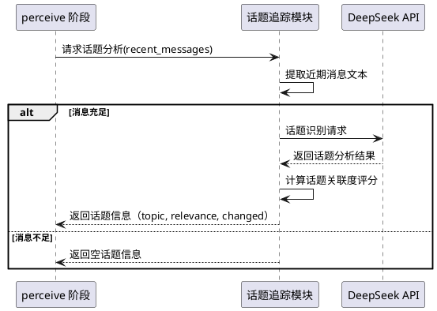

### 5.9.3 异常场景

1. **话题识别 LLM 调用失败**
   - 触发条件：DeepSeek API 返回错误或超时
   - 系统行为：跳过话题追踪，不注入话题段落，记录警告日志
   - 用户感知：决策循环正常执行（无话题辅助），日志中出现话题追踪失败警告

2. **话题识别返回无法解析的结果**
   - 触发条件：LLM 返回的 JSON 格式不合法或缺少必要字段
   - 系统行为：跳过话题追踪，不注入话题段落，记录警告日志
   - 用户感知：决策循环正常执行

3. **话题关联度评分异常**
   - 触发条件：评分值不在 0.0-1.0 范围内
   - 系统行为：将评分截断到 [0.0, 1.0] 范围
   - 用户感知：话题关联度评分正常显示

## 5.10 情感分析

### 5.10.1 业务规则

1. **情感极性识别**：When perceive 阶段获取到近期消息，the 情感分析模块 SHALL 识别对话的整体情感倾向
   - 验收条件：群聊中大家在开玩笑、使用表情包 → sentiment="positive"；群聊中出现抱怨 → sentiment="negative"；正常讨论 → sentiment="neutral"

2. **情感转折检测**：When 近期消息中出现明显的情感变化，the 情感分析模块 SHALL 检测情感转折点
   - 验收条件：对话从积极变为沮丧 → sentiment_shift=True，shift_direction="positive_to_negative"

3. **情感信息注入**：When 情感分析完成，the 情感分析模块 SHALL 将情感信息注入到 perceive 阶段的用户提示词中
   - 验收条件：情感分析启用 → 用户提示词中包含"[情感分析]"段落 → 段落包含情感极性和转折信息

4. **情感分析启用控制**：Where 配置项 `agent_optimization.sentiment_analysis_enabled` 为 True，the 情感分析模块 SHALL 在 perceive 阶段执行情感分析
   - 验收条件：sentiment_analysis_enabled=True → perceive 阶段包含情感分析；sentiment_analysis_enabled=False → perceive 阶段跳过情感分析

5. **情感与决策关联**：When 情感分析检测到消极情感，the 智能体 SHALL 在决策时考虑情感因素
   - 验收条件：sentiment="negative" → 智能体倾向于触发 silence_break 或 topic_supplement 以改善对话氛围

6. **禁止项**：the 情感分析模块 SHALL 不持久化情感分析结果到磁盘
   - 验收条件：情感分析结果仅在当次决策循环中使用

7. **禁止项**：the 情感分析模块 SHALL 不在提示词中包含用户原始消息内容
   - 验收条件：情感分析段落仅包含极性标签和置信度，不包含原始消息文本

### 5.10.2 交互流程

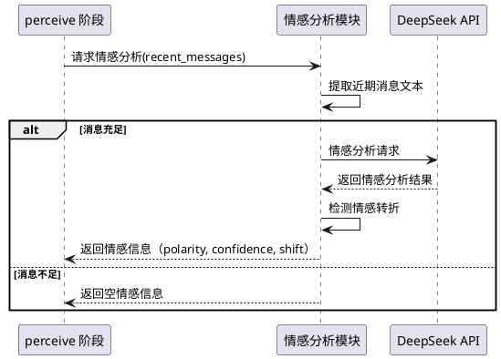

### 5.10.3 异常场景

1. **情感分析 LLM 调用失败**
   - 触发条件：DeepSeek API 返回错误或超时
   - 系统行为：跳过情感分析，不注入情感段落，记录警告日志
   - 用户感知：决策循环正常执行（无情感辅助）

2. **情感分析返回无法解析的结果**
   - 触发条件：LLM 返回的极性标签不在预定义值范围内
   - 系统行为：降级为 "neutral"，记录警告日志
   - 用户感知：情感分析段落显示为"中性"

## 5.11 参与者画像

### 5.11.1 业务规则

1. **画像构建**：When perceive 阶段获取到近期消息，the 参与者画像模块 SHALL 从消息中提取活跃参与者的行为特征
   - 验收条件：聊天流有 3 个活跃用户 → 画像包含 3 个参与者的发言频率和话题偏好

2. **画像数据结构**：the 参与者画像 SHALL 包含以下信息：参与者标识、发言频率（最近 N 分钟的消息数）、最近发言时间、与 bot 的互动模式（是否 @bot、是否提问）
   - 验收条件：画像数据包含 participant_id、message_frequency、last_active_at、interaction_pattern 字段

3. **画像注入**：When 参与者画像构建完成，the 参与者画像模块 SHALL 将画像摘要注入到 perceive 阶段的用户提示词中
   - 验收条件：画像启用 → 用户提示词中包含"[参与者画像]"段落 → 段落包含参与者行为摘要

4. **画像缓存**：the 参与者画像模块 SHALL 在内存中缓存画像数据，同一聊天流在冷却期内复用缓存
   - 验收条件：聊天流 A 在 5 分钟内第 2 次决策 → 复用缓存的画像数据

5. **画像启用控制**：Where 配置项 `agent_optimization.participant_profile_enabled` 为 True，the 参与者画像模块 SHALL 在 perceive 阶段构建参与者画像
   - 验收条件：participant_profile_enabled=True → perceive 阶段包含画像构建；participant_profile_enabled=False → perceive 阶段跳过画像构建

6. **画像容量限制**：the 参与者画像模块 SHALL 限制单次注入的参与者数量不超过配置项 `agent_optimization.participant_profile_max_entries` 的值
   - 验收条件：participant_profile_max_entries=5 → 聊天流有 8 个活跃用户 → 仅注入前 5 个画像

7. **禁止项**：the 参与者画像模块 SHALL 不持久化画像数据到磁盘
   - 验收条件：画像数据仅缓存在内存中，重启后清除

8. **禁止项**：the 参与者画像模块 SHALL 不使用外部用户画像服务
   - 验收条件：画像数据仅从当前聊天流的消息历史中提取

### 5.11.2 交互流程

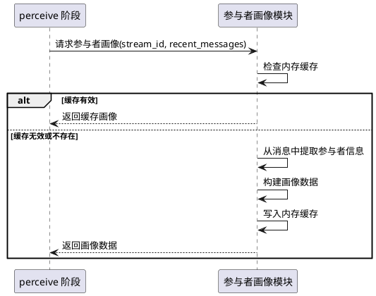

### 5.11.3 异常场景

1. **消息格式异常导致画像构建失败**
   - 触发条件：消息中缺少发送者信息
   - 系统行为：跳过该消息，继续处理其他消息，记录调试日志
   - 用户感知：画像数据可能不完整，决策循环正常执行

2. **缓存数据损坏**
   - 触发条件：内存中的画像数据因并发修改导致不一致
   - 系统行为：清除缓存，重新构建画像
   - 用户感知：无感知（自动恢复）

## 5.12 ReAct 循环效率优化

### 5.12.1 业务规则

1. **自适应步数**：When ReAct 循环启动，the 智能体 SHALL 根据感知数据的复杂度动态调整最大步数
   - 简单场景（仅 1 个信号、消息少于 5 条）：建议步数 1-2
   - 普通场景（1-2 个信号、消息 5-15 条）：建议步数 2-3
   - 复杂场景（3+ 个信号、消息 15+ 条）：建议步数 3-5
   - 验收条件：简单场景 → max_steps=2（不超过配置的 max_react_steps）；复杂场景 → max_steps=4

2. **工具调用引导优化**：When ReAct 循环首次调用 LLM，the 智能体 SHALL 在系统提示词中根据感知数据推荐优先使用的工具
   - 验收条件：检测到冷场信号 → 提示词建议"建议先查看群活跃度"；检测到 @bot → 提示词建议"建议先确认冷却状态"

3. **工具调用结果摘要**：When 工具返回的结果超过 1000 字符，the ReAct 循环 SHALL 自动生成摘要后再追加到消息历史
   - 验收条件：get_recent_messages 返回 3000 字符 → 摘要为 500 字符 → 追加到消息历史

4. **工具调用命中率统计**：the ReAct 循环 SHALL 统计每次决策循环中的工具调用命中率，通过事件总线广播
   - 验收条件：3 次工具调用中 2 次有效 → 命中率 66.7% → 广播 react_complete 事件包含 hit_rate 字段

5. **重复工具调用检测**：When ReAct 循环中 LLM 连续调用同一工具且参数相同，the 智能体 SHALL 拒绝第二次调用并提示 LLM 换策略
   - 验收条件：连续 2 次调用 get_recent_messages(limit=10) → 第二次返回"错误：重复调用同一工具，请尝试其他工具或提交决策"

6. **自适应步数启用控制**：Where 配置项 `agent_optimization.adaptive_steps_enabled` 为 True，the 智能体 SHALL 启用自适应步数
   - 验收条件：adaptive_steps_enabled=True → ReAct 循环使用动态步数；adaptive_steps_enabled=False → 使用配置的固定 max_react_steps

7. **禁止项**：自适应步数 SHALL 不超过配置的 max_react_steps 上限
   - 验收条件：max_react_steps=3 → 自适应步数最大为 3

### 5.12.2 交互流程

```plantuml
@startuml
participant "决策循环" as loop
participant "ReAct 引擎" as react
participant "DeepSeek API" as llm
participant "AgentTool 注册表" as tools

loop -> react : 启动 ReAct 循环
react -> react : 评估感知数据复杂度
react -> react : 计算自适应步数

loop while (步数 < adaptive_max 且 未决策) {
  react -> llm : 发送消息历史 + 工具定义 + 工具引导
  llm --> react : 返回 tool_use 或 finish
  
  alt tool_use（非重复）
    react -> tools : 执行 AgentTool
    tools --> react : 返回工具结果
    
    alt 结果超过 1000 字符
      react -> react : 生成结果摘要
    end
    
    react -> react : 追加摘要/结果到消息历史
  else tool_use（重复调用）
    react --> react : 返回重复调用错误
  else finish / submit_decision
    react --> loop : 返回 AnalysisResult + 效率指标
  end
}

@enduml
```

### 5.12.3 异常场景

1. **自适应步数计算异常**
   - 触发条件：感知数据为空或格式异常导致无法评估复杂度
   - 系统行为：降级为配置的默认 max_react_steps，记录警告日志
   - 用户感知：决策循环使用固定步数执行

2. **工具调用结果摘要 LLM 调用失败**
   - 触发条件：摘要生成时 DeepSeek API 返回错误
   - 系统行为：使用原始工具结果（截断到 2000 字符），不生成摘要
   - 用户感知：消息历史中包含截断的工具结果

3. **重复工具调用检测误判**
   - 触发条件：LLM 合理地以不同参数调用同一工具，但参数序列化后相同
   - 系统行为：允许调用，记录调试日志
   - 用户感知：工具正常执行

## 5.13 记忆增强注入

### 5.13.1 业务规则

1. **记忆分类**：When 智能体记忆模块提取历史决策摘要，the 记忆模块 SHALL 将记忆分为"已触发"和"未触发"两类
   - 验收条件：5 条历史决策中 2 条触发、3 条未触发 → 记忆列表中每条标注类别

2. **记忆上下文关联**：When 记忆注入到提示词，the 记忆模块 SHALL 按记忆与当前感知数据的关联度排序
   - 验收条件：当前检测到冷场信号 → 冷场相关的记忆排在前面 → 话题相关的记忆排在后面

3. **记忆去重**：When 多条记忆的摘要内容高度相似（语义重复），the 记忆模块 SHALL 仅保留权重最高的一条
   - 验收条件：3 条记忆摘要均为"意图: silence_break，原因: 冷场" → 仅保留权重最高（最近）的 1 条

4. **记忆容量动态调整**：When 提示词接近 token 预算，the 记忆模块 SHALL 动态减少注入的记忆条数
   - 验收条件：提示词 token 估算超过 80% 预算 → 记忆条数从 10 条减少到 5 条

5. **记忆格式增强**：the 记忆模块 SHALL 使用增强的格式模板注入记忆，包含分类标签和上下文关联提示
   - 验收条件：记忆段落包含"[已触发]"或"[未触发]"标签 → 每条记忆包含与当前场景的关联提示

6. **记忆增强启用控制**：Where 配置项 `agent_optimization.enhanced_memory_enabled` 为 True，the 记忆模块 SHALL 使用增强注入策略
   - 验收条件：enhanced_memory_enabled=True → 记忆使用增强格式和排序；enhanced_memory_enabled=False → 使用 v3.1 的原始格式

7. **向后兼容**：While 记忆增强未启用，the 记忆模块 SHALL 保持 v3.1 的记忆注入行为不变
   - 验收条件：enhanced_memory_enabled=False → 记忆格式和注入方式与 v3.1 完全一致

### 5.13.2 交互流程

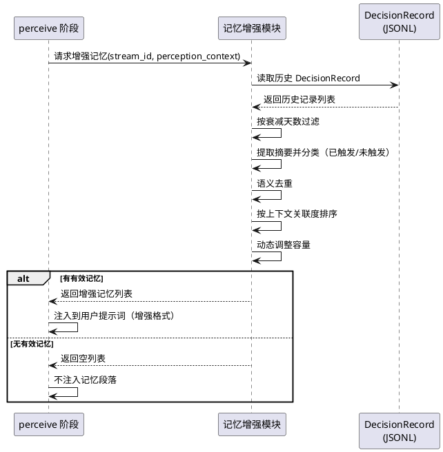

### 5.13.3 异常场景

1. **记忆去重计算异常**
   - 触发条件：语义相似度计算失败
   - 系统行为：跳过去重，保留所有记忆条目，记录警告日志
   - 用户感知：记忆条目可能包含重复内容，决策循环正常执行

2. **记忆容量动态调整导致无记忆注入**
   - 触发条件：提示词 token 预算极度紧张，动态调整后记忆条数为 0
   - 系统行为：不注入记忆段落，记录调试日志
   - 用户感知：决策无记忆辅助

3. **记忆分类标注缺失**
   - 触发条件：DecisionRecord 的 action_taken 字段为空，无法判断是否触发
   - 系统行为：标注为"[未知]"类别
   - 用户感知：记忆段落中出现"[未知]"标签

## 5.14 反思子智能体增强

### 5.14.1 业务规则

1. **多维度评估**：When 反思子智能体评估主智能体的决策，the 反思子智能体 SHALL 从以下维度进行评估：
   - 决策与感知数据的一致性（v3.1 已有）
   - 话题相关性（当前话题与触发意图的匹配度）
   - 时机合理性（当前对话节奏是否适合触发）
   - 重复触发风险（近期是否已有类似触发）
   - 验收条件：反思结果包含 consistency、topic_relevance、timing_rationality、duplicate_risk 四个维度的评分

2. **反思输入增强**：When 反思子智能体启动，the 主智能体 SHALL 将话题追踪和情感分析结果一并传递给反思子智能体
   - 验收条件：话题追踪启用 → 反思输入包含当前话题信息；情感分析启用 → 反思输入包含情感极性

3. **反思否决理由增强**：When 反思子智能体否决决策，the 反思结果 SHALL 包含具体的否决维度和理由
   - 验收条件：反思否决 → reason 包含"时机不合理：群聊正在热烈讨论中"或"重复触发风险：5 分钟前已触发类似意图"

4. **反思置信度加权**：When 反思子智能体返回评估结果，the 主智能体 SHALL 根据各维度评分的加权平均决定是否接受反思结论
   - 验收条件：consistency=0.9, topic_relevance=0.3, timing=0.5, duplicate_risk=0.2 → 加权平均 < 0.5 → 接受否决

5. **反思增强启用控制**：Where 配置项 `agent_optimization.enhanced_reflection_enabled` 为 True，the 反思子智能体 SHALL 使用增强评估维度
   - 验收条件：enhanced_reflection_enabled=True → 反思使用多维度评估；enhanced_reflection_enabled=False → 使用 v3.1 的基础评估

6. **禁止项**：反思子智能体 SHALL 不调用 AgentTool 或启动子智能体（与 v3.1 一致）
   - 验收条件：反思子智能体使用独立的系统提示词，不包含工具定义

### 5.14.2 交互流程

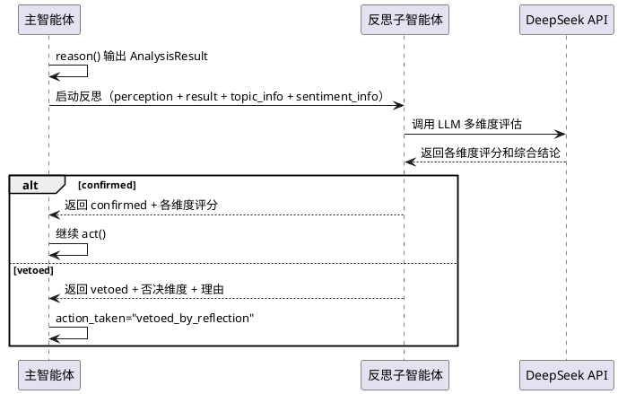

### 5.14.3 异常场景

1. **反思子智能体返回维度评分缺失**
   - 触发条件：LLM 返回的 JSON 缺少某些维度评分
   - 系统行为：缺失维度使用默认值 0.5（中性），记录调试日志
   - 用户感知：反思评估可能不够精确，决策循环正常执行

2. **反思加权计算异常**
   - 触发条件：维度评分值不在 0.0-1.0 范围内
   - 系统行为：将评分截断到 [0.0, 1.0] 范围后重新计算
   - 用户感知：反思结论正常返回

## 5.15 提示词优化

### 5.15.1 业务规则

1. **场景示例注入**：When 构建系统提示词，the 提示词模块 SHALL 根据当前感知到的信号类型注入对应的场景示例
   - 验收条件：检测到冷场信号 → 系统提示词中包含冷场打破的决策示例；检测到 @bot → 包含漏回补答的决策示例

2. **决策边界条件明确化**：the 系统提示词 SHALL 明确列出不应触发的边界条件
   - 验收条件：系统提示词包含"以下情况不应触发：对话节奏正常且 bot 已参与讨论、话题与 bot 无关且无冷场信号、冷却期内"等明确边界

3. **意图优先级动态调整**：When 多个信号同时存在，the 系统提示词 SHALL 根据信号强度动态调整意图优先级提示
   - 验收条件：同时检测到 @bot 和冷场 → 提示词强调 missed_reply 优先级最高

4. **提示词分段组织**：the 系统提示词 SHALL 按功能分段组织，每段有明确的标题和内容边界
   - 验收条件：系统提示词包含"角色信息"、"决策框架"、"场景定义"、"可用工具"、"决策边界"、"输出格式"等分段标题

5. **提示词优化启用控制**：Where 配置项 `agent_optimization.prompt_optimization_enabled` 为 True，the 提示词模块 SHALL 使用优化后的提示词策略
   - 验收条件：prompt_optimization_enabled=True → 系统提示词包含场景示例和决策边界；prompt_optimization_enabled=False → 使用 v3.1 的原始提示词

6. **禁止项**：提示词优化 SHALL 不改变 LLM 的输出格式要求
   - 验收条件：优化后的提示词仍要求 JSON 格式输出，字段与 v3.1 一致

### 5.15.2 交互流程

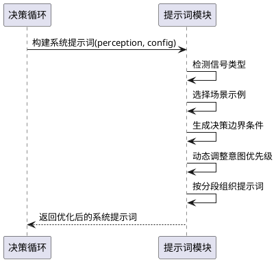

### 5.15.3 异常场景

1. **场景示例模板缺失**
   - 触发条件：检测到的信号类型无对应的场景示例模板
   - 系统行为：跳过该信号的示例注入，使用通用决策框架
   - 用户感知：系统提示词中缺少该信号的示例，决策循环正常执行

2. **提示词分段拼接后超长**
   - 触发条件：所有分段拼接后超过 token 预算
   - 系统行为：按优先级从低到高移除分段（优先保留角色信息和决策框架），直到在预算内
   - 用户感知：系统提示词可能缺少场景示例或决策边界段落

## 5.16 上下文感知压缩

### 5.16.1 业务规则

1. **相关性保留**：When 执行软剪枝，the 溢出管理器 SHALL 优先保留与当前感知信号相关的工具输出，而非仅按字符长度截断
   - 验收条件：2 条工具输出，1 条与冷场相关、1 条无关 → 软剪枝时优先截断无关的工具输出

2. **摘要质量提升**：When 执行 LLM 摘要压缩，the 溢出管理器 SHALL 在摘要提示词中包含当前感知信号，引导摘要保留与决策相关的信息
   - 验收条件：当前检测到冷场 → 摘要提示词包含"请重点保留与冷场和对话节奏相关的信息"

3. **感知信号标注**：When 消息历史中包含与当前感知信号相关的内容，the 溢出管理器 SHALL 在剪枝时标注这些消息的优先级
   - 验收条件：消息中包含 @bot 的内容 → 标注为高优先级 → 硬剪枝时最后被移除

4. **上下文感知压缩启用控制**：Where 配置项 `agent_optimization.context_aware_compress_enabled` 为 True，the 溢出管理器 SHALL 使用上下文感知压缩策略
   - 验收条件：context_aware_compress_enabled=True → 剪枝和压缩考虑内容相关性；context_aware_compress_enabled=False → 使用 v3.1 的按位置剪枝策略

5. **禁止项**：上下文感知压缩 SHALL 不修改原始消息历史（在副本上操作，与 v3.1 一致）
   - 验收条件：剪枝操作后，原始消息列表不变

### 5.16.2 交互流程

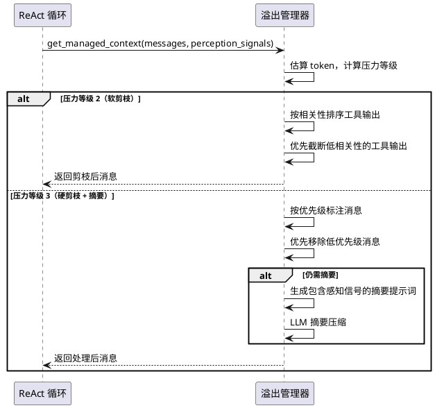

### 5.16.3 异常场景

1. **相关性排序失败**
   - 触发条件：感知信号为空或无法与消息内容匹配
   - 系统行为：降级为 v3.1 的按位置剪枝策略，记录调试日志
   - 用户感知：剪枝行为与 v3.1 一致

2. **摘要提示词注入感知信号后超长**
   - 触发条件：感知信号文本过长导致摘要提示词超过 token 预算
   - 系统行为：截断感知信号文本，保留前 200 字符
   - 用户感知：摘要可能未完全考虑所有感知信号

## 5.17 决策质量统计

### 5.17.1 业务规则

1. **触发准确率统计**：the 智能体 SHALL 统计最近 N 次决策中触发后未产生异常的比例
   - 验收条件：最近 100 次决策中 30 次触发、28 次正常、2 次异常 → 触发准确率 = 93.3%

2. **误触发率统计**：the 智能体 SHALL 统计最近 N 次决策中被反思否决或产生异常的触发比例
   - 验收条件：30 次触发中 2 次被反思否决、1 次异常 → 误触发率 = 10.0%

3. **漏触发率估算**：the 智能体 SHALL 统计最近 N 次决策中"未触发但存在明确信号"的比例
   - 验收条件：70 次未触发中 5 次存在 @bot 信号 → 漏触发率估算 = 7.1%

4. **效率指标统计**：the 智能体 SHALL 统计 ReAct 循环的平均步数、平均耗时、工具调用命中率
   - 验收条件：最近 100 次决策 → 平均步数 2.3、平均耗时 8.5s、工具命中率 85%

5. **统计信息广播**：When 决策循环完成，the 智能体 SHALL 通过事件总线广播决策质量指标
   - 验收条件：决策完成 → 广播 decision_quality 事件 → 包含准确率、误触发率、效率指标

6. **统计信息展示**：the WebUI SHALL 在统计面板中展示决策质量指标
   - 验收条件：WebUI 统计面板显示触发准确率、误触发率、漏触发率估算、ReAct 效率指标

7. **禁止项**：决策质量统计 SHALL 不持久化到磁盘（仅内存缓存，重启清除）
   - 验收条件：插件重启后统计数据归零

### 5.17.2 交互流程

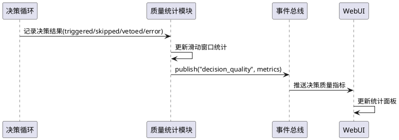

### 5.17.3 异常场景

1. **统计数据溢出**
   - 触发条件：滑动窗口内的决策次数超过整数上限
   - 系统行为：重置统计计数器，记录警告日志
   - 用户感知：WebUI 统计面板数据重置

2. **事件总线广播失败**
   - 触发条件：决策质量事件发布时事件总线异常
   - 系统行为：跳过广播，不影响决策循环
   - 用户感知：WebUI 统计面板可能暂时不更新

# 6. 数据约束

## 6.1 StepClassification（新增数据对象）

1. **category**：步骤分类，字符串，必须为 "final" / "continue" / "tool-call" / "filtered" / "think-only" / "invalid" / "failed" 之一
2. **tool_name**：工具名称，字符串，为空表示无工具调用
3. **has_reasoning_content**：是否包含 reasoning_content，布尔值
4. **has_content**：是否包含 content，布尔值
5. **signature**：步骤签名（tool_name + 参数哈希），字符串，为空表示无工具调用

## 6.2 LoopDetectionResult（新增数据对象）

1. **is_loop**：是否检测到循环，布尔值
2. **loop_type**：循环类型，字符串，可选值："repeated_step" / "ngram_text" / ""（无循环）
3. **repeated_signature**：重复的步骤签名，字符串，为空表示非步骤循环
4. **repeat_count**：重复次数，正整数
5. **ngram_pattern**：重复的 n-gram 模式，字符串，为空表示非文本循环

## 6.3 TopicInfo（新增数据对象）

1. **topic**：当前话题描述，字符串，最大 100 字符
2. **topic_relevance**：话题与 bot 角色/知识的关联度，浮点数，0.0-1.0
3. **topic_changed**：是否检测到话题切换，布尔值
4. **previous_topic**：切换前的话题，字符串，最大 100 字符，为空表示无切换
5. **confidence**：话题识别的置信度，浮点数，0.0-1.0

## 6.4 SentimentInfo（新增数据对象）

1. **polarity**：情感极性，字符串，必须为 "positive" / "neutral" / "negative" 之一
2. **confidence**：情感分析的置信度，浮点数，0.0-1.0
3. **sentiment_shift**：是否检测到情感转折，布尔值
4. **shift_direction**：情感转折方向，字符串，为空表示无转折，可选值："positive_to_negative" / "negative_to_positive" / "neutral_to_positive" / "neutral_to_negative"

## 6.5 ParticipantProfile（新增数据对象）

1. **participant_id**：参与者标识，字符串，非空
2. **message_frequency**：发言频率（最近 N 分钟的消息数），正整数
3. **last_active_at**：最近发言时间，Unix 时间戳
4. **interaction_pattern**：互动模式，字符串，可选值："frequent_asker" / "casual_talker" / "bot_interactor" / "unknown"
5. **mention_bot**：是否最近 @过 bot，布尔值

## 6.6 EnhancedReflectionResult（扩展 ReflectionResult）

在 v3.1 的 ReflectionResult 基础上新增：

1. **dimensions**：各维度评分，JSON 对象，包含 consistency、topic_relevance、timing_rationality、duplicate_risk 四个 0.0-1.0 浮点数
2. **veto_dimension**：否决的主要维度，字符串，为空表示未否决，可选值："consistency" / "topic_relevance" / "timing_rationality" / "duplicate_risk"

## 6.7 DecisionQualityMetrics（新增数据对象）

1. **trigger_accuracy**：触发准确率，浮点数，0.0-1.0
2. **false_trigger_rate**：误触发率，浮点数，0.0-1.0
3. **missed_trigger_rate**：漏触发率估算，浮点数，0.0-1.0
4. **avg_react_steps**：ReAct 平均步数，浮点数
5. **avg_decision_duration_ms**：平均决策耗时（毫秒），浮点数
6. **tool_hit_rate**：工具调用命中率，浮点数，0.0-1.0
7. **sample_size**：统计样本量，正整数

## 6.8 DeepseekOptimizationConfig（新增配置段）

1. **robust_reasoning_enabled**：是否启用 reasoning_content 回传健壮性增强，布尔值，默认 True
2. **adaptive_effort_enabled**：是否启用 reasoning_effort 自适应调节，布尔值，默认 True
3. **step_classifier_enabled**：是否启用步骤分类器，布尔值，默认 True
4. **loop_detection_enabled**：是否启用循环检测，布尔值，默认 True
5. **repeated_step_threshold**：重复步骤签名检测阈值，正整数，默认 3，范围 2-10
6. **ngram_window_size**：n-gram 文本循环检测窗口大小，正整数，默认 3，范围 2-5
7. **ngram_repeat_threshold**：n-gram 重复次数阈值，正整数，默认 3，范围 2-10
8. **strict_mode_enabled**：是否启用 strict 模式，布尔值，默认 False（v3.1 为 Beta 不实现，v3.2 正式集成但默认关闭）
9. **deepseek_prompt_enabled**：是否启用 DeepSeek 专用 prompt 优化，布尔值，默认 True
10. **enhanced_retry_enabled**：是否启用 SSE 超时检测和指数退避重试，布尔值，默认 True
11. **sse_chunk_timeout_seconds**：SSE chunk 超时时间（秒），正整数，默认 480，范围 60-900
12. **retry_base_delay_ms**：重试基础延迟（毫秒），正整数，默认 500，范围 100-5000
13. **retry_max_retries**：最大重试次数，正整数，默认 10，范围 1-20
14. **retry_max_backoff_ms**：最大退避时间（毫秒），正整数，默认 60000，范围 1000-300000

## 6.9 AgentOptimizationConfig（新增配置段）

1. **topic_tracking_enabled**：是否启用话题追踪，布尔值，默认 True
2. **sentiment_analysis_enabled**：是否启用情感分析，布尔值，默认 True
3. **participant_profile_enabled**：是否启用参与者画像，布尔值，默认 True
4. **participant_profile_max_entries**：单次注入参与者数量上限，正整数，默认 5，范围 1-10
5. **adaptive_steps_enabled**：是否启用自适应步数，布尔值，默认 True
6. **enhanced_memory_enabled**：是否启用记忆增强注入，布尔值，默认 True
7. **enhanced_reflection_enabled**：是否启用反思子智能体增强，布尔值，默认 True
8. **prompt_optimization_enabled**：是否启用提示词优化，布尔值，默认 True
9. **context_aware_compress_enabled**：是否启用上下文感知压缩，布尔值，默认 True
10. **quality_stats_window_size**：决策质量统计滑动窗口大小，正整数，默认 100，范围 10-1000

## 6.10 PerceptionData（扩展 v3.1）

在 v3.1 的 PerceptionData 基础上新增：

1. **topic_info**：话题追踪信息，TopicInfo 或 None
2. **sentiment_info**：情感分析信息，SentimentInfo 或 None
3. **participant_profiles**：参与者画像列表，ParticipantProfile 数组

## 6.11 DecisionRecord（不变）

v3.2 不新增 DecisionRecord 持久化字段。话题追踪、情感分析、参与者画像、步骤分类、循环检测等数据通过事件总线广播或内存缓存，不持久化到决策记录。
