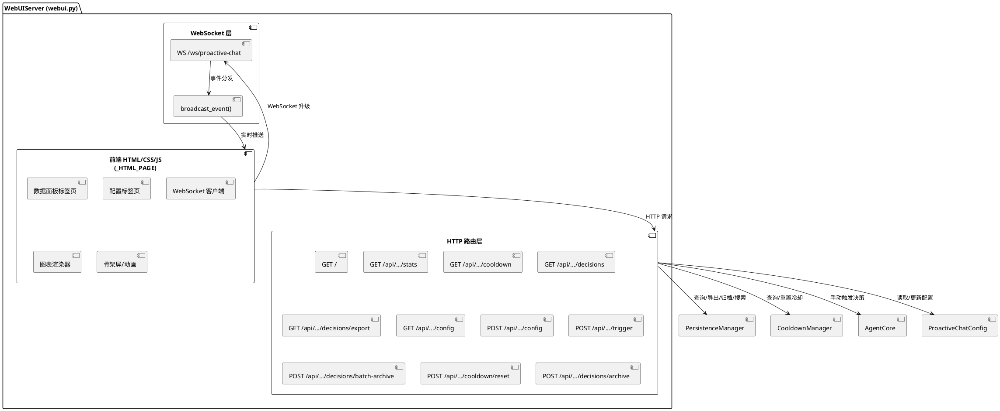
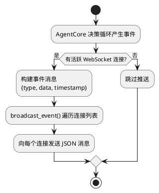
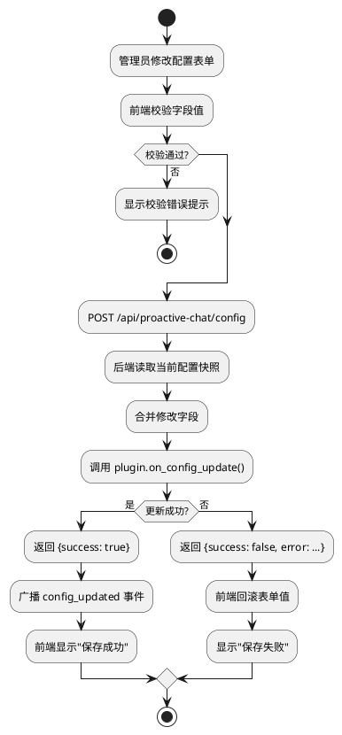
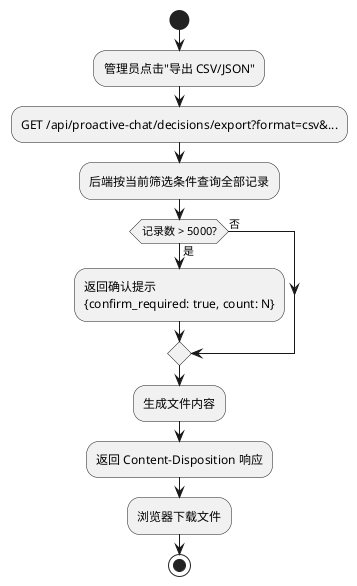

# 1. 实现模型

## 1.1 上下文视图

### 1.1.1 系统上下文

WebUI v2 在现有 `WebUIServer`（aiohttp HTTP 服务，端口 28001）基础上进行增强，新增 WebSocket 实时推送通道、数据可视化图表、配置在线编辑、手动触发决策、批量归档、搜索增强等功能。所有前端实现使用纯原生 HTML/CSS/JS（无外部库），后端通过 `PersistenceManager`、`CooldownManager`、`AgentCore`、`ProactiveChatConfig` 等现有组件交互。

```plantuml
@startuml
left to right direction

rectangle "WebUI 数据面板 v2" as webui {
    rectangle "数据可视化\n(饼图/时间线/直方图/导出)" as viz
    rectangle "实时推送\n(WebSocket + 轮询降级)" as ws
    rectangle "功能扩展\n(配置编辑/手动触发/批量归档/搜索)" as func
    rectangle "视觉体验\n(骨架屏/动画/主题/标签页)" as ux
}

actor "Bot 管理员" as admin
actor "开发者" as dev
system "WebUIServer\n(aiohttp)" as server
system "PersistenceManager" as pm
system "CooldownManager" as cd
system "AgentCore" as agent
system "ProactiveChatConfig" as cfg

admin --> webui : 监控/配置/导出/手动触发
dev --> webui : 调试/分析
webui --> server : HTTP API / WebSocket
server --> pm : 查询/更新/导出决策记录
server --> cd : 查询/重置冷却
server --> agent : 手动触发决策
server --> cfg : 读取/更新配置
ws --> server : ws://host:port/ws/proactive-chat

@enduml
```

### 1.1.2 部署上下文

WebUI 服务运行在 Docker 容器内，端口 28001，通过卷挂载与宿主机同步代码。前端 HTML/CSS/JS 嵌入 Python 字符串（`_HTML_PAGE` 常量），不引入外部 JS/CSS 库。WebSocket 端点与 HTTP 端点共享同一 aiohttp Application 实例。

```
宿主机                                Docker 容器
┌──────────────────────────┐         ┌──────────────────────────────────────┐
│ ./plugins/               │──挂载── │ data/MaiMBot/plugins/                │
│   proactive-chat/        │         │   proactive-chat/                    │
│     webui.py             │         │     webui.py  ← 主要修改文件         │
│     persistence.py       │         │     persistence.py                   │
│     agent.py             │         │     agent.py                         │
│     config.py            │         │     config.py                        │
│     cooldown.py          │         │     cooldown.py                      │
│     plugin.py            │         │     plugin.py                        │
└──────────────────────────┘         └──────────────────────────────────────┘
                                          │
                                    aiohttp :28001
                                    ├── GET  / (HTML 页面)
                                    ├── GET  /api/proactive-chat/stats
                                    ├── GET  /api/proactive-chat/cooldown
                                    ├── GET  /api/proactive-chat/decisions
                                    ├── GET  /api/proactive-chat/decisions/export ← 新增
                                    ├── GET  /api/proactive-chat/config    ← 新增
                                    ├── POST /api/proactive-chat/config    ← 新增
                                    ├── POST /api/proactive-chat/trigger   ← 新增
                                    ├── POST /api/proactive-chat/decisions/batch-archive ← 新增
                                    ├── POST /api/proactive-chat/cooldown/reset
                                    ├── POST /api/proactive-chat/decisions/archive
                                    └── WS   /ws/proactive-chat            ← 新增
```

## 1.2 服务/组件总体架构

### 1.2.1 模块划分

WebUI v2 的改动集中在 `webui.py`，不新增独立模块文件。改动范围按功能区域组织：

| 功能区域 | 涉及组件 | 改动类型 |
|----------|----------|----------|
| **WebSocket 实时推送** | `WebUIServer` 新增 `_ws_connections`、`_ws_handler`、`broadcast_event` | 新增 |
| **数据可视化** | `_HTML_PAGE` 前端新增饼图/时间线/直方图渲染；`_handle_stats` 返回 `intent_distribution`；新增 `_handle_export` | 新增+修改 |
| **配置在线编辑** | 新增 `_handle_get_config`、`_handle_update_config`；`_HTML_PAGE` 前端新增配置标签页 | 新增 |
| **手动触发决策** | 新增 `_handle_trigger`；前端新增触发面板 | 新增 |
| **批量归档** | 新增 `_handle_batch_archive`；前端新增复选框和批量操作 | 新增 |
| **搜索增强** | `_handle_decisions` 新增 `search` 参数；前端新增搜索框和高亮 | 修改+新增 |
| **视觉体验** | `_HTML_PAGE` 前端新增骨架屏、动画、Toast、标签页、主题优化 | 修改 |

### 1.2.2 模块交互架构



### 1.2.3 核心处理流程

**WebSocket 实时推送流程**：



**配置在线编辑流程**：



**数据导出流程**：



### 1.2.4 WebSocket 连接管理模型

```
WebUIServer
├── _ws_connections: set[web.WebSocketResponse]  ← 活跃连接集合
├── _ws_handler(request)                          ← WebSocket 升级处理
├── broadcast_event(event_type, data)             ← 向所有连接广播事件
│
├── 连接生命周期：
│   ├── 握手升级 → 加入 _ws_connections
│   ├── 消息循环 → 接收/忽略客户端消息（仅服务端推送）
│   └── 断开 → 从 _ws_connections 移除
│
├── 事件触发源（由 plugin.py 调用）：
│   ├── AgentCore.decision_loop() 各阶段 → phase_changed / new_decision
│   ├── CooldownManager.mark_triggered() → cooldown_started
│   ├── CooldownManager 冷却到期检测 → cooldown_expired
│   ├── WebUIServer._handle_cooldown_reset() → cooldown_reset
│   └── WebUIServer._handle_update_config() → config_updated
│
└── 前端降级策略：
    ├── WebSocket 连接成功 → 停止轮询，仅靠事件触发局部刷新
    └── WebSocket 连接失败/断开 → 恢复轮询（10s 间隔），指数退避重连
```

## 1.3 实现设计文档

### 1.3.1 WebUIServer 扩展 (webui.py)

**职责**：HTTP API 路由、WebSocket 连接管理、事件广播、前端 HTML 页面

**设计要点**：

1. **构造函数扩展**：新增 `agent: AgentCore`、`config_getter: Callable`、`config_updater: Callable` 参数，用于手动触发决策和配置读写
2. **WebSocket 连接管理**：
   - `_ws_connections: set[web.WebSocketResponse]` 维护活跃连接集合
   - `_handle_ws(request)` 处理 WebSocket 升级请求，验证同源
   - `broadcast_event(event_type: str, data: dict)` 向所有活跃连接广播事件
   - 连接断开时自动从集合中移除
3. **新增 API 端点**：
   - `GET /api/proactive-chat/decisions/export` — 数据导出
   - `GET /api/proactive-chat/config` — 获取当前配置
   - `POST /api/proactive-chat/config` — 更新配置
   - `POST /api/proactive-chat/trigger` — 手动触发决策
   - `POST /api/proactive-chat/decisions/batch-archive` — 批量归档
   - `WS /ws/proactive-chat` — WebSocket 实时推送
4. **现有 API 修改**：
   - `_handle_stats` 返回数据新增 `intent_distribution` 字段
   - `_handle_decisions` 新增 `search` 查询参数支持全文搜索
5. **事件广播集成**：`plugin.py` 在关键事件点调用 `broadcast_event()`

**与旧版的关键差异**：

| 项目 | 旧版 | 新版 |
|------|------|------|
| 连接方式 | 仅 HTTP 轮询 | HTTP + WebSocket 实时推送 |
| 数据可视化 | 纯 CSS 柱状图（趋势图） | 新增饼图/时间线/直方图 |
| 配置管理 | 无 | 在线编辑 + 即时生效 |
| 手动触发 | 无 | 指定聊天流触发决策 |
| 批量操作 | 逐条归档 | 批量归档 + 全选/反选 |
| 搜索 | 仅按字段筛选 | 新增全文搜索 + 高亮 |
| 数据导出 | 无 | CSV/JSON 导出 |
| 视觉体验 | 基础暗色主题 | 骨架屏/动画/Toast/标签页 |
| 页面结构 | 单页 | 标签页（数据面板/配置） |

### 1.3.2 WebSocket 实时推送

**设计要点**：

1. **连接建立**：前端页面加载后自动尝试 WebSocket 连接到 `ws://host:port/ws/proactive-chat`
2. **同源校验**：服务端验证请求 Origin 头，仅允许同源连接
3. **消息格式**：统一 JSON 格式 `{type, data, timestamp}`
4. **事件类型**：
   - `new_decision` — 新决策产生
   - `cooldown_started` — 冷却开始
   - `cooldown_expired` — 冷却到期
   - `cooldown_reset` — 冷却重置
   - `phase_changed` — 处理阶段变更
   - `config_updated` — 配置更新
5. **前端降级**：WebSocket 不可用时自动降级为轮询模式
6. **断线重连**：指数退避（1s → 2s → 4s → ... → 30s max）
7. **消息节流**：500ms 内仅处理最后一条 WebSocket 消息，避免频繁 DOM 操作
8. **Toast 通知**：新决策通知显示为 Toast，最多同时 3 条，5 秒自动消失

**WebSocket 消息 data 结构**：

| 事件类型 | data 字段 |
|----------|-----------|
| `new_decision` | `stream_id`, `action_taken`, `intent?`, `confidence?`, `record_status` |
| `cooldown_started` | `stream_id`, `intent?`, `remaining_seconds` |
| `cooldown_expired` | `stream_id`, `intent?`, `remaining_seconds` |
| `cooldown_reset` | `stream_id`, `intent?`, `remaining_seconds` |
| `phase_changed` | `stream_id`, `phase` |
| `config_updated` | `updated_fields` |

### 1.3.3 数据可视化

**决策分布饼图**：

- 使用 CSS `conic-gradient` 实现环形饼图
- 四种意图对应四种颜色（与现有 badge 颜色一致）：
  - `topic_supplement` → `var(--blue)` (#0984e3)
  - `silence_break` → `var(--yellow)` (#fdcb6e)
  - `missed_reply` → `var(--red)` (#e17055)
  - `memory_recall` → `var(--green)` (#00b894)
- 无数据时显示灰色空心圆环，中心显示"暂无数据"
- 鼠标悬停显示 tooltip（意图名称、决策数、占比）
- `conic-gradient` 不支持时降级为横向条形图

**冷却时间线**：

- 水平时间轴，每个聊天流占一行
- 时间范围为最近 2 小时
- 触发时刻标记为圆点，冷却区间标记为色带
- 已过冷却期显示为虚线色带
- 鼠标悬停显示 tooltip（触发时间/意图/剩余冷却时间）
- 无冷却记录时显示"暂无冷却记录"空状态

**置信度分布直方图**：

- 横轴 5 个区间（0-0.2, 0.2-0.4, 0.4-0.6, 0.6-0.8, 0.8-1.0）
- 纵轴为记录数，使用纯 CSS 柱状图
- 某区间无记录时柱子高度为 0

**数据导出**：

- CSV 格式：8 列（时间、聊天流、意图、置信度、动作、原因、状态、耗时）
- JSON 格式：与 `_handle_decisions` 返回的 records 格式一致
- 文件名格式：`proactive-decisions-YYYY-MM-DD.csv` / `.json`
- 超过 5000 条时弹出确认对话框
- 空数据时导出按钮禁用

### 1.3.4 配置在线编辑

**设计要点**：

1. **配置标签页**：页面顶部标签页导航，包含"数据面板"和"配置"两个标签
2. **配置表单**：按 `ProactiveChatConfig` 的嵌套配置段分组展示
3. **敏感字段脱敏**：
   - `deepseek_api_key` 字段使用 `type="password"` 输入框
   - 已有值显示为 `sk-***...***` 格式
   - 点击输入框时清空脱敏值，允许输入新值
4. **前端校验**：
   - `cooldown_seconds` ≥ 60
   - `deepseek_temperature` 0.0-2.0
   - 其他数值字段按 `Field(ge=..., le=...)` 约束校验
5. **保存流程**：
   - 提交前弹出确认对话框
   - 调用 `POST /api/proactive-chat/config`
   - 成功后显示"保存成功"提示
   - 失败时回滚表单值，显示"保存失败：[错误信息]"
6. **配置审计**：后端记录配置修改日志（修改了哪些字段、旧值、新值）

**配置 API 设计**：

- `GET /api/proactive-chat/config`：返回当前配置的 JSON 表示，敏感字段脱敏
- `POST /api/proactive-chat/config`：接收部分更新的配置，合并到当前配置，调用 `on_config_update()`

### 1.3.5 手动触发决策

**设计要点**：

1. **触发面板**：在数据面板标签页的工具栏区域新增"手动触发"按钮，点击弹出输入框
2. **输入参数**：聊天流 ID（必填）、是否强制触发（可选，默认否）
3. **频率限制**：同一聊天流 30 秒内仅允许手动触发一次
4. **白名单校验**：非强制模式下，聊天流必须在白名单范围内
5. **冷却校验**：非强制模式下，聊天流必须不在冷却期内
6. **结果反馈**：成功显示"已触发决策循环"，失败显示具体错误信息

**手动触发 API**：

- `POST /api/proactive-chat/trigger`
- 请求体：`{stream_id: string, force?: boolean}`
- 频率限制：`_trigger_timestamps: dict[str, float]` 记录每个聊天流最近触发时间

### 1.3.6 批量归档

**设计要点**：

1. **复选框**：决策记录表格新增复选框列，表头有全选/反选复选框
2. **批量归档按钮**：工具栏新增"批量归档"按钮，显示已选数量
3. **API 端点**：`POST /api/proactive-chat/decisions/batch-archive`
4. **请求体**：`{record_keys: [[ts, stream_id], ...]}`，最大长度 100
5. **部分失败处理**：返回 `{success: true, archived_count: N, failed_count: M, errors: [...]}`
6. **未选中时**：按钮禁用状态

### 1.3.7 搜索增强

**设计要点**：

1. **搜索框**：工具栏新增搜索输入框，最大长度 200 字符
2. **搜索范围**：匹配 `input_summary` 和 `analysis_result.reason` 字段
3. **搜索高亮**：匹配关键词在表格中以黄色背景高亮显示
4. **空搜索**：搜索框为空时不发送搜索请求
5. **后端实现**：`_handle_decisions` 新增 `search` 查询参数，在 `_query_decisions_sync` 中增加文本匹配过滤

### 1.3.8 视觉/交互体验

**骨架屏**：

- 数据加载期间显示灰色占位块，形状与最终内容一致
- 使用 shimmer 动画（`var(--card)` ↔ `var(--border)` 渐变脉冲）
- 最少显示 200ms，避免闪烁
- 数据加载完成后平滑过渡为实际内容（300ms）

**过渡动画**：

- 新记录行：从上方滑入，高度从 0 过渡到实际高度（300ms）
- 归档移除：高度从实际过渡到 0，然后移除 DOM（200ms）
- 卡片展开/收起：高度 + 透明度过渡（250ms/200ms）
- 标签页切换：淡入淡出（200ms）

**暗色主题优化**：

- 统计数值与背景对比度 ≥ 4.5:1（WCAG AA）
- 行悬停效果：`rgba(108,92,231,0.08)`
- 卡片阴影：`box-shadow: 0 2px 8px rgba(0,0,0,0.2)`

**微交互动效**：

- 数字变化：滚动动效（300ms），增大变绿/减小变红
- 按钮点击：短暂缩小（scale: 0.95，100ms）
- Toast 通知：右下角滑入（250ms）/滑出（200ms），最多 3 条
- 冷却进度条：宽度平滑过渡（1s linear），完成时变绿（500ms）

**标签页**：

- 页面顶部标签页导航："数据面板"、"配置"
- 内容区域淡入淡出切换（200ms）

**响应式**：

- `< 768px`：卡片单列堆叠，表格可水平滚动
- `< 480px`：工具栏控件换行，按钮组缩小

**`prefers-reduced-motion`**：检测媒体查询，减少或禁用动画

### 1.3.9 降级策略

| 降级场景 | 处理方式 | 用户感知 |
|----------|----------|----------|
| WebSocket 连接被拒绝 | 降级为轮询模式，状态指示器显示"轮询模式"黄色 | 数据更新有 10s 延迟，功能正常 |
| WebSocket 消息丢失 | 收到任意消息后触发一次完整数据刷新 | 数据最终一致，短暂延迟 |
| 大量消息涌入 | 500ms 内仅处理最后一条，Toast 合并显示"收到 N 条新决策" | 页面不卡顿 |
| `conic-gradient` 不支持 | 降级为横向条形图 | 饼图变为条形图，数据仍可查看 |
| 导出 API 超时 | 显示"导出超时，请缩小筛选范围后重试" | 未下载到文件 |
| 配置保存失败 | 表单回滚到修改前值，显示错误信息 | 配置未生效 |
| 手动触发频率超限 | 按钮禁用，显示"请等待 30 秒后重试" | 无法触发 |
| 批量归档部分失败 | 显示"已归档 N 条，M 条失败" | 部分记录未归档 |
| 搜索 API 超时 | 显示"搜索超时，请缩小范围后重试" | 未显示搜索结果 |
| CSS 动画性能差 | 检测 `prefers-reduced-motion`，减少动画 | 动画减少，响应更快 |
| 骨架屏闪烁 | 最少显示 200ms | 加载平滑 |

# 2. 接口设计

## 2.1 总体设计

WebUI v2 的接口分为三类：**现有接口扩展**（保持向后兼容）、**新增 HTTP 接口**、**新增 WebSocket 接口**。所有接口遵循现有路径规范 `/api/proactive-chat/` 前缀。

接口设计原则：
- 现有接口仅新增可选参数和响应字段，不破坏兼容性
- 新增接口遵循 RESTful 风格
- WebSocket 消息使用统一 JSON 格式
- 错误响应统一为 `{success: false, error: "..."}` 格式

## 2.2 接口清单

### 2.2.1 现有接口扩展

#### GET /api/proactive-chat/stats

**扩展内容**：响应新增 `intent_distribution` 字段

```json
{
  "today_total": 35,
  "today_triggered": 15,
  "today_trigger_rate": "42.9%",
  "active_cooldowns": 3,
  "pending_count": 2,
  "processing_count": 1,
  "trigger_anomaly_count": 0,
  "total_decisions": 150,
  "total_triggered": 60,
  "auto_refresh_seconds": 10,
  "hourly_trend": [...],
  "intent_distribution": {
    "topic_supplement": 8,
    "silence_break": 3,
    "missed_reply": 2,
    "memory_recall": 2
  }
}
```

#### GET /api/proactive-chat/decisions

**扩展内容**：新增 `search` 查询参数

| 参数 | 类型 | 必填 | 说明 |
|------|------|------|------|
| `search` | string | 否 | 搜索关键词，匹配 input_summary 和 analysis_result.reason，最大 200 字符 |

### 2.2.2 新增 HTTP 接口

#### GET /api/proactive-chat/decisions/export

**用途**：导出当前筛选条件下的决策记录

| 参数 | 类型 | 必填 | 说明 |
|------|------|------|------|
| `format` | string | 是 | 导出格式：`csv` 或 `json` |
| `stream_id` | string | 否 | 聊天流 ID 筛选 |
| `intent` | string | 否 | 意图筛选 |
| `action` | string | 否 | 动作筛选 |
| `record_status` | string | 否 | 状态筛选 |
| `start_time` | float | 否 | 起始时间戳 |
| `search` | string | 否 | 搜索关键词 |

**响应**：
- CSV：`Content-Type: text/csv`，`Content-Disposition: attachment; filename="proactive-decisions-YYYY-MM-DD.csv"`
- JSON：`Content-Type: application/json`，`Content-Disposition: attachment; filename="proactive-decisions-YYYY-MM-DD.json"`
- 记录数 > 5000 时先返回 `{confirm_required: true, count: N}` 供前端确认

#### GET /api/proactive-chat/config

**用途**：获取当前插件配置

**响应**：

```json
{
  "plugin": {"enabled": true, "catchup_on_startup": true, "config_version": "2.0.0"},
  "trigger": {"enable_topic_supplement": true, ...},
  "cooldown": {"cooldown_seconds": 300},
  "analysis": {"silence_threshold_seconds": 600, ...},
  "scope": {"group_whitelist": [...], ...},
  "deepseek": {"deepseek_model": "deepseek-chat", "deepseek_api_key": "sk-***...***", ...},
  "prompt": {"custom_prompt": ""},
  "webui": {"webui_enabled": true, ...},
  "smart_cleanup": {"smart_cleanup_enabled": false, ...},
  "status": {"decision_window_seconds": 60, ...}
}
```

**敏感字段脱敏规则**：
- `deepseek_api_key`：非空时显示为 `sk-***...***`（前3位 + `***` + 后3位），空值显示空字符串

#### POST /api/proactive-chat/config

**用途**：更新插件配置

**请求体**：部分更新的配置字段（仅提交修改的字段）

```json
{
  "cooldown": {"cooldown_seconds": 600}
}
```

**响应**：

```json
{"success": true}
```

或

```json
{"success": false, "error": "cooldown_seconds 最小值为 60"}
```

**后端处理**：
1. 读取当前完整配置
2. 合并请求中的修改字段
3. 使用 `ProactiveChatConfig(**merged)` 校验
4. 校验通过后调用 `plugin.on_config_update()`
5. 记录配置修改审计日志

#### POST /api/proactive-chat/trigger

**用途**：手动触发指定聊天流的决策循环

**请求体**：

```json
{
  "stream_id": "xxx",
  "force": false
}
```

| 字段 | 类型 | 必填 | 说明 |
|------|------|------|------|
| `stream_id` | string | 是 | 目标聊天流 ID |
| `force` | boolean | 否 | 是否强制触发（忽略白名单和冷却检查），默认 false |

**响应**：

```json
{"success": true, "message": "已触发决策循环"}
```

**频率限制**：同一 `stream_id` 30 秒内仅允许一次手动触发

#### POST /api/proactive-chat/decisions/batch-archive

**用途**：批量归档决策记录

**请求体**：

```json
{
  "record_keys": [[1700000000.0, "stream_id_1"], [1700000100.0, "stream_id_2"]]
}
```

| 字段 | 类型 | 必填 | 说明 |
|------|------|------|------|
| `record_keys` | array | 是 | 待归档记录键列表，每个元素为 `[ts, stream_id]`，最大长度 100 |

**响应**：

```json
{
  "success": true,
  "archived_count": 3,
  "failed_count": 2,
  "errors": [{"record_key": [...], "error": "记录未找到"}]
}
```

### 2.2.3 新增 WebSocket 接口

#### WS /ws/proactive-chat

**用途**：实时推送决策事件和状态变更

**连接**：浏览器发起 WebSocket 升级请求

**服务端推送消息格式**：

```json
{
  "type": "new_decision",
  "data": {
    "stream_id": "xxx",
    "action_taken": "triggered",
    "intent": "topic_supplement",
    "confidence": 0.85,
    "record_status": "completed"
  },
  "timestamp": 1700000000.0
}
```

**消息类型清单**：

| type | data 字段 | 触发时机 |
|------|-----------|----------|
| `new_decision` | `stream_id`, `action_taken`, `intent?`, `confidence?`, `record_status` | 决策循环完成 |
| `cooldown_started` | `stream_id`, `intent?`, `remaining_seconds` | 冷却开始 |
| `cooldown_expired` | `stream_id`, `intent?`, `remaining_seconds` | 冷却到期 |
| `cooldown_reset` | `stream_id`, `intent?`, `remaining_seconds` | 冷却重置 |
| `phase_changed` | `stream_id`, `phase` | 处理阶段变更 |
| `config_updated` | `updated_fields` | 配置更新 |

# 4. 数据模型

## 4.1 设计目标

WebUI v2 不引入新的持久化数据模型，所有数据来源于现有组件。新增的数据结构仅存在于内存和 API 传输层：

1. **WebSocket 事件消息**：运行时内存中的临时消息对象
2. **配置脱敏视图**：API 响应中的配置脱敏表示
3. **手动触发频率记录**：运行时内存中的临时计数器
4. **搜索匹配结果**：查询时动态计算

## 4.2 模型实现

### 4.2.1 WebSocket 事件消息

```python
@dataclass
class WSEvent:
    type: str          # 消息类型枚举
    data: dict         # 消息内容
    timestamp: float   # Unix 时间戳
```

**type 枚举值**：`new_decision`、`cooldown_started`、`cooldown_expired`、`cooldown_reset`、`phase_changed`、`config_updated`

### 4.2.2 配置脱敏视图

```python
def mask_config_for_display(config: ProactiveChatConfig) -> dict:
    """将 ProactiveChatConfig 转为 API 响应字典，敏感字段脱敏。"""
    data = config.model_dump()
    api_key = data.get("deepseek", {}).get("deepseek_api_key", "")
    if api_key:
        data["deepseek"]["deepseek_api_key"] = mask_api_key(api_key)
    return data

def mask_api_key(key: str) -> str:
    """将 API Key 脱敏为 sk-***...*** 格式。"""
    if len(key) <= 8:
        return "sk-***...***"
    return f"{key[:3]}***{key[-3:]}"
```

### 4.2.3 手动触发频率记录

```python
# WebUIServer 实例属性
_trigger_timestamps: dict[str, float]  # stream_id → 最近手动触发时间戳

TRIGGER_COOLDOWN_SECONDS = 30  # 同一聊天流手动触发冷却时间

def _check_trigger_cooldown(self, stream_id: str) -> bool:
    """检查手动触发频率限制，返回 True 表示允许触发。"""
    last_ts = self._trigger_timestamps.get(stream_id, 0)
    return (time.time() - last_ts) >= TRIGGER_COOLDOWN_SECONDS
```

### 4.2.4 搜索参数扩展

`PersistenceManager.query_decisions` 方法签名新增 `search` 参数：

```python
async def query_decisions(
    self,
    stream_id: str = "",
    start_time: float = 0.0,
    end_time: float = 0.0,
    intent: str = "",
    action: str = "",
    limit: int = 100,
    offset: int = 0,
    record_status: str = "",
    trigger_anomaly: bool | None = None,
    search: str = "",  # ← 新增：全文搜索关键词
) -> tuple[list[DecisionRecord], int]:
```

**搜索匹配逻辑**（在 `_query_decisions_sync` 中新增）：

```python
if search:
    search_lower = search.lower()
    input_summary = data.get("input_summary", "").lower()
    reason = data.get("analysis_result", {}).get("reason", "").lower()
    if search_lower not in input_summary and search_lower not in reason:
        continue
```

### 4.2.5 统计数据扩展

`_handle_stats` 响应新增 `intent_distribution` 字段：

```python
# 在 _handle_stats 中新增
intent_distribution: dict[str, int] = {
    "topic_supplement": 0,
    "silence_break": 0,
    "missed_reply": 0,
    "memory_recall": 0,
}
for d in today_decisions:
    intent = (d.analysis_result or {}).get("intent", "")
    if intent in intent_distribution:
        intent_distribution[intent] += 1

data["intent_distribution"] = intent_distribution
```

### 4.2.6 事件广播集成点

`plugin.py` 中需要在以下位置调用 `self._webui.broadcast_event()`：

| 调用位置 | 事件类型 | data 内容 |
|----------|----------|-----------|
| `AgentCore.decision_loop()` 感知阶段开始 | `phase_changed` | `{stream_id, phase: "perceiving"}` |
| `AgentCore.decision_loop()` 推理阶段开始 | `phase_changed` | `{stream_id, phase: "reasoning"}` |
| `AgentCore.decision_loop()` 行动阶段开始 | `phase_changed` | `{stream_id, phase: "acting"}` |
| `AgentCore.decision_loop()` 反思阶段完成 | `new_decision` | `{stream_id, action_taken, intent?, confidence?, record_status}` |
| `CooldownManager.mark_triggered()` | `cooldown_started` | `{stream_id, intent?, remaining_seconds}` |
| `WebUIServer._handle_cooldown_reset()` | `cooldown_reset` | `{stream_id, remaining_seconds: 0}` |
| `WebUIServer._handle_update_config()` | `config_updated` | `{updated_fields: [...]}` |

**设计约束**：`broadcast_event()` 内部捕获所有异常，确保广播失败不影响业务逻辑。无活跃连接时直接跳过。