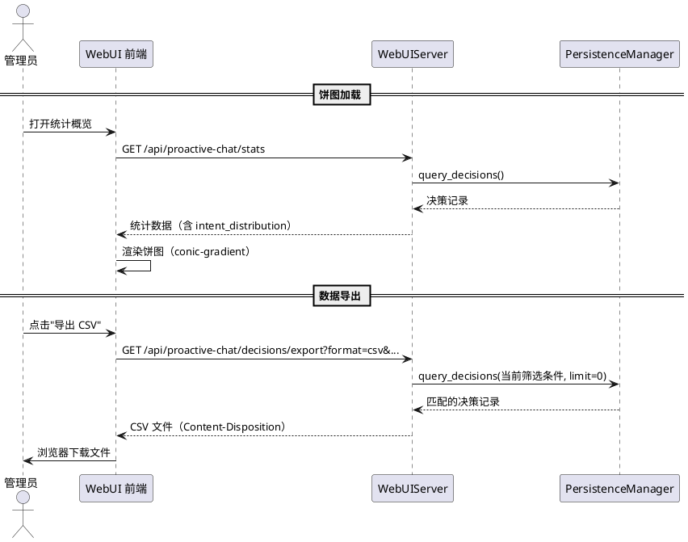
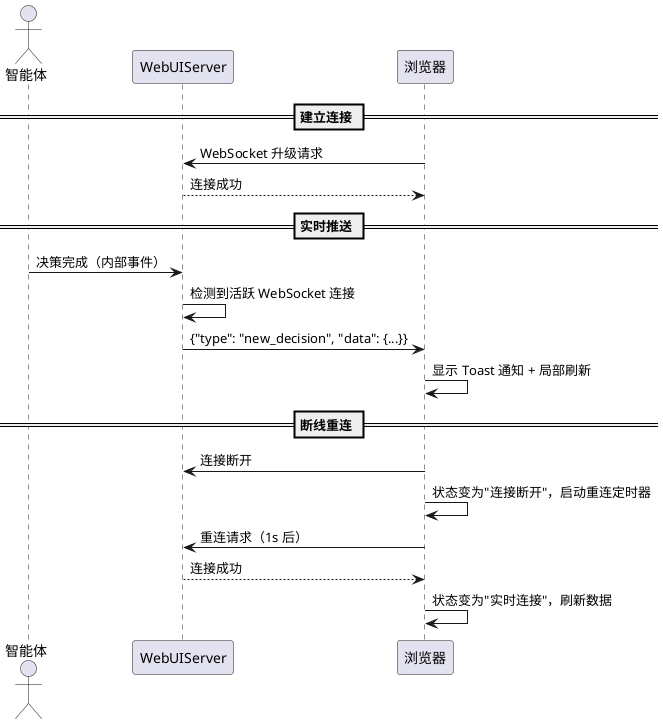
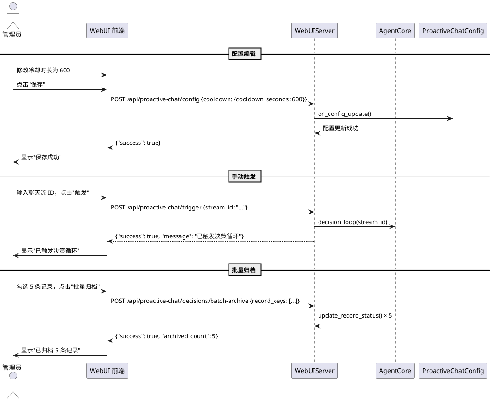
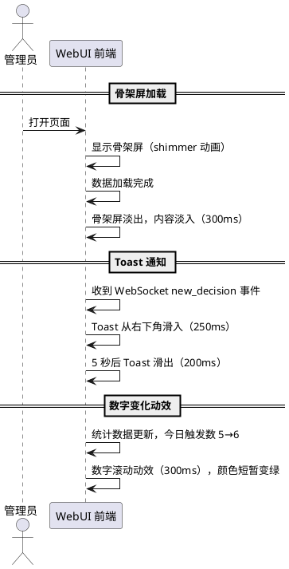

# 1. 组件定位

## 1.1 核心职责

本组件负责为主动对话插件提供增强型 WebUI 数据面板，在现有功能基础上实现数据可视化增强、实时性增强、功能扩展和视觉交互体验优化。

## 1.2 核心输入

1. **现有 WebUI 基础设施**：独立 aiohttp HTTP 服务（端口 28001），前端 HTML 嵌入 Python 字符串，纯原生 HTML/CSS/JS 实现
2. **现有 API 端点**：`/api/proactive-chat/stats`（统计概览）、`/api/proactive-chat/cooldown`（冷却状态）、`/api/proactive-chat/decisions`（决策记录分页查询）、`/api/proactive-chat/cooldown/reset`（冷却重置）、`/api/proactive-chat/decisions/archive`（记录归档）
3. **现有前端功能**：统计概览（今日/累计数据）、冷却状态卡片（进度条/清除/到期时刻/摘要）、决策记录表格（分页/排序/筛选/行展开详情/归档）、趋势图（纯CSS柱状图）、自动刷新
4. **PersistenceManager 数据接口**：`query_decisions()`、`update_record_status()`、`query_cleanup_candidates()` 等
5. **CooldownManager 数据接口**：`_records` 字典、`reset()`、`mark_triggered()` 等
6. **插件配置**：`ProactiveChatConfig` 全量配置模型
7. **WebSocket 连接请求**：浏览器发起的 WebSocket 升级请求

## 1.3 核心输出

1. **增强型数据可视化**：决策分布饼图、冷却时间线图、置信度分布图、数据导出文件
2. **实时数据推送**：WebSocket 事件消息（新决策通知、冷却状态变更、处理阶段变更）
3. **扩展功能**：配置在线编辑、手动触发决策、批量归档操作、搜索增强
4. **视觉交互体验**：加载骨架屏、过渡动画、暗色主题优化、微交互动效

## 1.4 职责边界

1. **不负责**修改插件核心逻辑（智能体决策循环、DeepSeek API 调用、冷却管理等）
2. **不负责**引入外部 JS 库（如 Chart.js、D3.js 等）——所有前端实现必须使用纯原生 HTML/CSS/JS
3. **不负责**修改主程序代码——仅通过插件内部 API 和数据接口交互
4. **不负责**用户认证和权限控制——WebUI 当前无认证机制，本次不新增
5. **不负责**移动端原生适配——保持响应式布局即可，不做 PWA 或原生壳
6. **不负责**修改现有 API 的核心语义——新增字段和端点，不破坏现有接口兼容性

# 2. 领域术语

**决策分布饼图**
: 以环形图形式展示不同意图类型（话题补充、冷场打破、漏回补答、记忆关联）的决策占比，使用纯 CSS conic-gradient 实现。

**冷却时间线**
: 以水平时间轴形式展示各聊天流的冷却状态和触发历史，每个聊天流占一行，触发时刻标记为圆点，冷却区间标记为色带。

**置信度分布图**
: 以直方图形式展示决策记录中置信度值的分布情况，横轴为置信度区间（0-0.2, 0.2-0.4, ..., 0.8-1.0），纵轴为记录数。

**数据导出**
: 将当前筛选条件下的决策记录导出为 CSV 或 JSON 文件，供离线分析使用。

**WebSocket 实时推送**
: 通过 WebSocket 长连接向浏览器实时推送决策事件、冷却状态变更等消息，替代轮询刷新模式。

**新决策通知**
: 当新的决策记录产生时，通过 WebSocket 推送通知到浏览器，前端以 Toast 消息形式展示。

**配置在线编辑**
: 在 WebUI 中提供配置编辑界面，允许管理员直接修改插件配置并即时生效。

**手动触发决策**
: 管理员通过 WebUI 手动指定聊天流触发一次主动对话决策，用于调试和测试。

**批量归档**
: 一次性将多条决策记录标记为"已归档"状态，替代逐条归档操作。

**搜索增强**
: 在现有筛选基础上增加全文搜索能力，支持按决策原因、输入摘要等文本内容搜索。

**加载骨架屏**
: 数据加载期间显示与最终布局一致的灰色占位块，避免页面内容闪烁。

**过渡动画**
: 列表项增删、卡片展开收起、页面切换等场景下的平滑过渡效果。

**暗色主题优化**
: 在现有暗色主题基础上，优化对比度、色阶层次、阴影深度，提升视觉舒适度。

**微交互动效**
: 按钮点击反馈、进度条动画、数字变化动效等细节层面的交互反馈。

# 3. 角色与边界

## 3.1 核心角色

- **Bot 管理员**：通过 WebUI 监控插件运行状态、查看决策记录、调整配置、手动触发决策、导出数据的主要使用者
- **开发者/调试人员**：通过 WebUI 实时观察决策过程、分析触发模式、排查异常问题的技术用户

## 3.2 外部系统

- **WebUIServer (aiohttp)**：提供 HTTP/WebSocket 服务的 Python 后端，处理 API 请求和 WebSocket 连接
- **PersistenceManager**：提供决策记录查询、状态更新、批量操作等数据接口
- **CooldownManager**：提供冷却状态查询、重置等接口
- **AgentCore**：提供手动触发决策的接口
- **ProactiveChatConfig**：提供配置读取和更新接口

## 3.3 交互上下文

```plantuml
@startuml
left to right direction

rectangle "WebUI 数据面板 v2" as webui {
    rectangle "数据可视化\n(饼图/时间线/直方图)" as viz
    rectangle "实时推送\n(WebSocket)" as ws
    rectangle "功能扩展\n(配置编辑/手动触发/批量/搜索)" as func
    rectangle "视觉体验\n(骨架屏/动画/主题)" as ux
}

actor "Bot 管理员" as admin
actor "开发者" as dev
system "WebUIServer\n(aiohttp)" as server
system "PersistenceManager" as pm
system "CooldownManager" as cd
system "AgentCore" as agent
system "ProactiveChatConfig" as cfg

admin --> webui : 监控/配置/导出
dev --> webui : 调试/分析
webui --> server : HTTP API / WebSocket
server --> pm : 查询/更新决策记录
server --> cd : 查询/重置冷却
server --> agent : 手动触发决策
server --> cfg : 读取/更新配置

@enduml
```

# 4. DFX 约束

## 4.1 性能

1. **首屏加载时间**：WebUI 首屏渲染时间不超过 1.5 秒（含骨架屏展示）
2. **API 响应时间**：新增 API 端点的响应时间不超过 500ms（数据量 < 1000 条时）
3. **WebSocket 推送延迟**：从决策事件发生到浏览器收到推送消息的延迟不超过 1 秒
4. **前端渲染性能**：决策记录表格渲染 100 条数据不超过 200ms
5. **数据导出性能**：导出 1000 条决策记录为 CSV 文件不超过 3 秒
6. **内存占用**：WebSocket 连接的内存增量不超过 5MB/连接

## 4.2 可靠性

1. **WebSocket 断线重连**：WebSocket 连接意外断开后，前端应自动重连，重连间隔采用指数退避（1s, 2s, 4s, 最大 30s）
2. **API 降级**：新增 API 端点异常时，前端应显示友好的错误提示，不影响其他功能使用
3. **数据一致性**：WebSocket 推送的数据与 API 查询的数据应保持一致，推送事件仅作为通知触发刷新
4. **配置编辑安全**：配置修改前必须确认，修改失败时回滚到修改前的值

## 4.3 安全性

1. **WebSocket 来源校验**：WebSocket 连接仅接受来自同源的请求
2. **配置修改审计**：配置修改操作应记录日志（修改了哪些字段、旧值、新值）
3. **手动触发限制**：手动触发决策功能应限制调用频率，同一聊天流 30 秒内仅允许手动触发一次
4. **数据导出范围**：导出数据仅包含当前筛选条件下的记录，不暴露其他数据

## 4.4 可维护性

1. **代码组织**：新增的前端 JS 代码应按功能模块组织，使用注释分隔不同功能区域
2. **CSS 变量复用**：新增样式应优先使用现有 CSS 变量（`--bg`, `--card`, `--accent` 等），避免硬编码颜色值
3. **API 版本化**：新增 API 端点应遵循现有路径规范 `/api/proactive-chat/` 前缀
4. **日志规范**：后端新增功能应使用 `[proactive-chat]` 前缀记录日志，优先中文

## 4.5 兼容性

1. **浏览器兼容**：支持 Chrome 90+、Firefox 90+、Edge 90+、Safari 15+
2. **现有功能兼容**：新增功能不得破坏现有 WebUI 功能，现有 API 接口保持向后兼容
3. **Docker 部署兼容**：WebUI 服务仍运行在 Docker 容器内，端口 28001，通过卷挂载更新代码
4. **无外部依赖**：所有前端实现使用纯原生 HTML/CSS/JS，不引入任何外部 JS/CSS 库
5. **CSS 特性兼容**：使用 `conic-gradient`（饼图）、`ResizeObserver`（响应式）等特性时需提供降级方案

# 5. 核心能力

## 5.1 数据可视化增强

### 5.1.1 业务规则

1. **决策分布饼图规则**：The WebUI shall 在统计概览卡片中新增决策意图分布饼图，展示各意图类型的决策占比

   a. 验收条件：[统计概览页面加载完成] → [显示环形饼图，各扇区对应 topic_supplement、silence_break、missed_reply、memory_recall 四种意图，扇区颜色与现有 badge 颜色一致]

   b. 验收条件：[无决策记录时] → [饼图显示灰色空心圆环，中心显示"暂无数据"]

   c. 验收条件：[某意图占比为 0 时] → [该意图不显示扇区，但图例中仍列出]

2. **饼图交互规则**：When 用户将鼠标悬停在饼图扇区上，the WebUI shall 显示该扇区的意图名称、决策数和占比

   a. 验收条件：[鼠标悬停在"话题补充"扇区] → [显示 tooltip："话题补充：15 次 (42.9%)"]

3. **冷却时间线规则**：The WebUI shall 新增冷却时间线视图，以水平时间轴展示各聊天流的冷却状态和触发历史

   a. 验收条件：[冷却时间线页面加载完成] → [显示水平时间轴，每个有冷却记录的聊天流占一行，触发时刻标记为圆点，冷却区间标记为色带]

   b. 验收条件：[无冷却记录时] → [显示"暂无冷却记录"空状态]

   c. 验收条件：[时间线时间范围为最近 2 小时] → [时间轴左端为 2 小时前，右端为当前时刻，已过冷却期显示为虚线色带]

4. **时间线交互规则**：When 用户将鼠标悬停在时间线的触发圆点或冷却色带上，the WebUI shall 显示该事件的详细信息

   a. 验收条件：[鼠标悬停在触发圆点上] → [显示 tooltip："触发时间：HH:MM:SS，意图：话题补充"]

   b. 验收条件：[鼠标悬停在冷却色带上] → [显示 tooltip："冷却中，剩余 X 分 X 秒"]

5. **置信度分布图规则**：The WebUI shall 新增置信度分布直方图，展示决策记录的置信度值分布

   a. 验收条件：[置信度分布图加载完成] → [显示直方图，横轴为 5 个置信度区间（0-0.2, 0.2-0.4, 0.4-0.6, 0.6-0.8, 0.8-1.0），纵轴为记录数]

   b. 验收条件：[某区间无记录时] → [该区间柱子高度为 0]

6. **数据导出规则**：The WebUI shall 支持将当前筛选条件下的决策记录导出为 CSV 文件

   a. 验收条件：[用户点击"导出 CSV"按钮] → [浏览器下载 CSV 文件，文件名格式为 `proactive-decisions-YYYY-MM-DD.csv`，包含当前筛选条件下的所有记录]

   b. 验收条件：[CSV 文件包含列] → [时间、聊天流、意图、置信度、动作、原因、状态、耗时]

   c. 验收条件：[当前筛选结果为空时] → [导出按钮禁用，显示"无数据可导出"提示]

7. **JSON 导出规则**：The WebUI shall 支持将决策记录导出为 JSON 文件

   a. 验收条件：[用户点击"导出 JSON"按钮] → [浏览器下载 JSON 文件，文件名格式为 `proactive-decisions-YYYY-MM-DD.json`，包含完整的决策记录数据]

8. **导出数量限制规则**：When 导出记录数超过 5000 条，the WebUI shall 提示用户确认并显示预计文件大小

   a. 验收条件：[导出 6000 条记录时] → [弹出确认对话框："将导出 6000 条记录，文件可能较大，是否继续？"]

### 5.1.2 交互流程



### 5.1.3 异常场景

1. **饼图数据为空**

   a. 触发条件：所有意图类型的决策数均为 0

   b. 系统行为：饼图显示灰色空心圆环，中心显示"暂无数据"

   c. 用户感知：饼图区域显示空状态提示

2. **导出 API 超时**

   a. 触发条件：导出大量数据时 API 响应超过 30 秒

   b. 系统行为：前端显示"导出超时，请缩小筛选范围后重试"提示

   c. 用户感知：未下载到文件，收到超时提示

3. **浏览器不支持 conic-gradient**

   a. 触发条件：用户使用不支持 CSS conic-gradient 的旧浏览器

   b. 系统行为：降级为简单的横向条形图展示各意图占比

   c. 用户感知：饼图变为条形图，数据仍可正常查看

## 5.2 实时性增强

### 5.2.1 业务规则

1. **WebSocket 连接规则**：The WebUI shall 支持 WebSocket 长连接，用于实时推送决策事件和状态变更

   a. 验收条件：[WebUI 页面加载完成] → [自动建立 WebSocket 连接到 `ws://host:port/ws/proactive-chat`]

   b. 验收条件：[WebSocket 连接成功] → [页面状态指示器显示"实时连接"绿色状态]

   c. 验收条件：[WebSocket 连接失败] → [降级为轮询模式，状态指示器显示"轮询模式"黄色状态]

2. **新决策通知规则**：When 新的决策记录产生，the WebUI shall 通过 WebSocket 推送通知到浏览器

   a. 验收条件：[智能体完成一次决策] → [WebSocket 推送 `{"type": "new_decision", "data": {"stream_id": "...", "action_taken": "triggered", "intent": "..."}}` 消息]

   b. 验收条件：[浏览器收到 new_decision 消息] → [页面右下角显示 Toast 通知："新决策：话题补充 → 已触发"，5 秒后自动消失]

   c. 验收条件：[用户点击 Toast 通知] → [滚动到对应的决策记录行并高亮]

3. **冷却状态变更通知规则**：When 冷却状态发生变更（新触发、冷却到期、手动重置），the WebUI shall 通过 WebSocket 推送通知

   a. 验收条件：[某聊天流进入冷却] → [WebSocket 推送 `{"type": "cooldown_started", "data": {"stream_id": "..."}}` 消息]

   b. 验收条件：[某聊天流冷却到期] → [WebSocket 推送 `{"type": "cooldown_expired", "data": {"stream_id": "..."}}` 消息]

   c. 验收条件：[管理员手动重置冷却] → [WebSocket 推送 `{"type": "cooldown_reset", "data": {"stream_id": "..."}}` 消息]

4. **处理阶段变更通知规则**：When 决策记录的处理阶段发生变更，the WebUI shall 通过 WebSocket 推送通知

   a. 验收条件：[决策进入推理阶段] → [WebSocket 推送 `{"type": "phase_changed", "data": {"stream_id": "...", "phase": "reasoning"}}` 消息]

   b. 验收条件：[浏览器收到 phase_changed 消息] → [对应记录行的处理阶段标签实时更新]

5. **自动刷新优化规则**：When WebSocket 连接正常，the WebUI shall 停止轮询刷新，改为仅通过 WebSocket 事件触发局部更新

   a. 验收条件：[WebSocket 连接正常时] → [取消定时轮询，仅通过 WebSocket 事件触发数据刷新]

   b. 验收条件：[WebSocket 断线时] → [恢复定时轮询，轮询间隔为 10 秒]

6. **断线重连规则**：If WebSocket 连接意外断开，the WebUI shall 自动尝试重连

   a. 验收条件：[WebSocket 连接断开] → [状态指示器显示"连接断开"红色状态，1 秒后尝试重连]

   b. 验收条件：[第一次重连失败] → [2 秒后再次重连]

   c. 验收条件：[连续重连失败] → [采用指数退避，最大间隔 30 秒，同时恢复轮询模式]

   d. 验收条件：[重连成功] → [状态指示器恢复"实时连接"绿色状态，停止轮询]

7. **WebSocket 消息格式规则**：The WebSocket 消息 shall 使用统一的 JSON 格式

   a. 验收条件：[所有 WebSocket 消息] → [包含 `type` 字段（消息类型）和 `data` 字段（消息内容），`type` 为 `new_decision`、`cooldown_started`、`cooldown_expired`、`cooldown_reset`、`phase_changed`、`config_updated` 之一]

### 5.2.2 交互流程



### 5.2.3 异常场景

1. **WebSocket 连接被拒绝**

   a. 触发条件：服务端 WebSocket 端点不可用或端口被占用

   b. 系统行为：前端降级为轮询模式，状态指示器显示"轮询模式"

   c. 用户感知：数据更新有 10 秒延迟，功能正常

2. **WebSocket 消息丢失**

   a. 触发条件：网络不稳定导致 WebSocket 消息丢失

   b. 系统行为：前端在收到任何 WebSocket 消息后，触发一次完整数据刷新，确保数据一致性

   c. 用户感知：数据最终一致，可能有短暂的延迟

3. **大量消息涌入**

   a. 触发条件：短时间内产生大量决策事件（如多个聊天流同时触发）

   b. 系统行为：前端对 WebSocket 消息进行节流处理，500ms 内仅处理最后一条，避免频繁 DOM 操作

   c. 用户感知：Toast 通知合并显示"收到 N 条新决策"，页面不卡顿

## 5.3 功能扩展

### 5.3.1 业务规则

1. **配置在线编辑规则**：The WebUI shall 提供配置在线编辑功能，允许管理员修改插件配置并即时生效

   a. 验收条件：[管理员点击"配置"标签页] → [显示当前配置表单，包含所有配置段（插件、触发场景、冷却、分析、生效范围、DeepSeek、提示词、智能清理、决策状态、WebUI）]

   b. 验收条件：[管理员修改冷却时长为 600 秒并点击"保存"] → [调用 `POST /api/proactive-chat/config` 提交修改，配置即时生效，显示"保存成功"提示]

   c. 验收条件：[配置值超出范围（如冷却时长设为 10 秒）] → [前端校验失败，显示"冷却时长最小 60 秒"错误提示，不提交]

   d. 验收条件：[配置保存失败] → [显示"保存失败：[错误信息]"提示，表单回滚到修改前的值]

2. **配置敏感字段规则**：The WebUI shall 对敏感配置字段（如 API Key）进行脱敏展示

   a. 验收条件：[显示 DeepSeek API Key 字段] → [输入框显示为密码类型，已有值显示为 `sk-***...***` 格式]

   b. 验收条件：[管理员点击 API Key 输入框] → [清空脱敏值，允许输入新值]

3. **手动触发决策规则**：The WebUI shall 提供手动触发决策功能，允许管理员指定聊天流触发一次主动对话决策

   a. 验收条件：[管理员在"手动触发"面板输入聊天流 ID 并点击"触发"] → [调用 `POST /api/proactive-chat/trigger`，启动该聊天流的决策循环]

   b. 验收条件：[手动触发成功] → [显示"已触发决策循环"提示，决策记录表格中出现新的 pending 记录]

   c. 验收条件：[手动触发失败（聊天流不存在）] → [显示"触发失败：聊天流不存在"提示]

4. **手动触发频率限制规则**：The WebUI shall 限制手动触发的调用频率

   a. 验收条件：[同一聊天流 30 秒内第二次手动触发] → [按钮禁用，显示"请等待 30 秒后重试"提示]

5. **批量归档规则**：The WebUI shall 支持批量归档决策记录

   a. 验收条件：[管理员勾选多条决策记录并点击"批量归档"] → [调用 `POST /api/proactive-chat/decisions/batch-archive`，传入选中的记录键列表]

   b. 验收条件：[批量归档成功] → [显示"已归档 N 条记录"提示，选中记录从列表中消失]

   c. 验收条件：[未勾选任何记录时点击"批量归档"] → [按钮禁用状态，不发送请求]

6. **全选/反选规则**：The WebUI shall 支持决策记录的全选和反选操作

   a. 验收条件：[管理员点击表头复选框] → [当前页所有记录被选中]

   b. 验收条件：[管理员再次点击表头复选框] → [取消当前页所有选中]

7. **搜索增强规则**：The WebUI shall 在现有筛选基础上增加全文搜索功能

   a. 验收条件：[管理员在搜索框输入"Python 异步"并回车] → [调用 `GET /api/proactive-chat/decisions?search=Python+异步`，返回 input_summary 或 reason 包含该关键词的记录]

   b. 验收条件：[搜索结果为空] → [显示"未找到匹配的决策记录"提示]

   c. 验收条件：[搜索框为空时] → [不发送搜索请求，显示全部记录]

8. **搜索高亮规则**：When 搜索结果中存在匹配关键词，the WebUI shall 在表格中高亮显示匹配文本

   a. 验收条件：[搜索"Python"后查看决策记录] → [原因列和展开详情中"Python"文字高亮显示（黄色背景）]

### 5.3.2 交互流程



### 5.3.3 异常场景

1. **配置保存失败**

   a. 触发条件：`on_config_update()` 抛出异常或配置值校验失败

   b. 系统行为：前端显示"保存失败：[错误信息]"，表单值回滚到修改前

   c. 用户感知：配置未生效，需修正后重试

2. **手动触发聊天流不在白名单**

   a. 触发条件：手动触发的聊天流不在白名单范围内

   b. 系统行为：返回错误"该聊天流不在白名单范围内，无法触发"

   c. 用户感知：收到错误提示，决策未触发

3. **批量归档部分失败**

   a. 触发条件：批量归档请求中部分记录更新失败

   b. 系统行为：返回 `{"success": true, "archived_count": 3, "failed_count": 2, "errors": [...]}`

   c. 用户感知：显示"已归档 3 条，2 条失败"提示

4. **搜索 API 超时**

   a. 触发条件：全文搜索在大量数据上执行时间过长

   b. 系统行为：前端显示"搜索超时，请缩小范围后重试"提示

   c. 用户感知：未显示搜索结果

## 5.4 视觉/交互体验

### 5.4.1 业务规则

1. **加载骨架屏规则**：When 数据正在加载中，the WebUI shall 显示与最终布局一致的骨架屏占位

   a. 验收条件：[页面首次加载或刷新数据时] → [统计概览、冷却状态、决策记录三个区域分别显示灰色占位块，形状与最终内容一致]

   b. 验收条件：[数据加载完成] → [骨架屏平滑过渡为实际内容，过渡时间不超过 300ms]

   c. 验收条件：[骨架屏占位块] → [使用脉冲动画（shimmer effect），背景色在 `var(--card)` 和 `var(--border)` 之间渐变]

2. **列表过渡动画规则**：When 决策记录列表发生增删变化，the WebUI shall 显示平滑的过渡动画

   a. 验收条件：[新决策记录出现在列表顶部] → [新记录行从上方滑入，高度从 0 过渡到实际高度，过渡时间 300ms]

   b. 验收条件：[记录被归档从列表中移除] → [记录行高度从实际高度过渡到 0，然后移除 DOM，过渡时间 200ms]

3. **卡片展开收起动画规则**：When 决策记录行展开详情，the WebUI shall 显示平滑的展开动画

   a. 验收条件：[点击决策记录行展开详情] → [详情面板从 0 高度过渡到实际高度，透明度从 0 过渡到 1，过渡时间 250ms]

   b. 验收条件：[点击已展开的记录行收起] → [详情面板高度过渡到 0，透明度过渡到 0，过渡时间 200ms]

4. **暗色主题优化规则**：The WebUI shall 优化现有暗色主题的对比度和色阶层次

   a. 验收条件：[统计概览卡片] → [数值文字与背景的对比度不低于 4.5:1（WCAG AA 标准）]

   b. 验收条件：[决策记录表格] → [行悬停效果使用 `rgba(108,92,231,0.08)` 替代 `rgba(108,92,231,0.05)`，提高可辨识度]

   c. 验收条件：[新增卡片阴影] → [卡片使用 `box-shadow: 0 2px 8px rgba(0,0,0,0.2)` 增加层次感]

5. **数字变化动效规则**：When 统计数字发生变化，the WebUI shall 显示数字滚动动效

   a. 验收条件：[今日触发数从 5 变为 6] → [数字从 5 滚动变化到 6，过渡时间 300ms]

   b. 验收条件：[数字增大时] → [滚动方向向上，颜色短暂变为 `var(--green)` 后恢复]

   c. 验收条件：[数字减小时] → [滚动方向向下，颜色短暂变为 `var(--red)` 后恢复]

6. **按钮点击反馈规则**：When 用户点击按钮，the WebUI shall 显示点击反馈动效

   a. 验收条件：[点击"筛选"按钮] → [按钮短暂缩小（scale: 0.95），100ms 后恢复]

   b. 验收条件：[点击"清除冷却"文字按钮] → [文字短暂变为 `var(--red)` 加粗，200ms 后恢复]

7. **Toast 通知动画规则**：When Toast 通知出现或消失，the WebUI shall 显示平滑的出入场动画

   a. 验收条件：[Toast 通知出现] → [从右下角滑入，透明度从 0 过渡到 1，过渡时间 250ms]

   b. 验收条件：[Toast 通知消失] → [向右滑出，透明度从 1 过渡到 0，过渡时间 200ms]

8. **冷却进度条动画规则**：When 冷却进度条宽度变化，the WebUI shall 显示平滑的过渡动画

   a. 验收条件：[冷却进度推进] → [进度条宽度平滑过渡，transition: width 1s linear（与现有实现一致）]

   b. 验收条件：[冷却完成（进度条满格）] → [进度条颜色从 `var(--accent)` 过渡到 `var(--green)`，过渡时间 500ms]

9. **标签页切换规则**：The WebUI shall 使用标签页组织不同功能区域

   a. 验收条件：[页面顶部显示标签页导航] → [包含"数据面板"、"配置"两个标签页]

   b. 验收条件：[点击"配置"标签页] → [平滑切换到配置编辑界面，当前标签页高亮]

   c. 验收条件：[标签页切换] → [内容区域使用淡入淡出过渡，过渡时间 200ms]

10. **响应式优化规则**：The WebUI shall 在窄屏下保持良好的可用性

    a. 验收条件：[视口宽度 < 768px 时] → [统计概览和冷却状态卡片单列堆叠，决策记录表格可水平滚动]

    b. 验收条件：[视口宽度 < 480px 时] → [工具栏控件换行排列，时间范围按钮组缩小]

### 5.4.2 交互流程



### 5.4.3 异常场景

1. **CSS 动画性能差**

   a. 触发条件：低端设备上 CSS 过渡动画帧率低于 30fps

   b. 系统行为：自动检测 `prefers-reduced-motion` 媒体查询，减少或禁用动画

   c. 用户感知：动画效果减少，页面响应更快

2. **骨架屏闪烁**

   a. 触发条件：数据加载极快（< 100ms），骨架屏一闪而过

   b. 系统行为：骨架屏最少显示 200ms，避免闪烁

   c. 用户感知：页面加载感觉平滑，无闪烁

3. **Toast 通知堆积**

   a. 触发条件：短时间内收到大量 WebSocket 通知

   b. 系统行为：最多同时显示 3 条 Toast，新的通知排队等待

   c. 用户感知：通知不会遮挡整个页面

# 6. 数据约束

## 6.1 WebSocket 消息

1. **type**：消息类型，字符串枚举（`new_decision`、`cooldown_started`、`cooldown_expired`、`cooldown_reset`、`phase_changed`、`config_updated`），必填
2. **data**：消息内容，对象类型，结构因 type 而异，必填
3. **timestamp**：消息发送时间戳，浮点数类型（Unix 时间戳），必填

## 6.2 WebSocket 消息 data 结构

### new_decision

1. **stream_id**：聊天流 ID，字符串类型，必填
2. **action_taken**：最终行动，字符串类型，必填
3. **intent**：意图标签，字符串类型，可选
4. **confidence**：置信度，浮点数类型，可选
5. **record_status**：记录状态，字符串类型，必填

### cooldown_started / cooldown_expired / cooldown_reset

1. **stream_id**：聊天流 ID，字符串类型，必填
2. **intent**：意图标签，字符串类型，可选
3. **remaining_seconds**：剩余冷却秒数，整数类型，必填

### phase_changed

1. **stream_id**：聊天流 ID，字符串类型，必填
2. **phase**：当前处理阶段，字符串枚举（perceiving、reasoning、acting、reflecting），必填

### config_updated

1. **updated_fields**：更新的字段列表，字符串数组类型，必填

## 6.3 配置编辑请求

1. **配置段名.字段名**：配置项路径，值类型与 ProactiveChatConfig 对应字段一致
2. 所有字段均为可选，仅提交修改的字段

## 6.4 手动触发请求

1. **stream_id**：目标聊天流 ID，字符串类型，必填
2. **force**：是否强制触发（忽略白名单和冷却检查），布尔类型，默认 False

## 6.5 批量归档请求

1. **record_keys**：待归档记录键列表，数组类型，每个元素为 `[ts, stream_id]` 二元组，必填，最大长度 100

## 6.6 数据导出响应

1. **Content-Type**：`text/csv`（CSV 格式）或 `application/json`（JSON 格式）
2. **Content-Disposition**：`attachment; filename="proactive-decisions-YYYY-MM-DD.csv"` 或 `.json`
3. **CSV 列**：时间、聊天流、意图、置信度、动作、原因、状态、耗时（共 8 列）
4. **JSON 结构**：与 `_handle_decisions` API 返回的 records 格式一致

## 6.7 搜索参数

1. **search**：搜索关键词，字符串类型，最大长度 200 字符，匹配 input_summary 和 analysis_result.reason 字段