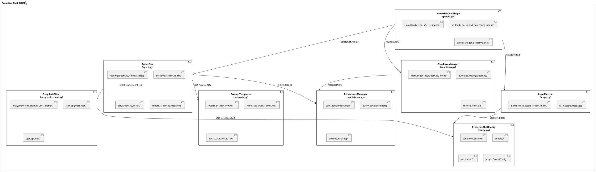
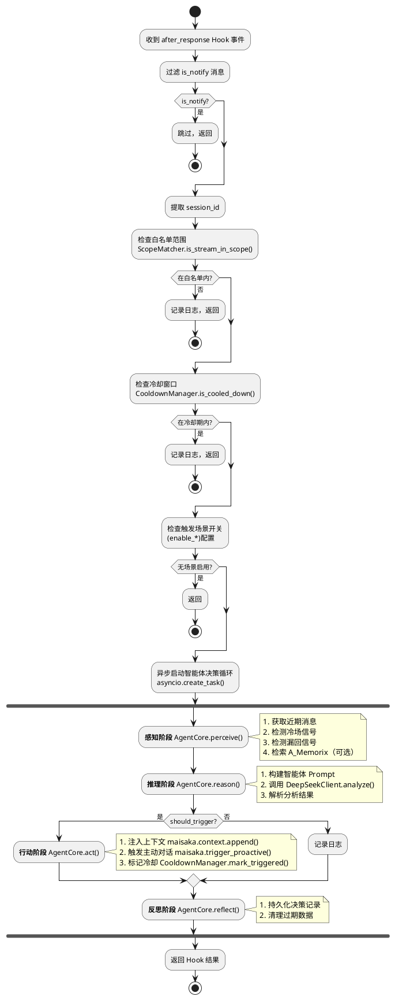
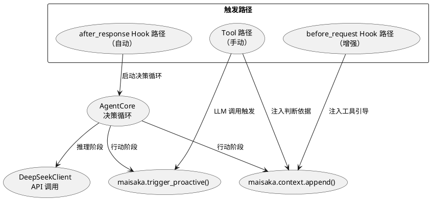
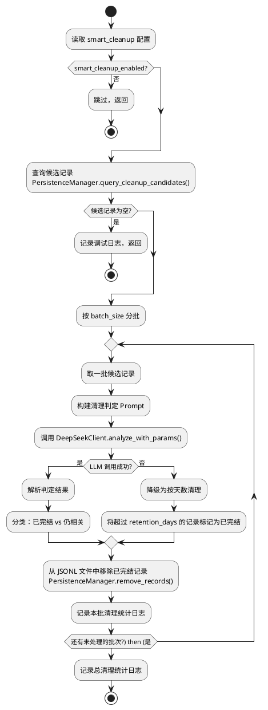
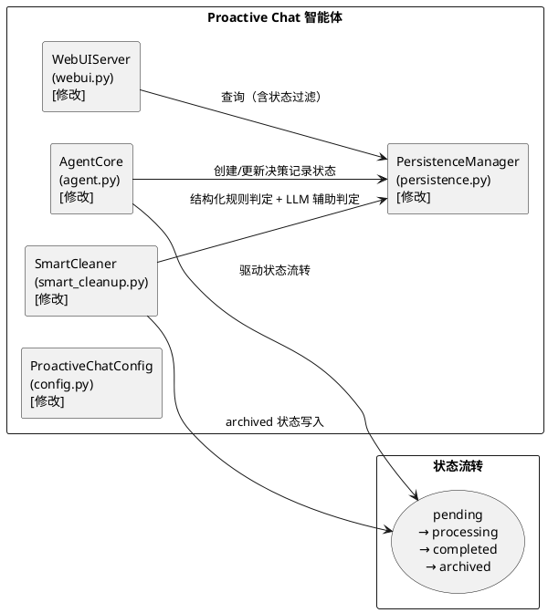

# 1. 实现模型

## 1.1 上下文视图

### 1.1.1 系统上下文

Proactive Chat 插件以**独立智能体**模式运行于 MaiBot 插件运行时环境中，通过 SDK 2.6.0 提供的 HookHandler、Tool 两种组件类型与主程序及子系统交互。插件**独立调用 DeepSeek API** 进行上下文分析，不依赖 `ctx.llm.generate()` 管道。

```plantuml
@startuml
left to right direction

rectangle "Proactive Chat 智能体" as agent {
    rectangle "HookHandler\n(after_response)" as hk
    rectangle "@Tool\n(trigger_proactive_chat)" as tool
    rectangle "AgentCore\n(感知→推理→行动→反思)" as core
    rectangle "DeepSeekClient\n(HTTP API 调用)" as ds
    rectangle "CooldownManager\n(冷却+持久化)" as cd
    rectangle "ScopeMatcher\n(白名单匹配)" as sm
    rectangle "PersistenceManager\n(存储降级)" as pm
}

actor "群聊参与者" as user
system "MaiBot 主程序" as maibot
system "Maisaka 子系统" as maisaka
system "A_Memorix" as memorix
system "DeepSeek API" as deepseek
system "MaiBot 数据库" as db

user --> maibot : 发送消息
maibot --> hk : after_response Hook
hk --> sm : 检查白名单范围
hk --> cd : 检查冷却状态
hk --> core : 启动智能体决策循环
core --> ds : 推理：调用 DeepSeek API
ds --> deepseek : HTTP POST /v1/chat/completions
core --> memorix : 感知：search_memory
core --> maisaka : 行动：trigger_proactive / context.append
core --> pm : 反思：持久化决策记录
pm --> db : ctx.db（可用时）
pm --> pm : JSONL 文件（降级时）
maibot --> tool : LLM 工具调用
tool --> sm : 检查白名单范围
tool --> maisaka : trigger_proactive / context.append

@enduml
```

### 1.1.2 部署上下文

插件以独立目录部署在 Docker 容器内的 `data/MaiMBot/plugins/proactive-chat/` 下，通过卷挂载与宿主机实时同步。插件不修改主程序代码，仅通过 SDK API 交互。SDK 版本需升级至 2.6.0 以支持 `ctx.db` 和 `ctx.config.get()` 等新能力。

```
宿主机                          Docker 容器
┌─────────────────────┐        ┌──────────────────────────────────┐
│ ./plugins/           │──挂载──│ data/MaiMBot/plugins/            │
│   proactive-chat/    │        │   proactive-chat/                │
│     plugin.py        │        │     plugin.py                    │
│     agent.py         │        │     agent.py                     │
│     deepseek_client.py│       │     deepseek_client.py           │
│     config.py        │        │     config.py                    │
│     cooldown.py      │        │     cooldown.py                  │
│     scope.py         │        │     scope.py                     │
│     prompts.py       │        │     prompts.py                   │
│     persistence.py   │        │     persistence.py               │
│     _manifest.json   │        │     _manifest.json               │
└─────────────────────┘        └──────────────────────────────────┘
```

## 1.2 服务/组件总体架构

### 1.2.1 模块划分

插件按职责划分为 8 个模块，遵循单一职责原则：

| 模块 | 文件 | 职责 |
|------|------|------|
| **插件入口** | `plugin.py` | 生命周期管理、组件注册、事件分发协调 |
| **智能体核心** | `agent.py` | 感知→推理→行动→反思的决策循环编排 |
| **DeepSeek 客户端** | `deepseek_client.py` | DeepSeek API 独立 HTTP 调用、API Key 管理、错误处理 |
| **配置模型** | `config.py` | 声明式配置定义、默认值、WebUI Schema |
| **冷却管理** | `cooldown.py` | 冷却窗口状态管理、数据库持久化、降级至内存 |
| **范围匹配** | `scope.py` | 白名单生效范围判断、群聊/私聊匹配 |
| **Prompt 模板** | `prompts.py` | 智能体系统提示词、分析用 Prompt 模板定义 |
| **持久化管理** | `persistence.py` | 数据库/文件双模持久化、降级策略、过期清理 |

### 1.2.2 模块交互架构



### 1.2.3 核心处理流程

**智能体决策循环（after_response Hook 驱动）**：



### 1.2.4 异步执行模型

HookHandler 的处理不应阻塞消息主流程。设计采用 `asyncio.create_task` 将智能体决策循环异步化：

- **HookHandler 同步部分**：仅执行轻量级的前置检查（is_notify 过滤、白名单检查、冷却窗口检查），快速返回
- **异步任务部分**：智能体决策循环（感知→推理→行动→反思）封装为独立 asyncio.Task
- **异常隔离**：异步任务内部通过 try/except 包裹，确保任何异常仅记录日志，不影响主流程

```
after_response Hook 事件
    │
    ├─ [同步] 过滤 is_notify → 返回
    ├─ [同步] 检查白名单范围 → 返回
    ├─ [同步] 检查冷却窗口 → 返回
    ├─ [同步] 检查场景开关 → 返回
    │
    └─ [异步] asyncio.create_task(agent_decision_loop())
              │
              ├─ 感知：收集上下文、信号检测、记忆检索
              ├─ 推理：DeepSeekClient.analyze()（30s 超时）
              ├─ 行动：maisaka.context.append() + trigger_proactive()
              └─ 反思：PersistenceManager.save_decision()
```

## 1.3 实现设计文档

### 1.3.1 插件入口 (plugin.py)

**职责**：生命周期管理、组件注册、事件分发协调

**设计要点**：

1. `ProactiveChatPlugin` 继承 `MaiBotPlugin`，关联 `ProactiveChatConfig` 配置模型
2. `on_load()` 中初始化所有组件实例：
   - `DeepSeekClient`：获取 API Key，建立 HTTP 客户端
   - `CooldownManager`：从持久化存储恢复冷却状态
   - `ScopeMatcher`：初始化白名单匹配器
   - `PersistenceManager`：初始化持久化管理器
   - `AgentCore`：初始化智能体核心
3. `on_load()` 中通过 `await ctx.config.get_plugin()` 获取配置，RPC 不可用时 fallback 至 config.toml 文件
4. `on_load()` 中通过 `DeepSeekClient.initialize()` 获取并缓存 DeepSeek API Key
5. `on_unload()` 中清理冷却窗口状态，记录卸载日志
6. `on_config_update()` 中更新运行时配置引用，ScopeMatcher 实时读取配置无需额外重建
7. HookHandler `on_after_response` 作为主入口，执行前置检查后启动异步智能体决策循环
8. @Tool `trigger_proactive_chat` 提供工具调用入口（含白名单校验和冷却检查）

**组件注册清单**：

| 组件类型 | 名称 | 说明 |
|----------|------|------|
| HookHandler | `proactive_after_response` | `maisaka.planner.after_response` Hook |
| HookHandler | `proactive_planner_guide` | `maisaka.planner.before_request` Hook |
| @Tool | `trigger_proactive_chat` | LLM 可调用的主动发言触发工具 |

**与旧版的关键差异**：

| 项目 | 旧版 | 新版 |
|------|------|------|
| 主入口 Hook | `maisaka.planner.after_response` | `maisaka.planner.after_response`（不变） |
| LLM 调用方式 | `ctx.llm.generate()` | `DeepSeekClient` 独立 HTTP 调用 |
| 分析架构 | `ContextAnalyzer` 一次性 JSON 输出 | `AgentCore` 智能体决策循环 |
| 冷却持久化 | 纯内存 `dict` | `PersistenceManager` 数据库/文件双模 |
| 决策记录 | 审计日志文件 | `PersistenceManager` 持久化 |
| API Key 来源 | 无（使用主程序 LLM） | 多级 fallback：主程序配置→插件配置→环境变量 |

### 1.3.2 智能体核心 (agent.py)

**职责**：编排感知→推理→行动→反思的完整决策循环

**设计要点**：

1. `AgentCore` 为有状态组件，持有 `DeepSeekClient`、`PersistenceManager`、`CooldownManager` 的引用
2. `perceive()` 方法收集决策输入：近期消息、冷场/漏回信号、记忆检索结果、冷却状态
3. `reason()` 方法调用 DeepSeek API 进行上下文分析，构建智能体 Prompt 并获取分析结果
4. `act()` 方法执行触发行动：注入上下文、触发主动对话、标记冷却
5. `reflect()` 方法持久化决策记录，包含完整的输入上下文、分析结果、最终行动、时间戳
6. `decision_loop()` 方法编排完整的感知→推理→行动→反思流程，作为异步任务入口

**智能体系统提示词设计**：

智能体系统提示词需要精心设计，使 DeepSeek 模型能够准确判断是否需要主动发言。设计原则：

- 明确角色定义：你是一个对话节奏感知智能体
- 明确决策框架：基于感知到的信号进行推理
- 明确输出格式：结构化 JSON 输出
- 明确约束条件：何时不应触发
- 提供推理引导：不是简单的一次性 JSON 输出，而是先分析再决策

**智能体 Prompt 结构**：

```
系统 Prompt：
├─ 角色定义：对话节奏感知智能体
├─ 决策框架：感知信号 → 综合推理 → 判断输出
├─ 场景定义：topic_supplement / silence_break / missed_reply / memory_recall
├─ 输出格式：JSON {should_trigger, intent, reason, confidence}
├─ 约束条件：不强行介入、不重复触发、记忆关联需确实相关
└─ 推理引导：先分析对话状态，再判断是否需要介入

用户 Prompt：
├─ 对话近期消息摘要
├─ 信号提示（冷场/漏回/记忆）
├─ Bot 角色信息
└─ 决策请求
```

**与旧版 ContextAnalyzer 的关键差异**：

| 项目 | 旧版 ContextAnalyzer | 新版 AgentCore |
|------|---------------------|----------------|
| 架构 | 无状态工具类，静态方法 | 有状态智能体，决策循环 |
| Prompt | 简单的分析 Prompt | 智能体系统提示词 + 推理引导 |
| LLM 调用 | `ctx.llm.generate()` | `DeepSeekClient` 独立调用 |
| 输出格式 | `{should_trigger, intent, reason}` | `{should_trigger, intent, reason, confidence}` |
| 决策记录 | 无持久化 | `PersistenceManager` 持久化 |
| 错误处理 | 返回 `AnalysisResult(should_trigger=False)` | 同样安全降级，但记录至决策日志 |

### 1.3.3 DeepSeek 客户端 (deepseek_client.py)

**职责**：DeepSeek API 独立 HTTP 调用、API Key 管理、错误处理

**设计要点**：

1. `DeepSeekClient` 封装所有与 DeepSeek API 的交互逻辑
2. 使用 `httpx.AsyncClient` 发送 HTTP 请求（OpenAI 兼容格式）
3. API Key 获取优先级：
   - 第一优先级：通过 `ctx.config.get("api_providers")` 从主程序 model_config 中读取 DeepSeek provider 的 api_key
   - 第二优先级：从插件配置文件 config.toml 中的 `[deepseek]` 段读取
   - 第三优先级：从环境变量 `DEEPSEEK_API_KEY` 读取
4. API Key 缓存至内存，`initialize()` 方法在 `on_load` 时调用
5. API Key 无效标记：收到 401/403 后标记为无效，后续直接跳过调用
6. API 调用参数可配置：model、temperature、max_tokens、timeout
7. 错误处理策略：
   - 429 (Rate Limit)：记录警告，放弃本次，不重试
   - 401/403 (Auth Error)：标记 API Key 无效，后续不再尝试
   - 5xx (Server Error)：记录警告，放弃本次，下次仍可尝试
   - 超时（30s）：放弃本次，记录警告
   - 网络错误：记录警告，放弃本次

**API Key 获取流程**：

```
on_load()
    │
    ├─ [1] ctx.config.get("api_providers")
    │       → 遍历 provider 列表，找 name="DeepSeek" 的 provider
    │       → 提取 api_key 字段
    │       → 成功：缓存并返回
    │
    ├─ [2] 插件 config.toml [deepseek] 段
    │       → 读取 deepseek_api_key 字段
    │       → 成功：缓存并返回
    │
    ├─ [3] 环境变量 DEEPSEEK_API_KEY
    │       → os.environ.get("DEEPSEEK_API_KEY")
    │       → 成功：缓存并返回
    │
    └─ [全部失败]
            → 记录错误日志
            → 标记 _api_key_available = False
            → 禁用自动分析路径
```

**HTTP 请求格式**：

```
POST https://api.deepseek.com/v1/chat/completions
Headers:
    Authorization: Bearer sk-***
    Content-Type: application/json

Body:
{
    "model": "deepseek-chat",
    "messages": [
        {"role": "system", "content": "..."},
        {"role": "user", "content": "..."}
    ],
    "temperature": 0.3,
    "max_tokens": 300
}
```

**API Key 安全**：

- API Key 不得出现在日志中，记录时脱敏为 `sk-***...***`（仅显示前3位和后3位）
- API Key 不得写入审计文件
- API Key 不得通过 WebUI 明文展示（配置中 `deepseek_api_key` 字段标记 `hidden=True`）

### 1.3.4 冷却管理 (cooldown.py)

**职责**：冷却窗口状态管理、数据库持久化、降级至内存

**设计要点**：

1. `CooldownManager` 维护一个 `dict[str, CooldownRecord]` 内存映射，以 `stream_id` 为键
2. `is_cooled_down(stream_id)` 检查当前时间是否超过上次触发时间 + `cooldown_seconds`
3. `mark_triggered(stream_id, intent)` 记录触发时间和意图，同时持久化
4. `cleanup_expired()` 清理已过期的冷却记录，防止内存无限增长
5. 清理策略：每次 `is_cooled_down` 调用时以 1% 概率触发清理（惰性清理）
6. `restore_from_db()` 在 `on_load` 时从持久化存储恢复未过期的冷却记录
7. `reset(stream_id)` 用于手动重置某个聊天流的冷却
8. `clear_all()` 用于插件卸载时清理所有状态

**持久化策略**：

由于 `ctx.db` 的 `model_name` 仅支持 `database_model.py` 中已定义的 SQLModel 类名（不支持插件自定义表），冷却状态持久化采用**文件持久化**方案：

- **主方案**：JSON 文件持久化至 `ctx.paths.data_dir / "cooldown_state.json"`
- **降级方案**：如果文件写入失败，仅使用内存存储
- **恢复机制**：`on_load` 时从 JSON 文件读取未过期的冷却记录
- **写入时机**：每次 `mark_triggered()` 时写入文件
- **清理时机**：`cleanup_expired()` 时同步清理文件中的过期记录

**文件格式**：

```json
{
    "version": 1,
    "records": {
        "stream_id_1": {
            "stream_id": "stream_id_1",
            "triggered_at": 1700000000.0,
            "intent": "topic_supplement"
        },
        "stream_id_2": {
            "stream_id": "stream_id_2",
            "triggered_at": 1700000100.0,
            "intent": "silence_break"
        }
    }
}
```

**并发安全**：由于 Python GIL 和 asyncio 单线程事件循环的特性，`dict` 操作天然线程安全，无需额外加锁。文件写入使用 `asyncio.to_thread` 避免阻塞事件循环。

### 1.3.5 持久化管理 (persistence.py)

**职责**：决策记录持久化、存储降级、过期清理

**设计要点**：

1. `PersistenceManager` 管理决策记录的持久化，支持数据库和文件两种模式
2. **数据库模式**：尝试使用 `ctx.db` 将决策记录写入现有表（如 `Messages` 或自定义 JSON 字段），但由于 `ctx.db` 不支持插件自定义表，此模式**不可用**
3. **文件模式**（实际使用）：决策记录写入 JSONL 审计日志文件
4. 文件路径：`ctx.paths.data_dir / "decisions" / "decisions_YYYY-MM-DD.jsonl"`
5. `save_decision()` 写入一条决策记录
6. `query_decisions()` 按条件查询历史决策（从 JSONL 文件中读取并过滤）
7. `cleanup_expired()` 清理超过 `decision_retention_days` 天的决策文件

**决策记录格式**：

```json
{
    "ts": 1700000000.0,
    "time": "2024-01-01 00:00:00",
    "stream_id": "xxx",
    "phase": "reflect",
    "input_summary": "群聊讨论Python异步编程...",
    "analysis_result": {
        "should_trigger": true,
        "intent": "topic_supplement",
        "reason": "对话中讨论了Python异步编程",
        "confidence": 0.85
    },
    "action_taken": "triggered",
    "error": ""
}
```

**action_taken 枚举值**：

| 值 | 含义 |
|---|---|
| `triggered` | 成功触发主动对话 |
| `skipped` | 分析结果为不需要触发 |
| `error_timeout` | DeepSeek API 调用超时 |
| `error_parse` | 分析结果解析失败 |
| `error_api` | DeepSeek API 调用失败 |
| `error_trigger` | 触发主动对话失败 |
| `intent_disabled` | 对应场景已禁用 |

### 1.3.6 范围匹配 (scope.py)

**职责**：白名单生效范围判断，区分群聊和私聊维度

**设计要点**（与旧版相同，保留现有逻辑）：

1. `ScopeMatcher` 维护白名单匹配逻辑，根据 `ScopeConfig` 配置判断消息是否在生效范围内
2. 采用**严格白名单模式**：白名单为空时，不对任何聊天流生效（全部拒绝）
3. 白名单分两个维度：
   - **群聊白名单** (`group_whitelist`)：通过 `group_id` 精确匹配，可选支持 `group_name` 匹配
   - **私聊白名单** (`private_whitelist`)：通过 `user_id` 精确匹配
4. 支持通配符 `"*"` 表示该维度全部启用
5. 匹配逻辑在 `is_in_scope()` 和 `is_stream_in_scope()` 方法中实现
6. `is_in_scope()` 接收 `MessageDict` 作为输入（用于 EventHandler 场景）
7. `is_stream_in_scope()` 接收 `stream_id` 和 `ctx`，通过 `ctx.chat.get_all_streams()` 查询聊天流信息（用于 HookHandler 和 @Tool 场景）

**配置热更新**：`ScopeMatcher` 不缓存匹配结果，每次调用时实时读取 `self._config.scope` 配置。

### 1.3.7 Prompt 模板 (prompts.py)

**职责**：定义智能体系统提示词和分析用 Prompt 模板

**设计要点**：

1. `AGENT_SYSTEM_PROMPT`：智能体系统级 Prompt，定义角色、决策框架、输出格式
2. `ANALYSIS_USER_TEMPLATE`：用户级 Prompt 模板，包含对话摘要占位符和场景信号占位符
3. `TOOL_GUIDANCE_TEXT`：注入到 Planner 上下文的工具使用引导文本
4. 信号提示模板：`SILENCE_SIGNAL_TEMPLATE`、`MISSED_REPLY_SIGNAL_TEMPLATE`、`MEMORY_CONTEXT_TEMPLATE`
5. 所有模板使用 Python 常量字符串定义，通过 `.format()` 填充变量

**智能体系统提示词与旧版的关键差异**：

旧版的 `ANALYSIS_SYSTEM_PROMPT` 是简单的"分析助手"角色定义，要求一次性输出 JSON。新版的 `AGENT_SYSTEM_PROMPT` 采用智能体架构设计：

- 明确"对话节奏感知智能体"角色
- 引入"感知→推理→行动"决策框架
- 增加推理引导：要求先分析对话状态，再判断是否介入
- 增加 confidence 字段，用于后续决策优化
- 增加更细致的约束条件

### 1.3.8 配置模型 (config.py)

**职责**：声明式配置定义

**设计要点**：

1. `ProactiveChatConfig` 继承 `PluginConfigBase`，所有字段提供默认值
2. 使用嵌套配置分组，便于 WebUI 展示
3. 每个嵌套配置类设置 `__ui_label__`、`__ui_icon__`、`__ui_order__` 控制 WebUI 展示
4. 字段使用 `Field(json_schema_extra={"label": "...", "placeholder": "..."})` 控制字段级 UI
5. 新增 `DeepseekConfig` 配置段，管理 DeepSeek API 相关参数
6. 新增 `decision_retention_days` 配置项，控制决策记录保留天数

**新增配置段**：

```
class DeepseekConfig(PluginConfigBase):
    __ui_label__ = "DeepSeek"
    __ui_icon__ = "cpu"
    __ui_order__ = 5

    deepseek_model: str = Field(default="deepseek-chat", ...)
    deepseek_temperature: float = Field(default=0.3, ...)
    deepseek_api_key: str = Field(default="", ..., json_schema_extra={"hidden": True})
    deepseek_base_url: str = Field(default="https://api.deepseek.com", ...)
```

### 1.3.9 LLM 工具调用意愿优化策略

与旧版设计相同，保留以下四项策略：

**策略一：工具描述丰富化** — `trigger_proactive_chat` 工具的 `description` 包含使用场景、触发条件、典型示例、注意事项

**策略二：工具参数设计引导** — `intent` 参数使用枚举约束，`reason` 参数要求自然语言原因

**策略三：Planner Hook 引导注入** — 通过 `maisaka.planner.before_request` Hook 注入工具使用引导信息

**策略四：上下文注入增强** — 触发主动对话前通过 `maisaka.context.append` 注入判断依据文本

### 1.3.10 降级策略

| 降级场景 | 处理方式 | 用户感知 |
|----------|----------|----------|
| 白名单匹配失败 | 跳过该消息，不触发上下文分析，记录调试日志 | 无感知，该聊天流不触发主动对话 |
| DeepSeek API 调用超时（>30s） | 放弃本次分析，记录警告日志，决策记录标记 `error_timeout` | 无感知，bot 不主动发言 |
| DeepSeek API 返回格式异常 | 按 `should_trigger=False` 处理，决策记录标记 `error_parse` | 无感知 |
| DeepSeek API Key 无效（401/403） | 标记 API Key 无效，后续不再尝试，记录错误日志 | 自动路径不生效，需更新 Key |
| DeepSeek API 限流（429） | 放弃本次分析，记录警告日志 | 无感知 |
| DeepSeek API 服务端错误（5xx） | 放弃本次分析，下次仍可尝试 | 无感知 |
| DeepSeek API Key 全部不可用 | 禁用自动分析路径，仅保留 @Tool 路径 | 自动路径不生效 |
| A_Memorix 不可用 | 跳过记忆检索，仅基于对话文本分析 | 分析可能缺少记忆关联维度 |
| `maisaka.trigger_proactive` 失败 | 记录错误日志，不启动冷却窗口，允许后续重试 | bot 可能不主动发言 |
| `maisaka.context.append` 失败 | 记录警告日志，继续执行 trigger | 主动发言时可能缺少上下文提示 |
| 冷却状态文件读写失败 | 仅使用内存存储，记录降级日志 | 插件重启后冷却状态丢失 |
| 决策记录文件写入失败 | 记录警告日志，功能不中断 | 决策历史可能不完整 |
| 配置加载失败 | 使用硬编码默认配置 | 功能正常但参数非自定义 |
| HookHandler 内部异常 | SDK 捕获异常，记录错误日志 | 消息正常处理 |

### 1.3.11 与 Maisaka Focus Mode 的交互

与旧版设计相同。Focus Mode 控制多聊天场景下哪些聊天流能获得"关注槽"。本插件通过 `maisaka.trigger_proactive` 触发主动对话时，内部机制会设置 `_force_next_timing_continue = True`，强制绕过 Timing Gate 决策。

设计上无需额外处理 Focus Mode 交互，但需注意：
- 连续多次 proactive trigger 可能导致 Focus Mode 的 `no_action` 退出机制被触发
- 冷却窗口机制已天然防止同一聊天流被频繁触发

# 2. 接口设计

## 2.1 总体设计

插件通过两种 SDK 组件类型对外暴露接口：

1. **HookHandler**（被动监听）：监听 Planner 响应完成事件和 Planner 请求前事件
2. **@Tool**（工具注册）：注册 LLM 可调用的主动发言触发工具

两种 HookHandler 形成互补的触发路径：
- **after_response Hook 路径**（自动路径）：Planner 响应完成 → 前置检查 → 智能体决策循环 → 自动触发
- **before_request Hook 路径**（增强路径）：Planner 请求前注入工具使用引导 → 增强 LLM 工具调用意愿
- **@Tool 路径**（手动路径）：LLM Planner 主动调用工具 → 参数校验 → 触发



## 2.2 接口清单

### 2.2.1 HookHandler: `proactive_after_response`

**Hook 点**：`maisaka.planner.after_response`

**描述**：监听 Planner 响应完成事件，执行前置过滤和冷却检查后，异步启动智能体决策循环

**签名**：

```python
@HookHandler(
    "maisaka.planner.after_response",
    mode=HookMode.OBSERVE,
    order=HookOrder.LATE,
    timeout_ms=5000,
)
async def on_after_response(self, message: dict = None, **kwargs)
```

**参数**：

| 参数 | 类型 | 来源 | 说明 |
|------|------|------|------|
| `message` | `dict` | SDK 事件分发 | 消息体 |
| `kwargs.session_id` | `str` | SDK 事件分发 | 聊天流 ID |
| `kwargs` | `Any` | SDK 事件分发 | 其他事件参数 |

**返回值**：`kwargs` — 始终原样返回，不修改 Hook 链

**处理逻辑**：

1. 检查 `message.get("is_notify")`，为 True 则跳过
2. 检查 `ScopeMatcher.is_stream_in_scope(session_id, ctx)`，不在白名单范围内则跳过
3. 检查 `CooldownManager.is_cooled_down(session_id, config)`，在冷却期内则跳过
4. 检查 `self.config.plugin.enabled`，未启用则跳过
5. 检查触发场景开关，无场景启用则跳过
6. 使用 `asyncio.create_task()` 启动智能体决策循环 `AgentCore.decision_loop()`
7. 快速返回 `kwargs`，不阻塞消息主流程

### 2.2.2 HookHandler: `proactive_planner_guide`

**Hook 点**：`maisaka.planner.before_request`

**描述**：在 Maisaka Planner 请求模型前，注入主动发言工具的使用引导信息

**签名**：

```python
@HookHandler(
    "maisaka.planner.before_request",
    mode=HookMode.BLOCKING,
    order=HookOrder.LATE,
    timeout_ms=30000,
)
async def on_planner_before_request(self, **kwargs)
```

**参数**：

| 参数 | 类型 | 来源 | 说明 |
|------|------|------|------|
| `kwargs.messages` | `list` | Hook kwargs | 即将发给模型的 PromptMessage 列表 |
| `kwargs.tool_definitions` | `list` | Hook kwargs | 当前候选工具定义列表 |
| `kwargs.session_id` | `str` | Hook kwargs | 当前会话 ID |

**返回值**：`kwargs` — 原样透传（引导通过 `maisaka.context.append` 注入，不直接修改 kwargs）

**处理逻辑**：

1. 检查 `tool_definitions` 中是否包含 `trigger_proactive_chat` 工具
2. 如果包含，检查当前会话是否在白名单范围内
3. 如果不在白名单范围内，不注入引导
4. 如果在白名单范围内且不在冷却窗口内且插件已启用，通过 `maisaka.context.append()` 注入工具引导文本
5. 如果在冷却窗口内，不注入引导
6. 注入失败时记录警告日志，返回原始 kwargs

### 2.2.3 @Tool: `trigger_proactive_chat`

**描述**：供 LLM Planner 调用的主动发言触发工具

**签名**：

```python
@Tool(
    "trigger_proactive_chat",
    description=(
        "在合适的对话时机主动发起对话。当你观察到以下场景时应考虑使用：\n"
        "1. 话题补充：对话中出现了你擅长的话题，但你尚未参与讨论\n"
        "2. 冷场打破：群聊中出现了长时间沉默后新消息到达\n"
        "3. 漏回补答：有人@了你但你尚未回应\n"
        "4. 记忆关联：对话中提到了与你记忆相关的内容\n"
        "注意：不要在冷却期内重复调用，不要在对话节奏正常时强行介入。"
    ),
    parameters=[
        ToolParameterInfo(
            name="intent",
            param_type=ToolParamType.STRING,
            description="主动对话的意图标签，可选值：topic_supplement、silence_break、missed_reply、memory_recall",
            required=True,
        ),
        ToolParameterInfo(
            name="reason",
            param_type=ToolParamType.STRING,
            description="触发主动对话的自然语言原因描述",
            required=True,
        ),
        ToolParameterInfo(
            name="priority",
            param_type=ToolParamType.INTEGER,
            description="优先级，默认0，取值范围[-10, 10]",
            required=False,
        ),
    ],
)
async def handle_trigger_proactive_chat(
    self,
    intent: str = "",
    reason: str = "",
    priority: int = 0,
    **kwargs,
) -> dict
```

**参数**：

| 参数 | 类型 | 必填 | 说明 |
|------|------|------|------|
| `intent` | `str` | 是 | 意图标签，枚举值 |
| `reason` | `str` | 是 | 自然语言原因描述，最大 500 字符 |
| `priority` | `int` | 否 | 优先级，默认 0，范围 [-10, 10] |
| `kwargs.stream_id` | `str` | — | 由 SDK 自动注入的当前聊天流 ID |

**返回值**：

成功时：
```python
{"name": "trigger_proactive_chat", "content": f"已触发主动对话，意图：{intent}，原因：{reason}"}
```

失败时：
```python
{"name": "trigger_proactive_chat", "content": f"触发失败：{error_reason}"}
```

**处理逻辑**：

1. 校验 `intent` 是否为合法枚举值
2. 校验 `reason` 是否非空且不超过 500 字符
3. 检查 `stream_id` 对应的聊天流是否在白名单范围内
4. 检查 `stream_id` 对应的聊天流是否在冷却窗口内
5. 检查对应的场景开关是否启用
6. 调用 `maisaka.context.append()` 注入判断依据
7. 调用 `maisaka.trigger_proactive()` 触发主动对话
8. 调用 `CooldownManager.mark_triggered()` 启动冷却
9. 返回操作结果

### 2.2.4 内部接口：AgentCore

**类**：`AgentCore`（有状态智能体组件）

**方法**：

#### `decision_loop()`

```python
async def decision_loop(
    self,
    stream_id: str,
    config: ProactiveChatConfig,
) -> None
```

**处理逻辑**：编排完整的感知→推理→行动→反思流程

1. 调用 `perceive()` 收集决策输入
2. 调用 `reason()` 进行上下文分析
3. 根据 `reason()` 结果调用 `act()` 或跳过
4. 调用 `reflect()` 持久化决策记录

#### `perceive()`

```python
async def perceive(
    self,
    stream_id: str,
    config: ProactiveChatConfig,
) -> PerceptionData
```

**返回值**：`PerceptionData` 数据类实例

**处理逻辑**：

1. 获取近期消息（`ctx.message.get_recent()`）
2. 检测冷场信号（时间间隔分析）
3. 检测漏回信号（@bot 检测）
4. 可选：检索 A_Memorix 记忆

#### `reason()`

```python
async def reason(
    self,
    stream_id: str,
    perception: PerceptionData,
    config: ProactiveChatConfig,
) -> AnalysisResult
```

**返回值**：`AnalysisResult` 数据类实例

**处理逻辑**：

1. 从 `prompts.py` 获取智能体系统提示词
2. 构建用户 Prompt（填充对话摘要、信号提示、记忆结果）
3. 调用 `DeepSeekClient.analyze()` 进行上下文分析
4. 解析分析结果

#### `act()`

```python
async def act(
    self,
    stream_id: str,
    result: AnalysisResult,
    config: ProactiveChatConfig,
) -> None
```

**处理逻辑**：

1. 调用 `maisaka.context.append()` 注入判断依据
2. 调用 `maisaka.trigger_proactive()` 触发主动对话
3. 调用 `CooldownManager.mark_triggered()` 启动冷却

#### `reflect()`

```python
async def reflect(
    self,
    stream_id: str,
    perception: PerceptionData,
    result: AnalysisResult,
    action_taken: str,
    error: str = "",
) -> None
```

**处理逻辑**：

1. 构建决策记录
2. 调用 `PersistenceManager.save_decision()` 持久化
3. 可选：清理过期数据

### 2.2.5 内部接口：DeepSeekClient

**类**：`DeepSeekClient`

**方法**：

#### `initialize()`

```python
async def initialize(self, ctx: PluginContext, config: ProactiveChatConfig) -> None
```

**处理逻辑**：按优先级获取 API Key 并缓存，设置 `_api_key_available` 标志

#### `analyze()`

```python
async def analyze(
    self,
    system_prompt: str,
    user_prompt: str,
    config: ProactiveChatConfig,
) -> str
```

**返回值**：DeepSeek API 返回的文本内容

**处理逻辑**：

1. 检查 `_api_key_available`，不可用则抛出异常
2. 构建 OpenAI 兼容格式请求
3. 使用 `httpx.AsyncClient` 发送 POST 请求
4. 处理响应和错误
5. 返回响应文本

#### `is_available()`

```python
def is_available(self) -> bool
```

**返回值**：API Key 是否可用

### 2.2.6 内部接口：CooldownManager

**类**：`CooldownManager`

**方法**（与旧版相同，新增持久化方法）：

#### `is_cooled_down()`

```python
def is_cooled_down(self, stream_id: str, cooldown_seconds: int) -> bool
```

#### `mark_triggered()`

```python
async def mark_triggered(self, stream_id: str, intent: str = "") -> None
```

新增：同时持久化至文件

#### `restore_from_storage()`

```python
async def restore_from_storage(self, data_dir: Path) -> None
```

新增：从 JSON 文件恢复冷却状态

#### `cleanup_expired()`

```python
def cleanup_expired(self, cooldown_seconds: int) -> int
```

#### `clear_all()`

```python
def clear_all(self) -> None
```

### 2.2.7 内部接口：PersistenceManager

**类**：`PersistenceManager`

**方法**：

#### `save_decision()`

```python
async def save_decision(self, decision: DecisionRecord) -> None
```

#### `query_decisions()`

```python
async def query_decisions(
    self,
    stream_id: str = "",
    start_time: float = 0,
    end_time: float = 0,
    intent: str = "",
    limit: int = 100,
) -> list[DecisionRecord]
```

#### `cleanup_expired()`

```python
async def cleanup_expired(self, retention_days: int) -> int
```

### 2.2.8 内部接口：ScopeMatcher

与旧版设计相同，保留 `is_in_scope()` 和 `is_stream_in_scope()` 两个方法。

### 2.2.9 Maisaka API 调用接口

#### `maisaka.trigger_proactive()`

```python
await self.ctx.maisaka.trigger_proactive(
    stream_id=str,       # 必填：目标聊天流 ID
    intent=str,          # 必填：意图描述
    reason=str,          # 可选：触发原因
    priority=str,        # 可选：优先级
    metadata=dict,       # 可选：附加元数据
)
```

#### `maisaka.context.append()`

```python
await self.ctx.maisaka.context.append(
    stream_id=str,              # 必填：目标聊天流 ID
    segments=list[dict],        # 必填：消息段列表
    visible_text=str,           # 可选：可见文本摘要
    source_kind=str,            # 可选：来源标识
)
```

**segments 格式**：

```python
[{"type": "text", "content": "判断依据文本"}]
```

### 2.2.10 A_Memorix 检索接口

```python
result = await self.ctx.api.call(
    "a_memorix.search_memory",
    query=str,
    chat_id=str,
    limit=int,
    mode=str,
)
```

### 2.2.11 消息查询接口

```python
messages = await self.ctx.message.get_recent(
    chat_id=str,
    limit=int,
)

messages = await self.ctx.message.get_by_time_in_chat(
    chat_id=str,
    start_time=str,
    end_time=str,
)
```

### 2.2.12 配置读取接口

```python
# 获取主程序 model_config 中的 api_providers
api_providers = await self.ctx.config.get("api_providers")

# 获取当前插件配置
plugin_config = await self.ctx.config.get_plugin()
```

# 4. 数据模型

## 4.1 设计目标

1. **持久化可靠**：冷却状态和决策记录均持久化至文件，插件重启后可恢复
2. **降级友好**：文件持久化失败时 fallback 至内存，功能不中断
3. **类型安全**：所有数据结构使用 dataclass 定义，提供明确的类型注解
4. **配置可验证**：配置模型通过 Pydantic Field 约束实现范围校验
5. **存储轻量**：冷却状态使用 JSON 文件，决策记录使用 JSONL 文件按天分割

## 4.2 模型实现

### 4.2.1 CooldownRecord

冷却窗口记录，存储在 `CooldownManager` 的内存 `dict` 中，同时持久化至 JSON 文件。

```python
@dataclass
class CooldownRecord:
    stream_id: str           # 聊天流唯一标识
    triggered_at: float      # 最近一次触发时间戳（Unix 时间戳）
    intent: str              # 最近一次触发的意图标签（默认空字符串）
```

**存储结构**：

```
内存: dict[str, CooldownRecord]  # 键: stream_id
文件: ctx.paths.data_dir / "cooldown_state.json"
```

### 4.2.2 AnalysisResult

上下文分析结果，由 `AgentCore.reason()` 返回。

```python
@dataclass
class AnalysisResult:
    should_trigger: bool     # 是否应触发主动对话
    intent: str              # 意图标签（should_trigger=True 时有值）
    reason: str              # 自然语言原因描述（should_trigger=True 时有值）
    confidence: float        # 置信度（0.0-1.0），用于后续优化
```

**默认值**：`AnalysisResult(should_trigger=False, intent="", reason="", confidence=0.0)`

**intent 枚举值**：

| 值 | 含义 | 优先级 |
|---|---|---|
| `topic_supplement` | 话题补充 | 高 |
| `silence_break` | 冷场打破 | 中 |
| `missed_reply` | 漏回补答 | 高 |
| `memory_recall` | 记忆关联 | 低（降低优先级） |

### 4.2.3 PerceptionData

感知阶段收集的数据，由 `AgentCore.perceive()` 返回。

```python
@dataclass
class PerceptionData:
    recent_messages: list[dict]     # 近期消息列表
    silence_signal: bool            # 是否检测到冷场信号
    silence_seconds: int            # 冷场沉默秒数
    missed_reply_signal: bool       # 是否检测到漏回信号
    memory_result: str              # A_Memorix 检索结果（空字符串表示无结果或降级）
    message_summary: str            # 格式化的消息摘要文本
```

### 4.2.4 DecisionRecord

决策记录，由 `AgentCore.reflect()` 生成，由 `PersistenceManager` 持久化。

```python
@dataclass
class DecisionRecord:
    ts: float                       # 决策时间戳（Unix 时间戳）
    time: str                       # 决策时间（人类可读格式）
    stream_id: str                  # 聊天流 ID
    input_summary: str              # 输入上下文摘要（最大 2000 字符）
    analysis_result: dict           # 分析结果（should_trigger, intent, reason, confidence）
    action_taken: str               # 最终行动（triggered / skipped / error_*）
    error: str                      # 错误信息（无错误时为空字符串）
```

**存储路径**：`ctx.paths.data_dir / "decisions" / "decisions_YYYY-MM-DD.jsonl`

### 4.2.5 ProactiveTriggerRequest

主动对话触发请求，封装传递给 `maisaka.trigger_proactive()` 的参数。

```python
@dataclass
class ProactiveTriggerRequest:
    stream_id: str           # 目标聊天流 ID
    intent: str              # 意图标签
    reason: str              # 触发原因（最大 500 字符）
    priority: int            # 优先级（默认 0，范围 [-10, 10]）
    metadata: dict           # 附加元数据（默认空字典）
```

### 4.2.6 插件配置模型

```python
class PluginSectionConfig(PluginConfigBase):
    """插件基础配置。"""
    __ui_label__ = "插件"
    __ui_icon__ = "package"
    __ui_order__ = 0

    enabled: bool = Field(default=True, description="是否启用主动对话插件")
    catchup_on_startup: bool = Field(default=True, description="启动时是否补触发沉默的聊天流")
    config_version: str = Field(default="2.0.0", description="配置版本")


class TriggerConfig(PluginConfigBase):
    """触发场景配置。"""
    __ui_label__ = "触发场景"
    __ui_icon__ = "zap"
    __ui_order__ = 1

    enable_topic_supplement: bool = Field(default=True, description="是否启用话题补充触发")
    enable_silence_break: bool = Field(default=True, description="是否启用冷场打破触发")
    enable_missed_reply: bool = Field(default=True, description="是否启用漏回补答触发")
    enable_memory_recall: bool = Field(default=True, description="是否启用记忆关联触发")


class CooldownConfig(PluginConfigBase):
    """冷却配置。"""
    __ui_label__ = "冷却"
    __ui_icon__ = "timer"
    __ui_order__ = 2

    cooldown_seconds: int = Field(
        default=300,
        description="冷却窗口时长（秒）",
        ge=60,
        le=3600,
    )


class AnalysisConfig(PluginConfigBase):
    """分析配置。"""
    __ui_label__ = "分析"
    __ui_icon__ = "brain"
    __ui_order__ = 3

    silence_threshold_seconds: int = Field(
        default=600,
        description="冷场判断的沉默时长阈值（秒）",
        ge=120,
        le=7200,
    )
    missed_reply_window: int = Field(
        default=3,
        description="漏回判断的消息窗口大小（条数）",
        ge=1,
        le=10,
    )
    max_analysis_tokens: int = Field(
        default=300,
        description="上下文分析的最大 token 数",
        ge=100,
        le=1000,
    )
    decision_retention_days: int = Field(
        default=30,
        description="决策记录保留天数",
        ge=1,
        le=365,
    )


class ScopeConfig(PluginConfigBase):
    """生效范围配置。"""
    __ui_label__ = "生效范围"
    __ui_icon__ = "shield"
    __ui_order__ = 4

    group_whitelist: list[str] = Field(
        default_factory=list,
        description="群聊白名单",
        json_schema_extra={
            "label": "群聊白名单",
            "placeholder": "例如：123456789, 测试群, *",
        },
    )
    private_whitelist: list[str] = Field(
        default_factory=list,
        description="私聊白名单",
        json_schema_extra={
            "label": "私聊白名单",
            "placeholder": "例如：987654321, *",
        },
    )
    enable_group_name_match: bool = Field(
        default=False,
        description="是否启用群名称匹配",
        json_schema_extra={
            "label": "启用群名称匹配",
        },
    )


class DeepseekConfig(PluginConfigBase):
    """DeepSeek API 配置。"""
    __ui_label__ = "DeepSeek"
    __ui_icon__ = "cpu"
    __ui_order__ = 5

    deepseek_model: str = Field(
        default="deepseek-chat",
        description="DeepSeek API 使用的模型名称",
    )
    deepseek_temperature: float = Field(
        default=0.3,
        description="DeepSeek API 调用的温度参数",
        ge=0.0,
        le=2.0,
    )
    deepseek_api_key: str = Field(
        default="",
        description="DeepSeek API Key（仅作为 fallback，优先从主程序配置获取）",
        json_schema_extra={
            "label": "DeepSeek API Key",
            "hidden": True,
        },
    )
    deepseek_base_url: str = Field(
        default="https://api.deepseek.com",
        description="DeepSeek API 的 base URL",
    )


class ProactiveChatConfig(PluginConfigBase):
    """主动对话插件配置。"""

    plugin: PluginSectionConfig = Field(default_factory=PluginSectionConfig)
    trigger: TriggerConfig = Field(default_factory=TriggerConfig)
    cooldown: CooldownConfig = Field(default_factory=CooldownConfig)
    analysis: AnalysisConfig = Field(default_factory=AnalysisConfig)
    scope: ScopeConfig = Field(default_factory=ScopeConfig)
    deepseek: DeepseekConfig = Field(default_factory=DeepseekConfig)
```

### 4.2.7 _manifest.json

```json
{
    "manifest_version": 2,
    "version": "2.0.0",
    "name": "主动对话插件",
    "description": "以独立智能体模式运行，基于对话上下文自主判断并触发 MaiBot 主动发言，支持话题补充、冷场打破、漏回补答、记忆关联四种触发场景",
    "author": {
        "name": "MaiBot开发团队",
        "url": "https://github.com/MaiM-with-u"
    },
    "license": "GPL-v3.0-or-later",
    "urls": {
        "repository": "https://github.com/MaiM-with-u/maibot",
        "homepage": "https://github.com/MaiM-with-u/maibot",
        "documentation": "https://github.com/MaiM-with-u/maibot",
        "issues": "https://github.com/MaiM-with-u/maibot/issues"
    },
    "host_application": {
        "min_version": "1.0.0",
        "max_version": "1.99.99"
    },
    "sdk": {
        "min_version": "2.5.4",
        "max_version": "2.99.99"
    },
    "dependencies": [],
    "capabilities": [
        "maisaka.proactive.trigger",
        "maisaka.context.append",
        "api.call",
        "message.get_recent",
        "message.get_by_time_in_chat",
        "chat.get_all_streams",
        "chat.get_stream_by_user_id",
        "config.get_plugin",
        "config.get"
    ],
    "i18n": {
        "default_locale": "zh-CN",
        "supported_locales": ["zh-CN"]
    },
    "id": "maibot-team.proactive-chat"
}
```

**与旧版 _manifest.json 的关键差异**：

| 项目 | 旧版 | 新版 |
|------|------|------|
| `version` | `"1.0.0"` | `"2.0.0"` |
| `capabilities` | 包含 `llm.generate`、`knowledge.search` | 移除 `llm.generate`，新增 `config.get`；`knowledge.search` 改为通过 `api.call` 调用 |
| `description` | 描述较简短 | 更新为智能体模式描述 |

### 4.2.8 智能体系统提示词

**系统 Prompt** (`AGENT_SYSTEM_PROMPT`)：

```
你是一个对话节奏感知智能体，负责分析当前对话上下文并判断是否需要 bot 主动发言。

## 决策框架

你将基于以下信息进行决策：
1. 对话近期消息：了解当前对话内容和节奏
2. 场景信号：系统检测到的冷场、漏回等信号
3. 记忆检索：与当前话题相关的 bot 记忆（如有）

## 场景定义

1. topic_supplement（话题补充）：对话中出现了与 bot 专业知识领域相关的话题，且 bot 尚未参与讨论
2. silence_break（冷场打破）：群聊中出现了长时间沉默后新消息到达
3. missed_reply（漏回补答）：对话中有人 @了 bot 但 bot 未做出回应
4. memory_recall（记忆关联）：对话上下文中出现了与 bot 记忆/知识相关的内容

## 输出格式

你必须以 JSON 格式返回分析结果：
{"should_trigger": bool, "intent": "意图标签", "reason": "自然语言原因描述", "confidence": 0.0-1.0}

如果判断不需要主动发言，返回：
{"should_trigger": false, "intent": "", "reason": "", "confidence": 0.0}

如果判断需要主动发言，intent 必须是以下值之一：topic_supplement、silence_break、missed_reply、memory_recall
reason 应简明扼要地说明触发原因，不超过 200 字符。
confidence 表示你对本次判断的置信度，0.0 表示完全不确定，1.0 表示非常确定。

## 约束条件

- 不要在对话节奏正常、bot 已参与讨论时强行介入
- 不要在对话正在活跃进行时触发冷场打破
- 记忆关联场景需要确实存在相关记忆内容，而非牵强关联
- 如果不确定是否应该触发，倾向于不触发（confidence < 0.5 时不触发）
- 话题补充和漏回补答的优先级高于冷场打破和记忆关联
```

**用户 Prompt 模板** (`ANALYSIS_USER_TEMPLATE`)：

```
请分析以下对话上下文，判断是否需要 bot 主动发言。

当前对话近期消息：
{message_summary}

{silence_signal}
{missed_reply_signal}
{memory_context}

请先分析当前对话的状态和节奏，然后给出你的判断结果（JSON 格式）。
```

**占位符说明**：

| 占位符 | 内容 | 来源 |
|--------|------|------|
| `{message_summary}` | 近期消息摘要 | `ctx.message.get_recent()` |
| `{silence_signal}` | 冷场信号提示 | 感知阶段检测结果 |
| `{missed_reply_signal}` | 漏回信号提示 | 感知阶段检测结果 |
| `{memory_context}` | 记忆检索结果 | `ctx.api.call("a_memorix.search_memory")` |

**信号提示格式**（与旧版相同）：

冷场信号：
```
[冷场信号] 检测到该聊天流在最近 {silence_seconds} 秒内无消息，可能处于冷场状态。
```

漏回信号：
```
[漏回信号] 检测到有人 @了 bot，但在最近 {window} 条消息内 bot 未做出回应。
```

记忆上下文：
```
[记忆检索] 以下是与当前对话相关的记忆内容：
{memory_text}
```

**工具引导文本** (`TOOL_GUIDANCE_TEXT`)（与旧版相同）：

```
[主动对话引导] 你拥有一个"trigger_proactive_chat"工具，可以在合适的时机主动发起对话。当你观察到以下场景时，应考虑使用该工具：
1. 话题补充：对话中出现了你擅长的话题，但你尚未参与讨论
2. 冷场打破：群聊中出现了长时间沉默后新消息到达
3. 漏回补答：有人@了你但你尚未回应
4. 记忆关联：对话中提到了与你记忆相关的内容

使用时请提供 intent（意图标签，可选值：topic_supplement、silence_break、missed_reply、memory_recall）和 reason（触发原因的自然语言描述）参数。
注意：不要在对话节奏正常时强行介入，不要在冷却期内重复调用。
```

### 4.2.9 冷却状态文件格式

```json
{
    "version": 1,
    "updated_at": 1700000000.0,
    "records": {
        "stream_id_1": {
            "stream_id": "stream_id_1",
            "triggered_at": 1700000000.0,
            "intent": "topic_supplement"
        }
    }
}
```

### 4.2.10 决策记录文件格式

每行一条 JSON 记录（JSONL 格式），文件名按天分割：

```
文件路径: ctx.paths.data_dir / "decisions" / "decisions_2024-01-01.jsonl"

每行内容:
{"ts": 1700000000.0, "time": "2024-01-01 00:00:00", "stream_id": "xxx", "input_summary": "...", "analysis_result": {"should_trigger": true, "intent": "topic_supplement", "reason": "...", "confidence": 0.85}, "action_taken": "triggered", "error": ""}
```

## 4.3 人格注入与自定义提示词增量设计

### 4.3.1 PromptConfig 配置段

新增 `PromptConfig(PluginConfigBase)` 配置段，管理自定义提示词：

```python
class PromptConfig(PluginConfigBase):
    __ui_label__ = "提示词"
    __ui_icon__ = "message-square"
    __ui_order__ = 6

    custom_prompt: str = Field(
        default="",
        description="自定义提示词，将作为补充段落注入到智能体系统提示词末尾",
        json_schema_extra={
            "label": "自定义提示词",
            "placeholder": "例如：在讨论技术话题时优先考虑介入",
        },
    )
```

`ProactiveChatConfig` 新增聚合字段：`prompt: PromptConfig = Field(default_factory=PromptConfig)`

### 4.3.2 智能体系统提示词增量

`AGENT_SYSTEM_PROMPT` 新增两个占位符段落：

- `{personality_section}` — 位于角色定义之后、决策框架之前，注入 Bot 角色信息
- `{custom_prompt_section}` — 位于约束条件末尾，注入自定义补充规则

系统提示词结构更新为：

```
系统 Prompt：
├─ 角色定义：对话节奏感知智能体
├─ {personality_section}：Bot 角色信息（昵称、别名、人格、说话风格）
├─ 决策框架：感知信号 → 综合推理 → 判断输出
├─ 场景定义：topic_supplement / silence_break / missed_reply / memory_recall
├─ 输出格式：JSON {should_trigger, intent, reason, confidence}
├─ 约束条件
└─ {custom_prompt_section}：自定义补充规则
```

### 4.3.3 人格子模板

| 模板常量 | 用途 |
|----------|------|
| `PERSONALITY_TEMPLATE` | Bot 角色信息外层模板，包含昵称、别名、人格、说话风格 |
| `ALIAS_TEMPLATE` | 别名段落模板，别名用顿号连接 |
| `PERSONALITY_DETAIL_TEMPLATE` | 人格设定段落模板 |
| `REPLY_STYLE_TEMPLATE` | 说话风格段落模板 |

### 4.3.4 build_system_prompt() 函数

```python
def build_system_prompt(
    bot_nickname: str = "",
    alias_names: list[str] | None = None,
    personality: str = "",
    reply_style: str = "",
    custom_prompt: str = "",
) -> str
```

处理逻辑：

1. 当 `bot_nickname`、`personality`、`reply_style` 任一非空时，构建 `personality_section`
2. 当 `custom_prompt` 非空且非纯空白时，生成 `custom_prompt_section`
3. 使用 `AGENT_SYSTEM_PROMPT.format()` 返回最终系统提示词

### 4.3.5 AgentCore 人格缓存

`AgentCore` 新增缓存属性：`_bot_nickname`、`_alias_names`、`_personality`、`_reply_style`

新增 `update_personality()` 方法更新缓存属性，`_build_prompts` 从静态方法改为实例方法，调用 `build_system_prompt()` 传入人格缓存和 `config.prompt.custom_prompt`。

### 4.3.6 人格配置获取

`plugin.py` 新增 `_load_personality_config()` 方法，从主程序配置读取：

| 配置路径 | 说明 | 降级默认值 |
|----------|------|-----------|
| `bot.nickname` | Bot 昵称 | `""` |
| `bot.alias_names` | 别名列表 | `[]` |
| `personality.personality` | 人格设定 | `""` |
| `personality.reply_style` | 说话风格 | `""` |

调用时机：`on_load()` 中 AgentCore 初始化之后、`on_config_update()` 中配置热更新时。

## 决策记录智能清理

### 业务背景

当前决策记录的清理策略仅基于保留天数（`decision_retention_days`），按文件日期整文件删除，无法区分"已完结"和"仍相关"的记录。智能清理引入 LLM 判断机制，让 DeepSeek 分析决策记录内容，判断对应事件是否已完结，对已完结的记录提前清理，对仍相关的记录保留至保留天数到期。

### 架构概览

智能清理作为独立的后台定时任务运行，与智能体决策循环解耦。核心组件为新增的 `SmartCleaner` 类，负责定时调度、候选筛选、LLM 判定、记录删除的完整流程。

```plantuml
@startuml
left to right direction

rectangle "Proactive Chat 智能体" as agent {
    rectangle "SmartCleaner\n(smart_cleanup.py)\n[新增]" as sc
    rectangle "PersistenceManager\n(persistence.py)\n[修改]" as pm
    rectangle "DeepSeekClient\n(deepseek_client.py)\n[修改]" as ds
    rectangle "PromptTemplates\n(prompts.py)\n[修改]" as pt
    rectangle "ProactiveChatConfig\n(config.py)\n[修改]" as cfg
}

system "DeepSeek API" as deepseek

sc --> pm : 查询候选记录 / 删除已完结记录
sc --> ds : 调用 LLM 进行完结判定
sc --> pt : 获取清理判定 Prompt
sc --> cfg : 读取智能清理配置
ds --> deepseek : HTTP POST /v1/chat/completions

@enduml
```

### 模块变更清单

| 变更类型 | 模块 | 文件 | 说明 |
|----------|------|------|------|
| **新增** | 智能清理器 | `smart_cleanup.py` | 定时调度、候选筛选、LLM 判定、记录删除 |
| **修改** | 持久化管理 | `persistence.py` | 新增行级删除、候选记录查询 |
| **修改** | DeepSeek 客户端 | `deepseek_client.py` | 新增带自定义参数的 `analyze_with_params()` 方法 |
| **修改** | Prompt 模板 | `prompts.py` | 新增智能清理判定 Prompt 常量 |
| **修改** | 配置模型 | `config.py` | 新增 `SmartCleanupConfig` 配置段 |
| **修改** | 插件入口 | `plugin.py` | 集成智能清理定时任务生命周期 |

### 实现设计

#### SmartCleaner (smart_cleanup.py) [新增]

**职责**：智能清理的定时调度、候选筛选、LLM 判定、记录删除编排

**设计要点**：

1. `SmartCleaner` 为有状态组件，持有 `DeepSeekClient`、`PersistenceManager`、`ProactiveChatConfig` 的引用
2. 使用 `asyncio.create_task` + `asyncio.sleep` 实现定时调度，不依赖外部调度库
3. `_cleanup_task` 属性持有当前定时任务的 `asyncio.Task` 引用，用于取消
4. `start()` 方法在 `on_load` 完成后调用，启动定时循环
5. `stop()` 方法在 `on_unload` 时调用，取消定时任务
6. 每次定时触发时执行完整的清理流程：筛选候选 → 分批 LLM 判定 → 删除已完结记录
7. 异常隔离：定时循环内部通过 try/except 包裹，确保任何异常仅记录日志，不影响下次调度

**核心方法**：

```python
class SmartCleaner:
    def __init__(
        self,
        deepseek_client: DeepSeekClient,
        persistence_manager: PersistenceManager,
    ) -> None

    async def start(self, config: ProactiveChatConfig) -> None
        """启动智能清理定时循环。"""

    def stop(self) -> None
        """停止智能清理定时循环。"""

    async def _run_cleanup_loop(self) -> None
        """定时循环主体，按 smart_cleanup_interval_hours 间隔执行清理。"""

    async def _execute_cleanup(self, config: ProactiveChatConfig) -> None
        """执行一次完整的智能清理流程。"""

    async def _judge_batch(
        self,
        records: list[DecisionRecord],
        config: ProactiveChatConfig,
    ) -> dict[str, str]
        """调用 DeepSeek API 对一批记录进行完结判定。
        返回 {记录标识: "completed" | "relevant"} 映射。"""

    async def _judge_with_fallback(
        self,
        records: list[DecisionRecord],
        config: ProactiveChatConfig,
    ) -> dict[str, str]
        """带降级的完结判定：LLM 不可用时降级为按天数清理。"""
```

**定时调度设计**：

```
start(config)
    │
    └─ asyncio.create_task(_run_cleanup_loop())
         │
         ├─ asyncio.sleep(interval_hours * 3600)  # 首次等待
         ├─ _execute_cleanup(config)
         ├─ asyncio.sleep(interval_hours * 3600)  # 循环等待
         ├─ _execute_cleanup(config)
         ├─ ...
         └─ [stop() 取消 Task]
```

**清理流程**：



**记录标识策略**：由于 JSONL 文件中的记录没有唯一 ID，使用 `ts + stream_id` 组合作为记录标识，在判定结果映射中定位记录。同一 `stream_id` 在同一秒内产生多条记录的概率极低，若出现则全部采用同一判定结果。

#### PersistenceManager (persistence.py) [修改]

**新增方法**：

```python
async def query_cleanup_candidates(
    self,
    min_age_hours: int,
    limit: int,
) -> list[DecisionRecord]
```

**设计要点**：

1. 查询创建时间距今超过 `min_age_hours` 小时的决策记录，限制返回数量为 `limit`
2. 遍历所有 JSONL 文件，按文件日期从旧到新排序（优先处理旧文件中的记录）
3. 每条记录计算 `time.time() - record.ts` 是否超过 `min_age_hours * 3600`
4. 收集满足条件的记录，达到 `limit` 后停止
5. 使用 `asyncio.to_thread` 避免阻塞事件循环

```python
async def remove_records(
    self,
    record_keys: set[tuple[float, str]],
) -> int
```

**设计要点**：

1. `record_keys` 为待删除记录的 `(ts, stream_id)` 集合
2. 遍历所有 JSONL 文件，逐行读取并过滤掉匹配 `record_keys` 的行
3. 将过滤后的内容写回文件（原地重写）
4. 如果文件过滤后为空（所有行都被删除），则删除该文件
5. 使用 `asyncio.to_thread` 避免阻塞事件循环
6. 文件写入采用"写临时文件 → 原子重命名"策略，防止写入中断导致数据丢失

**行级删除的文件操作流程**：

```
remove_records(record_keys)
    │
    for file_path in decisions_dir.glob("decisions_*.jsonl"):
        │
        ├─ 读取所有行
        ├─ 过滤掉匹配 record_keys 的行
        │
        if 过滤后为空:
            ├─ 删除文件
        else:
            ├─ 写入临时文件 decisions_YYYY-MM-DD.jsonl.tmp
            ├─ 原子重命名 .tmp → .jsonl
        │
    └─ 返回删除的记录数
```

**与按天数清理的协同**：

- `cleanup_expired()` 按文件日期整文件删除（现有逻辑不变）
- `remove_records()` 按记录行级删除（新增逻辑）
- 两者操作粒度不同：`cleanup_expired` 删除整个过期文件，`remove_records` 删除文件内的特定行
- 智能清理在处理前锁定候选记录范围，按天数清理仅删除整文件，不会产生冲突
- 已被智能清理删除的记录，不会被按天数清理重复处理（因为已不存在）

#### DeepSeekClient (deepseek_client.py) [修改]

**新增方法**：

```python
async def analyze_with_params(
    self,
    system_prompt: str,
    user_prompt: str,
    model: str,
    temperature: float,
    max_tokens: int,
) -> str
```

**设计要点**：

1. 与 `analyze()` 方法共享 API Key、HTTP 客户端、错误处理逻辑
2. 允许调用方指定独立的 `model`、`temperature`、`max_tokens` 参数
3. 智能清理使用低温度（0.1）确保判定稳定性，独立的模型和 token 限制
4. 内部复用 `_call_api()` 核心调用逻辑，避免代码重复

**重构策略**：将 `analyze()` 中的 HTTP 请求构建和发送逻辑提取为私有方法 `_call_api()`，`analyze()` 和 `analyze_with_params()` 均委托调用：

```python
async def analyze(self, system_prompt: str, user_prompt: str, config: ProactiveChatConfig) -> str:
    return await self._call_api(
        system_prompt=system_prompt,
        user_prompt=user_prompt,
        model=config.deepseek.deepseek_model,
        temperature=config.deepseek.deepseek_temperature,
        max_tokens=config.analysis.max_analysis_tokens,
    )

async def analyze_with_params(self, system_prompt: str, user_prompt: str, model: str, temperature: float, max_tokens: int) -> str:
    return await self._call_api(
        system_prompt=system_prompt,
        user_prompt=user_prompt,
        model=model,
        temperature=temperature,
        max_tokens=max_tokens,
    )

async def _call_api(self, system_prompt: str, user_prompt: str, model: str, temperature: float, max_tokens: int) -> str:
    # 原有的 HTTP 请求构建和发送逻辑
```

#### Prompt 模板 (prompts.py) [修改]

**新增常量**：

```python
CLEANUP_SYSTEM_PROMPT = """你是一个决策记录完结判定助手，负责分析决策记录的内容，判断该记录所涉及的事件是否已完结。

## 判定标准

判定事件是否"已完结"时，请考虑以下因素：
1. **一次性问答**：如果记录涉及的是一次性问题（如询问天气、查询信息），且问题已得到回答，判定为"已完结"
2. **话题转移**：如果记录涉及的话题已被新话题取代，判定为"已完结"
3. **持续讨论**：如果记录涉及的是持续进行中的事项（如项目排期、长期计划），判定为"仍相关"
4. **重复触发**：如果记录的 action_taken 为 triggered，且 intent 为 missed_reply，通常表示一次性补答，判定为"已完结"
5. **低置信度跳过**：如果记录的 action_taken 为 skipped_*，通常表示未触发，事件可能已自然结束，判定为"已完结"

## 输出格式

你必须以 JSON 格式返回判定结果，包含一个数组，每个元素对应一条输入记录：
{{"results": [{{"key": "记录标识", "verdict": "completed" | "relevant", "reason": "判定理由"}}]}}

- verdict 为 "completed" 表示事件已完结，可以安全清理
- verdict 为 "relevant" 表示事件仍相关，应保留
- reason 简要说明判定依据，不超过 50 字符"""

CLEANUP_USER_TEMPLATE = """请判定以下决策记录对应的事件是否已完结。

{records_summary}

请逐条判定并返回 JSON 格式结果。"""
```

**记录摘要格式**：

每条候选记录格式化为以下结构供 LLM 分析：

```
[{key}] stream_id: {stream_id}, 时间: {time}, 摘要: {input_summary[:100]}, 意图: {intent}, 行动: {action_taken}, 置信度: {confidence}
```

- `key` 为 `ts:stream_id` 格式的记录标识
- `input_summary` 截断至 100 字符，避免 Prompt 过长
- 单批 20 条记录的 Prompt 预估约 2000-3000 token，在 500 max_tokens 限制内可返回完整判定结果

#### 配置模型 (config.py) [修改]

**新增配置段**：

```python
class SmartCleanupConfig(PluginConfigBase):
    """智能清理配置。"""
    __ui_label__ = "智能清理"
    __ui_icon__ = "trash-2"
    __ui_order__ = 8

    smart_cleanup_enabled: bool = Field(
        default=False,
        description="是否启用决策记录智能清理",
    )
    smart_cleanup_interval_hours: int = Field(
        default=6,
        description="智能清理执行间隔（小时）",
        ge=1,
        le=72,
    )
    smart_cleanup_batch_size: int = Field(
        default=20,
        description="单次智能清理批量处理的记录数",
        ge=5,
        le=100,
    )
    smart_cleanup_min_age_hours: int = Field(
        default=24,
        description="决策记录参与智能清理的最小年龄（小时）",
        ge=1,
        le=168,
    )
    smart_cleanup_model: str = Field(
        default="deepseek-chat",
        description="智能清理使用的 DeepSeek 模型名称",
    )
    smart_cleanup_max_tokens: int = Field(
        default=500,
        description="智能清理单次 LLM 调用的最大 token 数",
        ge=100,
        le=2000,
    )
```

**ProactiveChatConfig 新增聚合字段**：

```python
class ProactiveChatConfig(PluginConfigBase):
    # ... 现有字段 ...
    smart_cleanup: SmartCleanupConfig = Field(default_factory=SmartCleanupConfig)
```

#### 插件入口 (plugin.py) [修改]

**设计要点**：

1. `ProactiveChatPlugin` 新增 `_smart_cleaner: SmartCleaner` 属性
2. `on_load()` 中初始化 `SmartCleaner` 并根据配置决定是否启动
3. `on_unload()` 中停止智能清理定时任务
4. `on_config_update()` 中根据配置变化启停智能清理

**生命周期集成**：

```python
# on_load() 中新增
self._smart_cleaner = SmartCleaner(
    deepseek_client=self._deepseek_client,
    persistence_manager=self._persistence_manager,
)
if self._config.smart_cleanup.smart_cleanup_enabled:
    await self._smart_cleaner.start(self._config)

# on_unload() 中新增
if hasattr(self, "_smart_cleaner"):
    self._smart_cleaner.stop()

# on_config_update() 中新增
if hasattr(self, "_smart_cleaner"):
    self._smart_cleaner.stop()
    if self._config.smart_cleanup.smart_cleanup_enabled:
        await self._smart_cleaner.start(self._config)
```

### 接口设计

#### SmartCleaner 对外接口

| 方法 | 签名 | 说明 |
|------|------|------|
| `start()` | `async def start(self, config: ProactiveChatConfig) -> None` | 启动智能清理定时循环 |
| `stop()` | `def stop(self) -> None` | 停止智能清理定时循环 |

#### PersistenceManager 新增接口

| 方法 | 签名 | 说明 |
|------|------|------|
| `query_cleanup_candidates()` | `async def query_cleanup_candidates(self, min_age_hours: int, limit: int) -> list[DecisionRecord]` | 查询满足最小年龄条件的候选记录 |
| `remove_records()` | `async def remove_records(self, record_keys: set[tuple[float, str]]) -> int` | 从 JSONL 文件中移除指定记录，返回删除数量 |

#### DeepSeekClient 新增接口

| 方法 | 签名 | 说明 |
|------|------|------|
| `analyze_with_params()` | `async def analyze_with_params(self, system_prompt: str, user_prompt: str, model: str, temperature: float, max_tokens: int) -> str` | 带自定义参数的 API 调用 |

### 数据模型

#### CleanupBatchResult [新增]

单批智能清理的结果统计：

```python
@dataclass
class CleanupBatchResult:
    candidate_count: int = 0       # 候选记录数
    completed_count: int = 0       # 已完结清理数
    relevant_count: int = 0        # 仍相关保留数
    degraded_count: int = 0        # 降级处理数（LLM 不可用时按天数清理的记录数）
    error_count: int = 0           # 处理异常数
```

#### 判定结果解析

LLM 返回的 JSON 格式：

```json
{
    "results": [
        {"key": "1700000000.0:stream_id_1", "verdict": "completed", "reason": "一次性问答已回答"},
        {"key": "1700000100.0:stream_id_2", "verdict": "relevant", "reason": "项目排期仍在讨论"}
    ]
}
```

解析逻辑：

1. 从 LLM 响应中提取 JSON（复用 `AgentCore.parse_analysis_result` 的 JSON 提取逻辑）
2. 遍历 `results` 数组，以 `key` 为索引构建 `dict[str, str]` 映射
3. 无法解析的记录默认判定为 `"relevant"`（保守策略，宁可保留也不误删）
4. `key` 格式为 `ts:stream_id`，解析时还原为 `(float, str)` 元组

### 降级策略

| 降级场景 | 处理方式 | 用户感知 |
|----------|----------|----------|
| DeepSeek API 不可用（Key 无效/网络不可达） | 降级为按天数清理 `cleanup_expired()`，记录警告日志 | 决策记录仍被按天数清理，但无法区分已完结和仍相关 |
| DeepSeek API 调用超时（>30s） | 放弃本次智能清理，记录警告日志，下次调度时重新执行 | 本次清理未执行，决策记录保留不变 |
| DeepSeek API 返回格式异常 | 降级为按天数清理，记录警告日志，记录 LLM 原始响应（截断至 200 字符） | 决策记录仍被按天数清理 |
| JSONL 文件读写异常 | 跳过该文件的处理，继续处理其他文件，记录警告日志 | 部分记录可能未被清理，下次智能清理时会重试 |
| 智能清理定时任务内部异常 | 记录错误日志，本次清理终止，下次调度时重新执行 | 本次清理未完成，下次调度时自动恢复 |
| 智能清理与按天数清理并发 | 智能清理在处理前锁定候选记录范围，按天数清理仅删除整文件，两者操作粒度不同，不会产生冲突 | 无感知，清理结果一致 |

### 关键设计决策

1. **记录标识使用 `ts + stream_id` 组合**：JSONL 文件中的记录没有唯一 ID，使用时间戳和聊天流 ID 的组合作为标识。同一聊天流在同一秒内产生多条记录的概率极低，若出现则全部采用同一判定结果。

2. **文件写入采用原子重命名策略**：行级删除时先写入临时文件（`.tmp` 后缀），再通过 `os.replace()` 原子重命名，防止写入中断导致数据丢失。

3. **LLM 判定使用低温度（0.1）**：智能清理的判定需要稳定性和一致性，低温度确保相同输入产生相同判定结果，避免随机性导致误删。

4. **保守的降级策略**：LLM 不可用时降级为按天数清理而非跳过清理，确保数据不会因 LLM 故障而无限增长。解析失败的记录默认保留（`"relevant"`），宁可多保留也不误删。

5. **定时调度使用 asyncio 原生实现**：不引入第三方调度库，使用 `asyncio.create_task` + `asyncio.sleep` 实现简单的定时循环，与插件的其他异步逻辑保持一致。

6. **智能清理不影响主流程**：智能清理作为独立的后台任务运行，与智能体决策循环完全解耦。清理过程中的异常不会影响主动对话触发的正常执行。

## 决策记录状态完善

### 业务背景

当前决策记录（DecisionRecord）仅通过 `action_taken` 字段记录最终动作，缺少细粒度的生命周期状态管理。本次完善新增 6 个状态字段，实现：状态流转追踪、结构化清理优先（减少 LLM 依赖）、触发异常重点追踪、WebUI 信息补全。

### 架构概览

本次变更涉及 5 个模块的修改，核心思路为：**决策记录在智能体决策循环的每个阶段更新状态，结构化规则优先判定清理，LLM 仅作为辅助手段**。



### 模块变更清单

| 变更类型 | 模块 | 文件 | 说明 |
|----------|------|------|------|
| **修改** | 决策记录数据类 | `persistence.py` | 新增 6 个状态字段、状态更新方法、去重检查方法、超时恢复方法 |
| **修改** | 智能体核心 | `agent.py` | 决策循环中驱动状态流转、触发异常标记、触发时间记录 |
| **修改** | 智能清理器 | `smart_cleanup.py` | 结构化规则优先判定，LLM 仅辅助；归档状态写入 |
| **修改** | WebUI 数据面板 | `webui.py` | 新增状态/异常/触发时间/处理阶段展示和筛选 |
| **修改** | 配置模型 | `config.py` | 新增决策窗口时长、最大重试次数配置项 |

### 实现设计

#### DecisionRecord (persistence.py) [修改]

**新增字段**：

```python
@dataclass
class DecisionRecord:
    ts: float = 0.0
    time: str = ""
    stream_id: str = ""
    input_summary: str = ""
    analysis_result: dict = field(default_factory=dict)
    action_taken: str = ""
    error: str = ""
    # --- 新增字段 ---
    record_status: str = "completed"       # pending / processing / completed / archived
    processing_phase: str = ""             # perceiving / reasoning / acting / reflecting / ""
    dedup_key: str = ""                    # {stream_id}:{window_start_ts}
    retry_count: int = 0                   # [0, 3]
    trigger_anomaly: bool = False          # 应触发但未触发标记
    trigger_time: float = 0.0              # 实际触发时间戳，0.0 表示未触发
```

**向后兼容**：读取旧版 JSONL 记录时，缺少的新增字段使用默认值填充（`record_status="completed"`、`processing_phase=""`、`dedup_key=""`、`retry_count=0`、`trigger_anomaly=False`、`trigger_time=0.0`），与旧版记录行为一致。

**新增方法**：

```python
async def update_record_status(
    self,
    record_key: tuple[float, str],
    updates: dict,
) -> bool
```

**设计要点**：

1. `record_key` 为 `(ts, stream_id)` 元组，定位 JSONL 文件中的特定记录
2. `updates` 为需要更新的字段字典，如 `{"record_status": "processing", "processing_phase": "perceiving"}`
3. 遍历 JSONL 文件，逐行读取，匹配 `record_key` 的记录更新对应字段后写回
4. 写回策略：读取全部行 → 修改匹配行 → 写入临时文件 → 原子重命名
5. 使用 `asyncio.to_thread` 避免阻塞事件循环
6. 写入失败时记录警告日志，内存中状态已更新，下次写入时同步

```python
async def check_dedup(
    self,
    dedup_key: str,
) -> bool
```

**设计要点**：

1. 检查是否存在相同 `dedup_key` 且 `record_status` 为 `pending` 或 `processing` 的记录
2. 遍历当天的 JSONL 文件（决策窗口通常在秒级，无需扫描历史文件），查找匹配记录
3. 存在重复则返回 `True`，否则返回 `False`
4. 读取失败时返回 `False`（跳过去重检查，允许创建新记录），记录警告日志

```python
async def recover_stale_processing(
    self,
    timeout_seconds: int = 300,
) -> int
```

**设计要点**：

1. 扫描所有 JSONL 文件，查找 `record_status="processing"` 的记录
2. 计算 `time.time() - record.ts` 是否超过 `timeout_seconds`（默认 300 秒 / 5 分钟）
3. 超时的记录：`record_status` 更新为 `"completed"`，`action_taken` 更新为 `"error_timeout_stale"`，`processing_phase` 更新为 `""`
4. 未超时的记录保持不变（可能正在被其他决策循环处理）
5. 返回恢复的记录数
6. 在 `on_load()` 时调用，确保插件重启后不会残留"处理中"的僵尸记录

**状态更新写入流程**：

```
update_record_status(record_key, updates)
    │
    for file_path in decisions_dir.glob("decisions_*.jsonl"):
        │
        ├─ 读取所有行
        ├─ 逐行解析 JSON
        │   ├─ 匹配 record_key 的行：合并 updates 字段
        │   └─ 不匹配的行：保持原样
        │
        if 有修改:
            ├─ 写入临时文件 .tmp
            ├─ 原子重命名 .tmp → .jsonl
        │
    └─ 返回是否更新成功
```

**_query_decisions_sync 修改**：

1. 新增 `record_status` 和 `trigger_anomaly` 过滤参数
2. 读取记录时补充缺失的新增字段默认值
3. `record_status` 未指定时，默认返回 `completed` 状态的记录（兼容现有行为），不包含 `archived` 记录
4. 显式指定 `record_status="archived"` 时返回归档记录

```python
def _query_decisions_sync(
    self,
    stream_id: str,
    start_time: float,
    end_time: float,
    intent: str,
    limit: int,
    record_status: str = "",       # 新增：状态过滤
    trigger_anomaly: bool | None = None,  # 新增：异常标记过滤
) -> list[DecisionRecord]:
```

**去重键生成**：

去重键格式为 `{stream_id}:{window_start_ts}`，其中 `window_start_ts` 为触发事件时间戳向下取整到决策窗口时长倍数：

```python
def generate_dedup_key(stream_id: str, ts: float, window_seconds: int = 60) -> str:
    window_start = int(ts // window_seconds) * window_seconds
    return f"{stream_id}:{window_start}"
```

#### AgentCore (agent.py) [修改]

**决策循环状态流转设计**：

当前 `decision_loop()` 方法在创建 `DecisionRecord` 时直接写入最终状态。修改后，在决策循环的每个阶段更新记录状态：

```
decision_loop(stream_id, ctx, config)
    │
    ├─ 生成 dedup_key
    ├─ check_dedup(dedup_key) → 重复则跳过
    │
    ├─ 创建 DecisionRecord（record_status=pending）
    ├─ save_decision() → 持久化初始记录
    │
    ├─ update_record_status → record_status=processing, processing_phase=perceiving
    ├─ perceive()
    │
    ├─ update_record_status → processing_phase=reasoning
    ├─ reason()
    │
    ├─ [should_trigger=True, confidence>=0.5]
    │   ├─ update_record_status → processing_phase=acting
    │   ├─ act()
    │   └─ trigger_time 记录（action_taken=triggered 时）
    │
    ├─ update_record_status → processing_phase=reflecting
    ├─ reflect() → 包含 trigger_anomaly 判定
    │
    └─ update_record_status → record_status=completed, processing_phase=""
```

**核心修改点**：

1. `decision_loop()` 方法新增状态流转调用
2. `reflect()` 方法新增 `trigger_anomaly` 判定逻辑
3. `act()` 方法返回触发时间
4. 去重检查在决策循环入口执行

**reflect() 方法修改**：

```python
async def reflect(
    self,
    stream_id: str,
    perception: PerceptionData,
    result: AnalysisResult,
    action_taken: str,
    error: str = "",
    trigger_time: float = 0.0,     # 新增参数
) -> None:
    # 触发异常标记判定
    trigger_anomaly = False
    if result.should_trigger and action_taken != "triggered":
        trigger_anomaly = True
        logger.warning(
            "[proactive-chat] 触发异常：聊天流 %s 应触发但未触发，action_taken=%s",
            stream_id, action_taken,
        )

    decision = DecisionRecord(
        stream_id=stream_id,
        input_summary=perception.message_summary[:200],
        analysis_result={...},
        action_taken=action_taken,
        error=error,
        record_status="completed",
        processing_phase="",
        trigger_anomaly=trigger_anomaly,
        trigger_time=trigger_time if action_taken == "triggered" else 0.0,
    )
    await self._persistence.save_decision(decision)
```

**act() 方法修改**：

返回值从 `str` 改为 `tuple[str, float]`，第二个元素为触发时间戳：

```python
async def act(
    self,
    stream_id: str,
    result: AnalysisResult,
    ctx: Any,
    config: ProactiveChatConfig,
) -> tuple[str, float]:
    # ... 现有逻辑 ...
    # 触发成功时记录时间
    trigger_time = time.time()
    return "triggered", trigger_time
    # 触发失败时
    return "error_trigger", 0.0
```

**去重检查集成**：

```python
async def decision_loop(self, stream_id: str, ctx: Any, config: ProactiveChatConfig) -> None:
    # 生成去重键
    now = time.time()
    dedup_key = generate_dedup_key(stream_id, now, config.status.decision_window_seconds)

    # 去重检查
    is_dup = await self._persistence.check_dedup(dedup_key)
    if is_dup:
        logger.debug("[proactive-chat] 聊天流 %s 存在待处理的重复决策，跳过", stream_id)
        return

    # ... 后续决策循环 ...
```

**重试逻辑设计**：

对于可恢复错误（API 超时、服务端 5xx），决策循环不直接退出，而是递增 `retry_count` 并重试：

```python
# 在 reason() 方法中，可恢复错误时抛出 RetryableError
# 在 decision_loop() 中捕获 RetryableError，递增 retry_count
MAX_RETRY = 3

while retry_count < MAX_RETRY:
    try:
        result = await self.reason(stream_id, perception, config)
        break
    except RetryableError as e:
        retry_count += 1
        logger.warning(
            "[proactive-chat] 聊天流 %s 推理阶段可恢复错误(第%d次): %s",
            stream_id, retry_count, e,
        )
        # 更新记录的 retry_count
        await self._persistence.update_record_status(
            (decision.ts, decision.stream_id),
            {"retry_count": retry_count},
        )
        await asyncio.sleep(2 ** retry_count)  # 指数退避

if retry_count >= MAX_RETRY:
    action_taken = "error_api_retry_exhausted"
```

不可恢复错误（鉴权失败、解析失败）直接进入 completed 状态，不递增 retry_count。

**触发异常重点追踪**：

```python
# 在 reflect() 中，trigger_anomaly=True 时记录警告日志
if trigger_anomaly:
    logger.warning(
        "[proactive-chat] 触发异常：聊天流 %s，action_taken=%s，原因=%s",
        stream_id, action_taken, result.reason,
    )

# 在 plugin.py 中，定期检查同一聊天流的连续异常
# 同一聊天流连续 trigger_anomaly=True 超过 3 次时，记录错误级别日志
```

#### SmartCleaner (smart_cleanup.py) [修改]

**结构化规则优先判定设计**：

当前 `_execute_cleanup()` 直接调用 LLM 判定所有候选记录。修改后，先使用结构化规则分类，仅对结构化规则无法判定的记录调用 LLM：

```
_execute_cleanup(config)
    │
    ├─ 查询候选记录（record_status=completed, ts > min_age_hours）
    │
    ├─ 结构化规则分类：
    │   ├─ 可清理：archived / completed+triggered+无异常 / completed+skipped*
    │   ├─ 不可清理：pending/processing / trigger_anomaly=True / error*
    │   └─ 需 LLM 辅助：completed+triggered+无异常+需判断话题是否进行中
    │
    ├─ 可清理记录 → 直接归档（record_status=archived）
    ├─ 不可清理记录 → 保留，记录信息日志
    ├─ 需 LLM 辅助记录 → 调用 DeepSeek API 判定
    │   ├─ LLM 判定"已完结" → 归档
    │   └─ LLM 判定"仍相关" → 保留
    │
    └─ 记录清理统计日志
```

**结构化规则实现**：

```python
def _classify_by_rules(
    self,
    records: list[DecisionRecord],
    min_age_hours: int,
) -> tuple[list[DecisionRecord], list[DecisionRecord], list[DecisionRecord]]:
    """使用结构化规则分类候选记录。

    Returns:
        (cleanable, uncleanable, need_llm) 三个列表
    """
    now = time.time()
    age_cutoff = now - min_age_hours * 3600

    cleanable: list[DecisionRecord] = []
    uncleanable: list[DecisionRecord] = []
    need_llm: list[DecisionRecord] = []

    for rec in records:
        # 不可清理条件（优先判定）
        if rec.record_status in ("pending", "processing"):
            uncleanable.append(rec)
            continue
        if rec.trigger_anomaly:
            uncleanable.append(rec)
            continue
        if rec.action_taken.startswith("error"):
            uncleanable.append(rec)
            continue

        # 可清理条件
        if rec.record_status == "archived":
            cleanable.append(rec)
            continue
        if rec.record_status == "completed" and rec.action_taken.startswith("skipped"):
            if rec.ts <= age_cutoff:
                cleanable.append(rec)
                continue
        if rec.record_status == "completed" and rec.action_taken == "triggered" and not rec.trigger_anomaly:
            if rec.ts <= age_cutoff:
                # triggered 且无异常的记录需要 LLM 判断话题是否仍在进行中
                need_llm.append(rec)
                continue

        # 不满足任何条件的记录保留
        uncleanable.append(rec)

    return cleanable, uncleanable, need_llm
```

**归档操作**：

```python
async def _archive_records(
    self,
    records: list[DecisionRecord],
) -> int:
    """将记录的 record_status 更新为 archived。"""
    archived_count = 0
    for rec in records:
        key = (rec.ts, rec.stream_id)
        success = await self._persistence.update_record_status(
            key, {"record_status": "archived"},
        )
        if success:
            archived_count += 1
    return archived_count
```

**_execute_cleanup() 方法修改**：

```python
async def _execute_cleanup(self, config: ProactiveChatConfig) -> None:
    if not config.smart_cleanup.smart_cleanup_enabled:
        return

    # 查询候选记录（仅 completed 状态，超过最小年龄）
    candidates = await self._persistence.query_cleanup_candidates(
        min_age_hours=config.smart_cleanup.smart_cleanup_min_age_hours,
        limit=config.smart_cleanup.smart_cleanup_batch_size * 5,
    )

    if not candidates:
        logger.debug("[proactive-chat] 智能清理：无候选记录")
        return

    # 结构化规则分类
    cleanable, uncleanable, need_llm = self._classify_by_rules(
        candidates, config.smart_cleanup.smart_cleanup_min_age_hours,
    )

    logger.info(
        "[proactive-chat] 智能清理：候选 %d，结构化可清理 %d，不可清理 %d，需 LLM 辅助 %d",
        len(candidates), len(cleanable), len(uncleanable), len(need_llm),
    )

    total_result = CleanupBatchResult(candidate_count=len(candidates))

    # 结构化规则判定为可清理的记录 → 直接归档
    if cleanable:
        archived = await self._archive_records(cleanable)
        total_result.completed_count += archived
        logger.debug("[proactive-chat] 结构化规则归档 %d 条记录", archived)

    # 需 LLM 辅助判定的记录
    if need_llm:
        batch_size = config.smart_cleanup.smart_cleanup_batch_size
        for i in range(0, len(need_llm), batch_size):
            batch = need_llm[i:i + batch_size]
            try:
                verdicts = await self._judge_with_fallback(batch, config)
                to_archive: list[DecisionRecord] = []
                for rec in batch:
                    key = f"{rec.ts}:{rec.stream_id}"
                    verdict = verdicts.get(key, "relevant")
                    if verdict == "completed":
                        to_archive.append(rec)
                        total_result.completed_count += 1
                    else:
                        total_result.relevant_count += 1

                if to_archive:
                    await self._archive_records(to_archive)

            except Exception as e:
                total_result.error_count += len(batch)
                logger.warning("[proactive-chat] LLM 辅助判定异常(%s): %s", type(e).__name__, e)

    # 不可清理的记录计数
    total_result.relevant_count += len(uncleanable)

    logger.info(
        "[proactive-chat] 智能清理完成：候选 %d，归档 %d，保留 %d，降级 %d，异常 %d",
        total_result.candidate_count,
        total_result.completed_count,
        total_result.relevant_count,
        total_result.degraded_count,
        total_result.error_count,
    )
```

**结构化规则与 LLM 判定冲突处理**：

当结构化规则判定记录不可清理（如 `trigger_anomaly=True`），但 LLM 判定为"已完结"时，以结构化规则结果为准，记录信息日志说明 LLM 判定被覆盖。此场景在当前设计中不会发生（结构化规则已过滤掉异常记录，不会送入 LLM），但作为防御性编程保留此原则。

**query_cleanup_candidates 修改**：

查询候选记录时，仅返回 `record_status="completed"` 的记录（排除 `pending`、`processing`、`archived`），避免对非终态记录执行清理：

```python
# 在 _query_cleanup_candidates_sync 中新增过滤
if data.get("record_status", "completed") != "completed":
    continue
```

#### WebUIServer (webui.py) [修改]

**统计概览新增项**：

在 `_handle_stats()` API 响应中新增 3 个统计项：

```python
{
    # ... 现有字段 ...
    "pending_count": ...,          # 新增：待处理记录数
    "processing_count": ...,       # 新增：处理中记录数
    "trigger_anomaly_count": ...,  # 新增：触发异常记录数
}
```

**决策记录 API 修改**：

`_handle_decisions()` API 新增 `record_status` 和 `trigger_anomaly` 查询参数：

```python
async def _handle_decisions(self, request: web.Request) -> web.Response:
    # ... 现有参数 ...
    record_status = request.query.get("record_status", "")       # 新增
    trigger_anomaly = request.query.get("trigger_anomaly", "")   # 新增

    all_decisions = await self._persistence.query_decisions(
        stream_id=stream_id,
        intent=intent,
        record_status=record_status,                              # 新增
        trigger_anomaly=trigger_anomaly,                          # 新增
        limit=10000,
    )
```

**前端 HTML 修改**：

1. **决策记录表格新增列**：

| 列名 | 位置 | 说明 |
|------|------|------|
| 状态 | 意图列之前 | 显示 record_status 标签（待处理/处理中/已完成/已归档） |
| 处理阶段 | 状态列之后 | processing 状态显示动态标签，completed 显示"-" |
| 触发时间 | 动作列之后 | triggered 显示格式化时间，其他显示"-" |
| 异常 | 最后一列 | trigger_anomaly=True 显示橙色警告标记 |

2. **筛选栏新增控件**：

| 控件 | 类型 | 选项 |
|------|------|------|
| 状态筛选 | 下拉框 | 全部、待处理、处理中、已完成、已归档 |
| 异常筛选 | 复选框 | 勾选后仅显示 trigger_anomaly=True 的记录 |

3. **统计概览新增项**：

| 统计项 | 样式 |
|--------|------|
| 待处理数 | 默认色 |
| 处理中数 | 蓝色 badge |
| 触发异常数 | 橙色 badge |

4. **异常记录行样式**：

`trigger_anomaly=True` 的记录行使用浅橙色背景（`rgba(253, 203, 110, 0.1)`），行首显示橙色感叹号图标和"应触发未触发"标签。

5. **处理中记录动态样式**：

`record_status=processing` 的记录，处理阶段列使用脉冲动画 badge（复用现有 `@keyframes pulse`），显示"感知中"/"推理中"/"行动中"/"反思中"。

**新增 JavaScript 函数**：

```javascript
function statusBadge(status) {
    const m = {pending:'待处理', processing:'处理中', completed:'已完成', archived:'已归档'};
    const c = {pending:'badge-yellow', processing:'badge-blue', completed:'badge-green', archived:''};
    return '<span class="badge '+(c[status]||'')+'">'+(m[status]||status)+'</span>';
}

function phaseBadge(phase, status) {
    if (status !== 'processing' || !phase) return '-';
    const m = {perceiving:'感知中', reasoning:'推理中', acting:'行动中', reflecting:'反思中'};
    return '<span class="badge badge-blue" style="animation:pulse 2s infinite">'+(m[phase]||phase)+'</span>';
}

function anomalyBadge(anomaly) {
    if (!anomaly) return '';
    return '<span class="badge badge-red">⚠ 应触发未触发</span>';
}

function formatTriggerTime(ts, action) {
    if (action !== 'triggered' || !ts) return '-';
    return formatTime(ts);
}
```

**表格列顺序调整**：

```
时间 | 聊天流 | 状态 | 处理阶段 | 意图 | 置信度 | 动作 | 触发时间 | 原因 | 异常
```

#### 配置模型 (config.py) [修改]

**新增配置段**：

```python
class DecisionStatusConfig(PluginConfigBase):
    """决策记录状态配置。"""
    __ui_label__ = "决策状态"
    __ui_icon__ = "list-checks"
    __ui_order__ = 9

    decision_window_seconds: int = Field(
        default=60,
        description="决策窗口时长（秒），同一聊天流在此窗口内的重复触发视为同一决策",
        ge=10,
        le=600,
    )
    max_retry_count: int = Field(
        default=3,
        description="可恢复错误的最大重试次数",
        ge=1,
        le=5,
    )
    processing_timeout_seconds: int = Field(
        default=300,
        description="处理中超时保护时间（秒），超过此时间的 processing 记录自动转为 completed",
        ge=60,
        le=1800,
    )
```

**ProactiveChatConfig 新增聚合字段**：

```python
class ProactiveChatConfig(PluginConfigBase):
    # ... 现有字段 ...
    status: DecisionStatusConfig = Field(default_factory=DecisionStatusConfig)
```

### 数据模型

#### DecisionRecord 字段完整定义

| 字段 | 类型 | 默认值 | 说明 |
|------|------|--------|------|
| `ts` | `float` | `0.0` | 决策时间戳 |
| `time` | `str` | `""` | 决策时间（人类可读） |
| `stream_id` | `str` | `""` | 聊天流 ID |
| `input_summary` | `str` | `""` | 输入上下文摘要 |
| `analysis_result` | `dict` | `{}` | 分析结果 |
| `action_taken` | `str` | `""` | 最终行动 |
| `error` | `str` | `""` | 错误信息 |
| `record_status` | `str` | `"completed"` | 生命周期状态 |
| `processing_phase` | `str` | `""` | 处理阶段细分 |
| `dedup_key` | `str` | `""` | 去重标记 |
| `retry_count` | `int` | `0` | 重试计数 |
| `trigger_anomaly` | `bool` | `False` | 触发异常标记 |
| `trigger_time` | `float` | `0.0` | 实际触发时间戳 |

#### record_status 状态机

```
                    ┌─────────────┐
                    │   pending   │ ← 创建时
                    └──────┬──────┘
                           │ 进入感知阶段
                           ▼
                    ┌─────────────┐
            ┌──────│  processing  │──────┐
            │      └──────┬──────┘      │
            │             │             │
     超时保护        正常/异常结束     重试次数耗尽
            │             │             │
            ▼             ▼             ▼
       ┌─────────────────────────────────────┐
       │            completed                 │ ← 决策循环结束
       └──────────────────┬──────────────────┘
                          │ 智能清理归档
                          ▼
                   ┌─────────────┐
                   │   archived   │ ← 归档后
                   └─────────────┘
```

**状态枚举值**：

| 值 | 含义 | processing_phase |
|---|---|---|
| `pending` | 待处理 | `""` |
| `processing` | 处理中 | `perceiving` / `reasoning` / `acting` / `reflecting` |
| `completed` | 已完成 | `""` |
| `archived` | 已归档 | `""` |

#### action_taken 枚举值补充

| 新增值 | 含义 |
|--------|------|
| `error_timeout_stale` | 处理中超时，由超时保护机制标记 |
| `error_api_retry_exhausted` | API 调用重试次数耗尽 |

#### 结构化清理规则定义

**可清理条件**（满足任一即判定为可清理，不调用 LLM）：

| 条件 | 说明 |
|------|------|
| `record_status=archived` | 已归档记录可直接清理 |
| `record_status=completed` 且 `action_taken=triggered` 且 `trigger_anomaly=False` 且 `ts` 距今超过 `min_age_hours` | 正常触发且无异常的旧记录 |
| `record_status=completed` 且 `action_taken` 以 `skipped` 开头 且 `ts` 距今超过 `min_age_hours` | 跳过类记录，事件已自然结束 |

**不可清理条件**（满足任一即判定为不可清理，不调用 LLM）：

| 条件 | 说明 |
|------|------|
| `record_status` 为 `pending` 或 `processing` | 非终态记录不可清理 |
| `trigger_anomaly=True` | 异常记录保留供追踪 |
| `action_taken` 以 `error` 开头 | 错误记录保留供排查 |

**需 LLM 辅助判定条件**：

| 条件 | 说明 |
|------|------|
| `record_status=completed` 且 `action_taken=triggered` 且 `trigger_anomaly=False` 且 `ts` 距今超过 `min_age_hours` | 需判断话题是否仍在进行中 |

### 接口设计

#### PersistenceManager 新增接口

| 方法 | 签名 | 说明 |
|------|------|------|
| `update_record_status()` | `async def update_record_status(self, record_key: tuple[float, str], updates: dict) -> bool` | 更新决策记录的指定字段 |
| `check_dedup()` | `async def check_dedup(self, dedup_key: str) -> bool` | 检查是否存在相同去重键的待处理记录 |
| `recover_stale_processing()` | `async def recover_stale_processing(self, timeout_seconds: int = 300) -> int` | 恢复超时的 processing 记录 |

#### PersistenceManager 修改接口

| 方法 | 变更说明 |
|------|----------|
| `query_decisions()` | 新增 `record_status`、`trigger_anomaly` 过滤参数；默认返回 `completed` 状态记录 |
| `query_cleanup_candidates()` | 新增 `record_status=completed` 过滤条件，排除非终态和已归档记录 |

#### AgentCore 修改接口

| 方法 | 变更说明 |
|------|----------|
| `decision_loop()` | 新增去重检查、状态流转调用、重试逻辑 |
| `act()` | 返回值从 `str` 改为 `tuple[str, float]`，包含触发时间 |
| `reflect()` | 新增 `trigger_time` 参数，新增 `trigger_anomaly` 判定 |

#### SmartCleaner 新增接口

| 方法 | 签名 | 说明 |
|------|------|------|
| `_classify_by_rules()` | `def _classify_by_rules(self, records: list[DecisionRecord], min_age_hours: int) -> tuple[list, list, list]` | 结构化规则分类 |
| `_archive_records()` | `async def _archive_records(self, records: list[DecisionRecord]) -> int` | 批量归档记录 |

#### 新增工具函数

| 函数 | 签名 | 说明 |
|------|------|------|
| `generate_dedup_key()` | `def generate_dedup_key(stream_id: str, ts: float, window_seconds: int = 60) -> str` | 生成去重标记 |

### 降级策略

| 降级场景 | 处理方式 | 用户感知 |
|----------|----------|----------|
| 去重检查时 JSONL 读取失败 | 跳过去重检查，正常创建新记录，记录警告日志 | 可能产生重复决策记录，但不影响功能正确性 |
| 状态更新写入失败 | 内存中状态已更新，文件状态未同步，记录警告日志，下次写入时尝试同步 | WebUI 可能短暂显示不一致的状态，刷新后恢复 |
| 处理中超时记录恢复失败 | 记录警告日志，不影响其他记录恢复 | 部分僵尸记录可能残留 |
| 结构化规则与 LLM 判定冲突 | 以结构化规则结果为准，记录信息日志 | 异常记录不会被误判清理 |
| 重试次数耗尽 | record_status 变为 completed，action_taken 标记错误类型 | 该聊天流本次不再触发，下次满足条件时可重新触发 |

### 关键设计决策

1. **结构化规则优先于 LLM 判定**：减少对 DeepSeek API 的依赖，降低 API 调用成本和误判风险。结构化规则覆盖了大多数可明确判定的场景（archived、skipped、error、anomaly），LLM 仅用于判断"triggered 且无异常"的记录对应话题是否仍在进行中。

2. **归档而非直接删除**：结构化规则判定为可清理的记录先归档（`record_status=archived`），而非直接从 JSONL 文件中删除。归档记录不参与常规查询，但仍保留在文件中供审计追溯，直至按天数清理删除其所在文件。这提供了"软删除"的安全网。

3. **触发异常标记不受结构化清理**：`trigger_anomaly=True` 的记录是重点关注对象，结构化规则判定为不可清理，确保异常不被遗漏。此类记录仅通过按天数清理（超过 `decision_retention_days`）或管理员手动归档来处理。

4. **决策窗口去重而非全局去重**：去重键基于 `{stream_id}:{window_start_ts}` 而非全局唯一 ID，避免同一聊天流短时间内产生重复决策记录。窗口时长默认 60 秒，可配置。

5. **状态更新使用行级修改**：`update_record_status()` 采用"读取全部行 → 修改匹配行 → 原子重命名"策略，而非追加新行。这确保 JSONL 文件中每条记录始终是最新状态，避免同一记录出现多个版本。

6. **处理中超时保护**：`processing` 状态超过 5 分钟的记录自动转为 `completed`（`action_taken=error_timeout_stale`），防止插件重启后残留"处理中"的僵尸记录。此超时时间可配置。

7. **向后兼容旧版 JSONL 记录**：读取旧版记录时，新增字段使用默认值填充，`record_status` 默认为 `"completed"`，与旧版记录的实际行为一致。旧版记录在 WebUI 和查询中与现有 `completed` 记录行为一致。
