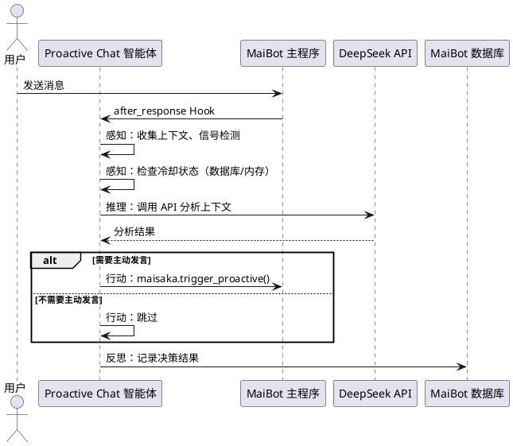
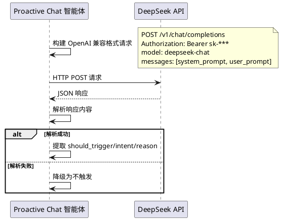
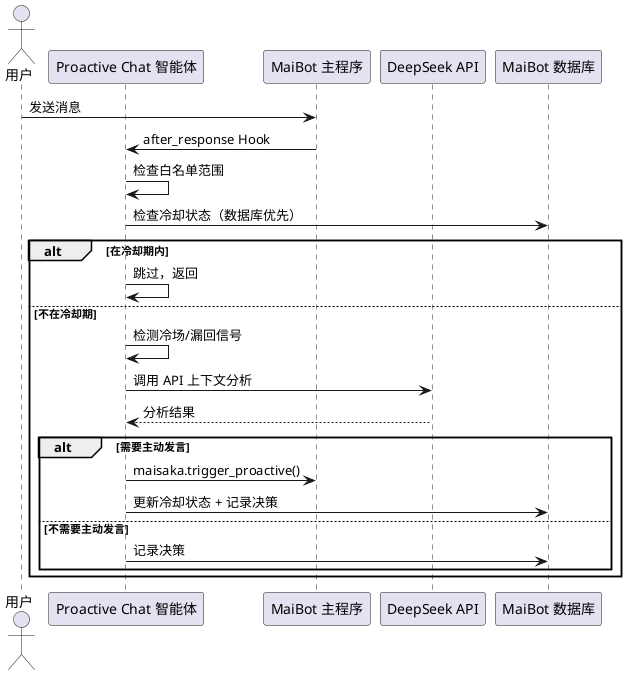
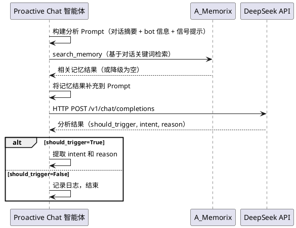
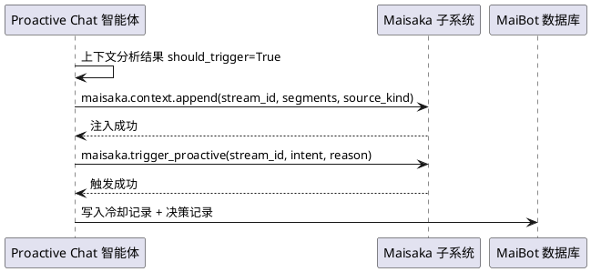
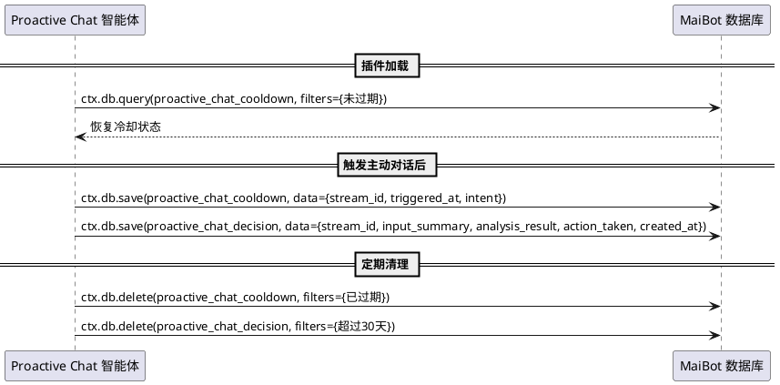
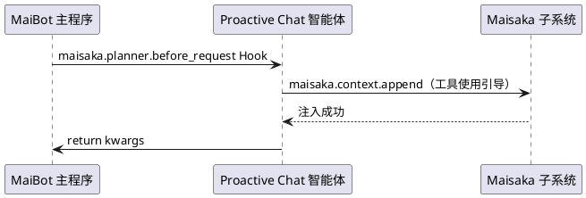
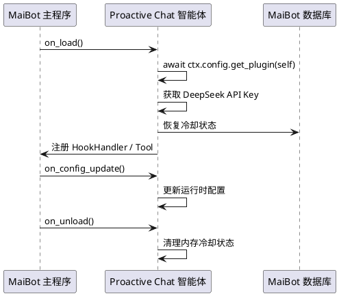
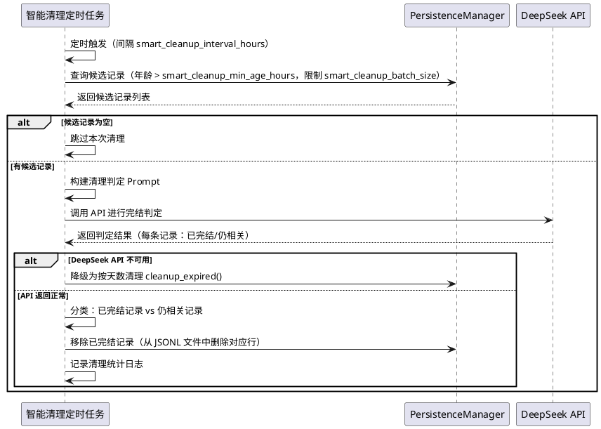
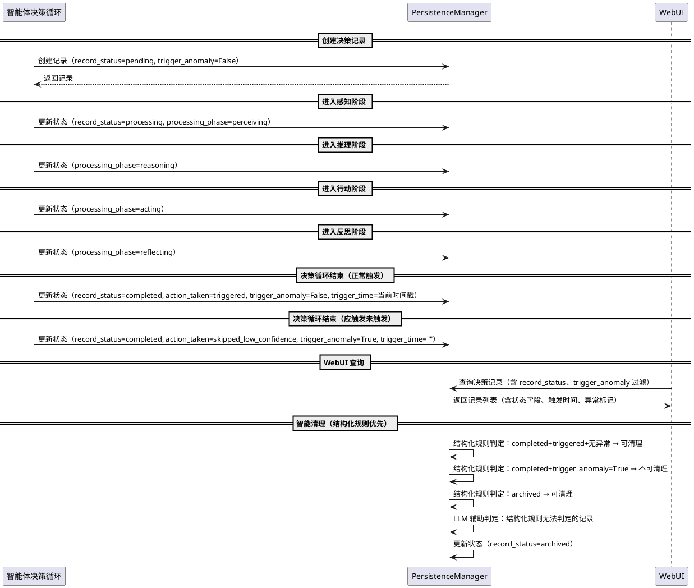

# 1. 组件定位

## 1.1 核心职责

本组件负责以独立智能体模式运行，基于对话上下文自主判断并触发 MaiBot 主动发言，实现对话节奏感知、上下文驱动的主动对话能力与持久化状态管理。

## 1.2 核心输入

1. **入站消息事件**：通过 HookHandler (`maisaka.planner.after_response`) 接收的 Planner 响应完成事件，包含 `session_id`（聊天流 ID）、`message`（消息体）等信息
2. **对话上下文**：通过直接调用 DeepSeek API 获取的当前对话上下文分析结果
3. **插件配置**：通过 `ctx.config.get_plugin()` 获取的冷却时长、触发阈值等配置项（RPC 不可用时 fallback 至 config.toml 文件）
4. **A_Memorix 记忆数据**：通过 `ctx.api.call("a_memorix.search_memory")` 获取的与当前话题相关的记忆
5. **数据库持久化状态**：通过 `ctx.db` (DatabaseCapability) 读写的历史决策记录、冷却状态、对话摘要等

## 1.3 核心输出

1. **主动对话触发请求**：通过 `maisaka.trigger_proactive` API 发出的主动发言指令，包含 `stream_id`、`intent`、`reason`
2. **上下文注入内容**：通过 `maisaka.context.append` 向对话上下文注入的判断依据文本
3. **工具注册**：通过 `@Tool` 装饰器注册的主动发言触发工具，供 LLM Planner 调用
4. **数据库记录**：通过 `ctx.db` 写入的决策日志、状态快照、分析历史
5. **日志输出**：插件运行状态、触发决策、异常信息的日志记录

## 1.4 职责边界

1. **不负责**消息的最终生成和发送——由 Maisaka replyer 链路完成
2. **不负责**对话上下文的构建和管理——由 Maisaka 子系统完成
3. **不负责**用户画像和记忆的存储——由 A_Memorix 完成
4. **不负责**显式指令式主动发言控制——本插件严格由上下文驱动，不响应 `/proactive` 等指令
5. **不负责**修改主程序代码——仅通过插件 API 和 Hook 交互
6. **不负责**跨聊天流的主动发言协调——每个聊天流独立判断
7. **不负责**MaiBot 内置 LLM 管道的可用性保障——本插件独立调用 DeepSeek API，不依赖 `ctx.llm.generate()`

# 2. 领域术语

**主动对话触发**
: 当智能体判断当前对话上下文满足主动发言条件时，通过 `maisaka.trigger_proactive` API 向 Maisaka 子系统发出主动发言请求的行为。

**对话上下文分析**
: 使用 DeepSeek API 对当前聊天流的近期消息进行语义分析，判断是否存在需要 bot 主动介入的场景。分析过程独立于 MaiBot 的 LLM 管道。

**冷却窗口**
: 对同一聊天流，在触发一次主动对话后的一段时间内不再重复触发的防抖机制。冷却状态持久化至数据库，插件重启后可恢复。

**意图（intent）**
: 主动对话触发时附带的意图标签，用于 Maisaka 子系统理解主动发言的动机，如 `topic_supplement`（话题补充）、`silence_break`（冷场打破）、`missed_reply`（漏回补答）。

**触发原因（reason）**
: 主动对话触发时附带的自然语言描述，解释为何需要主动发言，供 Maisaka Planner 参考。

**上下文注入**
: 通过 `maisaka.context.append` 向对话上下文追加消息段，为后续 LLM 生成提供判断依据的行为。

**白名单生效范围**
: 插件对聊天流的生效控制机制，采用严格白名单模式——仅被加入白名单的聊天流才会触发主动对话，白名单为空时不对任何聊天流生效。白名单分群聊和私聊两个维度独立管理。

**漏回场景**
: 对话中有人 @了 bot 但 bot 未做出回应的情况，属于需要主动补答的场景。

**冷场场景**
: 群聊中长时间无消息后新消息到达，或对话出现明显停顿的情况。

**智能体决策循环**
: 插件以智能体模式运行时的核心决策流程：感知（收集上下文）→ 推理（调用 DeepSeek API 分析）→ 行动（触发主动对话或跳过）→ 反思（记录决策结果至数据库）。

**决策记录**
: 每次智能体决策的完整快照，包含输入上下文、分析结果、最终行动、时间戳等信息，持久化存储至数据库，用于决策回溯和模式学习。

**DeepSeek API 独立调用**
: 插件绕过 MaiBot 的 `ctx.llm.generate()` 管道，直接通过 HTTP 请求调用 DeepSeek API 进行上下文分析，避免 Runner 进程隔离导致的 LLM 不可用问题。

# 3. 角色与边界

## 3.1 核心角色

- **群聊参与者**：在群聊中发送消息的用户，其消息内容是触发判断的主要输入
- **私聊用户**：在私聊中与 bot 对话的用户，其对话节奏是触发判断的输入之一
- **Bot 管理员**：通过插件配置调整触发阈值、冷却时长、DeepSeek API 参数等的运维人员

## 3.2 外部系统

- **Maisaka 子系统**：MaiBot 的对话管理核心，提供 `trigger_proactive`（主动触发）、`context.append`（上下文注入）等 API
- **A_Memorix**：MaiBot 的记忆系统，提供记忆检索接口，用于判断对话内容是否与 bot 记忆/知识相关
- **DeepSeek API**：独立的 LLM 服务，插件直接通过 HTTP 调用进行上下文分析，不依赖 MaiBot 的 LLM 管道
- **MaiBot 数据库**：通过 `ctx.db` (DatabaseCapability) 访问的持久化存储，用于冷却状态、决策记录、对话摘要的持久化
- **MaiBot 主程序**：通过 Hook 和 EventHandler 接收事件、通过 API 交互的宿主系统

## 3.3 交互上下文

```plantuml
@startuml
left to right direction

rectangle "Proactive Chat 智能体" as agent {
}

actor "群聊参与者" as user
actor "Bot 管理员" as admin
system "Maisaka 子系统" as maisaka
system "A_Memorix" as memorix
system "DeepSeek API" as deepseek
system "MaiBot 数据库" as db
system "MaiBot 主程序" as maibot

user --> agent : 发送消息（after_response Hook）
admin --> agent : 调整配置
agent --> maisaka : trigger_proactive / context.append
agent --> memorix : search_memory（记忆检索）
agent --> deepseek : HTTP API（上下文分析）
agent --> db : ctx.db（状态持久化）
maibot --> agent : Hook 事件分发

@enduml
```

# 4. DFX 约束

## 4.1 性能

1. **上下文分析延迟**：单次 DeepSeek API 调用应在 30 秒内完成（含网络延迟），超时则放弃本次判断
2. **Hook 处理延迟**：`maisaka.planner.after_response` Hook 处理不应阻塞消息处理主流程，分析逻辑应异步执行
3. **冷却窗口精度**：冷却时长判断的误差不超过 1 秒
4. **内存占用**：插件运行时内存增量不超过 50MB（不含 LLM 推理部分）
5. **DeepSeek API 调用频率**：同一聊天流在冷却窗口内不重复调用 API，避免不必要的 API 消耗

## 4.2 可靠性

1. **降级容错**：DeepSeek API 不可用时，插件应静默跳过上下文分析，不影响消息正常处理
2. **A_Memorix 降级**：A_Memorix 不可用时，插件应跳过记忆相关性判断，仅基于对话文本进行分析
3. **触发失败处理**：`maisaka.trigger_proactive` 调用失败时，应记录日志但不影响后续触发判断
4. **异常隔离**：插件内部异常不应导致 MaiBot 主程序崩溃或消息处理中断
5. **数据库降级**：`ctx.db` 不可用时，插件应 fallback 至内存存储冷却状态，记录降级日志，功能不中断
6. **API Key 获取降级**：无法从主程序配置获取 DeepSeek API Key 时，应尝试从插件配置文件读取，均不可用时记录错误日志并禁用分析功能

## 4.3 安全性

1. **禁止直接导入主程序模块**：所有交互必须通过 `ctx.api.call()`、Hook、EventHandler 完成
2. **配置安全**：插件配置模型所有字段必须提供默认值，防止 WebUI Schema 构造失败
3. **ID 规范**：`_manifest.json` 的 `id` 字段必须为纯 ASCII
4. **API Key 安全**：DeepSeek API Key 不得硬编码在源码中，不得写入日志，不得通过 WebUI 明文展示
5. **数据库操作安全**：所有数据库写入必须经过参数校验，防止注入攻击

## 4.4 可维护性

1. **日志规范**：所有触发决策、异常情况必须记录日志，日志前缀使用插件名
2. **配置热更新**：支持通过 WebUI 修改配置，通过 `on_config_update` 回调生效
3. **语言规范**：注释、日志、WebUI 展示语言优先使用简体中文
4. **决策可追溯**：所有智能体决策必须持久化至数据库，支持按时间、聊天流、意图类型查询

## 4.5 兼容性

1. **SDK 版本**：`_manifest.json` 的 `sdk.min_version` 设为 `"2.5.4"`
2. **API 签名**：使用 SDK 2.5.4+ 全限定名格式 `ctx.api.call("plugin_id.api_name")`
3. **Docker 部署**：插件代码放在 `data/MaiMBot/plugins/proactive-chat/` 下，通过卷挂载实时同步
4. **DeepSeek API 兼容**：使用 OpenAI 兼容接口格式调用 DeepSeek API，base_url 为 `https://api.deepseek.com`

# 5. 核心能力

## 5.1 智能体决策循环

### 5.1.1 业务规则

1. **智能体运行模式规则**：The 插件 shall 以智能体模式运行，每次决策遵循"感知→推理→行动→反思"的完整循环

   a. 验收条件：[Planner 响应完成事件触发] → [插件依次执行：收集上下文（感知）、调用 DeepSeek API 分析（推理）、决定是否触发主动对话（行动）、记录决策结果至数据库（反思）]

2. **感知阶段规则**：When 智能体进入决策循环，the 插件 shall 收集当前聊天流的近期消息、冷却状态、冷场/漏回信号、记忆检索结果作为决策输入

   a. 验收条件：[智能体开始决策] → [收集到近期消息列表、冷却状态、信号检测结果、记忆检索结果（如有）]

3. **推理阶段规则**：When 智能体完成感知，the 插件 shall 调用 DeepSeek API 对收集的上下文进行综合分析

   a. 验收条件：[感知数据收集完成] → [调用 DeepSeek API，传入系统 Prompt 和用户 Prompt，获取分析结果]

4. **行动阶段规则**：When 推理结果为 should_trigger=True，the 插件 shall 执行主动对话触发；When 推理结果为 should_trigger=False，the 插件 shall 跳过触发

   a. 验收条件：[推理结果 should_trigger=True] → [调用 maisaka.context.append 注入判断依据，调用 maisaka.trigger_proactive 触发主动对话]

   b. 验收条件：[推理结果 should_trigger=False] → [记录日志，不触发主动对话]

5. **反思阶段规则**：While 智能体完成行动，the 插件 shall 将本次决策的完整信息持久化至数据库

   a. 验收条件：[决策完成（无论是否触发）] → [数据库中新增一条决策记录，包含 stream_id、输入上下文摘要、分析结果、最终行动、时间戳]

6. **禁止指令控制规则**：触发机制严格由对话上下文驱动，禁止通过显式指令（如 `/proactive`）控制触发

   a. 验收条件：[用户发送 `/proactive` 指令] → [插件不响应该指令，不触发主动对话]

### 5.1.2 交互流程



### 5.1.3 异常场景

1. **DeepSeek API 调用超时**

   a. 触发条件：DeepSeek API 调用超过 30 秒未返回

   b. 系统行为：放弃本次上下文分析，记录警告日志，不触发主动对话，记录决策（结果为"分析超时"）

   c. 用户感知：无感知，bot 行为不受影响

2. **DeepSeek API 返回格式异常**

   a. 触发条件：DeepSeek API 返回的内容无法解析为预期的判断结果

   b. 系统行为：记录警告日志，按"不需要主动发言"处理，记录决策（结果为"解析失败"）

   c. 用户感知：无感知，bot 行为不受影响

3. **DeepSeek API Key 不可用**

   a. 触发条件：无法从主程序配置或插件配置获取有效的 DeepSeek API Key

   b. 系统行为：记录错误日志，禁用上下文分析功能，插件仅保留 @Tool 路径的触发能力

   c. 用户感知：自动路径的主动对话不生效，但 LLM Planner 仍可通过 @Tool 手动触发

4. **数据库不可用**

   a. 触发条件：`ctx.db` 调用失败

   b. 系统行为：fallback 至内存存储冷却状态，记录降级日志，决策记录写入审计日志文件

   c. 用户感知：功能基本正常，但插件重启后冷却状态丢失

## 5.2 DeepSeek API 独立调用

### 5.2.1 业务规则

1. **独立调用规则**：The 插件 shall 直接通过 HTTP 请求调用 DeepSeek API，不依赖 MaiBot 的 `ctx.llm.generate()` 管道

   a. 验收条件：[插件需要进行上下文分析时] → [直接向 `https://api.deepseek.com` 发送 OpenAI 兼容格式的 API 请求]

2. **API Key 获取规则**：The 插件 shall 通过以下优先级获取 DeepSeek API Key：
   - 第一优先级：通过 `ctx.config.get()` 从主程序 model_config 中读取对应 provider 的 api_key
   - 第二优先级：从插件配置文件 config.toml 中的 `[deepseek]` 段读取
   - 第三优先级：从环境变量 `DEEPSEEK_API_KEY` 读取

   a. 验收条件：[插件加载时] → [按优先级尝试获取 API Key，获取成功后缓存至内存]

   b. 验收条件：[所有来源均无有效 API Key] → [记录错误日志，禁用自动分析路径]

3. **API 调用格式规则**：The 插件 shall 使用 OpenAI 兼容接口格式调用 DeepSeek API

   a. 验收条件：[调用 DeepSeek API 时] → [请求格式遵循 OpenAI Chat Completions API 规范，base_url 为 `https://api.deepseek.com`]

4. **模型选择规则**：The 插件 shall 使用可配置的 DeepSeek 模型名称，默认为 `deepseek-chat`

   a. 验收条件：[管理员配置 deepseek_model 为 "deepseek-reasoner"] → [API 请求使用 deepseek-reasoner 模型]

5. **API 调用参数规则**：The 插件 shall 对 DeepSeek API 调用设置合理的默认参数

   a. 验收条件：[调用 DeepSeek API 时] → [temperature 默认 0.3（可配置），max_tokens 默认 300（可配置），timeout 30 秒]

6. **API 调用错误处理规则**：If DeepSeek API 返回错误（HTTP 4xx/5xx），the 插件 shall 根据错误类型采取不同策略

   a. 验收条件：[API 返回 429 (Rate Limit)] → [记录警告日志，放弃本次分析，不重试]

   b. 验收条件：[API 返回 401/403 (Auth Error)] → [记录错误日志，标记 API Key 无效，后续不再尝试调用]

   c. 验收条件：[API 返回 5xx (Server Error)] → [记录警告日志，放弃本次分析，下次仍可尝试]

7. **API Key 安全规则**：DeepSeek API Key 不得出现在日志、审计文件、WebUI 展示中

   a. 验收条件：[记录日志时] → [API Key 被脱敏为 `sk-***...***` 格式]

### 5.2.2 交互流程



### 5.2.3 异常场景

1. **网络连接失败**

   a. 触发条件：无法建立到 `api.deepseek.com` 的网络连接

   b. 系统行为：记录警告日志，放弃本次分析，不触发主动对话

   c. 用户感知：无感知，bot 不主动发言

2. **API Key 过期或无效**

   a. 触发条件：DeepSeek API 返回 401/403 错误

   b. 系统行为：标记 API Key 为无效状态，后续调用直接跳过（避免反复请求），记录错误日志

   c. 用户感知：自动路径的主动对话不生效，管理员需更新 API Key 后重启插件

## 5.3 对话上下文监控与触发判断

### 5.3.1 业务规则

1. **Hook 事件监听规则**：插件必须通过 HookHandler (`maisaka.planner.after_response`) 监听 Planner 响应完成事件

   a. 验收条件：[Planner 完成响应后] → [插件收到 after_response Hook 事件，包含 session_id、message 等信息]

2. **通知消息过滤规则**：插件必须过滤系统通知消息（`is_notify=True`），不对通知消息进行上下文分析

   a. 验收条件：[收到 is_notify=True 的消息] → [插件跳过该消息，不触发上下文分析]

3. **冷却窗口规则**：同一聊天流在触发主动对话后，必须进入冷却窗口，冷却期间不再触发

   a. 验收条件：[聊天流 A 在 T1 时刻触发主动对话，冷却时长为 5 分钟] → [T1 到 T1+5min 期间，聊天流 A 不再触发主动对话]

4. **冷却窗口可配置规则**：冷却窗口时长必须可通过插件配置调整

   a. 验收条件：[管理员将冷却时长配置为 10 分钟] → [触发后 10 分钟内同一聊天流不再触发]

5. **冷却状态持久化规则**：冷却窗口状态必须持久化至数据库，插件重启后可恢复

   a. 验收条件：[插件触发主动对话后写入冷却记录至数据库] → [插件重启后从数据库恢复冷却状态，冷却期内仍不重复触发]

   b. 验收条件：[数据库不可用时] → [fallback 至内存存储，插件重启后冷却状态丢失]

6. **白名单生效范围规则**：插件必须采用严格白名单模式，仅对被加入白名单的聊天流生效，白名单为空时不对任何聊天流生效

   a. 验收条件：[群聊白名单和私聊白名单均为空] → [所有聊天流均不触发主动对话]

   b. 验收条件：[群聊白名单包含群ID "123456789"] → [仅群ID为 "123456789" 的群聊会触发主动对话]

   c. 验收条件：[私聊白名单包含用户ID "987654321"] → [仅与用户ID "987654321" 的私聊会触发主动对话]

7. **白名单分维度管理规则**：白名单必须分群聊和私聊两个维度独立管理

   a. 验收条件：[群聊白名单包含群ID "123456789"，私聊白名单为空] → [群ID为 "123456789" 的群聊触发，所有私聊不触发]

   b. 验收条件：[群聊白名单为空，私聊白名单包含用户ID "987654321"] → [所有群聊不触发，与用户ID "987654321" 的私聊触发]

8. **白名单通配符规则**：白名单支持 `"*"` 通配符，表示该维度全部启用

   a. 验收条件：[群聊白名单包含 "*"] → [所有群聊均触发主动对话]

   b. 验收条件：[私聊白名单包含 "*"] → [所有私聊均触发主动对话]

9. **群名称匹配规则**：群聊白名单默认仅匹配群ID，可选启用群名称匹配

   a. 验收条件：[启用群名称匹配，群聊白名单包含 "测试群"] → [群名称为 "测试群" 的群聊触发主动对话]

   b. 验收条件：[未启用群名称匹配，群聊白名单包含 "测试群"] → [仅群ID为 "测试群" 的群聊触发（通常不会匹配，因为群ID为数字格式）]

10. **白名单前置检查规则**：白名单检查必须在冷却窗口检查之前执行，不在白名单范围内的消息应直接跳过，不进入冷却检查和上下文分析

    a. 验收条件：[收到白名单范围外的消息] → [不执行冷却窗口检查，不触发上下文分析]

11. **白名单配置热更新规则**：白名单配置必须支持通过 WebUI 热更新，修改后即时生效

    a. 验收条件：[管理员通过 WebUI 在群聊白名单中添加群ID] → [后续该群聊的消息可触发主动对话，无需重启插件]

12. **上下文分析触发规则**：当收到非通知消息且在白名单范围内且不在冷却窗口内时，插件应当对对话上下文进行轻量分析

    a. 验收条件：[收到白名单范围内的群聊消息，且该聊天流不在冷却窗口内] → [插件调用 DeepSeek API 进行上下文分析]

### 5.3.2 交互流程



### 5.3.3 异常场景

1. **白名单匹配失败**

   a. 触发条件：消息来源的群ID/用户ID不在白名单范围内

   b. 系统行为：跳过该消息，不触发上下文分析，记录调试日志

   c. 用户感知：无感知，该聊天流不触发主动对话

2. **Hook 执行异常**

   a. 触发条件：after_response handler 内部抛出未捕获异常

   b. 系统行为：SDK 捕获异常，插件记录错误日志，不影响消息主流程

   c. 用户感知：无感知，消息正常处理

## 5.4 上下文分析逻辑

### 5.4.1 业务规则

1. **话题补充判断规则**：When 对话中出现与 bot 专业知识领域相关的话题且 bot 尚未参与讨论，the 插件 shall 判断为话题补充场景

   a. 验收条件：[群聊讨论"Python 异步编程"，bot 具备该领域知识，bot 未参与讨论] → [上下文分析结果包含 intent=`topic_supplement`]

2. **冷场打破判断规则**：When 群聊中出现长时间沉默后新消息到达，the 插件 shall 判断为冷场打破场景

   a. 验收条件：[群聊 10 分钟无消息后有人发送新消息] → [上下文分析结果包含 intent=`silence_break`]

3. **漏回补答判断规则**：When 对话中有人 @了 bot 但 bot 未做出回应，the 插件 shall 判断为漏回补答场景

   a. 验收条件：[用户 @bot 提问，bot 在 2 条消息内未回应] → [上下文分析结果包含 intent=`missed_reply`]

4. **分析结果格式规则**：上下文分析结果必须包含 `should_trigger`（布尔值）、`intent`（意图标签）、`reason`（自然语言原因描述）

   a. 验收条件：[上下文分析完成] → [返回结果包含 should_trigger、intent、reason 三个字段]

5. **分析 Prompt 规则**：上下文分析的 Prompt 必须包含当前对话的近期消息摘要、bot 角色信息、可选的记忆检索结果、冷场/漏回信号提示

   a. 验收条件：[构建分析 Prompt 时] → [Prompt 包含对话摘要、bot 信息、信号提示、记忆结果（如有）]

6. **DeepSeek API 调用规则**：上下文分析必须通过 DeepSeek API 独立调用，禁止使用 `ctx.llm.generate()`

   a. 验收条件：[执行上下文分析时] → [直接调用 DeepSeek API，不经过 MaiBot LLM 管道]

### 5.4.2 交互流程



### 5.4.3 异常场景

1. **A_Memorix 不可用**

   a. 触发条件：`ctx.api.call("a_memorix.search_memory")` 抛出异常

   b. 系统行为：跳过记忆检索，仅基于对话文本进行分析，记录降级日志

   c. 用户感知：无感知，分析结果可能缺少记忆关联维度

2. **对话上下文为空**

   a. 触发条件：当前聊天流无近期消息可分析

   b. 系统行为：跳过上下文分析，不触发主动对话

   c. 用户感知：无感知

## 5.5 主动对话触发

### 5.5.1 业务规则

1. **触发 API 调用规则**：When 上下文分析结果为 should_trigger=True，the 插件 shall 调用 `maisaka.trigger_proactive` API 触发主动对话

   a. 验收条件：[上下文分析结果 should_trigger=True] → [调用 maisaka.trigger_proactive(stream_id, intent, reason)]

2. **上下文注入规则**：While 触发主动对话，the 插件 shall 通过 `maisaka.context.append` 向对话上下文注入判断依据

   a. 验收条件：[触发主动对话时] → [调用 maisaka.context.append 注入包含触发原因的文本段]

3. **上下文注入格式规则**：maisaka.context.append 的 segments 参数必须为 `list[dict]` 格式

   a. 验收条件：[调用 maisaka.context.append 时] → [segments 参数为 [{"type": "text", "content": "判断依据文本"}]]

4. **触发失败容错规则**：If maisaka.trigger_proactive 调用失败，the 插件 shall 记录错误日志但不影响后续触发判断

   a. 验收条件：[trigger_proactive 调用抛出异常] → [记录错误日志，下次满足条件时仍可正常触发]

5. **冷却窗口启动规则**：When 主动对话触发成功，the 插件 shall 为该聊天流启动冷却窗口并持久化至数据库

   a. 验收条件：[trigger_proactive 调用成功] → [该聊天流进入冷却状态，冷却记录写入数据库，冷却期间不再触发]

### 5.5.2 交互流程



### 5.5.3 异常场景

1. **trigger_proactive 调用失败**

   a. 触发条件：maisaka.trigger_proactive 抛出异常（如 stream_id 无效）

   b. 系统行为：记录错误日志，不启动冷却窗口，允许后续重试，记录决策（结果为"触发失败"）

   c. 用户感知：bot 可能不主动发言，但下次满足条件时仍可触发

2. **context.append 调用失败**

   a. 触发条件：maisaka.context.append 抛出异常

   b. 系统行为：记录警告日志，继续执行 trigger_proactive（上下文注入非关键路径）

   c. 用户感知：bot 主动发言时可能缺少判断依据的上下文提示

## 5.6 数据库持久化

### 5.6.1 业务规则

1. **冷却状态持久化规则**：The 插件 shall 将冷却窗口状态持久化至数据库，确保插件重启后冷却状态可恢复

   a. 验收条件：[触发主动对话后] → [冷却记录写入数据库，包含 stream_id、triggered_at、intent]

   b. 验收条件：[插件加载时] → [从数据库恢复所有未过期的冷却记录]

2. **决策记录持久化规则**：The 插件 shall 将每次智能体决策的完整信息持久化至数据库

   a. 验收条件：[智能体完成一次决策] → [数据库中新增一条决策记录，包含 stream_id、input_summary、analysis_result、action_taken、created_at]

3. **决策记录查询规则**：The 插件 shall 支持按时间范围、聊天流、意图类型查询历史决策记录

   a. 验收条件：[查询最近 24 小时聊天流 A 的决策记录] → [返回该时间段内该聊天流的所有决策记录]

4. **过期数据清理规则**：The 插件 shall 定期清理过期的冷却记录和过旧的决策记录

   a. 验收条件：[冷却记录超过 cooldown_seconds * 2 的时间] → [该记录被清理]

   b. 验收条件：[决策记录超过 30 天] → [该记录被清理]

5. **数据库降级规则**：If `ctx.db` 不可用，the 插件 shall fallback 至内存存储冷却状态，决策记录写入审计日志文件

   a. 验收条件：[ctx.db 调用抛出异常] → [切换至内存冷却管理，决策记录写入 JSONL 审计日志文件]

6. **数据库模型命名规则**：插件使用的数据库模型名必须以 `proactive_chat_` 为前缀，避免与其他插件冲突

   a. 验收条件：[定义数据库模型时] → [模型名为 `proactive_chat_cooldown`、`proactive_chat_decision` 等]

### 5.6.2 交互流程



### 5.6.3 异常场景

1. **数据库写入失败**

   a. 触发条件：ctx.db.save 调用抛出异常

   b. 系统行为：fallback 至内存存储冷却状态，决策记录写入审计日志文件，记录降级日志

   c. 用户感知：功能基本正常，但插件重启后冷却状态丢失

2. **数据库读取失败**

   a. 触发条件：ctx.db.query 调用抛出异常

   b. 系统行为：使用空的冷却状态（即所有聊天流视为已冷却），记录降级日志

   c. 用户感知：插件重启后可能重复触发近期已触发的聊天流

## 5.7 LLM 工具调用意愿优化

### 5.7.1 业务规则

1. **工具描述丰富化规则**：The 插件 shall 为注册的 @Tool 提供详细的使用场景和触发条件说明

   a. 验收条件：[注册主动发言触发工具时] → [工具描述包含使用场景、触发条件、参数说明]

2. **工具参数设计规则**：The 插件 shall 设计合理的工具参数，引导 LLM 正确使用工具

   a. 验收条件：[注册工具参数时] → [每个参数有明确的描述、类型和是否必填]

3. **Prompt 注入增强规则**：While Maisaka Planner 请求前，the 插件 shall 通过 Hook 向对话上下文注入工具使用引导信息（仅对白名单范围内的会话注入）

   a. 验收条件：[maisaka.planner.before_request Hook 触发时，当前会话在白名单范围内] → [向上下文注入主动发言工具的使用引导]

   b. 验收条件：[maisaka.planner.before_request Hook 触发时，当前会话不在白名单范围内] → [不向上下文注入工具使用引导]

4. **Hook 超时规则**：涉及 LLM 调用的 HookHandler 必须设置 timeout_ms=30000

   a. 验收条件：[注册涉及 LLM 调用的 Hook 时] → [timeout_ms 参数设为 30000]

5. **上下文注入优先规则**：The 插件 shall 优先使用 `maisaka.context.append` 注入上下文，而非直接修改 kwargs["messages"]

   a. 验收条件：[需要向对话上下文注入内容时] → [使用 ctx.maisaka.context.append() 而非 kwargs["messages"].insert()]

### 5.7.2 交互流程



### 5.7.3 异常场景

1. **工具调用参数错误**

   a. 触发条件：LLM 调用主动发言工具时传递了不符合预期的参数

   b. 系统行为：工具 handler 校验参数，对缺失或非法参数返回错误提示

   c. 用户感知：LLM 收到工具调用错误反馈，可修正后重试

2. **Hook 注入失败**

   a. 触发条件：maisaka.context.append 在 Hook 中调用失败

   b. 系统行为：记录警告日志，返回原始 kwargs，不阻塞主流程

   c. 用户感知：LLM 可能缺少工具使用引导，但主流程不受影响

## 5.8 插件生命周期管理

### 5.8.1 业务规则

1. **插件加载规则**：When 插件被加载，the 插件 shall 初始化冷却状态（从数据库恢复）、获取 DeepSeek API Key、注册所有 HookHandler 和 Tool

   a. 验收条件：[MaiBot 启动或插件热加载时] → [on_load() 完成所有注册和初始化，包括 API Key 获取和数据库冷却状态恢复]

2. **插件卸载规则**：When 插件被卸载，the 插件 shall 清理内存中的冷却状态、记录卸载日志

   a. 验收条件：[插件卸载时] → [on_unload() 清理所有运行时状态]

3. **配置加载规则**：The 插件 shall 在 on_load 时通过 `await ctx.config.get_plugin(self)` 加载配置，RPC 不可用时 fallback 至 config.toml 文件

   a. 验收条件：[on_load 执行时] → [通过 await 获取插件配置实例，RPC 失败时从文件读取]

4. **配置热更新规则**：When 配置被修改，the 插件 shall 通过 `on_config_update` 回调更新运行时配置

   a. 验收条件：[管理员通过 WebUI 修改冷却时长] → [on_config_update 被调用，运行时配置即时生效]

5. **配置默认值规则**：PluginConfigBase 子类的所有字段必须提供默认值

   a. 验收条件：[定义配置模型时] → [每个 Field 都有 default 参数]

6. **DeepSeek API Key 初始化规则**：The 插件 shall 在 on_load 时按优先级获取 DeepSeek API Key 并缓存

   a. 验收条件：[on_load 执行时] → [尝试从主程序配置获取 API Key，失败则从插件配置文件获取，再失败则从环境变量获取]

### 5.8.2 交互流程



### 5.8.3 异常场景

1. **配置加载失败**

   a. 触发条件：ctx.config.get_plugin() 调用失败或返回空 dict

   b. 系统行为：从 config.toml 文件读取配置，文件也不存在时使用硬编码默认配置，记录警告日志

   c. 用户感知：插件使用默认配置运行，功能正常但参数非自定义

2. **API Key 获取失败**

   a. 触发条件：所有来源均无法获取有效的 DeepSeek API Key

   b. 系统行为：记录错误日志，禁用自动分析路径，仅保留 @Tool 路径

   c. 用户感知：自动路径的主动对话不生效，需配置 API Key 后重启

3. **数据库冷却状态恢复失败**

   a. 触发条件：从数据库读取冷却记录失败

   b. 系统行为：使用空的冷却状态（所有聊天流视为已冷却），记录降级日志

   c. 用户感知：插件重启后可能重复触发近期已触发的聊天流

# 6. 数据约束

## 6.1 冷却窗口记录 (proactive_chat_cooldown)

1. **stream_id**：聊天流唯一标识，字符串类型，必填，主键
2. **triggered_at**：最近一次触发时间戳，浮点数类型（Unix 时间戳），必填
3. **intent**：最近一次触发的意图标签，字符串类型，可选
4. **created_at**：记录创建时间，浮点数类型（Unix 时间戳），必填

## 6.2 决策记录 (proactive_chat_decision)

1. **id**：决策记录唯一标识，整数类型，自增主键
2. **stream_id**：聊天流唯一标识，字符串类型，必填，索引字段
3. **input_summary**：输入上下文摘要（近期消息概要、信号状态等），字符串类型，必填，最大长度 2000 字符
4. **analysis_result**：DeepSeek API 分析结果（should_trigger、intent、reason 的 JSON 字符串），字符串类型，必填
5. **action_taken**：最终采取的行动（triggered / skipped / error），字符串类型，必填
6. **created_at**：决策时间戳，浮点数类型（Unix 时间戳），必填，索引字段

## 6.3 上下文分析结果

1. **should_trigger**：是否应触发主动对话，布尔类型，必填
2. **intent**：意图标签，枚举值（topic_supplement / silence_break / missed_reply），必填（当 should_trigger=True 时）
3. **reason**：自然语言原因描述，字符串类型，必填（当 should_trigger=True 时），最大长度 200 字符

## 6.4 主动对话触发请求

1. **stream_id**：目标聊天流 ID，字符串类型，必填
2. **intent**：意图标签，字符串类型，必填
3. **reason**：触发原因，字符串类型，必填，最大长度 500 字符

## 6.5 插件配置

1. **cooldown_seconds**：冷却窗口时长（秒），整数类型，默认值 300，取值范围 [60, 3600]
2. **enable_topic_supplement**：是否启用话题补充触发，布尔类型，默认值 True
3. **enable_silence_break**：是否启用冷场打破触发，布尔类型，默认值 True
4. **enable_missed_reply**：是否启用漏回补答触发，布尔类型，默认值 True
5. **enable_memory_recall**：是否启用记忆关联触发，布尔类型，默认值 True
6. **silence_threshold_seconds**：冷场判断的沉默时长阈值（秒），整数类型，默认值 600，取值范围 [120, 7200]
7. **missed_reply_window**：漏回判断的消息窗口大小（条数），整数类型，默认值 3，取值范围 [1, 10]
8. **max_analysis_tokens**：上下文分析的最大 token 数，整数类型，默认值 300，取值范围 [100, 1000]
9. **group_whitelist**：群聊白名单，字符串列表类型，默认值 []，列表元素为群ID或群名称（需启用群名称匹配），支持通配符 "*"
10. **private_whitelist**：私聊白名单，字符串列表类型，默认值 []，列表元素为用户ID，支持通配符 "*"
11. **enable_group_name_match**：是否启用群名称匹配，布尔类型，默认值 False
12. **deepseek_model**：DeepSeek API 使用的模型名称，字符串类型，默认值 "deepseek-chat"
13. **deepseek_temperature**：DeepSeek API 调用的温度参数，浮点数类型，默认值 0.3，取值范围 [0, 2]
14. **deepseek_api_key**：DeepSeek API Key（仅作为 fallback 配置，优先从主程序配置获取），字符串类型，默认值 ""，WebUI 展示时脱敏
15. **deepseek_base_url**：DeepSeek API 的 base URL，字符串类型，默认值 "https://api.deepseek.com"
16. **decision_retention_days**：决策记录保留天数，整数类型，默认值 30，取值范围 [1, 365]
17. **smart_cleanup_enabled**：是否启用决策记录智能清理，布尔类型，默认值 False
18. **smart_cleanup_interval_hours**：智能清理执行间隔（小时），整数类型，默认值 6，取值范围 [1, 72]
19. **smart_cleanup_batch_size**：单次智能清理批量处理的记录数，整数类型，默认值 20，取值范围 [5, 100]
20. **smart_cleanup_min_age_hours**：决策记录参与智能清理的最小年龄（小时），整数类型，默认值 24，取值范围 [1, 168]
21. **smart_cleanup_model**：智能清理使用的 DeepSeek 模型名称，字符串类型，默认值 "deepseek-chat"
22. **smart_cleanup_max_tokens**：智能清理单次 LLM 调用的最大 token 数，整数类型，默认值 500，取值范围 [100, 2000]

## 决策记录智能清理

### 业务背景

当前决策记录的清理策略仅基于保留天数（`decision_retention_days`），按文件日期整文件删除，无法区分"已完结"和"仍相关"的记录。这导致两种问题：

1. **过早清理**：某些决策记录对应的事件虽已过保留天数，但事件本身仍在进行中（如持续讨论的话题），清理后丢失了有参考价值的上下文
2. **过晚清理**：某些决策记录对应的事件早已完结（如一次性问答），但因未到保留天数而占用存储空间

智能清理引入 LLM 判断机制，让 DeepSeek 分析决策记录内容，判断对应事件是否已完结，对已完结的记录提前清理，对仍相关的记录保留至保留天数到期。

### 领域术语补充

**智能清理**
: 使用 LLM 对决策记录进行语义分析，判断记录对应的事件是否已完结，并据此执行差异化清理的行为。与基于保留天数的简单清理（"按天数清理"）相对应。

**事件完结判定**
: LLM 根据决策记录的上下文信息（input_summary、analysis_result、action_taken 等），判断该记录所涉及的事件是否已不再具有后续参考价值的过程。判定结果为"已完结"或"仍相关"。

**清理降级**
: 当 LLM 不可用时，智能清理自动退化为原有的按天数清理策略，确保数据不会因 LLM 故障而无限增长。

### 5.9 决策记录智能清理

#### 5.9.1 业务规则

1. **智能清理启用规则**：Where `smart_cleanup_enabled` 配置为 True，the 插件 shall 启用决策记录智能清理功能；Where `smart_cleanup_enabled` 配置为 False，the 插件 shall 仅使用原有的按天数清理策略

   a. 验收条件：[smart_cleanup_enabled=True] → [插件定期执行智能清理流程]

   b. 验收条件：[smart_cleanup_enabled=False] → [插件仅执行按天数清理，不调用 LLM]

2. **智能清理定时触发规则**：When 智能清理已启用，the 插件 shall 按配置的间隔周期性执行智能清理

   a. 验收条件：[smart_cleanup_interval_hours=6] → [每 6 小时执行一次智能清理]

   b. 验收条件：[插件启动时] → [在 on_load 完成后启动智能清理定时任务]

   c. 验收条件：[插件卸载时] → [取消智能清理定时任务]

3. **清理候选记录筛选规则**：When 智能清理执行，the 插件 shall 仅选取满足最小年龄条件的决策记录作为候选

   a. 验收条件：[smart_cleanup_min_age_hours=24] → [仅选取创建时间距今超过 24 小时的决策记录参与智能清理]

   b. 验收条件：[创建时间距今不足 24 小时的决策记录] → [不参与本次智能清理，避免误判近期事件]

4. **批量处理规则**：When 智能清理执行，the 插件 shall 按批次处理候选记录，每批数量不超过 `smart_cleanup_batch_size`

   a. 验收条件：[候选记录共 50 条，smart_cleanup_batch_size=20] → [分 3 批处理，前两批各 20 条，最后一批 10 条]

   b. 验收条件：[单批处理完成后] → [记录本批清理结果日志，继续处理下一批]

5. **LLM 完结判定规则**：When 智能清理处理一批候选记录，the 插件 shall 调用 DeepSeek API 对记录内容进行语义分析，判断每条记录对应的事件是否已完结

   a. 验收条件：[一批候选记录传入 LLM] → [LLM 返回每条记录的完结判定结果（"已完结"或"仍相关"）及判定理由]

   b. 验收条件：[记录的 input_summary 为"群聊讨论Python异步编程"，且该话题已不再被讨论] → [LLM 判定为"已完结"]

   c. 验收条件：[记录的 input_summary 为"用户询问明天天气"，该问题已得到回答且无后续] → [LLM 判定为"已完结"]

   d. 验收条件：[记录的 input_summary 为"持续讨论项目排期"，该话题仍在进行中] → [LLM 判定为"仍相关"]

6. **已完结记录清理规则**：When LLM 判定某条记录对应的事件已完结，the 插件 shall 从 JSONL 文件中移除该条记录

   a. 验收条件：[LLM 判定记录 A 为"已完结"] → [记录 A 从其所在的 JSONL 文件中被移除]

   b. 验收条件：[JSONL 文件中所有记录被移除后] → [删除该空文件]

7. **仍相关记录保留规则**：When LLM 判定某条记录对应的事件仍相关，the 插件 shall 保留该记录，等待下次智能清理或按天数清理

   a. 验收条件：[LLM 判定记录 B 为"仍相关"] → [记录 B 保留在 JSONL 文件中，不被本次智能清理移除]

   b. 验收条件：[记录 B 的保留天数超过 decision_retention_days] → [在按天数清理时被移除]

8. **LLM 降级规则**：If DeepSeek API 在智能清理过程中不可用，the 插件 shall 降级为按天数清理，并记录降级日志

   a. 验收条件：[智能清理执行时 DeepSeek API 不可用] → [跳过 LLM 判定，直接执行按天数清理，记录警告日志]

   b. 验收条件：[智能清理执行时 DeepSeek API 调用超时] → [放弃本次智能清理，记录警告日志，不影响下次执行]

   c. 验收条件：[智能清理执行时 DeepSeek API 返回格式异常] → [放弃本次 LLM 判定，降级为按天数清理，记录警告日志]

9. **清理结果记录规则**：When 智能清理完成一批处理，the 插件 shall 记录本次清理的统计信息

   a. 验收条件：[一批智能清理完成] → [日志记录：候选记录数、已完结清理数、仍相关保留数、降级处理数]

10. **智能清理与按天数清理协同规则**：The 插件 shall 确保智能清理与按天数清理互不冲突

    a. 验收条件：[智能清理和按天数清理同时启用] → [智能清理优先处理候选记录，按天数清理作为兜底清理超过保留天数的文件]

    b. 验收条件：[智能清理已清理的记录] → [按天数清理不会重复处理]

11. **智能清理 Prompt 规则**：When 调用 DeepSeek API 进行完结判定，the 插件 shall 构建专门的清理判定 Prompt

    a. 验收条件：[构建清理判定 Prompt 时] → [系统 Prompt 定义完结判定角色和判定标准，用户 Prompt 包含候选记录的结构化摘要]

    b. 验收条件：[判定标准包含] → [事件是否为一次性问答、话题是否已转移、是否涉及长期进行中的事项]

12. **智能清理 API 调用参数规则**：When 调用 DeepSeek API 进行完结判定，the 插件 shall 使用独立的可配置参数

    a. 验收条件：[智能清理 API 调用时] → [使用 smart_cleanup_model（默认 deepseek-chat）、smart_cleanup_max_tokens（默认 500）、temperature=0.1（低温度确保判定稳定性）]

13. **智能清理不影响主流程规则**：The 智能清理 shall 不影响智能体决策循环和主动对话触发的正常执行

    a. 验收条件：[智能清理正在执行] → [智能体决策循环仍可正常触发主动对话]

    b. 验收条件：[智能清理执行异常] → [不影响智能体决策循环的正常运行]

14. **空候选集规则**：When 智能清理执行时无满足条件的候选记录，the 插件 shall 跳过本次清理

    a. 验收条件：[所有决策记录的年龄均不足 smart_cleanup_min_age_hours] → [跳过本次智能清理，记录调试日志]

#### 5.9.2 交互流程



#### 5.9.3 异常场景

1. **DeepSeek API 不可用**

   a. 触发条件：智能清理执行时 DeepSeek API Key 无效或网络不可达

   b. 系统行为：降级为按天数清理（`cleanup_expired`），记录警告日志，不影响下次智能清理调度

   c. 用户感知：决策记录仍会被按天数清理，但无法区分已完结和仍相关

2. **DeepSeek API 调用超时**

   a. 触发条件：智能清理的 LLM 调用超过 30 秒未返回

   b. 系统行为：放弃本次智能清理，记录警告日志，下次调度时重新执行

   c. 用户感知：本次清理未执行，决策记录保留不变

3. **DeepSeek API 返回格式异常**

   a. 触发条件：LLM 返回的内容无法解析为完结判定结果

   b. 系统行为：降级为按天数清理，记录警告日志，记录 LLM 原始响应（截断至 200 字符）用于排查

   c. 用户感知：决策记录仍会被按天数清理

4. **JSONL 文件读写异常**

   a. 触发条件：移除已完结记录时文件读写失败

   b. 系统行为：记录警告日志，跳过该文件的处理，继续处理其他文件

   c. 用户感知：部分记录可能未被清理，下次智能清理时会重试

5. **智能清理与按天数清理并发**

   a. 触发条件：智能清理和按天数清理同时操作同一 JSONL 文件

   b. 系统行为：智能清理在处理前锁定候选记录范围，按天数清理仅删除整文件，两者操作粒度不同，不会产生冲突

   c. 用户感知：无感知，清理结果一致

6. **候选记录数量过大**

   a. 触发条件：满足条件的候选记录数量远超 `smart_cleanup_batch_size`

   b. 系统行为：按 `smart_cleanup_batch_size` 分批处理，每批独立调用 LLM，批间无间隔

   c. 用户感知：清理过程可能持续较长时间，但不影响主流程

7. **智能清理定时任务异常**

   a. 触发条件：定时任务内部抛出未捕获异常

   b. 系统行为：记录错误日志，本次清理终止，下次调度时重新执行

   c. 用户感知：本次清理未完成，下次调度时自动恢复

## 决策记录状态完善

### 业务背景

当前决策记录（DecisionRecord）仅通过 `action_taken` 字段记录最终动作（如 triggered / skipped_no_trigger / error_loop 等），缺少细粒度的生命周期状态管理，导致以下问题：

1. **无法区分生命周期阶段**：无法区分"待处理"、"处理中"、"已完成"、"已归档"等阶段，决策记录创建后即成为最终状态，无法追踪处理进度
2. **智能清理过度依赖 LLM**：智能清理仅能依赖 LLM 语义判定记录是否完结，缺乏结构化状态字段作为判定依据，LLM 判定存在误判风险且消耗 API 调用。应优先基于结构化规则判定，LLM 仅作为辅助手段
3. **"应触发但未触发"的异常无法追踪**：当决策记录标记了 should_trigger=True 但最终 action_taken 为 skipped 类值时（如因冷却窗口、低置信度等原因未实际触发），这类"应触发但未触发"的记录属于异常情况，需要重点标记和追踪，但当前无法区分
4. **重复触发无法去重**：同一聊天流短时间内可能产生多条决策记录，无法标记"已处理"状态来避免重复决策
5. **WebUI 信息不完整**：数据面板缺少触发时间、处理阶段、异常标记等关键信息，用户无法清晰看到决策全流程

### 领域术语补充

**决策记录状态（record_status）**
: 决策记录在其生命周期中所处的阶段标识，用于追踪记录从创建到归档的完整过程。取值包括 pending（待处理）、processing（处理中）、completed（已完成）、archived（已归档）。

**待处理（pending）**
: 决策记录已创建但尚未进入智能体决策循环处理的状态。此状态的记录表示已感知到触发信号，但推理和行动阶段尚未开始。

**处理中（processing）**
: 决策记录正在被智能体决策循环处理的状态。此状态覆盖推理和行动阶段，表示 DeepSeek API 调用或主动对话触发正在进行。

**已完成（completed）**
: 决策记录已完成智能体决策循环全部阶段的状态。无论最终 action_taken 为何值（triggered、skipped、error 等），只要决策循环已结束，记录即进入此状态。

**已归档（archived）**
: 已完成的决策记录经智能清理或手动操作归档后的状态。归档记录不再参与常规查询和统计，但保留用于审计追溯。

**触发异常标记（trigger_anomaly）**
: 标识决策记录中"应触发但未触发"的异常情况。当 analysis_result.should_trigger=True 但 action_taken 不是 triggered 时，该标记为 True。此类记录表示系统判断应主动发言，但因外部条件（冷却窗口、置信度不足、触发 API 失败等）未实际执行，属于需要重点关注的异常记录。

**去重标记（dedup_key）**
: 用于标识同一聊天流同一决策窗口的记录唯一键，格式为 `{stream_id}:{window_start_ts}`。当同一聊天流在短时间内产生多条决策记录时，通过去重标记识别并合并重复记录。

**处理阶段（processing_phase）**
: 决策记录在 processing 状态下的细分阶段标识，取值包括 perceiving（感知中）、reasoning（推理中）、acting（行动中）、reflecting（反思中）。用于 WebUI 展示实时处理进度。

**重试计数（retry_count）**
: 决策记录因可恢复错误（如 API 超时、服务端错误）而重试处理的累计次数。超过最大重试次数后记录转为 completed 状态，action_taken 标记为对应错误类型。

**触发时间（trigger_time）**
: 主动对话实际触发的时间戳。仅当 action_taken=triggered 时有值，其他情况为空。用于 WebUI 展示实际触发时刻，与决策创建时间（ts）区分。

**结构化清理规则**
: 基于决策记录的结构化字段（record_status、action_taken、trigger_anomaly、ts 等）判定记录是否可清理的规则集合。结构化规则优先于 LLM 判定执行，减少 LLM 依赖。

### 5.10 决策记录状态管理

#### 5.10.1 业务规则

1. **状态字段新增规则**：The 插件 shall 为决策记录新增 `record_status`、`processing_phase`、`dedup_key`、`retry_count`、`trigger_anomaly`、`trigger_time` 六个状态字段

   a. 验收条件：[决策记录持久化时] → [JSONL 文件中每条记录包含 record_status、processing_phase、dedup_key、retry_count、trigger_anomaly、trigger_time 字段]

2. **状态初始值规则**：When 决策记录创建，the 插件 shall 将 record_status 设为 pending，processing_phase 设为空，retry_count 设为 0，trigger_anomaly 设为 False，trigger_time 设为空

   a. 验收条件：[智能体感知阶段开始前创建决策记录] → [record_status="pending"，processing_phase=""，retry_count=0，trigger_anomaly=False，trigger_time=""]

3. **状态流转规则**：The 插件 shall 按以下状态机管理决策记录的生命周期

   a. 验收条件：[决策记录创建] → record_status 从无变为 pending

   b. 验收条件：[智能体进入感知阶段] → record_status 变为 processing，processing_phase 变为 perceiving

   c. 验收条件：[智能体进入推理阶段] → processing_phase 变为 reasoning

   d. 验收条件：[智能体进入行动阶段] → processing_phase 变为 acting

   e. 验收条件：[智能体进入反思阶段] → processing_phase 变为 reflecting

   f. 验收条件：[决策循环正常结束] → record_status 变为 completed，processing_phase 变为空

   g. 验收条件：[决策循环因异常结束] → record_status 变为 completed，processing_phase 变为空，action_taken 记录对应错误类型

4. **触发异常标记规则**：When 决策记录完成且 analysis_result.should_trigger=True 但 action_taken 不是 triggered，the 插件 shall 将 trigger_anomaly 设为 True

   a. 验收条件：[analysis_result.should_trigger=True 且 action_taken=skipped_low_confidence] → [trigger_anomaly=True]

   b. 验收条件：[analysis_result.should_trigger=True 且 action_taken=error_trigger] → [trigger_anomaly=True]

   c. 验收条件：[analysis_result.should_trigger=True 且 action_taken=error_trigger_unavailable] → [trigger_anomaly=True]

   d. 验收条件：[analysis_result.should_trigger=True 且 action_taken=triggered] → [trigger_anomaly=False]

   e. 验收条件：[analysis_result.should_trigger=False] → [trigger_anomaly=False]

5. **触发时间记录规则**：When 主动对话触发成功（action_taken=triggered），the 插件 shall 记录触发时间至 trigger_time 字段

   a. 验收条件：[action_taken=triggered] → [trigger_time 记录为触发时刻的时间戳]

   b. 验收条件：[action_taken 不是 triggered] → [trigger_time 为空]

6. **处理阶段展示规则**：Where 决策记录处于 processing 状态，the 插件 shall 通过 WebUI 展示当前 processing_phase

   a. 验收条件：[WebUI 数据面板展示决策记录列表] → [processing 状态的记录显示当前阶段（感知中/推理中/行动中/反思中）]

   b. 验收条件：[completed 状态的记录] → [不显示 processing_phase]

7. **去重标记生成规则**：When 决策记录创建，the 插件 shall 基于 stream_id 和决策窗口起始时间生成 dedup_key

   a. 验收条件：[聊天流 A 在 T1 时刻触发决策] → [dedup_key 为 "A:{T1 所在决策窗口起始时间}"]

   b. 验收条件：[聊天流 A 在 T1+5秒 时刻再次触发决策，且 T1 和 T1+5秒 在同一决策窗口内] → [两条记录的 dedup_key 相同]

8. **去重检查规则**：When 同一聊天流产生新的决策记录，the 插件 shall 检查是否存在相同 dedup_key 的 pending 或 processing 状态记录

   a. 验收条件：[聊天流 A 存在 dedup_key="A:W1" 且 record_status 为 pending 的记录] → [新产生的 dedup_key="A:W1" 的记录不创建，记录去重日志]

   b. 验收条件：[聊天流 A 存在 dedup_key="A:W1" 且 record_status 为 completed 的记录] → [新产生的 dedup_key="A:W1" 的记录正常创建]

   c. 验收条件：[聊天流 A 存在 dedup_key="A:W1" 且 record_status 为 archived 的记录] → [新产生的 dedup_key="A:W1" 的记录正常创建]

9. **重试计数规则**：When 决策循环因可恢复错误（API 超时、服务端 5xx 错误）中断，the 插件 shall 递增 retry_count

   a. 验收条件：[决策循环因 API 超时中断，retry_count=0] → [retry_count 递增为 1，record_status 保持 processing]

   b. 验收条件：[retry_count 达到最大值（默认 3）] → [record_status 变为 completed，action_taken 标记为对应错误类型]

   c. 验收条件：[决策循环因不可恢复错误（鉴权失败、解析失败）中断] → [retry_count 不递增，record_status 直接变为 completed]

10. **结构化清理优先规则**：When 智能清理执行，the 插件 shall 优先使用结构化规则判定记录是否可清理，仅对结构化规则无法判定的记录调用 LLM

    a. 验收条件：[记录 record_status=completed 且 action_taken=triggered 且 ts 距今超过 smart_cleanup_min_age_hours] → [结构化规则判定为"可清理"，不调用 LLM]

    b. 验收条件：[记录 record_status=completed 且 action_taken 以 "skipped" 开头且 ts 距今超过 smart_cleanup_min_age_hours] → [结构化规则判定为"可清理"，不调用 LLM]

    c. 验收条件：[记录 record_status=completed 且 trigger_anomaly=True] → [结构化规则判定为"不可清理"，保留记录供异常追踪，不调用 LLM]

    d. 验收条件：[记录 record_status=completed 且 action_taken 以 "error" 开头] → [结构化规则判定为"不可清理"，保留记录供异常追踪，不调用 LLM]

    e. 验收条件：[记录 record_status=completed 且 action_taken=triggered 但 trigger_anomaly=False 且 ts 距今不足 smart_cleanup_min_age_hours] → [不满足年龄条件，不参与本次清理]

    f. 验收条件：[记录 record_status=archived] → [结构化规则判定为"可清理"，不调用 LLM]

11. **LLM 辅助判定规则**：Where 结构化规则无法判定记录是否可清理（如 action_taken=triggered 但话题可能仍在进行中），the 插件 shall 调用 LLM 进行辅助判定

    a. 验收条件：[记录 record_status=completed 且 action_taken=triggered 且 trigger_anomaly=False 且 ts 距今超过 smart_cleanup_min_age_hours] → [调用 LLM 判定该记录对应的话题是否仍在进行中]

    b. 验收条件：[LLM 判定结果为"已完结"] → [记录标记为可清理]

    c. 验收条件：[LLM 判定结果为"仍相关"] → [记录保留，等待下次清理]

12. **归档规则**：Where 智能清理判定某条 completed 记录为"已完结"（无论是结构化规则还是 LLM 辅助判定），the 插件 shall 将该记录的 record_status 更新为 archived

    a. 验收条件：[智能清理判定记录 A 为"已完结"] → [记录 A 的 record_status 从 completed 变为 archived]

    b. 验收条件：[记录 A 的 record_status 为 archived] → [记录 A 不再出现在常规决策记录查询结果中]

    c. 验收条件：[记录 A 的 record_status 为 archived] → [记录 A 仍可通过专门的归档查询接口检索]

13. **归档记录保留规则**：The 插件 shall 保留 archived 状态的记录直至按天数清理删除其所在文件

    a. 验收条件：[archived 状态的记录] → [不被智能清理的结构化规则或 LLM 判定流程重复处理]

    b. 验收条件：[archived 状态的记录所在文件超过 decision_retention_days] → [文件被按天数清理删除]

14. **状态查询过滤规则**：The 插件 shall 支持按 record_status 和 trigger_anomaly 过滤查询决策记录

    a. 验收条件：[查询 record_status=pending 的记录] → [仅返回 pending 状态的记录]

    b. 验收条件：[查询 record_status=processing 的记录] → [仅返回 processing 状态的记录]

    c. 验收条件：[查询未指定 record_status] → [返回 completed 状态的记录（兼容现有行为）]

    d. 验收条件：[查询 trigger_anomaly=True 的记录] → [仅返回触发异常标记为 True 的记录]

15. **向后兼容规则**：Where 旧版 JSONL 文件中的记录缺少新增字段，the 插件 shall 使用默认值填充

    a. 验收条件：[读取旧版 JSONL 记录（无 record_status 字段）] → [record_status 默认为 "completed"，processing_phase 默认为 ""，dedup_key 默认为 ""，retry_count 默认为 0，trigger_anomaly 默认为 False，trigger_time 默认为 ""]

    b. 验收条件：[旧版记录的默认状态为 completed] → [旧版记录在 WebUI 和查询中与现有 completed 记录行为一致]

16. **WebUI 状态展示规则**：The 插件 shall 在 WebUI 数据面板中展示决策记录的完整状态信息

    a. 验收条件：[WebUI 决策记录列表] → [每条记录显示 record_status 对应的标签（待处理/处理中/已完成/已归档）]

    b. 验收条件：[WebUI 决策记录筛选栏] → [新增 record_status 筛选下拉框，选项包含：全部、待处理、处理中、已完成、已归档]

    c. 验收条件：[WebUI 决策记录筛选栏] → [新增 trigger_anomaly 筛选复选框，勾选后仅显示触发异常记录]

    d. 验收条件：[WebUI 统计概览] → [新增"待处理数"和"处理中数"统计项]

    e. 验收条件：[WebUI 统计概览] → [新增"触发异常数"统计项，显示 trigger_anomaly=True 的记录总数]

17. **WebUI 触发时间展示规则**：The 插件 shall 在 WebUI 决策记录列表中展示触发时间

    a. 验收条件：[action_taken=triggered 的记录] → [WebUI 显示 trigger_time 对应的格式化时间（如"2026-06-27 14:30:00"）]

    b. 验收条件：[action_taken 不是 triggered 的记录] → [WebUI 在触发时间列显示"-"或"未触发"]

18. **WebUI 处理阶段展示规则**：The 插件 shall 在 WebUI 决策记录列表中展示处理阶段信息

    a. 验收条件：[processing 状态的记录] → [WebUI 显示 processing_phase 对应的标签（感知中/推理中/行动中/反思中），使用醒目的动态样式（如脉冲动画）]

    b. 验收条件：[completed 状态的记录] → [WebUI 不显示处理阶段列，或显示为"-" ]

19. **WebUI 异常标记展示规则**：The 插件 shall 在 WebUI 中醒目展示触发异常记录

    a. 验收条件：[trigger_anomaly=True 的记录] → [WebUI 在记录行显示异常标记（如橙色感叹号图标 + "应触发未触发"标签）]

    b. 验收条件：[trigger_anomaly=True 的记录] → [WebUI 记录行背景色使用醒目的警告色（如浅橙色），与正常记录区分]

    c. 验收条件：[trigger_anomaly=False 的记录] → [WebUI 不显示异常标记，行背景色为默认色]

20. **状态更新持久化规则**：When 决策记录状态变更，the 插件 shall 将更新后的完整记录写入 JSONL 文件

    a. 验收条件：[record_status 从 pending 变为 processing] → [JSONL 文件中该记录的 record_status 字段更新为 processing]

    b. 验收条件：[状态更新写入失败] → [记录警告日志，内存中状态已更新，文件状态在下次写入时同步]

21. **处理中超时保护规则**：If 决策记录处于 processing 状态超过 5 分钟，the 插件 shall 将其标记为 completed

    a. 验收条件：[记录处于 processing 状态超过 5 分钟] → [record_status 变为 completed，action_taken 设为 "error_timeout_stale"，processing_phase 变为空]

    b. 验收条件：[插件加载时扫描到 processing 状态的记录] → [超过 5 分钟的记录自动转为 completed]

22. **触发异常记录重点追踪规则**：The 插件 shall 对 trigger_anomaly=True 的记录进行重点追踪，确保异常不被遗漏

    a. 验收条件：[产生 trigger_anomaly=True 的记录] → [记录警告级别日志，包含 stream_id、action_taken、未触发的具体原因]

    b. 验收条件：[同一聊天流连续产生 trigger_anomaly=True 的记录超过 3 次] → [记录错误级别日志，提示管理员关注该聊天流的触发异常]

    c. 验收条件：[trigger_anomaly=True 的记录] → [不受 smart_cleanup 结构化规则清理，保留至按天数清理或管理员手动归档]

#### 5.10.2 交互流程



#### 5.10.3 异常场景

1. **去重检查时 JSONL 读取失败**

   a. 触发条件：去重检查需要读取 JSONL 文件但文件读取失败

   b. 系统行为：跳过去重检查，正常创建新记录，记录警告日志

   c. 用户感知：可能产生重复决策记录，但不影响功能正确性

2. **状态更新写入失败**

   a. 触发条件：更新决策记录状态时 JSONL 文件写入失败

   b. 系统行为：内存中状态已更新，文件状态未同步，记录警告日志，下次写入时尝试同步

   c. 用户感知：WebUI 可能短暂显示不一致的状态，刷新后恢复

3. **处理中超时记录恢复**

   a. 触发条件：插件重启后扫描到 processing 状态的旧记录

   b. 系统行为：超过 5 分钟的 processing 记录自动转为 completed（action_taken=error_timeout_stale），5 分钟内的 processing 记录保持不变

   c. 用户感知：重启后 WebUI 中不再显示卡在"处理中"的旧记录

4. **重试次数耗尽**

   a. 触发条件：决策循环因可恢复错误重试次数达到上限（3次）

   b. 系统行为：record_status 变为 completed，action_taken 记录最后一次错误类型，retry_count 保持为 3

   c. 用户感知：该聊天流本次不再触发主动对话，下次满足条件时可重新触发

5. **归档记录被意外查询**

   a. 触发条件：常规查询返回了 archived 状态的记录

   b. 系统行为：常规查询默认排除 archived 记录，仅显式指定 status=archived 时返回

   c. 用户感知：常规查询结果不包含已归档记录，归档查询需专门指定

6. **旧版记录兼容读取**

   a. 触发条件：读取缺少 record_status 等新增字段的旧版 JSONL 记录

   b. 系统行为：使用默认值填充（record_status=completed，processing_phase=""，dedup_key=""，retry_count=0，trigger_anomaly=False，trigger_time=""），记录调试日志

   c. 用户感知：旧版记录在 WebUI 中显示为"已完成"状态，与实际行为一致

7. **触发异常记录持续产生**

   a. 触发条件：同一聊天流连续产生 trigger_anomaly=True 的记录

   b. 系统行为：连续超过 3 次时记录错误级别日志，提示管理员关注；异常记录不受结构化清理规则清理

   c. 用户感知：WebUI 中可看到该聊天流的多条异常标记记录，管理员可据此排查触发失败原因

8. **结构化清理规则与 LLM 判定结果冲突**

   a. 触发条件：结构化规则判定记录不可清理（如 trigger_anomaly=True），但 LLM 判定为"已完结"

   b. 系统行为：以结构化规则结果为准，记录保留，记录信息日志说明 LLM 判定被覆盖

   c. 用户感知：异常记录不会被 LLM 误判清理，确保异常可追溯

### 数据约束补充

#### 决策记录新增字段

1. **record_status**：决策记录生命周期状态，字符串枚举类型，必填，取值范围：pending（待处理）、processing（处理中）、completed（已完成）、archived（已归档），默认值 completed（兼容旧记录）
2. **processing_phase**：处理阶段细分，字符串枚举类型，可选，取值范围：perceiving（感知中）、reasoning（推理中）、acting（行动中）、reflecting（反思中）、""（空，非处理中状态），默认值 ""（空）
3. **dedup_key**：去重标记，字符串类型，可选，格式为 `{stream_id}:{window_start_ts}`，默认值 ""（空，旧记录无此字段）
4. **retry_count**：重试计数，整数类型，必填，取值范围 [0, 3]，默认值 0
5. **trigger_anomaly**：触发异常标记，布尔类型，必填，标识"应触发但未触发"的异常记录，默认值 False
6. **trigger_time**：触发时间，浮点数类型（Unix 时间戳），可选，仅 action_taken=triggered 时有值，默认值 ""（空）

#### 决策窗口定义

1. **决策窗口时长**：同一聊天流两次触发事件被视为同一决策窗口的时间间隔，整数类型，默认值 60 秒
2. **窗口起始时间计算**：以触发事件时间戳向下取整到最近的决策窗口时长倍数作为窗口起始时间

#### 智能清理结构化规则定义

1. **可清理条件**（满足任一即判定为可清理，不调用 LLM）：
   - record_status=archived
   - record_status=completed 且 action_taken=triggered 且 trigger_anomaly=False 且 ts 距今超过 smart_cleanup_min_age_hours
   - record_status=completed 且 action_taken 以 "skipped" 开头且 ts 距今超过 smart_cleanup_min_age_hours
2. **不可清理条件**（满足任一即判定为不可清理，不调用 LLM）：
   - record_status 为 pending 或 processing
   - trigger_anomaly=True
   - action_taken 以 "error" 开头
3. **需 LLM 辅助判定条件**（结构化规则无法判定时）：
   - record_status=completed 且 action_taken=triggered 且 trigger_anomaly=False 且 ts 距今超过 smart_cleanup_min_age_hours，但需要判断话题是否仍在进行中
