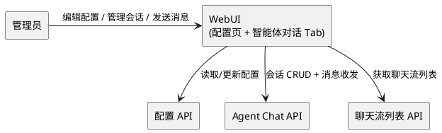
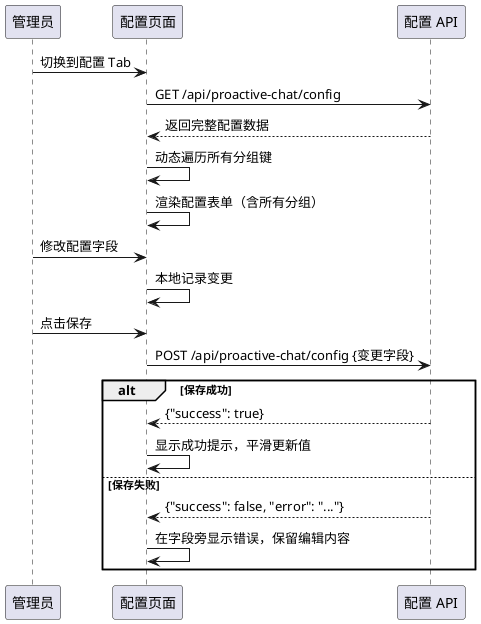
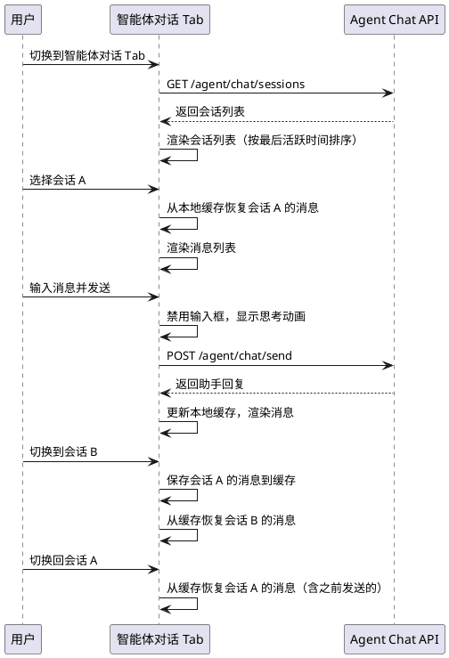

# 1. 组件定位

## 1.1 核心职责

本组件负责修复 proactive-chat 插件 v3.3 WebUI 的两大体验问题：（1）配置页面的布局、交互与功能缺陷；（2）智能体对话 Tab 的交互体验不完善问题。

## 1.2 核心输入

1. 用户在配置页面的字段编辑操作（修改布尔开关、数值、文本等）
2. 用户在智能体对话 Tab 的会话管理操作（新建、选择、清除会话）
3. 用户在智能体对话 Tab 的消息收发操作
4. Agent Chat 后端 API 的 4 个端点响应（已有，不变）
5. 配置 API 的读写响应（已有，不变）
6. 聊天流列表 API 的响应（已有，不变）

## 1.3 核心输出

1. 修复后的配置页面（分组清晰、交互合理、字段完整、校验有效）
2. 修复后的智能体对话 Tab（会话管理完善、消息交互流畅、状态反馈清晰）
3. 配置保存后的即时 UI 状态同步（无需手动刷新）

## 1.4 职责边界

- 不负责修改 Agent Chat 后端 API 的端点定义和逻辑
- 不负责修改 v3.3 新增的时间感知、聊天流上下文注入等后端功能
- 不负责修改数据面板 Tab 和决策记录 Tab 的功能
- 不负责新增配置项或修改配置数据模型
- 不修改主程序代码

# 2. 领域术语

**配置页面**
: WebUI 中用于查看和修改 proactive-chat 插件运行时配置的界面标签页。
: 备注：当前实现存在分组缺失、字段遗漏、交互缺陷等问题。

**配置分组**
: 将配置项按业务含义归类展示的组织方式，如"插件"、"触发"、"冷却"等。
: 备注：当前实现使用硬编码的分组列表，缺少 `agent_chat`、`agent_optimization`、`delayed_trigger` 等分组。

**智能体对话 Tab**
: WebUI 前端中用于与智能体进行对话交互的界面标签页，v3.3 新增。
: 备注：当前实现存在会话切换丢失消息、无历史消息加载、关联聊天流显示不友好等问题。

**会话消息持久化**
: 智能体对话会话中消息在前后端之间的同步机制。
: 备注：当前前端仅在内存中累积消息，切换会话后消息丢失，无法从后端恢复。

**聊天流显示名称**
: 在智能体对话 Tab 中展示关联聊天流时使用的友好名称（群名称或"xxx 的私聊"），而非 session_id。
: 备注：AGENTS.md 规定"涉及显示聊天流信息的，优先显示聊天流实际名称"。

# 3. 角色与边界

## 3.1 核心角色

- **MaiBot 管理员**：通过 WebUI 配置页管理插件参数，通过智能体对话 Tab 与智能体交互

## 3.2 外部系统

- **Agent Chat API**：提供会话创建、列表、消息发送、会话清除 4 个端点（已有，不变）
- **配置 API**：提供配置读取和更新端点（已有，不变）
- **聊天流列表 API**：提供聊天流查询端点（已有，不变）

## 3.3 交互上下文

# 4. DFX 约束

## 4.1 性能

1. 配置页面加载 SHALL 在 1 秒内完成
2. 智能体对话 Tab 的会话列表加载 SHALL 在 1 秒内完成
3. 会话切换时消息恢复 SHALL 在 500ms 内完成（本地缓存命中时）

## 4.2 可靠性

1. 配置保存失败时 SHALL 保留用户已编辑的内容，不丢失未保存的修改
2. 智能体对话 Tab 的前端 JavaScript 错误 SHALL 不影响其他 Tab（数据面板、配置）的正常使用
3. 会话切换时 SHALL 不丢失任何已发送消息的记录

## 4.3 安全性

1. 配置页面中的 `deepseek_api_key` 字段 SHALL 以密码类型显示，不暴露明文
2. 配置保存 SHALL 经过后端校验，拒绝非法值

## 4.4 可维护性

1. 配置页面的分组定义 SHALL 可扩展，新增配置分组无需修改渲染逻辑
2. 智能体对话 Tab 的前端代码 SHALL 使用独立的 HTML/CSS/JS 文件，不嵌入 Python 字符串

## 4.5 兼容性

1. v3.3.1 SHALL 向后兼容 v3.3 的所有 API 端点契约
2. v3.3.1 的配置页面 SHALL 能正确展示 v3.3 新增的所有配置分组
3. v3.3.1 的智能体对话 Tab SHALL 兼容已有的 4 个 Agent Chat API 端点

# 5. 核心能力

## 5.1 配置页面修复

### 5.1.1 业务规则

1. **配置分组完整性**：When 配置页面加载，the 前端 SHALL 展示后端返回的所有配置分组
   - 当前问题：`loadConfig()` 使用硬编码的 `sections` 对象定义分组，仅包含 12 个固定分组（plugin、trigger、cooldown、analysis、deepseek、scope、prompt、webui、smart_cleanup、status、react、context_compress），遗漏了 `agent_chat`、`agent_optimization`、`delayed_trigger` 等 v3.3 新增的配置分组
   - 验收条件：配置 API 返回包含 `agent_chat` 分组 → 配置页面显示"智能体对话"分组及其所有字段

2. **动态分组渲染**：When 配置 API 返回数据，the 前端 SHALL 动态遍历所有顶层键作为分组，而非依赖硬编码分组列表
   - 当前问题：硬编码分组列表导致新增配置分组时必须修改前端代码
   - 验收条件：后端新增任意配置分组 → 配置页面自动显示该分组，无需修改前端代码

3. **分组标题映射**：Where 配置分组键名需要中文标题映射，the 前端 SHALL 提供键名到中文标题的映射表，未映射的分组 SHALL 直接使用键名作为标题
   - 当前问题：硬编码映射导致新增分组无中文标题
   - 验收条件：已知分组键（如 `agent_chat`）→ 显示中文标题"智能体对话"；未知分组键 → 直接显示键名

4. **布尔字段交互**：When 用户切换布尔类型的配置开关，the 前端 SHALL 显示复选框，且勾选状态与实际值一致
   - 当前问题：布尔字段的 `checked` 属性判断逻辑 `typeof fv==='boolean'&&fv?'checked':''` 在 `fv` 为 `false` 时不添加 `checked` 属性，但 HTML 中 checkbox 的 `value` 属性被设为空字符串，导致保存时无法正确读取布尔值
   - 验收条件：布尔字段值为 `true` → 复选框勾选；布尔字段值为 `false` → 复选框未勾选；保存时正确传递布尔值

5. **数值字段交互**：When 用户编辑数值类型的配置字段，the 前端 SHALL 显示数字输入框，且输入值与实际数值一致
   - 当前问题：数值字段使用 `typeof fv==='number'?'number':'text'` 判断，但 `value` 属性赋值时 `val=typeof fv==='boolean'?'':fv`，对于数值 0 会正确显示，但 `parseFloat` 在保存时可能将空字符串转为 `NaN`
   - 验收条件：数值字段值为 0 → 显示 0；数值字段值为 300 → 显示 300；保存时正确传递数值

6. **密码字段保护**：Where 配置字段名为 `deepseek_api_key`，the 前端 SHALL 以密码类型显示该字段
   - 当前问题：仅对 `deepseek_api_key` 做了密码类型处理，但后端已对 API Key 做了脱敏（`key[:3] + "***" + key[-3:]`），前端密码类型显示的是脱敏后的值，用户无法感知当前值已被脱敏
   - 验收条件：`deepseek_api_key` 字段显示为密码输入框 → 输入框中的值为脱敏值 → 用户修改时输入新值，未修改时保存不覆盖原值

7. **配置保存校验反馈**：When 配置保存失败（后端校验不通过），the 前端 SHALL 在对应字段旁显示错误信息，并保留用户已编辑的内容
   - 当前问题：保存失败时仅显示 Toast 提示，未在具体字段旁标注错误，且 `loadConfig()` 会重新加载配置覆盖用户编辑
   - 验收条件：后端返回校验失败 → 前端在对应字段旁显示错误信息 → 用户已编辑的内容不丢失

8. **配置保存成功反馈**：When 配置保存成功，the 前端 SHALL 显示成功提示并刷新配置显示
   - 当前问题：保存成功后调用 `loadConfig()` 重新渲染整个配置页面，导致页面闪烁
   - 验收条件：保存成功 → 显示成功 Toast → 配置值平滑更新（不重建整个 DOM）

9. **配置页面滚动体验**：When 配置分组较多，the 前端 SHALL 提供分组导航或锚点跳转功能
   - 当前问题：v3.3 新增分组后配置页面变长，用户需要滚动查找特定分组
   - 验收条件：配置页面包含 15+ 分组 → 用户可通过导航快速定位到目标分组

10. **禁止项**：the 配置页面 SHALL 不修改后端配置数据模型和 API 契约
    - 验收条件：配置 API 的请求/响应格式与 v3.3 完全一致

### 5.1.2 交互流程

### 5.1.3 异常场景

1. **配置 API 不可用**
   - 触发条件：配置读取请求失败或超时
   - 系统行为：显示加载失败提示，提供重试按钮
   - 用户感知：看到"配置加载失败"提示，可点击重试

2. **配置保存时网络中断**
   - 触发条件：保存请求发送后网络断开
   - 系统行为：显示保存失败提示，保留用户编辑内容
   - 用户感知：看到"保存失败"提示，已编辑内容仍在输入框中

3. **未知配置分组**
   - 触发条件：后端返回前端未映射的配置分组键
   - 系统行为：使用键名作为分组标题，正常渲染字段
   - 用户感知：看到以键名命名的分组，字段可正常编辑

## 5.2 智能体对话 Tab 修复

### 5.2.1 业务规则

1. **会话切换消息保持**：When 用户在多个会话之间切换，the 前端 SHALL 保留每个会话的消息记录，切换回来时恢复之前的消息
   - 当前问题：`selectChatSession()` 中 `currentChatMessages=[]`，每次切换会话都清空消息，之前发送的消息丢失
   - 验收条件：会话 A 有 3 条消息 → 切换到会话 B → 切换回会话 A → 显示 3 条消息

2. **会话消息本地缓存**：the 前端 SHALL 为每个会话维护独立的消息缓存
   - 当前问题：所有会话共用一个 `currentChatMessages` 数组，切换会话时被清空
   - 验收条件：会话 A 的消息与会话 B 的消息互不干扰

3. **聊天流显示名称**：When 会话关联了聊天流，the 前端 SHALL 显示该聊天流的实际名称（群名称或"xxx 的私聊"），而非截断的 session_id
   - 当前问题：`renderSessionList()` 中显示 `s.stream_context_id.substring(0,8)+'...'`，显示的是截断的 ID 而非友好名称；`selectChatSession()` 中会话信息栏同样显示截断 ID
   - 验收条件：会话关联聊天流"测试群" → 会话列表和会话信息栏显示"关联: 测试群"

4. **聊天流选择器显示名称**：When 用户在新建会话对话框中选择聊天流，the 下拉列表 SHALL 显示聊天流的实际名称
   - 当前问题：`loadStreamListForNewSession()` 中已正确使用 `s.display_name`，但缺少聊天流类型的视觉区分
   - 验收条件：群聊聊天流显示"[群聊] 群名称"，私聊聊天流显示"[私聊] 昵称的私聊"

5. **会话信息栏完整性**：When 用户选中一个会话，the 会话信息栏 SHALL 显示完整的会话上下文信息
   - 当前问题：会话信息栏仅显示截断的 session_id 和截断的 stream_context_id，缺少消息数量、创建时间等关键信息
   - 验收条件：选中会话 → 信息栏显示会话 ID、关联聊天流名称、消息数量

6. **思考状态视觉反馈**：When 智能体正在生成回复，the 前端 SHALL 显示明确的加载动画指示器
   - 当前问题：仅使用文本"思考中..."作为指示，无动画效果，视觉反馈不够明显
   - 验收条件：消息发送后 → 对话区域显示带动画的思考指示器 → 收到响应后替换为实际内容

7. **消息发送失败恢复**：If 智能体对话 API 返回错误，the 前端 SHALL 在对话区域显示错误消息，并允许用户重新发送
   - 当前问题：错误消息以 system-bubble 形式显示，但用户无法对失败的消息进行重试
   - 验收条件：发送失败 → 显示错误提示 → 用户可修改消息重新发送

8. **空会话提示**：When 用户选中一个新建的空会话，the 前端 SHALL 显示友好的空状态提示
   - 当前问题：新建会话后消息区域为空白，无引导提示
   - 验收条件：选中空会话 → 消息区域显示"开始与智能体对话"提示

9. **会话列表排序**：the 前端 SHALL 按最后活跃时间倒序排列会话列表
   - 当前问题：会话列表按后端返回顺序显示，最近活跃的会话可能不在顶部
   - 验收条件：会话 B 最后活跃时间晚于会话 A → 会话 B 排在会话 A 前面

10. **会话列表刷新**：When 智能体对话 Tab 处于活跃状态，the 前端 SHALL 定期刷新会话列表以反映最新状态
    - 当前问题：仅在初始加载和创建/清除会话时刷新列表，不自动更新
    - 验收条件：Tab 活跃期间 → 会话列表每 30 秒自动刷新 → 其他客户端创建的会话也能显示

11. **新建会话对话框交互**：When 用户点击新建会话对话框外部区域，the 前端 SHALL 关闭对话框
    - 当前问题：`new-session-dialog` 的 `dialog-overlay` 未绑定点击关闭事件
    - 验收条件：点击对话框外部灰色遮罩 → 对话框关闭

12. **禁止项**：the 智能体对话 Tab SHALL 不修改 Agent Chat 后端 API 的端点定义和逻辑
    - 验收条件：4 个 API 端点的请求/响应格式与 v3.3 完全一致

### 5.2.2 交互流程

### 5.2.3 异常场景

1. **会话列表加载失败**
   - 触发条件：GET /agent/chat/sessions 返回错误
   - 系统行为：显示加载失败提示，提供重试按钮
   - 用户感知：看到"会话列表加载失败"提示

2. **消息发送超时**
   - 触发条件：POST /agent/chat/send 响应时间超过 30 秒
   - 系统行为：移除思考指示器，显示超时错误消息
   - 用户感知：看到"响应超时，请稍后重试"提示

3. **会话已被其他客户端清除**
   - 触发条件：用户向已被清除的会话发送消息
   - 系统行为：后端自动创建新会话，前端更新当前会话 ID
   - 用户感知：消息发送成功，但会话 ID 发生变化

4. **聊天流列表获取失败**
   - 触发条件：新建会话时聊天流列表 API 返回错误
   - 系统行为：聊天流选择器显示为空，用户仍可创建不关联聊天流的会话
   - 用户感知：无法选择聊天流，但可正常创建会话

5. **agent_chat_enabled 运行时切换**
   - 触发条件：用户在配置中关闭 agent_chat_enabled 后返回智能体对话 Tab
   - 系统行为：Tab 重新加载时检查开关状态，显示未启用提示
   - 用户感知：看到"智能体对话功能未启用"提示

# 6. 数据约束

## 6.1 配置分组映射

1. **分组键名**：字符串，对应配置 API 返回的顶层键名
2. **中文标题**：字符串，用于配置页面分组标题显示
3. **映射关系**：
   - `plugin` → "插件"
   - `trigger` → "触发"
   - `cooldown` → "冷却"
   - `analysis` → "分析"
   - `deepseek` → "DeepSeek"
   - `scope` → "白名单"
   - `prompt` → "提示词"
   - `webui` → "WebUI"
   - `smart_cleanup` → "智能清理"
   - `status` → "状态"
   - `react` → "ReAct 循环"
   - `context_compress` → "上下文压缩"
   - `agent_chat` → "智能体对话"
   - `agent_optimization` → "智能体优化"
   - `delayed_trigger` → "延迟触发"
   - 其他未映射键 → 直接使用键名

## 6.2 会话消息缓存

1. **缓存键**：会话 ID（session_id），字符串
2. **缓存值**：消息数组，每条消息包含 role（user/assistant/system）、content（字符串）、timestamp（毫秒时间戳）
3. **缓存生命周期**：会话存在期间有效，会话清除后释放
4. **缓存容量**：每个会话最多保留 100 条消息

## 6.3 聊天流显示名称

1. **display_name**：聊天流的友好显示名称，字符串
   - 群聊：使用群名称
   - 私聊：使用"昵称的私聊"格式
2. **来源**：从 GET /api/proactive-chat/streams 返回的 `display_name` 字段获取