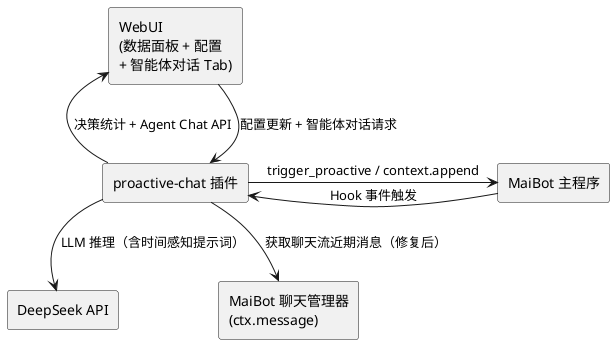
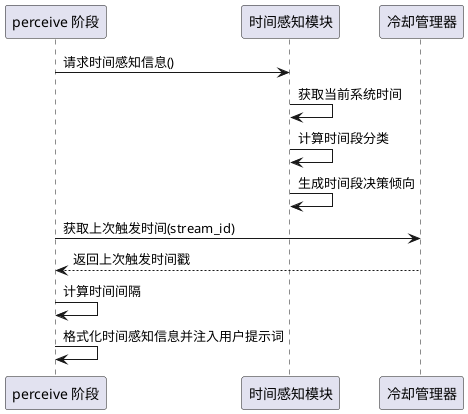
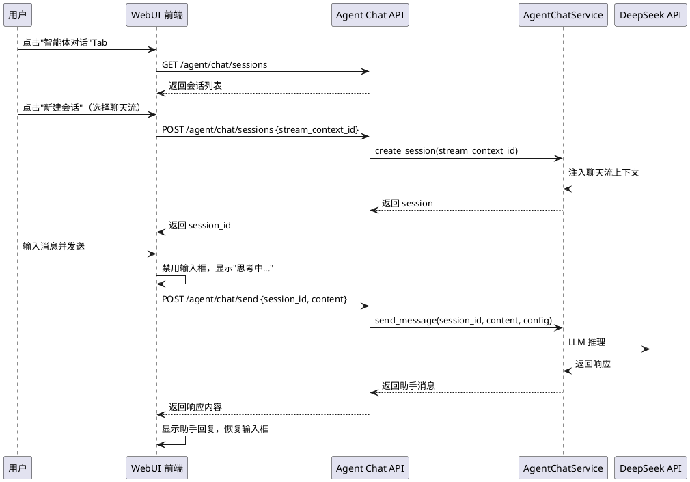
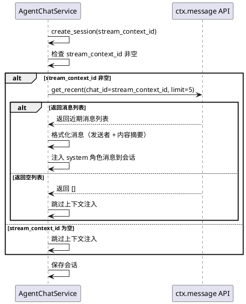

# 1. 组件定位

## 1.1 核心职责

本组件负责对 proactive-chat 插件进行三个方向的增强与修复：（1）加强插件 LLM 的时间观念，使智能体在主动对话决策时能准确感知当前时间、时间段适宜性和时间间隔；（2）在 WebUI 前端实现智能体对话 Tab，对接已有的后端 Agent Chat API，提供完整的智能体对话界面；（3）修复 `agent_chat.py` 的 `_inject_stream_context` 空实现问题，使智能体对话能正确获取聊天流上下文。

## 1.2 核心输入

1. MaiBot planner 响应完成事件（`maisaka.planner.after_response` Hook，不变）
2. 系统当前时间（新增，用于时间感知注入）
3. 智能体记忆模块提供的历史决策记忆（含时间戳，不变）
4. 聊天流近期消息列表（用于聊天流上下文注入，修复后生效）
5. WebUI 前端用户的智能体对话请求（创建会话、发送消息、清除会话）
6. Agent Chat 后端 API 的 4 个端点（已有，不变）
7. 插件配置中的 `agent_chat_enabled` 开关（已有，v3.3 需实际检查）

## 1.3 核心输出

1. 包含时间感知信息的智能体系统提示词（当前时间、时间段、时间间隔）
2. WebUI 智能体对话 Tab（会话管理、消息收发、聊天流上下文显示）
3. 正确注入聊天流上下文的智能体对话会话（修复 `_inject_stream_context`）
4. 时间感知增强后的主动对话决策结果（更合理的时机评估和触发倾向）

## 1.4 职责边界

- 不负责修改 MaiBot 主程序的 LLM 调用逻辑
- 不负责实现独立的时钟服务或定时任务调度（仅使用系统时间）
- 不负责实现独立的聊天流管理服务（通过 `ctx.message` API 获取数据）
- 不负责修改 Agent Chat 后端 API 的端点定义（4 个端点已就绪）
- 不负责实现聊天流消息的持久化存储（仅读取已有数据）
- 不修改主程序代码
- 不负责 v3.2 已有功能的变更（步骤分类器、循环检测、感知增强等不变）

# 2. 领域术语

**时间感知注入**
: 在智能体系统提示词中注入当前时间、时间段描述和时间间隔信息，使 LLM 能在决策时考虑时间因素的机制。
: 备注：v3.2 的提示词中不包含任何时间信息，LLM 无法判断"现在是深夜"或"距离上次发言已过 2 小时"。

**时间段分类**
: 将一天 24 小时划分为若干具有社交含义的时间段，用于指导 LLM 判断主动发言的适宜性。
: 备注：例如深夜（0:00-6:00）不适宜主动发言，工作时间（9:00-12:00, 14:00-18:00）适度发言，休闲时间（12:00-14:00, 18:00-22:00）积极发言。

**时间间隔感知**
: 智能体对"距离上次触发/上次发言过了多久"的感知能力，用于辅助时机评估。
: 备注：间隔过短（< 冷却期）应避免触发，间隔适中（冷却期后）可正常触发，间隔过长（冷场信号）应积极触发。

**Agent Chat Tab**
: WebUI 前端中用于与智能体进行对话交互的界面标签页。
: 备注：后端 API 已就绪（4 个端点），但前端从未实现该 Tab。

**聊天流上下文注入**
: 在创建智能体对话会话时，将关联聊天流的近期消息作为系统消息注入到会话中，使智能体了解当前对话背景。
: 备注：v3.3 修复 `_inject_stream_context` 的空实现，通过 `ctx.message.get_recent()` 获取真实消息。

**agent_chat_enabled 开关检查**
: 在 Agent Chat 相关 API 处理中检查 `config.agent_chat.agent_chat_enabled` 配置项，未启用时拒绝请求。
: 备注：v3.2 代码中未检查此开关，即使配置为 false，API 仍可正常调用。

# 3. 角色与边界

## 3.1 核心角色

- **MaiBot 管理员**：通过 WebUI 智能体对话 Tab 与智能体交互、查看聊天流上下文、配置时间感知参数
- **MaiBot 主程序**：通过 Hook 事件触发插件决策循环（不变）

## 3.2 外部系统

- **DeepSeek API**：提供 LLM 推理服务（不变）
- **MaiBot SDK**：提供 ctx.message / ctx.chat / ctx.maisaka / ctx.config 等 API（不变）
- **A_Memorix**：提供记忆检索服务（不变）
- **MaiBot 聊天管理器**：提供聊天流消息查询接口（`ctx.message.get_recent`），用于聊天流上下文注入

## 3.3 交互上下文

# 4. DFX 约束

## 4.1 性能

1. 时间感知注入的格式化处理 SHALL 在 10ms 内完成（纯本地操作，无 LLM 调用）
2. 聊天流上下文注入的消息获取 SHALL 在 2 秒内完成（通过 ctx.message API）
3. Agent Chat Tab 的前端首屏加载 SHALL 在 1 秒内完成（静态资源 + API 调用）
4. 智能体对话消息发送到响应的端到端延迟 SHALL 不超过 15 秒（含 LLM 调用）
5. 时间感知注入 SHALL 不增加 ReAct 循环的 LLM 调用次数

## 4.2 可靠性

1. 时间感知注入失败（如时区信息不可用）SHALL 不影响决策循环的正常执行（降级为无时间信息）
2. 聊天流上下文注入失败 SHALL 不影响智能体对话会话的创建（降级为无上下文）
3. Agent Chat Tab 的前端 JavaScript 错误 SHALL 不影响其他 Tab（数据面板、配置）的正常使用
4. `agent_chat_enabled` 为 false 时，Agent Chat API SHALL 返回明确的错误信息而非静默失败
5. 聊天流消息获取返回空列表时，智能体对话 SHALL 正常工作（无上下文注入）

## 4.3 安全性

1. 时间感知注入 SHALL 不在提示词中暴露服务器的完整系统信息（仅包含时间和时间段描述）
2. Agent Chat Tab SHALL 仅在 `agent_chat_enabled` 为 true 时可用
3. 聊天流上下文注入 SHALL 仅包含消息的发送者名称和内容摘要，不包含敏感的用户 ID 或完整消息元数据
4. 智能体对话会话 SHALL 不持久化到磁盘（会话数据仅在内存中，重启后丢失）

## 4.4 可维护性

1. 时间段分类规则 SHALL 通过配置项调整，无需修改代码
2. 时间感知提示词模板 SHALL 通过 prompts.py 中的常量管理
3. Agent Chat Tab 的前端代码 SHALL 使用独立的 HTML/CSS/JS 文件，不嵌入 Python 字符串
4. 聊天流上下文注入的消息格式 SHALL 通过 prompts.py 中的常量管理

## 4.5 兼容性

1. v3.3 SHALL 向后兼容 v3.2 的所有配置格式（新增配置项有默认值）
2. v3.3 SHALL 向后兼容 v3.2 的 DecisionRecord 格式（不新增持久化字段）
3. 不启用任何 v3.3 新功能时，v3.3 的行为 SHALL 与 v3.2 完全一致
4. v3.3 的 WebUI SHALL 同时展示 v3.2 的数据面板、配置 Tab 和 v3.3 的智能体对话 Tab
5. v3.3 的时间感知注入 SHALL 在 `time_awareness_enabled` 为 False 时与 v3.2 行为一致
6. v3.3 的聊天流上下文注入修复 SHALL 不影响已有的 Agent Chat API 端点契约

# 5. 核心能力

## 5.1 时间感知注入

### 5.1.1 业务规则

1. **当前时间注入**：When 智能体决策循环启动（perceive 阶段），the 时间感知模块 SHALL 将当前系统时间注入到用户提示词中
   - 注入格式：`[时间感知] 当前时间：2026-06-28 14:30:00（周日），时间段：下午工作时间`
   - 验收条件：决策循环启动 → 用户提示词中包含 `[时间感知]` 段落 → 段落包含当前日期、时间、星期和时间段描述

2. **时间段分类**：the 时间感知模块 SHALL 将当前时间映射到以下时间段分类：
   - **深夜**（0:00-6:00）：不适宜主动发言，应极度保守
   - **清晨**（6:00-9:00）：不太适宜主动发言，应保守
   - **上午工作时间**（9:00-12:00）：适度发言，注意不打断工作
   - **午休时间**（12:00-14:00）：休闲时段，可积极发言
   - **下午工作时间**（14:00-18:00）：适度发言，注意不打断工作
   - **傍晚休闲**（18:00-22:00）：休闲时段，可积极发言
   - **夜间**（22:00-24:00）：逐渐减少发言，避免打扰
   - 验收条件：当前时间 14:30 → 时间段分类为"下午工作时间"；当前时间 23:00 → 时间段分类为"夜间"

3. **时间段决策倾向注入**：When 时间段分类完成，the 时间感知模块 SHALL 在提示词中注入该时间段的决策倾向指导
   - 深夜：`当前是深夜时段，大多数人已休息，除非有紧急的漏回补答场景，否则不应主动发言`
   - 清晨：`当前是清晨时段，人们可能刚开始一天，应避免主动发言打扰`
   - 工作时间：`当前是工作时间，人们可能正在忙碌，发言应谨慎，优先处理漏回补答`
   - 午休/傍晚休闲：`当前是休闲时段，人们可能更愿意聊天，可以更积极地参与对话`
   - 夜间：`当前是夜间时段，人们可能准备休息，应逐渐减少发言`
   - 验收条件：深夜时段 → 提示词包含"大多数人已休息，除非有紧急的漏回补答场景，否则不应主动发言"

4. **时间间隔感知**：When 智能体决策循环启动，the 时间感知模块 SHALL 计算并注入以下时间间隔信息：
   - 距离上次主动触发的时间间隔（从冷却管理器获取）
   - 距离聊天流中最后一条消息的时间间隔（从近期消息时间戳计算）
   - 注入格式：`距上次主动发言：2小时15分钟；距最后一条消息：5分钟`
   - 验收条件：冷却记录显示 2 小时前触发过 → 提示词中包含"距上次主动发言：2小时X分钟"

5. **星期感知**：When 时间感知注入执行，the 时间感知模块 SHALL 在时间描述中包含星期信息
   - 工作日（周一至周五）和周末（周六、周日）的决策倾向不同
   - 周末休闲时段可更积极发言
   - 验收条件：周六 14:00 → 时间描述包含"周六" → 决策倾向为"周末休闲时段，可积极发言"

6. **时间感知启用控制**：Where 配置项 `agent_optimization.time_awareness_enabled` 为 True，the 时间感知模块 SHALL 在 perceive 阶段注入时间感知信息
   - 验收条件：time_awareness_enabled=True → 用户提示词包含时间感知段落；time_awareness_enabled=False → 用户提示词无时间感知段落

7. **禁止项**：the 时间感知模块 SHALL 不修改 LLM 的输出格式要求
   - 验收条件：时间感知注入后，LLM 仍以 JSON 格式输出决策结果，字段与 v3.2 一致

### 5.1.2 交互流程

### 5.1.3 异常场景

1. **系统时间不可用**
   - 触发条件：系统时钟异常或时区信息缺失
   - 系统行为：跳过时间感知注入，不注入时间段落，记录警告日志
   - 用户感知：决策循环正常执行（无时间辅助）

2. **冷却管理器无记录**
   - 触发条件：首次触发或冷却记录已过期
   - 系统行为：时间间隔显示为"无记录"或"首次"
   - 用户感知：提示词中时间间隔信息为"距上次主动发言：无记录"

3. **近期消息无时间戳**
   - 触发条件：聊天流消息中缺少时间戳字段
   - 系统行为：跳过"距最后一条消息"的时间间隔计算
   - 用户感知：提示词中仅包含当前时间和时间段信息，不包含消息时间间隔

## 5.2 WebUI 智能体对话 Tab

### 5.2.1 业务规则

1. **Tab 显示**：When WebUI 加载完成，the 前端 SHALL 在 Tab 栏中显示"智能体对话"Tab
   - Tab 栏顺序：数据面板 → 配置 → 智能体对话
   - 验收条件：WebUI 加载 → Tab 栏显示三个 Tab → 第三个为"智能体对话"

2. **agent_chat_enabled 开关检查**：When 用户点击"智能体对话"Tab，the 前端 SHALL 检查 `agent_chat_enabled` 配置项状态
   - 若 `agent_chat_enabled` 为 false：显示"智能体对话功能未启用，请在配置中开启"提示
   - 若 `agent_chat_enabled` 为 true：显示智能体对话界面
   - 验收条件：agent_chat_enabled=false → 点击 Tab 显示未启用提示；agent_chat_enabled=true → 显示对话界面

3. **会话创建**：When 用户在智能体对话 Tab 中点击"新建会话"，the 前端 SHALL 调用 POST `/api/proactive-chat/agent/chat/sessions` 创建新会话
   - 可选关联聊天流：用户可选择一个聊天流作为上下文
   - 验收条件：点击"新建会话" → API 返回 session_id → 会话列表更新

4. **会话列表展示**：When 智能体对话 Tab 加载，the 前端 SHALL 调用 GET `/api/proactive-chat/agent/chat/sessions` 获取会话列表并展示
   - 每个会话显示：会话 ID（截断显示）、创建时间、最后活跃时间、消息数、关联聊天流名称
   - 验收条件：有 2 个活跃会话 → 会话列表显示 2 条记录 → 每条包含上述字段

5. **消息发送**：When 用户在智能体对话 Tab 中输入消息并发送，the 前端 SHALL 调用 POST `/api/proactive-chat/agent/chat/send` 发送消息
   - 发送期间禁用输入框，显示"思考中..."状态
   - 验收条件：输入消息 → 点击发送 → 输入框禁用 → API 返回响应 → 显示助手回复 → 输入框恢复

6. **消息展示**：the 前端 SHALL 以聊天气泡形式展示用户消息和助手回复
   - 用户消息靠右，助手回复靠左
   - 每条消息显示发送时间
   - 验收条件：发送消息后 → 对话区域显示用户消息气泡（右侧）和助手回复气泡（左侧）

7. **会话清除**：When 用户在会话上点击"清除"，the 前端 SHALL 调用 POST `/api/proactive-chat/agent/chat/sessions/{id}/clear` 清除会话
   - 验收条件：点击"清除" → API 返回 success → 会话从列表中移除

8. **聊天流上下文选择**：When 用户创建新会话时，the 前端 SHALL 提供聊天流选择器，允许用户选择关联的聊天流
   - 聊天流列表从 GET `/api/proactive-chat/streams` 获取
   - 优先显示聊天流实际名称（群名称或"xxx 的私聊"），而非 session_id
   - 验收条件：创建会话时 → 聊天流选择器显示可用聊天流 → 选择后传递 stream_context_id

9. **聊天流上下文显示**：When 会话关联了聊天流，the 前端 SHALL 在会话信息中显示关联的聊天流名称
   - 验收条件：会话关联聊天流"测试群" → 会话信息显示"关联聊天流：测试群"

10. **响应中显示思考状态**：When 智能体正在生成回复，the 前端 SHALL 显示加载指示器
    - 验收条件：消息发送后 → 对话区域显示"思考中..."动画 → 收到响应后替换为实际内容

11. **错误处理**：If 智能体对话 API 返回错误，the 前端 SHALL 显示错误提示信息
    - 验收条件：API 返回 `{"success": false, "error": "智能体对话服务未启用"}` → 前端显示该错误信息

12. **禁止项**：the 前端 SHALL 不在智能体对话 Tab 中嵌入 Python 代码或后端逻辑
    - 验收条件：前端代码仅包含 HTML/CSS/JS 文件

### 5.2.2 交互流程

### 5.2.3 异常场景

1. **agent_chat_enabled 为 false**
   - 触发条件：用户尝试使用智能体对话功能，但配置未启用
   - 系统行为：后端 API 返回 `{"success": false, "error": "智能体对话服务未启用"}`，前端显示提示
   - 用户感知：看到"智能体对话功能未启用，请在配置中开启"提示

2. **会话数已达上限**
   - 触发条件：已有 5 个活跃会话，尝试创建第 6 个
   - 系统行为：AgentChatService 自动淘汰最旧的会话，创建新会话成功
   - 用户感知：新会话创建成功，最旧的会话被自动移除

3. **LLM 调用超时**
   - 触发条件：DeepSeek API 响应超时
   - 系统行为：send_message 抛出异常，后端返回错误信息
   - 用户感知：前端显示"智能体回复失败，请稍后重试"

4. **会话不存在**
   - 触发条件：用户向已清除或不存在的会话发送消息
   - 系统行为：AgentChatService 自动创建新会话
   - 用户感知：消息发送成功，但在新会话中

5. **聊天流列表获取失败**
   - 触发条件：GET /api/proactive-chat/streams 返回错误
   - 系统行为：聊天流选择器显示为空，用户仍可创建不关联聊天流的会话
   - 用户感知：无法选择聊天流，但可正常对话

## 5.3 聊天流上下文注入修复

### 5.3.1 业务规则

1. **上下文消息获取**：When 创建智能体对话会话且指定了 stream_context_id，the AgentChatService SHALL 通过 `ctx.message.get_recent()` 获取该聊天流的近期消息
   - 获取条数：最多 5 条近期消息
   - 验收条件：创建会话时指定 stream_context_id → `_inject_stream_context` 调用 `ctx.message.get_recent(chat_id=stream_context_id, limit=5)` → 返回消息列表

2. **上下文消息格式化**：When 获取到聊天流近期消息，the AgentChatService SHALL 将消息格式化为可注入的系统消息
   - 格式：`[聊天流上下文] 以下是该聊天流的近期对话：\n[发送者名称] 消息内容摘要`
   - 每条消息内容截断至 100 字符
   - 验收条件：3 条近期消息 → 系统消息包含 3 行格式化的消息摘要

3. **上下文注入位置**：When 格式化聊天流上下文消息，the AgentChatService SHALL 将其作为 role="system" 的消息插入到会话消息列表的开头
   - 验收条件：会话消息列表第一条为 system 角色的聊天流上下文消息

4. **空消息列表处理**：If 聊天流近期消息为空列表，the AgentChatService SHALL 不注入聊天流上下文消息
   - 验收条件：get_recent 返回空列表 → 会话消息列表中无 system 角色的上下文消息

5. **消息获取异常处理**：If 获取聊天流消息时发生异常，the AgentChatService SHALL 记录调试日志并跳过上下文注入，不阻塞会话创建
   - 验收条件：get_recent 抛出异常 → 日志中出现"聊天流上下文注入失败" → 会话正常创建（无上下文）

6. **agent_chat_enabled 开关检查**：When Agent Chat API 收到请求，the 后端 SHALL 检查 `config.agent_chat.agent_chat_enabled` 配置项
   - 若为 false：返回 `{"success": false, "error": "智能体对话服务未启用"}`
   - 若为 true：正常处理请求
   - 验收条件：agent_chat_enabled=false → 所有 Agent Chat API 返回错误；agent_chat_enabled=true → 正常处理

7. **禁止项**：the 聊天流上下文注入 SHALL 不自行调用 `SessionUtils.calculate_session_id` 计算资源归属 ID
   - 验收条件：上下文注入仅使用用户传入的 stream_context_id，不自行计算 session_id

### 5.3.2 交互流程

### 5.3.3 异常场景

1. **ctx.message API 不可用**
   - 触发条件：AgentChatService 无法访问 ctx.message（未注入或初始化失败）
   - 系统行为：跳过上下文注入，记录调试日志，会话正常创建
   - 用户感知：智能体对话无聊天流上下文，但可正常对话

2. **stream_context_id 对应的聊天流不存在**
   - 触发条件：用户传入的 stream_context_id 在聊天管理器中无对应记录
   - 系统行为：get_recent 返回空列表，跳过上下文注入
   - 用户感知：智能体对话无聊天流上下文

3. **消息格式化异常**
   - 触发条件：近期消息中缺少 sender_name 或 content 字段
   - 系统行为：使用默认值（"未知"和空字符串），不跳过整条消息
   - 用户感知：上下文中可能显示"未知"发送者

4. **agent_chat_enabled 运行时切换**
   - 触发条件：用户在配置中关闭 agent_chat_enabled 后，仍有进行中的对话请求
   - 系统行为：下次 API 调用时检查配置，拒绝新请求，已有会话不受影响
   - 用户感知：新请求被拒绝，已有会话可继续使用

# 6. 数据约束

## 6.1 时间感知配置

1. **time_awareness_enabled**：是否启用时间感知注入，默认 True
2. **quiet_hours_start**：安静时段开始时间（小时，0-23），默认 22
3. **quiet_hours_end**：安静时段结束时间（小时，0-23），默认 6
4. **work_hours_start**：工作时间开始时间（小时，0-23），默认 9
5. **work_hours_end**：工作时间结束时间（小时，0-23），默认 18

## 6.2 智能体对话会话

1. **session_id**：会话唯一标识，16 位十六进制字符串，必填
2. **stream_context_id**：关联的聊天流 ID，可选，默认空
3. **messages**：会话消息列表，每条消息包含 role（user/assistant/system）、content、timestamp
4. **created_at**：会话创建时间，Unix 时间戳，必填
5. **last_active_at**：最后活跃时间，Unix 时间戳，必填
6. **token_estimate**：会话 token 估算值，整数，默认 0
7. **is_responding**：是否正在响应中，布尔值，默认 False

## 6.3 聊天流上下文消息

1. **role**：消息角色，固定为 "system"
2. **content**：格式化后的聊天流上下文文本，最大 1000 字符
3. **timestamp**：注入时间，Unix 时间戳（毫秒）