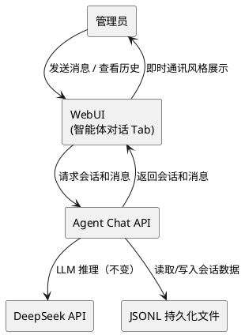
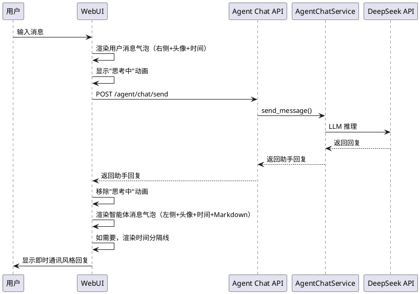
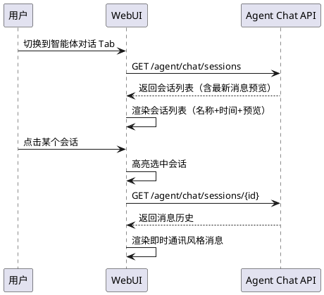
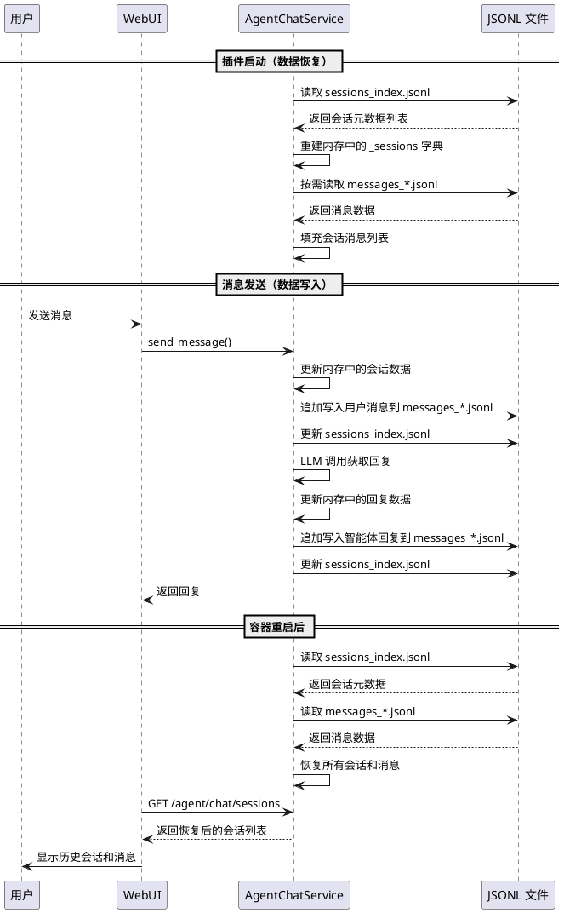
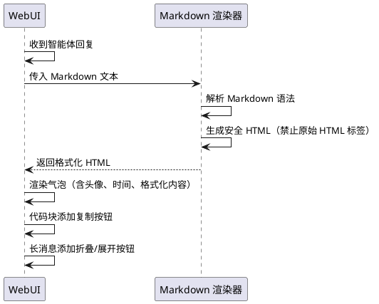

# 1. 组件定位

## 1.1 核心职责

本组件负责对 proactive-chat 插件的智能体对话功能进行两个方向的改进：（1）将聊天界面改造为即时通讯风格（类微信/QQ），包括消息气泡、头像、时间分组、消息类型区分等视觉与交互优化；（2）将会话数据从内存存储改为 JSONL 文件持久化，确保容器重启后会话和消息不丢失。

## 1.2 核心输入

1. 用户在智能体对话 Tab 中发送的指令消息（已有，不变）
2. Agent Chat API 的 4 个端点响应（已有，需扩展 sessions 端点支持持久化数据加载）
3. JSONL 持久化文件中的历史会话和消息数据（新增）
4. 前端渲染所需的用户/智能体头像标识（新增，基于角色类型生成）
5. 配置 API 的读写响应（已有，需新增持久化相关配置项）

## 1.3 核心输出

1. 即时通讯风格的聊天界面（气泡样式、头像、时间分组、消息类型区分）
2. 持久化到 JSONL 文件的会话和消息数据（容器重启后可恢复）
3. 改进后的会话列表展示（含最新消息预览、未读标记等）
4. 改进后的消息渲染（Markdown 渲染、代码块高亮、链接可点击）

## 1.4 职责边界

- 不负责修改 MaiBot 主程序的任何代码
- 不负责实现完整的即时通讯系统（无在线状态、无消息推送、无已读回执）
- 不负责实现文件/图片/语音等富媒体消息的发送和展示
- 不负责修改 v3.4 已有的指令执行模式、偏好识别、文件编辑等功能逻辑
- 不负责实现会话加密或端到端加密
- 不负责实现消息搜索功能
- 不负责修改 Agent Chat API 的端点定义（仅扩展 sessions 端点的数据加载能力）

# 2. 领域术语

**即时通讯风格界面**
: 聊天界面的视觉和交互设计参照微信/QQ 等即时通讯应用，包括左右分栏的气泡布局、发送者头像、时间分组、消息类型区分等特征。
: 备注：与当前的"技术面板风格"界面相对，当前界面消息以纯文本列表形式展示，缺乏即时通讯应用的视觉特征。

**消息气泡**
: 聊天消息的视觉容器，用户消息和智能体消息分别以不同颜色和位置显示（用户靠右、智能体靠左），模拟即时通讯应用的气泡样式。
: 备注：当前实现虽有 `.user-bubble` 和 `.assistant-bubble` 类，但缺少头像、时间分组等即时通讯特征元素。

**头像标识**
: 在消息气泡旁显示的发送者视觉标识，用于区分消息来源。用户使用首字母或默认图标，智能体使用机器人图标。
: 备注：不使用真实头像图片，使用 CSS 生成的首字母/图标头像，无需外部图片资源。

**时间分组**
: 当两条消息之间的时间间隔超过一定阈值时，在消息之间显示时间分隔线，标注具体时间，便于用户理解对话时序。
: 备注：参照微信的时间分组策略——5 分钟内的连续消息不重复显示时间。

**会话持久化**
: 将内存中的会话数据（会话列表、消息历史）写入 JSONL 文件，容器重启后从文件恢复，确保数据不丢失。
: 备注：与当前的 `self._sessions: dict` 内存存储相对，当前实现容器重启后所有会话和消息丢失。

**JSONL 会话存储**
: 使用 JSONL（JSON Lines）格式存储会话和消息数据的持久化方案，每行一条记录，支持追加写入和按行读取。
: 备注：与插件已有的 `persistence.py` 模块使用相同的 JSONL 存储模式，保持技术栈一致性。

**消息类型**
: 消息的内容类型标识，用于前端根据不同类型采用不同的渲染方式。包括纯文本、Markdown、系统通知等类型。
: 备注：当前所有消息均以纯文本渲染，Markdown 格式的智能体回复（如代码块、列表）无法正确展示。

**最新消息预览**
: 在会话列表中显示每个会话最近一条消息的摘要文本，帮助用户快速识别会话内容。
: 备注：参照微信/QQ 的会话列表设计，每个会话项显示最近一条消息的前若干字符。

# 3. 角色与边界

## 3.1 核心角色

- **MaiBot 管理员**：通过智能体对话 Tab 与智能体交互，查看历史会话和消息，期望获得类似微信/QQ 的聊天体验

## 3.2 外部系统

- **Agent Chat API**：提供会话创建、列表、消息发送、会话清除 4 个端点（已有，sessions 端点需支持从持久化文件加载数据）
- **DeepSeek API**：提供 LLM 推理服务（已有，不变）
- **JSONL 持久化文件**：存储会话和消息数据的文件系统（新增交互）

## 3.3 交互上下文



# 4. DFX 约束

## 4.1 性能

1. 消息渲染 SHALL 在 100ms 内完成（单条消息含气泡、头像、时间）
2. 会话列表加载 SHALL 在 500ms 内完成（含从 JSONL 文件读取）
3. 消息发送到响应的端到端延迟 SHALL 不超过 20 秒（含 LLM 调用，与 v3.4 一致）
4. JSONL 文件写入 SHALL 在 50ms 内完成（单条消息追加）
5. 前端滚动 100+ 条消息时 SHALL 无明显卡顿

## 4.2 可靠性

1. JSONL 文件写入失败时 SHALL 不丢失已有数据（追加写入模式，不覆盖已有内容）
2. JSONL 文件格式损坏时 SHALL 跳过损坏行，加载可解析的行，记录警告日志
3. 容器重启后 SHALL 能恢复重启前的所有会话和消息
4. 前端 JavaScript 错误 SHALL 不影响其他 Tab 的正常使用
5. 并发写入同一 JSONL 文件时 SHALL 不产生数据损坏（同一时刻仅一个写入者）

## 4.3 安全性

1. JSONL 持久化文件 SHALL 仅存储在插件数据目录下，不可被外部路径访问
2. 持久化文件 SHALL 不包含 API Key 等敏感信息
3. 会话数据 SHALL 不被未授权的 API 端点访问

## 4.4 可维护性

1. 会话持久化模块 SHALL 参考已有的 `persistence.py` 模块的 JSONL 存储模式
2. 前端代码 SHALL 使用独立的 HTML/CSS/JS 文件，不嵌入 Python 字符串
3. 持久化文件路径 SHALL 通过配置项声明，无需修改代码
4. 会话数据过期清理策略 SHALL 通过配置项控制

## 4.5 兼容性

1. v3.4.1 SHALL 向后兼容 v3.4 的所有 API 端点契约
2. v3.4.1 的会话持久化功能 SHALL 在 `agent_chat.session_persistence_enabled` 为 False 时与 v3.4 行为一致（纯内存存储）
3. v3.4.1 的聊天界面改进 SHALL 不影响 v3.4 的指令执行模式、偏好识别等功能
4. 不启用任何 v3.4.1 新功能时，v3.4.1 的行为 SHALL 与 v3.4 完全一致
5. 已有的 JSONL 持久化文件（如 `decisions_*.jsonl`、`edit_audit.jsonl`）SHALL 不受影响

# 5. 核心能力

## 5.1 即时通讯风格聊天界面

### 5.1.1 业务规则

1. **消息气泡布局**：When 消息被渲染，the 聊天界面 SHALL 以左右分栏的气泡样式展示消息——用户消息靠右显示（紫色背景、白色文字、右下圆角），智能体消息靠左显示（深色背景、浅色文字、左下圆角）
   - 当前问题：虽有 `.user-bubble` 和 `.assistant-bubble` 类，但气泡样式过于简陋，缺少头像、时间分组等即时通讯特征
   - 改进方向：参照微信/QQ 的气泡样式，增加头像、优化圆角、调整间距
   - 验收条件：发送一条用户消息 → 消息气泡靠右显示，带用户头像标识；智能体回复靠左显示，带机器人头像

2. **发送者头像标识**：When 消息被渲染，the 每条消息气泡旁 SHALL 显示发送者的头像标识
   - 用户头像：显示用户名首字母的圆形头像（使用 CSS 生成，无需外部图片）
   - 智能体头像：显示机器人图标的圆形头像（使用 CSS/SVG 生成）
   - 头像位置：用户头像在气泡右侧，智能体头像在气泡左侧
   - 头像尺寸：36×36px 圆形
   - 验收条件：用户消息右侧显示首字母头像；智能体消息左侧显示机器人图标头像

3. **时间分组显示**：When 两条连续消息之间的时间间隔超过 5 分钟，the 聊天界面 SHALL 在两条消息之间显示时间分隔线
   - 分隔线格式：居中显示的时间文本，如"14:30"或"昨天 14:30"或"2024/06/28 14:30"
   - 时间显示规则：
     - 当天消息：仅显示时间"HH:mm"
     - 昨天消息：显示"昨天 HH:mm"
     - 更早消息：显示"yyyy/MM/dd HH:mm"
   - 5 分钟内的连续消息不重复显示时间
   - 验收条件：发送消息后等待 5 分钟再发送 → 两条消息之间出现时间分隔线；连续快速发送 → 无时间分隔线

4. **消息内时间戳**：When 消息气泡被渲染，the 每条消息气泡底部 SHALL 显示该消息的发送时间
   - 时间格式："HH:mm"（仅显示时和分，不显示秒）
   - 位置：气泡内底部右下角，小字体、半透明
   - 验收条件：每条消息气泡底部显示"HH:mm"格式的时间

5. **Markdown 渲染**：When 智能体回复包含 Markdown 格式内容，the 聊天界面 SHALL 正确渲染 Markdown
   - 支持的 Markdown 元素：代码块（含语法高亮）、行内代码、粗体、斜体、列表、链接
   - 代码块：深色背景、等宽字体、语言标签显示
   - 链接：可点击，在新标签页打开
   - 用户消息：不渲染 Markdown，以纯文本显示（防止 XSS）
   - 验收条件：智能体回复含 ` ```python ... ``` ` 代码块 → 正确渲染为深色背景代码块；回复含 `[链接](url)` → 可点击跳转

6. **系统消息样式**：When 系统消息被渲染（如聊天流上下文注入消息），the 聊天界面 SHALL 以居中的灰色小字样式显示，不使用气泡样式
   - 验收条件：系统消息居中显示，灰色小字，无边框气泡

7. **消息发送状态指示**：When 用户发送消息后等待智能体回复，the 聊天界面 SHALL 显示"思考中"动画指示器
   - 当前实现已有 `.thinking-indicator`，保持不变
   - 验收条件：发送消息后 → 显示思考中动画 → 收到回复后动画消失

8. **空会话提示**：When 当前会话无消息，the 聊天界面 SHALL 显示引导性提示文案
   - 当前实现已有"输入指令开始，例如：记住我喜欢XX"，保持不变
   - 验收条件：新建会话 → 显示引导提示

9. **禁止项**：the 聊天界面 SHALL NOT 实现以下功能
   - 已读回执、在线状态
   - 文件/图片/语音消息的发送和展示
   - 消息撤回/编辑
   - 消息搜索
   - 验收条件：界面中不出现上述功能入口

### 5.1.2 交互流程



### 5.1.3 异常场景

1. **Markdown 渲染失败**
   - 触发条件：智能体回复包含无法解析的 Markdown 语法
   - 系统行为：降级为纯文本显示，不崩溃
   - 用户感知：消息以纯文本形式展示

2. **消息时间戳缺失**
   - 触发条件：从持久化文件加载的历史消息缺少 timestamp 字段
   - 系统行为：不显示该消息的时间戳，时间分组基于相邻消息的时间推断
   - 用户感知：该消息气泡底部无时间显示

3. **头像生成失败**
   - 触发条件：用户名首字母无法提取（如空字符串）
   - 系统行为：显示默认头像图标
   - 用户感知：显示通用头像而非首字母头像

## 5.2 会话列表改进

### 5.2.1 业务规则

1. **最新消息预览**：When 会话列表被渲染，the 每个会话项 SHALL 显示最近一条消息的摘要文本
   - 摘要长度：最多显示 20 个字符，超出部分用"..."截断
   - 智能体消息预览前缀：显示"🤖: "前缀
   - 用户消息预览前缀：显示"我: "前缀
   - 系统消息：不显示预览
   - 无消息时：显示"暂无消息"
   - 验收条件：会话有 3 条消息 → 会话列表项显示最新一条的摘要前 20 字符

2. **会话时间显示**：When 会话列表被渲染，the 每个会话项 SHALL 显示最后活跃时间
   - 时间显示规则：
     - 当天：显示"HH:mm"
     - 昨天：显示"昨天"
     - 7 天内：显示"X天前"
     - 更早：显示"yyyy/MM/dd"
   - 验收条件：会话最后活跃时间为今天 14:30 → 显示"14:30"；昨天 → 显示"昨天"

3. **会话项布局**：When 会话列表被渲染，the 每个会话项 SHALL 采用两行布局
   - 第一行：关联聊天流名称（或会话 ID 前 8 位）+ 最后活跃时间（右对齐）
   - 第二行：最新消息预览（灰色小字，单行截断）
   - 验收条件：会话项显示名称和时间在第一行，消息预览在第二行

4. **活跃会话高亮**：Where 当前选中的会话，the 会话列表项 SHALL 以高亮样式标识
   - 当前实现已有 `.active` 类，保持不变
   - 验收条件：选中的会话项左侧显示紫色边框

5. **禁止项**：the 会话列表 SHALL NOT 实现以下功能
   - 未读消息计数/红点
   - 会话置顶
   - 会话搜索
   - 验收条件：会话列表中不出现上述功能入口

### 5.2.2 交互流程



### 5.2.3 异常场景

1. **最新消息为系统消息**
   - 触发条件：会话中最近一条消息为系统消息（如聊天流上下文注入）
   - 系统行为：跳过系统消息，显示最近一条用户或智能体消息的预览
   - 用户感知：预览文本为最近一条非系统消息

2. **会话无消息**
   - 触发条件：新建的空会话
   - 系统行为：显示"暂无消息"作为预览
   - 用户感知：会话项显示"暂无消息"

## 5.3 会话持久化

### 5.3.1 业务规则

1. **持久化启用控制**：Where 配置项 `agent_chat.session_persistence_enabled` 为 True，the 系统 SHALL 将会话和消息数据持久化到 JSONL 文件
   - 验收条件：session_persistence_enabled=True → 消息发送后写入 JSONL 文件；session_persistence_enabled=False → 纯内存存储，与 v3.4 行为一致

2. **持久化文件结构**：the 会话持久化 SHALL 使用以下文件结构
   - 存储目录：`{插件数据目录}/agent_chat_sessions/`
   - 会话元数据文件：`sessions_index.jsonl`，每行一个会话的元信息（session_id、created_at、last_active_at、stream_context_id、message_count）
   - 消息文件：`messages_{session_id}.jsonl`，每行一条消息（role、content、timestamp）
   - 验收条件：创建会话后 `sessions_index.jsonl` 新增一行；发送消息后 `messages_{session_id}.jsonl` 新增一行

3. **消息写入时机**：When 用户发送消息或智能体回复消息，the 系统 SHALL 立即将消息追加写入对应的 JSONL 文件
   - 用户消息：发送时立即写入
   - 智能体回复：收到回复后立即写入
   - 系统消息：注入时立即写入
   - 验收条件：发送一条消息 → 对应 JSONL 文件新增一行 → 容器立即重启 → 消息不丢失

4. **会话元数据更新**：When 会话状态发生变化，the 系统 SHALL 更新 `sessions_index.jsonl` 中对应会话的元数据
   - 更新时机：新消息发送/接收时更新 last_active_at 和 message_count
   - 更新方式：追加新行（同一 session_id 可有多行，以最后一行为准）
   - 验收条件：发送消息后 → sessions_index.jsonl 中该会话的 message_count 增加

5. **容器重启后数据恢复**：When 插件启动且 `session_persistence_enabled` 为 True，the 系统 SHALL 从 JSONL 文件恢复会话和消息数据
   - 恢复顺序：先加载 sessions_index.jsonl 重建会话列表，再按需加载各会话的消息文件
   - 会话去重：同一 session_id 以最后一条记录为准
   - 消息去重：同一 timestamp + role 的消息只保留一条
   - 最大恢复数量：恢复最近 N 个会话（N 由配置项 `agent_chat.max_persisted_sessions` 控制，默认 20）
   - 每个会话最大恢复消息数：最近 M 条消息（M 由配置项 `agent_chat.max_persisted_messages_per_session` 控制，默认 200）
   - 验收条件：容器重启 → 打开智能体对话 Tab → 之前的会话和消息全部恢复显示

6. **会话清除时删除持久化文件**：When 用户清除会话，the 系统 SHALL 删除该会话对应的 JSONL 消息文件，并从 sessions_index.jsonl 中移除该会话记录
   - 验收条件：清除会话 → 对应 messages_*.jsonl 文件被删除 → sessions_index.jsonl 中无该会话记录

7. **过期数据清理**：Where 配置项 `agent_chat.session_retention_days` 大于 0，the 系统 SHALL 定期清理超过保留天数的会话数据
   - 清理时机：插件启动时执行一次
   - 清理规则：删除 last_active_at 超过保留天数的会话及其消息文件
   - session_retention_days 为 0 时不清理
   - 验收条件：设置保留 7 天 → 8 天前的会话及其消息文件被删除

8. **持久化数据与内存的同步**：When 持久化功能启用，the 内存中的 `self._sessions` 字典 SHALL 与 JSONL 文件保持同步
   - 写入路径：内存先更新，然后异步写入文件
   - 读取路径：启动时从文件加载到内存，运行时内存为主
   - 验收条件：运行中发送消息 → 内存和文件均有记录；重启后 → 从文件恢复到内存

9. **会话数量限制**：When 持久化的会话数量超过 `agent_chat.max_persisted_sessions`，the 系统 SHALL 淘汰最久未活跃的会话
   - 当前内存限制为 5 个会话，持久化后放宽到 20 个
   - 淘汰策略：删除 last_active_at 最早的会话及其消息文件
   - 验收条件：已有 20 个会话 → 创建第 21 个 → 最旧的会话被删除

10. **禁止项**：the 会话持久化 SHALL NOT 实现以下功能
    - 消息编辑/撤回的持久化
    - 会话加密存储
    - 跨实例的会话同步
    - 验收条件：持久化文件为明文 JSONL，无加密层

### 5.3.2 交互流程



### 5.3.3 异常场景

1. **JSONL 文件不存在**
   - 触发条件：首次启动或文件被手动删除
   - 系统行为：创建存储目录和空文件，从空状态开始
   - 用户感知：无历史会话，可正常创建新会话

2. **JSONL 文件格式损坏**
   - 触发条件：文件中某行不是合法 JSON
   - 系统行为：跳过损坏行，加载可解析的行，记录警告日志
   - 用户感知：部分消息可能丢失，但不影响新消息的发送和持久化

3. **JSONL 文件写入失败**
   - 触发条件：磁盘空间不足、权限不足等
   - 系统行为：记录错误日志，消息仍在内存中可用，不影响对话功能
   - 用户感知：当前对话正常，但容器重启后该消息可能丢失

4. **sessions_index.jsonl 中同一会话有多条记录**
   - 触发条件：元数据更新采用追加写入策略
   - 系统行为：以最后一条记录为准，忽略之前的记录
   - 用户感知：会话信息正确显示

5. **恢复的会话数量超过限制**
   - 触发条件：JSONL 文件中存储的会话数量超过 max_persisted_sessions
   - 系统行为：仅恢复最近 N 个会话，删除超出的旧会话及其消息文件
   - 用户感知：只能看到最近的会话，旧会话不可见

6. **消息文件过大**
   - 触发条件：单个会话的消息数量超过 max_persisted_messages_per_session
   - 系统行为：加载时仅读取最近 M 条消息，不截断文件（新消息继续追加）
   - 用户感知：旧消息不显示，但新消息正常

## 5.4 消息渲染增强

### 5.4.1 业务规则

1. **智能体消息 Markdown 渲染**：When 智能体回复消息被渲染，the 聊天界面 SHALL 将 Markdown 内容转换为格式化的 HTML 展示
   - 支持元素：代码块（含语言标签和语法高亮）、行内代码、粗体、斜体、无序列表、有序列表、链接
   - 代码块样式：深色背景（`var(--bg)`）、等宽字体、左上角显示语言标签、圆角边框
   - 链接样式：紫色文字、可点击、新标签页打开
   - 验收条件：智能体回复含代码块 → 正确渲染；含链接 → 可点击跳转

2. **用户消息纯文本渲染**：When 用户消息被渲染，the 聊天界面 SHALL 以纯文本显示，不渲染 Markdown
   - 原因：防止 XSS 攻击，用户输入不应被解析为 HTML
   - 验收条件：用户输入 `**粗体**` → 显示为纯文本 `**粗体**`，不渲染为粗体

3. **代码块复制按钮**：When 代码块被渲染，the 代码块右上角 SHALL 显示复制按钮
   - 点击复制按钮：将代码内容复制到剪贴板，显示"已复制"提示
   - 验收条件：点击复制按钮 → 代码内容复制到剪贴板 → 显示"已复制"提示

4. **长消息折叠**：When 单条消息内容超过 500 字符，the 聊天界面 SHALL 默认折叠显示，用户可点击展开
   - 折叠时：显示前 300 字符 + "展开全文"按钮
   - 展开后：显示完整内容 + "收起"按钮
   - 验收条件：消息超过 500 字符 → 默认折叠显示前 300 字符 → 点击"展开全文" → 显示全部

5. **消息内容安全**：the 聊天界面 SHALL 对所有消息内容进行 HTML 转义，防止 XSS 攻击
   - 用户消息：纯文本渲染前转义 HTML
   - 智能体消息：Markdown 渲染库处理安全，不允许原始 HTML 标签
   - 验收条件：输入 `<script>alert(1)</script>` → 不执行脚本，以文本显示

6. **禁止项**：the 消息渲染 SHALL NOT 支持以下功能
   - 图片/视频/音频消息渲染
   - LaTeX 数学公式渲染
   - 消息引用/回复
   - 验收条件：上述内容以纯文本或原始格式显示

### 5.4.2 交互流程



### 5.4.3 异常场景

1. **Markdown 解析失败**
   - 触发条件：Markdown 渲染库无法解析的内容
   - 系统行为：降级为纯文本显示
   - 用户感知：消息以纯文本形式展示，无格式

2. **代码块复制失败**
   - 触发条件：浏览器不支持 `navigator.clipboard` API
   - 系统行为：使用 `document.execCommand('copy')` 降级方案
   - 用户感知：复制按钮仍可用

3. **超长消息渲染性能问题**
   - 触发条件：单条消息内容超过 10000 字符
   - 系统行为：强制折叠，仅显示前 300 字符
   - 用户感知：消息默认折叠，需手动展开

# 6. 数据约束

## 6.1 会话元数据（sessions_index.jsonl）

1. **session_id**：会话唯一标识，16 位十六进制字符串，必填，不可为空
2. **created_at**：会话创建时间，Unix 时间戳（秒，浮点数），必填，大于 0
3. **last_active_at**：最后活跃时间，Unix 时间戳（秒，浮点数），必填，大于等于 created_at
4. **stream_context_id**：关联的聊天流 ID，字符串，可选，默认为空字符串
5. **message_count**：消息总数，整数，必填，大于等于 0

## 6.2 消息记录（messages_*.jsonl）

1. **role**：消息角色，枚举值，必填，取值为 "user"、"assistant"、"system" 之一
2. **content**：消息内容，字符串，必填，最大长度 4000 字符
3. **timestamp**：消息时间戳，Unix 时间戳（毫秒，浮点数），必填，大于 0

## 6.3 持久化配置项

1. **session_persistence_enabled**：是否启用会话持久化，布尔值，默认 True
2. **max_persisted_sessions**：最大持久化会话数，整数，默认 20，范围 1-100
3. **max_persisted_messages_per_session**：每个会话最大持久化消息数，整数，默认 200，范围 10-1000
4. **session_retention_days**：会话保留天数，整数，默认 30，0 表示不清理