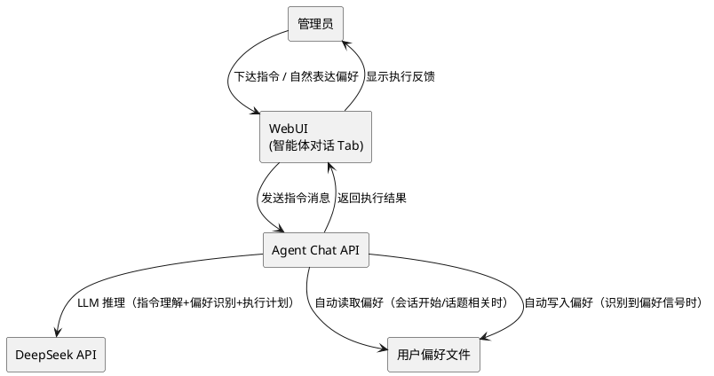
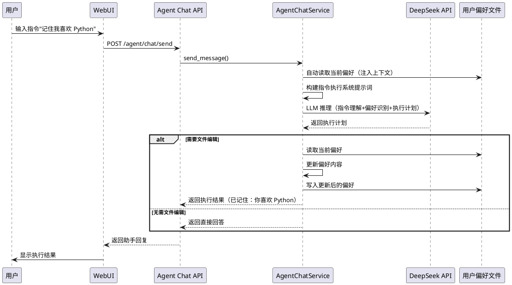
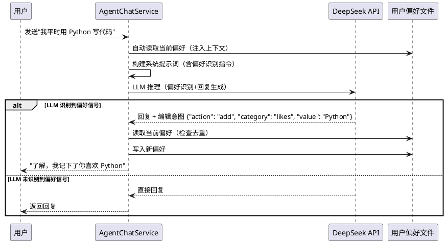
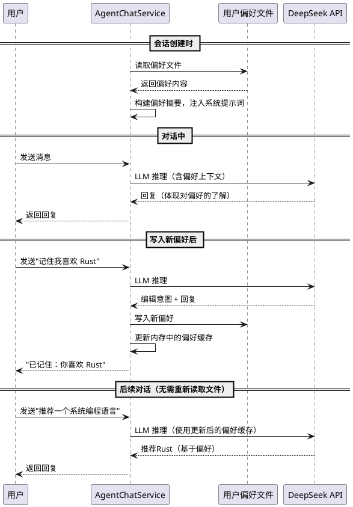
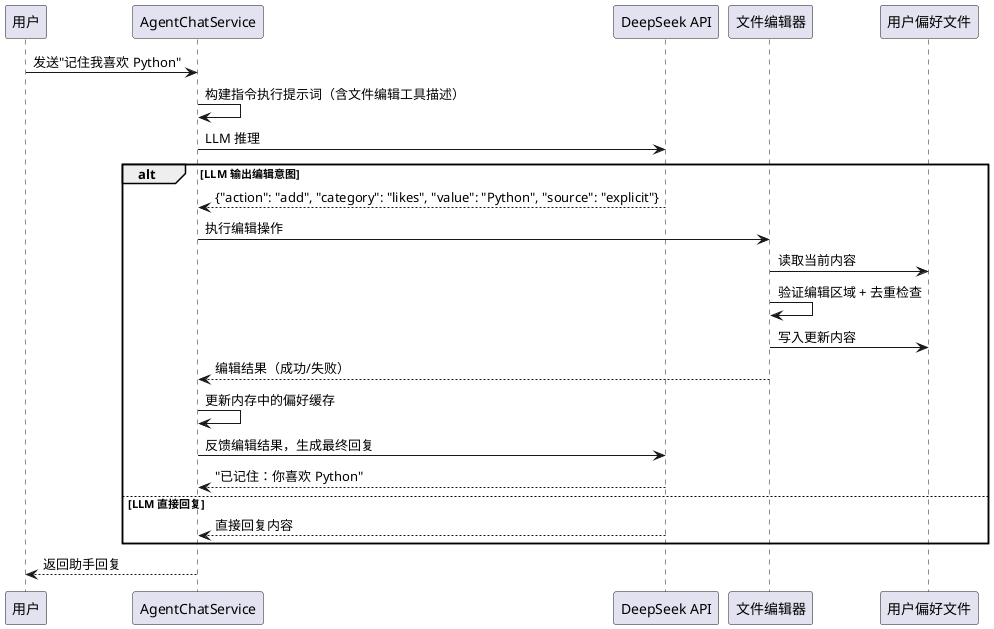
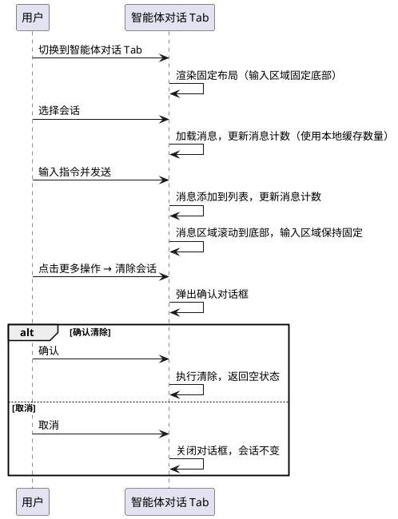

# 1. 组件定位

## 1.1 核心职责

本组件负责对 proactive-chat 插件的智能体对话功能进行四个方向的重构与改进：（1）将智能体对话从"角色扮演聊天"模式重新定义为"指令执行"模式，使用户通过对话给智能体下达指令而非闲聊；（2）新增智能体文件编辑能力，允许智能体在限定区域和限定文件中写入用户偏好等持久化信息；（3）新增智能体主动识别与记录用户喜好的能力，智能体在对话中自动识别用户偏好并写入喜好文件，而非被动等待用户显式下达记忆指令；（4）改进聊天界面布局，修复消息计数不同步、输入区域不固定等体验问题。

## 1.2 核心输入

1. 用户在智能体对话 Tab 中输入的指令消息（如"记住我喜欢XX"、"下次遇到这种情况时XX"）
2. 用户在对话中自然表达的偏好信息（如"我平时用 Python 写代码"、"我不喜欢早起"等非显式指令的偏好表达）
3. 智能体对话后端 API 的 4 个端点响应（已有，需扩展 send 端点返回值）
4. 用户偏好文件的当前内容（智能体自动读取和写入）
5. 配置 API 的读写响应（已有，需新增文件编辑相关配置项）
6. 聊天流列表 API 的响应（已有，不变）

## 1.3 核心输出

1. 重新定义的智能体对话系统提示词（指令执行导向 + 主动偏好识别，非聊天导向）
2. 智能体文件编辑执行结果（成功/失败反馈）
3. 智能体主动识别的用户偏好记录（自动写入喜好文件）
4. 改进后的聊天界面布局（输入区域固定、消息计数同步、清除按钮防误触）
5. 用户偏好持久化文件（智能体可自动读写的限定区域文件）

## 1.4 职责边界

- 不负责修改 MaiBot 主程序的 LLM 调用逻辑
- 不负责让智能体编辑任意文件（仅限配置中声明的特定文件和特定区域）
- 不负责修改 v3.3/v3.3.1 已有的配置页面修复、时间感知注入、聊天流上下文注入等功能
- 不负责修改 Agent Chat API 的端点定义（仅扩展 send 端点的返回值结构）
- 不修改主程序代码
- 不负责实现独立的文件系统管理服务（仅读写插件数据目录下的特定文件）
- 不负责实现 BM25 等全文检索引擎（喜好文件规模小，使用简单的文件读取即可）
- 不负责实现多层级记忆作用域（仅支持全局用户偏好，不区分项目/会话作用域）

# 2. 领域术语

**指令执行模式**
: 智能体对话的核心交互范式，用户通过对话给智能体下达指令（如"记住我喜欢XX"），智能体理解指令、执行操作并反馈结果，而非以角色身份进行闲聊。
: 备注：与当前的"聊天模式"相对，聊天模式下智能体以银狼等角色身份进行角色扮演对话。

**主动偏好识别**
: 智能体在对话过程中自动识别用户自然表达的偏好信息，并主动将其记录到用户偏好文件的能力。
: 备注：参考 MiMo-Code 的 dream 子智能体设计模式——智能体不是被动等待用户下达"记住"指令，而是在对话中主动发现值得记录的偏好信号。与"显式记忆指令"相对，显式记忆指令需要用户明确说出"记住XX"。

**偏好信号**
: 用户在对话中自然表达的、暗示其偏好的语言信号，包括但不限于喜好表达、习惯描述、行为倾向、明确的好恶判断。
: 备注：偏好信号的关键词模式包括"我喜欢/讨厌/习惯/偏好/通常/一般/总是/从不"等，以及隐含偏好的陈述如"我平时用 Python"。

**偏好自动读取**
: 智能体在合适的时机自动读取用户偏好文件内容，将其作为上下文注入对话，以提供个性化响应的能力。
: 备注：参考 MiMo-Code 的 memory search 工具设计——智能体在需要时自动检索记忆，而非每次对话都全量加载。读取时机包括会话开始时、用户提到相关话题时、智能体需要做出个性化决策时。

**文件编辑能力**
: 智能体在对话过程中能够读取和写入特定文件的能力，用于持久化用户偏好、行为规则等信息。
: 备注：文件编辑严格限制在配置中声明的特定文件路径和特定编辑区域内，智能体不能编辑任意文件。

**用户偏好文件**
: 存储用户偏好信息的特定文件，位于插件数据目录下，智能体可读写。
: 备注：文件格式为 YAML，包含用户偏好条目列表。参考 MiMo-Code 的记忆路径守卫（memory-path-guard）设计，文件编辑受白名单和区域标记双重约束。

**编辑区域约束**
: 对智能体文件编辑能力的限制规则，包括可编辑文件白名单和每个文件的可编辑区域标记。
: 备注：参考 MiMo-Code 的 memory-path-guard 模式——通过路径验证函数在写入前校验目标路径是否在允许范围内。可编辑区域通过特殊标记（如注释行 `# --- editable start ---`）界定，智能体只能修改标记区域内的内容。

**聊天界面固定布局**
: 聊天界面中输入区域和会话信息栏的布局策略，输入区域始终固定在视口底部，不随消息滚动。
: 备注：当前实现中输入区域随页面整体滚动，当消息较多时输入区域可能被推到视口外。

**消息计数同步**
: 会话信息栏中显示的消息数量与实际消息数量保持一致的机制。
: 备注：当前实现中会话信息栏显示"0条消息"但实际已有消息，原因是后端 `list_sessions()` 返回的 `message_count` 与前端缓存的消息数不同步。

# 3. 角色与边界

## 3.1 核心角色

- **MaiBot 管理员**：通过智能体对话 Tab 给智能体下达指令（如"记住我喜欢XX"、"下次遇到这种情况时XX"），或在对话中自然表达偏好，查看执行结果

## 3.2 外部系统

- **Agent Chat API**：提供会话创建、列表、消息发送、会话清除 4 个端点（已有，send 端点需扩展返回值）
- **DeepSeek API**：提供 LLM 推理服务（已有，不变）
- **文件系统**：提供用户偏好文件的读写能力（新增交互，含自动读取和自动写入）

## 3.3 交互上下文



# 4. DFX 约束

## 4.1 性能

1. 智能体对话消息发送到响应的端到端延迟 SHALL 不超过 20 秒（含 LLM 调用和可能的文件编辑操作）
2. 文件编辑操作（读取+写入）SHALL 在 500ms 内完成
3. 偏好文件自动读取 SHALL 在 200ms 内完成（文件规模小，简单读取即可）
4. 聊天界面布局重排 SHALL 在 100ms 内完成（无可见闪烁）

## 4.2 可靠性

1. 文件编辑失败时 SHALL 不损坏原有文件内容（原子写入或写入前备份）
2. 智能体对话 Tab 的前端 JavaScript 错误 SHALL 不影响其他 Tab 的正常使用
3. 消息计数 SHALL 在每次消息发送/接收后即时同步
4. 偏好自动读取失败 SHALL 不阻塞对话流程（降级为无偏好上下文的对话）

## 4.3 安全性

1. 智能体 SHALL 只能编辑配置中明确声明的文件，不能编辑任意文件
2. 智能体 SHALL 只能修改文件中标记的可编辑区域，不能修改区域外的内容
3. 文件编辑操作 SHALL 记录审计日志（编辑时间、编辑内容摘要）
4. 智能体 SHALL 不能通过文件编辑执行任意代码
5. 智能体自动识别的偏好 SHALL 经过 LLM 确认后才写入文件，避免误识别导致错误记录

## 4.4 可维护性

1. 智能体指令执行的系统提示词 SHALL 通过 `prompts.py` 中的常量管理
2. 可编辑文件列表和编辑区域标记 SHALL 通过配置项声明，无需修改代码
3. 前端代码 SHALL 使用独立的 HTML/CSS/JS 文件，不嵌入 Python 字符串
4. 偏好识别的关键词模式和分类规则 SHALL 通过系统提示词定义，便于调整

## 4.5 兼容性

1. v3.4 SHALL 向后兼容 v3.3.1 的所有 API 端点契约
2. v3.4 的智能体对话模式变更 SHALL 不影响 v3.3.1 的配置页面修复
3. v3.4 的文件编辑功能 SHALL 在 `agent_chat.file_edit_enabled` 为 False 时与 v3.3.1 行为一致
4. v3.4 的偏好自动识别功能 SHALL 在 `agent_chat.auto_preference_enabled` 为 False 时与 v3.3.1 行为一致
5. 不启用任何 v3.4 新功能时，v3.4 的行为 SHALL 与 v3.3.1 完全一致

# 5. 核心能力

## 5.1 智能体对话模式重新定义

### 5.1.1 业务规则

1. **系统提示词重定义**：When 智能体对话会话创建或消息发送，the 系统提示词 SHALL 以"指令执行助手"为定位，明确告知 LLM 其职责是理解用户指令并执行操作，同时具备主动识别用户偏好的能力
   - 当前问题：`AGENT_CHAT_SYSTEM_PROMPT` 定义为"你是一个友好的聊天助手"，引导 LLM 进行角色扮演闲聊
   - 重定义方向：系统提示词 SHALL 明确说明智能体是"指令执行助手"，用户通过对话下达指令，智能体理解指令意图、执行操作并反馈结果；同时智能体 SHALL 主动识别用户在对话中自然表达的偏好信息
   - 验收条件：新建会话 → 发送"记住我喜欢 Python" → 智能体理解这是"记住用户偏好"指令 → 执行记忆操作 → 返回"已记住：你喜欢 Python"

2. **指令识别与分类**：When 用户发送消息，the 智能体 SHALL 识别消息的指令类型并执行相应操作
   - 支持的指令类型：
     - **记忆指令**：如"记住我喜欢XX"、"我讨厌XX" → 写入用户偏好文件
     - **查询指令**：如"你还记得什么？" → 读取用户偏好文件并汇总
     - **行为指令**：如"下次遇到这种情况时XX" → 写入行为规则文件
     - **通用对话**：不属于上述类型的一般性问答 → 直接回答
   - 验收条件：发送"记住我喜欢 Python" → 智能体识别为记忆指令 → 执行写入操作 → 返回确认

3. **角色信息保留**：Where 配置中设置了 bot_nickname 和 personality，the 智能体 SHALL 在回复语气中保持角色特征，但 SHALL NOT 以角色身份进行闲聊
   - 当前问题：智能体完全以角色身份聊天，偏离了"下命令"的目的
   - 重定义方向：角色信息仅影响回复的语气和风格，不影响智能体的核心职责（执行指令）
   - 验收条件：配置了银狼角色 → 发送"记住我喜欢 Python" → 回复语气带有银狼风格但内容是"已记住：你喜欢 Python"而非角色扮演闲聊

4. **指令执行结果反馈**：When 智能体执行了指令操作，the 回复 SHALL 包含明确的执行结果反馈
   - 成功反馈格式：简明确认 + 执行内容摘要（如"已记住：你喜欢 Python"）
   - 失败反馈格式：失败原因 + 建议操作（如"无法记住：偏好文件不可写，请检查配置"）
   - 验收条件：记忆指令执行成功 → 回复包含"已记住"确认；执行失败 → 回复包含失败原因

5. **对话引导**：When 用户在空会话中发送闲聊类消息，the 智能体 SHALL 友好地引导用户使用指令模式
   - 引导方式：简短回答问题后，提示用户可以通过指令让智能体执行操作
   - 验收条件：发送"你好" → 智能体简短回应 + 提示"你可以让我记住你的偏好或设置行为规则"

6. **禁止项**：the 智能体对话 SHALL NOT 在指令执行模式下进行无目的的角色扮演闲聊
   - 验收条件：发送"今天天气怎么样" → 智能体回答问题但不会以角色身份展开闲聊

### 5.1.2 交互流程



### 5.1.3 异常场景

1. **指令意图不明确**
   - 触发条件：用户发送的消息无法明确归类为某种指令类型
   - 系统行为：智能体以通用对话方式回复，并提示可用的指令类型
   - 用户感知：收到回复 + 提示信息

2. **文件编辑功能未启用**
   - 触发条件：用户发送记忆/行为指令，但 `file_edit_enabled` 为 False
   - 系统行为：智能体告知用户文件编辑功能未启用，建议在配置中开启
   - 用户感知：收到"文件编辑功能未启用"提示

3. **LLM 误解指令意图**
   - 触发条件：LLM 将指令误解为闲聊或将闲聊误解为指令
   - 系统行为：按 LLM 的理解执行，用户可通过后续消息纠正
   - 用户感知：执行结果与预期不符，可通过对话纠正

## 5.2 智能体主动偏好识别与记录

### 5.2.1 业务规则

1. **主动偏好识别启用控制**：Where 配置项 `agent_chat.auto_preference_enabled` 为 True，the 智能体 SHALL 在对话过程中主动识别用户自然表达的偏好信息
   - 验收条件：auto_preference_enabled=True → 智能体主动识别偏好并记录；auto_preference_enabled=False → 仅响应显式记忆指令

2. **偏好信号识别**：When 用户在对话中自然表达了偏好信号，the 智能体 SHALL 识别该信号并判断是否值得记录
   - 偏好信号类型：
     - **喜好表达**：如"我挺喜欢 Python 的"、"Python 真好用" → 识别为 likes
     - **厌恶表达**：如"我讨厌早起"、"Java 太啰嗦了" → 识别为 dislikes
     - **习惯描述**：如"我平时习惯用 VSCode"、"我一般晚上写代码" → 识别为 habits
     - **行为倾向**：如"我总是先写测试再写代码"、"我从不写注释" → 识别为 rules
     - **隐含偏好**：如"我平时用 Python 写代码"（隐含喜欢 Python）、"又加班到半夜"（隐含不喜欢加班）→ 由 LLM 判断是否记录
   - 验收条件：用户说"我平时用 Python 写代码" → 智能体识别为偏好信号 → 判断值得记录 → 自动写入偏好文件

3. **偏好识别确认机制**：When 智能体识别到偏好信号并决定记录，the 智能体 SHALL 在回复中告知用户已记录该偏好
   - 确认方式：在回复中自然地提及已记录，如"了解，我记下了你喜欢 Python"
   - 不需要用户额外确认（参考 MiMo-Code 的设计哲学：信任智能体的判断，用户可通过后续指令纠正）
   - 验收条件：智能体识别偏好 → 回复中包含"我记下了"等确认信息 → 偏好文件已更新

4. **偏好去重**：When 智能体识别到与已有偏好重复的信号，the 智能体 SHALL NOT 重复写入相同条目
   - 去重规则：新偏好与已有条目在语义上相同时，不重复添加
   - 验收条件：偏好文件已有"喜欢 Python" → 用户再次说"我喜欢 Python" → 智能体回复"我已经知道你喜欢 Python 了" → 不重复写入

5. **偏好识别的边界**：the 智能体 SHALL NOT 将以下内容识别为偏好信号
   - 临时性陈述：如"今天好累"（非持久偏好）
   - 客观事实描述：如"现在是下午三点"（非个人偏好）
   - 他人偏好：如"他说他喜欢 Java"（非用户自身偏好）
   - 验收条件：用户说"今天好累" → 智能体不将其记录为偏好

6. **偏好识别与显式指令的优先级**：When 用户同时发出了显式记忆指令和自然表达了偏好信号，the 显式指令 SHALL 优先处理
   - 验收条件：用户说"记住我喜欢 Python，另外我平时用 VSCode" → "记住我喜欢 Python"作为显式指令处理 → "我平时用 VSCode"作为偏好信号自动识别

7. **禁止项**：the 智能体 SHALL NOT 在未识别到偏好信号时强行从对话中提取偏好
   - 验收条件：用户说"今天天气不错" → 智能体不尝试从中提取偏好

### 5.2.2 交互流程



### 5.2.3 异常场景

1. **偏好误识别**
   - 触发条件：LLM 将非偏好内容误识别为偏好信号
   - 系统行为：写入偏好文件，用户可通过"忘记我喜欢XX"等指令删除
   - 用户感知：智能体回复中提及已记录某偏好，用户可纠正

2. **偏好文件不可写**
   - 触发条件：智能体识别到偏好信号但偏好文件无法写入
   - 系统行为：回复中告知用户偏好记录失败，但不影响对话继续
   - 用户感知：收到"我注意到了你的偏好，但暂时无法记录"提示

3. **偏好去重判断失误**
   - 触发条件：LLM 判断新偏好与已有条目重复，但实际上是不同偏好
   - 系统行为：不写入新偏好，用户可通过显式"记住XX"指令强制写入
   - 用户感知：智能体回复"我已经知道你喜欢XX了"，用户可说"不对，我要记住的是YY"

4. **偏好识别过于激进**
   - 触发条件：智能体频繁从普通对话中提取偏好，干扰正常对话体验
   - 系统行为：用户可通过配置关闭 `auto_preference_enabled`，或通过指令"不要自动记住我的偏好"临时抑制
   - 用户感知：智能体不再主动记录偏好，仅响应显式记忆指令

## 5.3 偏好自动读取

### 5.3.1 业务规则

1. **会话开始时自动读取**：When 智能体对话会话创建，the 系统 SHALL 自动读取用户偏好文件内容，将其作为上下文注入系统提示词
   - 注入方式：在系统提示词中追加偏好摘要段，如"[用户偏好] 该用户喜欢：Python、VSCode；习惯：晚上写代码"
   - 验收条件：创建新会话 → 系统提示词中包含用户偏好摘要 → 智能体回复体现对偏好的了解

2. **话题相关时自动读取**：When 用户在对话中提到与已记录偏好相关的话题，the 智能体 SHALL 利用已注入的偏好上下文提供个性化响应
   - 触发方式：偏好已在会话开始时注入，智能体通过 LLM 自然理解偏好与话题的关联
   - 验收条件：偏好文件记录了"喜欢 Python" → 用户问"推荐一个编程语言" → 智能体优先推荐 Python

3. **偏好摘要格式**：When 偏好内容被注入系统提示词，the 摘要 SHALL 使用简洁的结构化格式
   - 格式：`[用户偏好] 喜欢：X, Y；不喜欢：Z；习惯：W；规则：V`
   - 空偏好处理：偏好文件为空时不注入偏好摘要段
   - 验收条件：偏好文件有 3 条 likes、1 条 habits → 摘要格式为"[用户偏好] 喜欢：Python, VSCode, 深色主题；习惯：晚上写代码"

4. **偏好读取的 Token 预算**：When 偏好摘要注入系统提示词，the 摘要 SHALL 不超过 500 Token
   - 超出处理：按优先级截断，优先保留 rules > habits > dislikes > likes
   - 验收条件：偏好文件有 50 条记录 → 摘要被截断至 500 Token 以内 → rules 和 habits 优先保留

5. **偏好文件不存在时的行为**：When 用户偏好文件不存在，the 系统 SHALL 不注入偏好上下文，对话正常进行
   - 验收条件：偏好文件不存在 → 系统提示词中无偏好摘要 → 对话正常

6. **偏好读取与写入的一致性**：When 智能体在当前会话中写入了新偏好，the 后续对话 SHALL 能感知到该偏好（无需重新读取文件，因写入操作已更新内存中的偏好数据）
   - 验收条件：会话中写入"喜欢 Python" → 同一会话中用户问"推荐语言" → 智能体推荐 Python

7. **禁止项**：the 偏好自动读取 SHALL NOT 在每条消息发送时都重新读取文件（仅在会话创建时读取一次，写入时更新内存缓存）
   - 验收条件：连续发送 5 条消息 → 偏好文件仅被读取 1 次（会话创建时）

### 5.3.2 交互流程



### 5.3.3 异常场景

1. **偏好文件读取失败**
   - 触发条件：会话创建时偏好文件读取失败（文件损坏、权限不足等）
   - 系统行为：跳过偏好注入，对话正常进行，记录警告日志
   - 用户感知：对话正常，但智能体不体现对偏好的了解

2. **偏好摘要超出 Token 预算**
   - 触发条件：偏好内容过多，摘要超过 500 Token
   - 系统行为：按优先级截断（rules > habits > dislikes > likes），保留高优先级偏好
   - 用户感知：智能体可能不体现低优先级偏好的了解

3. **偏好内容过时**
   - 触发条件：偏好文件中的偏好已不再反映用户当前倾向
   - 系统行为：用户可通过"我不再喜欢XX"等指令删除过时偏好
   - 用户感知：智能体基于过时偏好做出推荐 → 用户纠正 → 偏好更新

4. **偏好文件格式损坏**
   - 触发条件：偏好文件的 YAML 格式不合法
   - 系统行为：跳过偏好注入，记录错误日志，不尝试修复文件
   - 用户感知：对话正常，但智能体不体现对偏好的了解

## 5.4 智能体文件编辑能力

### 5.4.1 业务规则

1. **文件编辑启用控制**：Where 配置项 `agent_chat.file_edit_enabled` 为 True，the 智能体 SHALL 在对话过程中具备文件编辑能力
   - 验收条件：file_edit_enabled=True → 智能体可执行文件编辑指令；file_edit_enabled=False → 智能体告知用户功能未启用

2. **可编辑文件白名单**：the 文件编辑能力 SHALL 仅限于配置中声明的文件列表
   - 白名单来源：配置项 `agent_chat.editable_files`，字符串列表，每个条目为相对于插件数据目录的文件路径
   - 默认白名单：`["user_preferences.yaml"]`（仅用户偏好文件）
   - 验收条件：白名单仅包含 `user_preferences.yaml` → 智能体尝试编辑其他文件 → 操作被拒绝

3. **编辑区域标记**：Where 可编辑文件中包含编辑区域标记，the 智能体 SHALL 只修改标记区域内的内容
   - 标记格式：`# --- editable start ---` 和 `# --- editable end ---`（YAML 文件）
   - 标记区域外的内容 SHALL NOT 被智能体修改
   - 验收条件：文件包含标记区域 → 智能体仅修改标记区域内的内容 → 标记区域外的内容不变

4. **用户偏好文件格式**：the 用户偏好文件 SHALL 使用 YAML 格式，包含以下结构
   - 文件路径：`{插件数据目录}/user_preferences.yaml`
   - 结构：顶层为分类键（如 `likes`、`dislikes`、`habits`、`rules`），每个分类下为条目列表
   - 验收条件：智能体写入"喜欢 Python" → 文件中 `likes` 列表新增"Python"条目

5. **文件编辑原子性**：When 智能体写入文件，the 操作 SHALL 保证原子性，失败时不损坏原有内容
   - 实现方式：先写入临时文件，成功后替换原文件；或写入前备份原文件
   - 验收条件：写入过程中断电 → 重启后原文件内容完整

6. **文件编辑审计日志**：When 智能体执行文件编辑操作，the 系统 SHALL 记录审计日志
   - 日志内容：编辑时间、会话 ID、编辑的文件路径、编辑内容摘要（新增/修改/删除的条目）、触发来源（显式指令/主动识别）
   - 验收条件：智能体编辑用户偏好文件 → 日志中出现编辑记录（含触发来源）

7. **文件读取能力**：When 用户发送查询指令，the 智能体 SHALL 能够读取用户偏好文件的内容并汇总回复
   - 验收条件：发送"你还记得什么？" → 智能体读取偏好文件 → 汇总列出所有已记住的偏好

8. **LLM 驱动的文件编辑**：When 智能体需要编辑文件，the 系统 SHALL 通过 LLM 生成编辑指令，由后端执行实际的文件读写操作
   - LLM 不直接操作文件系统，而是输出结构化的编辑意图（如 `{"action": "add", "category": "likes", "value": "Python"}`）
   - 后端解析编辑意图，执行文件读写，并将结果反馈给 LLM 生成最终回复
   - 验收条件：LLM 输出编辑意图 → 后端执行文件编辑 → 返回执行结果 → LLM 生成确认回复

9. **编辑意图来源标记**：When 智能体输出编辑意图，the 编辑意图 SHALL 包含来源标记，区分是显式指令触发还是主动识别触发
   - 来源字段：`source`，可选值：`explicit`（显式指令）、`auto`（主动识别）
   - 验收条件：用户说"记住我喜欢 Python" → 编辑意图 source=explicit；用户说"我平时用 Python" → 编辑意图 source=auto

10. **禁止项**：the 智能体 SHALL NOT 编辑配置中未声明的文件
    - 验收条件：白名单不包含 `config.yaml` → 智能体尝试编辑 `config.yaml` → 操作被拒绝

### 5.4.2 交互流程



### 5.4.3 异常场景

1. **可编辑文件不存在**
   - 触发条件：白名单中的文件在文件系统中不存在
   - 系统行为：自动创建文件（含编辑区域标记和默认结构），然后执行编辑操作
   - 用户感知：编辑操作正常完成

2. **编辑区域标记缺失**
   - 触发条件：可编辑文件中未包含编辑区域标记
   - 系统行为：将整个文件视为可编辑区域（因为文件本身在白名单中），但记录警告日志
   - 用户感知：编辑操作正常完成

3. **文件写入权限不足**
   - 触发条件：插件数据目录或目标文件无写入权限
   - 系统行为：编辑操作失败，返回错误信息给 LLM，LLM 生成失败反馈
   - 用户感知：收到"无法保存偏好，请检查文件权限"提示

4. **LLM 输出无效编辑意图**
   - 触发条件：LLM 输出的编辑意图格式不正确或包含非法操作
   - 系统行为：拒绝执行编辑操作，返回错误信息给 LLM，LLM 重新生成回复
   - 用户感知：收到正常的回复（不暴露内部错误细节）

5. **并发编辑冲突**
   - 触发条件：多个会话同时编辑同一文件
   - 系统行为：后写入的覆盖先写入的（简单策略，因使用场景为低频单用户）
   - 用户感知：编辑操作正常完成（后编辑的内容生效）

6. **去重检查时偏好文件内容已变更**
   - 触发条件：去重检查时文件内容与内存缓存不一致（如外部手动编辑了文件）
   - 系统行为：以文件实际内容为准进行去重判断
   - 用户感知：编辑操作正常完成，不会产生重复条目

## 5.5 聊天界面布局改进

### 5.5.1 业务规则

1. **输入区域固定**：When 智能体对话 Tab 处于活跃状态，the 输入区域 SHALL 固定在对话区域底部，不随消息滚动
   - 当前问题：输入区域在 `chat-area` 的 flex 布局中，但 `chat-area` 本身可能因内容高度不足或页面滚动导致输入区域不在视口底部
   - 改进方向：`chat-area` 使用 `position: relative; height: 100%`，消息区域 `chat-messages` 使用 `flex: 1; overflow-y: auto`，输入区域 `chat-input-area` 固定在底部
   - 验收条件：消息区域有 50+ 条消息 → 输入区域始终固定在对话区域底部 → 滚动消息不影响输入区域位置

2. **消息计数同步**：When 会话信息栏显示消息数量，the 数量 SHALL 与实际消息数量一致
   - 当前问题：会话信息栏显示"0条消息"但实际已有 4 条消息，原因是后端 `list_sessions()` 返回的 `message_count` 基于服务端会话状态，而前端的消息可能尚未同步到后端
   - 改进方向：前端优先使用本地缓存的消息数量（`currentChatMessages.length`），仅在首次加载时使用后端返回的 `message_count`
   - 验收条件：发送 4 条消息 → 会话信息栏显示"4条消息" → 切换到其他会话再切回 → 仍显示"4条消息"

3. **清除会话按钮防误触**：When 用户点击"清除会话"按钮，the 系统 SHALL 显示确认对话框，且按钮位置 SHALL 不易被误触
   - 当前问题："清除会话"按钮位于会话信息栏右侧，与常用操作区域相邻，容易误触
   - 改进方向：将"清除会话"按钮移至会话信息栏的下拉菜单或使用更不显眼的样式（如文字链接而非按钮），并保留确认对话框
   - 验收条件：点击"清除会话" → 弹出确认对话框 → 确认后才执行清除

4. **会话信息栏布局优化**：When 用户选中一个会话，the 会话信息栏 SHALL 显示关键信息且布局紧凑
   - 当前问题：会话信息栏仅一行文本，信息密度低，且"清除会话"按钮占据右侧空间
   - 改进方向：会话信息栏左侧显示会话名称/关联聊天流，右侧显示操作按钮（更多操作 → 下拉菜单含"清除会话"）
   - 验收条件：选中会话 → 信息栏显示聊天流名称 + 消息数量 + 操作菜单

5. **对话区域高度自适应**：When 智能体对话 Tab 处于活跃状态，the 对话区域 SHALL 充分利用可用视口高度
   - 当前问题：`#agent-chat-main` 使用 `height: calc(100vh - 140px)`，但实际可用高度可能因浏览器工具栏等因素不同
   - 改进方向：使用 `flex: 1; min-height: 0` 配合父容器的 flex 布局，确保对话区域自适应
   - 验收条件：不同浏览器窗口大小 → 对话区域始终填满可用空间 → 无滚动条溢出

6. **空会话提示优化**：When 用户选中一个空会话，the 前端 SHALL 显示指令模式的引导提示
   - 当前问题：空会话提示为"开始与智能体对话 ✨"，未体现指令执行模式
   - 改进方向：提示文案改为指令模式引导，如"输入指令开始，例如：记住我喜欢XX"
   - 验收条件：选中空会话 → 显示"输入指令开始，例如：记住我喜欢XX"提示

7. **输入框占位符优化**：the 输入框占位符 SHALL 体现指令执行模式
   - 当前问题：占位符为"输入消息... (Enter 发送, Shift+Enter 换行)"，体现的是聊天模式
   - 改进方向：占位符改为"输入指令... (Enter 发送, Shift+Enter 换行)"
   - 验收条件：输入框显示"输入指令..."占位符

8. **禁止项**：the 聊天界面布局改进 SHALL NOT 修改数据面板 Tab 和配置 Tab 的布局
   - 验收条件：数据面板和配置 Tab 的布局与 v3.3.1 完全一致

### 5.5.2 交互流程



### 5.5.3 异常场景

1. **浏览器窗口大小变化**
   - 触发条件：用户调整浏览器窗口大小
   - 系统行为：对话区域自适应新窗口大小，输入区域保持固定底部
   - 用户感知：布局自动调整，无内容溢出或遮挡

2. **移动端布局**
   - 触发条件：在移动端或窄屏设备上访问智能体对话 Tab
   - 系统行为：会话列表和对话区域垂直堆叠，输入区域固定底部
   - 用户感知：可正常使用，输入区域不被虚拟键盘遮挡

3. **消息计数与后端不一致**
   - 触发条件：前端缓存的消息数量与后端 `message_count` 不一致
   - 系统行为：前端优先使用本地缓存数量，不显示后端的过时数量
   - 用户感知：消息数量始终与可见消息一致

# 6. 数据约束

## 6.1 智能体对话配置扩展

1. **file_edit_enabled**：是否启用智能体文件编辑能力，布尔值，默认 False
2. **editable_files**：可编辑文件白名单，字符串列表，每个条目为相对于插件数据目录的文件路径，默认 `["user_preferences.yaml"]`
3. **edit_backup_enabled**：是否启用编辑前备份，布尔值，默认 True
4. **auto_preference_enabled**：是否启用智能体主动偏好识别，布尔值，默认 True
5. **preference_summary_token_limit**：偏好摘要注入系统提示词的最大 Token 数，整数，默认 500

## 6.2 用户偏好文件

1. **文件路径**：`{插件数据目录}/user_preferences.yaml`
2. **文件格式**：YAML
3. **顶层结构**：
   - `likes`：用户喜欢的事物列表，字符串列表
   - `dislikes`：用户不喜欢的事物列表，字符串列表
   - `habits`：用户习惯列表，字符串列表
   - `rules`：行为规则列表，字符串列表
4. **编辑区域标记**：`# --- editable start ---` 和 `# --- editable end ---`
5. **默认内容**：
   ```yaml
   # --- editable start ---
   likes: []
   dislikes: []
   habits: []
   rules: []
   # --- editable end ---
   ```

## 6.3 编辑意图结构

1. **action**：编辑操作类型，字符串，必填，可选值：`add`（新增条目）、`remove`（删除条目）、`update`（更新条目）
2. **category**：编辑的分类键，字符串，必填，可选值：`likes`、`dislikes`、`habits`、`rules`
3. **value**：编辑的条目值，字符串，必填
4. **old_value**：被替换的旧值（仅 `update` 和 `remove` 操作需要），字符串，可选
5. **source**：编辑意图来源，字符串，必填，可选值：`explicit`（显式指令触发）、`auto`（主动偏好识别触发）

## 6.4 编辑审计日志

1. **timestamp**：编辑时间，Unix 时间戳（毫秒），必填
2. **session_id**：触发编辑的会话 ID，字符串，必填
3. **file_path**：编辑的文件路径，字符串，必填
4. **action**：编辑操作类型，字符串，必填
5. **category**：编辑的分类键，字符串，必填
6. **value**：编辑的条目值，字符串，必填
7. **old_value**：被替换的旧值，字符串，可选
8. **source**：编辑意图来源（explicit/auto），字符串，必填

## 6.5 偏好摘要注入格式

1. **注入位置**：系统提示词末尾，以独立段落注入
2. **格式**：`[用户偏好] 喜欢：X, Y；不喜欢：Z；习惯：W；规则：V`
3. **空分类处理**：空分类不显示（如无 dislikes 则不显示"不喜欢："段）
4. **截断优先级**：rules > habits > dislikes > likes（高优先级优先保留）
