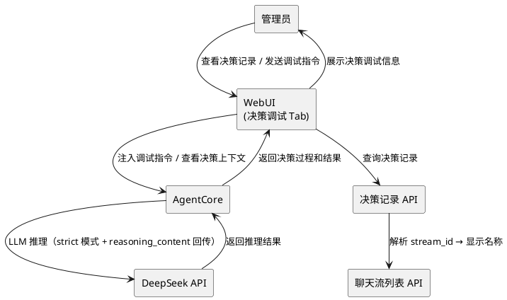
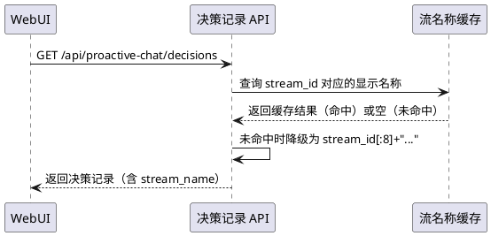
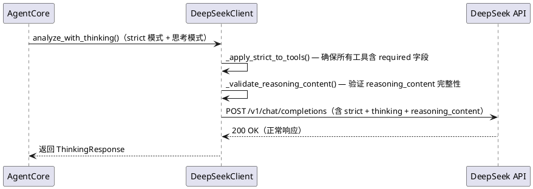
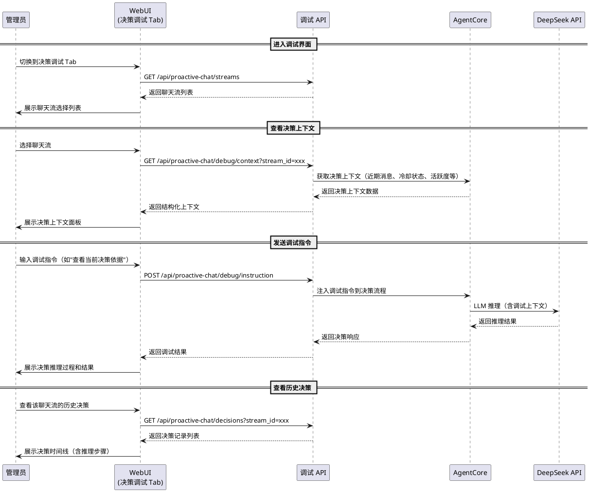

# 1. 组件定位

## 1.1 核心职责

本组件负责对 proactive-chat 插件进行三个方向的改进：（1）修复 WebUI 决策记录中聊天流名称显示/查找异常；（2）对齐 MaiBot 主程序最新修复（DeepSeek strict 模式 required 字段、reasoning_content 多轮回传）到插件的 DeepSeekClient；（3）将智能体对话功能从"聊天界面"重新定位为"决策调试界面"，让管理员能够观察、调试、微调智能体的决策行为。

## 1.2 核心输入

1. 决策记录查询请求中的 stream_id 参数（已有，用于聊天流名称解析）
2. 聊天流列表 API 返回的流数据（已有，需用于决策记录的流名称映射）
3. DeepSeek API 的工具调用请求体（已有，需修复 strict 模式 required 字段）
4. DeepSeek API 的思考模式消息列表（已有，需修复 reasoning_content 回传）
5. 管理员在决策调试界面中输入的调试指令（重新定义，替代原有聊天消息）
6. 智能体决策过程的中间状态数据（新增，用于调试界面展示）

## 1.3 核心输出

1. 决策记录列表中正确显示聊天流名称（修复，替代原始 stream_id）
2. DeepSeek API 调用不再因 strict 模式 required 缺失或 reasoning_content 丢失而报 400 错误（修复）
3. 决策调试界面：管理员可查看决策上下文、注入调试指令、观察决策推理过程（重新设计，替代聊天界面）
4. 决策调试日志：记录管理员对智能体决策行为的干预操作（新增）

## 1.4 职责边界

- 不负责修改 MaiBot 主程序的任何代码
- 不负责实现完整的 IDE 级调试器（无断点、无单步执行、无变量监视）
- 不负责修改 v3.4 已有的决策循环核心逻辑（agent.py 的 decision_loop）
- 不负责实现智能体的自动调优/自动参数优化
- 不负责实现决策调试界面的实时推送（仅手动刷新）
- 不负责修改决策记录的持久化格式

# 2. 领域术语

**决策调试界面**
: 替代原有"智能体对话"的 WebUI 功能模块，管理员通过该界面观察智能体的决策上下文、注入调试指令、查看推理过程，而非与智能体进行闲聊。
: 备注：与原有的"智能体对话"（agent_chat）相对。原有设计将智能体当作聊天机器人，用户发送消息、智能体回复；新设计将智能体当作决策引擎，管理员通过调试界面观察和干预其决策行为。

**决策上下文**
: 智能体在做出决策时所能感知到的全部信息，包括聊天流近期消息、冷却状态、活跃度指标、记忆检索结果等。
: 备注：在原有设计中，决策上下文仅通过聊天流上下文注入（stream_context_id）间接提供给智能体；在调试界面中，管理员应能直接查看完整的决策上下文。

**调试指令**
: 管理员通过决策调试界面发送给智能体的干预性指令，目的是影响/观察智能体的决策行为，而非与智能体闲聊。
: 备注：与原有的"聊天消息"相对。聊天消息是用户与智能体之间的对话内容，调试指令是管理员对智能体决策行为的干预操作。调试指令的示例：查看当前决策依据、注入额外上下文、模拟特定场景。

**聊天流名称解析**
: 将决策记录中的 stream_id（内部标识符）转换为用户可读的聊天流名称（如群名或"XX 的私聊"）的过程。
: 备注：当前实现中，决策记录的 stream_name 字段始终为空字符串，前端只能显示原始 stream_id。

**DeepSeek strict 模式 required 陷阱**
: DeepSeek API 在 strict 模式下要求工具参数 schema 必须包含 `required` 字段（即使为空数组），否则返回 400 错误。MaiBot 主程序已在 bd077ae5 中修复此问题，但插件的 DeepSeekClient 仍可能受影响。
: 备注：插件的 `_apply_strict_to_tools()` 方法已实现 `required` 字段填充，但需验证是否覆盖所有场景。

**reasoning_content 多轮回传**
: DeepSeek 思考模式下，assistant 消息中的 reasoning_content 字段需要在后续请求中回传给 API，否则 API 返回 400 错误。MaiBot 主程序已在 f43cccc8 中修复此问题，但插件的 DeepSeekClient 在 agent_chat 场景中可能存在类似问题。
: 备注：插件的 agent_chat 使用 `analyze_with_messages()` 方法，该方法不使用思考模式，因此 reasoning_content 回传问题在 agent_chat 场景中不存在。但在主决策循环（使用 `analyze_with_thinking()`）中，插件的实现已包含 `_validate_reasoning_content()` 和 `_fix_reasoning_content()` 方法。

# 3. 角色与边界

## 3.1 核心角色

- **MaiBot 管理员**：通过决策调试界面观察和干预智能体的决策行为，查看决策记录中的聊天流名称，期望获得类似开发工具的调试体验而非聊天体验

## 3.2 外部系统

- **MaiBot 主程序**：提供聊天流列表 API、消息 API、chat_manager 等接口（已有，需用于流名称解析）
- **DeepSeek API**：提供 LLM 推理服务（已有，需修复 strict 模式和 reasoning_content 兼容性）
- **Agent Chat API**：提供会话创建、消息发送等端点（已有，需重新定位为调试端点）

## 3.3 交互上下文

# 4. DFX 约束

## 4.1 性能

1. 决策记录聊天流名称解析 SHALL 在 200ms 内完成（单页 20 条记录的批量解析）
2. 调试指令发送到响应的端到端延迟 SHALL 不超过 30 秒（含 LLM 调用）
3. 决策上下文展示 SHALL 在 500ms 内完成渲染

## 4.2 可靠性

1. 聊天流名称解析失败时 SHALL 降级显示 stream_id 前 8 位，不阻塞决策记录展示
2. DeepSeek API 调用因 strict 模式或 reasoning_content 问题失败时 SHALL 自动降级重试，不丢失决策
3. 调试指令执行失败时 SHALL 返回明确的错误信息，不影响智能体的正常决策循环

## 4.3 安全性

1. 调试指令 SHALL 仅在 WebUI 管理界面可用，不暴露给外部 API
2. 调试指令 SHALL 不绕过智能体的安全约束（如冷却期、白名单等）
3. 决策上下文中 SHALL 不包含 API Key 等敏感信息

## 4.4 可维护性

1. 聊天流名称解析逻辑 SHALL 复用 WebUIServer 已有的 `_stream_display_cache` 和 `_get_stream_display_name()` 方法
2. DeepSeek strict 模式修复 SHALL 与 MaiBot 主程序的修复保持一致
3. 决策调试界面的前端代码 SHALL 使用独立的 HTML/CSS/JS 文件，不嵌入 Python 字符串

## 4.5 兼容性

1. v3.5 SHALL 向后兼容 v3.4.1 的所有 API 端点契约
2. v3.5 的聊天流名称解析功能 SHALL 不影响 v3.4.1 的决策记录查询性能
3. v3.5 的决策调试界面 SHALL 替代原有的智能体对话 Tab，但保留原有的 API 端点（标记为 deprecated）
4. DeepSeek strict 模式修复 SHALL 不影响非 strict 模式下的正常调用

# 5. 核心能力

## 5.1 决策记录聊天流名称解析

### 5.1.1 业务规则

1. **决策记录流名称填充**：When 决策记录列表被请求，the 系统 SHALL 将每条记录的 stream_id 解析为可读的聊天流名称并填充到 stream_name 字段
   - 当前问题：`_handle_decisions()` 方法中 `entry["stream_name"] = ""`，始终为空字符串
   - 解析方式：复用 `_stream_display_cache` 缓存，若缓存未命中则从聊天流列表 API 获取
   - 名称格式：群聊显示群名，私聊显示"XX 的私聊"
   - 验收条件：决策记录列表中聊天流列显示"测试群"而非原始 stream_id

2. **冷却记录流名称填充**：When 冷却记录列表被请求，the 系统 SHALL 将每条记录的 stream_id 解析为可读的聊天流名称并填充到 stream_name 字段
   - 当前问题：`_handle_cooldown()` 方法中 `stream_name` 始终为空字符串
   - 解析方式：与决策记录相同的解析逻辑
   - 验收条件：冷却记录列表中显示聊天流名称而非原始 stream_id

3. **流名称缓存刷新**：When 聊天流列表被请求（`/api/proactive-chat/streams`），the 系统 SHALL 更新 `_stream_display_cache` 缓存
   - 当前实现已有缓存更新逻辑（`_handle_streams()` 中 `self._stream_display_cache[sid] = (display_name, chat_type)`），保持不变
   - 验收条件：聊天流列表请求后，后续决策记录查询能使用最新缓存

4. **缓存未命中时的降级**：If 决策记录或冷却记录的 stream_id 在缓存中不存在，the 系统 SHALL 降级显示 stream_id 前 8 位加"..."
   - 不主动调用聊天流列表 API 填充缓存（避免决策记录查询时的额外 API 调用延迟）
   - 验收条件：缓存未命中时显示"a1b2c3d4..."而非空字符串

5. **禁止项**：the 聊天流名称解析 SHALL NOT 实现以下功能
   - 在决策记录查询时主动调用聊天流列表 API（性能考虑）
   - 持久化流名称缓存到文件
   - 验收条件：决策记录查询不产生额外的聊天流列表 API 调用

### 5.1.2 交互流程

### 5.1.3 异常场景

1. **缓存完全为空**
   - 触发条件：插件刚启动，尚未请求过聊天流列表
   - 系统行为：所有决策记录的 stream_name 显示为 stream_id 前 8 位加"..."
   - 用户感知：聊天流列显示截断的 ID 而非名称，但可正常使用

2. **聊天流已不存在**
   - 触发条件：决策记录对应的聊天流已退出/解散
   - 系统行为：缓存中无该 stream_id，降级显示截断 ID
   - 用户感知：聊天流列显示截断的 ID

## 5.2 DeepSeek API 兼容性对齐

### 5.2.1 业务规则

1. **strict 模式 required 字段验证**：Where DeepSeek strict 模式启用且工具定义包含参数，the 系统 SHALL 确保所有工具的 parameters schema 包含 `required` 字段
   - 当前实现：`_apply_strict_to_tools()` 方法已实现 `required` 字段填充（`params["required"] = prop_names`），与主程序修复一致
   - 需验证场景：空参数工具（无 properties 的工具）是否也填充了 `required: []`
   - 验收条件：strict 模式下，空参数工具的 parameters 包含 `{"type": "object", "properties": {}, "required": []}`

2. **reasoning_content 回传验证**：Where DeepSeek 思考模式启用且存在工具调用轮次，the 系统 SHALL 确保工具调用消息中的 reasoning_content 字段在后续请求中正确回传
   - 当前实现：`_validate_reasoning_content()` 和 `_fix_reasoning_content()` 方法已实现验证和修复
   - 需验证场景：agent_chat 场景中使用 `analyze_with_messages()` 不涉及思考模式，不受影响
   - 验收条件：思考模式下工具调用场景不再因 reasoning_content 缺失而返回 400 错误

3. **strict 模式空参数工具修复**：When 工具定义无参数（properties 为空），the 系统 SHALL 在 strict 模式下为 parameters schema 添加 `required: []` 字段
   - 当前问题：`_apply_strict_to_tools()` 仅在有 `prop_names` 时设置 `required`，空参数工具可能遗漏
   - 修复方式：与主程序 bd077ae5 一致，始终设置 `required` 字段
   - 验收条件：strict 模式下，空参数工具调用不返回 400 错误

4. **禁止项**：the DeepSeek API 兼容性修复 SHALL NOT 实现以下功能
   - 修改 agent_chat 的 `analyze_with_messages()` 方法以支持思考模式
   - 修改主决策循环的核心逻辑
   - 验收条件：agent_chat 仍使用非思考模式调用

### 5.2.2 交互流程

### 5.2.3 异常场景

1. **strict 模式 beta 端点不可用**
   - 触发条件：DeepSeek API 的 beta 端点返回 404 或 503
   - 系统行为：自动降级为标准端点，移除 strict 标记
   - 用户感知：决策正常完成，日志中有降级警告

2. **reasoning_content 修复后仍返回 400**
   - 触发条件：补全 reasoning_content 后 API 仍返回 400
   - 系统行为：降级为非思考模式重试
   - 用户感知：决策正常完成，但无思考过程输出

## 5.3 决策调试界面（替代智能体对话）

### 5.3.1 业务规则

1. **功能重新定位**：the 决策调试界面 SHALL 定位为智能体决策行为的观察和调试工具，而非与智能体聊天的界面
   - 原有设计问题：agent_chat 的系统提示词（`AGENT_CHAT_SYSTEM_PROMPT`）将智能体定位为"指令执行助手"，用户发送消息、智能体回复，本质上是一个聊天机器人
   - 用户期望：注入 MaiBot 提示词是为了让智能体更好地理解上下文做出决策，而不是和智能体聊天
   - 重新定位：决策调试界面应让管理员能够（1）查看智能体的决策上下文（2）注入调试指令影响决策（3）观察决策推理过程
   - 验收条件：界面标题和引导文案体现"决策调试"而非"智能体对话"

2. **决策上下文查看**：When 管理员选择一个聊天流，the 决策调试界面 SHALL 展示该聊天流的完整决策上下文
   - 展示内容：聊天流近期消息、冷却状态、活跃度指标、历史决策记录摘要
   - 数据来源：复用 AgentCore 已有的感知数据获取能力（`_get_recent_messages`、冷却状态等）
   - 展示方式：结构化面板，按信息类型分组显示
   - 验收条件：选择聊天流后，界面显示该流的近期消息、冷却状态、活跃度等上下文信息

3. **调试指令发送**：When 管理员在调试界面输入指令，the 系统 SHALL 将指令作为系统级上下文注入到智能体的决策流程中
   - 指令类型：
     - 查看类：查看当前决策依据、查看记忆内容、查看冷却状态
     - 注入类：注入额外上下文信息、模拟特定场景
     - 指导类：调整决策倾向（如"下次遇到XX场景时优先触发"）
   - 指令与聊天的区别：调试指令以系统消息形式注入，不作为用户消息参与对话；调试指令的目的是影响决策行为，而非获取闲聊回复
   - 验收条件：发送调试指令后，智能体的后续决策行为受到影响；调试指令不产生闲聊式回复

4. **决策推理过程展示**：When 智能体完成一次决策，the 决策调试界面 SHALL 展示该决策的推理过程
   - 展示内容：感知数据摘要、推理步骤（ReAct 步骤）、反思结果、最终决策
   - 数据来源：复用决策记录中的 `react_steps`、`reflection_result`、`analysis_result` 字段
   - 展示方式：时间线或步骤列表，每步显示工具调用和结果
   - 验收条件：决策完成后，调试界面展示完整的推理步骤链

5. **MaiBot 提示词注入目的说明**：the 决策调试界面 SHALL 在界面上明确说明 MaiBot 提示词注入的目的是辅助决策而非聊天
   - 说明文案示例："注入 MaiBot 提示词是为了让智能体更好地理解上下文做出决策，而不是和智能体聊天"
   - 展示位置：调试界面顶部或引导提示区域
   - 验收条件：界面中包含提示词注入目的的说明文案

6. **会话模型调整**：the 决策调试界面 SHALL 调整会话模型，将"用户-智能体对话"改为"管理员-决策引擎调试"
   - 原有模型：AgentChatSession 包含用户消息和智能体回复，类似聊天会话
   - 新模型：DebugSession 包含管理员调试指令和智能体决策结果，类似调试会话
   - 消息角色：system（系统上下文）、debug_instruction（管理员调试指令）、decision_result（智能体决策结果）
   - 验收条件：会话中的消息角色不再使用"user"和"assistant"，而是使用"debug_instruction"和"decision_result"

7. **系统提示词调整**：the 决策调试界面 SHALL 使用面向决策调试的系统提示词，替代原有的"指令执行助手"提示词
   - 原有提示词：`AGENT_CHAT_SYSTEM_PROMPT` 将智能体定位为"指令执行助手"，核心职责是"执行用户下达的指令"
   - 新提示词定位：智能体是"决策引擎"，管理员通过调试界面观察和干预其决策行为
   - 新提示词核心职责：（1）解释决策依据（2）响应调试指令（3）展示推理过程
   - 验收条件：智能体不再以"指令执行助手"自居，而是以"决策引擎"的身份响应调试指令

8. **聊天流选择替代会话创建**：the 决策调试界面 SHALL 以聊天流选择替代原有的会话创建流程
   - 原有流程：创建会话 → 可选关联聊天流 → 发送消息
   - 新流程：选择聊天流 → 查看决策上下文 → 发送调试指令
   - 聊天流选择是必须的，而非可选的（调试必须针对具体聊天流）
   - 验收条件：进入调试界面后，首先选择聊天流，而非创建空会话

9. **禁止项**：the 决策调试界面 SHALL NOT 实现以下功能
   - 与智能体的闲聊功能（"你好"、"今天天气怎么样"等）
   - 智能体角色扮演（以 bot 人格闲聊）
   - 自动调优/自动参数优化
   - 实时决策推送（仅手动刷新）
   - 验收条件：界面中不出现"聊天"、"对话"等闲聊导向的文案和功能

### 5.3.2 交互流程

### 5.3.3 异常场景

1. **聊天流无决策上下文**
   - 触发条件：选择的聊天流近期无消息或无历史决策
   - 系统行为：显示"暂无决策上下文"提示，引导管理员发送调试指令
   - 用户感知：上下文面板为空，但可正常发送调试指令

2. **调试指令执行超时**
   - 触发条件：LLM 调用超过 30 秒未返回
   - 系统行为：显示超时提示，不重试
   - 用户感知：界面显示"调试指令执行超时，请稍后重试"

3. **智能体正在决策中**
   - 触发条件：管理员发送调试指令时智能体正在进行决策循环
   - 系统行为：调试指令排队等待，决策完成后一并处理
   - 用户感知：界面显示"智能体正在决策中，调试指令将在决策完成后执行"

4. **调试指令与安全约束冲突**
   - 触发条件：调试指令试图绕过冷却期或白名单
   - 系统行为：拒绝执行，返回安全约束提示
   - 用户感知：界面显示"该操作违反安全约束：冷却期内不可触发"

# 6. 数据约束

## 6.1 决策记录

1. **stream_name**：聊天流的可读显示名称，字符串类型，最长 100 字符，缓存未命中时为 stream_id 前 8 位加"..."
2. **stream_id**：聊天流的内部标识符，字符串类型，不可为空，用于决策记录的唯一标识之一

## 6.2 调试会话

1. **session_id**：调试会话的唯一标识符，字符串类型，16 位十六进制
2. **stream_id**：关联的聊天流标识符，字符串类型，不可为空（调试必须针对具体聊天流）
3. **debug_instructions**：管理员发送的调试指令列表，每条指令包含 role（"debug_instruction"）、content（指令内容）、timestamp（发送时间）
4. **decision_results**：智能体的决策响应列表，每条结果包含 role（"decision_result"）、content（决策内容）、reasoning（推理过程，可选）、timestamp（响应时间）
5. **context_snapshot**：调试会话创建时的决策上下文快照，包含 recent_messages（近期消息）、cooldown_status（冷却状态）、activity_metrics（活跃度指标）

## 6.3 DeepSeek API 请求

1. **tools[].function.parameters.required**：工具参数的必填字段列表，数组类型，无参数工具必须为空数组 `[]`，不可省略
2. **messages[].reasoning_content**：思考模式下 assistant 消息的推理内容，字符串类型，工具调用轮次中不可为 null（必须为空字符串或实际推理内容）