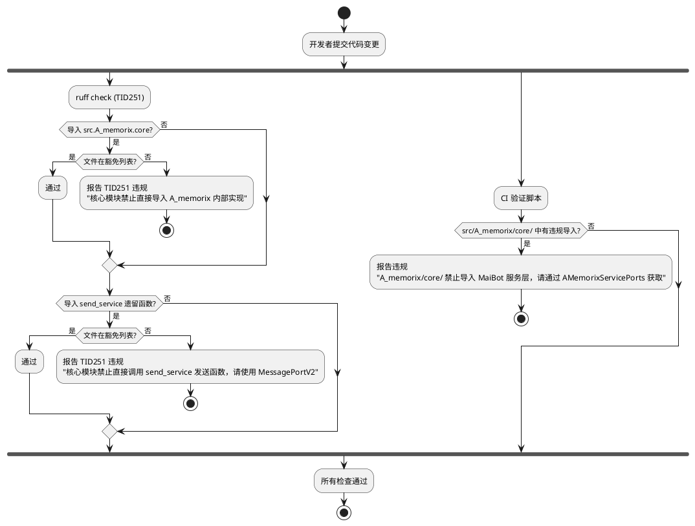
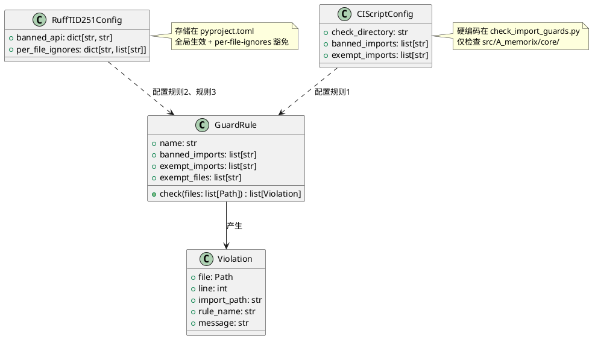

# 一、需求与存量功能关系分析

## 1.1 需求功能与存量功能对比

### 1.1.1 已实现功能

| 需求功能 | 存量功能 | 代码位置 | 匹配度 |
|---------|---------|---------|--------|
| A_memorix/core/ 隔离（运行时已达成零违规） | `AMemorixServicePorts` 依赖注入容器，core/ 内部通过端口获取外部能力 | `src/A_memorix/core/ports.py` | 100% |
| 核心→A_memorix 隔离（运行时已达成零违规） | `AMemorixMemoryServicePort` 适配器 + `MemoryServicePort` Protocol | `src/core/adapters/memory_service.py`、`src/core/protocols.py:194-366` | 100% |
| 核心→send_service 隔离（运行时已达成零违规） | `SendServiceMessagePortV2` 直通实现 + `MessagePortV2` Protocol | `src/services/send_service.py:1330-1390`、`src/core/protocols.py:448-478` | 100% |
| MessagePortV2 全局注册点 | `get_message_port_v2()` / `set_message_port_v2()` | `src/core/message_port_registry.py:16-28` | 100% |
| ruff 基础配置 | `[tool.ruff.lint]` 已配置 E/F/B 规则集 | `pyproject.toml:68-82` | 75% |

**关键发现**：三个隔离规则在运行时已全部达成零违规（grep 验证通过），但缺少**静态守卫**防止未来回潮。ruff 当前未启用 TID251（banned-api）规则。

### 1.1.2 需要扩展的功能

| 需求功能 | 存量功能 | 差异说明 | 扩展方向 |
|---------|---------|---------|---------|
| ruff TID251 banned-api 规则 | ruff 已配置 E/F/B 规则集，未启用 flake8-tidy-imports | 当前 ruff 配置无导入守卫能力；需新增 `TID251` 到 select 列表并配置 `banned-api` | 在 `pyproject.toml` 中启用 TID251 规则，配置 banned-api 映射表 |
| per-file-ignores 豁免机制 | ruff 未配置任何 per-file-ignores | 适配器层、注册点、组合根需要豁免 TID251 规则 | 在 `pyproject.toml` 中配置 `[tool.ruff.lint.per-file-ignores]` |
| A_memorix/core/ 目录专属守卫 | 无 | TID251 banned-api 是全局规则，无法限定"仅在 src/A_memorix/core/ 内禁止导入 src.services"；而 src.services 被项目大量合法使用，不能全局禁止 | 新增轻量 CI 验证脚本 `scripts/check_import_guards.py`，对 A_memorix/core/ 做目录专属检查 |

### 1.1.3 需要新增的功能或接口

**ruff 配置层**：
- 在 `pyproject.toml` 的 `[tool.ruff.lint]` 中新增 `TID` 到 select 列表
- 新增 `[tool.ruff.lint.flake8-tidy-imports.banned-api]` 配置段，定义全局禁止导入列表
- 新增 `[tool.ruff.lint.per-file-ignores]` 配置段，定义豁免文件

**CI 验证脚本**：
- `scripts/check_import_guards.py`：对 TID251 无法覆盖的目录专属规则做 AST 级检查

## 1.2 存量功能详细分析

### 1.2.1 ruff 当前配置

**接口契约**：
- 配置文件：`pyproject.toml` 的 `[tool.ruff]` 和 `[tool.ruff.lint]` 段
- 已启用规则：`E`（pycodestyle 错误）、`F`（pyflakes）、`B`（flake8-bugbear）
- 已忽略规则：`E711`、`E501`
- ruff 版本：0.15.11（支持 TID251）

**约束**：
- ruff 版本 >= 0.12.2（spec 4.5.1），当前 0.15.11 满足
- TID251 `banned-api` 是**全局规则**——在 pyproject.toml 中定义的禁止导入对项目所有文件生效
- `per-file-ignores` 只能**整体豁免**某个文件/目录的某条规则，不能"仅豁免特定的 banned-api 条目"
- ruff 不支持"仅在某个目录内禁止导入 X"这种路径限定的 banned-api

### 1.2.2 TID251 banned-api 能力边界

**能做的**：
- 全局禁止导入特定模块（如 `src.A_memorix.core`）
- 全局禁止导入特定模块成员（如 `src.services.send_service.text_to_stream`）
- 通过 `per-file-ignores` 豁免特定文件/目录

**不能做的**：
- 目录限定禁止："仅在 src/A_memorix/core/ 内禁止导入 src.services"
- 精细化豁免："此文件豁免 banned-api 的规则 A，但不豁免规则 B"

### 1.2.3 三条守卫规则的适用性分析

| 规则 | 禁止目标 | 全局禁止可行性 | TID251 适用性 |
|------|---------|--------------|-------------|
| 规则1：A_memorix/core/ 隔离 | `src.services`、`src.config.config`、`src.common.database`、`src.llm_models`、`src.A_memorix.host_service` | ❌ 不可行——这些模块被项目大量合法使用，全局禁止会导致海量误报 | ❌ 不适用，需用 CI 脚本 |
| 规则2：核心→A_memorix 隔离 | `src.A_memorix.core`（内部模块） | ✅ 可行——只有适配器层和组合根需要导入，豁免文件少 | ✅ 适用 |
| 规则3：核心/maisaka→send_service 隔离 | `src.services.send_service` 的遗留发送函数 | ✅ 可行——只有注册点和 hook_catalog 需要导入，豁免文件少 | ✅ 适用 |

### 1.2.4 现有合法导入者（豁免清单）

**规则2 豁免**（导入 `src.A_memorix` 内部模块的合法文件）：

| 文件 | 导入内容 | 豁免原因 |
|------|---------|---------|
| `src/core/adapters/memory_service.py` | `from src.services.memory_service import memory_service` | 适配器层——唯一允许导入组件具体实现的地方 |
| `src/services/memory_service.py` | `from src.A_memorix.host_service import a_memorix_host_service` | 服务层——A_memorix 的公共 API 消费者 |
| `src/main.py` | `from src.A_memorix.host_service import a_memorix_host_service` | 组合根——依赖注入的组装点 |
| `src/maisaka/message_port.py` | `from src.services.send_service import SendServiceMessagePortV2`（延迟导入） | MessagePortV2 注册点 |

**规则3 豁免**（导入 `src.services.send_service` 发送函数的合法文件）：

| 文件 | 导入内容 | 豁免原因 |
|------|---------|---------|
| `src/core/message_port_registry.py` | `from src.services.send_service import SendServiceMessagePortV2`（延迟导入） | MessagePortV2 注册点 |
| `src/maisaka/message_port.py` | `from src.services.send_service import SendServiceMessagePortV2`（延迟导入） | MessagePortV2 注册点（向后兼容重导出） |
| `src/plugin_runtime/hook_catalog.py` | `from src.services.send_service import register_send_service_hook_specs`（延迟导入） | Hook 注册 |
| `src/core/adapters/*` | send_service 公共 API | 适配器层 |

**规则1 豁免**（A_memorix/core/ 允许导入的共享基础设施）：

| 模块 | 允许导入 | 豁免原因 |
|------|---------|---------|
| `src/A_memorix/core/` | `src.common.logger` | 日志基础设施 |
| `src/A_memorix/core/` | `src.common.prompt_i18n` | 国际化基础设施 |
| `src/A_memorix/core/` | `src.common.data_models` | 共享数据模型 |
| `src/A_memorix/core/` | `src.core.types` | 核心数据模型 |
| `src/A_memorix/core/` | `src.core.protocols` | 核心 Protocol 接口 |

# 二、增量设计方案

## 2.1 实现模型

### 2.1.1 上下文视图

```plantuml
@startuml
skinparam componentStyle rectangle

package "开发者" {
    [核心开发者] as dev1
    [A_memorix 维护者] as dev2
}

package "静态检查工具链" {
    [ruff TID251] as ruff_tid
    [CI 验证脚本] as ci_script
}

package "配置" {
    [pyproject.toml] as config
}

dev1 -> ruff_tid : 提交代码
dev2 -> ruff_tid : 提交代码
ruff_tid -> config : 读取 banned-api + per-file-ignores
ruff_tid --> dev1 : 全局守卫违规报告
ci_script -> config : 读取目录专属规则
ci_script --> dev2 : A_memorix/core/ 隔离违规报告

note over ruff_tid : 覆盖规则2、规则3\n（全局禁止 + 豁免）
note over ci_script : 覆盖规则1\n（目录专属检查）

@enduml
```

### 2.1.2 服务/组件总体架构

```plantuml
@startuml
skinparam componentStyle rectangle

package "pyproject.toml" {
    component [lint.select += TID] as select
    component [banned-api 配置] as banned
    component [per-file-ignores 配置] as ignores
}

package "ruff TID251 检查" {
    component [规则2: 核心→A_memorix] as rule2
    component [规则3: 核心→send_service] as rule3
}

package "CI 验证脚本" {
    component [规则1: A_memorix/core/ 隔离] as rule1
}

select --> rule2 : 启用 TID251
select --> rule3 : 启用 TID251
banned --> rule2 : 禁止导入列表
banned --> rule3 : 禁止导入列表
ignores --> rule2 : 豁免文件
ignores --> rule3 : 豁免文件

rule2 : 禁止: src.A_memorix.core\n豁免: adapters/, main.py,\nmemory_service.py
rule3 : 禁止: send_service 遗留函数\n豁免: message_port_registry,\nmessage_port.py, hook_catalog,\nadapters/
rule1 : 检查: src/A_memorix/core/\n禁止: src.services,\nsrc.config.config,\nsrc.common.database,\nsrc.llm_models,\nsrc.A_memorix.host_service\n豁免: src.common.logger,\nsrc.common.prompt_i18n,\nsrc.common.data_models,\nsrc.core.types,\nsrc.core.protocols

@enduml
```

### 2.1.3 实现设计文档

#### 守卫规则生效流程



## 2.2 接口设计

### 2.2.1 总体设计

**接口分类**：守卫规则分为两类实现机制：

| 实现机制 | 适用规则 | 检查时机 | 豁免方式 |
|---------|---------|---------|---------|
| ruff TID251 banned-api | 规则2、规则3 | `ruff check` / CI | `per-file-ignores` 或 `# noqa: TID251` |
| CI 验证脚本 | 规则1 | CI pipeline / 本地手动 | 脚本内白名单 |

**接口稳定性等级**：

| 配置项 | 稳定性 | 说明 |
|--------|--------|------|
| banned-api 映射表 | 稳定 | 与 AGENTS.md 核心禁止项对齐，变更需同步更新 |
| per-file-ignores | 稳定 | 豁免文件列表变更需代码审查 |
| CI 验证脚本规则 | 稳定 | 与 A_memorix/core/ports.py 的豁免列表对齐 |

### 2.2.2 接口清单

#### pyproject.toml — TID251 启用

在 `[tool.ruff.lint]` 的 `select` 列表中新增 `TID`：

```toml
[tool.ruff.lint]
select = [
    "E",   # pycodestyle 错误
    "F",   # pyflakes
    "B",   # flake8-bugbear
    "TID", # flake8-tidy-imports（含 TID251 banned-api）
]
```

**业务说明**：启用 flake8-tidy-imports 规则集，其中 TID251 是 banned-api 规则。其他 TID 规则（如 TID252 相对导入限制）若不需要可通过 ignore 排除。

**前置条件**：ruff >= 0.12.2（当前 0.15.11 满足）

**后置条件**：所有 Python 文件的导入语句受 TID251 检查

#### pyproject.toml — banned-api 配置

```toml
[tool.ruff.lint.flake8-tidy-imports.banned-api]
# 规则2：核心→A_memorix 隔离
# 核心模块禁止直接导入 A_memorix 内部实现，只通过 MemoryServicePort 或 host_service 公共 API 交互
"src.A_memorix.core" = "核心模块禁止直接导入 A_memorix 内部实现，请通过 MemoryServicePort Protocol 接口交互"
"src.A_memorix.core.runtime" = "核心模块禁止直接导入 A_memorix 运行时，请通过 MemoryServicePort Protocol 接口交互"
"src.A_memorix.core.runtime.sdk_memory_kernel" = "核心模块禁止直接导入 SDKMemoryKernel，请通过 MemoryServicePort Protocol 接口交互"

# 规则3：核心/maisaka→send_service 隔离
# 核心侧模块禁止绕过 MessagePortV2 直接调用 send_service 发送函数
"src.services.send_service.text_to_stream" = "核心模块禁止直接调用 send_service 发送函数，请使用 get_message_port_v2().send_message()"
"src.services.send_service.text_to_stream_with_message" = "核心模块禁止直接调用 send_service 发送函数，请使用 get_message_port_v2().send_message()"
"src.services.send_service.emoji_to_stream" = "核心模块禁止直接调用 send_service 发送函数，请使用 get_message_port_v2().send_message()"
"src.services.send_service.emoji_to_stream_with_message" = "核心模块禁止直接调用 send_service 发送函数，请使用 get_message_port_v2().send_message()"
"src.services.send_service.image_to_stream" = "核心模块禁止直接调用 send_service 发送函数，请使用 get_message_port_v2().send_message()"
"src.services.send_service.custom_to_stream" = "核心模块禁止直接调用 send_service 发送函数，请使用 get_message_port_v2().send_message()"
"src.services.send_service.custom_reply_set_to_stream" = "核心模块禁止直接调用 send_service 发送函数，请使用 get_message_port_v2().send_message()"
"src.services.send_service._send_to_target_with_message" = "核心模块禁止直接调用 send_service 内部函数，请使用 get_message_port_v2().send_message()"
```

**业务说明**：定义全局禁止导入列表。每条规则包含禁止的模块/成员路径和错误消息。错误消息必须指明替代方案。

**前置条件**：TID251 规则已启用

**后置条件**：任何文件导入上述路径时，ruff 报告 TID251 违规

**异常映射**：banned-api 匹配 `from X import Y` 和 `import X` 两种形式

#### pyproject.toml — per-file-ignores 配置

```toml
[tool.ruff.lint.per-file-ignores]
# 规则2 豁免：适配器层是唯一允许导入组件具体实现的地方
"src/core/adapters/*" = ["TID251"]
# 规则2 豁免：组合根允许导入 A_memorix 公共 API
"src/main.py" = ["TID251"]
# 规则2 豁免：memory_service 是 A_memorix 的公共 API 消费者
"src/services/memory_service.py" = ["TID251"]
# 规则3 豁免：MessagePortV2 注册点
"src/core/message_port_registry.py" = ["TID251"]
# 规则3 豁免：MessagePortV2 向后兼容重导出
"src/maisaka/message_port.py" = ["TID251"]
# 规则3 豁免：Hook 注册
"src/plugin_runtime/hook_catalog.py" = ["TID251"]
# send_service 自身不受守卫规则约束
"src/services/send_service.py" = ["TID251"]
```

**业务说明**：定义 TID251 规则的豁免文件列表。每个豁免条目必须有明确的架构原因。

**前置条件**：TID251 规则已启用

**后置条件**：豁免文件中的 TID251 违规不报错

#### CI 验证脚本 — check_import_guards.py

```python
"""A_memorix/core/ 导入守卫验证脚本。

检查 src/A_memorix/core/ 内部模块是否违规导入 MaiBot 服务层。
此规则无法用 ruff TID251 实现（TID251 是全局规则，src.services 被项目大量合法使用）。
"""
```

**接口签名**：
- 入参：无（硬编码检查路径和规则）
- 出参：退出码 0（通过）或 1（违规），违规详情输出到 stdout
- 检查目录：`src/A_memorix/core/`
- 禁止导入列表：`src.services`、`src.config.config`、`src.common.database`、`src.llm_models`、`src.A_memorix.host_service`
- 豁免导入列表：`src.common.logger`、`src.common.prompt_i18n`、`src.common.data_models`、`src.core.types`、`src.core.protocols`

**业务说明**：使用 Python `ast` 模块解析源文件，检查 import 语句是否违反 A_memorix/core/ 隔离规则。

**前置条件**：Python 3.12+

**后置条件**：违规导入被报告，脚本以非零退出码退出

**调用示例**：
```bash
python scripts/check_import_guards.py
# 或在 CI 中：
python scripts/check_import_guards.py || exit 1
```

## 2.3 数据模型

### 2.3.1 设计目标

1. **防止架构违规回潮**：将 AGENTS.md 核心禁止项从"文档约定"升级为"CI 强制"
2. **最小化误报**：豁免机制必须精确，合法导入不被拦截
3. **与现有架构对齐**：守卫规则精确匹配 AGENTS.md 核心禁止项，不过度扩展

### 2.3.2 模型实现



**对象创建策略**：
- `RuffTID251Config` 由 pyproject.toml 定义，ruff 启动时自动加载
- `CIScriptConfig` 硬编码在 `check_import_guards.py` 中，与 `AMemorixServicePorts` 的设计意图对齐

**持久化策略**：
- 所有配置通过版本控制追踪（pyproject.toml + check_import_guards.py）
- 无运行时状态，无需持久化