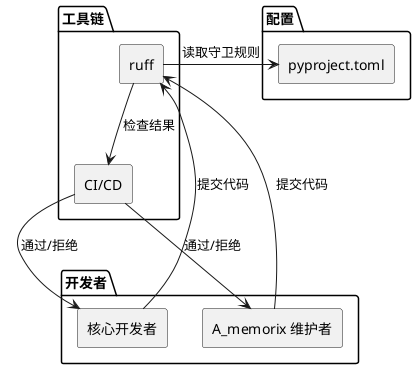
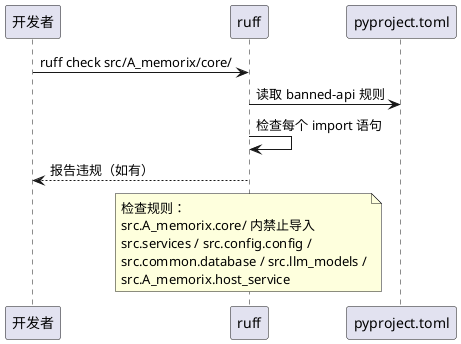
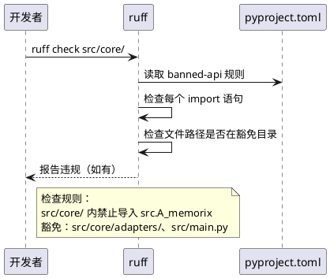
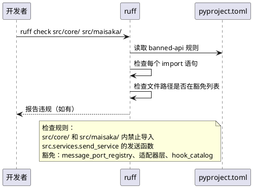
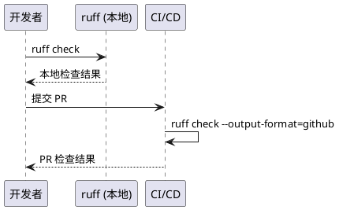

# **1. 组件定位**

## **1.1 核心职责**

本组件负责在 ruff/pyproject.toml 中配置导入守卫规则，将 MaiBot 微内核架构的模块间依赖约束从"文档约定"升级为"CI 强制"，防止架构违规导入的回潮。

## **1.2 核心输入**

1. **开发者提交的代码变更**：包含新增或修改的 import 语句
2. **ruff 配置文件**（pyproject.toml）：定义守卫规则的配置入口
3. **架构约束定义**：来自 AGENTS.md 核心禁止项和 SDKMemoryKernel 隔离规范

## **1.3 核心输出**

1. **CI 检查结果**：违规导入被自动拦截，PR 无法合并
2. **本地开发反馈**：`ruff check` 命令即时报告违规
3. **违规报告**：包含文件路径、行号、违规导入目标和违反的规则名称

## **1.4 职责边界**

1. 本组件不负责修复已有的违规导入（存量违规由人工修复）
2. 本组件不负责定义架构约束本身（约束来自 AGENTS.md 和架构设计）
3. 本组件不负责运行时依赖注入的正确性（那是 AMemorixServicePorts 的职责）
4. 本组件不负责动态导入（importlib）的检测（由代码审查覆盖，见 5.4.1 规则3）

# **2. 领域术语**

**导入守卫**
: 在静态分析工具中配置的规则，用于自动检测和拦截不符合架构约束的模块间导入。

**违规导入**
: 违反微内核架构模块间依赖约束的 import 语句，包括直接导入和延迟导入（函数体内 import）。

**banned-imports 规则**
: ruff 或同类工具中配置的禁止导入规则，指定哪些模块禁止从哪些其他模块导入。

**架构边界**
: 模块间的依赖方向约束。在微内核架构中，核心模块只依赖 Protocol 接口，不依赖组件具体实现。

**白名单**
: 允许的例外导入列表，用于豁免基础设施层等合法的跨模块导入。

**组合根**
: 依赖注入的组装点（如 main.py、host_service），是唯一允许跨架构边界导入具体实现的地方。

# **3. 角色与边界**

## **3.1 核心角色**

- **MaiBot 核心开发者**：提交代码变更，需要遵守导入守卫规则
- **A_memorix 维护者**：在 A_memorix/core/ 内部开发，需要遵守隔离约束

## **3.2 外部系统**

- **ruff**：Python 静态分析工具，执行导入守卫规则检查
- **CI/CD（GitHub Actions）**：在 PR 检查中运行 ruff，拦截违规导入
- **pre-commit**：可选的本地预提交检查，在提交前拦截违规导入

## **3.3 交互上下文**

# **4. DFX约束**

## **4.1 性能**

1. ruff 守卫规则的检查延迟不得超过 ruff 总检查时间的 10%
2. CI 中 ruff 检查不得因守卫规则而显著变慢（增量不超过 5 秒）

## **4.2 可靠性**

1. 守卫规则必须覆盖所有已知的违规导入模式（直接导入和延迟导入）
2. 守卫规则不得产生误报（合法导入被错误拦截），白名单机制必须可用
3. 规则配置变更必须通过版本控制追踪

## **4.3 安全性**

1. 守卫规则配置文件（pyproject.toml）的修改应纳入代码审查
2. 白名单条目必须有明确的注释说明豁免原因

## **4.4 可维护性**

1. 新增架构约束时，应能在 pyproject.toml 中添加对应的守卫规则，无需修改 ruff 插件代码
2. 守卫规则的错误消息必须清晰，指明违规的导入路径和违反的架构约束
3. 规则配置应与 AGENTS.md 中的核心禁止项保持同步

## **4.5 兼容性**

1. 守卫规则必须兼容 ruff >= 0.12.2（项目当前版本）
2. 守卫规则不得影响 ruff 的其他现有检查规则
3. 守卫规则不得要求修改现有合法代码（除非代码本身存在违规）

# **5. 核心能力**

## **5.1 A_memorix/core/ 隔离守卫**

防止 `src/A_memorix/core/` 内部模块对 MaiBot 服务层的违规导入，确保 A_memorix 核心只通过 AMemorixServicePorts 获取外部能力。

### **5.1.1 业务规则**

1. **服务层隔离规则**：`src/A_memorix/core/` 内部模块禁止导入 `src.services`（包括 `from src.services import ...` 和 `from src.services.xxx import ...`）
   a. 验收条件：[在 `src/A_memorix/core/` 中新增 `from src.services import llm_service`] → [ruff check 报告 TID251 违规]

2. **配置层隔离规则**：`src/A_memorix/core/` 内部模块禁止导入 `src.config.config`（包括 `from src.config.config import global_config`）
   a. 验收条件：[在 `src/A_memorix/core/` 中新增 `from src.config.config import global_config`] → [ruff check 报告违规]

3. **数据库层隔离规则**：`src/A_memorix/core/` 内部模块禁止导入 `src.common.database`
   a. 验收条件：[在 `src/A_memorix/core/` 中新增 `from src.common.database import get_db_session`] → [ruff check 报告违规]

4. **LLM 模型层隔离规则**：`src/A_memorix/core/` 内部模块禁止导入 `src.llm_models`
   a. 验收条件：[在 `src/A_memorix/core/` 中新增 `from src.llm_models import ...`] → [ruff check 报告违规]

5. **host_service 隔离规则**：`src/A_memorix/core/` 内部模块禁止导入 `src.A_memorix.host_service`
   a. 验收条件：[在 `src/A_memorix/core/` 中新增 `from src.A_memorix.host_service import ...`] → [ruff check 报告违规]

6. **共享基础设施豁免**：以下导入不在守卫范围内，`src/A_memorix/core/` 允许导入：
   - `src.common.logger`（日志基础设施）
   - `src.common.prompt_i18n`（国际化基础设施）
   - `src.common.data_models`（共享数据模型，包括 MessageSequence 等）
   - `src.core.types`（核心数据模型，如 SendMessageResult、MemorySearchResult 等）
   - `src.core.protocols`（核心 Protocol 接口，如 MemoryServicePort 等）
   a. 验收条件：[在 `src/A_memorix/core/` 中新增 `from src.common.logger import get_logger`] → [ruff check 不报告违规]

7. **禁止项**：不得通过字符串拼接、importlib 等动态方式绕过静态检查
   a. 验收条件：[A_memorix/core/ 中使用 importlib 动态导入 MaiBot 服务] → [代码审查拒绝]

### **5.1.2 交互流程**

### **5.1.3 异常场景**

1. **合法导入被误报**
   a. 触发条件：新增的共享基础设施模块被守卫规则误判为违规
   b. 系统行为：通过白名单或 per-file-ignores 豁免
   c. 用户感知：开发者添加 `# noqa: TID251` 注释或在配置中添加豁免

2. **host_service 自身导入**
   a. 触发条件：`src/A_memorix/host_service.py` 需要导入 `src.services`（它是组合根代理）
   b. 系统行为：host_service 不在 `src/A_memorix/core/` 目录内，不受此规则约束
   c. 用户感知：host_service 正常导入，不报违规

## **5.2 核心→A_memorix 隔离守卫**

防止 `src/core/` 内部模块对 A_memorix 内部实现的违规导入，确保核心只通过 MemoryServicePort 或 host_service 公共 API 交互。

### **5.2.1 业务规则**

1. **A_memorix 内部模块隔离规则**：`src/core/` 内部模块禁止导入 `src.A_memorix` 内部模块（包括 `from src.A_memorix.core import ...`、`from src.A_memorix.host_service import ...` 等）
   a. 验收条件：[在 `src/core/` 中新增 `from src.A_memorix.core.runtime.sdk_memory_kernel import SDKMemoryKernel`] → [ruff check 报告违规]

2. **适配器层豁免**：`src/core/adapters/` 目录下的文件豁免此规则，因为适配器层是唯一允许导入组件具体实现的地方
   a. 验收条件：[在 `src/core/adapters/memory_service.py` 中导入 `from src.A_memorix.host_service import ...`] → [ruff check 不报告违规]

3. **组合根豁免**：`src/main.py` 作为组合根，允许导入 A_memorix 的公共 API（如 `a_memorix_host_service`）
   a. 验收条件：[在 `src/main.py` 中导入 `from src.A_memorix.host_service import a_memorix_host_service`] → [ruff check 不报告违规]

4. **禁止项**：核心模块不得通过延迟导入（函数体内 import）绕过守卫规则
   a. 验收条件：[在 `src/core/orchestrator.py` 中新增 `from src.A_memorix.core import ...`（函数体内）] → [ruff check 报告违规]

### **5.2.2 交互流程**

### **5.2.3 异常场景**

1. **适配器层新文件未豁免**
   a. 触发条件：在 `src/core/adapters/` 下新增适配器文件，导入 A_memorix 具体类被误报
   b. 系统行为：适配器层目录整体豁免，新文件自动豁免
   c. 用户感知：新文件正常导入，不报违规

2. **MemoryServicePort 适配器延迟导入**
   a. 触发条件：`src/core/adapters/memory_service.py` 使用延迟导入 `from src.services.memory_service import memory_service`
   b. 系统行为：适配器层豁免，不报违规
   c. 用户感知：适配器正常工作

## **5.3 核心→send_service 隔离守卫**

防止 `src/core/` 和 `src/maisaka/` 内部模块绕过 MessagePortV2 直接导入 send_service，确保所有出站消息通过统一接口发送。

### **5.3.1 业务规则**

1. **send_service 隔离规则**：`src/core/` 和 `src/maisaka/` 内部模块禁止导入 `src.services.send_service` 的内部函数（如 `_send_to_target_with_message`、`text_to_stream`、`emoji_to_stream`、`image_to_stream`、`custom_to_stream`、`custom_reply_set_to_stream`）
   a. 验收条件：[在 `src/core/orchestrator.py` 中新增 `from src.services.send_service import text_to_stream`] → [ruff check 报告违规]

2. **MessagePortV2 注册点豁免**：`src/core/message_port_registry.py` 和 `src/maisaka/message_port.py` 允许导入 `SendServiceMessagePortV2`（这是注册点的职责）
   a. 验收条件：[在 `src/core/message_port_registry.py` 中导入 `from src.services.send_service import SendServiceMessagePortV2`] → [ruff check 不报告违规]

3. **适配器层豁免**：`src/core/adapters/` 目录下的文件允许导入 send_service 的公共 API
   a. 验收条件：[在 `src/core/adapters/message_port_v2.py` 中导入 send_service] → [ruff check 不报告违规]

4. **Hook 注册豁免**：`src/plugin_runtime/hook_catalog.py` 允许导入 `register_send_service_hook_specs`（这是 Hook 注册的职责）
   a. 验收条件：[在 `src/plugin_runtime/hook_catalog.py` 中导入 `from src.services.send_service import register_send_service_hook_specs`] → [ruff check 不报告违规]

5. **禁止项**：核心模块和内置工具不得直接调用 send_service 的发送函数，必须通过 `get_message_port_v2()` 获取 MessagePortV2 实例
   a. 验收条件：[在 `src/maisaka/builtin_tool/reply.py` 中新增 `from src.services.send_service import _send_to_target_with_message`] → [ruff check 报告违规]

### **5.3.2 交互流程**

### **5.3.3 异常场景**

1. **新增 MessagePortV2 注册点文件**
   a. 触发条件：新增注册点文件需要导入 SendServiceMessagePortV2
   b. 系统行为：需在白名单中添加新文件路径
   c. 用户感知：开发者更新 pyproject.toml 中的豁免列表

2. **send_service 内部调用**
   a. 触发条件：send_service.py 内部的函数互相调用
   b. 系统行为：send_service.py 自身不在检查范围内
   c. 用户感知：send_service 内部正常工作

## **5.4 守卫规则配置与验证**

确保守卫规则正确配置，且能被 CI 和本地开发环境使用。

### **5.4.1 业务规则**

1. **配置位置规则**：守卫规则必须配置在 `pyproject.toml` 的 `[tool.ruff.lint]` 相关段落中，与现有 ruff 配置保持一致
   a. 验收条件：[pyproject.toml 中存在 banned-api 或等效配置段落] → [配置可被 ruff 读取]

2. **CI 集成规则**：守卫规则必须在 GitHub Actions 的 ruff PR 检查中生效
   a. 验收条件：[PR 中新增违规导入] → [GitHub Actions ruff check 步骤失败]

3. **本地验证规则**：开发者可通过 `ruff check` 命令在本地验证
   a. 验收条件：[本地运行 `ruff check src/A_memorix/core/`] → [违规导入被报告]

4. **规则覆盖验证**：守卫规则配置完成后，必须验证能拦截所有已知违规模式
   a. 验收条件：[在 `src/A_memorix/core/` 中临时添加 `from src.services import llm_service` 并运行 `ruff check`] → [报告违规]
   a. 验收条件：[移除临时添加的违规导入后运行 `ruff check`] → [无违规报告]

5. **禁止项**：守卫规则不得阻止合法的适配器层和组合根导入
   a. 验收条件：[在 `src/core/adapters/memory_service.py` 中保留现有导入] → [ruff check 不报告违规]

### **5.4.2 交互流程**

### **5.4.3 异常场景**

1. **ruff 版本不支持所需规则**
   a. 触发条件：项目使用的 ruff 版本不支持 `flake8-tidy-imports` 或 `banned-api`
   b. 系统行为：升级 ruff 版本或使用替代方案（如自定义脚本）
   c. 用户感知：pyproject.toml 配置可能需要调整

2. **规则配置语法错误**
   a. 触发条件：pyproject.toml 中的守卫规则配置格式不正确
   b. 系统行为：ruff 启动时报配置错误
   c. 用户感知：`ruff check` 命令失败，提示配置错误

# **6. 数据约束**

## **6.1 守卫规则配置**

1. **规则标识**：使用 ruff 的 `TID251` 规则代码（flake8-tidy-imports banned-api）
2. **违规导入目标列表**：

   | 受限目录 | 禁止导入 | 豁免导入 |
   |---------|---------|---------|
   | `src/A_memorix/core/` | `src.services`、`src.config.config`、`src.common.database`、`src.llm_models`、`src.A_memorix.host_service` | `src.common.logger`、`src.common.prompt_i18n`、`src.common.data_models`、`src.core.types`、`src.core.protocols` |
   | `src/core/` | `src.A_memorix`（内部模块） | `src/core/adapters/` 目录、`src/main.py` |
   | `src/core/`、`src/maisaka/` | `src.services.send_service`（发送函数） | `src/core/message_port_registry.py`、`src/maisaka/message_port.py`、`src/core/adapters/`、`src/plugin_runtime/hook_catalog.py` |

3. **错误消息格式**：必须包含违规的导入路径和违反的架构约束描述
4. **白名单格式**：每个白名单条目必须附带注释说明豁免原因