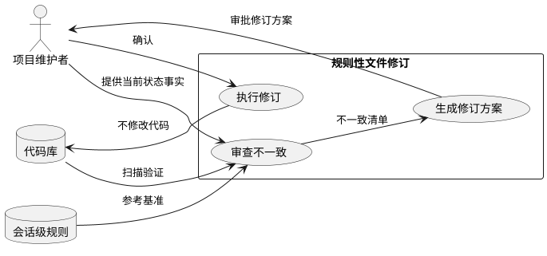
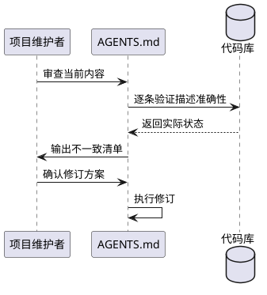
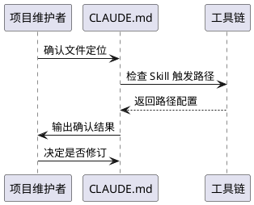
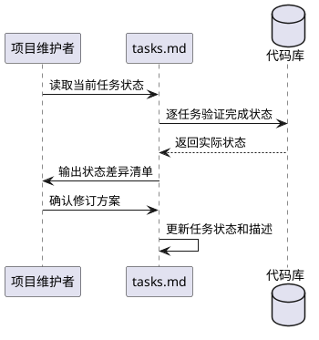
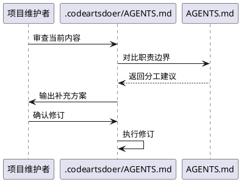
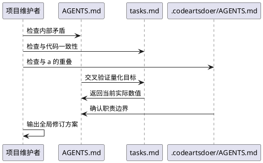

# 规则性文件修订 — 需求规格

# **1. 组件定位**

## **1.1 核心职责**

本组件负责审查和修订项目中的规则性文件，使其与当前代码实际状态保持一致，消除阻碍发展的过时约束和矛盾条目。

## **1.2 核心输入**

1. 四个规则性文件的当前内容：
   - `AGENTS.md`（项目级 Agent 规则）
   - `CLAUDE.md`（全局/项目级 Agent 规则）
   - `.codeartsdoer/specs/core_revolution/tasks.md`（核心革命任务文档）
   - `.codeartsdoer/AGENTS.md`（CodeArts Agent 规则）
2. 当前代码实际状态的关键事实（已通过代码扫描验证）
3. 会话级规则（session-rules）中的架构原则和约束

## **1.3 核心输出**

1. 各规则性文件的具体修订内容（逐条列出原文、问题、修订方向）
2. 修订优先级排序（P0 阻塞性 / P1 高 / P2 中 / P3 低）
3. 修订后的规则性文件（交付物）

## **1.4 职责边界**

本组件**不负责**：
- 修改任何代码文件
- 修改 `src/A_memorix/MODIFICATION_POLICY.md`（不在本次修订范围内）
- 修改会话级规则（session-rules，由用户手动维护）
- 生成 design.md 或 tasks.md

---

# **2. 领域术语**

**规则性文件**
: 指导 AI Agent 行为的 markdown 配置文件，包括项目级 AGENTS.md、全局 CLAUDE.md、CodeArts AGENTS.md、以及 spec 目录下的任务文档。

**代码实际状态**
: 通过代码扫描工具（grep/glob/行数统计）验证的代码库当前状态，与规则性文件中的描述可能存在偏差。

**架构债务**
: 代码中违反核心架构原则的技术负债，规则性文件中记录了其预期消除状态。

**核心隔离**
: 核心模块（智能体 + 消息管道）不依赖组件具体实现，只通过 Protocol 接口交互的架构约束。

**SDKMemoryKernel 革命**
: 将 SDKMemoryKernel 从 God Class 拆分为独立服务和管理器的重构计划，记录在 core_revolution/tasks.md 中。

---

# **3. 角色与边界**

## **3.1 核心角色**

- **项目维护者**：审查修订方案，确认修订内容的正确性和优先级
- **AI Agent**：根据修订后的规则性文件执行编码任务

## **3.2 外部系统**

- **代码库**：提供实际状态数据，验证规则性文件描述的准确性
- **会话级规则**：作为规则性文件修订的参考基准，但不直接修改

## **3.3 交互上下文**

---

# **4. DFX约束**

## **4.1 性能**

- 修订后的规则性文件不应增加 AI Agent 的解析负担，总行数应减少或持平

## **4.2 可靠性**

- 修订后的规则性文件描述必须与代码实际状态一致，每条声明可通过代码扫描验证
- 修订不得引入新的矛盾条目

## **4.3 安全性**

- 修订不得删除关键的安全约束（如核心禁止项、配置文件修改规范）
- 修订不得削弱核心隔离原则

## **4.4 可维护性**

- 规则性文件应建立定期审查机制，避免再次与代码状态脱节
- tasks.md 中的任务状态应及时更新，避免误导后续开发

## **4.5 兼容性**

- 修订后的规则性文件应与现有 AI Agent 工具链兼容
- 目录路径引用应与实际目录结构一致

---

# **5. 核心能力**

## **5.1 AGENTS.md（项目级）— 不一致审查与修订**

### **5.1.1 业务规则**

1. **会话 ID 规范与核心隔离原则矛盾**：当前条目"业务模块不应自行调用 `SessionUtils.calculate_session_id`...应通过 `chat_manager` 的内部接口"要求核心模块导入 chat_manager，违反核心隔离原则（核心禁止项第1条：禁止核心直接导入 chat_manager）
   a. 验收条件：[阅读会话 ID 规范] → [不再出现"通过 chat_manager 的内部接口"的表述，改为"通过 SessionRepository Protocol 接口查询"]

2. **智能体自主性架构原则不完整**：当前仅包含3条原则（决策权、通知消息处理、规则引擎优先），缺少会话级规则中已确立的关键原则
   a. 验收条件：[阅读 AGENTS.md 智能体自主性架构原则] → [包含组件兼容核心原则、核心禁止项、核心进化方向、内心状态三层等已确立原则]

3. **缺少已完成架构的规则说明**：内心世界系统（InnerWorld）、管家系统集成、Agent-owns-Thinking、并行思考等已完成架构在 AGENTS.md 中无任何体现
   a. 验收条件：[阅读 AGENTS.md] → [包含内心世界系统、管家系统、Agent-owns-Thinking 的规则说明和约束]

4. **A_memorix 修改规则缺少当前进展上下文**：当前条目仅说"修改约束仅来自核心隔离和 Protocol 接口契约"，未反映 SDKMemoryKernel 重构的实际进展（services/ 和 admin/ 已提取、_KernelRuntimeFacade 已删除、host_service 直接访问服务等）
   a. 验收条件：[阅读 A_memorix 修改规则] → [包含 SDKMemoryKernel 重构进展说明和当前约束边界]

5. **or "" 兜底规范执行状态不明确**：变量规范中禁止 `or ""` 兜底，但当前 SDKMemoryKernel 仍有 87 处 `or ""`，规则缺少执行优先级和豁免条件
   a. 验收条件：[阅读变量规范] → [明确 or "" 的消除优先级和合理豁免场景（如外部数据源返回值可能为 None）]

6. **getattr 规范缺少量化目标**：类属性使用规范要求减少 getattr，但未给出当前状态和目标值
   a. 验收条件：[阅读类属性使用规范] → [包含当前 getattr 数量（8处）和目标（≤5处），以及保留场景的判定标准]

7. **debug规范与会话 ID 规范自相矛盾**：debug规范要求"不要总是考虑 fallback"，但会话 ID 规范中"如果解析不到真实 ChatSession.session_id，不要把自行计算的 fallback hash 写入数据库"本身就是一种 fallback 策略
   a. 验收条件：[阅读两个规范] → [消除矛盾表述，明确"不兜底"与"不写入脏数据"的区别]

8. **缺少架构债务追踪规则**：当前 AGENTS.md 无架构债务的记录和追踪机制，导致规则性文件与代码状态脱节
   a. 验收条件：[阅读 AGENTS.md] → [包含架构债务追踪规则，要求重大架构变更后同步更新规则性文件]

### **5.1.2 交互流程**

### **5.1.3 异常场景**

1. **规则性文件描述与代码状态无法一一对应**
   a. 触发条件：规则性文件中的描述过于抽象，无法通过代码扫描直接验证
   b. 系统行为：标记为"需人工确认"，提供代码扫描结果作为参考
   c. 用户感知：修订方案中标注"需人工确认"的条目

2. **修订可能影响现有 AI Agent 行为**
   a. 触发条件：修订删除或修改了 AI Agent 依赖的规则条目
   b. 系统行为：在修订方案中标注影响范围和迁移建议
   c. 用户感知：修订方案中标注"行为变更"的条目

---

## **5.2 CLAUDE.md（全局/项目级）— 不一致审查与修订**

### **5.2.1 业务规则**

1. **项目级 CLAUDE.md 仅为指针**：当前 `CLAUDE.md` 内容仅为 "AGENTS.md"，未提供任何独立规则。这不是问题，但应确认是否有意为之
   a. 验收条件：[阅读 CLAUDE.md] → [明确 CLAUDE.md 的定位：是独立规则文件还是 AGENTS.md 的指针]

2. **全局 CLAUDE.md 不存在**：用户提及的 `E:\Users\lmq\.claude\CLAUDE.md` 不存在，系统提示中的 CLAUDE.md 内容（行为准则 + Skill Auto-Trigger Rules）由工具链注入，非项目维护
   a. 验收条件：[确认全局 CLAUDE.md 的维护责任] → [明确哪些内容由项目维护，哪些由工具链维护]

3. **Skill Auto-Trigger Rules 路径不一致**：系统提示中的 Skill Auto-Trigger Rules 引用 `.codemate/specs/` 目录，但实际目录为 `.codeartsdoer/specs/`
   a. 验收条件：[检查 Skill 触发路径] → [路径与实际目录结构一致]

### **5.2.2 交互流程**

### **5.2.3 异常场景**

1. **全局 CLAUDE.md 由工具链管理**
   a. 触发条件：项目无法直接修改全局 CLAUDE.md
   b. 系统行为：将需要全局修改的内容记录在修订方案中，标注"需工具链层面修改"
   c. 用户感知：修订方案中标注"需工具链修改"的条目

---

## **5.3 core_revolution/tasks.md — 状态同步与修订**

### **5.3.1 业务规则**

1. **阶段 1-6 任务状态与实际不符**：tasks.md 中阶段 1-6 标记为 ✅ 已完成，但部分验收标准可能需要重新验证（如 TASK-7-01 内置工具是否完全通过 MessagePort 发送）
   a. 验收条件：[检查阶段 1-6 的验收标准] → [所有验收标准与代码实际状态一致，不一致的标注实际状态]

2. **阶段 7A 任务全部标记为未完成，但实际已完成**：`config/` 包（FeedbackConfig 等）、`admin/` 包（BaseAdminHandler）、`services/` 包均已创建
   a. 验收条件：[检查 TASK-7A-01 ~ 7A-06] → [已完成的标记为 ✅，文件名和类名与实际代码一致]

3. **阶段 7B 任务全部标记为未完成，但实际已完成**：15 个服务文件已存在于 `services/` 目录，但实际文件名与 tasks.md 描述不一致：
   - tasks.md 描述 `embedding_health.py` → 实际存在 ✅
   - tasks.md 描述 `vector_pool.py`（VectorPoolManager）→ 实际存在 ✅
   - tasks.md 描述 `paragraph_backfill.py`（ParagraphBackfillService）→ 实际不存在，可能合并到 vector_pool.py
   - tasks.md 描述 `vector_rebuild.py`（VectorRebuildService）→ 实际不存在，可能仍在 Kernel 中
   - tasks.md 描述 `memory_maintenance.py`（MemoryMaintenanceService）→ 实际存在为 `maintenance.py`
   - tasks.md 描述 `graph_operations.py`（GraphOperations）→ 实际存在为 `graph_ops.py`
   - tasks.md 描述 `background_scheduler.py` → 实际存在 ✅
   - tasks.md 描述 `feedback_correction.py` → 实际存在 ✅
   - tasks.md 描述 `fuzzy_modify.py` → 实际存在 ✅
   - 额外存在的服务：`search.py`、`ingest.py`、`delete.py`、`v5_memory.py`、`hit_filter.py`、`profile_evidence.py`、`types.py`
   a. 验收条件：[检查 TASK-7B-01 ~ 7B-10] → [已完成的标记为 ✅，文件名和类名与实际代码一致，额外服务补充记录]

4. **阶段 7C 任务全部标记为未完成，但实际已完成**：14 个 Admin Handler 文件已存在，但实际文件名与 tasks.md 描述不一致：
   - tasks.md 描述 `graph_admin.py` → 实际为 `graph.py`
   - tasks.md 描述 `source_admin.py` → 实际为 `source.py`
   - tasks.md 描述 `episode_admin.py` → 实际为 `episode.py`
   - tasks.md 描述 `profile_admin.py` → 实际为 `profile.py`
   - tasks.md 描述 `feedback_admin.py` → 实际为 `feedback.py`
   - tasks.md 描述 `runtime_admin.py` → 实际为 `runtime.py`
   - tasks.md 描述 `import_admin.py` → 实际为 `import_handler.py`
   - tasks.md 描述 `tuning_admin.py` → 实际为 `tuning.py`
   - tasks.md 描述 `v5_admin.py` → 实际为 `v5.py`
   - tasks.md 描述 `delete_admin.py` → 实际为 `delete.py`
   - tasks.md 描述 `correction_admin.py` → 实际为 `correction.py`
   - 额外存在的 Handler：`paragraph.py`（ParagraphAdminHandler）、`relation.py`（RelationAdminHandler）
   a. 验收条件：[检查 TASK-7C-01 ~ 7C-12] → [已完成的标记为 ✅，文件名和类名与实际代码一致，额外 Handler 补充记录]

5. **阶段 7D 部分任务已完成但未标记**：
   - TASK-7D-01（删除 _KernelRuntimeFacade）→ 已完成 ✅（代码中 0 匹配）
   - TASK-7D-02（消除 getattr 52 → ≤5）→ 部分完成（当前 8 处，目标 ≤5 未达成）
   - TASK-7D-03（消除 or "" 618 → ≤150）→ 已完成 ✅（当前 87 处，低于 150 目标）
   - TASK-7D-04（Kernel 公共方法改为委托）→ 部分完成（6 个公共 API 仍有 await self.initialize()，23 个代理方法仍存在）
   - TASK-7D-05（Kernel 行数 ≤ 800）→ 未完成（当前 2679 行）
   a. 验收条件：[检查 TASK-7D-01 ~ 7D-05] → [已完成的标记为 ✅，部分完成的标注实际进度和剩余目标]

6. **SDKMemoryKernel 行数描述过时**：tasks.md 描述 Kernel 为 9650 行，实际当前为 2679 行
   a. 验收条件：[检查 tasks.md 中的行数描述] → [更新为当前实际行数 2679]

7. **tasks.md 缺少已完成架构的记录**：内心世界系统、lab/memory/ 记忆范式迁移实验等已完成工作未在 tasks.md 中记录
   a. 验收条件：[检查 tasks.md] → [补充已完成架构的记录，或明确 tasks.md 的范围仅限 SDKMemoryKernel 革命]

8. **host_service.py 直接访问 kernel._feedback_correction_service**：tasks.md 中未记录这一架构变更（admin handler 改为直接访问服务），但实际代码已实现
   a. 验收条件：[检查 tasks.md] → [记录 host_service 直接访问服务的架构决策和约束]

9. **阶段 7E 验证任务需更新验收标准**：当前验收标准中的数值（如 getattr ≤5、or "" ≤150、行数 ≤800）需要根据实际进展调整
   a. 验收条件：[检查 TASK-7E-01 ~ 7E-04] → [验收标准与当前实际状态和剩余目标一致]

### **5.3.2 交互流程**

### **5.3.3 异常场景**

1. **实际实现与计划方案差异较大**
   a. 触发条件：实际代码的文件名、类名、方法签名与 tasks.md 描述显著不同
   b. 系统行为：在修订方案中详细列出差异，建议以实际代码为准更新 tasks.md
   c. 用户感知：修订方案中标注"方案偏差"的条目

2. **部分任务目标已不适用**
   a. 触发条件：tasks.md 中的目标（如 Kernel ≤800 行）与实际可行目标差距过大
   b. 系统行为：在修订方案中提出调整建议，说明原因
   c. 用户感知：修订方案中标注"目标调整"的条目

---

## **5.4 .codeartsdoer/AGENTS.md — 内容补充**

### **5.4.1 业务规则**

1. **工程上下文过于简略**：当前仅包含 `Language Context: ["Python"]`，缺少项目特定的工程上下文（如核心架构原则、代码风格约束、技术栈信息）
   a. 验收条件：[阅读 .codeartsdoer/AGENTS.md] → [包含核心架构约束、代码风格关键规则、技术栈信息]

2. **缺少与项目 AGENTS.md 的关联说明**：两个 AGENTS.md 的职责边界不清晰
   a. 验收条件：[阅读 .codeartsdoer/AGENTS.md] → [明确本文件与项目 AGENTS.md 的职责分工]

### **5.4.2 交互流程**

### **5.4.3 异常场景**

1. **两个 AGENTS.md 内容重叠**
   a. 触发条件：补充内容与项目 AGENTS.md 重复
   b. 系统行为：.codeartsdoer/AGENTS.md 仅保留 CodeArts 工具链特定的上下文，通用规则引用项目 AGENTS.md
   c. 用户感知：修订后两个文件无内容重叠

---

## **5.5 跨文件一致性 — 全局矛盾消除**

### **5.5.1 业务规则**

1. **会话 ID 规范与核心隔离原则矛盾**（AGENTS.md 内部）：会话 ID 规范要求"通过 chat_manager 的内部接口"，核心禁止项禁止"核心直接导入 chat_manager"
   a. 验收条件：[阅读修订后的 AGENTS.md] → [会话 ID 规范与核心隔离原则无矛盾，统一为"通过 SessionRepository Protocol 接口"]

2. **tasks.md 中 SDKMemoryKernel 行数描述与实际不符**：tasks.md 描述 9650 行，实际 2679 行
   a. 验收条件：[阅读修订后的 tasks.md] → [行数描述与代码实际一致]

3. **AGENTS.md 缺少会话级规则中已确立的架构原则**：会话级规则包含5条智能体自主性架构原则、7条核心禁止项、架构变革路线等，AGENTS.md 仅包含3条
   a. 验收条件：[阅读修订后的 AGENTS.md] → [包含会话级规则中所有已确立的架构原则]

4. **or "" / getattr 量化目标在 AGENTS.md 和 tasks.md 中不一致**：AGENTS.md 无量化目标，tasks.md 有具体目标（getattr ≤5、or "" ≤150）
   a. 验收条件：[阅读修订后的两个文件] → [量化目标一致，AGENTS.md 引用 tasks.md 的具体目标]

### **5.5.2 交互流程**

### **5.5.3 异常场景**

1. **修订一个文件可能影响另一个文件的规则**
   a. 触发条件：跨文件规则存在依赖关系
   b. 系统行为：在修订方案中标注跨文件影响，建议同步修订
   c. 用户感知：修订方案中标注"跨文件同步"的条目

---

# **6. 数据约束**

## **6.1 代码实际状态快照**

以下数据通过代码扫描验证，作为规则性文件修订的基准：

1. **SDKMemoryKernel 行数**：2679 行（tasks.md 描述 9650 行，严重过时）
2. **getattr 数量**：8 处（tasks.md 目标 ≤5，AGENTS.md 无目标）
3. **or "" 数量**：87 处（tasks.md 目标 ≤150，已达标）
4. **_KernelRuntimeFacade**：已删除（0 匹配）
5. **enqueue_proactive_task 在 orchestrator 中**：已删除（0 匹配）
6. **chat_manager 导入在 A_memorix 中**：已删除（0 匹配）
7. **await self.initialize() 在公共 API 中**：9 处（6 个公共方法）
8. **services/ 目录文件数**：15 个（含 __init__.py）
9. **admin/ 目录文件数**：15 个（含 __init__.py）
10. **内心世界系统**：已实现（inner_world.py, InnerWorld, InnerWorldSnapshot）
11. **lab/memory/ 实验文件数**：12 个

## **6.2 规则性文件修订优先级**

1. **P0 阻塞性**（阻碍当前开发）：
   - tasks.md 阶段 7A-7C 任务状态与实际严重不符，误导后续开发
   - AGENTS.md 会话 ID 规范与核心隔离原则矛盾，导致 AI Agent 行为冲突

2. **P1 高**（影响开发效率）：
   - AGENTS.md 缺少已完成架构的规则说明，AI Agent 无法正确理解当前架构
   - tasks.md SDKMemoryKernel 行数描述严重过时
   - AGENTS.md 智能体自主性架构原则不完整

3. **P2 中**（影响长期维护）：
   - AGENTS.md or "" / getattr 规范缺少量化目标
   - .codeartsdoer/AGENTS.md 工程上下文过于简略
   - tasks.md 阶段 7D-7E 验收标准需更新

4. **P3 低**（改善体验）：
   - CLAUDE.md 定位确认
   - Skill Auto-Trigger Rules 路径不一致
   - debug规范与会话 ID 规范的表述优化

## **6.3 修订约束**

1. **不删除安全相关规则**：核心禁止项、配置文件修改规范、A_memorix 修改约束等安全规则不得削弱
2. **不引入新的矛盾**：修订后的规则性文件内部和跨文件之间不得存在矛盾
3. **以代码实际状态为准**：当规则性文件描述与代码实际状态不一致时，以代码实际状态为准修订规则性文件
4. **保持向后兼容**：修订不得改变 AI Agent 已依赖的关键行为规则，除非明确标注为行为变更