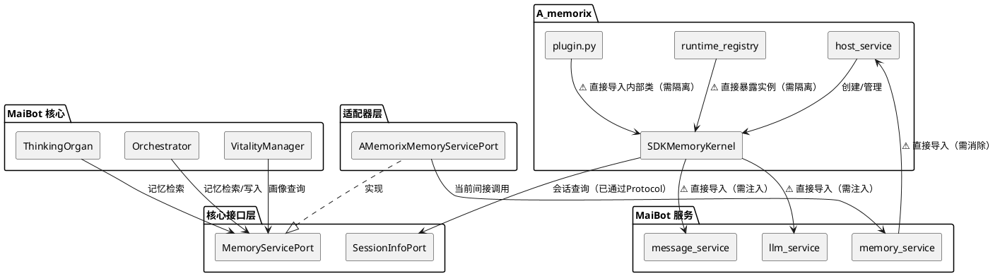
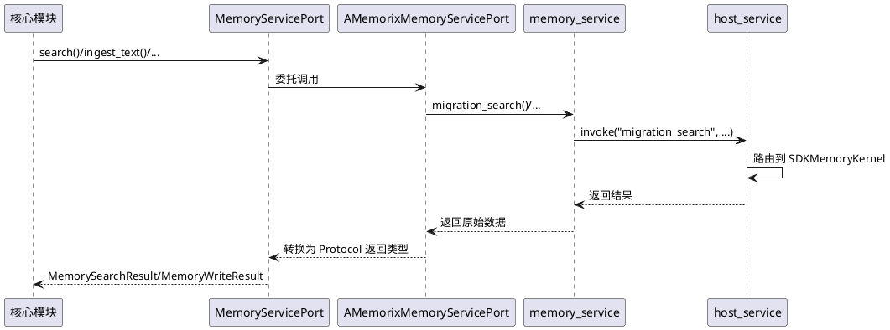
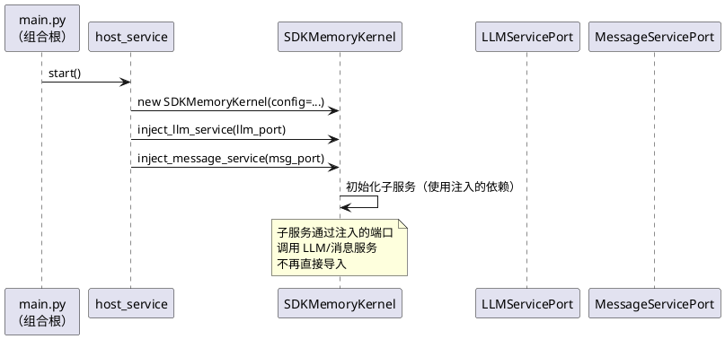
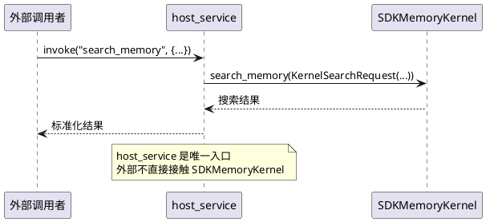
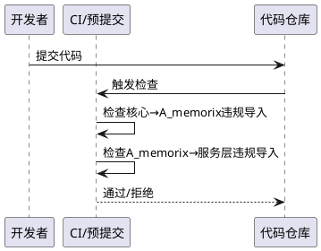

# **1. 组件定位**

## **1.1 核心职责**

本组件负责消除 MaiBot 核心模块与 A_memorix 内部实现之间的直接依赖，实现 SDKMemoryKernel 的完全隔离，使核心只通过 Protocol 接口与记忆子系统交互。

## **1.2 核心输入**

1. MaiBot 核心模块对记忆服务的调用请求（通过 MemoryServicePort Protocol）
2. A_memorix 内部对会话信息的查询请求（通过 SessionInfoPort Protocol）
3. A_memorix 内部对 LLM 服务的调用请求（当前直接导入，需改为注入）
4. A_memorix 内部对消息服务的调用请求（当前直接导入，需改为注入）
5. A_memorix 内部对全局配置的读取请求（当前直接导入，需改为注入）

## **1.3 核心输出**

1. 核心模块通过 MemoryServicePort 获得的记忆检索/写入/画像结果
2. A_memorix 通过 SessionInfoPort 获得的会话信息快照
3. A_memorix 通过注入接口获得的 LLM 调用能力
4. A_memorix 通过注入接口获得的消息服务能力
5. A_memorix 通过注入接口获得的配置读取能力

## **1.4 职责边界**

1. 本组件不负责 A_memorix 内部架构重构（如分类学到连接主义的范式迁移）
2. 本组件不负责 MemoryServicePort 接口扩展（如新增管理类 API）
3. 本组件不负责 A_memorix 与 MaiBot 的物理拆分（两者仍为一体仓库）
4. 本组件不负责 A_memorix 内部模块间的依赖优化
5. 本组件不负责 `src/common/` 共享工具的隔离（logger、prompt_i18n 等属于基础设施层，允许 A_memorix 直接使用）

# **2. 领域术语**

**SDKMemoryKernel**
: A_memorix 的核心运行时类，管理向量存储、图谱存储、元数据存储、嵌入管理器等所有记忆子系统资源，当前 814 行。

**host_service**
: A_memorix 对外的门面服务（AMemorixHostService），通过 invoke() 方法提供统一的命令式 API，是 MaiBot 与 A_memorix 交互的唯一合法入口。

**MemoryServicePort**
: 核心定义的记忆服务 Protocol 接口，包含 search、get_person_profile、ingest_text、maintain_memory 等方法，AMemorixMemoryServicePort 是其适配器实现。

**SessionInfoPort**
: 核心定义的会话信息查询 Protocol 接口，供 A_memorix 反向查询会话信息，替代直接导入 chat_manager。

**runtime_registry**
: A_memorix 内部的运行时注册表，当前直接暴露 SDKMemoryKernel 实例给外部消费者。

**延迟导入**
: 在函数体内部使用 `from xxx import yyy` 的导入方式，用于避免循环依赖，但仍然建立了模块间的直接依赖关系。

**适配器层**
: `src/core/adapters/` 目录，是唯一允许导入组件具体类的地方，负责将组件实现适配为核心 Protocol 接口。

**核心禁止项第6条**
: "禁止核心导入 A_memorix 内部模块 — 只通过 MemoryServicePort 或 host_service 公共 API 交互"。

# **3. 角色与边界**

## **3.1 核心角色**

- **MaiBot 核心开发者**：需要通过 Protocol 接口使用记忆服务，不应感知 A_memorix 内部实现
- **A_memorix 维护者**：需要自由修改内部实现而不影响核心模块，需要通过 Protocol 获取外部服务

## **3.2 外部系统**

- **MaiBot 核心模块（src/core/、src/maisaka/）**：通过 MemoryServicePort 访问记忆服务
- **MaiBot 服务层（src/services/）**：当前直接导入 a_memorix_host_service，需改为通过 Protocol 交互
- **MaiBot 配置系统（src/config/）**：当前被 A_memorix 内部直接导入，需改为注入
- **MaiBot LLM 服务（src/services/llm_service.py）**：当前被 A_memorix 内部直接导入，需改为注入
- **MaiBot 消息服务（src/services/message_service.py）**：当前被 A_memorix 内部直接导入，需改为注入
- **MaiBot 启动入口（src/main.py）**：负责组装和注入依赖

## **3.3 交互上下文**

# **4. DFX约束**

## **4.1 性能**

1. Protocol 接口调用的额外开销必须小于 1ms（单次方法调用）
2. 依赖注入不得引入额外的异步等待或锁竞争
3. 记忆检索的端到端延迟不得因隔离改造而增加超过 5%

## **4.2 可靠性**

1. 隔离改造后，所有现有记忆功能（检索/写入/画像/维护）必须保持行为一致
2. 依赖注入失败时必须明确报错，不得静默降级
3. A_memorix 初始化失败不得阻塞 MaiBot 核心启动

## **4.3 安全性**

1. Protocol 接口不得暴露 A_memorix 内部实现细节（如 SDKMemoryKernel 的属性名、存储引擎类型等）
2. runtime_registry 不得暴露 SDKMemoryKernel 实例的可变引用

## **4.4 可维护性**

1. A_memorix 内部实现的变更不得要求修改核心模块代码
2. 新增 A_memorix 功能只需扩展 Protocol 接口和适配器，核心模块零修改
3. 依赖关系必须可通过静态分析工具（如 ruff、pylint）检测违规

## **4.5 兼容性**

1. MemoryServicePort 的现有方法签名不得变更（可新增方法）
2. host_service.invoke() 的现有 component_name 不得变更
3. plugin.py 的 Tool 接口不得变更（上游插件兼容）

# **5. 核心能力**

## **5.1 核心到 A_memorix 的依赖隔离**

消除核心模块和服务层对 A_memorix 内部模块的直接导入，使所有交互通过 Protocol 接口或 host_service 公共 API 进行。

### **5.1.1 业务规则**

1. **服务层隔离规则**：`src/services/memory_service.py` 禁止直接导入 `a_memorix_host_service`，必须通过 MemoryServicePort Protocol 或由适配器层中转
   a. 验收条件：[memory_service.py 中搜索 `from src.A_memorix`] → [无匹配结果]

2. **适配器层唯一入口规则**：只有 `src/core/adapters/` 目录下的文件允许导入 `src.A_memorix` 包内的具体类
   a. 验收条件：[在 src/core/adapters/ 之外搜索 `from src.A_memorix` 或 `import src.A_memorix`] → [仅在 main.py（组合根）中有匹配]

3. **main.py 组合根规则**：`src/main.py` 作为组合根，允许导入 `a_memorix_host_service` 进行服务注册和启动编排
   a. 验收条件：[main.py 导入 a_memorix_host_service] → [仅用于注册和启动，不用于业务逻辑调用]

4. **禁止项**：核心模块（src/core/、src/maisaka/、src/chat/）禁止导入 `src.A_memorix` 包内的任何模块
   a. 验收条件：[在 src/core/、src/maisaka/、src/chat/ 中搜索 `from src.A_memorix` 或 `import src.A_memorix`] → [无匹配结果]

### **5.1.2 交互流程**

### **5.1.3 异常场景**

1. **host_service 未启动**
   a. 触发条件：核心模块在 A_memorix 启动完成前调用 MemoryServicePort
   b. 系统行为：适配器层返回空结果或 disabled 标记，不抛出异常
   c. 用户感知：记忆检索返回空结果，日志记录 "A_Memorix 未启用"

2. **适配器层调用失败**
   a. 触发条件：memory_service 或 host_service 抛出异常
   b. 系统行为：适配器层捕获异常，返回失败结果（success=False）
   c. 用户感知：记忆操作返回失败标记，日志记录具体错误

## **5.2 A_memorix 到 MaiBot 服务的依赖注入**

消除 SDKMemoryKernel 及其内部模块对 MaiBot 服务（llm_service、message_service、global_config）的直接导入，改为通过构造函数注入或接口协议获取。

### **5.2.1 业务规则**

1. **LLM 服务注入规则**：SDKMemoryKernel 及其子模块禁止直接导入 `src.services.llm_service`，必须通过构造函数注入 LLMServiceClient 实例或通过 LLMServicePort Protocol 获取
   a. 验收条件：[在 src/A_memorix/core/ 中搜索 `from src.services.llm_service` 或 `from src.services import llm_service`] → [无匹配结果]

2. **消息服务注入规则**：SDKMemoryKernel 及其子模块禁止直接导入 `src.services.message_service`，必须通过构造函数注入或 MessageServicePort Protocol 获取
   a. 验收条件：[在 src/A_memorix/core/ 中搜索 `from src.services import message_service` 或 `from src.services.message_service`] → [无匹配结果]

3. **全局配置注入规则**：SDKMemoryKernel 禁止直接导入 `src.config.config.global_config`，必须通过构造函数的 config 参数传入
   a. 验收条件：[在 src/A_memorix/core/runtime/sdk_memory_kernel.py 中搜索 `from src.config.config import global_config`] → [无匹配结果]

4. **配置模型注入规则**：A_memorix 内部子模块禁止直接导入 `src.config.config.config_manager` 或 `src.config.model_configs`，必须通过构造函数参数或 host_service 传入
   a. 验收条件：[在 src/A_memorix/core/ 中搜索 `from src.config.config import` 或 `from src.config.model_configs import`] → [无匹配结果]

5. **数据库依赖隔离规则**：A_memorix 内部禁止直接导入 `src.common.database`，如需数据库访问应通过 host_service 公共 API 暴露
   a. 验收条件：[在 src/A_memorix/core/ 中搜索 `from src.common.database`] → [无匹配结果]

6. **共享工具豁免**：`src.common.logger`、`src.common.prompt_i18n`、`src.common.data_models` 等基础设施层模块允许 A_memorix 直接导入，不视为架构违规
   a. 验收条件：[A_memorix 导入 src.common.logger] → [不报违规]

7. **禁止项**：SDKMemoryKernel 的 `__init__` 方法不得新增对 MaiBot 服务具体类的直接依赖
   a. 验收条件：[SDKMemoryKernel.__init__ 参数类型检查] → [所有外部服务参数均为 Protocol 或 Callable 类型]

### **5.2.2 交互流程**

### **5.2.3 异常场景**

1. **LLM 服务未注入**
   a. 触发条件：SDKMemoryKernel 初始化时未注入 LLM 服务端口
   b. 系统行为：需要 LLM 的功能（概念提取、摘要生成等）抛出明确错误
   c. 用户感知：记忆写入/检索降级，日志记录 "LLM 服务未注入"

2. **配置缺失**
   a. 触发条件：SDKMemoryKernel 构造时 config 参数缺少必要字段
   b. 系统行为：初始化阶段抛出 ValueError，明确指出缺失字段
   c. 用户感知：A_memorix 启动失败，日志记录具体缺失项

## **5.3 host_service 门面强化**

将 host_service 打造为 A_memorix 唯一的外部入口，消除内部模块的直接暴露，使所有外部交互都通过 host_service 的公共 API 进行。

### **5.3.1 业务规则**

1. **公共 API 封装规则**：host_service 的 `build_profile_injection_text` 方法不得在方法体内导入 `src.A_memorix.core.utils.profile_text`，应将实现移入 host_service 或通过注入获取
   a. 验收条件：[在 host_service.py 中搜索 `from src.A_memorix.core.utils`] → [无匹配结果]

2. **runtime_registry 隔离规则**：`runtime_registry.py` 的 `get_runtime_kernel()` 不得返回 SDKMemoryKernel 实例，应返回不暴露内部属性的只读接口或完全移除此方法
   a. 验收条件：[在 src/A_memorix/ 外部搜索 `get_runtime_kernel` 或 `get_runtime_components`] → [无匹配结果]

3. **plugin.py 隔离规则**：`plugin.py` 不得直接导入 `SDKMemoryKernel` 或 `KernelSearchRequest`，应通过 host_service 门面调用
   a. 验收条件：[在 plugin.py 中搜索 `from A_memorix.core.runtime.sdk_memory_kernel`] → [无匹配结果]

4. **禁止项**：host_service 的 invoke() 方法不得暴露 SDKMemoryKernel 的私有属性（如 `_migration_adapter`、`_memory_field`、`_admin_handlers`）给外部调用者
   a. 验收条件：[外部模块通过 invoke() 访问 kernel 私有属性] → [不允许，invoke() 内部可访问但不得将私有属性作为返回值暴露给外部]

### **5.3.2 交互流程**

### **5.3.3 异常场景**

1. **runtime_registry 消费者迁移失败**
   a. 触发条件：外部模块仍通过 get_runtime_kernel() 获取 kernel 实例
   b. 系统行为：get_runtime_kernel() 返回 None 或移除后 ImportError
   c. 用户感知：相关功能不可用，日志记录 "runtime_registry 已隔离，请通过 host_service 调用"

2. **plugin.py 迁移后功能缺失**
   a. 触发条件：plugin.py 改用 host_service 后某些 Tool 功能不可用
   b. 系统行为：Tool 调用返回 disabled 或 error
   c. 用户感知：插件记忆工具不可用

## **5.4 隔离验证与守卫**

建立静态检查机制，确保隔离改造完成后不会出现回退。

### **5.4.1 业务规则**

1. **导入规则静态检查**：必须在 CI 或 pre-commit 中配置规则，检测核心模块对 A_memorix 内部模块的违规导入
   a. 验收条件：[核心模块新增 `from src.A_memorix.core` 导入] → [CI 检查失败]

2. **反向依赖静态检查**：必须检测 A_memorix 内部对 MaiBot 服务层（src/services/、src/config/）的直接导入（共享工具除外）
   a. 验收条件：[A_memorix 内部新增 `from src.services.llm_service` 导入] → [CI 检查失败]

3. **禁止项**：不得通过字符串拼接、importlib 等动态方式绕过静态检查
   a. 验收条件：[A_memorix 内部使用 importlib 动态导入 MaiBot 服务] → [代码审查拒绝]

### **5.4.2 交互流程**

### **5.4.3 异常场景**

1. **CI 规则误报**
   a. 触发条件：合法的适配器层导入被 CI 规则误判为违规
   b. 系统行为：CI 提供白名单机制，适配器层目录豁免
   c. 用户感知：开发者需在白名单中添加豁免项

# **6. 数据约束**

## **6.1 依赖注入配置**

1. **llm_service_port**：LLM 服务端口实例，类型为 Protocol 或 Callable，必填（A_memorix 启用时）
2. **message_service_port**：消息服务端口实例，类型为 Protocol 或 Callable，选填（仅摘要导入等功能需要）
3. **config_dict**：A_memorix 运行时配置字典，由 host_service 从 bot_config.toml 读取后传入，必填
4. **session_info_port**：会话信息端口实例，类型为 SessionInfoPort，选填（已通过全局注册点注入）

## **6.2 host_service 公共 API 契约**

1. **invoke(component_name, args)**：统一命令式 API，component_name 为字符串标识，args 为字典参数，返回任意类型结果
2. **build_profile_injection_text(raw_text)**：公共 API，输入原始画像文本，返回格式化注入文本，不得泄漏内部模块导入
3. **start()/stop()/reload()**：生命周期管理，启动/停止/重载 A_memorix 运行时

## **6.3 MemoryServicePort 返回类型**

1. **MemorySearchResult**：包含 success、summary、hits、filtered、error 字段，hits 为 MemoryHit 列表
2. **MemoryWriteResult**：包含 success、stored_ids、skipped_ids、detail 字段
3. **PersonProfileResult**：包含 summary、traits、evidence 字段（由 memory_service 定义，非 A_memorix 内部类型）

## **6.4 违规导入清单（改造前现状）**

### 核心模块/服务层 → A_memorix 内部

1. **src/services/memory_service.py:37** — `from src.A_memorix.host_service import a_memorix_host_service`（延迟导入，方法级）
2. **src/services/memory_service.py:484** — `from src.A_memorix.host_service import a_memorix_host_service`（延迟导入，方法级）
3. **src/core/adapters/memory_service.py:162** — `from src.A_memorix.host_service import a_memorix_host_service`（适配器层，可接受但应评估是否可消除）

### A_memorix 内部 → MaiBot 服务层

1. **sdk_memory_kernel.py:13** — `from src.config.config import global_config`
2. **sdk_memory_kernel.py:15** — `from src.services import message_service as message_api`
3. **sdk_memory_kernel.py:16** — `from src.services.llm_service import LLMServiceClient`
4. **core/runtime/services/feedback_correction.py:16** — `from src.services import message_service as message_api`
5. **core/runtime/services/feedback_correction.py:17** — `from src.services.llm_service import LLMServiceClient`
6. **core/runtime/services/fuzzy_modify.py:12** — `from src.services.llm_service import LLMServiceClient`
7. **core/utils/retrieval_tuning_manager.py:37** — `from src.services import llm_service as llm_api`
8. **core/utils/web_import_manager.py:25** — `from src.services import llm_service as llm_api`
9. **core/utils/summary_importer.py:17-20** — `from src.config.config import config_manager, global_config`、`from src.config.model_configs import TaskConfig`、`from src.services import llm_service`、`from src.services import message_service`
10. **core/utils/person_profile_service.py:16-20** — `from src.common.database.database import get_db_session`、`from src.common.database.database_model import PersonInfo`、`from src.config.config import global_config`、`from src.services import llm_service`
11. **core/utils/model_routing.py:7-8** — `from src.common.data_models.llm_service_data_models import LLMServiceResult`、`from src.services import llm_service`
12. **core/embedding/api_adapter.py:23-26** — `from src.config.config import config_manager`、`from src.config.model_configs import APIProvider, ModelInfo`、`from src.llm_models.exceptions import NetworkConnectionError`、`from src.llm_models.model_client.base_client import EmbeddingRequest, client_registry`
13. **core/runtime/config/feedback_config.py:28** — `from src.config.config import global_config`
14. **core/runtime/config/fuzzy_modify_config.py:19** — `from src.config.config import global_config`
15. **core/utils/episode_service.py:21** — `from src.config.config import global_config`
16. **core/extraction/llm_concept_extractor.py:6** — `from src.services.llm_service import LLMServiceClient`
17. **core/migration/migration_router.py:125,147** — `from src.services.memory_service import MemoryService`

### host_service 内部泄漏

1. **host_service.py:752** — `from src.A_memorix.core.utils.profile_text import build_profile_injection_text`（公共 API 泄漏内部模块）

### runtime_registry 直接暴露

1. **runtime_registry.py:6** — `from src.A_memorix.core.runtime.sdk_memory_kernel import SDKMemoryKernel`（TYPE_CHECKING 导入，但 get_runtime_components() 暴露 kernel 内部属性）
2. **runtime_registry.py:20-32** — `get_runtime_components()` 直接暴露 kernel 的 vector_store、graph_store 等内部属性

### plugin.py 直接导入内部

1. **plugin.py:14** — `from A_memorix.core.runtime.sdk_memory_kernel import KernelSearchRequest, SDKMemoryKernel`