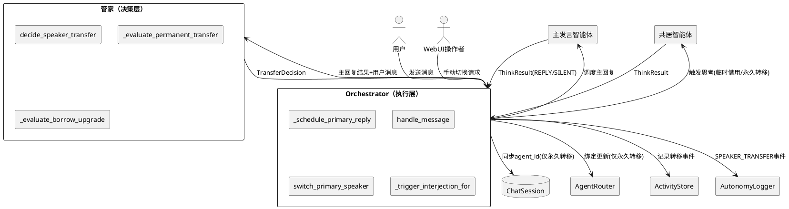
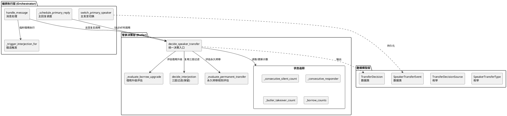
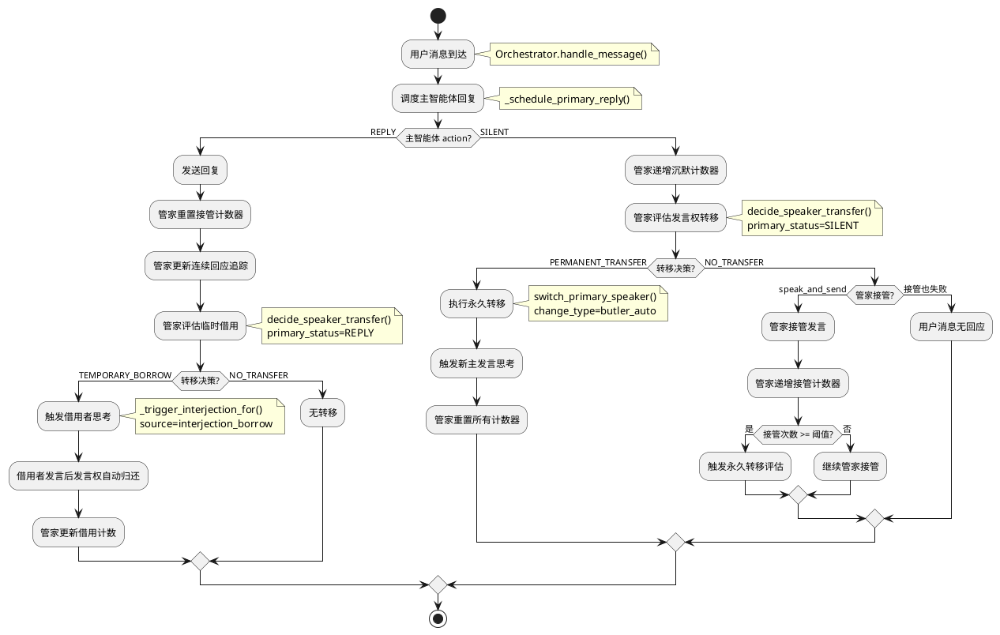
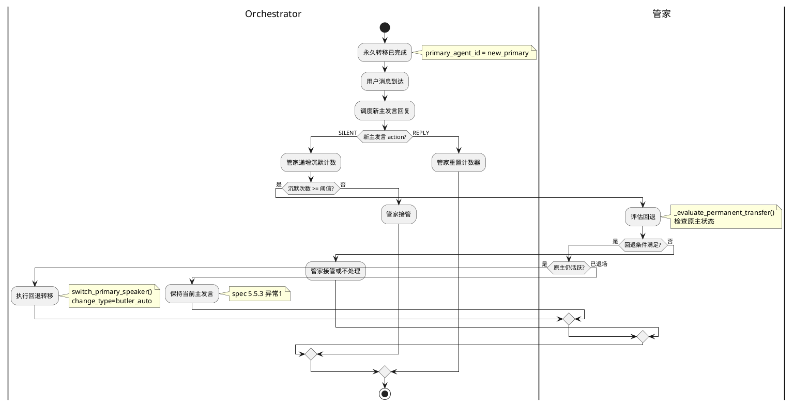
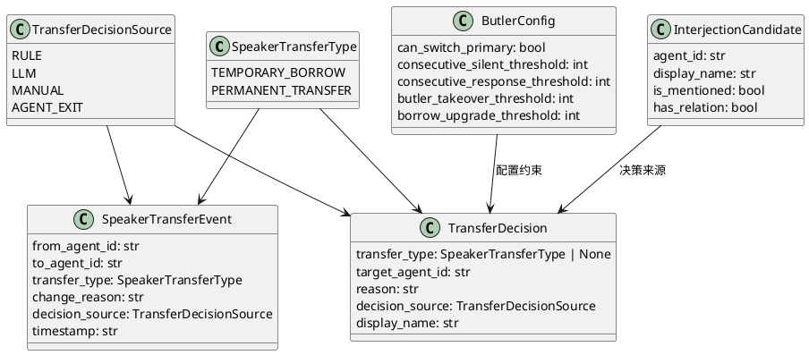

# 一、需求与存量功能关系分析

## 1.1 需求功能与存量功能对比

### 1.1.1 已实现功能

| 需求功能 | 存量功能 | 代码位置 | 匹配度 |
|---------|---------|---------|--------|
| 主发言智能体回复用户消息 | `_schedule_primary_reply()` 调度主智能体思考+发送 | `orchestrator.py:683-781` | 100% |
| 主发言切换（永久转移） | `switch_primary_speaker()` 切换主发言+同步 ChatSession/AgentRouter/上下文缓存 | `orchestrator.py:532-582` | 75% |
| 管家三层过滤插话 | `Butler.decide_interjection()` 规则过滤+LLM过滤 | `butler.py:274-283` | 100% |
| 管家接管发言 | `Butler.speak_and_send()` 管家以丽塔人格发言 | `butler.py:359-376` | 100% |
| 插话触发共居者思考 | `_trigger_interjection_for()` 直接触发 ThinkingOrgan | `orchestrator.py:252-300` | 100% |
| 插话冷却管理 | `InterjectionCooldownManager` + `Butler._last_interjection` | `butler.py:76-77`, `interjection_cooldown.py` | 100% |
| 发言权变更持久化 | `AgentActivityStore.save_speaker_change()` | `activity_store.py:174-197` | 75% |
| WebUI 手动切换 | `/autonomy/switch-speaker` 端点 | `webui/routers/agent.py:1147-1168` | 100% |
| 智能体退场触发切换 | `deactivate_agent()` 中检测主发言退场并自动切换 | `orchestrator.py:518-523` | 75% |
| 自主性事件日志 | `AutonomyLogger` + `AutonomyEventType` | `autonomy_logger.py:13-21` | 50% |
| 主智能体 SILENT 时管家接管 | `_schedule_primary_reply()` 中 SILENT 分支调用 `speak_and_send()` | `orchestrator.py:766-779` | 75% |

### 1.1.2 需要扩展的功能

| 需求功能 | 存量功能 | 差异说明 | 扩展方向 |
|---------|---------|---------|---------|
| 临时借用（发言权借用与归还） | 管家插话 `_trigger_interjection_for()` | 现有插话无发言权语义——插话后发言权归属不明确，无"借用"和"归还"概念；临时借用期间 `ChatSession.agent_id` 不变（spec 5.2.1 规则5），但现有插话流程未区分 | `decide_speaker_transfer()` 内部将 `InterjectionCandidate` 转为 `TransferDecision(transfer_type=TEMPORARY_BORROW)`，无需修改 `InterjectionCandidate` 本身；Orchestrator 根据转移类型决定是否更新 `ChatSession.agent_id`；临时借用完成后自动归还（不改变 `ChatSession.agent_id`） |
| 永久转移（管家自动决策） | `switch_primary_speaker()` 仅支持手动/WebUI 触发 | 现有 `switch_primary_speaker()` 的 `change_type` 参数支持 `"manual_switch"` 和 `"agent_exit"`，但缺少管家自动决策触发的 `"butler_auto"` 类型；缺少连续沉默计数、连续回应计数等自动触发条件 | 在 Butler 中新增 `decide_speaker_transfer()` 方法，返回 `TransferDecision`；Orchestrator 在主智能体 SILENT 时调用管家决策；`switch_primary_speaker()` 增加 `"butler_auto"` change_type |
| 管家接管优先级调整 | `_schedule_primary_reply()` 中 SILENT 时直接调用 `speak_and_send()` | 现有逻辑：主智能体 SILENT → 管家直接接管。spec 要求：主智能体 SILENT → 先评估永久转移 → 管家接管 → 放弃。优先级顺序不同 | 将 `_schedule_primary_reply()` 中 SILENT 分支改为：先调用 `decide_speaker_transfer()` → 若需转移则执行永久转移 → 否则管家接管 |
| `can_switch_primary` 配置启用 | `AgentConfig.butler_config: dict` 中定义了 `can_switch_primary` 但从未使用 | `butler_config` 是 `dict` 类型，`can_switch_primary` 仅在注释中提及，代码中无任何读取逻辑 | 在 Butler 初始化时解析 `can_switch_primary`；`decide_speaker_transfer()` 中检查此配置决定是否有权发起永久转移 |
| 发言权变更事件日志 | `AutonomyEventType` 有 `ORCHESTRATION` 类型，`save_speaker_change()` 记录变更 | 缺少 `SPEAKER_TRANSFER` 事件类型；`save_speaker_change()` 缺少 `transfer_type`（临时借用/永久转移）和 `decision_source`（规则/LLM/手动/退场）字段 | 新增 `AutonomyEventType.SPEAKER_TRANSFER`；扩展 `save_speaker_change()` 增加 `transfer_type` 和 `decision_source` 参数 |
| 连续沉默/回应计数 | 无 | 现有代码无任何连续沉默计数机制，无法实现"主智能体连续 N 次 SILENT 触发永久转移" | 在 Orchestrator 或 Butler 中新增 `_consecutive_silent_count` 和 `_consecutive_responder` 状态追踪 |
| 临时借用升级为永久转移 | 无 | 现有插话无借用次数计数，无法实现"同一智能体连续 K 次临时借用触发升级评估" | 在 Butler 中新增 `_borrow_counts` 计数器，每次临时借用递增，达到阈值触发升级评估 |

### 1.1.3 需要新增的功能或接口

**数据模型层**：
- `SpeakerTransferType` 枚举：`TEMPORARY_BORROW` / `PERMANENT_TRANSFER`，统一临时借用和永久转移的类型语义（对应 spec 6.1）
- `TransferDecisionSource` 枚举：`RULE` / `LLM` / `MANUAL` / `AGENT_EXIT`，标识决策来源（对应 spec 6.1）
- `TransferDecision` 数据类：管家发言权转移决策的统一输出，包含转移类型、目标智能体、触发原因、决策来源（对应 spec 5.1.1）
- `SpeakerTransferEvent` 数据类：发言权转移事件记录，包含 from/to/type/reason/source/timestamp（对应 spec 6.2）

**管家决策层**：
- `Butler.decide_speaker_transfer()` 方法：管家发言权转移决策入口，替代现有 `decide_interjection()` 的部分职责，统一输出 `TransferDecision`（对应 spec 5.1.1）
- `Butler._evaluate_permanent_transfer()` 方法：纯规则判断永久转移条件——连续沉默计数、连续回应计数、用户明确要求（对应 spec 5.1.1 规则2）
- `Butler._evaluate_borrow_upgrade()` 方法：临时借用升级评估——同一智能体借用次数达到阈值时评估永久转移（对应 spec 5.2.1 规则4）

**状态追踪层**：
- `Butler._consecutive_silent_count: int`：主智能体连续沉默计数器（对应 spec 5.3.1 规则1）
- `Butler._consecutive_responder: tuple[str, int] | None`：连续回应同一共居者的追踪（agent_id, count）（对应 spec 5.3.1 规则1）
- `Butler._butler_takeover_count: int`：管家连续接管计数器（对应 spec 5.4.1 规则3）
- `Butler._borrow_counts: dict[str, int]`：各智能体临时借用次数计数器（对应 spec 5.2.1 规则4）

**Orchestrator 改动**：
- `_schedule_primary_reply()` SILENT 分支重构：先调用 `decide_speaker_transfer()` 评估永久转移，再降级为管家接管（对应 spec 5.4.1 规则1）
- `handle_message()` 管家插话分支重构：`decide_interjection()` → `decide_speaker_transfer()`，根据转移类型分发临时借用或永久转移（对应 spec 5.6.1 规则1）
- `switch_primary_speaker()` 扩展：增加 `transfer_type` 和 `decision_source` 参数，持久化到 `SpeakerTransferEvent`（对应 spec 5.3.1 规则4）

## 1.2 存量功能详细分析

### 1.2.1 `Butler.decide_interjection()` — 管家三层过滤

**接口契约**：
- 入参：`user_text: str`, `agent_text: str`
- 出参：`list[InterjectionCandidate]`
- 副作用：无（冷却由调用方 `mark_interjected()` 控制）

**业务规则**：
1. 第一层 `_rule_filter()`：纯规则计算，零 LLM 调用。基于名字提及（必看见）、关系强度（可能看见）、关注领域匹配（可能看见）、随机（很少看见）四档概率过滤
2. 第二层 `_llm_filter()`：1 次 LLM 调用，管家以丽塔人格判断"谁会关心"，最多选 2 个候选
3. 冷却机制：`_interjection_cooldown = 30.0` 秒，`_last_interjection` 字典追踪

**扩展点**：
- `InterjectionCandidate` 可扩展转移类型字段，使三层过滤结果携带"临时借用"语义
- `_rule_filter()` 中的 `focus_matched` 判断可用于永久转移的话题匹配评估
- `_llm_filter()` 的 prompt 可扩展为同时判断转移类型

**约束**：
- 规则过滤必须在 50ms 内完成（纯 CPU 计算，当前满足）
- LLM 过滤单次调用，温度 0.3（确定性优先）
- 最多 2 个插话候选（`MAX_INTERJECTORS = 2`）

### 1.2.2 `Orchestrator.switch_primary_speaker()` — 主发言切换

**接口契约**：
- 入参：`target_agent_id: str`, `reason: str`, `change_type: str = "manual_switch"`
- 出参：`bool`（是否切换成功）
- 副作用：更新 `_primary_agent_id`、`ActivityStore.set_primary()`、`ActivityStore.save_speaker_change()`、`chat_loop_adapter.switch_agent_context()`、`ChatSession.agent_id` 数据库写入

**业务规则**：
1. 目标智能体不在活跃列表时先激活
2. 切换后同步 5 个状态：`_primary_agent_id`、`ActivityStore`、`chat_loop_adapter`、`ChatSession.agent_id`、`AutonomyLogger`
3. `AgentRouter` 绑定在 `activate_agent()` 中完成，`switch_primary_speaker()` 不直接操作

**扩展点**：
- `change_type` 参数已支持 `"manual_switch"` 和 `"agent_exit"`，可新增 `"butler_auto"` 和 `"borrow_upgrade"`
- `save_speaker_change()` 可扩展 `transfer_type` 和 `decision_source` 字段
- 切换后需更新 `Butler._primary_agent_id`（当前缺失）

**约束**：
- `ChatSession.agent_id` 同步使用 `get_db_session()` 直接写入，无重试机制
- 切换不触发目标智能体思考（由调用方决定是否触发）
- `AgentRouter` 绑定关系在 `activate_agent()` 时建立，切换不重新绑定

### 1.2.3 `Orchestrator._schedule_primary_reply()` — 主回复调度

**接口契约**：
- 入参：`message: Any`（SessionMessage）
- 出参：`str`（主智能体回复文本，SILENT/WAIT 时返回空字符串）
- 副作用：触发主智能体思考、发送回复、管家接管

**业务规则**：
1. 主智能体 REPLY → 发送回复，返回文本
2. 主智能体 SILENT → 管家 `speak_and_send()` 接管，返回空字符串
3. 主智能体 WAIT → 等待，返回空字符串
4. 延迟创建 Butler（`session_recovery` 场景）

**扩展点**：
- SILENT 分支是发言权转移的核心入口——需在管家接管前插入永久转移评估
- 返回值 `str` 需扩展为包含 `SilenceReason` 的结构化返回，供管家决策使用

**约束**：
- 当前 SILENT 分支直接调用 `speak_and_send()`，无中间决策层
- 管家接管不改变主发言归属（符合 spec 5.4.1 规则2），但缺少接管次数追踪
- 缺少连续沉默计数，无法实现"连续 N 次 SILENT 触发永久转移"

### 1.2.4 `Butler.speak_and_send()` — 管家接管发言

**接口契约**：
- 入参：`user_text: str`, `agent_text: str`, `context_hint: str`
- 出参：`bool`（是否发送成功）
- 副作用：通过 `MessagePortV2` 发送管家发言

**业务规则**：
1. 管家以丽塔人格发言，LLM 温度 0.7（创造性优先）
2. 管家可选择不说话（返回 NONE）
3. 发言不改变主发言归属

**扩展点**：
- 需增加接管次数计数器 `_butler_takeover_count`
- 接管次数达到阈值时触发永久转移评估
- 主智能体正常回复时重置接管计数器

**约束**：
- 管家接管是"临时救场"，不是发言权转移
- 管家发言的 `source="butler_speak"`，与插话的 `source="butler_interjection"` 区分

### 1.2.5 `AgentConfig.butler_config` — 管家配置

**接口契约**：
- 类型：`dict`，包含 `see_all_messages` / `coordinate_interjection` / `handle_reminders` / `can_switch_primary` / `can_speak` 等键
- 当前状态：仅定义，未在代码中读取和使用

**约束**：
- `butler_config` 是 `dict` 类型而非结构化模型，缺少类型安全
- `can_switch_primary` 默认 `false`，启用后管家才有权自动发起永久转移
- 需要新增 `consecutive_silent_threshold`、`consecutive_response_threshold`、`butler_takeover_threshold`、`borrow_upgrade_threshold` 等配置项

### 1.2.6 `AutonomyEventType` — 自主性事件类型

**接口契约**：
- 枚举值：`THINKING` / `EXPRESSION` / `INNER_NEED` / `BEHAVIOR_INTENT` / `INTERJECTION` / `ORCHESTRATION`
- 无 `SPEAKER_TRANSFER` 类型

**扩展方向**：
- 新增 `SPEAKER_TRANSFER = "speaker_transfer"` 事件类型
- 发言权转移事件通过 `AutonomyLogger.log()` 记录，包含转移类型、来源、目标、原因

### 1.2.7 `AgentActivityStore.save_speaker_change()` — 发言权变更持久化

**接口契约**：
- 入参：`session_id`, `from_agent_id`, `to_agent_id`, `change_type`, `change_reason`
- 出参：`str`（record_id）
- 副作用：写入 `AgentAutonomySpeakerChangeRecord` 数据库表

**扩展方向**：
- 增加 `transfer_type` 字段（`TEMPORARY_BORROW` / `PERMANENT_TRANSFER`）
- 增加 `decision_source` 字段（`RULE` / `LLM` / `MANUAL` / `AGENT_EXIT`）
- 临时借用不写入此表（`ChatSession.agent_id` 不变），仅永久转移写入

# 二、增量设计方案

## 2.1 实现模型

### 2.1.1 上下文视图

发言权转移模块与外部系统的交互关系：



**通信协议与频率**：
- 用户→Orchestrator：每条消息触发，同步调用
- Orchestrator→管家：每条消息触发（主回复后），异步调用
- 管家→Orchestrator：返回 `TransferDecision`，同步返回
- Orchestrator→ChatSession：仅永久转移时写入，低频（<1次/分钟）
- Orchestrator→ActivityStore：每次转移记录，低频

### 2.1.2 服务/组件总体架构

发言权转移不是独立模块，而是管家系统（Butler）和编排器（Orchestrator）的协作增强。核心设计原则：**管家决策，Orchestrator 执行**。



**模块职责说明**：

| 模块 | 职责 | 依赖 |
|------|------|------|
| `decide_speaker_transfer()` | 管家发言权转移统一决策入口，综合三层过滤+永久转移评估+借用升级评估，输出 `TransferDecision` | `decide_interjection()`, `_evaluate_permanent_transfer()`, `_evaluate_borrow_upgrade()` |
| `decide_interjection()` | 三层过滤（保留不变），作为 `decide_speaker_transfer()` 的子调用 | `_rule_filter()`, `_llm_filter()` |
| `_evaluate_permanent_transfer()` | 纯规则判断永久转移条件：连续沉默、连续回应、用户明确要求 | 状态追踪 |
| `_evaluate_borrow_upgrade()` | 借用升级评估：借用次数达阈值时评估永久转移 | 状态追踪 |
| `switch_primary_speaker()` | 主发言切换执行（扩展参数），同步所有下游状态 | `ActivityStore`, `ChatSession`, `AgentRouter` |

### 2.1.3 实现设计文档

#### 2.1.3.1 发言权转移决策流程



**设计决策说明**：

1. **为什么 `decide_speaker_transfer()` 是统一入口而非两个独立方法？**
   - spec 5.1.1 规则3 要求"规则优先"——临时借用和永久转移的判断共享同一套规则数据（话题匹配、关系强度、沉默计数），拆分为两个方法会导致规则重复计算
   - 统一入口确保决策一致性：管家不会在同一消息上既判定临时借用又判定永久转移
   - 对应需求：spec 5.1.1 规则3（规则优先原则）

2. **为什么连续沉默计数器放在 Butler 而非 Orchestrator？**
   - 管家是发言权转移的决策者（spec 3.1），计数器是决策的输入，应与决策逻辑同位
   - Orchestrator 是执行者，不应持有决策状态
   - 对应需求：spec 5.3.1 规则1（连续 N 次 SILENT 触发永久转移）

3. **为什么临时借用不改变 `ChatSession.agent_id`？**
   - 临时借用是"补充发言"而非"接管义务"——借用者发言后，下一条消息仍由主智能体处理
   - 如果临时借用也改 `ChatSession.agent_id`，会导致频繁的数据库写入和 WebUI 闪烁
   - 对应需求：spec 5.2.1 规则5（临时借用不得改变 ChatSession.agent_id）

#### 2.1.3.2 临时借用归还流程

```plantuml
@startuml
|Orchestrator|
start
:管家决策: TEMPORARY_BORROW;
:触发借用者思考;
note right: _trigger_interjection_for()\nsource=interjection_borrow

|借用者|
if (思考结果?) then (REPLY)
    |Orchestrator|
    :发送借用者回复;
    :发言权自动归还主智能体;
    note right: 无需显式操作\nChatSession.agent_id 未变
    :管家递增借用计数;
    
else (SILENT)
    |Orchestrator|
    :发言权直接归还;
    note right: 借用者未发言\n不记录为有效借用
    
else (ERROR/TIMEOUT)
    |Orchestrator|
    :发言权直接归还;
    :记录借用异常日志;
endif

|管家|
if (借用次数 >= 升级阈值?) then (是)
    :评估借用升级;
    note right: _evaluate_borrow_upgrade()
    if (升级为永久转移?) then (是)
        |Orchestrator|
        :执行永久转移;
    else (否)
        :继续临时借用;
    endif
endif

stop
@enduml
```

**设计决策**：
- 临时借用归还无需显式操作——因为 `ChatSession.agent_id` 和 `_primary_agent_id` 在借用期间未变，下一条消息自然由主智能体处理
- 借用者 SILENT 不计入有效借用次数（用户未感知到借用尝试）
- 对应需求：spec 5.2.1 规则2（借用发言规则）、规则4（借用升级规则）

#### 2.1.3.3 永久转移回退流程



**设计决策**：
- 回退与永久转移使用同一套规则评估（`_evaluate_permanent_transfer()`），只是方向相反——检查新主发言的沉默计数而非原主发言
- 回退必须由管家决策，不得自动回退（spec 5.5.1 规则3）
- 对应需求：spec 5.5.1 规则2（永久转移回退条件）、规则3（回退非自动）

## 2.2 接口设计

### 2.2.1 总体设计

发言权转移的接口分为三层：

| 层次 | 接口 | 稳定性 | 说明 |
|------|------|--------|------|
| 数据模型 | `SpeakerTransferType` | 稳定 | 枚举，2 个值 |
| 数据模型 | `TransferDecisionSource` | 稳定 | 枚举，4 个值 |
| 数据模型 | `TransferDecision` | 稳定 | 数据类，管家决策输出 |
| 数据模型 | `SpeakerTransferEvent` | 稳定 | 数据类，转移事件记录 |
| 管家决策 | `Butler.decide_speaker_transfer()` | 稳定 | 管家统一决策入口 |
| 管家决策 | `Butler.update_primary_status()` | 稳定 | 主智能体状态更新（计数器管理） |
| 编排执行 | `Orchestrator.switch_primary_speaker()` | 稳定 | 扩展参数，新增 transfer_type/decision_source |
| 日志 | `AutonomyEventType.SPEAKER_TRANSFER` | 稳定 | 新增事件类型 |

**接口变更策略**：
- `Butler.decide_interjection()` 保留不变，作为 `decide_speaker_transfer()` 的内部子调用
- `Orchestrator.switch_primary_speaker()` 向后兼容——新增参数均有默认值
- `AgentActivityStore.save_speaker_change()` 向后兼容——新增可选参数

### 2.2.2 接口清单

#### SpeakerTransferType 枚举

**对应需求**：spec 6.1（转移类型）

```python
class SpeakerTransferType(Enum):
    TEMPORARY_BORROW = "temporary_borrow"
    PERMANENT_TRANSFER = "permanent_transfer"
```

**业务说明**：统一临时借用和永久转移的类型语义。临时借用 = 现有插话 + 发言权语义；永久转移 = 现有主发言切换 + 管家自动决策。

#### TransferDecisionSource 枚举

**对应需求**：spec 6.1（决策来源）

```python
class TransferDecisionSource(Enum):
    RULE = "rule"
    LLM = "llm"
    MANUAL = "manual"
    AGENT_EXIT = "agent_exit"
```

**业务说明**：标识发言权转移决策的来源。RULE = 纯规则判断（零 LLM）；LLM = 管家 LLM 补充判断；MANUAL = WebUI 手动；AGENT_EXIT = 智能体退场自动触发。

#### TransferDecision 数据类

**对应需求**：spec 5.1.1（发言权转移决策）

```python
@dataclass(slots=True)
class TransferDecision:
    transfer_type: SpeakerTransferType | None
    target_agent_id: str
    reason: str
    decision_source: TransferDecisionSource
    display_name: str = ""
```

**业务说明**：管家发言权转移决策的统一输出。`transfer_type=None` 表示无转移。

**前置条件**：管家已初始化，主智能体状态已知。

**后置条件**：无副作用（纯数据输出，由 Orchestrator 执行）。

**异常映射**：无（决策失败时返回 `TransferDecision(transfer_type=None, ...)`）。

#### SpeakerTransferEvent 数据类

**对应需求**：spec 6.2（发言权转移事件）

```python
@dataclass(slots=True)
class SpeakerTransferEvent:
    from_agent_id: str
    to_agent_id: str
    transfer_type: SpeakerTransferType
    change_reason: str
    decision_source: TransferDecisionSource
    timestamp: str
```

**业务说明**：发言权转移事件的完整记录，用于审计日志和 ActivityStore 持久化。Orchestrator 不直接构造此对象——通过 `save_speaker_change()` 的 `transfer_type` 和 `decision_source` 参数间接持久化。此数据类保留用于 WebUI 查询历史转移记录时的结构化返回（后续迭代）。

#### Butler.decide_speaker_transfer()

**对应需求**：spec 5.1.1（发言权转移决策）、5.1.1 规则3（规则优先原则）

```python
async def decide_speaker_transfer(
    self,
    user_text: str,
    agent_text: str,
    primary_status: str,
) -> list[TransferDecision]:
    ...
```

**业务说明**：管家发言权转移统一决策入口。根据主智能体状态（REPLY/SILENT）和三层过滤结果，决定是否转移发言权及转移类型。

**前置条件**：
- 管家已初始化（`_butler_config` 已加载）
- 主智能体状态已知（`primary_status` 为 `"reply"` 或 `"silent"`）

**后置条件**：
- 更新 `_consecutive_silent_count`、`_consecutive_responder`、`_butler_takeover_count`、`_borrow_counts` 等状态追踪
- 返回的 `TransferDecision` 列表由 Orchestrator 执行

**决策逻辑**：
1. 主智能体 REPLY → 复用三层过滤，输出 `TEMPORARY_BORROW` 决策
2. 主智能体 SILENT → 先评估永久转移（`_evaluate_permanent_transfer()`），再评估临时借用
3. 永久转移评估优先级：连续沉默 > 用户明确要求 > 连续回应 > 借用升级
4. `can_switch_primary=false` 时，永久转移降级为管家接管
5. **多决策优先级**：返回列表中永久转移最多 1 个，临时借用最多 2 个；若同时存在永久转移和临时借用，Orchestrator 优先执行永久转移（执行后临时借用自动取消——发言权已转移，原主智能体的借用者不再适用）

**调用示例**：
```python
# 主智能体正常回复后评估临时借用
decisions = await butler.decide_speaker_transfer(
    user_text="布洛妮娅你知道量子力学吗",
    agent_text="量子力学啊，我当然知道",
    primary_status="reply",
)

# 主智能体沉默后评估永久转移
decisions = await butler.decide_speaker_transfer(
    user_text="布洛妮娅你在吗",
    agent_text="",
    primary_status="silent",
)
```

#### Butler.update_primary_status()

**对应需求**：spec 5.3.1 规则1（连续沉默计数）、5.4.1 规则3（接管计数）

```python
def update_primary_status(self, status: str, responder_id: str = "") -> None:
    ...
```

**业务说明**：由 Orchestrator 在主智能体回复/沉默后调用，更新管家内部的状态追踪计数器。

**前置条件**：管家已初始化。

**后置条件**：
- `status="reply"` → 重置 `_consecutive_silent_count`、`_butler_takeover_count`；更新 `_consecutive_responder`
- `status="silent"` → 递增 `_consecutive_silent_count`
- `status="butler_takeover"` → 递增 `_butler_takeover_count`

#### Orchestrator.switch_primary_speaker() 扩展

**对应需求**：spec 5.3.1 规则4（转移同步规则）

```python
async def switch_primary_speaker(
    self,
    target_agent_id: str,
    reason: str,
    change_type: str = "manual_switch",
    transfer_type: SpeakerTransferType = SpeakerTransferType.PERMANENT_TRANSFER,
    decision_source: TransferDecisionSource = TransferDecisionSource.MANUAL,
) -> bool:
    ...
```

**业务说明**：扩展 `switch_primary_speaker()` 的参数，增加 `transfer_type` 和 `decision_source`，用于持久化和日志记录。新增参数均有默认值，向后兼容。

**前置条件**：目标智能体 ID 有效。

**后置条件**：
- `_primary_agent_id` 更新
- `Butler._primary_agent_id` 更新（新增同步点）
- `ActivityStore.save_speaker_change()` 记录含 `transfer_type` 和 `decision_source`
- `ChatSession.agent_id` 更新
- `AutonomyLogger` 记录 `SPEAKER_TRANSFER` 事件

**异常映射**：
- 目标智能体激活失败 → 返回 `False`，保持原主发言不变（spec 5.1.3 异常1）
- ChatSession 同步失败 → 记录日志，不回滚 Orchestrator 内部状态（spec 5.3.3 异常3）

## 2.3 数据模型

### 2.3.1 设计目标

1. **统一临时借用和永久转移的类型语义**——现有插话和切换是两个独立流程，发言权转移将它们统一为同一决策框架下的两种模式
2. **支持管家自动决策**——连续沉默计数、连续回应计数、借用升级计数等状态追踪，为规则引擎提供输入
3. **与存量数据兼容**——`AgentAutonomySpeakerChangeRecord` 表新增 `transfer_type` 和 `decision_source` 列，旧记录默认 `PERMANENT_TRANSFER` + `MANUAL`
4. **临时借用不写入 SpeakerChangeRecord**——借用期间 `ChatSession.agent_id` 不变，仅永久转移写入

### 2.3.2 模型实现



**对象创建和销毁策略**：
- `TransferDecision`：每次 `decide_speaker_transfer()` 调用时创建，调用方消费后丢弃
- `SpeakerTransferEvent`：每次永久转移时创建，持久化到 ActivityStore 后丢弃
- `ButlerConfig`：Butler 初始化时从 `AgentConfig.butler_config` 解析创建，Butler 生命周期内常驻

**持久化策略**：
- `SpeakerTransferEvent` → `AgentAutonomySpeakerChangeRecord` 表（扩展 `transfer_type` 和 `decision_source` 列）
- 临时借用不写入此表（`ChatSession.agent_id` 不变），借用计数保存在 Butler 内存中（会话级别，不跨重启持久化——简化设计，避免过度持久化）
- 永久转移写入此表，与现有 `save_speaker_change()` 合并

**ButlerConfig 结构化**：
- 现有 `AgentConfig.butler_config: dict` 缺少类型安全，新增 `ButlerConfig` Pydantic 模型解析此 dict
- `ButlerConfig` 不修改 `AgentConfig.butler_config` 的类型（保持 dict 向后兼容），仅在 Butler 初始化时解析为结构化对象
- 新增配置项：`consecutive_silent_threshold`（默认 2）、`consecutive_response_threshold`（默认 3）、`butler_takeover_threshold`（默认 2）、`borrow_upgrade_threshold`（默认 3）

### 2.3.3 管家状态追踪模型

管家内部维护以下会话级状态（Butler 实例生命周期内有效，不跨重启持久化）：

| 状态 | 类型 | 初始值 | 更新时机 | 用途 |
|------|------|--------|---------|------|
| `_consecutive_silent_count` | `int` | `0` | 主智能体 SILENT 时 +1，REPLY 时重置为 0 | 判断永久转移条件（spec 5.3.1 规则1） |
| `_consecutive_responder` | `tuple[str, int] \| None` | `None` | 共居者发言时更新（同 agent_id +1，不同 agent_id 重置） | 判断永久转移条件（spec 5.3.1 规则1） |
| `_butler_takeover_count` | `int` | `0` | 管家接管时 +1，主智能体 REPLY 时重置为 0 | 判断接管转转移（spec 5.4.1 规则3） |
| `_borrow_counts` | `dict[str, int]` | `{}` | 临时借用完成时 +1，永久转移时重置 | 判断借用升级（spec 5.2.1 规则4） |

**为什么不持久化这些计数器？**
- 这些计数器是"短期趋势判断"的输入，跨重启后趋势已中断，重置为 0 是合理的
- 持久化会增加数据库写入和恢复复杂度，收益不足以抵消成本
- 对应原则：大道至简、零开箱抽象

### 2.3.4 Orchestrator 改动点汇总

| 改动点 | 现有逻辑 | 改动后逻辑 | 对应需求 |
|--------|---------|-----------|---------|
| `_schedule_primary_reply()` SILENT 分支 | 直接调用 `speak_and_send()` | 先调用 `decide_speaker_transfer(primary_status="silent")` → 若需永久转移则执行 → 否则管家接管 | spec 5.4.1 规则1 |
| `_schedule_primary_reply()` REPLY 分支 | 仅返回回复文本 | 额外调用 `update_primary_status("reply", responder_id)` 更新计数器 | spec 5.3.1 规则1 |
| `handle_message()` 管家插话分支 | `decide_interjection()` → `_trigger_interjection_for()` | `decide_speaker_transfer(primary_status="reply")` → 根据转移类型分发临时借用或永久转移 | spec 5.6.1 规则1 |
| `switch_primary_speaker()` | 3 个参数 | 5 个参数（新增 `transfer_type`, `decision_source`），新增 `Butler._primary_agent_id` 同步 | spec 5.3.1 规则4 |
| `deactivate_agent()` 退场切换 | `switch_primary_speaker(change_type="agent_exit")` | `switch_primary_speaker(change_type="agent_exit", decision_source=AGENT_EXIT)` | spec 5.3.1 规则3 |
| WebUI `/autonomy/switch-speaker` | `switch_primary_speaker(reason=req.reason)` | `switch_primary_speaker(reason=req.reason, decision_source=MANUAL)` | spec 5.6.1 规则3 |

### 2.3.5 Butler 改动点汇总

| 改动点 | 现有逻辑 | 改动后逻辑 | 对应需求 |
|--------|---------|-----------|---------|
| `__init__()` | 无状态追踪 | 新增 4 个计数器 + `ButlerConfig` 解析 | spec 6.3 |
| `decide_interjection()` | 独立方法，返回 `list[InterjectionCandidate]` | 保留不变，作为 `decide_speaker_transfer()` 的子调用 | spec 5.6.1 规则5 |
| 新增 `decide_speaker_transfer()` | 无 | 统一决策入口，返回 `list[TransferDecision]` | spec 5.1.1 |
| 新增 `update_primary_status()` | 无 | 计数器更新入口 | spec 5.3.1 规则1 |
| 新增 `_evaluate_permanent_transfer()` | 无 | 纯规则判断永久转移条件 | spec 5.1.1 规则2 |
| 新增 `_evaluate_borrow_upgrade()` | 无 | 借用升级评估 | spec 5.2.1 规则4 |
| `speak_and_send()` | 无接管计数 | 接管后调用 `update_primary_status("butler_takeover")` | spec 5.4.1 规则3 |
| `_primary_agent_id` | 初始化时设置，不更新 | 永久转移后由 Orchestrator 调用 `update_primary()` 更新 | spec 5.3.1 规则5 |

### 2.3.6 与现有插话/切换的兼容策略

**核心原则**：发言权转移是插话的语义增强，不是替代。

| 现有机制 | 兼容策略 | 对应需求 |
|---------|---------|---------|
| 管家三层过滤 `decide_interjection()` | 保留不变，作为 `decide_speaker_transfer()` 的子调用。三层过滤结果自动带上 `TEMPORARY_BORROW` 语义 | spec 5.6.1 规则1、规则5 |
| 行为意图插话 `_schedule_interjections()` | 保留不变，行为意图触发的插话走现有流程，不经过 `decide_speaker_transfer()`（行为意图是智能体自主发起的，不是管家协调的） | spec 5.6.1 规则2 |
| WebUI 手动切换 `/autonomy/switch-speaker` | 保留不变，等同于 `PERMANENT_TRANSFER` + `MANUAL` 来源 | spec 5.6.1 规则3 |
| `can_switch_primary` 配置 | 启用——`decide_speaker_transfer()` 中检查此配置，`false` 时永久转移降级为管家接管 | spec 5.6.1 规则4 |
| 智能体退场切换 `deactivate_agent()` | 保留不变，等同于 `PERMANENT_TRANSFER` + `AGENT_EXIT` 来源 | spec 5.3.1 规则3 |

**为什么行为意图插话不经过 `decide_speaker_transfer()`？**
- 行为意图是智能体自主发起的（`produce_behavior_intents()`），管家协调的插话是管家发起的——两者决策主体不同
- 行为意图插话本质上是临时借用（发言后归还），不需要管家额外判断转移类型
- 对应原则：智能体决策权原则——管家不干预智能体自主发起的行为意图

### 2.3.7 日志和可观测性

#### AutonomyEventType 扩展

新增 `SPEAKER_TRANSFER = "speaker_transfer"` 事件类型。发言权转移事件通过 `AutonomyLogger.log()` 记录，格式：

```
[Autonomy:{agent_id}] speaker_transfer: {transfer_type} from={from_id} to={to_id} reason={reason} source={source}
```

**对应需求**：spec 4.4（可维护性）、4.3（安全性/审计日志）

#### ThinkCycleLog 扩展

`ThinkCycleLog.trigger` 字段新增 `interjection_borrow` 触发来源，区分临时借用和普通插话：

| trigger 值 | 含义 |
|------------|------|
| `user_message` | 用户消息触发的主回复 |
| `butler_interjection` | 管家协调的插话（现有） |
| `interjection_borrow` | 管家协调的临时借用（新增） |
| `reminder` | 提醒触发 |
| `proactive` | 主动发言 |

**对应需求**：spec 4.4（可维护性）

#### ActivityStore 扩展

`save_speaker_change()` 新增可选参数：

```python
def save_speaker_change(
    self,
    session_id: str,
    from_agent_id: str,
    to_agent_id: str,
    change_type: str,
    change_reason: str,
    transfer_type: str = "permanent_transfer",      # 新增
    decision_source: str = "manual",                  # 新增
) -> str:
    ...
```

**对应需求**：spec 6.2（发言权转移事件）

#### WebUI 可观测性

现有 `/autonomy/primary/{session_id}` 端点保持不变，返回当前主发言智能体。临时借用期间此端点返回原主智能体（因为 `ChatSession.agent_id` 未变），符合 spec 5.2.1 规则5。

如需展示借用状态，可扩展此端点增加 `active_borrower` 字段（非本次必需，后续迭代）。
