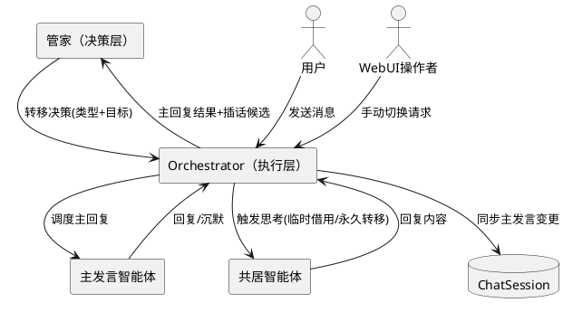
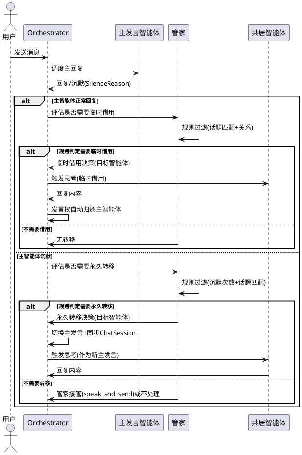
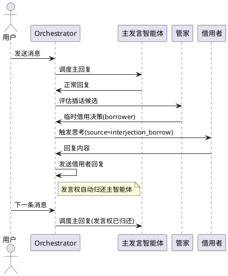
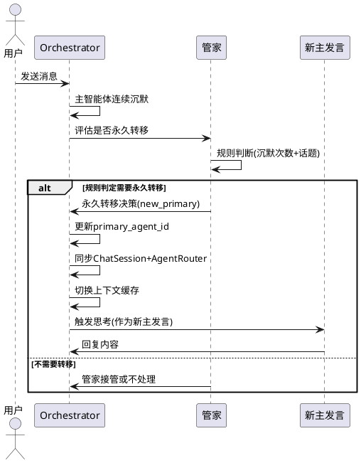
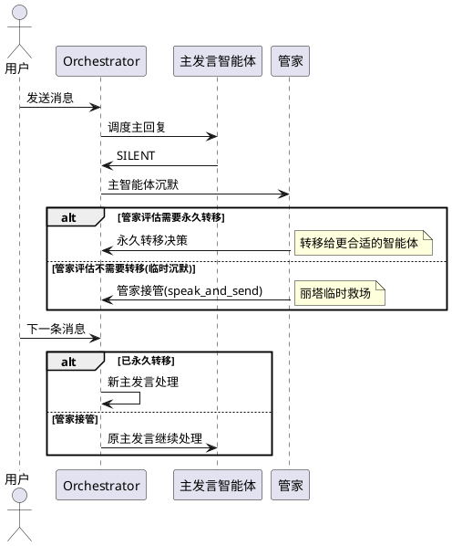
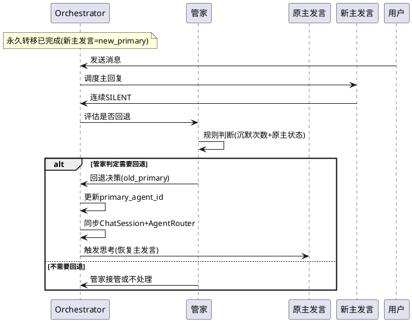
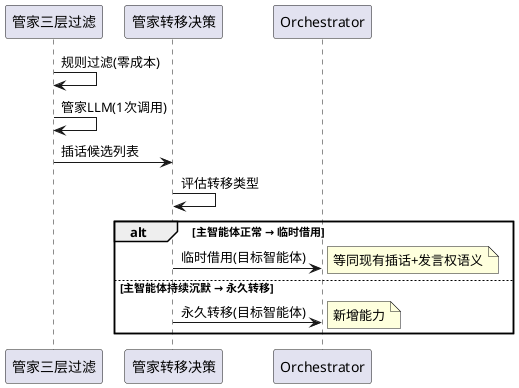

# 发言权转移 — 需求规格

# **1. 组件定位**

## **1.1 核心职责**

本组件负责统一管理共居智能体之间的发言权分配，实现临时借用和永久转移两种模式，由管家基于话题匹配、角色关系和主智能体状态决定转移方式。

## **1.2 核心输入**

1. **用户消息**：来自消息链路的用户发言内容，触发主智能体回复和管家评估
2. **主智能体思考结果**：主智能体回复文本或沉默原因（SilenceReason），作为管家判断是否需要发言权转移的依据
3. **管家插话决策结果**：管家三层过滤后的插话候选列表（InterjectionCandidate），作为发言权转移评估的输入
4. **WebUI 手动切换请求**：用户通过 WebUI 发起的主动切换主发言请求
5. **智能体退场信号**：主智能体退场时触发的自动切换需求

## **1.3 核心输出**

1. **发言权转移决策**：管家输出的转移类型（临时借用/永久转移）和目标智能体
2. **主发言变更通知**：主发言智能体变更后，同步到 ChatSession、AgentRouter、上下文缓存等下游
3. **发言权归还**：临时借用到期或条件满足时，发言权自动归还主智能体
4. **转移事件日志**：发言权转移的完整记录（来源、目标、类型、原因、时间）

## **1.4 职责边界**

- 本组件**不负责**智能体如何思考和回复——那是 ThinkingOrgan 的职责
- 本组件**不负责**消息的发送——那是 MessagePortV2 的职责
- 本组件**不负责**智能体的激活/退场——那是 Orchestrator 的职责（但退场触发的切换是本组件的输入）
- 本组件**不负责**插话内容的生成——那是管家三层过滤 + 角色思考的职责
- 本组件**不替代**管家接管（speak_and_send）——管家接管是管家自己发言，发言权转移是把"谁有义务回复"交给另一个智能体

# **2. 领域术语**

**发言权**
: 在一个会话中，对用户消息负有回复义务的角色身份。持有发言权的智能体必须回应每条用户消息（除非选择沉默）。

**主发言智能体**
: 当前持有发言权的智能体。每条用户消息首先由主发言智能体处理。

**临时借用**
: 共居智能体对当前话题补充发言，发言权在借用条件结束后自动归还主智能体。等同于当前的"插话"语义，但明确发言权的归属和归还机制。

**永久转移**
: 主发言权从一个智能体转移到另一个智能体，直到再次发生转移。等同于当前的"切换主发言"，但由管家自动决策而非仅依赖手动触发。

**管家接管**
: 管家（丽塔）以自身人格发言，替代沉默的主智能体回复用户。接管不改变主发言归属——下一条消息仍由原主智能体处理。

**发言权转移**
: 临时借用和永久转移的统称。管家根据场景决定使用哪种模式。

**转移回退**
: 发言权从当前持有者归还给原主智能体或转移给更合适的智能体的过程。

# **3. 角色与边界**

## **3.1 核心角色**

- **管家（丽塔·洛丝薇瑟）**：发言权转移的决策者，基于三层过滤+话题匹配+主智能体状态判断是否转移及转移类型
- **主发言智能体**：当前持有发言权的智能体，对用户消息负有回复义务
- **共居智能体**：可能通过临时借用或永久转移获得发言权的其他活跃智能体

## **3.2 外部系统**

- **Orchestrator**：发言权转移的执行者，负责实际切换主发言、同步 ChatSession、更新上下文缓存
- **ChatSession（数据库）**：主发言变更后需要同步 agent_id 字段
- **AgentRouter**：主发言变更后需要同步会话绑定关系
- **WebUI**：提供手动切换主发言的入口，展示当前发言权归属

## **3.3 交互上下文**

# **4. DFX约束**

## **4.1 性能**

- 发言权转移决策（规则部分）必须在 50ms 内完成，不调用 LLM
- 发言权转移决策（含 LLM 补充判断）必须在 2s 内完成
- 主发言切换后 ChatSession 同步必须在 100ms 内完成
- 临时借用的发言权归还检查必须在每次消息处理时完成，不增加可感知延迟

## **4.2 可靠性**

- 发言权转移失败时（如目标智能体激活失败），系统必须保持原主发言不变
- 永久转移后 ChatSession.agent_id 必须与 Orchestrator._primary_agent_id 一致
- 临时借用的归还条件必须可验证，不允许出现"借出后永不归还"的情况

## **4.3 安全性**

- 发言权转移必须记录完整的审计日志（from/to/type/reason/timestamp）
- 管家自动发起的永久转移必须有明确的触发原因记录
- WebUI 手动切换必须验证操作者权限

## **4.4 可维护性**

- 发言权转移事件必须通过 AutonomyLogger 记录，包含转移类型、来源、目标、原因
- 临时借用和永久转移的决策逻辑必须可配置（阈值、冷却时间、触发条件）
- 发言权转移状态必须可通过 WebUI 查询

## **4.5 兼容性**

- 发言权转移必须兼容现有插话机制——临时借用是插话的自然延伸，不是替代
- 现有 WebUI 手动切换接口（/autonomy/switch-speaker）必须保持可用
- AgentConfig.butler_config 中的 can_switch_primary 配置项必须被实际使用
- ChatSession.agent_id 同步逻辑必须与现有 switch_primary_speaker 保持一致

# **5. 核心能力**

## **5.1 发言权转移决策**

### **5.1.1 业务规则**

1. **临时借用触发规则**：当共居智能体被管家三层过滤选中且话题属于其关注领域，但主智能体状态正常（非持续沉默）时，必须触发临时借用
   - 验收条件：[管家选中布洛妮娅插话 + 银狼状态正常] → [布洛妮娅临时借用发言权，发言后归还银狼]

2. **永久转移触发规则**：当满足以下任一条件时，必须触发永久转移
   - 主智能体连续 N 次 SILENT（N 可配置，默认 2）
   - 话题持续由非主智能体回应（连续 M 条消息由同一共居者回复，M 可配置，默认 3）
   - 用户明确要求切换（如"让布洛妮娅来回答"）
   - 验收条件：[银狼连续 2 次 SILENT + 布洛妮娅关注当前话题] → [主发言永久转移给布洛妮娅]

3. **规则优先原则**：发言权转移的判断必须优先使用规则计算（话题匹配、关系强度、沉默次数），LLM 仅在规则无法判断的复杂场景下补充使用
   - 验收条件：[话题明确匹配某共居者关注领域] → [规则直接判定转移，不调用 LLM]

4. **管家决策权原则**：管家决定"是否转移发言权"和"转移类型"，智能体自主决定"如何回应"
   - 验收条件：[管家决定永久转移给提纳里] → [提纳里自主决定回复内容，管家不干预]

5. **禁止项**：禁止 Orchestrator 通过 enqueue_proactive_task 模拟发言权转移
   - 验收条件：[任何发言权转移场景] → [必须通过管家决策 + ThinkingOrgan 直接触发，不走 enqueue_proactive_task]

6. **禁止项**：禁止在管家未决策的情况下由消息链路层直接触发永久转移
   - 验收条件：[主智能体 SILENT 但管家未判定需要转移] → [不自动切换主发言，管家可选择接管或放弃]

### **5.1.2 交互流程**

### **5.1.3 异常场景**

1. **目标智能体激活失败**
   - 触发条件：管家决定转移发言权但目标智能体激活失败（如达到最大活跃数）
   - 系统行为：保持原主发言不变，记录转移失败日志
   - 用户感知：无感知（原主智能体继续处理消息）

2. **转移决策超时**
   - 触发条件：管家 LLM 判断超时（如 LLM 服务不可用）
   - 系统行为：降级为纯规则判断，使用规则过滤结果决定转移类型
   - 用户感知：无感知（决策延迟不暴露给用户）

3. **ChatSession 同步失败**
   - 触发条件：主发言切换后数据库写入失败
   - 系统行为：Orchestrator 内部主发言已切换但记录同步失败日志，下次消息处理时重试同步
   - 用户感知：新主发言正常工作，但 WebUI 可能短暂显示旧主发言

4. **临时借用归还冲突**
   - 触发条件：临时借用期间原主智能体退场
   - 系统行为：临时借用自动升级为永久转移
   - 用户感知：无感知（发言权自然延续）

## **5.2 临时借用（发言权借用与归还）**

### **5.2.1 业务规则**

1. **借用触发条件**：当管家三层过滤选中某共居智能体插话，且主智能体状态为正常回复或 INTENTIONAL 沉默时，必须使用临时借用模式
   - 验收条件：[银狼正常回复 + 管家选中布洛妮娅] → [布洛妮娅临时借用，发言后发言权归还银狼]

2. **借用发言规则**：临时借用期间，借用者发言后发言权必须自动归还主智能体
   - 验收条件：[布洛妮娅临时借用发言完成] → [下一条用户消息由银狼处理]

3. **借用冷却规则**：同一智能体的临时借用必须遵守冷却时间（与现有插话冷却一致）
   - 验收条件：[布洛妮娅刚完成临时借用] → [冷却期内不再被选为借用候选]

4. **借用升级规则**：当同一智能体连续被临时借用超过 K 次（K 可配置，默认 3），管家应当评估是否升级为永久转移
   - 验收条件：[布洛妮娅连续 3 次临时借用] → [管家评估是否永久转移给布洛妮娅]

5. **禁止项**：临时借用不得改变 ChatSession.agent_id
   - 验收条件：[临时借用期间] → [ChatSession.agent_id 保持原主智能体不变]

### **5.2.2 交互流程**

### **5.2.3 异常场景**

1. **借用者选择沉默**
   - 触发条件：借用者思考后选择 SILENT
   - 系统行为：发言权直接归还主智能体，不记录为有效借用
   - 用户感知：无感知（借用者未发言，用户不知道有借用尝试）

2. **借用者思考超时**
   - 触发条件：借用者思考超过超时限制
   - 系统行为：降级为 SILENT，发言权归还主智能体
   - 用户感知：无感知

## **5.3 永久转移（主发言切换）**

### **5.3.1 业务规则**

1. **自动转移触发条件**：当满足以下任一条件时，管家必须触发永久转移
   - 主智能体连续 N 次 SILENT（N 可配置，默认 2，且排除 INTENTIONAL）
   - 话题持续由同一共居者回应超过 M 条（M 可配置，默认 3）
   - 用户明确要求切换（名字被提到 + 语义包含"接管/来回答/换你"等意图）
   - 验收条件：[银狼连续 2 次 SILENT（非 INTENTIONAL）+ 布洛妮娅关注当前话题] → [主发言永久转移给布洛妮娅]

2. **手动转移触发条件**：WebUI 手动切换请求必须立即执行永久转移
   - 验收条件：[WebUI 请求切换到提纳里] → [主发言立即切换到提纳里]

3. **退场转移触发条件**：主智能体退场时必须自动永久转移给下一个活跃智能体
   - 验收条件：[银狼退场 + 布洛妮娅活跃] → [主发言永久转移给布洛妮娅]

4. **转移同步规则**：永久转移必须同步以下状态
   - Orchestrator._primary_agent_id 更新
   - ChatSession.agent_id 更新
   - AgentRouter 会话绑定更新
   - 上下文缓存切换（chat_loop_adapter.switch_agent_context）
   - ActivityStore 记录发言权变更
   - 验收条件：[永久转移完成] → [上述 5 个状态全部一致指向新主发言]

5. **转移后管家更新规则**：永久转移后，管家的 primary_agent_id 必须更新为新主发言
   - 验收条件：[主发言从银狼切换到提纳里] → [管家 primary_agent_id 更新为提纳里]

6. **禁止项**：永久转移不得跳过 ChatSession 同步
   - 验收条件：[任何永久转移场景] → [ChatSession.agent_id 必须在转移完成前更新]

### **5.3.2 交互流程**

### **5.3.3 异常场景**

1. **无可用转移目标**
   - 触发条件：主智能体需要永久转移但没有活跃的共居智能体
   - 系统行为：管家接管发言（speak_and_send），不执行转移
   - 用户感知：管家丽塔回复用户

2. **转移目标不可用**
   - 触发条件：管家选择的目标智能体无法激活（如达到最大活跃数限制）
   - 系统行为：选择次优候选，若无次优则管家接管
   - 用户感知：可能由管家或次优智能体回复

3. **用户要求切换到不存在的智能体**
   - 触发条件：用户说"让某某来回答"但该智能体不存在
   - 系统行为：不执行转移，主智能体正常回复
   - 用户感知：主智能体正常回复，可能提及无法切换

## **5.4 管家接管与发言权转移的关系**

### **5.4.1 业务规则**

1. **接管优先级规则**：主智能体 SILENT 时，管家必须按以下优先级处理
   - 优先级 1：评估是否需要永久转移（主智能体持续无法回应 → 转移给更合适的智能体）
   - 优先级 2：管家自己接管发言（speak_and_send，临时救场）
   - 优先级 3：放弃处理（用户消息无回应）
   - 验收条件：[银狼 SILENT + 布洛妮娅适合当前话题] → [优先评估永久转移给布洛妮娅，而非管家直接接管]

2. **接管不等于转移规则**：管家接管（speak_and_send）不改变主发言归属，仅是临时救场
   - 验收条件：[管家接管发言后] → [下一条用户消息仍由原主智能体处理]

3. **接管转转移规则**：管家连续接管超过 P 次（P 可配置，默认 2），必须触发永久转移评估
   - 验收条件：[管家连续 2 次接管] → [管家评估是否永久转移给更合适的智能体]

4. **禁止项**：管家接管不得替代永久转移——当主智能体持续无法回应时，必须评估转移而非无限接管
   - 验收条件：[银狼连续 5 次 SILENT] → [必须触发永久转移评估，不能仅管家接管]

### **5.4.2 交互流程**

### **5.4.3 异常场景**

1. **管家接管也失败**
   - 触发条件：主智能体 SILENT + 管家 speak_and_send 也返回 None
   - 系统行为：用户消息无回应，记录沉默日志
   - 用户感知：无回复

## **5.5 发言权归还与回退**

### **5.5.1 业务规则**

1. **临时借用自动归还规则**：临时借用的发言权必须在借用者发言完成后立即归还主智能体
   - 验收条件：[借用者发言完成] → [下一条消息由主智能体处理]

2. **永久转移回退条件**：永久转移后，当满足以下任一条件时，管家应当评估回退
   - 新主智能体连续 SILENT（与触发转移条件对称）
   - 用户明确要求切回（如"银狼你回来"）
   - 原主智能体重新活跃且话题回到其擅长领域
   - 验收条件：[布洛妮娅作为新主发言连续 SILENT + 银狼重新活跃] → [管家评估是否回退给银狼]

3. **回退非自动规则**：永久转移的回退必须由管家决策，不得自动回退
   - 验收条件：[银狼重新活跃] → [管家评估后决定是否回退，而非自动回退]

4. **禁止项**：临时借用不得设置"借用时长"——借用是事件驱动的（发言完成即归还），不是时间驱动的
   - 验收条件：[临时借用] → [不设置超时归还，仅在发言完成或沉默时归还]

### **5.5.2 交互流程**

### **5.5.3 异常场景**

1. **回退目标已退场**
   - 触发条件：管家决定回退给原主智能体但原主已退场
   - 系统行为：保持当前主发言不变，不执行回退
   - 用户感知：当前主发言继续处理消息

2. **回退目标激活失败**
   - 触发条件：原主智能体需要重新激活但激活失败
   - 系统行为：保持当前主发言不变，记录回退失败日志
   - 用户感知：当前主发言继续处理消息

## **5.6 与现有插话机制的兼容**

### **5.6.1 业务规则**

1. **插话即临时借用规则**：现有管家三层过滤的插话流程必须统一为临时借用模式
   - 验收条件：[管家选中布洛妮娅插话] → [执行临时借用流程，发言后发言权自动归还]

2. **行为意图插话兼容规则**：基于行为意图（BehaviorIntent）的插话保持现有流程，不经过管家发言权转移决策（决策主体不同——行为意图是智能体自主发起的，管家协调的插话是管家发起的）；行为意图插话在发言权语义上等同于临时借用（发言后归还主智能体）
   - 验收条件：[行为意图触发的插话] → [走现有流程，发言后发言权自动归还主智能体]

3. **WebUI 手动切换兼容规则**：现有 /autonomy/switch-speaker 接口必须保持可用，且等同于手动永久转移
   - 验收条件：[WebUI 调用 switch-speaker] → [执行永久转移流程]

4. **can_switch_primary 启用规则**：AgentConfig.butler_config 中的 can_switch_primary 必须被实际使用，控制管家是否有权自动发起永久转移
   - 验收条件：[can_switch_primary=true] → [管家可自动发起永久转移]
   - 验收条件：[can_switch_primary=false] → [管家只能临时借用或接管，不能自动永久转移]

5. **禁止项**：不得删除现有插话机制——临时借用是插话的语义增强，不是替代
   - 验收条件：[现有三层过滤流程] → [保持不变，仅增加转移类型判断]

### **5.6.2 交互流程**

### **5.6.3 异常场景**

1. **can_switch_primary=false 但管家判定需要永久转移**
   - 触发条件：管家评估需要永久转移但配置禁止
   - 系统行为：降级为管家接管（speak_and_send），不执行永久转移
   - 用户感知：管家丽塔回复，主发言不变

# **6. 数据约束**

## **6.1 发言权转移决策**

1. **转移类型**：枚举值，必须为 TEMPORARY_BORROW（临时借用）或 PERMANENT_TRANSFER（永久转移）
2. **目标智能体 ID**：非空字符串，必须是当前活跃或可激活的智能体 ID
3. **触发原因**：非空字符串，描述转移的具体原因
4. **决策来源**：枚举值，必须为 RULE（纯规则判断）、LLM（管家 LLM 判断）、MANUAL（WebUI 手动）、AGENT_EXIT（智能体退场）之一

## **6.2 发言权转移事件**

1. **from_agent_id**：原主发言智能体 ID，非空
2. **to_agent_id**：新主发言智能体 ID，非空
3. **transfer_type**：转移类型，TEMPORARY_BORROW 或 PERMANENT_TRANSFER
4. **change_reason**：转移原因，非空
5. **decision_source**：决策来源，RULE/LLM/MANUAL/AGENT_EXIT
6. **timestamp**：转移时间，ISO 8601 格式

## **6.3 管家转移配置**

1. **can_switch_primary**：布尔值，管家是否有权自动发起永久转移，默认 false
2. **consecutive_silent_threshold**：整数，主智能体连续沉默次数触发永久转移的阈值，默认 2
3. **consecutive_response_threshold**：整数，同一共居者连续回应次数触发永久转移评估的阈值，默认 3
4. **butler_takeover_threshold**：整数，管家连续接管次数触发永久转移评估的阈值，默认 2
5. **borrow_upgrade_threshold**：整数，同一智能体临时借用次数触发永久转移评估的阈值，默认 3

## **6.4 临时借用状态**

1. **borrower_agent_id**：借用者智能体 ID，非空
2. **primary_agent_id**：原主发言智能体 ID，非空（借用期间不变）
3. **borrow_count**：整数，当前会话中该借用者的累计借用次数，默认 0

注：借用冷却由管家现有的 `_interjection_cooldown` 机制管理，不需要额外的 `last_borrow_time` 字段。