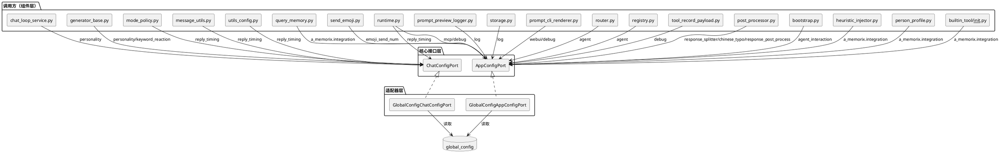
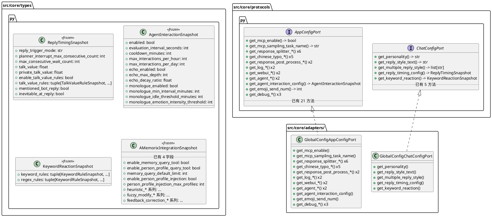
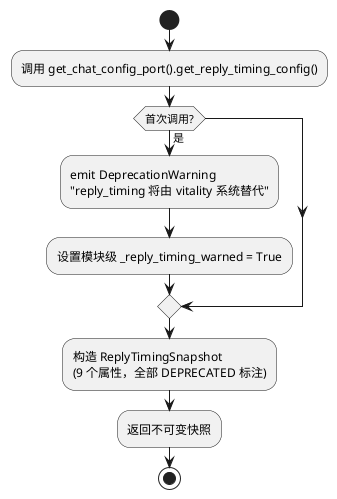
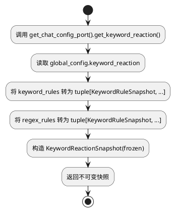
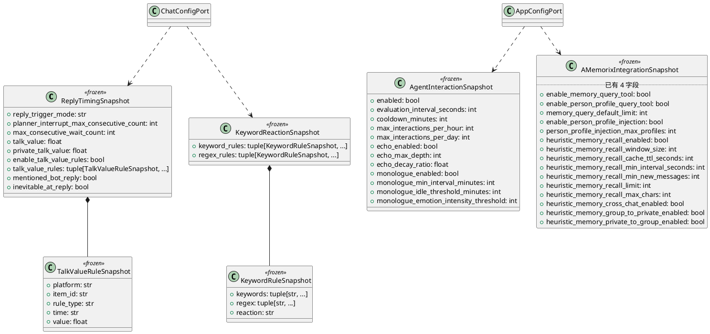

# SSD-11 设计文档：SSD-10 遗留协议化

# 一、需求与存量功能关系分析

## 1.1 需求功能与存量功能对比

### 1.1.1 已实现功能

| 需求功能 | 存量功能 | 代码位置 | 匹配度 |
|---------|---------|---------|--------|
| BotConfigPort（5方法） | `BotConfigPort` Protocol + `GlobalConfigBotConfigPort` 适配器 | `src/core/protocols.py:912-919`, `src/core/adapters/bot_config_port.py` | 100% |
| ChatConfigPort（5方法，不含 personality/reply_timing/keyword_reaction） | `ChatConfigPort` Protocol + `GlobalConfigChatConfigPort` 适配器 | `src/core/protocols.py:923-931`, `src/core/adapters/chat_config_port.py` | 100% |
| AppConfigPort（21方法，expression/emoji/experimental/visual/debug/agent_autonomy/a_memorix 域） | `AppConfigPort` Protocol + `GlobalConfigAppConfigPort` 适配器 | `src/core/protocols.py:934-958`, `src/core/adapters/app_config_port.py` | 100% |
| AutonomyEventBusPort（4方法） | `AutonomyEventBusPort` Protocol | `src/core/protocols.py:961-967` | 100% |
| ReplyStyleSnapshot 快照 | `ReplyStyleSnapshot` frozen dataclass | `src/core/types.py:853-859` | 100% |
| AgentAutonomySnapshot 快照 | `AgentAutonomySnapshot` frozen dataclass | `src/core/types.py:862-895` | 100% |
| AMemorixIntegrationSnapshot（4字段） | `AMemorixIntegrationSnapshot` frozen dataclass | `src/core/types.py:898-904` | 50% — 仅覆盖 writeback 相关 4 字段，缺少 integration 域其余 30+ 字段 |
| 注册点模式（register/get/reset） | `app_config_port_registry.py`, `chat_config_port_registry.py` | `src/core/app_config_port_registry.py`, `src/core/chat_config_port_registry.py` | 100% |
| ruff TID251 banned-api 守卫 | `pyproject.toml` 已配置 | `pyproject.toml` | 100% |

### 1.1.2 需要扩展的功能

| 需求功能 | 存量功能 | 差异说明 | 扩展方向 |
|---------|---------|---------|---------|
| ChatConfigPort 新增 personality 域（3方法） | ChatConfigPort 仅含 reply_style/max_context_size 等 5 方法 | 缺少 `get_personality()`/`get_reply_style_text()`/`get_multiple_reply_style()` | ChatConfigPort 追加 3 方法 + 适配器实现 |
| ChatConfigPort 新增 reply_timing 域（1方法，DEPRECATED 快照） | ChatConfigPort 注释明确"不含 reply_timing 待废弃属性" | reply_timing 9 个属性仍通过 `global_config.chat.reply_timing` 直接访问 | 新增 `get_reply_timing_config() -> ReplyTimingSnapshot` + DeprecationWarning |
| ChatConfigPort 新增 keyword_reaction 域（1方法，整体快照） | 无对应 | `global_config.keyword_reaction` 整体引用（含 keyword_rules/regex_rules） | 新增 `get_keyword_reaction() -> KeywordReactionSnapshot` |
| AppConfigPort 新增 mcp 域（2方法） | 无对应 | `global_config.mcp.enable`/`global_config.mcp.client.sampling.task_name` | AppConfigPort 追加 2 方法 |
| AppConfigPort 新增 response_splitter 域（6方法） | 无对应 | `global_config.response_splitter.*` 6 个属性 | AppConfigPort 追加 6 方法 |
| AppConfigPort 新增 chinese_typo 域（5方法） | 无对应 | `global_config.chinese_typo.*` 5 个属性 | AppConfigPort 追加 5 方法 |
| AppConfigPort 新增 response_post_process 域（2方法） | 无对应 | `global_config.response_post_process.*` 2 个属性 | AppConfigPort 追加 2 方法 |
| AppConfigPort 新增 log 域（2方法） | 无对应 | `global_config.log.*` 2 个属性（maisaka_prompt_preview_limit/maisaka_reply_effect_limit） | AppConfigPort 追加 2 方法 |
| AppConfigPort 新增 webui 域（2方法） | 无对应 | `global_config.webui.host`/`global_config.webui.port` | AppConfigPort 追加 2 方法 |
| AppConfigPort 新增 agent 域（2方法） | 无对应 | `global_config.agent.default_agent_id`/`global_config.agent.agents_dir` | AppConfigPort 追加 2 方法 |
| AppConfigPort 新增 agent_interaction 域（1方法，整体快照） | 无对应 | `global_config.agent_interaction` 整体引用（12 个属性） | 新增 `get_agent_interaction_config() -> AgentInteractionSnapshot` |
| AppConfigPort 新增 emoji 扩展（1方法） | AppConfigPort 已有 `get_emoji_max_reg_num`/`get_emoji_max_size_mb`/`get_emoji_do_replace` | 缺少 `get_emoji_send_num()` | AppConfigPort 追加 1 方法 |
| AppConfigPort 新增 debug 遗漏（4方法） | AppConfigPort 已有 `get_debug_show_maisaka_thinking`/`get_debug_show_jargon_prompt` | 缺少 `get_debug_enable_reply_effect_tracking()`/`get_debug_record_tool_structured_content()`/`get_debug_keep_prompt_preview_json_base64()`/`get_debug_enable_llm_cache_stats()` | AppConfigPort 追加 4 方法 |
| AMemorixIntegrationSnapshot 扩展字段 | 仅 4 字段（person_fact_writeback_enabled/chat_summary_writeback_enabled/chat_summary_writeback_message_threshold/chat_summary_writeback_context_length） | 缺少 enable_memory_query_tool/enable_person_profile_query_tool/memory_query_default_limit/enable_person_profile_injection/person_profile_injection_max_profiles + heuristic_* 系列 + fuzzy_modify_* 系列 + feedback_correction_* 系列 | 扩展快照，新增实际被代码访问的字段 |

### 1.1.3 需要新增的功能或接口

**快照类型（3 个新增 + 1 个扩展）**：

1. **ReplyTimingSnapshot**（frozen dataclass，DEPRECATED 标注）
   - 输入：`global_config.chat.reply_timing`
   - 输出：9 个属性的不可变快照
   - 核心逻辑：首次访问 emit DeprecationWarning
   - 依赖：ChatConfigPort

2. **AgentInteractionSnapshot**（frozen dataclass）
   - 输入：`global_config.agent_interaction`
   - 输出：12 个属性的不可变快照
   - 核心逻辑：整体引用模式，与 AgentAutonomySnapshot 一致
   - 依赖：AppConfigPort

3. **KeywordReactionSnapshot**（frozen dataclass）
   - 输入：`global_config.keyword_reaction`
   - 输出：keyword_rules/regex_rules 列表快照
   - 核心逻辑：整体引用模式，规则列表转为不可变结构
   - 依赖：ChatConfigPort

4. **AMemorixIntegrationSnapshot 扩展**
   - 输入：`global_config.a_memorix.integration`
   - 输出：新增 15 字段覆盖 integration 全域
   - 核心逻辑：新增字段必须有默认值（frozen dataclass 兼容性）
   - 依赖：AppConfigPort

**ruff TID251 守卫收紧**：
- 移除已完成迁移文件的 per-file-ignores 豁免
- 保留 `src/core/adapters/*.py`、`src/main.py`、`src/config/*.py` 的合法豁免

## 1.2 存量功能详细分析

### ChatConfigPort（当前 5 方法）

**接口契约**：
- `get_reply_style() -> ReplyStyleSnapshot` — 返回回复风格快照
- `get_max_context_size() -> int` — 群聊上下文长度
- `get_max_private_context_size() -> int` — 私聊上下文长度
- `get_self_message_special_mark() -> str` — 自消息标记
- `get_mid_term_memory_config() -> dict[str, Any]` — 中期记忆配置

**业务规则**：所有方法返回具体类型或 frozen 快照，不暴露 Pydantic 模型。

**扩展点**：Protocol 使用 `@runtime_checkable`，鸭子类型兼容，新增方法不破坏已有实现。

**约束**：适配器 `GlobalConfigChatConfigPort` 通过 `_get_chat()` 懒加载 global_config.chat，所有方法为纯内存读取。

### AppConfigPort（当前 21 方法）

**接口契约**：覆盖 expression(8)/emoji(3)/experimental(4)/visual(2)/debug(2)/agent_autonomy(1)/a_memorix(1) 域。

**业务规则**：整体引用模式（`get_agent_autonomy_config()`/`get_a_memorix_integration_config()`）返回 frozen 快照，避免逐属性暴露。

**扩展点**：同 ChatConfigPort，鸭子类型兼容。

**约束**：适配器 `GlobalConfigAppConfigPort` 通过 `_get_cfg()` 懒加载 global_config，方法数从 21 → ~40 可接受（每个方法对应一个实际使用的配置属性）。

### AMemorixIntegrationSnapshot（当前 4 字段）

**接口契约**：
- `person_fact_writeback_enabled: bool = False`
- `chat_summary_writeback_enabled: bool = False`
- `chat_summary_writeback_message_threshold: int = 10`
- `chat_summary_writeback_context_length: int = 20`

**业务规则**：frozen dataclass，所有字段有默认值。

**约束**：新增字段必须有默认值，否则破坏 frozen dataclass 兼容性（已有代码可能不传新字段构造）。

**实际访问的属性**（从 heuristic_injector.py/person_profile.py/builtin_tool/__init__.py/query_memory.py 确认）：
- `enable_memory_query_tool: bool` — builtin_tool/__init__.py:71
- `enable_person_profile_query_tool: bool` — builtin_tool/__init__.py:78
- `memory_query_default_limit: int` — query_memory.py:197
- `enable_person_profile_injection: bool` — person_profile.py:271
- `person_profile_injection_max_profiles: int` — person_profile.py:277
- `heuristic_memory_recall_enabled: bool` — heuristic_injector.py:102（DEPRECATED）
- `heuristic_memory_recall_window_size: int` — heuristic_injector.py:111
- `heuristic_memory_recall_cache_ttl_seconds: int` — heuristic_injector.py:119
- `heuristic_memory_recall_min_interval_seconds: int` — heuristic_injector.py:129
- `heuristic_memory_recall_min_new_messages: int` — heuristic_injector.py:133
- `heuristic_memory_recall_limit: int` — heuristic_injector.py:221
- `heuristic_memory_cross_chat_enabled: bool` — heuristic_injector.py:223（DEPRECATED）
- `heuristic_memory_group_to_private_enabled: bool` — heuristic_injector.py:380（DEPRECATED）
- `heuristic_memory_private_to_group_enabled: bool` — heuristic_injector.py:382（DEPRECATED）
- `heuristic_memory_recall_max_chars: int` — 需确认（heuristic_injector.py 中使用）

### 注册点模式

**接口契约**：`register_*_port(port)` / `get_*_port()` / `reset_*_port()` 三函数模式。

**约束**：`get_*_port()` 返回 `Optional[Protocol]`，调用方需处理 None（但实际启动后一定非 None）。

### ruff TID251 守卫

**当前状态**：41 处 `noqa: TID251` 标注，分布在 ~40 个文件中。

**per-file-ignores 豁免**：
- `src/core/adapters/*.py` — 合法（适配器层允许导入 global_config）
- `src/main.py` — 合法（启动入口）
- `src/config/*.py` — 合法（配置定义自身）
- `src/webui/**` — 待收紧
- `src/learners/**` — 待收紧

# 二、增量设计方案

## 2.1 实现模型

### 2.1.1 上下文视图



### 2.1.2 服务/组件总体架构



### 2.1.3 实现设计文档

#### reply_timing DeprecationWarning 流程



#### keyword_reaction 整体引用流程



## 2.2 接口设计

### 2.2.1 总体设计

**接口分类**：

| 分类 | Protocol | 新增方法数 | 策略 |
|------|----------|-----------|------|
| 聊天配置 | ChatConfigPort | +5 | personality(3) + reply_timing(1) + keyword_reaction(1) |
| 应用配置 | AppConfigPort | +20 | mcp(2) + response_splitter(6) + chinese_typo(5) + response_post_process(2) + log(2) + webui(2) + agent(2) + agent_interaction(1) + emoji(1) + debug(4) — 总20 |

**接口变更策略**：只追加方法，不修改已有方法签名，不删除已有方法。

**稳定性等级**：
- ChatConfigPort/AppConfigPort：稳定（新增方法不影响已有消费者）
- ReplyTimingSnapshot：实验（DEPRECATED，vitality 接管后移除）

### 2.2.2 接口清单

#### ChatConfigPort 新增方法

**D1: personality 域 — 逐属性暴露**

```python
def get_personality(self) -> str: ...
def get_reply_style_text(self) -> str: ...
def get_multiple_reply_style(self) -> list[str]: ...
```

**决策理由**：personality 域仅 3 个属性（personality/reply_style/multiple_reply_style），访问频率低（4 次），逐属性暴露比整体快照更简洁。personality 和 reply_style_text 是不同概念（人格设定 vs 表达风格），不应合并。

**替代方案**：整体快照 `PersonalitySnapshot` — 拒绝，因为 3 个属性不值得单独创建快照类型。

**D2: reply_timing 域 — 整体快照 + DEPRECATED**

```python
def get_reply_timing_config(self) -> ReplyTimingSnapshot: ...
```

**决策理由**：reply_timing 有 9 个属性且全部待废弃，整体快照比逐属性暴露更合适——废弃时只需删除 1 个方法 + 1 个快照类型，而非 9 个方法。快照内属性标注 `# DEPRECATED`，首次调用 emit `DeprecationWarning`。

**替代方案**：逐属性暴露 9 个 DEPRECATED 方法 — 拒绝，废弃时清理成本高。

**D3: keyword_reaction 域 — 整体快照**

```python
def get_keyword_reaction(self) -> KeywordReactionSnapshot: ...
```

**决策理由**：keyword_reaction 包含 keyword_rules 和 regex_rules 两个列表，每个列表元素是复合结构（keywords + reaction），无法逐属性暴露。整体快照与 AgentAutonomySnapshot 模式一致。

**替代方案**：直接返回 `global_config.keyword_reaction` 对象 — 拒绝，违反不可变快照原则。

#### AppConfigPort 新增方法

**D4: mcp 域 — 逐属性暴露（2 方法）**

```python
def get_mcp_enable(self) -> bool: ...
def get_mcp_sampling_task_name(self) -> str: ...
```

**决策理由**：仅 2 个属性被代码实际访问，不值得创建快照。

**D5: response_splitter 域 — 逐属性暴露（6 方法）**

```python
def get_response_splitter_enable(self) -> bool: ...
def get_response_splitter_max_length(self) -> int: ...
def get_response_splitter_max_sentence_num(self) -> int: ...
def get_response_splitter_max_split_num(self) -> int: ...
def get_response_splitter_enable_kaomoji_protection(self) -> bool: ...
def get_response_splitter_enable_overflow_return_all(self) -> bool: ...
```

**决策理由**：6 个属性全部被 post_processor.py 独立访问，逐属性暴露更灵活。整体快照需额外创建类型，收益不大。

**替代方案**：整体快照 `ResponseSplitterSnapshot` — 可接受但非必要，6 个属性处于"逐属性 vs 快照"的边界，选择逐属性以保持与已有 AppConfigPort 方法风格一致。

**D6: chinese_typo 域 — 逐属性暴露（5 方法）**

```python
def get_chinese_typo_enable(self) -> bool: ...
def get_chinese_typo_error_rate(self) -> float: ...
def get_chinese_typo_min_freq(self) -> int: ...
def get_chinese_typo_tone_error_rate(self) -> float: ...
def get_chinese_typo_word_replace_rate(self) -> float: ...
```

**决策理由**：同 D5，5 个属性全部被独立访问。

**D7: response_post_process 域 — 逐属性暴露（2 方法）**

```python
def get_response_post_process_enable(self) -> bool: ...
def get_response_post_process_typing_speed(self) -> float: ...
```

**决策理由**：仅 2 个属性。

**D8: log 域 — 逐属性暴露（2 方法）**

```python
def get_log_maisaka_prompt_preview_limit(self) -> int: ...
def get_log_maisaka_reply_effect_limit(self) -> int: ...
```

**决策理由**：仅 2 个属性被 maisaka 层访问。注意 `llm_request_snapshot_limit` 在 `llm_models/request_snapshot.py` 中访问，但该文件不在 maisaka/core 层，本期暂不协议化。

**D9: webui 域 — 逐属性暴露（2 方法）**

```python
def get_webui_host(self) -> str: ...
def get_webui_port(self) -> int: ...
```

**决策理由**：仅 host/port 2 个属性被 maisaka 层访问。webui 域其余属性（anti_crawler_mode/secure_cookie 等）仅在 webui/ 内部使用，不在协议化范围。

**D10: agent 域 — 逐属性暴露（2 方法）**

```python
def get_default_agent_id(self) -> str: ...
def get_agents_dir(self) -> str: ...
```

**决策理由**：仅 2 个属性被 router.py/registry.py 访问。

**D11: agent_interaction 域 — 整体快照（1 方法）**

```python
def get_agent_interaction_config(self) -> AgentInteractionSnapshot: ...
```

**决策理由**：agent_interaction 有 12 个属性且被 bootstrap.py 整体引用（`cfg = global_config.agent_interaction`），整体快照与 AgentAutonomySnapshot 模式一致。

**D12: emoji 扩展 — 逐属性暴露（1 方法）**

```python
def get_emoji_send_num(self) -> int: ...
```

**决策理由**：仅 1 个属性，追加到已有 emoji 域方法组。

**D13: debug 遗漏 — 逐属性暴露（4 方法）**

```python
def get_debug_enable_reply_effect_tracking(self) -> bool: ...
def get_debug_record_tool_structured_content(self) -> bool: ...
def get_debug_keep_prompt_preview_json_base64(self) -> bool: ...
def get_debug_enable_llm_cache_stats(self) -> bool: ...
```

**决策理由**：4 个遗漏属性，追加到已有 debug 域方法组。

**D14: AMemorixIntegrationSnapshot 扩展 — 新增字段而非新方法**

**决策理由**：`get_a_memorix_integration_config()` 方法已存在，只需扩展返回的快照类型。新增字段覆盖实际被代码访问的 integration 属性，而非全部 30+ 字段——只添加有实际消费者的字段。

**实际新增字段清单**（按消费者分组）：

| 字段 | 类型 | 默认值 | 消费者 |
|------|------|--------|--------|
| enable_memory_query_tool | bool | True | builtin_tool/__init__.py:71 |
| enable_person_profile_query_tool | bool | True | builtin_tool/__init__.py:78 |
| memory_query_default_limit | int | 5 | query_memory.py:197 |
| enable_person_profile_injection | bool | True | person_profile.py:271 |
| person_profile_injection_max_profiles | int | 3 | person_profile.py:277 |
| heuristic_memory_recall_enabled | bool | False | heuristic_injector.py:102 |
| heuristic_memory_recall_window_size | int | 20 | heuristic_injector.py:111 |
| heuristic_memory_recall_cache_ttl_seconds | int | 300 | heuristic_injector.py:119 |
| heuristic_memory_recall_min_interval_seconds | int | 180 | heuristic_injector.py:129 |
| heuristic_memory_recall_min_new_messages | int | 60 | heuristic_injector.py:133 |
| heuristic_memory_recall_limit | int | 3 | heuristic_injector.py:221 |
| heuristic_memory_recall_max_chars | int | 900 | heuristic_injector.py |
| heuristic_memory_cross_chat_enabled | bool | False | heuristic_injector.py:223 |
| heuristic_memory_group_to_private_enabled | bool | False | heuristic_injector.py:380 |
| heuristic_memory_private_to_group_enabled | bool | False | heuristic_injector.py:382 |

**替代方案**：将 AMemorixIntegrationSnapshot 拆分为 IntegrationCoreSnapshot + HeuristicSnapshot — 拒绝，过度设计。heuristic_* 虽标记 DEPRECATED 但仍在使用，拆分后消费者需调用两个方法。

## 2.3 数据模型

### 2.3.1 设计目标

1. 支持所有 14 个遗留域的配置访问，消除 `src/core/`（排除 adapters/）的 `global_config` 运行时导入
2. 快照类型不可变（frozen dataclass），与已有 ReplyStyleSnapshot/AgentAutonomySnapshot 模式一致
3. ReplyTimingSnapshot 支持 DEPRECATED 过渡，首次访问 emit DeprecationWarning
4. AMemorixIntegrationSnapshot 新增字段有默认值，不破坏已有构造调用
5. talk_value_rules 列表转为不可变 tuple，内部元素 TalkValueRuleSnapshot 也是 frozen dataclass

### 2.3.2 模型实现



**对象创建策略**：
- 快照由适配器方法在每次调用时构造（与已有 `get_agent_autonomy_config()` 模式一致）
- 列表字段转为 `tuple[...]` 确保不可变性
- 嵌套 Pydantic 模型转为 frozen dataclass 快照

**对象销毁策略**：无状态，快照为值对象，GC 自动回收。

**持久化策略**：快照是运行时只读投影，不持久化。配置变更通过 global_config 热重载机制反映到下次快照构造。

### 2.3.3 批次策略

**D15: 分批策略 — 按依赖关系排序**

| 批次 | 范围 | 改动量 | 理由 |
|------|------|--------|------|
| 0 | 快照类型 + Protocol 方法签名 | 2 文件（types.py + protocols.py） | 基础设施先行，后续批次依赖 |
| 1 | 适配器实现 | 2 文件（chat_config_port.py + app_config_port.py） | 依赖批次 0 的 Protocol 定义 |
| 2 | personality + keyword_reaction 域迁移 | 2 文件（chat_loop_service.py + generator_base.py） | 依赖批次 1 的 ChatConfigPort 适配器 |
| 3 | reply_timing 域迁移 | 4 文件（runtime.py + message_utils.py + mode_policy.py + utils_config.py） | 依赖批次 1 的 ChatConfigPort 适配器 |
| 4 | mcp + debug 域迁移 | 4 文件（runtime.py + tool_record_payload.py + prompt_cli_renderer.py + llm_cache_stats.py） | 依赖批次 1 的 AppConfigPort 适配器 |
| 5 | response_splitter + chinese_typo + response_post_process 域迁移 | 3 文件（post_processor.py + chat/utils/utils.py） | 依赖批次 1 的 AppConfigPort 适配器 |
| 6 | log + webui + agent + agent_interaction + emoji 域迁移 | 8 文件（prompt_preview_logger.py + storage.py + prompt_cli_renderer.py + router.py + registry.py + bootstrap.py + send_emoji.py） | 依赖批次 1 的 AppConfigPort 适配器 |
| 7 | a_memorix.integration 扩展域迁移 | 4 文件（heuristic_injector.py + person_profile.py + builtin_tool/__init__.py + query_memory.py） | 依赖批次 0 的 AMemorixIntegrationSnapshot 扩展 |
| 8 | 其余 noqa: TID251 文件迁移 | ~20 文件 | 依赖前面批次完成 |
| 9 | ruff 守卫收紧 + AGENTS.md 更新 | 2 文件（pyproject.toml + AGENTS.md） | 收尾 |

**替代方案**：按域分组（每个域一个批次）— 拒绝，批次过多（14+ 批次），且多个域共享同一文件（如 runtime.py 同时涉及 reply_timing/mcp/debug），按文件分批更实际。

### 2.3.4 文件清单

#### 新增文件

无。所有改动在已有文件上扩展。

#### 修改文件

| 文件 | 改动 | 批次 |
|------|------|------|
| `src/core/types.py` | 新增 ReplyTimingSnapshot/TalkValueRuleSnapshot/AgentInteractionSnapshot/KeywordReactionSnapshot/KeywordRuleSnapshot + 扩展 AMemorixIntegrationSnapshot | 0 |
| `src/core/protocols.py` | ChatConfigPort 追加 5 方法 + AppConfigPort 追加 20 方法 | 0 |
| `src/core/adapters/chat_config_port.py` | GlobalConfigChatConfigPort 追加 5 方法实现 | 1 |
| `src/core/adapters/app_config_port.py` | GlobalConfigAppConfigPort 追加 20 方法实现 + 扩展 get_a_memorix_integration_config() | 1 |
| `src/maisaka/chat_loop_service.py` | global_config.personality → ChatConfigPort | 2 |
| `src/maisaka/replyer/generator_base.py` | global_config.personality/keyword_reaction → ChatConfigPort | 2 |
| `src/maisaka/runtime.py` | reply_timing/mcp/debug → ChatConfigPort + AppConfigPort | 3+4 |
| `src/core/message_utils.py` | reply_timing → ChatConfigPort | 3 |
| `src/maisaka/mode_policy.py` | reply_timing → ChatConfigPort | 3 |
| `src/common/utils/utils_config.py` | reply_timing → ChatConfigPort | 3 |
| `src/maisaka/utils/tool_record_payload.py` | debug → AppConfigPort | 4 |
| `src/maisaka/display/prompt_cli_renderer.py` | webui/debug → AppConfigPort | 4+6 |
| `src/services/llm_cache_stats.py` | debug → AppConfigPort | 4 |
| `src/maisaka/context/post_processor.py` | response_splitter/chinese_typo/response_post_process → AppConfigPort | 5 |
| `src/chat/utils/utils.py` | response_post_process → AppConfigPort | 5 |
| `src/maisaka/display/prompt_preview_logger.py` | log → AppConfigPort | 6 |
| `src/maisaka/reply_effect/storage.py` | log → AppConfigPort | 6 |
| `src/maisaka/agent/router.py` | agent → AppConfigPort | 6 |
| `src/maisaka/agent/registry.py` | agent → AppConfigPort | 6 |
| `src/maisaka/agent_interaction/bootstrap.py` | agent_interaction → AppConfigPort | 6 |
| `src/maisaka/builtin_tool/send_emoji.py` | emoji_send_num → AppConfigPort | 6 |
| `src/maisaka/memory/heuristic_injector.py` | a_memorix.integration → AppConfigPort | 7 |
| `src/maisaka/memory/person_profile.py` | a_memorix.integration → AppConfigPort | 7 |
| `src/maisaka/builtin_tool/__init__.py` | a_memorix.integration → AppConfigPort | 7 |
| `src/maisaka/builtin_tool/query_memory.py` | a_memorix.integration → AppConfigPort | 7 |
| `pyproject.toml` | 收紧 per-file-ignores | 9 |
| `AGENTS.md` | 更新 Protocol 表格 + 核心禁止项状态 | 9 |
