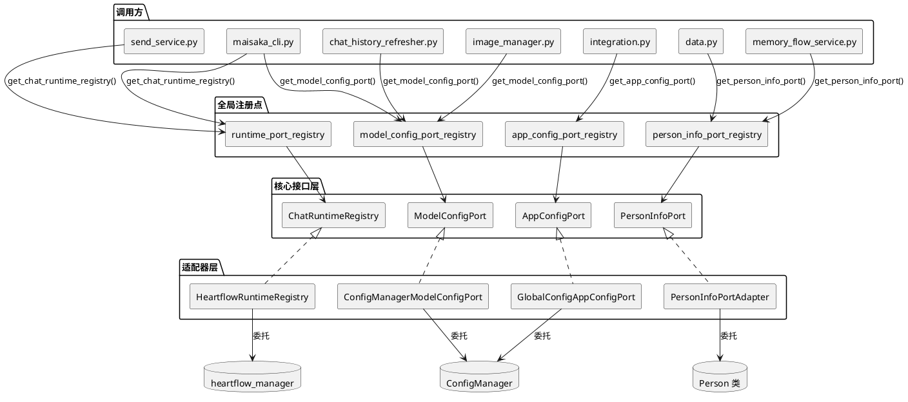
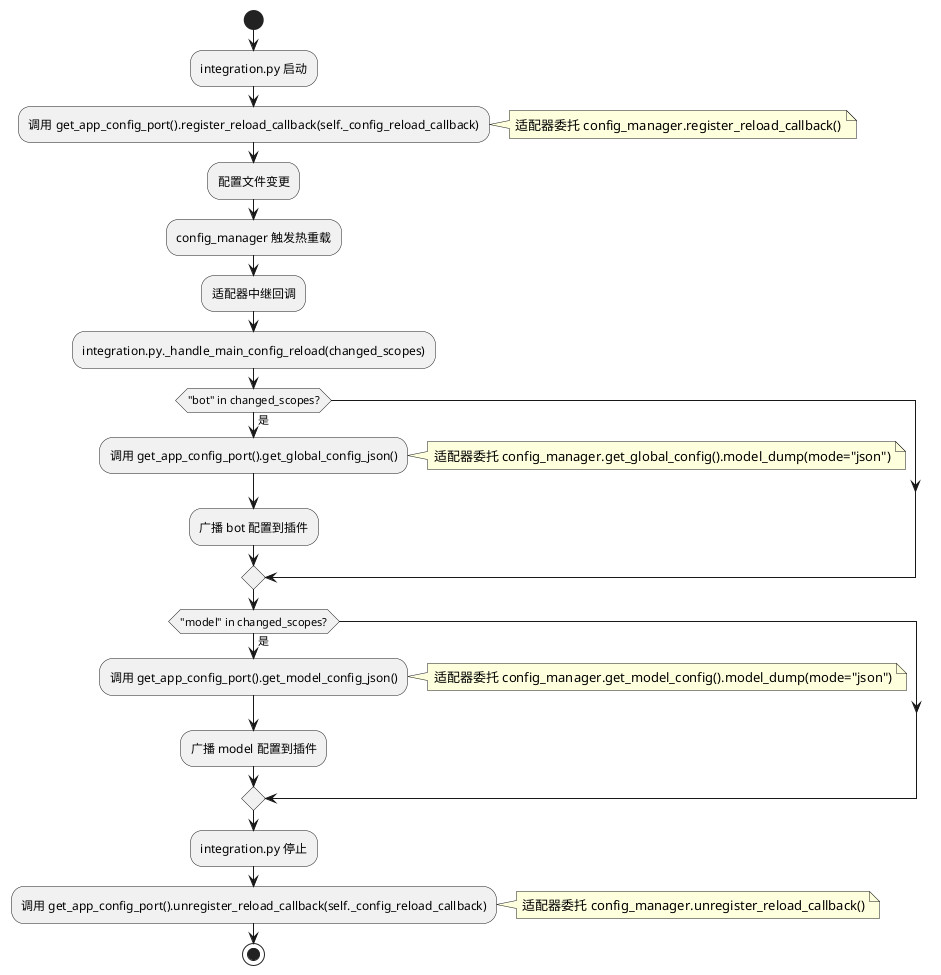
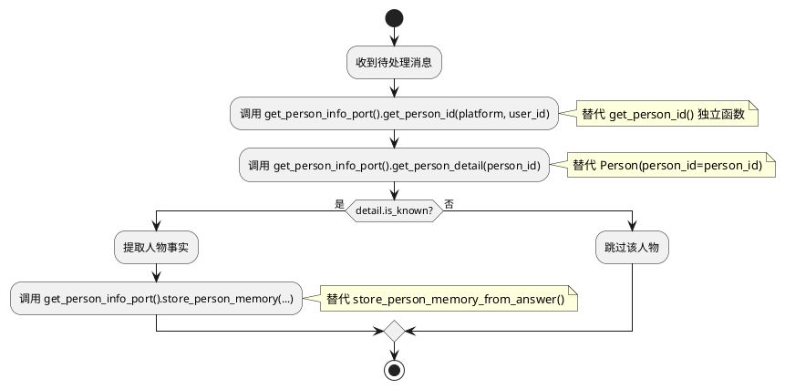
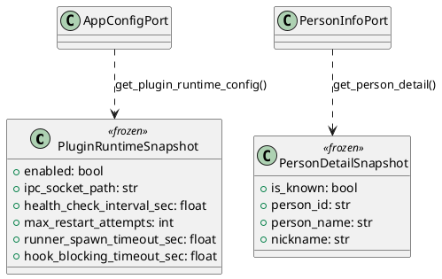

# SSD-12 设计文档：剩余 TID251 违规消除

# 一、需求与存量功能关系分析

## 1.1 需求功能与存量功能对比

### 1.1.1 已实现功能

| 需求功能 | 存量功能 | 代码位置 | 匹配度 |
|---------|---------|---------|--------|
| ModelConfigPort 模型配置查询（4方法） | `ModelConfigPort` Protocol + `ConfigManagerModelConfigPort` 适配器 | `src/core/protocols.py:715-789`, `src/core/adapters/model_config_port.py` | 100% |
| ModelConfigPort 热重载回调（2方法） | `register_reload_callback`/`unregister_reload_callback` 已在适配器实现 | `src/core/adapters/model_config_port.py:78-87` | 100% |
| ModelConfigPort 模块级注入点（3处） | `service_task_resolver.py`/`model_client/__init__.py`/`utils_model.py` 各有 `set_model_config_port()` | `src/services/service_task_resolver.py:14`, `src/llm_models/model_client/__init__.py:15`, `src/llm_models/utils_model.py` | 100% |
| ChatRuntimeRegistry 运行时查询（3方法） | `ChatRuntimeRegistry` Protocol + `HeartflowRuntimeRegistry` 适配器 | `src/core/protocols.py:210-241`, `src/core/adapters/runtime_registry.py` | 100% |
| ChatRuntimeRegistry 全局注册点 | `runtime_port_registry.py` 提供 `register/get` 函数对 | `src/core/runtime_port_registry.py` | 100% |
| PersonInfoPort 人物信息查询（1方法） | `PersonInfoPort` Protocol + `PersonInfoPortAdapter` 适配器 | `src/core/protocols.py:906-911`, `src/core/adapters/person_info_port.py` | 100% |
| PersonInfoPort 全局注册点 | `person_info_port_registry.py` 提供 `get/set/reset` 三函数 | `src/core/person_info_port_registry.py` | 100% |
| AppConfigPort 应用配置查询（~60方法） | `AppConfigPort` Protocol + `GlobalConfigAppConfigPort` 适配器 | `src/core/protocols.py:944-1026`, `src/core/adapters/app_config_port.py` | 100% |
| AppConfigPort 全局注册点 | `app_config_port_registry.py` 提供 `get/set/reset` 三函数 | `src/core/app_config_port_registry.py` | 100% |

### 1.1.2 需要扩展的功能

| 需求功能 | 存量功能 | 差异说明 | 扩展方向 |
|---------|---------|---------|---------|
| ModelConfigPort 全局注册点 | 3 处模块级 `set_model_config_port()` 注入（service_task_resolver/model_client/utils_model），无统一 registry | 调用方（image_manager/chat_history_refresher/maisaka_cli/integration）无法通过统一入口获取 Port；3 处注入点各自维护独立变量，需逐一注入 | 新建 `model_config_port_registry.py`，遵循 `register/get/reset` 三函数模式；3 处现有注入点改为调用 registry |
| AppConfigPort 插件运行时配置查询 | 无 `get_plugin_runtime_config()` 方法 | `integration.py:565` 通过 `config_manager.get_global_config().plugin_runtime` 直接访问 enabled/ipc_socket_path 等 6 个属性 | AppConfigPort 追加 `get_plugin_runtime_config() -> PluginRuntimeSnapshot` |
| AppConfigPort 热重载回调注册/注销 | 无 `register_reload_callback()`/`unregister_reload_callback()` 方法 | `integration.py:600,609,630` 通过 `config_manager.register_reload_callback()`/`unregister_reload_callback()` 直接操作 | AppConfigPort 追加 2 方法，适配器委托 `config_manager` |
| AppConfigPort 全局配置序列化 | 无 `get_global_config_json()` 方法 | `integration.py:1116` 通过 `config_manager.get_global_config().model_dump(mode="json")` 序列化 | AppConfigPort 追加 `get_global_config_json() -> str` |
| AppConfigPort 模型配置序列化 | 无 `get_model_config_json()` 方法 | `integration.py:1118` 通过 `config_manager.get_model_config().model_dump(mode="json")` 序列化 | AppConfigPort 追加 `get_model_config_json() -> str` |
| ChatRuntimeRegistry 同步运行时查询 | 仅有异步 `get_runtime(session_id)` | `send_service.py:739` 需要 `heartflow_manager.heartflow_chat_list.get(session_id)` 同步查询（延迟导入），异步方法无法满足 | ChatRuntimeRegistry 追加 `get_runtime_sync(session_id) -> Optional[ChatRuntime]` |
| ChatRuntimeRegistry 运行时移除 | 无 `remove_runtime()` 方法 | `maisaka_cli.py:123` 需要 `heartflow_manager.heartflow_chat_list.pop(session_id)` 移除并停止运行时 | ChatRuntimeRegistry 追加 `remove_runtime(session_id) -> Optional[ChatRuntime]` |
| PersonInfoPort person_id 解析（平台+用户ID） | 仅有 `get_person_info(platform, user_id) -> PersonInfoResult`，返回 PersonInfoResult 含 person_id 但需解析 | `data.py:571` 和 `memory_flow_service.py:142,191` 通过 `Person(platform=platform, user_id=user_id).person_id` 获取 | PersonInfoPort 追加 `get_person_id(platform, user_id) -> str` |
| PersonInfoPort person_id 解析（用户名） | 无对应方法 | `data.py:603` 通过 `Person(person_name=person_name).person_id` 获取 | PersonInfoPort 追加 `get_person_id_by_name(person_name) -> str` |
| PersonInfoPort 人物属性获取 | 无对应方法 | `data.py:587` 通过 `getattr(Person(person_id=person_id), field_name)` 获取 | PersonInfoPort 追加 `get_person_attribute(person_id, field_name) -> Any` |
| PersonInfoPort 人物详情查询 | `get_person_info` 返回 `PersonInfoResult`（仅含 is_known/person_id/person_name），缺少 nickname 等字段 | `memory_flow_service.py:143-144` 需要 `person.is_known`/`person.person_name`/`person.nickname` | PersonInfoPort 追加 `get_person_detail(person_id) -> Optional[PersonDetailSnapshot]` |
| PersonInfoPort 人物记忆写回 | 无对应方法 | `memory_flow_service.py:124` 通过 `store_person_memory_from_answer()` 独立函数写回 | PersonInfoPort 追加 `store_person_memory(...)` |

### 1.1.3 需要新增的功能或接口

**快照类型（2 个新增）**：

1. **PluginRuntimeSnapshot**（frozen dataclass）
   - 输入：`config_manager.get_global_config().plugin_runtime`
   - 输出：enabled/ipc_socket_path/health_check_interval_sec/max_restart_attempts/runner_spawn_timeout_sec/hook_blocking_timeout_sec 6 个字段的不可变快照
   - 核心逻辑：纯值对象，适配器从 `global_config.plugin_runtime` 构造
   - 依赖：AppConfigPort

2. **PersonDetailSnapshot**（frozen dataclass）
   - 输入：`Person(person_id=...)` 实例
   - 输出：is_known/person_id/person_name/nickname 4 个字段的不可变快照
   - 核心逻辑：纯值对象，适配器从 Person 实例构造
   - 依赖：PersonInfoPort

**全局注册点（1 个新增）**：

1. **model_config_port_registry.py**
   - 输入：`ModelConfigPort` 实例
   - 输出：`register_model_config_port()`/`get_model_config_port()`/`reset_model_config_port()` 三函数
   - 核心逻辑：模块级单例，与 `app_config_port_registry.py` 模式一致
   - 依赖：ModelConfigPort Protocol

## 1.2 存量功能详细分析

### ModelConfigPort（当前 4+2 方法）

**接口契约**：
- `get_task_config(task_name, *, agent_id="") -> TaskConfig` — 按任务名查询配置
- `get_model_info(model_name) -> ModelInfo` — 按模型名查询信息
- `get_provider(provider_name) -> APIProvider` — 按提供商名查询配置
- `get_model_config() -> ModelConfig` — 获取完整模型配置
- `register_reload_callback(callback) -> None` — 注册热重载回调
- `unregister_reload_callback(callback) -> None` — 注销热重载回调

**业务规则**：`get_task_config` 支持 `agent_id` 参数实现智能体级覆盖合并，其余方法返回全局配置。

**扩展点**：Protocol 使用 `@runtime_checkable`，鸭子类型兼容，新增方法不破坏已有实现。

**约束**：适配器 `ConfigManagerModelConfigPort` 在构造时注册 `config_manager` 的热重载回调，维护 `_reload_callbacks` 列表传播重载事件。

**当前注入点问题**：3 处模块级 `set_model_config_port()` 各自维护独立变量（`service_task_resolver._model_config_port`、`model_client._model_config_port`、`utils_model._model_config_port`），调用方无法通过统一入口获取 Port。需要新建全局注册点统一管理。

### ChatRuntimeRegistry（当前 3 方法）

**接口契约**：
- `get_runtime(session_id) -> Optional[ChatRuntime]` — 异步获取运行时
- `get_or_create_runtime(session_id) -> ChatRuntime` — 异步获取或创建运行时
- `list_runtimes() -> list[ChatRuntime]` — 列出所有运行时

**业务规则**：所有方法均为异步，底层委托 `heartflow_manager.heartflow_chat_list`。

**扩展点**：需要新增同步方法 `get_runtime_sync()` 和移除方法 `remove_runtime()`。

**约束**：`heartflow_chat_list` 是普通 dict，当前所有访问均在事件循环内，无并发问题。`get_runtime_sync()` 是同步字典查找，响应时间 ≤0.1ms。

### PersonInfoPort（当前 1 方法）

**接口契约**：
- `get_person_info(platform, user_id) -> Optional[PersonInfoResult]` — 查询人物信息

**业务规则**：返回 `PersonInfoResult`（含 is_known/person_id/person_name），适配器内部创建 `Person(platform=platform, user_id=user_id)` 实例。

**扩展点**：需要新增 5 个方法覆盖 person_id 解析、属性获取、详情查询、记忆写回场景。

**约束**：`Person` 类构造函数会触发数据库查询（`is_person_known` + `load_from_database`），`get_person_id()` 是纯 MD5 哈希计算无数据库访问。`store_person_memory_from_answer()` 是异步函数，依赖 `get_memory_service_port()` 和 `get_session_info()`。

### AppConfigPort（当前 ~60 方法）

**接口契约**：覆盖 expression/emoji/experimental/visual/debug/agent_autonomy/a_memorix/mcp/response_splitter/chinese_typo/response_post_process/log/webui/agent/agent_interaction/voice/maim_message/telemetry/message_receive 等域。

**业务规则**：所有方法返回具体类型或 frozen 快照，不暴露 Pydantic 模型。

**扩展点**：需要新增 5 个方法覆盖 plugin_runtime 配置查询、热重载回调、配置序列化。

**约束**：适配器 `GlobalConfigAppConfigPort` 通过 `_get_cfg()` 懒加载 `global_config`。热重载回调需委托 `config_manager`，适配器是唯一允许导入 `config_manager` 的地方。

### integration.py config_manager 使用详细分析

**使用场景 1 — 插件运行时配置查询（2 处）**：
- L290: `config_manager.get_global_config().plugin_runtime` — `_resolve_supervisor_socket_paths()` 读取 ipc_socket_path
- L565: `config_manager.get_global_config().plugin_runtime` — `start()` 读取 enabled 判断是否启动

**使用场景 2 — 热重载回调注册/注销（3 处）**：
- L600: `config_manager.register_reload_callback(self._config_reload_callback)` — 启动时注册
- L609: `config_manager.unregister_reload_callback(self._config_reload_callback)` — 启动失败时注销
- L630: `config_manager.unregister_reload_callback(self._config_reload_callback)` — 停止时注销

**使用场景 3 — 配置序列化广播（2 处）**：
- L1116: `config_manager.get_global_config().model_dump(mode="json")` — 广播 bot 配置
- L1118: `config_manager.get_model_config().model_dump(mode="json")` — 广播 model 配置

**约束**：热重载回调签名 `Callable[[Sequence[str]], Awaitable[None]]`，`config_manager` 调用时传 `changed_scopes` 参数。适配器层需确保回调签名兼容。

### memory_flow_service.py Person 使用详细分析

**使用场景 1 — Person 类实例化**：
- L143: `Person(person_id=person_id)` — `_resolve_target_person()` 中创建实例判断 is_known
- L192: `Person(person_id=person_id)` — `_person_from_user_message()` 中创建实例判断 is_known

**使用场景 2 — get_person_id 函数**：
- L142: `get_person_id(session_platform, session_user_id)` — 将 platform+user_id 转为 person_id
- L191: `get_person_id(platform, user_id)` — 同上
- L273: `get_person_id(platform, user_id)` — `_filter_target_user_messages()` 中匹配 person_id

**使用场景 3 — store_person_memory_from_answer 函数**：
- L124-131: `store_person_memory_from_answer(person_name, fact, session_id, ...)` — 写回人物事实记忆

**约束**：`memory_flow_service.py` 中 `Person` 实例仅用于读取 `is_known`/`person_name`/`nickname`/`person_id` 属性，不调用修改方法。`get_person_id` 是纯 MD5 计算，无数据库访问。`store_person_memory_from_answer` 是异步函数，内部依赖 `get_memory_service_port()` 和 `get_session_info()`。

# 二、增量设计方案

## 2.1 实现模型

### 2.1.1 上下文视图



### 2.1.2 服务/组件总体架构

```plantuml
@startuml
skinparam componentStyle rectangle

package "src/core/protocols.py" {
    interface ModelConfigPort {
        ..已有 4+2 方法..
        +get_task_config() -> TaskConfig
        +get_model_info() -> ModelInfo
        +get_provider() -> APIProvider
        +get_model_config() -> ModelConfig
        +register_reload_callback()
        +unregister_reload_callback()
    }
    interface AppConfigPort {
        ..已有 ~60 方法..
        +get_plugin_runtime_config() -> PluginRuntimeSnapshot
        +register_reload_callback()
        +unregister_reload_callback()
        +get_global_config_json() -> str
        +get_model_config_json() -> str
    }
    interface ChatRuntimeRegistry {
        ..已有 3 方法..
        +get_runtime_sync(session_id) -> Optional[ChatRuntime]
        +remove_runtime(session_id) -> Optional[ChatRuntime]
    }
    interface PersonInfoPort {
        ..已有 1 方法..
        +get_person_id(platform, user_id) -> str
        +get_person_id_by_name(person_name) -> str
        +get_person_attribute(person_id, field_name) -> Any
        +get_person_detail(person_id) -> Optional[PersonDetailSnapshot]
        +store_person_memory(...) -> None
    }
}

package "src/core/types.py" {
    class PluginRuntimeSnapshot <<frozen>> {
        +enabled: bool
        +ipc_socket_path: str
        +health_check_interval_sec: float
        +max_restart_attempts: int
        +runner_spawn_timeout_sec: float
        +hook_blocking_timeout_sec: float
    }
    class PersonDetailSnapshot <<frozen>> {
        +is_known: bool
        +person_id: str
        +person_name: str
        +nickname: str
    }
}

package "src/core/model_config_port_registry.py" {
    note "register_model_config_port()\nget_model_config_port()\nreset_model_config_port()"
}

package "src/core/adapters/" {
    class ConfigManagerModelConfigPort {
        ..已有实现..
    }
    class GlobalConfigAppConfigPort {
        ..已有实现..
        +get_plugin_runtime_config()
        +register_reload_callback()
        +unregister_reload_callback()
        +get_global_config_json()
        +get_model_config_json()
    }
    class HeartflowRuntimeRegistry {
        ..已有实现..
        +get_runtime_sync()
        +remove_runtime()
    }
    class PersonInfoPortAdapter {
        ..已有实现..
        +get_person_id()
        +get_person_id_by_name()
        +get_person_attribute()
        +get_person_detail()
        +store_person_memory()
    }
}

ModelConfigPort <|.. ConfigManagerModelConfigPort
AppConfigPort <|.. GlobalConfigAppConfigPort
ChatRuntimeRegistry <|.. HeartflowRuntimeRegistry
PersonInfoPort <|.. PersonInfoPortAdapter
@enduml
```

### 2.1.3 实现设计文档

#### integration.py 热重载回调替换流程



#### memory_flow_service.py Person 替换流程



## 2.2 接口设计

### 2.2.1 总体设计

**接口分类**：

| 分类 | Protocol | 新增方法数 | 策略 |
|------|----------|-----------|------|
| 模型配置 | ModelConfigPort | 0（已有方法足够） | 复用 `get_task_config("vlm")`/`get_task_config("planner")`/`get_model_config()` |
| 应用配置 | AppConfigPort | +5 | plugin_runtime 快照(1) + 热重载回调(2) + 配置序列化(2) |
| 运行时注册表 | ChatRuntimeRegistry | +2 | 同步查询(1) + 运行时移除(1) |
| 人物信息 | PersonInfoPort | +5 | person_id 解析(2) + 属性获取(1) + 详情查询(1) + 记忆写回(1) |
| 全局注册点 | model_config_port_registry.py | 新建 | register/get/reset 三函数 |

**接口变更策略**：只追加方法，不修改已有方法签名，不删除已有方法。

**稳定性等级**：
- ModelConfigPort/AppConfigPort/ChatRuntimeRegistry/PersonInfoPort：稳定（新增方法不影响已有消费者）
- PluginRuntimeSnapshot/PersonDetailSnapshot：稳定

### 2.2.2 接口清单

#### ModelConfigPort — 无新增方法，新建全局注册点

**D1: 全局注册点**

```python
# src/core/model_config_port_registry.py
def register_model_config_port(port: ModelConfigPort) -> None: ...
def get_model_config_port() -> Optional[ModelConfigPort]: ...
def reset_model_config_port() -> None: ...
```

**决策理由**：当前 3 处模块级 `set_model_config_port()` 注入点（service_task_resolver/model_client/utils_model）各自维护独立变量，调用方无法通过统一入口获取 Port。新建全局注册点遵循与 `app_config_port_registry.py`/`person_info_port_registry.py` 相同的 `register/get/reset` 三函数模式。

**替代方案**：复用现有 3 处注入点之一 — 拒绝，三处注入点各自独立，调用方需知道具体用哪个，违反统一入口原则。

**调用方替换映射**：

| 调用方 | 原始调用 | 替换后调用 |
|--------|---------|-----------|
| image_manager.py:38 | `config_manager.get_model_config().model_task_config.vlm.model_list` | `get_model_config_port().get_task_config("vlm").model_list` |
| maisaka_cli.py:41-43 | `config_manager.get_model_config().model_task_config.planner.model_list[0]` | `get_model_config_port().get_task_config("planner").model_list[0]` |
| chat_history_refresher.py:153 | `config_manager.get_model_config().model_task_config.vlm.model_list` | `get_model_config_port().get_task_config("vlm").model_list` |
| integration.py:1118 | `config_manager.get_model_config().model_dump(mode="json")` | `get_model_config_port().get_model_config().model_dump(mode="json")` |

**3 处现有注入点迁移**：`service_task_resolver.set_model_config_port()`/`model_client.set_model_config_port()`/`utils_model.set_model_config_port()` 改为调用 `model_config_port_registry.register_model_config_port()`，同时从 registry 获取 Port。

#### AppConfigPort 新增方法

**D2: plugin_runtime 配置 — 整体快照（1 方法）**

```python
def get_plugin_runtime_config(self) -> PluginRuntimeSnapshot: ...
```

**决策理由**：plugin_runtime 有 6 个属性被 integration.py 访问（enabled/ipc_socket_path/health_check_interval_sec/max_restart_attempts/runner_spawn_timeout_sec/hook_blocking_timeout_sec），整体快照比逐属性暴露更合适——integration.py 在 `_resolve_supervisor_socket_paths()` 中需要 ipc_socket_path，在 `start()` 中需要 enabled，在 `_build_supervisors()` 中可能需要其他属性。整体快照一次返回所有配置，避免多次调用。

**替代方案**：逐属性暴露 6 个方法 — 拒绝，6 个属性全部属于同一配置域且被同一调用方使用，整体快照更简洁。

**D3: 热重载回调 — 注册/注销（2 方法）**

```python
def register_reload_callback(self, callback: object) -> None: ...
def unregister_reload_callback(self, callback: object) -> None: ...
```

**决策理由**：integration.py 需要在启动/停止时注册/注销热重载回调，当前直接调用 `config_manager.register_reload_callback()`/`unregister_reload_callback()`。适配器层直接委托 `config_manager`，不做额外逻辑。

**注意**：`ModelConfigPort` 已有 `register_reload_callback()`/`unregister_reload_callback()` 方法，但那是模型配置域的回调。`AppConfigPort` 的回调是全局配置域的回调，两者委托同一个 `config_manager` 但语义不同。由于 integration.py 的回调关心的是 bot/model 两个 scope 的变更，使用 `AppConfigPort` 更合适（AppConfigPort 是全局配置的聚合接口）。

**D4: 配置序列化 — 全局/模型（2 方法）**

```python
def get_global_config_json(self) -> str: ...
def get_model_config_json(self) -> str: ...
```

**决策理由**：integration.py 在 `_handle_main_config_reload()` 中需要将全局配置和模型配置序列化为 JSON 广播给插件。`get_global_config_json()` 委托 `config_manager.get_global_config().model_dump(mode="json")`，`get_model_config_json()` 委托 `config_manager.get_model_config().model_dump(mode="json")`。

**替代方案**：使用 `get_model_config_port().get_model_config().model_dump(mode="json")` 替代 `get_model_config_json()` — 可接受但增加了调用方对 `ModelConfig` 类型的依赖。通过 `AppConfigPort` 提供序列化方法，调用方只需处理 `str` 类型，更简洁。

#### ChatRuntimeRegistry 新增方法

**D5: 同步运行时查询（1 方法）**

```python
def get_runtime_sync(self, session_id: str) -> Optional[ChatRuntime]: ...
```

**决策理由**：send_service.py:737-742 使用延迟导入 `heartflow_manager` 进行同步字典查找。`get_runtime_sync()` 是同步方法，直接委托 `heartflow_manager.heartflow_chat_list.get(session_id)`，响应时间 ≤0.1ms。与已有的异步 `get_runtime()` 并存，调用方根据场景选择。

**替代方案**：修改 send_service.py 为异步调用 `get_runtime()` — 拒绝，send_service.py 的 `_sync_sent_message_to_maisaka_history()` 是同步函数，改为异步需要修改整个调用链，影响面过大。

**D6: 运行时移除（1 方法）**

```python
def remove_runtime(self, session_id: str) -> Optional[ChatRuntime]: ...
```

**决策理由**：maisaka_cli.py:123 使用 `heartflow_manager.heartflow_chat_list.pop(session_id)` 移除并停止运行时。`remove_runtime()` 委托 `heartflow_manager.heartflow_chat_list.pop(session_id, None)`，返回被移除的运行时实例（或 None），调用方负责 `await runtime.stop()`。

**替代方案**：在 `remove_runtime()` 内部调用 `await runtime.stop()` — 拒绝，`remove_runtime()` 是同步方法（与 `dict.pop()` 语义一致），`runtime.stop()` 是异步方法，不应在同步方法内调用异步操作。调用方在获取返回值后自行 `await runtime.stop()`。

#### PersonInfoPort 新增方法

**D7: person_id 解析 — 平台+用户ID（1 方法）**

```python
def get_person_id(self, platform: str, user_id: str) -> str: ...
```

**决策理由**：data.py:571 和 memory_flow_service.py:142,191,273 通过 `Person(platform=platform, user_id=user_id).person_id` 或 `get_person_id(platform, user_id)` 获取 person_id。`get_person_id()` 是纯 MD5 哈希计算（`person_info.py:49-55`），无数据库访问，性能等价。

**D8: person_id 解析 — 用户名（1 方法）**

```python
def get_person_id_by_name(self, person_name: str) -> str: ...
```

**决策理由**：data.py:603 通过 `Person(person_name=person_name).person_id` 获取。底层委托 `get_person_id_by_person_name(person_name)`（`person_info.py:58-67`），查数据库，不存在时返回空字符串。

**D9: 人物属性获取（1 方法）**

```python
def get_person_attribute(self, person_id: str, field_name: str) -> Any: ...
```

**决策理由**：data.py:587 通过 `getattr(Person(person_id=person_id), field_name)` 获取。适配器内部创建 `Person` 实例并调用 `getattr`，字段不存在时返回 None。

**约束**：`field_name` 限于 Person 实例的安全属性（person_name/nickname/person_id/is_known 等），适配器可维护白名单校验，但当前 spec 不要求（与 `getattr` 行为一致）。

**D10: 人物详情查询（1 方法）**

```python
def get_person_detail(self, person_id: str) -> Optional[PersonDetailSnapshot]: ...
```

**决策理由**：memory_flow_service.py:143-144 需要 `person.is_known`/`person.person_name`/`person.nickname`。`get_person_info()` 已返回 `PersonInfoResult`（含 is_known/person_id/person_name），但缺少 nickname 字段。新增 `get_person_detail()` 返回 `PersonDetailSnapshot`（含 is_known/person_id/person_name/nickname），与 `get_person_info()` 互补。

**替代方案**：扩展 `PersonInfoResult` 新增 nickname 字段 — 拒绝，`PersonInfoResult` 是已有类型，修改影响已有消费者。新增 `PersonDetailSnapshot` 更安全。

**D11: 人物记忆写回（1 方法）**

```python
async def store_person_memory(
    self,
    person_name: str,
    fact: str,
    session_id: str,
    *,
    person_id: str = "",
    evidence_source: str = "user_supported",
    evidence_message_ids: list[str] | None = None,
) -> None: ...
```

**决策理由**：memory_flow_service.py:124-131 通过 `store_person_memory_from_answer()` 写回人物事实记忆。方法签名与 `store_person_memory_from_answer()` 保持一致，适配器直接委托。

**约束**：这是 PersonInfoPort 中唯一的异步方法和唯一的写操作。`store_person_memory_from_answer()` 内部依赖 `get_memory_service_port()` 和 `get_session_info()`，适配器需确保这些依赖可用。

## 2.3 数据模型

### 2.3.1 设计目标

1. 支持所有 10 处 TID251 违规的替代方案，消除 `config_manager`/`heartflow_manager`/`Person` 直接导入
2. 快照类型不可变（frozen dataclass），与已有 ReplyStyleSnapshot/AgentAutonomySnapshot 模式一致
3. PluginRuntimeSnapshot/PersonDetailSnapshot 所有字段有默认值，不破坏 frozen dataclass 兼容性
4. 全局注册点遵循 `register/get/reset` 三函数模式

### 2.3.2 模型实现



**对象创建策略**：
- 快照由适配器方法在每次调用时构造（与已有 `get_agent_autonomy_config()` 模式一致）
- 所有字段有默认值，确保 frozen dataclass 兼容性

**对象销毁策略**：无状态，快照为值对象，GC 自动回收。

**持久化策略**：快照是运行时只读投影，不持久化。配置变更通过 `config_manager` 热重载机制反映到下次快照构造。

### 2.3.3 批次策略

**D12: 分批策略 — 按依赖关系排序**

| 批次 | 范围 | 改动量 | 理由 |
|------|------|--------|------|
| 0 | 快照类型 + Protocol 方法签名 + 全局注册点 | 4 文件（types.py + protocols.py + model_config_port_registry.py 新建） | 基础设施先行，后续批次依赖 |
| 1 | 适配器实现 | 4 文件（model_config_port.py + app_config_port.py + runtime_registry.py + person_info_port.py） | 依赖批次 0 的 Protocol 定义 |
| 2 | 现有注入点迁移 | 3 文件（service_task_resolver.py + model_client/__init__.py + utils_model.py） | 依赖批次 0 的 model_config_port_registry |
| 3 | config_manager 违规迁移 — VLM/planner 查询 | 3 文件（image_manager.py + chat_history_refresher.py + maisaka_cli.py 的 config_manager 部分） | 依赖批次 1 的 ModelConfigPort 适配器 |
| 4 | config_manager 违规迁移 — integration.py | 1 文件（integration.py） | 依赖批次 1 的 AppConfigPort 适配器 |
| 5 | heartflow_manager 违规迁移 | 2 文件（maisaka_cli.py 的 heartflow_manager 部分 + send_service.py） | 依赖批次 1 的 HeartflowRuntimeRegistry 适配器 |
| 6 | Person 违规迁移 — data.py | 1 文件（data.py） | 依赖批次 1 的 PersonInfoPortAdapter |
| 7 | Person 违规迁移 — memory_flow_service.py | 1 文件（memory_flow_service.py） | 依赖批次 1 的 PersonInfoPortAdapter |
| 8 | ruff 守卫验证 + AGENTS.md 更新 | 2 文件（pyproject.toml + AGENTS.md） | 收尾 |

**替代方案**：按违规类别分批（config_manager 一批/heartflow_manager 一批/Person 一批）— 拒绝，maisaka_cli.py 同时涉及 config_manager 和 heartflow_manager 两个违规，按文件分批更实际。

### 2.3.4 文件清单

#### 新增文件

| 文件 | 用途 | 批次 |
|------|------|------|
| `src/core/model_config_port_registry.py` | ModelConfigPort 全局注册点 | 0 |

#### 修改文件

| 文件 | 改动 | 批次 |
|------|------|------|
| `src/core/types.py` | 新增 PluginRuntimeSnapshot/PersonDetailSnapshot | 0 |
| `src/core/protocols.py` | AppConfigPort 追加 5 方法 + ChatRuntimeRegistry 追加 2 方法 + PersonInfoPort 追加 5 方法 | 0 |
| `src/core/adapters/model_config_port.py` | 无改动（已有方法足够） | — |
| `src/core/adapters/app_config_port.py` | GlobalConfigAppConfigPort 追加 5 方法实现 | 1 |
| `src/core/adapters/runtime_registry.py` | HeartflowRuntimeRegistry 追加 2 方法实现 | 1 |
| `src/core/adapters/person_info_port.py` | PersonInfoPortAdapter 追加 5 方法实现 | 1 |
| `src/services/service_task_resolver.py` | `set_model_config_port()` 改为调用 registry | 2 |
| `src/llm_models/model_client/__init__.py` | `set_model_config_port()` 改为调用 registry | 2 |
| `src/llm_models/utils_model.py` | `set_model_config_port()` 改为调用 registry | 2 |
| `src/chat/image_system/image_manager.py` | config_manager → get_model_config_port() | 3 |
| `src/maisaka/visual/chat_history_refresher.py` | config_manager → get_model_config_port() | 3 |
| `src/cli/maisaka_cli.py` | config_manager → get_model_config_port() + heartflow_manager → get_chat_runtime_registry() | 3+5 |
| `src/plugin_runtime/integration.py` | config_manager → get_app_config_port() | 4 |
| `src/services/send_service.py` | heartflow_manager → get_chat_runtime_registry() | 5 |
| `src/plugin_runtime/capabilities/data.py` | Person → get_person_info_port() | 6 |
| `src/services/memory_flow_service.py` | Person/get_person_id/store_person_memory_from_answer → get_person_info_port() | 7 |
| `AGENTS.md` | Protocol 表格更新 + 核心禁止项状态更新 | 8 |