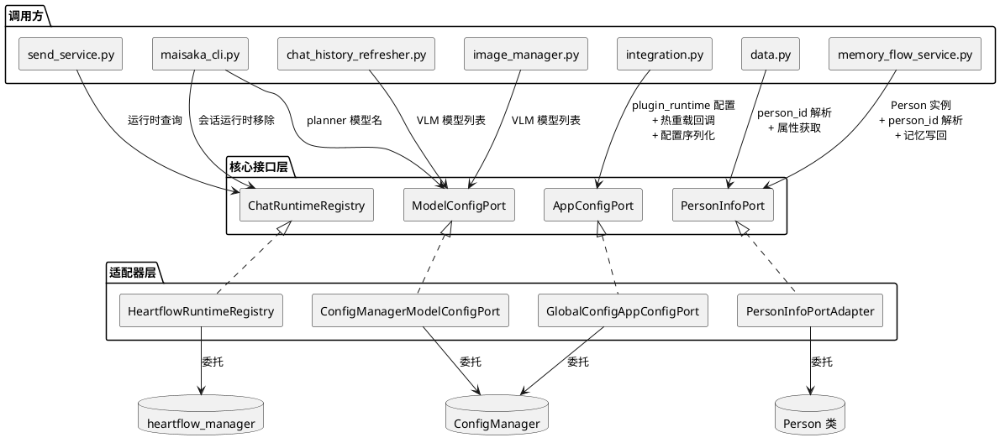
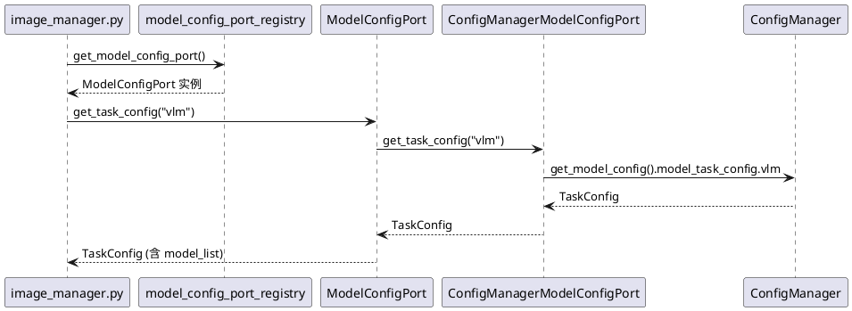
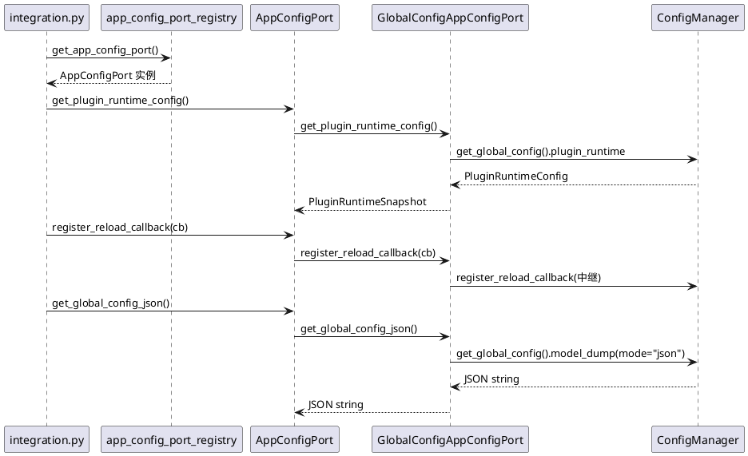
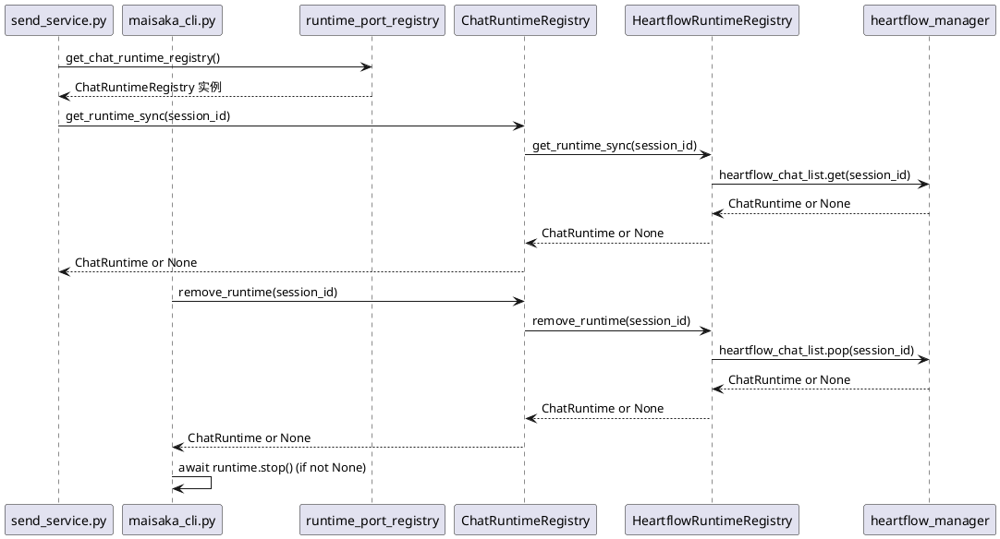
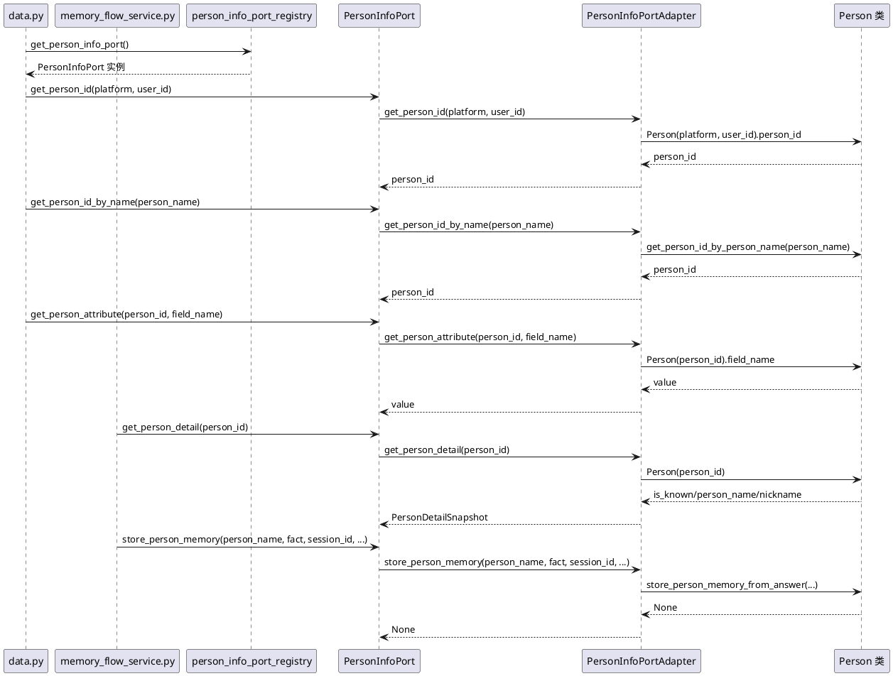

# SSD-12: 剩余 TID251 违规消除

## 背景

SSD-11 完成了 `global_config` TID251 从 41 处降至 0 处，建立了 `AppConfigPort`（~40 方法）、`ChatConfigPort`（~10 方法）等 Protocol 接口覆盖全部配置域。但项目中仍有 **10 处**非 `global_config` 的 TID251 违规，分布在三类单例/类的直接导入上：

| 类别 | 违规数 | 导入目标 |
|------|--------|---------|
| `config_manager` | 4 | `from src.config.config import config_manager` |
| `heartflow_manager` | 2 | `from src.chat.heart_flow.heartflow_manager import heartflow_manager` |
| `Person` | 4 | `from src.person_info.person_info import Person` |

这些违规与 `global_config` 性质相同：调用方直接依赖具体实现类，违反微内核 + 接口契约原则。SSD-12 的目标是通过已有 Protocol 扩展 + 适配器实现 + 调用方替换，将 10 处 TID251 违规清零。

## 遗留违规清单与使用场景

### config_manager TID251（4 处）

| # | 文件 | 行号 | 使用场景 |
|---|------|------|---------|
| 1 | `src/chat/image_system/image_manager.py` | 16 | `config_manager.get_model_config().model_task_config.vlm.model_list` — 查询 VLM 模型列表，判断是否配置了视觉模型 |
| 2 | `src/cli/maisaka_cli.py` | 19 | `config_manager.get_model_config().model_task_config.planner.model_list[0]` — 读取 planner 模型名，显示在 CLI 横幅 |
| 3 | `src/maisaka/visual/chat_history_refresher.py` | 12 | `config_manager.get_model_config().model_task_config.vlm.model_list` — 与 #1 完全相同，判断 VLM 是否可用 |
| 4 | `src/plugin_runtime/integration.py` | 37 | 7 处使用：读取 plugin_runtime 配置（2处）、注册/注销热重载回调（3处）、序列化配置广播给插件（2处） |

### heartflow_manager TID251（2 处）

| # | 文件 | 行号 | 使用场景 |
|---|------|------|---------|
| 5 | `src/cli/maisaka_cli.py` | 13 | `heartflow_manager.heartflow_chat_list.pop(session_id)` — CLI 退出时移除并停止会话运行时 |
| 6 | `src/services/send_service.py` | 737 | `heartflow_manager.heartflow_chat_list.get(session_id)` — 延迟导入，获取运行时实例同步已发送消息到聊天历史 |

### Person TID251（4 处）

| # | 文件 | 行号 | 使用场景 |
|---|------|------|---------|
| 7 | `src/plugin_runtime/capabilities/data.py` | 563 | `Person(platform=platform, user_id=user_id).person_id` — 根据平台+用户ID获取 person_id |
| 8 | `src/plugin_runtime/capabilities/data.py` | 578 | `Person(person_id=person_id)` + `getattr(person, field_name)` — 根据 person_id 获取人物属性值 |
| 9 | `src/plugin_runtime/capabilities/data.py` | 596 | `Person(person_name=person_name).person_id` — 根据用户名获取 person_id |
| 10 | `src/services/memory_flow_service.py` | 19 | `Person` 类 + `get_person_id` + `store_person_memory_from_answer` — 创建 Person 实例判断 is_known、获取 person_name、写回人物记忆 |

## 已有 Protocol 基础

| Protocol | 当前方法 | 注册点 | 适配器 |
|----------|---------|--------|--------|
| `ModelConfigPort` | `get_task_config`/`get_model_info`/`get_provider`/`get_model_config` | 无全局注册点（仅模块级 `set_model_config_port` 注入） | `ConfigManagerModelConfigPort` |
| `ChatRuntimeRegistry` | `get_runtime`/`get_or_create_runtime`/`list_runtimes` | `runtime_port_registry.py` | `HeartflowRuntimeRegistry` |
| `PersonInfoPort` | `get_person_info(platform, user_id)` | `person_info_port_registry.py` | `PersonInfoPortAdapter` |
| `AppConfigPort` | ~40 方法 | `app_config_port_registry.py` | `GlobalConfigAppConfigPort` |

# 1. 组件定位

## 1.1 核心职责

本组件负责消除项目中剩余 10 处 TID251 违规，通过扩展已有 Protocol 接口和新建全局注册点，使调用方不再直接导入 `config_manager`/`heartflow_manager`/`Person` 具体类。

## 1.2 核心输入

1. `config_manager` 的模型配置查询请求（VLM 模型列表、planner 模型名）
2. `config_manager` 的插件运行时配置查询请求（enabled、ipc_socket_path）
3. `config_manager` 的热重载回调注册/注销请求
4. `config_manager` 的配置序列化请求（全局配置 JSON、模型配置 JSON）
5. `heartflow_manager` 的运行时查询请求（按 session_id 获取/移除运行时）
6. `Person` 类的人物信息查询请求（person_id 解析、属性获取、记忆写回）

## 1.3 核心输出

1. 通过 `ModelConfigPort` 返回的模型任务配置（VLM model_list、planner model_list）
2. 通过 `AppConfigPort` 返回的插件运行时配置快照
3. 通过 `AppConfigPort` 提供的热重载回调注册/注销能力
4. 通过 `AppConfigPort`/`ModelConfigPort` 返回的配置序列化 JSON
5. 通过 `ChatRuntimeRegistry` 返回的运行时实例（获取/移除）
6. 通过 `PersonInfoPort` 返回的人物信息（person_id、属性值、记忆写回结果）

## 1.4 职责边界

1. **不**创建新的独立 Protocol 类型 — 只扩展已有 `ModelConfigPort`/`AppConfigPort`/`ChatRuntimeRegistry`/`PersonInfoPort`
2. **不**修改 `config_manager`/`heartflow_manager`/`Person` 类的内部实现
3. **不**改变任何运行时行为 — 纯重构，功能等价替换
4. **不**处理 SSD-11 整体对象 noqa 保留的 8 处场景
5. **不**新增 `ConfigUpgradeHook` — 只改模板+新增版本号

# 2. 领域术语

**TID251 违规**
: 代码中直接导入具体实现类（如 `config_manager`、`heartflow_manager`、`Person`）而非通过 Protocol 接口访问的行为，被 ruff TID251 规则检测并标记。

**全局注册点**
: 模块级单例注册/获取函数对（`register_*_port()`/`get_*_port()`/`reset_*_port()`），使调用方无需持有 Port 实例引用即可访问 Protocol 接口。

**VLM 模型列表**
: 视觉语言模型（Vision Language Model）的任务配置列表，用于判断系统是否具备图片识别能力。

**plugin_runtime 配置**
: 插件运行时的启停、IPC 通信、健康检查等配置，属于 `global_config.plugin_runtime` 域。

**热重载回调**
: 配置文件变更后由 `ConfigManager` 触发的回调函数，用于通知订阅方配置已更新。

**person_id**
: 用户的唯一标识符，由 `platform` + `user_id` 经 MD5 哈希生成，是人物信息的核心索引。

# 3. 角色与边界

## 3.1 核心角色

- **CLI 用户**：通过命令行与 MaiBot 交互，触发 `maisaka_cli.py` 中的模型配置查询和会话运行时管理
- **插件开发者**：通过插件能力接口查询人物信息，触发 `data.py` 中的人物 ID 解析和属性获取

## 3.2 外部系统

- **ConfigManager**：配置管理单例，提供模型配置查询、全局配置查询、热重载回调注册、配置序列化能力
- **heartflow_manager**：会话运行时管理单例，提供运行时实例的获取、创建、移除能力
- **Person 类**：人物信息领域对象，提供 person_id 解析、属性查询、记忆写回能力

## 3.3 交互上下文

# 4. DFX 约束

## 4.1 性能

1. `ModelConfigPort.get_task_config()` 查询必须为纯内存操作，响应时间 ≤1ms
2. `PersonInfoPort` 新增方法的 person_id 解析必须与现有 `get_person_id()` 性能等价
3. `ChatRuntimeRegistry.get_runtime_sync()` 必须为同步字典查找，响应时间 ≤0.1ms

## 4.2 可靠性

1. Protocol 方法返回值必须与直接调用具体类的返回值语义等价
2. 适配器层异常必须向上传播，不吞没、不兜底
3. 热重载回调注册/注销必须与直接调用 `config_manager` 行为一致

## 4.3 安全性

1. `PersonInfoPort` 的属性获取方法禁止返回内部数据库连接或会话对象
2. 配置序列化方法返回的 JSON 不得包含敏感凭证（API Key 等）

## 4.4 可维护性

1. 新增 Protocol 方法必须与已有方法风格一致（`get_xxx()` 命名，返回具体类型或 frozen 快照）
2. 全局注册点必须遵循 `register/get/reset` 三函数模式
3. 适配器实现必须集中放在 `src/core/adapters/`

## 4.5 兼容性

1. Protocol 新增方法不破坏已有实现（鸭子类型兼容）
2. `ChatRuntimeRegistry` 新增同步方法不影响已有异步方法
3. `PersonInfoPort` 新增方法不影响已有 `get_person_info()` 方法

# 5. 核心能力

## 5.1 ModelConfigPort 全局注册点与模型配置查询迁移

### 5.1.1 业务规则

1. **全局注册点规则**：当组件层需要查询模型配置时，系统应通过 `ModelConfigPort` 全局注册点获取 Port 实例，而非直接导入 `config_manager`
   - 验收条件：[调用 `get_model_config_port()`] → [返回已注册的 `ModelConfigPort` 实例，未注册时返回 None]

2. **VLM 模型列表查询规则**：当 `image_manager.py` 或 `chat_history_refresher.py` 需要判断 VLM 是否可用时，应通过 `ModelConfigPort.get_task_config("vlm").model_list` 获取
   - 验收条件：[调用 `get_model_config_port().get_task_config("vlm").model_list`] → [返回与 `config_manager.get_model_config().model_task_config.vlm.model_list` 相同的列表]

3. **planner 模型名查询规则**：当 `maisaka_cli.py` 需要读取 planner 模型名时，应通过 `ModelConfigPort.get_task_config("planner").model_list` 获取
   - 验收条件：[调用 `get_model_config_port().get_task_config("planner").model_list[0]`] → [返回与 `config_manager.get_model_config().model_task_config.planner.model_list[0]` 相同的模型名]

4. **模型配置序列化规则**：当 `integration.py` 需要序列化模型配置为 JSON 时，应通过 `AppConfigPort.get_model_config_json()` 获取
   - 验收条件：[调用 `get_app_config_port().get_model_config_json()`] → [返回与 `config_manager.get_model_config().model_dump(mode="json")` 相同的 JSON 字符串]

5. **禁止项**：禁止 `image_manager.py`、`chat_history_refresher.py`、`maisaka_cli.py`、`integration.py` 直接导入 `config_manager`
   - 验收条件：[ruff check 检测上述文件] → [无 TID251 违规]

### 5.1.2 交互流程

### 5.1.3 异常场景

1. **ModelConfigPort 未注册**
   - 触发条件：`get_model_config_port()` 返回 None
   - 系统行为：调用方应处理 None 情况（与现有 `get_app_config_port()` 模式一致）
   - 用户感知：VLM 检测返回 False，CLI 横幅显示"未配置"

2. **任务名不存在**
   - 触发条件：`get_task_config("vlm")` 中 "vlm" 不在可用任务列表中
   - 系统行为：抛出 `ValueError`，与现有 `ModelConfigPort` 行为一致
   - 用户感知：调用方 catch 异常后降级处理

## 5.2 AppConfigPort 插件运行时与热重载迁移

### 5.2.1 业务规则

1. **plugin_runtime 配置查询规则**：当 `integration.py` 需要读取插件运行时配置时，应通过 `AppConfigPort.get_plugin_runtime_config()` 获取不可变快照
   - 验收条件：[调用 `get_app_config_port().get_plugin_runtime_config()`] → [返回 `PluginRuntimeSnapshot`，包含 `enabled`/`ipc_socket_path` 等字段]

2. **热重载回调注册规则**：当 `integration.py` 需要注册配置热重载回调时，应通过 `AppConfigPort.register_reload_callback()` 注册
   - 验收条件：[调用 `get_app_config_port().register_reload_callback(callback)`] → [回调被注册，配置变更时被调用，行为与 `config_manager.register_reload_callback()` 等价]

3. **热重载回调注销规则**：当 `integration.py` 需要注销配置热重载回调时，应通过 `AppConfigPort.unregister_reload_callback()` 注销
   - 验收条件：[调用 `get_app_config_port().unregister_reload_callback(callback)`] → [回调被移除，后续配置变更不再触发该回调]

4. **全局配置序列化规则**：当 `integration.py` 需要序列化全局配置为 JSON 时，应通过 `AppConfigPort.get_global_config_json()` 获取
   - 验收条件：[调用 `get_app_config_port().get_global_config_json()`] → [返回与 `config_manager.get_global_config().model_dump(mode="json")` 相同的 JSON 字符串]

5. **禁止项**：禁止 `integration.py` 直接导入 `config_manager`
   - 验收条件：[ruff check 检测 `integration.py`] → [无 TID251 违规]

### 5.2.2 交互流程

### 5.2.3 异常场景

1. **AppConfigPort 未注册**
   - 触发条件：`get_app_config_port()` 返回 None
   - 系统行为：与现有模式一致，调用方需处理 None
   - 用户感知：插件运行时不启动

2. **热重载回调异常**
   - 触发条件：注册的回调函数执行时抛出异常
   - 系统行为：适配器层 catch 异常并记录警告日志，不影响其他回调执行
   - 用户感知：配置变更后部分订阅方未收到通知（日志可见异常）

## 5.3 ChatRuntimeRegistry 运行时查询与移除迁移

### 5.3.1 业务规则

1. **同步运行时查询规则**：当 `send_service.py` 需要按 session_id 同步获取运行时实例时，应通过 `ChatRuntimeRegistry.get_runtime_sync()` 获取
   - 验收条件：[调用 `get_chat_runtime_registry().get_runtime_sync(session_id)`] → [返回与 `heartflow_manager.heartflow_chat_list.get(session_id)` 相同的 ChatRuntime 实例或 None]

2. **运行时移除规则**：当 `maisaka_cli.py` 需要移除并停止会话运行时时，应通过 `ChatRuntimeRegistry.remove_runtime()` 移除
   - 验收条件：[调用 `get_chat_runtime_registry().remove_runtime(session_id)`] → [运行时从注册表移除并返回，行为与 `heartflow_manager.heartflow_chat_list.pop(session_id)` 等价]

3. **禁止项**：禁止 `maisaka_cli.py`、`send_service.py` 直接导入 `heartflow_manager`
   - 验收条件：[ruff check 检测上述文件] → [无 TID251 违规]

### 5.3.2 交互流程

### 5.3.3 异常场景

1. **ChatRuntimeRegistry 未注册**
   - 触发条件：`get_chat_runtime_registry()` 返回 None
   - 系统行为：调用方跳过运行时操作
   - 用户感知：CLI 退出时会话不被清理；已发送消息不同步到聊天历史

2. **运行时不存在**
   - 触发条件：`get_runtime_sync(session_id)` 或 `remove_runtime(session_id)` 对不存在的 session_id 调用
   - 系统行为：返回 None（与 dict.get/pop 行为一致）
   - 用户感知：无影响

## 5.4 PersonInfoPort 人物信息查询与记忆写回迁移

### 5.4.1 业务规则

1. **person_id 解析规则（平台+用户ID）**：当 `data.py` 或 `memory_flow_service.py` 需要根据平台和用户ID获取 person_id 时，应通过 `PersonInfoPort.get_person_id(platform, user_id)` 获取
   - 验收条件：[调用 `get_person_info_port().get_person_id(platform="qq", user_id="12345")`] → [返回与 `Person(platform="qq", user_id="12345").person_id` 相同的 MD5 哈希字符串]

2. **person_id 解析规则（用户名）**：当 `data.py` 需要根据用户名获取 person_id 时，应通过 `PersonInfoPort.get_person_id_by_name(person_name)` 获取
   - 验收条件：[调用 `get_person_info_port().get_person_id_by_name(person_name="张三")`] → [返回与 `Person(person_name="张三").person_id` 相同的字符串，不存在时返回空字符串]

3. **人物属性获取规则**：当 `data.py` 需要根据 person_id 获取人物属性值时，应通过 `PersonInfoPort.get_person_attribute(person_id, field_name)` 获取
   - 验收条件：[调用 `get_person_info_port().get_person_attribute(person_id="abc", field_name="person_name")`] → [返回与 `getattr(Person(person_id="abc"), "person_name")` 相同的值]

4. **人物详情查询规则**：当 `memory_flow_service.py` 需要根据 person_id 获取人物详情（is_known、person_name 等）时，应通过 `PersonInfoPort.get_person_detail(person_id)` 获取不可变快照
   - 验收条件：[调用 `get_person_info_port().get_person_detail(person_id="abc")`] → [返回 `PersonDetailSnapshot`，包含 `is_known`/`person_id`/`person_name`/`nickname` 等字段]

5. **人物记忆写回规则**：当 `memory_flow_service.py` 需要写回人物事实记忆时，应通过 `PersonInfoPort.store_person_memory(person_name, fact, session_id, ...)` 执行
   - 验收条件：[调用 `get_person_info_port().store_person_memory(person_name="张三", fact="他喜欢猫", session_id="xxx")`] → [行为与 `store_person_memory_from_answer("张三", "他喜欢猫", "xxx")` 等价]

6. **禁止项**：禁止 `data.py`、`memory_flow_service.py` 直接导入 `Person` 类
   - 验收条件：[ruff check 检测上述文件] → [无 TID251 违规]

### 5.4.2 交互流程

### 5.4.3 异常场景

1. **PersonInfoPort 未注册**
   - 触发条件：`get_person_info_port()` 返回 None
   - 系统行为：调用方跳过人物信息操作
   - 用户感知：插件能力返回错误；人物事实写回跳过

2. **person_id 不存在**
   - 触发条件：`get_person_id_by_name("不存在的人")` 查不到
   - 系统行为：返回空字符串（与 `get_person_id_by_person_name()` 行为一致）
   - 用户感知：插件能力返回 `{"success": False, "error": "..."}`

3. **属性获取失败**
   - 触发条件：`get_person_attribute(person_id, "invalid_field")` 字段不存在
   - 系统行为：返回 None（与 `getattr(person, field_name)` 返回 None 行为一致）
   - 用户感知：插件能力返回 `{"success": True, "value": null}`

4. **人物详情查询 — 人物未知**
   - 触发条件：`get_person_detail(person_id)` 对未知的 person_id 调用
   - 系统行为：返回 `PersonDetailSnapshot(is_known=False, ...)`
   - 用户感知：`memory_flow_service` 跳过该人物的写回处理

# 6. 数据约束

## 6.1 PluginRuntimeSnapshot

1. **enabled**：是否启用插件运行时，类型 `bool`，默认 `True`
2. **ipc_socket_path**：IPC 通信 Socket 路径，类型 `str`，默认 `""`
3. **health_check_interval_sec**：健康检查间隔秒数，类型 `float`，默认 `30.0`
4. **max_restart_attempts**：最大重启次数，类型 `int`，默认 `3`
5. **runner_spawn_timeout_sec**：Runner 启动超时秒数，类型 `float`，默认 `30.0`
6. **hook_blocking_timeout_sec**：阻塞 Hook 超时秒数，类型 `float`，默认 `60.0`

## 6.2 PersonDetailSnapshot

1. **is_known**：是否已认识该人物，类型 `bool`，必填
2. **person_id**：人物唯一标识符，类型 `str`，默认 `""`
3. **person_name**：人物名称，类型 `str`，默认 `""`
4. **nickname**：人物昵称，类型 `str`，默认 `""`

## 6.3 Protocol 方法签名约束

### ModelConfigPort 新增全局注册点

1. **`get_model_config_port() -> Optional[ModelConfigPort]`**：获取全局 ModelConfigPort 实例
2. **`set_model_config_port(port: ModelConfigPort) -> None`**：注册全局 ModelConfigPort 实例
3. **`reset_model_config_port() -> None`**：重置全局 ModelConfigPort 实例

### AppConfigPort 新增方法

1. **`get_plugin_runtime_config(self) -> PluginRuntimeSnapshot`**：获取插件运行时配置快照
2. **`register_reload_callback(self, callback: object) -> None`**：注册配置热重载回调
3. **`unregister_reload_callback(self, callback: object) -> None`**：注销配置热重载回调
4. **`get_global_config_json(self) -> str`**：获取全局配置的 JSON 序列化字符串
5. **`get_model_config_json(self) -> str`**：获取模型配置的 JSON 序列化字符串

### ChatRuntimeRegistry 新增方法

1. **`get_runtime_sync(self, session_id: str) -> Optional[ChatRuntime]`**：同步获取指定会话的运行时实例
2. **`remove_runtime(self, session_id: str) -> Optional[ChatRuntime]`**：移除并返回指定会话的运行时实例

### PersonInfoPort 新增方法

1. **`get_person_id(self, platform: str, user_id: str) -> str`**：根据平台和用户ID获取 person_id
2. **`get_person_id_by_name(self, person_name: str) -> str`**：根据用户名获取 person_id
3. **`get_person_attribute(self, person_id: str, field_name: str) -> Any`**：根据 person_id 获取人物属性值
4. **`get_person_detail(self, person_id: str) -> Optional[PersonDetailSnapshot]`**：根据 person_id 获取人物详情快照
5. **`store_person_memory(self, person_name: str, fact: str, session_id: str, *, person_id: str, evidence_source: str, evidence_message_ids: list[str]) -> None`**：写回人物事实记忆

# 验收标准

1. `config_manager` TID251 违规从 4 降至 0（`image_manager.py`、`maisaka_cli.py`、`chat_history_refresher.py`、`integration.py` 均不再直接导入 `config_manager`）
2. `heartflow_manager` TID251 违规从 2 降至 0（`maisaka_cli.py`、`send_service.py` 均不再直接导入 `heartflow_manager`）
3. `Person` TID251 违规从 4 降至 0（`data.py`、`memory_flow_service.py` 均不再直接导入 `Person`）
4. `ModelConfigPort` 全局注册点（`model_config_port_registry.py`）已创建，遵循 `register/get/reset` 三函数模式
5. `AppConfigPort` 新增 4 个方法（`get_plugin_runtime_config`/`register_reload_callback`/`unregister_reload_callback`/`get_global_config_json`）
6. `ChatRuntimeRegistry` 新增 2 个方法（`get_runtime_sync`/`remove_runtime`）
7. `PersonInfoPort` 新增 5 个方法（`get_person_id`/`get_person_id_by_name`/`get_person_attribute`/`get_person_detail`/`store_person_memory`）
8. `PluginRuntimeSnapshot` frozen dataclass 已创建（6 字段）
9. `PersonDetailSnapshot` frozen dataclass 已创建（4 字段）
10. 适配器层（`src/core/adapters/`）同步实现所有新增方法
11. `ruff check` 全项目通过，10 处 TID251 违规清零
12. AGENTS.md Protocol 表格更新 + 核心禁止项状态更新
13. 容器启动正常，功能无回归

# 约束条件

1. **核心隔离**：`src/core/`（排除 adapters/）不得直接导入 `config_manager`/`heartflow_manager`/`Person`
2. **已有 Protocol 扩展优先**：不创建新 Protocol，只扩展 `ModelConfigPort`/`AppConfigPort`/`ChatRuntimeRegistry`/`PersonInfoPort`
3. **全局注册点模式一致**：`model_config_port_registry.py` 遵循与 `app_config_port_registry.py`/`person_info_port_registry.py` 相同的 `register/get/reset` 三函数模式
4. **快照不可变**：`PluginRuntimeSnapshot`/`PersonDetailSnapshot` 必须为 `frozen dataclass`，所有字段有默认值
5. **不新增 ConfigUpgradeHook**：只改模板+新增版本号
6. **不提交无边界的 ruff/格式化/导入整理**：只迁移与 TID251 消除相关的文件
7. **SSD-11 整体对象 noqa 保留（8 处）不在 SSD-12 范围内**

# 风险

1. **integration.py 复杂度高**：7 处 `config_manager` 使用涵盖配置读取、热重载回调、配置序列化三种不同场景，需逐一替换且确保行为等价。缓解：适配器层直接委托 `config_manager`，不做额外逻辑。
2. **ChatRuntimeRegistry 同步方法**：`get_runtime_sync()` 是新增的同步方法，与已有的异步 `get_runtime()` 并存，需确保适配器实现中底层 dict 操作的线程安全。缓解：底层 `heartflow_chat_list` 是普通 dict，当前所有访问均在事件循环内，无并发问题。
3. **PersonInfoPort 方法膨胀**：从 1 方法扩展到 6 方法，接口增长较大。缓解：每个方法对应一个实际使用场景，不是猜测性设计；`store_person_memory` 是唯一写操作，未来可按需拆分。
4. **memory_flow_service.py 深度依赖 Person**：该文件不仅使用 `Person` 类，还使用 `get_person_id` 和 `store_person_memory_from_answer` 两个独立函数，需全部通过 `PersonInfoPort` 替代。缓解：将 `get_person_id` 和 `store_person_memory_from_answer` 的功能分别映射到 `PersonInfoPort.get_person_id()` 和 `PersonInfoPort.store_person_memory()`。