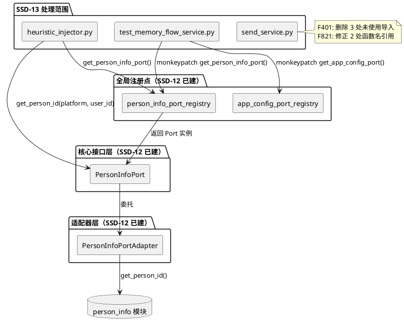
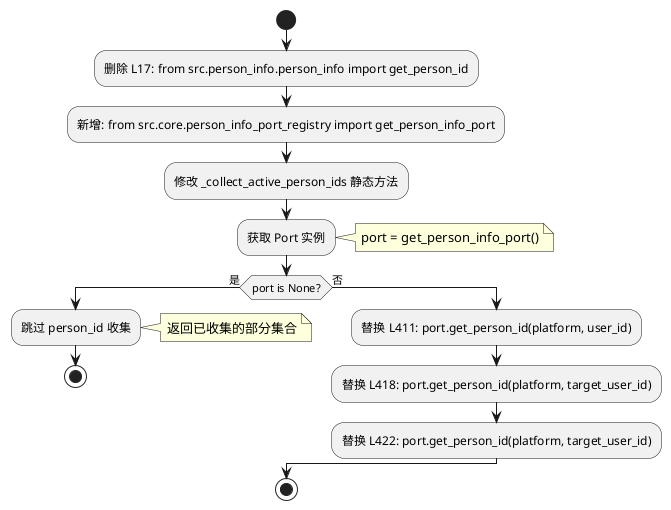
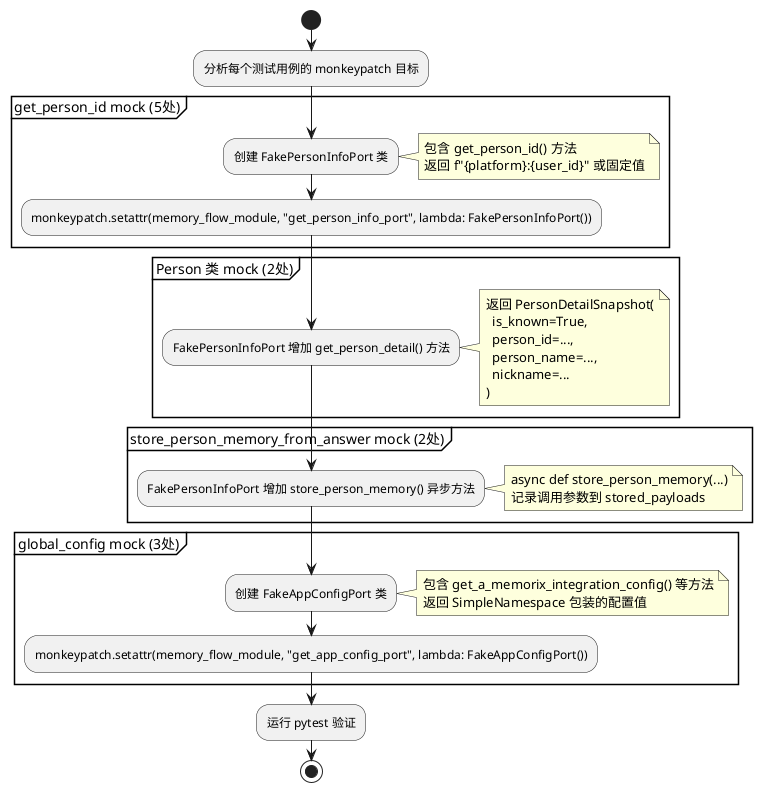
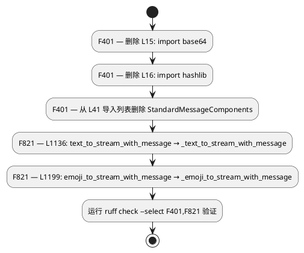

# SSD-13 设计文档：延迟项与架构债务收尾

# 一、需求与存量功能关系分析

## 1.1 需求功能与存量功能对比

### 1.1.1 已实现功能

| 需求功能 | 存量功能 | 代码位置 | 匹配度 |
|---------|---------|---------|--------|
| PersonInfoPort.get_person_id() | SSD-12 已实现，适配器委托 `person_info.get_person_id()` | `src/core/protocols.py:935-937`, `src/core/adapters/person_info_port.py:33-35` | 100% |
| PersonInfoPort 全局注册点 | `person_info_port_registry.py` 提供 `get/set/reset` 三函数 | `src/core/person_info_port_registry.py` | 100% |
| PersonInfoPort.get_person_detail() | SSD-12 已实现，返回 `PersonDetailSnapshot` | `src/core/protocols.py:947-949`, `src/core/adapters/person_info_port.py:46-55` | 100% |
| PersonInfoPort.store_person_memory() | SSD-12 已实现，适配器委托 `store_person_memory_from_answer()` | `src/core/protocols.py:951-962`, `src/core/adapters/person_info_port.py:57-73` | 100% |
| memory_flow_service.py Person 迁移 | SSD-12 已完成，使用 `get_person_info_port()` 替代直接导入 | `src/services/memory_flow_service.py:18,141-142,190-191,271` | 100% |

### 1.1.2 需要扩展的功能

| 需求功能 | 存量功能 | 差异说明 | 扩展方向 |
|---------|---------|---------|---------|
| heuristic_injector.py get_person_id 迁移（G1） | `PersonInfoPort.get_person_id()` 已存在 | `heuristic_injector.py:17` 仍直接导入 `from src.person_info.person_info import get_person_id`，L411/L418/L422 三处调用模块级函数而非 Port 方法 | 删除直接导入，替换 3 处调用为 `get_person_info_port().get_person_id(platform, user_id)` |
| test_memory_flow_service.py mock 路径更新（G2） | SSD-12 已将 `memory_flow_service.py` 迁移到 Port | 测试文件仍 monkeypatch 模块级属性（`memory_flow_module.get_person_id`、`memory_flow_module.Person`、`memory_flow_module.store_person_memory_from_answer`、`memory_flow_module.global_config`），这些属性在迁移后已不存在于模块命名空间 | 更新 7 处 monkeypatch 目标为 Port 注册点或 Port 实例方法 |

### 1.1.3 需要新增的功能或接口

**本节无新增 Protocol 或快照类型**。SSD-13 的 G1/G2 修复完全复用 SSD-12 已建立的 `PersonInfoPort` 基础设施。

**send_service.py 缺陷修复（纯代码修正）**：

1. **F401 修复（3 处）**
   - 输入：`send_service.py` 中 `base64`/`hashlib`/`StandardMessageComponents` 三个未使用导入
   - 输出：删除上述导入，ruff F401 通过
   - 核心逻辑：纯删除操作，不影响运行时行为
   - 依赖：无

2. **F821 修复（2 处）**
   - 输入：L1136 `text_to_stream_with_message` 和 L1199 `emoji_to_stream_with_message` 未定义名称引用
   - 输出：修正为 `_text_to_stream_with_message` 和 `_emoji_to_stream_with_message`
   - 核心逻辑：添加下划线前缀，与 L1081/L1151 定义的函数名一致
   - 依赖：无

**noqa TID251 整体对象遗留评估（仅产出分类报告）**：

1. **分类报告**
   - 输入：18 处 noqa TID251 整体对象遗留的使用场景
   - 输出：按"可立即拆解"/"需新增 Port 方法"/"暂不可拆解"三类的分类报告
   - 核心逻辑：静态分析每个文件对整体对象的属性访问模式，按判定标准分类
   - 依赖：无

## 1.2 存量功能详细分析

### PersonInfoPort（SSD-12 已实现，6 方法）

**接口契约**：
- `get_person_info(platform, user_id) -> Optional[PersonInfoResult]` — 查询人物信息
- `get_person_id(platform, user_id) -> str` — 纯 MD5 哈希计算，无数据库访问
- `get_person_id_by_name(person_name) -> str` — 查数据库获取 person_id
- `get_person_attribute(person_id, field_name) -> Any` — getattr 反射获取属性
- `get_person_detail(person_id) -> Optional[PersonDetailSnapshot]` — 返回不可变快照
- `store_person_memory(...) -> None` — 异步写回人物事实记忆

**业务规则**：`get_person_id()` 是纯 MD5 计算（`person_info.py:49-55`），输入 `platform + user_id`，输出 32 位十六进制字符串。性能 ≤0.1ms，无副作用。

**扩展点**：Protocol 使用 `@runtime_checkable`，鸭子类型兼容。

**约束**：`get_person_info_port()` 返回 `Optional[PersonInfoPort]`，调用方需处理 None。

### heuristic_injector.py get_person_id 使用详细分析

**使用场景 — `_collect_active_person_ids` 静态方法（3 处调用）**：
- L411: `person_ids.add(get_person_id(platform, user_id))` — 从消息发送者获取 person_id
- L418: `person_ids.add(get_person_id(platform, target_user_id))` — 从 @组件目标用户获取 person_id
- L422: `person_ids.add(get_person_id(platform, target_user_id))` — 从回复组件目标用户获取 person_id

**约束**：`_collect_active_person_ids` 是 `@staticmethod`，但 `get_person_info_port()` 是模块级函数，无需实例即可调用，不冲突。调用前需守卫 `get_person_info_port()` 返回 None 的情况。

### test_memory_flow_service.py monkeypatch 详细分析

**7 处 monkeypatch 分 4 类**：

| 类型 | 行号 | 当前目标 | 迁移后目标 |
|------|------|---------|-----------|
| get_person_id mock | L39/L75/L120/L187/L290 | `memory_flow_module.get_person_id` | `memory_flow_module.get_person_info_port` 返回的 Port 实例的 `get_person_id` 方法 |
| store_person_memory_from_answer mock | L230/L283 | `memory_flow_module.store_person_memory_from_answer` | `memory_flow_module.get_person_info_port` 返回的 Port 实例的 `store_person_memory` 方法 |
| Person 类 mock | L40/L76 | `memory_flow_module.Person` | `memory_flow_module.get_person_info_port` 返回的 Port 实例的 `get_person_detail` 方法 |
| global_config mock | L311-318/L361-368/L400-407 | `memory_flow_module.global_config` | `memory_flow_module.get_app_config_port` 返回的 Port 实例的相关方法 |

**约束**：`store_person_memory` 是异步方法，mock 需使用 `async def`。`PersonDetailSnapshot` 是 frozen dataclass，mock 需构造完整快照对象。`memory_flow_module` 中 `get_person_info_port` 和 `get_app_config_port` 是从 `src.core` 导入的模块级函数，monkeypatch 目标应指向 `memory_flow_module.get_person_info_port`。

### send_service.py F401/F821 缺陷详细分析

**F401（3 处未使用导入）**：
- L15: `import base64` — 未在文件任何位置使用
- L16: `import hashlib` — 未在文件任何位置使用
- L41: `StandardMessageComponents` — 从 `message_component_data_model` 导入但未使用

**F821（2 处未定义名称引用）**：
- L1136: `text_to_stream_with_message` — L1081 定义了 `_text_to_stream_with_message`（带下划线前缀），L1136 调用缺少前缀
- L1199: `emoji_to_stream_with_message` — L1151 定义了 `_emoji_to_stream_with_message`（带下划线前缀），L1199 调用缺少前缀

**约束**：`_text_to_stream_with_message` 和 `_emoji_to_stream_with_message` 标记为 `[Deprecated]`，但仍在被 `_text_to_stream` 和 `_emoji_to_stream` 调用。修复 F821 仅修正名称引用，不改变调用语义。

### noqa TID251 整体对象遗留分析（18 处）

**第 1 类：适配器层合法导入（4 处，不处理）**

| 文件 | 行号 | noqa 原因 |
|------|------|----------|
| `src/core/adapters/app_config_port.py` | 338/342/346/350 | 适配器层允许导入 config_manager |

**第 2 类：过渡期兼容（1 处）**

| 文件 | 行号 | noqa 原因 |
|------|------|----------|
| `src/services/service_task_resolver.py` | 24 | 过渡期兼容，ModelConfigPort 未注入时回退 |

**第 3 类：整体对象无法逐属性 Port 化（18 处，需评估）**

详见 2.1.3 节分类报告。

# 二、增量设计方案

## 2.1 实现模型

### 2.1.1 上下文视图



### 2.1.2 服务/组件总体架构

SSD-13 不新增任何 Protocol、快照类型或全局注册点。所有修复基于 SSD-12 已建基础设施。

```plantuml
@startuml
skinparam componentStyle rectangle

package "G1: heuristic_injector.py 迁移" {
    note "删除: from src.person_info.person_info import get_person_id\n新增: from src.core.person_info_port_registry import get_person_info_port\n替换: get_person_id(p, u) → get_person_info_port().get_person_id(p, u)"
}

package "G2: test_memory_flow_service.py mock 更新" {
    note "7 处 monkeypatch 目标更新:\n- get_person_id → mock get_person_info_port()\n- Person → mock get_person_info_port().get_person_detail()\n- store_person_memory_from_answer → mock get_person_info_port().store_person_memory()\n- global_config → mock get_app_config_port()"
}

package "send_service.py 缺陷修复" {
    note "F401: 删除 base64/hashlib/StandardMessageComponents\nF821: text_to_stream_with_message → _text_to_stream_with_message\n      emoji_to_stream_with_message → _emoji_to_stream_with_message"
}

package "整体对象评估（仅报告）" {
    note "18 处 noqa TID251 分类:\n- 可立即拆解\n- 需新增 Port 方法\n- 暂不可拆解"
}
@enduml
```

### 2.1.3 实现设计文档

#### G1: heuristic_injector.py get_person_id 迁移流程



#### G2: test_memory_flow_service.py mock 更新流程



#### send_service.py 缺陷修复流程



#### noqa TID251 整体对象遗留分类报告

**评估方法**：逐一分析 18 处整体对象的使用场景，按属性访问数量、访问模式、已有 Port 方法覆盖情况分类。

**分类标准**：
- **可立即拆解**：属性 ≤3，已有 Port 方法可覆盖
- **需新增 Port 方法**：属性 >3 或无 Port 方法覆盖，但访问模式固定
- **暂不可拆解**：需要整体对象传递/反射访问/属性数量不确定

| # | 文件 | 行号 | 导入目标 | 访问属性 | 分类 | 理由 |
|---|------|------|---------|---------|------|------|
| 1 | `src/emoji_system/emoji_manager.py` | 21 | `config_manager` | `get_model_config().model_task_config.vlm.model_list`（1属性链）+ `register_reload_callback`/`unregister_reload_callback`（2方法） | **可立即拆解** | VLM 模型列表查询已有 `ModelConfigPort.get_task_config("vlm")`，热重载回调已有 `ModelConfigPort.register/unregister_reload_callback()`。3 个调用点均可通过 `get_model_config_port()` 覆盖 |
| 2 | `src/maisaka/visual/mode_utils.py` | 2 | `config_manager` | `get_model_config()` 整体对象（遍历 `model_task_config` 任意任务名 + `models` 字典） | **需新增 Port 方法** | L18-21 使用 `getattr(model_task_config, task_name)` 动态访问任务配置 + `model_config.models` 字典，当前 `ModelConfigPort` 无 `list_task_names()`/`get_model_by_name()` 方法，需新增 |
| 3 | `src/maisaka/replyer/expression_selector.py` | 17 | `model_config` | `model_config.model_task_config.embedding.model_list`（1属性链） | **可立即拆解** | 仅访问 `embedding.model_list`，已有 `ModelConfigPort.get_task_config("embedding")` 可覆盖 |
| 4 | `src/maisaka/builtin_tool/send_emoji.py` | 18 | `config_manager` | `get_model_config().model_task_config.emoji.model_list`（1属性链）+ `getattr(model_task_config, "emoji", None)` 动态访问 | **需新增 Port 方法** | L298-301 使用 `getattr` 动态访问 `emoji` 任务配置，`ModelConfigPort.get_task_config()` 不支持动态任务名，需新增 `get_task_config_dynamic(task_name)` 或 `has_task_config(task_name)` |
| 5 | `src/maisaka/builtin_tool/reply.py` | 12 | `config_module` | 仅导入模块，代码中未使用 `config_module.` 属性访问 | **可立即拆解** | 导入后未使用，直接删除即可 |
| 6 | `src/webui/routers/chat/routes.py` | 14 | `heartflow_manager` | `heartflow_chat_list` 字典（直接操作） | **暂不可拆解** | WebUI 路由直接操作 `heartflow_chat_list` 字典（遍历、查询、修改），需要完整的字典操作接口，拆解成本远大于收益 |
| 7 | `src/webui/routers/chat/routes.py` | 38/583 | `global_config` | `chat.reply_style` 整体对象（L583 直接访问配置属性） | **暂不可拆解** | WebUI 配置管理页面需直接操作配置对象进行读写，`ChatConfigPort` 是只读接口，无法满足 WebUI 写入需求 |
| 8 | `src/webui/routers/config.py` | 20 | `config_manager` | 配置管理页面直接操作配置对象（读写、序列化、热重载） | **暂不可拆解** | WebUI 配置管理页面是配置的"管理面"，需要完整的 CRUD + 热重载 + 类型反射能力，Port 是只读"使用面"，两者职责不同 |
| 9 | `src/plugin_runtime/host/supervisor.py` | 14 | `global_config` | `plugin_runtime` 整体对象（enabled/ipc_socket_path 等 6+ 属性） | **需新增 Port 方法** | SSD-12 已有 `AppConfigPort.get_plugin_runtime_config()` 返回 `PluginRuntimeSnapshot`，但 supervisor.py 还需要 `plugin_runtime.plugin_dirs`/`plugin_runtime.local_plugin_sdk_path` 等字段，当前快照不完整 |
| 10 | `src/common/message_server/api.py` | 16 | `global_config` | `maim_message` 整体对象（ws_server_host/ws_server_port 等 5+ 属性） | **需新增 Port 方法** | `maim_message` 配置域有 5+ 属性被访问（L26-32），当前 `AppConfigPort` 无 `get_maim_message_config()` 方法，需新增快照 |
| 11 | `src/plugin_runtime/capabilities/core.py` | 7 | `global_config` | 反射访问 `_get_nested_config_value(global_config, key)` | **暂不可拆解** | L12-35 使用点号分隔路径动态反射访问配置，属性路径在运行时由插件决定，无法枚举所有可能的访问路径 |
| 12 | `src/emoji_system/emoji_cache_cleanup.py` | 313 | `global_config` | `emoji.cache_cleanup` 整体对象（enabled/cleanup_* 等 5+ 属性） | **需新增 Port 方法** | 缓存清理配置有 5+ 属性，且作为整体传递给 `run_emoji_cache_cleanup(config)`（L321），需新增 `EmojiCacheCleanupSnapshot` 快照 |
| 13 | `src/chat/image_system/image_cache_cleanup.py` | 283 | `global_config` | `visual.image_cache_cleanup` 整体对象（enabled/cleanup_* 等 5+ 属性） | **需新增 Port 方法** | 与 #12 同构，缓存清理配置有 5+ 属性且作为整体传递给 `run_image_cache_cleanup(config)` |
| 14 | `src/common/remote.py` | 9 | `MMC_VERSION` | 常量导入 | **可立即拆解** | `MMC_VERSION` 是构建时确定的版本号常量，可通过 `AppConfigPort.get_mmc_version()` 暴露 |
| 15 | `src/maisaka/runtime.py` | 25 | `global_config` | `expression` 配置域（learning_list 等） | **需新增 Port 方法** | L25 导入 `global_config` 用于 `expression` 配置访问，`ExpressionConfigUtils` 内部遍历 `global_config.expression.learning_list`，需新增 `ExpressionConfigSnapshot` 或将 `ExpressionConfigUtils` 内部迁移到 Port |
| 16 | `src/maisaka/runtime.py` | 2237 | `global_config` | `mcp` 配置对象（整体传递给 `MCPManager.from_app_config`） | **暂不可拆解** | L2237-2251 将 `global_config.mcp` 整体传递给 `MCPManager.from_app_config()`，MCP 配置结构复杂且作为整体消费，无法逐属性 Port 化 |
| 17 | `src/common/utils/utils_config.py` | 6 | `global_config` | `expression`/`experimental`/`jargon`/`reply_style`/`a_memorix` 多域混合 | **需新增 Port 方法** | L6 导入 `global_config` 用于 5 个配置域的遍历和查询，`ExpressionConfigUtils`/`BehaviorConfigUtils`/`JargonConfigUtils` 内部大量访问 `global_config.expression.learning_list` 等列表属性，需批量新增 Port 方法 |
| 18 | `src/services/service_task_resolver.py` | 24 | `config_manager` | 过渡期兼容回退 | **可立即拆解** | L24 是 `ModelConfigPort` 未注入时的回退路径，SSD-12 已建立 `model_config_port_registry` 全局注册点，正常启动后此路径不再触发。可在确认全局注册点稳定后删除回退逻辑 |

**分类汇总**：

| 分类 | 数量 | 编号 |
|------|------|------|
| 可立即拆解 | 5 | #1, #3, #5, #14, #18 |
| 需新增 Port 方法 | 7 | #2, #4, #9, #10, #12, #13, #15/#17（关联项） |
| 暂不可拆解 | 6 | #6, #7, #8, #11, #16 |

注：#15（`runtime.py:25` expression）和 #17（`utils_config.py:6` 多域混合）存在关联——两者都访问 `global_config.expression`，`ExpressionConfigUtils` 是 `runtime.py` 和 `routes.py` 共用的工具类。若 #15 迁移，#17 应同步处理，合计为 1 个关联项。

## 2.2 接口设计

### 2.2.1 总体设计

**SSD-13 不新增任何 Protocol 方法或快照类型**。所有 G1/G2 修复复用 SSD-12 已建接口。

**接口变更策略**：无变更。

**稳定性等级**：PersonInfoPort（SSD-12 已建，稳定）。

### 2.2.2 接口清单

#### G1: heuristic_injector.py — 复用 PersonInfoPort.get_person_id()

**接口签名**（已有，无需修改）：

```python
def get_person_id(self, platform: str, user_id: str) -> str: ...
```

**业务说明**：纯 MD5 哈希计算，输入 `platform + user_id`，输出 32 位十六进制字符串。

**前置条件**：`get_person_info_port()` 返回非 None 的 `PersonInfoPort` 实例。

**后置条件**：返回与 `person_info.get_person_id(platform, user_id)` 完全相同的哈希字符串。

**异常映射**：`get_person_info_port()` 返回 None 时，`_collect_active_person_ids` 跳过 person_id 收集，返回已收集的部分集合。

**调用示例**：

```python
from src.core.person_info_port_registry import get_person_info_port

port = get_person_info_port()
if port:
    person_id = port.get_person_id(platform, user_id)
```

#### G2: test_memory_flow_service.py — mock 模式

**mock 策略**：不 mock 模块级函数，改为 mock `get_person_info_port()` 和 `get_app_config_port()` 返回的 Port 实例。

**get_person_id mock 示例**：

```python
class FakePersonInfoPort:
    def get_person_id(self, platform, user_id):
        return f"{platform}:{user_id}"

    def get_person_detail(self, person_id):
        from src.core.types import PersonDetailSnapshot
        return PersonDetailSnapshot(
            is_known=True, person_id=person_id,
            person_name="测试用户", nickname="测试用户",
        )

    async def store_person_memory(self, person_name, fact, session_id, **kwargs):
        pass

monkeypatch.setattr(memory_flow_module, "get_person_info_port", lambda: FakePersonInfoPort())
```

**global_config mock 示例**：

```python
class FakeAppConfigPort:
    def get_a_memorix_integration_config(self):
        from src.core.types import AMemorixIntegrationSnapshot
        return AMemorixIntegrationSnapshot(
            chat_summary_writeback_enabled=True,
            chat_summary_writeback_message_threshold=3,
            chat_summary_writeback_context_length=7,
        )

monkeypatch.setattr(memory_flow_module, "get_app_config_port", lambda: FakeAppConfigPort())
```

**注意**：需确认 `AppConfigPort` 是否已有 `get_a_memorix_integration_config()` 方法。若无，则需检查 `memory_flow_service.py` 实际使用的 `global_config.a_memorix.integration` 属性对应的 Port 方法名。

## 2.3 数据模型

### 2.3.1 设计目标

1. G1/G2 修复不引入新数据模型，完全复用 SSD-12 已建的 `PersonDetailSnapshot` 和 `PersonInfoResult`
2. send_service.py 修复不涉及数据模型变更
3. 整体对象评估仅产出分类报告，不涉及数据模型

### 2.3.2 模型实现

SSD-13 无新增数据模型。

### 2.3.3 批次策略

**D1: 分批策略 — 按依赖关系排序**

| 批次 | 范围 | 改动量 | 理由 |
|------|------|--------|------|
| 0 | G1: heuristic_injector.py 迁移 | 1 文件 | 独立修改，无外部依赖 |
| 1 | G2: test_memory_flow_service.py mock 更新 | 1 文件 | 依赖 G1 完成后 memory_flow_service.py 的 Port 迁移状态（已由 SSD-12 完成） |
| 2 | send_service.py F401/F821 修复 | 1 文件 | 独立修改，无外部依赖 |
| 3 | ruff 守卫验证 + AGENTS.md 更新 | 2 文件（pyproject.toml 可能无需改动 + AGENTS.md） | 收尾 |

**替代方案**：G1/G2/send_service 三项并行 — 可行但不推荐，G1 和 G2 有逻辑关联（同一 Port 迁移链路），串行更安全。

### 2.3.4 文件清单

#### 新增文件

无。

#### 修改文件

| 文件 | 改动 | 批次 |
|------|------|------|
| `src/maisaka/memory/heuristic_injector.py` | 删除 `from src.person_info.person_info import get_person_id`，替换 3 处调用为 `get_person_info_port().get_person_id()` | 0 |
| `pytests/A_memorix_test/test_memory_flow_service.py` | 更新 7 处 monkeypatch 目标 | 1 |
| `src/services/send_service.py` | 删除 3 处未使用导入，修正 2 处函数名引用 | 2 |
| `AGENTS.md` | G1/G2 从"待后续"清单移除，send_service.py F401/F821 状态更新 | 3 |