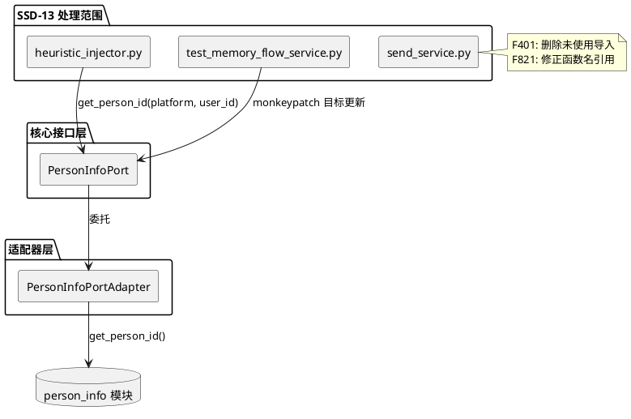
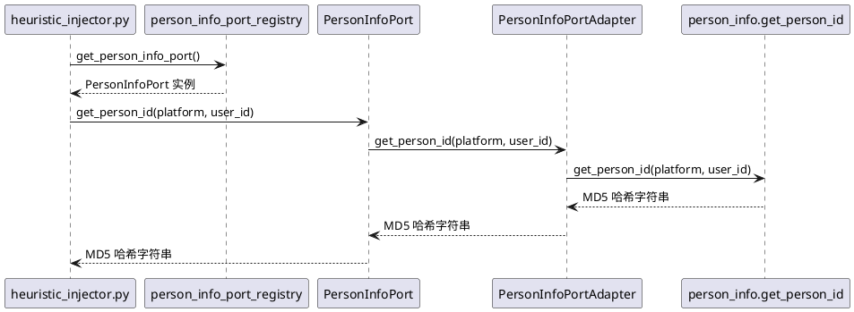
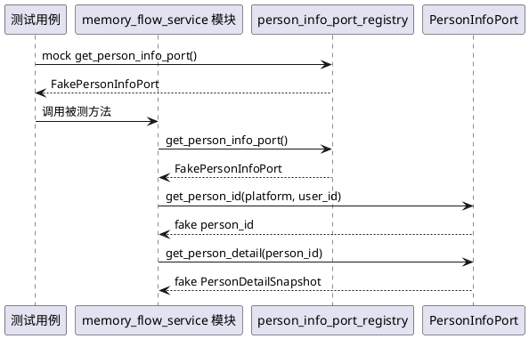
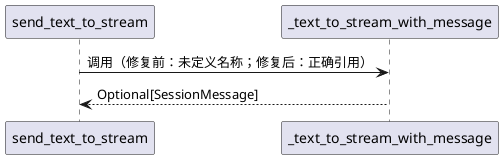
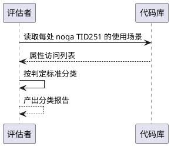

# SSD-13: 延迟项与架构债务收尾

## 背景

SSD-12 已完成 `config_manager`/`heartflow_manager`/`Person` 三类 TID251 违规的消除（10 处降至 0 处），建立了 `ModelConfigPort` 全局注册点，扩展了 `AppConfigPort`（+5 方法）、`ChatRuntimeRegistry`（+2 方法）、`PersonInfoPort`（+5 方法）。但项目中仍存在 SSD-12 延迟的 2 处架构反模式、23 处 noqa TID251 整体对象遗留、send_service.py 的 F401/F821 已有缺陷，以及 A_memorix 内部 309 处 blind/bare except。

SSD-13 聚焦于**影响面小、收益明确**的收尾工作，遵循"大道至简"原则，将大范围改造（A_memorix bare except 309 处）拆分为独立 SSD。

### 延迟项清单

| # | 来源 | 文件 | 问题 | 影响面 |
|---|------|------|------|--------|
| G1 | SSD-12 延迟 | `src/maisaka/memory/heuristic_injector.py:17` | 直接导入 `get_person_id`，架构反模式 | 1 文件 3 处调用 |
| G2 | SSD-12 延迟 | `pytests/A_memorix_test/test_memory_flow_service.py` | monkeypatch 目标已不存在，测试会失败 | 1 文件 7 处 mock |

### noqa TID251 整体对象遗留（23 处，分 3 类）

**第 1 类：适配器层合法导入（4 处，不处理）**

| 文件 | 行号 | noqa 原因 |
|------|------|----------|
| `src/core/adapters/app_config_port.py` | 338/342/346/350 | 适配器层允许导入 config_manager |

**第 2 类：过渡期兼容（1 处，评估可消除性）**

| 文件 | 行号 | noqa 原因 |
|------|------|----------|
| `src/services/service_task_resolver.py` | 24 | 过渡期兼容，端口可注入后此路径不再触发 |

**第 3 类：整体对象无法逐属性 Port 化（18 处，评估拆解可行性）**

| 文件 | 行号 | 导入目标 | noqa 原因 |
|------|------|---------|----------|
| `src/emoji_system/emoji_manager.py` | 21 | `config_manager` | 获取模型配置 |
| `src/webui/routers/config.py` | 20 | `config_manager` | 配置管理页面需直接操作配置对象 |
| `src/webui/routers/chat/routes.py` | 14 | `heartflow_manager` | 直接访问 heartflow_chat_list |
| `src/webui/routers/chat/routes.py` | 38/583 | `global_config` | chat.reply_style 整体对象 |
| `src/plugin_runtime/host/supervisor.py` | 14 | `global_config` | plugin_runtime 整体对象 |
| `src/common/message_server/api.py` | 16 | `global_config` | maim_message 整体对象 |
| `src/plugin_runtime/capabilities/core.py` | 7 | `global_config` | 插件动态配置反射访问 |
| `src/emoji_system/emoji_cache_cleanup.py` | 313 | `global_config` | emoji.cache_cleanup 整体对象 |
| `src/maisaka/visual/mode_utils.py` | 2 | `config_manager` | 无注释 |
| `src/chat/image_system/image_cache_cleanup.py` | 283 | `global_config` | visual.image_cache_cleanup 整体对象 |
| `src/common/remote.py` | 9 | `MMC_VERSION` | 常量导入 |
| `src/maisaka/replyer/expression_selector.py` | 17 | `model_config` | 无注释 |
| `src/maisaka/builtin_tool/send_emoji.py` | 18 | `config_manager` | 无注释 |
| `src/maisaka/runtime.py` | 25/2237 | `global_config` | expression/MCPConfig 整体对象 |
| `src/common/utils/utils_config.py` | 6 | `global_config` | 多域混合待后续协议化 |
| `src/maisaka/builtin_tool/reply.py` | 12 | `config_module` | 无注释 |

### send_service.py 已有缺陷（5 处）

| 类型 | 行号 | 描述 |
|------|------|------|
| F401 | 15 | `base64` imported but unused |
| F401 | 16 | `hashlib` imported but unused |
| F401 | 41 | `StandardMessageComponents` imported but unused |
| F821 | 1136 | `text_to_stream_with_message` undefined（应为 `_text_to_stream_with_message`） |
| F821 | 1199 | `emoji_to_stream_with_message` undefined（应为 `_emoji_to_stream_with_message`） |

### A_memorix blind/bare except（309 处）

| 规则 | 数量 | 描述 |
|------|------|------|
| BLE001 | 305 | `except Exception` 盲捕获 |
| E722 | 4 | `except:` 裸捕获 |
| **合计** | **309** | — |

# 1. 组件定位

## 1.1 核心职责

本组件负责处理 SSD-12 延迟项（G1/G2）、修复 send_service.py 已有缺陷、评估 noqa TID251 整体对象遗留的拆解可行性，将影响面小、收益明确的架构债务清零。

## 1.2 核心输入

1. `heuristic_injector.py` 中 `get_person_id` 的直接导入调用（G1）
2. `test_memory_flow_service.py` 中指向已不存在模块级函数的 monkeypatch（G2）
3. `send_service.py` 中 3 处未使用导入和 2 处未定义名称引用
4. 18 处 noqa TID251 整体对象遗留的使用场景分析

## 1.3 核心输出

1. `heuristic_injector.py` 通过 `PersonInfoPort.get_person_id()` 获取 person_id
2. `test_memory_flow_service.py` 的 monkeypatch 目标更新为 Port 方法
3. `send_service.py` F401/F821 缺陷修复
4. 可拆解的 noqa TID251 整体对象迁移方案（仅评估，不实施大范围改造）

## 1.4 职责边界

1. **不**处理 A_memorix 309 处 blind/bare except — 影响面过大，拆分为独立 SSD
2. **不**实施大范围 noqa TID251 整体对象迁移 — 仅评估可行性，产出分类报告
3. **不**修改 `config_manager`/`heartflow_manager`/`Person` 类的内部实现
4. **不**改变任何运行时行为 — G1/G2/send_service 修复均为功能等价替换
5. **不**新增 `ConfigUpgradeHook`
6. **不**处理 `test_person_memory_writeback.py` 的 monkeypatch — 该文件 mock 的是 `person_info_module`（未迁移），当前仍可正常工作

# 2. 领域术语

**延迟项（Deferred Item）**
: 在前一 SSD 中识别但因范围或风险原因推迟到后续 SSD 处理的架构债务项。

**整体对象（Whole Object）**
: 调用方直接导入并访问配置对象的多个属性，而非通过 Port 接口逐属性获取的模式。当前无法逐属性 Port 化的原因包括：属性数量过多、需要反射访问、或配置对象作为整体传递给下游。

**blind except（BLE001）**
: 使用 `except Exception` 捕获所有异常，不区分异常类型。ruff 规则 BLE001 检测。

**bare except（E722）**
: 使用 `except:` 不指定任何异常类型，连 `KeyboardInterrupt`/`SystemExit` 都会捕获。ruff 规则 E722 检测。

**F401**
: ruff 规则，检测已导入但未使用的模块或名称。

**F821**
: ruff 规则，检测未定义的名称引用。

# 3. 角色与边界

## 3.1 核心角色

- **开发者**：执行代码迁移和缺陷修复，确保 ruff check 通过
- **测试维护者**：更新测试文件的 mock 路径，确保测试可运行

## 3.2 外部系统

- **PersonInfoPort**：SSD-12 新增的 `get_person_id()` 方法，替代直接导入 `get_person_id` 函数
- **ruff**：静态检查工具，TID251/F401/F821/BLE001/E722 规则的执行者
- **pytest/monkeypatch**：测试框架，mock 目标需与实际代码命名空间一致

## 3.3 交互上下文

# 4. DFX 约束

## 4.1 性能

1. `PersonInfoPort.get_person_id()` 必须与直接调用 `person_info.get_person_id()` 性能等价（纯 MD5 计算，≤0.1ms）
2. send_service.py 修复不得引入额外运行时开销

## 4.2 可靠性

1. G1 迁移后 `heuristic_injector.py` 的 person_id 计算结果必须与迁移前完全一致
2. G2 测试修复后，所有 `test_memory_flow_service.py` 测试用例必须通过
3. send_service.py F821 修复后，被调用的函数签名必须与调用方参数完全匹配

## 4.3 安全性

1. `PersonInfoPort.get_person_id()` 不暴露 Person 类内部状态

## 4.4 可维护性

1. 迁移后的代码不得引入新的 noqa 注释
2. 测试文件的 mock 模式应与项目其他测试保持一致

## 4.5 兼容性

1. G1 迁移不改变 `heuristic_injector.py` 对外行为
2. G2 测试修复不改变测试用例的断言逻辑，仅更新 mock 目标路径
3. send_service.py 修复不改变任何函数签名或返回值

# 5. 核心能力

## 5.1 heuristic_injector.py get_person_id 迁移（G1）

### 5.1.1 业务规则

1. **导入替换规则**：当 `heuristic_injector.py` 需要获取 person_id 时，应通过 `PersonInfoPort.get_person_id()` 获取，而非直接导入 `person_info.get_person_id`
   - 验收条件：[调用 `get_person_info_port().get_person_id(platform, user_id)`] → [返回与 `person_info.get_person_id(platform, user_id)` 相同的 MD5 哈希字符串]

2. **静态方法处理规则**：`_collect_active_person_ids` 是 `@staticmethod`，当前直接调用模块级 `get_person_id` 函数。迁移后应改为调用 `get_person_info_port().get_person_id()`，因 `get_person_info_port()` 是模块级函数，无需改动装饰器
   - 验收条件：[`_collect_active_person_ids` 内调用 `get_person_info_port().get_person_id()`] → [编译通过，功能等价]

3. **禁止项**：禁止 `heuristic_injector.py` 直接导入 `src.person_info.person_info` 模块
   - 验收条件：[ruff check 检测 `heuristic_injector.py`] → [无 `from src.person_info.person_info import` 导入]

### 5.1.2 交互流程

### 5.1.3 异常场景

1. **PersonInfoPort 未注册**
   - 触发条件：`get_person_info_port()` 返回 None
   - 系统行为：`_collect_active_person_ids` 应跳过 person_id 收集（返回空集合或部分集合）
   - 用户感知：启发式记忆注入不包含人物信息，记忆召回可能不完整

2. **platform 或 user_id 为空**
   - 触发条件：消息中 `platform` 或 `user_id` 为空字符串
   - 系统行为：当前代码已有 `if platform and user_id:` 守卫，跳过空值
   - 用户感知：无影响

## 5.2 test_memory_flow_service.py mock 路径更新（G2）

### 5.2.1 业务规则

1. **get_person_id mock 路径更新规则**：当测试需要 mock `get_person_id` 时，monkeypatch 目标应从 `memory_flow_module.get_person_id` 改为 `memory_flow_module.get_person_info_port` 返回的 Port 实例的 `get_person_id` 方法
   - 验收条件：[运行 `pytest pytests/A_memorix_test/test_memory_flow_service.py`] → [所有测试通过，无 `AttributeError: module has no attribute 'get_person_id'`]

2. **store_person_memory_from_answer mock 路径更新规则**：当测试需要 mock `store_person_memory_from_answer` 时，monkeypatch 目标应从 `memory_flow_module.store_person_memory_from_answer` 改为 `memory_flow_module.get_person_info_port` 返回的 Port 实例的 `store_person_memory` 方法
   - 验收条件：[运行 `pytest pytests/A_memorix_test/test_memory_flow_service.py`] → [所有测试通过，无 `AttributeError: module has no attribute 'store_person_memory_from_answer'`]

3. **Person 类 mock 更新规则**：当测试需要 mock `Person` 类时，因 SSD-12 迁移后 `memory_flow_service.py` 不再导入 `Person`，相关 mock 应改为构造 `PersonDetailSnapshot` 或 mock `get_person_info_port().get_person_detail()`
   - 验收条件：[运行 `pytest pytests/A_memorix_test/test_memory_flow_service.py`] → [所有测试通过，无 `AttributeError: module has no attribute 'Person'`]

4. **global_config mock 更新规则**：测试中对 `memory_flow_module.global_config` 的 monkeypatch 应改为 mock `get_app_config_port()` 返回的 Port 实例的相关方法
   - 验收条件：[运行 `pytest pytests/A_memorix_test/test_memory_flow_service.py`] → [所有测试通过]

5. **禁止项**：禁止测试文件中保留指向已不存在模块级函数的 monkeypatch
   - 验收条件：[grep `monkeypatch.setattr(memory_flow_module, "get_person_id"`] → [无匹配]

### 5.2.2 交互流程

### 5.2.3 异常场景

1. **mock 粒度不匹配**
   - 触发条件：monkeypatch 目标路径与实际代码命名空间不一致
   - 系统行为：pytest 抛出 `AttributeError`
   - 用户感知：测试失败，错误信息指向不存在的属性

2. **PersonDetailSnapshot 字段缺失**
   - 触发条件：FakePersonDetailSnapshot 缺少 `is_known`/`person_name`/`nickname` 等字段
   - 系统行为：被测方法访问不存在的属性时抛出 `AttributeError`
   - 用户感知：测试失败

3. **异步 mock 不匹配**
   - 触发条件：`store_person_memory` 是异步方法，mock 未使用 `async def`
   - 系统行为：`await` 调用失败
   - 用户感知：测试失败，`TypeError: object NoneType can't be used in 'await' expression`

## 5.3 send_service.py 已有缺陷修复

### 5.3.1 业务规则

1. **未使用导入清理规则**：当 `send_service.py` 中存在未使用的导入时，应当删除
   - 验收条件：[删除 `import base64`、`import hashlib`、`StandardMessageComponents` 导入] → [ruff check --select F401 通过]

2. **未定义名称修复规则**：当 `send_service.py` 中引用了未定义的函数名时，应修正为实际存在的函数名
   - 验收条件：[将 `text_to_stream_with_message` 改为 `_text_to_stream_with_message`，将 `emoji_to_stream_with_message` 改为 `_emoji_to_stream_with_message`] → [ruff check --select F821 通过]

3. **禁止项**：禁止修复过程改变任何函数签名或返回值语义
   - 验收条件：[修复前后 `send_text_to_stream` 和 `send_emoji_to_stream` 的行为完全一致]

### 5.3.2 交互流程

### 5.3.3 异常场景

1. **函数名修正后签名不匹配**
   - 触发条件：`_text_to_stream_with_message` 的参数列表与调用方传入的参数不一致
   - 系统行为：运行时 `TypeError`
   - 用户感知：消息发送失败
   - 缓解：`_text_to_stream_with_message` 是已有函数，F821 是名称拼写错误（缺少下划线前缀），参数列表应完全一致

2. **删除导入后影响其他代码**
   - 触发条件：被删除的 `base64`/`hashlib`/`StandardMessageComponents` 在文件其他位置被使用
   - 系统行为：运行时 `NameError`
   - 用户感知：消息发送失败
   - 缓解：ruff F401 已确认这些导入未被使用，删除是安全的

## 5.4 noqa TID251 整体对象遗留评估

### 5.4.1 业务规则

1. **分类评估规则**：当对 18 处 noqa TID251 整体对象遗留进行评估时，应按"可立即拆解"/"需新增 Port 方法"/"暂不可拆解"三类分类
   - 验收条件：[产出分类报告] → [每处遗留有明确的分类和理由]

2. **可立即拆解判定标准**：当整体对象的使用场景仅涉及 1-3 个属性，且已有 Port 方法可覆盖时，判定为"可立即拆解"
   - 验收条件：[使用场景 ≤3 属性 且 已有 Port 方法覆盖] → [分类为"可立即拆解"]

3. **需新增 Port 方法判定标准**：当整体对象的使用场景涉及 3 个以上属性，且无已有 Port 方法覆盖时，判定为"需新增 Port 方法"
   - 验收条件：[使用场景 >3 属性 或 无 Port 方法覆盖] → [分类为"需新增 Port 方法"]

4. **暂不可拆解判定标准**：当整体对象需要作为整体传递给下游（如序列化、反射访问），或涉及 WebUI 配置管理页面等特殊场景时，判定为"暂不可拆解"
   - 验收条件：[需要整体对象传递 或 反射访问 或 WebUI 配置管理] → [分类为"暂不可拆解"]

5. **禁止项**：禁止在 SSD-13 中实施大范围整体对象迁移
   - 验收条件：[SSD-13 代码变更仅限于 G1/G2/send_service 修复] → [noqa TID251 整体对象遗留数量不变]

### 5.4.2 交互流程

### 5.4.3 异常场景

1. **使用场景分析不完整**
   - 触发条件：动态属性访问（如 `getattr(obj, field_name)`）导致静态分析无法覆盖
   - 系统行为：分类报告标注"需运行时验证"
   - 用户感知：分类报告包含不确定项

2. **Port 方法设计冲突**
   - 触发条件：新增 Port 方法与已有方法语义重叠
   - 系统行为：分类报告标注"需设计评审"
   - 用户感知：分类报告包含待决策项

# 6. 数据约束

## 6.1 heuristic_injector.py get_person_id 调用点

1. **L411**：`person_ids.add(get_person_id(platform, user_id))` — 从消息发送者获取 person_id
2. **L418**：`person_ids.add(get_person_id(platform, target_user_id))` — 从 @组件目标用户获取 person_id
3. **L422**：`person_ids.add(get_person_id(platform, target_user_id))` — 从回复组件目标用户获取 person_id

## 6.2 test_memory_flow_service.py monkeypatch 目标

1. **L39**：`monkeypatch.setattr(memory_flow_module, "get_person_id", ...)` — test_person_fact_resolve_target_person_for_private_chat
2. **L75**：`monkeypatch.setattr(memory_flow_module, "get_person_id", ...)` — test_person_fact_resolve_target_person_for_group_without_reply
3. **L120**：`monkeypatch.setattr(memory_flow_module, "get_person_id", ...)` — test_person_fact_collect_user_evidence_keeps_latest_target_messages_without_reply
4. **L187**：`monkeypatch.setattr(memory_flow_module, "get_person_id", ...)` — test_person_fact_reply_evidence_keeps_context_for_short_answer
5. **L230**：`monkeypatch.setattr(memory_flow_module, "store_person_memory_from_answer", ...)` — test_person_fact_writeback_skips_bot_only_fact_without_user_evidence
6. **L283**：`monkeypatch.setattr(memory_flow_module, "store_person_memory_from_answer", ...)` — test_person_fact_writeback_uses_resolved_person_id
7. **L290**：`monkeypatch.setattr(memory_flow_module, "get_person_id", ...)` — test_person_fact_writeback_uses_resolved_person_id

## 6.3 send_service.py F401/F821 缺陷

1. **L15**：`import base64` — 未使用，应删除
2. **L16**：`import hashlib` — 未使用，应删除
3. **L41**：`StandardMessageComponents` — 未使用，应从导入列表删除
4. **L1136**：`text_to_stream_with_message` — 应为 `_text_to_stream_with_message`（L1081 定义）
5. **L1199**：`emoji_to_stream_with_message` — 应为 `_emoji_to_stream_with_message`（L1151 定义）

# 验收标准

1. `heuristic_injector.py` 不再直接导入 `src.person_info.person_info`，通过 `get_person_info_port().get_person_id()` 获取 person_id
2. `test_memory_flow_service.py` 所有测试用例通过，无 `AttributeError` 或 `TypeError`
3. `send_service.py` ruff check --select F401,F821 通过（5 处缺陷清零）
4. 产出 noqa TID251 整体对象遗留分类报告（18 处，每处有分类和理由）
5. `ruff check` 全项目 src/ 目录 TID251 通过（G1 迁移后无新增违规）
6. AGENTS.md 更新：G1/G2 从"待后续"清单移除，send_service.py F401/F821 状态更新

# 约束条件

1. **核心隔离**：`src/core/`（排除 adapters/）不得直接导入 `person_info` 模块
2. **功能等价**：G1/G2/send_service 修复均为纯重构，不改变运行时行为
3. **A_memorix 不碰**：309 处 blind/bare except 拆分为独立 SSD
4. **整体对象仅评估**：18 处 noqa TID251 整体对象遗留只产出分类报告，不实施迁移
5. **不提交无边界的 ruff/格式化/导入整理**：只修复与 SSD-13 范围相关的文件
6. **测试文件 mock 模式一致**：更新后的 mock 应与项目其他测试保持一致

# 风险

1. **test_memory_flow_service.py mock 重写复杂度**：7 处 monkeypatch 涉及 4 种不同 mock 目标（`get_person_id`/`store_person_memory_from_answer`/`Person`/`global_config`），需逐一适配 Port 方法。缓解：每个测试用例独立修改，逐一验证。
2. **send_service.py F821 修复可能暴露运行时问题**：`_text_to_stream_with_message` 和 `_emoji_to_stream_with_message` 标记为 `[Deprecated]`，修复 F821 后这些废弃函数可能被重新激活使用。缓解：仅修正名称引用，不改变调用语义。
3. **noqa TID251 整体对象评估可能触发范围蔓延**：评估过程可能发现"顺手可修"的项，导致 SSD-13 范围扩大。缓解：严格约束"仅评估不实施"，可立即拆解的项记录在报告中供后续 SSD 处理。