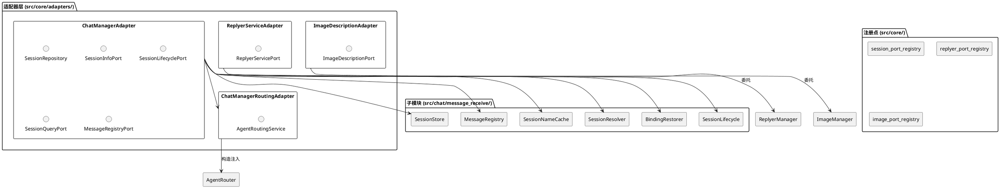
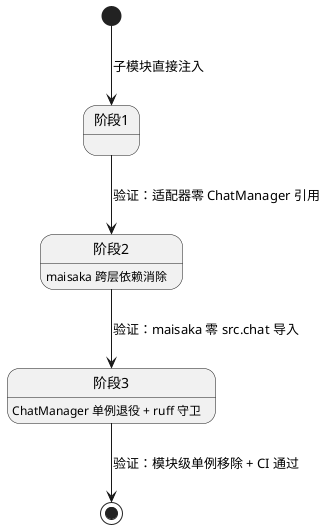
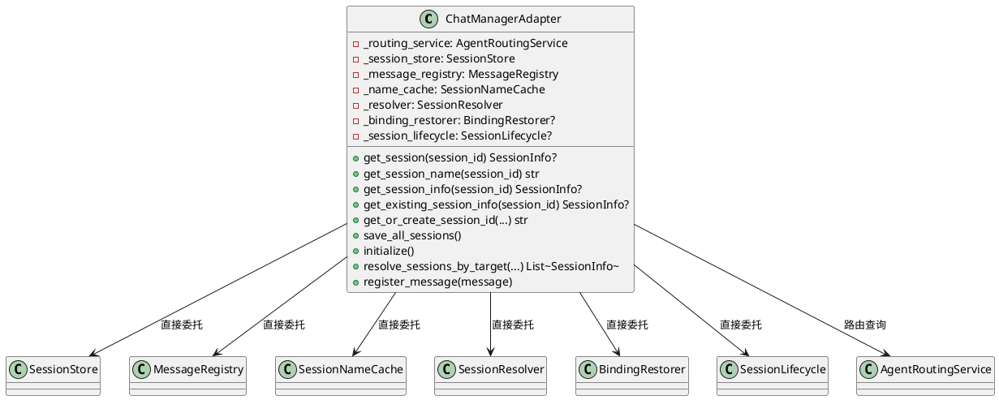
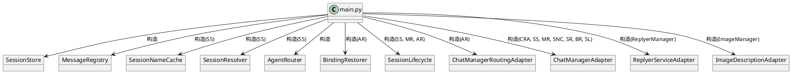
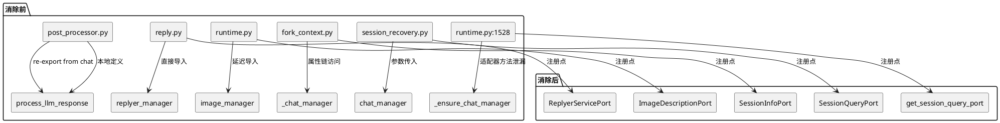

# 一、需求与存量功能关系分析

## 1.1 需求功能与存量功能对比

### 1.1.1 已实现功能

| 需求功能 | 存量功能 | 代码位置 | 匹配度 |
|---------|---------|---------|--------|
| Protocol 接口定义（5 个端口） | SessionRepository/SessionInfoPort/SessionLifecyclePort/SessionQueryPort/MessageRegistryPort 已定义 | `src/core/protocols.py` | 100% |
| 注册点全局注册/获取 | session_port_registry 4 对注册/获取函数已实现 | `src/core/session_port_registry.py` | 100% |
| ChatManager 子模块拆分 | 6 个子模块已拆分（SessionStore/MessageRegistry/SessionNameCache/SessionResolver/BindingRestorer/SessionLifecycle） | `src/chat/message_receive/session_store.py` 等 | 100% |
| 适配器 5 合 1 Protocol 实现 | ChatManagerAdapter 已实现 5 个 Protocol 接口 | `src/core/adapters/chat_manager_adapter.py` | 100% |
| AgentRoutingService 适配器 | ChatManagerRoutingAdapter 已实现 | `src/core/adapters/routing_adapter.py` | 100% |
| main.py 注册流程 | Protocol 端口注册已实现 | `src/main.py:126-140` | 100% |
| SessionInfo 不可变快照 | SessionInfo dataclass 已定义 | `src/core/types.py` | 100% |
| maisaka 通过注册点查询会话 | runtime.py 已使用 `get_existing_session_info()`/`get_session_name()` | `src/maisaka/runtime.py:29,147,153` | 100% |

### 1.1.2 需要扩展的功能

| 需求功能 | 存量功能 | 差异说明 | 扩展方向 |
|---------|---------|---------|---------|
| ChatManagerAdapter 子模块直接注入 | ChatManagerAdapter 通过 `_ensure_chat_manager()` 持有 ChatManager 单例引用 | 适配器所有方法通过 `chat_manager.xxx()` 委托到 ChatManager 薄协调层，再由协调层委托到子模块。多了一层间接调用 | 构造函数改为接收 6 个子模块实例，逐方法直接委托到子模块，移除 `_ensure_chat_manager()` |
| ChatManager 单例移除 | `chat_manager.py` 模块级 `chat_manager = ChatManager()` 全局单例 | 外部模块通过 `from src.chat.message_receive.chat_manager import chat_manager` 直接导入单例，绕过适配器 | main.py 显式构造子模块 + ChatManagerAdapter，移除模块级单例 |
| main.py 启动编排 | main.py 通过 `from src.chat.message_receive.chat_manager import chat_manager` 导入单例，传给适配器 | 当前 main.py 只传 chat_manager 整体，适配器内部再拆解 | 改为 main.py 先构造子模块，再构造适配器注入子模块 |
| maisaka → chat 直接导入消除（replyer_manager） | `reply.py:6` 直接 `from src.chat.replyer.replyer_manager import replyer_manager` | replyer_manager 是模块级单例，maisaka 直接导入违反"核心只依赖 Protocol"原则 | 通过注入机制或注册点访问 |
| maisaka → chat 直接导入消除（image_manager） | `runtime.py:629` 延迟 `from src.chat.image_system.image_manager import image_manager` | 延迟导入规避循环依赖，但仍是跨层物理依赖 | 通过注入机制或 Protocol 接口访问 |
| maisaka → chat 直接导入消除（process_llm_response） | `post_processor.py:311` `from src.chat.utils.utils import process_llm_response` | 函数逻辑上属于 maisaka 回复后处理，物理位置在 chat 层 | 物理迁移函数到 maisaka 层 |
| fork_context 消除 `_chat_manager` 访问 | `fork_context.py:145` 通过 `self._runtime._chat_manager.get_session()` 访问 | 通过运行时私有属性链式访问 ChatManager 单例 | 改为通过注入的 SessionInfoPort/SessionQueryPort 查询 |
| session_recovery 消除 ChatManager 依赖 | `session_recovery.py:25` 接收 `chat_manager: Any` 参数 | 直接调用 `chat_manager.get_existing_session_by_session_id()` | 改为通过 SessionQueryPort 查询 |
| runtime.py 消除 `_ensure_chat_manager()` 访问 | `runtime.py:1528` 通过 `_query_port._ensure_chat_manager()` 获取 ChatManager 传给 session_recovery | 适配器内部方法泄漏给外部，跨层访问 ChatManager 单例 | session_recovery 改用 SessionQueryPort，消除此调用链 |
| ruff TID251 守卫覆盖 maisaka | 当前 maisaka 目录不在 per-file-ignores 中，也无 banned-api 规则 | maisaka 可以自由导入 `src.chat.*`，无 CI 防护 | 新增 banned-api 规则 + maisaka 目录 TID251 启用 |

### 1.1.3 需要新增的功能或接口

**1. ReplyerService Protocol（replyer_manager 接口化）**

- 输入：`chat_stream: SessionInfo`, `request_type: str`, `replyer_type: str`
- 输出：`Optional[MaisakaReplyGenerator]`
- 核心逻辑：封装 `replyer_manager.get_replyer()` 调用，使 maisaka 不直接导入 chat 层
- 依赖：ReplyerManager（chat 层具体实现）

**2. ImageDescriptionService Protocol（image_manager 接口化）**

- 输入：`image_hash: str`, `image_bytes: bytes`, `wait_for_build: bool`
- 输出：`str`（图片描述文本）
- 核心逻辑：封装 `image_manager.get_image_description()` 调用
- 依赖：ImageManager（chat 层具体实现）

**3. process_llm_response 物理迁移**

- 输入：`text: str`, `enable_splitter: bool`, `enable_chinese_typo: bool`
- 输出：`list[str]`
- 核心逻辑：LLM 回复后处理（颜文字保护、括号清理、分句、错别字生成）
- 依赖：`global_config`（已在 maisaka 层使用）、`ChineseTypoGenerator`（需一起迁移）
- 注意：`src/services/generator_service.py:15` 也导入了此函数，原位置需保留 re-export

## 1.2 存量功能详细分析

### 1.2.1 ChatManagerAdapter 当前实现

**接口契约**：构造函数接收 `routing_service: AgentRoutingService` + `chat_manager: Any`。所有方法通过 `_ensure_chat_manager()` 获取 ChatManager 单例后委托。

**业务规则**：
- `_ensure_chat_manager()` 在 `_chat_manager` 为 None 时抛出 RuntimeError
- `_build_session_info()` 从 BotChatSession + routing_service 构建 SessionInfo 不可变快照
- 每个方法先调用 `_ensure_chat_manager()`，再调用 `chat_manager.xxx()` 委托

**扩展点**：构造函数已预留 `chat_manager` 参数，改为子模块注入只需扩展参数列表

**约束**：
- 适配器是唯一允许导入 chat_manager 具体类的地方（`src/core/adapters/*` 在 ruff per-file-ignores 中）
- SessionInfo 快照的 `or ""` 是必要的类型适配（BotChatSession 属性可能为 None）

### 1.2.2 ChatManager 薄协调层

**接口契约**：持有 6 个子模块实例，对外方法逐一委托。模块级 `chat_manager = ChatManager()` 创建全局单例。

**业务规则**：
- `__init__` 中构造 SessionStore/MessageRegistry/SessionNameCache/SessionResolver
- `_agent_router`、`binding_restorer`、`session_lifecycle` 延迟初始化
- `sessions`/`last_messages` 属性代理到子模块（向后兼容）
- `agent_router` 属性延迟构造 AgentRouter（依赖 AgentConfigRegistry）

**约束**：
- SessionStore 和 MessageRegistry 之间有循环依赖（通过 `set_message_registry()` 延迟注入解决）
- AgentRouter 依赖 AgentConfigRegistry（来自 maisaka 层），ChatManager 反向依赖 maisaka
- BindingRestorer 也依赖 AgentRouter

### 1.2.3 maisaka → chat 依赖清单

| 依赖 | 文件 | 行号 | 类型 | 使用方式 |
|------|------|------|------|---------|
| `replyer_manager` | `src/maisaka/builtin_tool/reply.py` | 6 | 直接导入 | `replyer_manager.get_replyer()` |
| `image_manager` | `src/maisaka/runtime.py` | 629 | 延迟导入 | `image_manager.get_image_description()` |
| `process_llm_response` | `src/maisaka/context/post_processor.py` | 311 | re-export 导入 | 直接调用函数 |
| `_chat_manager.get_session()` | `src/maisaka/subagent/fork_context.py` | 145 | 运行时属性链 | `self._runtime._chat_manager.get_session()` |
| `chat_manager.get_existing_session_by_session_id()` | `src/maisaka/agent_autonomy/session_recovery.py` | 45 | 参数传入 | `chat_manager.get_existing_session_by_session_id()` |
| `_query_port._ensure_chat_manager()` | `src/maisaka/runtime.py` | 1528 | 适配器内部方法 | `recovery.recover_all(_query_port._ensure_chat_manager())` |

### 1.2.4 ChatManagerRoutingAdapter 当前实现

**接口契约**：实现 AgentRoutingService Protocol，通过延迟导入 `from src.chat.message_receive.chat_manager import chat_manager` 获取 ChatManager 单例的 `agent_router` 属性。

**约束**：
- 每个方法调用 `_ensure_router()` 时执行延迟导入
- 依赖 ChatManager 单例的 `agent_router` 属性
- SSD-3 需同步改造此适配器，改为构造注入 AgentRouter

# 二、增量设计方案

## 2.1 实现模型

### 2.1.1 上下文视图

```plantuml
@startuml
skinparam componentStyle rectangle

package "启动入口" {
    [main.py] as Main
}

package "核心层" {
    [ChatManagerAdapter] as Adapter
    [ChatManagerRoutingAdapter] as RoutingAdapter
    [session_port_registry] as Registry
    [ReplyerServicePort] as RSP
    [ImageDescriptionPort] as IDP
}

package "消息管理层 (chat)" {
    [SessionStore] as SS
    [MessageRegistry] as MR
    [SessionNameCache] as SNC
    [SessionResolver] as SR
    [BindingRestorer] as BR
    [SessionLifecycle] as SL
    [AgentRouter] as AR
    [ReplyerManager] as RM
    [ImageManager] as IM
}

package "智能体层 (maisaka)" {
    [MaisakaRuntime] as Runtime
    [reply.py] as Reply
    [post_processor.py] as PP
    [fork_context.py] as FC
    [session_recovery.py] as Recov
}

Main --> SS : 构造
Main --> MR : 构造
Main --> SNC : 构造
Main --> SR : 构造
Main --> AR : 构造
Main --> BR : 构造
Main --> SL : 构造
Main --> Adapter : 注入 routing_service + 6 子模块
Main --> RoutingAdapter : 注入 AgentRouter
Main --> Registry : 注册 4 端口
Main --> RSP : 注册 ReplyerServicePort
Main --> IDP : 注册 ImageDescriptionPort

Adapter --> SS : 直接委托
Adapter --> MR : 直接委托
Adapter --> SNC : 直接委托
Adapter --> SR : 直接委托
Adapter --> BR : 直接委托
Adapter --> SL : 直接委托
Adapter --> RoutingAdapter : 路由查询

Runtime --> IDP : 通过接口调用图片描述
Runtime --> Registry : 通过注册点查询会话
Reply --> RSP : 通过接口获取 replyer
PP --> PP : process_llm_response 本地定义
FC --> Registry : 通过 SessionInfoPort 查询
Recov --> Registry : 通过 SessionQueryPort 查询

@enduml
```



### 2.1.2 服务/组件总体架构



### 2.1.3 实现设计文档

#### 分阶段实施状态机



#### 阶段1：子模块直接注入

**核心变更**：ChatManagerAdapter 构造函数从接收 `chat_manager: Any` 改为接收 6 个子模块实例 + routing_service。

**变更范围**：
1. `ChatManagerAdapter.__init__` — 参数列表扩展
2. `ChatManagerAdapter._ensure_chat_manager()` — 删除
3. `ChatManagerAdapter` 每个方法 — 从 `chat_manager.xxx()` 改为 `self._session_store.xxx()` 等
4. `ChatManagerRoutingAdapter.__init__` — 从延迟导入改为构造注入 AgentRouter
5. `main.py` — 先构造子模块，再构造适配器注入

**启动编排流程**：
```
main.py:
  1. 构造 SessionStore
  2. 构造 MessageRegistry(session_store)
  3. session_store.set_message_registry(message_registry)
  4. 构造 SessionNameCache(session_store)
  5. 构造 SessionResolver(session_store)
  6. 构造 AgentRouter(AgentConfigRegistry())
  7. 构造 BindingRestorer(agent_router)
  8. 构造 SessionLifecycle(session_store, message_registry, agent_router)
  9. 构造 ChatManagerRoutingAdapter(agent_router)
  10. 构造 ChatManagerAdapter(routing_adapter, session_store, message_registry, name_cache, resolver, binding_restorer, session_lifecycle)
  11. 注册 4 个端口到 session_port_registry
```

**兼容性处理**：ChatManager 类暂保留，但模块级 `chat_manager = ChatManager()` 标记为 deprecated。main.py 不再从此处导入。

#### 阶段2：maisaka 跨层依赖消除

**2a. process_llm_response 物理迁移**

- 将 `process_llm_response` 函数及其依赖（`ChineseTypoGenerator`、相关辅助函数）从 `src/chat/utils/utils.py` 物理迁移到 `src/maisaka/context/post_processor.py`
- `src/chat/utils/utils.py` 原位置保留 re-export：`from src.maisaka.context.post_processor import process_llm_response`
- `src/services/generator_service.py` 无需修改（通过 re-export 兼容）
- `post_processor.py` 中的 re-export 行删除（函数现在就在本地）

**2b. ReplyerServicePort 接口化**

- 在 `src/core/protocols.py` 新增 `ReplyerServicePort` Protocol
- 在 `src/core/adapters/` 新增 `ReplyerServiceAdapter`，持有 `ReplyerManager` 实例
- 在 `src/core/` 新增 `replyer_port_registry.py` 注册点
- `reply.py` 改为通过注册点获取 `ReplyerServicePort`，调用 `get_replyer()`
- main.py 注册 ReplyerServicePort

**2c. ImageDescriptionPort 接口化**

- 在 `src/core/protocols.py` 新增 `ImageDescriptionPort` Protocol
- 在 `src/core/adapters/` 新增 `ImageDescriptionAdapter`，持有 `ImageManager` 实例
- 在 `src/core/` 新增 `image_port_registry.py` 注册点
- `runtime.py:_recognize_sent_images()` 改为通过注册点获取 `ImageDescriptionPort`，调用 `get_image_description()`
- main.py 注册 ImageDescriptionPort

**2d. fork_context 消除 `_chat_manager` 访问**

- `ForkContextCapturer.__init__` 新增 `session_info_port: SessionInfoPort` 参数
- `_capture_system_messages` 改为通过 `session_info_port.get_session_info(session_id)` 查询
- 当前 `_capture_system_messages` 还通过 `chat_session.bot_chat_session._last_prompt_context` 获取 system 消息——这需要评估是否可以通过现有 Protocol 暴露，或简化为空列表返回（ForkContext 捕获是子智能体功能，当前使用频率低）
- **设计决策**：由于 `bot_chat_session._last_prompt_context` 是 BotChatSession 的私有属性，无法通过 Protocol 安全暴露。ForkContext 的 system 消息捕获改为从 AgentConfigRegistry 获取 system prompt 模板（已有 `get_prompt_template_name()` 方法），不再依赖运行时内部状态

**2e. session_recovery 消除 ChatManager 依赖**

- `SessionRecoveryService.recover_all()` 参数从 `chat_manager: Any` 改为 `session_query_port: SessionQueryPort`
- 内部 `chat_manager.get_existing_session_by_session_id()` 替换为 `session_query_port.list_sessions()` 过滤
- `runtime.py:1528` 的 `_query_port._ensure_chat_manager()` 调用替换为 `get_session_query_port()` 直接传入

#### 阶段3：ChatManager 单例退役 + ruff 守卫

**3a. ChatManager 单例移除**

- 删除 `chat_manager.py` 模块级 `chat_manager = ChatManager()`
- ChatManager 类降级为启动编排器（仅 `__init__` 构造子模块），或直接删除由 main.py 接管
- 全局搜索 `from src.chat.message_receive.chat_manager import chat_manager`，确保零残留

**3b. ruff TID251 守卫**

- 在 `pyproject.toml` 的 `banned-api` 中新增：
  - `"src.chat.message_receive.chat_manager.chat_manager"` — 禁止导入 ChatManager 单例
  - `"src.chat.replyer.replyer_manager.replyer_manager"` — 禁止 maisaka 导入 replyer_manager
  - `"src.chat.image_system.image_manager.image_manager"` — 禁止 maisaka 导入 image_manager
- 在 `per-file-ignores` 中确保 `src/maisaka/**` 不在豁免列表中（当前不在，确认即可）
- 在 `per-file-ignores` 中为 `src/core/adapters/*`、`src/main.py`、`src/services/generator_service.py` 保留 TID251 豁免

**3c. ChatManagerRoutingAdapter 改造**

- 构造函数从延迟导入改为接收 `agent_router: AgentRouter` 参数
- 删除 `_ensure_router()` 方法
- main.py 构造 AgentRouter 后注入

## 2.2 接口设计

### 2.2.1 总体设计

| 接口 | 类型 | 稳定性 | 说明 |
|------|------|--------|------|
| ReplyerServicePort | Protocol（新增） | 稳定 | 封装 replyer_manager.get_replyer() |
| ImageDescriptionPort | Protocol（新增） | 稳定 | 封装 image_manager.get_image_description() |
| ChatManagerAdapter（改造） | 具体类 | 稳定 | 构造注入子模块，5 合 1 Protocol 不变 |
| ChatManagerRoutingAdapter（改造） | 具体类 | 稳定 | 构造注入 AgentRouter |

**接口变更策略**：现有 5 个 Protocol 签名不变，新增 2 个 Protocol。注册点 API 不变（新增 2 对注册/获取函数）。

### 2.2.2 接口清单

#### ReplyerServicePort

```python
@runtime_checkable
class ReplyerServicePort(Protocol):
    """回复器服务接口 — maisaka 通过此接口获取回复生成器，不直接导入 replyer_manager。"""

    def get_replyer(
        self,
        chat_stream: Optional[SessionInfo] = None,
        chat_id: Optional[str] = None,
        request_type: str = "replyer",
        replyer_type: str = "default",
    ) -> Optional[MaisakaReplyGenerator]:
        """获取回复生成器实例。

        Args:
            chat_stream: 会话信息快照
            chat_id: 会话 ID（chat_stream 为 None 时使用）
            request_type: 请求类型
            replyer_type: 回复器类型

        Returns:
            MaisakaReplyGenerator 实例，不可用时返回 None
        """
```

**前置条件**：ReplyerServicePort 已通过注册点注册
**后置条件**：无状态变更
**异常映射**：内部异常由调用方处理

#### ImageDescriptionPort

```python
@runtime_checkable
class ImageDescriptionPort(Protocol):
    """图片描述服务接口 — maisaka 通过此接口请求图片描述，不直接导入 image_manager。"""

    async def get_image_description(
        self,
        image_hash: str,
        image_bytes: bytes,
        wait_for_build: bool = True,
    ) -> str:
        """获取图片描述文本。

        Args:
            image_hash: 图片哈希值
            image_bytes: 图片二进制数据
            wait_for_build: 是否等待描述构建完成

        Returns:
            图片描述文本
        """
```

**前置条件**：ImageDescriptionPort 已通过注册点注册
**后置条件**：可能触发后台图片描述构建任务
**异常映射**：内部异常由调用方处理（当前 runtime.py 已有 try/except 包裹）

#### ChatManagerAdapter（改造后构造函数）

```python
class ChatManagerAdapter:
    def __init__(
        self,
        routing_service: AgentRoutingService,
        session_store: SessionStore,
        message_registry: MessageRegistry,
        name_cache: SessionNameCache,
        resolver: SessionResolver,
        binding_restorer: Optional[BindingRestorer] = None,
        session_lifecycle: Optional[SessionLifecycle] = None,
    ) -> None:
        self._routing_service = routing_service
        self._session_store = session_store
        self._message_registry = message_registry
        self._name_cache = name_cache
        self._resolver = resolver
        self._binding_restorer = binding_restorer
        self._session_lifecycle = session_lifecycle
```

**前置条件**：所有必填子模块参数非 None
**后置条件**：适配器持有子模块引用，可直接委托
**异常映射**：必填参数为 None 时构造函数抛出 TypeError

#### ChatManagerRoutingAdapter（改造后构造函数）

```python
class ChatManagerRoutingAdapter:
    def __init__(self, agent_router: AgentRouter) -> None:
        self._agent_router = agent_router
```

**前置条件**：agent_router 非 None
**后置条件**：适配器持有 AgentRouter 引用
**异常映射**：agent_router 为 None 时构造函数抛出 TypeError

## 2.3 数据模型

### 2.3.1 设计目标

1. 消除 ChatManager 全局单例的物理耦合，实现适配器层依赖注入
2. 消除 maisaka → chat 的跨层物理依赖，实现智能体层物理隔离
3. 保持 Protocol 接口签名不变，外围模块零修改
4. 每个阶段可独立验证，不依赖后续阶段

### 2.3.2 模型实现

#### ChatManagerAdapter 内部结构（改造后）



#### 依赖注入关系图



#### maisaka 跨层依赖消除前后对比



## 2.4 分阶段实施计划

### 阶段1：子模块直接注入

**目标**：ChatManagerAdapter 不再持有 ChatManager 单例引用，改为直接持有 6 个子模块实例。

**变更文件**：
1. `src/core/adapters/chat_manager_adapter.py` — 构造函数改造 + 方法委托改造
2. `src/core/adapters/routing_adapter.py` — 构造注入 AgentRouter
3. `src/main.py` — 启动编排改造

**验证标准**：
- `grep -r "ChatManager" src/core/adapters/chat_manager_adapter.py` → 零匹配（不含注释/文档字符串）
- `grep "_ensure_chat_manager" src/core/adapters/chat_manager_adapter.py` → 零匹配
- `grep "_ensure_router" src/core/adapters/routing_adapter.py` → 零匹配
- 启动后所有 Protocol 端口行为与迁移前完全一致
- 适配器在未注入子模块时立即抛出 TypeError

**风险**：
- SessionStore ↔ MessageRegistry 循环依赖需在 main.py 中正确处理初始化顺序
- BindingRestorer 和 SessionLifecycle 延迟初始化需保留可选参数模式

### 阶段2：maisaka 跨层依赖消除

**目标**：`src/maisaka/` 目录下零 `from src.chat.*` 导入，零 `_chat_manager` 访问。

**变更文件**：
1. `src/maisaka/context/post_processor.py` — process_llm_response 物理迁移入
2. `src/chat/utils/utils.py` — 原位置保留 re-export
3. `src/core/protocols.py` — 新增 ReplyerServicePort + ImageDescriptionPort
4. `src/core/adapters/replyer_service_adapter.py` — 新增适配器
5. `src/core/adapters/image_description_adapter.py` — 新增适配器
6. `src/core/replyer_port_registry.py` — 新增注册点
7. `src/core/image_port_registry.py` — 新增注册点
8. `src/maisaka/builtin_tool/reply.py` — 改用 ReplyerServicePort
9. `src/maisaka/runtime.py` — 改用 ImageDescriptionPort + 消除 `_ensure_chat_manager()`
10. `src/maisaka/subagent/fork_context.py` — 改用 SessionInfoPort
11. `src/maisaka/agent_autonomy/session_recovery.py` — 改用 SessionQueryPort
12. `src/main.py` — 注册新端口

**验证标准**：
- `grep -r "from src\.chat\." src/maisaka/` → 零匹配
- `grep -r "_chat_manager" src/maisaka/` → 零匹配
- `grep "_ensure_chat_manager" src/maisaka/` → 零匹配
- reply 工具正常获取 replyer 并生成回复
- 图片描述功能正常触发
- ForkContext 捕获不抛异常（system 消息可能为空列表，但流程不中断）
- session_recovery 正常恢复智能体关联

**风险**：
- process_llm_response 依赖的辅助函数（`protect_kaomoji`、`split_into_sentences_w_remove_punctuation` 等）需一起迁移或保留 re-export
- ReplyerServicePort 的 `get_replyer()` 返回 `MaisakaReplyGenerator` 类型——此类型定义在 maisaka 层，Protocol 引用它不会引入 chat 依赖，但需确认 TYPE_CHECKING 导入
- ForkContext 的 `_capture_system_messages` 当前通过 `bot_chat_session._last_prompt_context` 获取运行时 system prompt，改为从 AgentConfigRegistry 获取模板后可能丢失运行时动态注入的内容

### 阶段3：ChatManager 单例退役 + ruff 守卫

**目标**：ChatManager 模块级单例移除，ruff TID251 守卫覆盖 maisaka 目录。

**变更文件**：
1. `src/chat/message_receive/chat_manager.py` — 移除 `chat_manager = ChatManager()`，ChatManager 类降级或删除
2. `pyproject.toml` — 新增 banned-api 规则
3. 全局搜索并修复所有 `from src.chat.message_receive.chat_manager import chat_manager` 残留导入

**验证标准**：
- `grep -r "chat_manager = ChatManager()" src/` → 零匹配
- `grep -r "from src.chat.message_receive.chat_manager import chat_manager" src/` → 零匹配（适配器层除外）
- `ruff check src/maisaka/` → 零 TID251 错误
- CI 全量检查通过
- 启动正常，所有功能无回归

**风险**：
- 可能存在未扫描到的 `chat_manager` 单例导入（如测试文件、脚本等）
- ChatManager 类删除后，`sessions`/`last_messages` 等向后兼容属性需确认无外部消费者

## 2.5 风险分析

| 风险 | 概率 | 影响 | 缓解措施 |
|------|------|------|---------|
| SessionStore ↔ MessageRegistry 初始化顺序错误 | 中 | 高 | main.py 中严格按 SessionStore → MessageRegistry → set_message_registry 顺序构造 |
| process_llm_response 迁移后原调用方断裂 | 低 | 中 | 原位置保留 re-export，generator_service.py 无需修改 |
| ReplyerServicePort 返回类型依赖 maisaka 层 | 低 | 低 | Protocol 中使用 TYPE_CHECKING 导入，运行时无依赖 |
| ForkContext system 消息捕获降级 | 中 | 低 | 子智能体功能当前使用频率低，降级为模板获取可接受 |
| ChatManager 单例残留导入 | 中 | 高 | ruff banned-api 守卫 + CI 检查双重防护 |
| BindingRestorer/SessionLifecycle 延迟初始化时序 | 低 | 中 | 适配器构造函数保留 Optional 参数，`_ensure_*` 方法在适配器内部保留延迟初始化逻辑 |