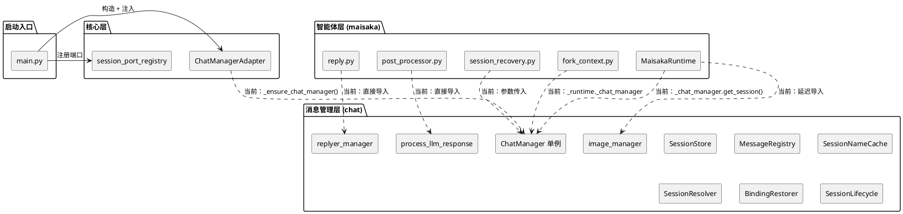
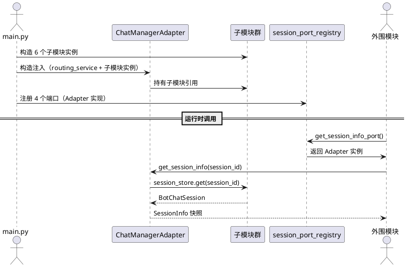
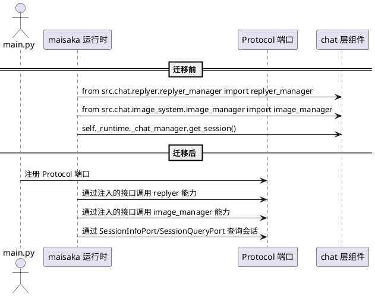

# **1. 组件定位**

## **1.1 核心职责**

本组件负责消除 ChatManager 全局单例的物理耦合和 maisaka → chat 的跨层物理依赖，实现适配器层依赖注入和智能体层物理隔离。

## **1.2 核心输入**

1. **ChatManager 子模块实例**：来自 `src/chat/message_receive/` 的 6 个子模块（SessionStore/MessageRegistry/SessionNameCache/SessionResolver/BindingRestorer/SessionLifecycle），当前通过 ChatManager 单例间接访问
2. **chat 层工具函数**：来自 `src/chat/` 的 3 个跨层导入目标（process_llm_response、replyer_manager、image_manager），当前被 maisaka 直接导入
3. **启动入口注入点**：来自 `src/main.py` 的组件初始化流程，当前在此处构造 ChatManagerAdapter 并注入 chat_manager 单例

## **1.3 核心输出**

1. **依赖注入后的适配器**：ChatManagerAdapter 通过构造函数接收子模块实例，不再持有 ChatManager 单例引用
2. **Protocol 端口实例**：通过注册点暴露的 SessionInfoPort/SessionLifecyclePort/SessionQueryPort/MessageRegistryPort 实例
3. **消除跨层导入后的 maisaka**：maisaka 不再直接导入 `src.chat.*` 的任何具体类或函数
4. **可退役的 ChatManager 薄协调层**：ChatManager 类在子模块直接注入后可降级或移除

## **1.4 职责边界**

1. 本组件不负责 ChatManager 内部子模块的功能变更（SSD-2 已完成拆分，子模块职责不变）
2. 本组件不负责新增 Protocol 接口（SSD-1 已完成 5 个 Protocol 定义，接口签名不变）
3. 本组件不负责 maisaka 内部业务逻辑变更（仅迁移导入来源，不改业务行为）
4. 本组件不负责 A_memorix 或 WebUI 的适配器调整（它们已通过注册点访问，不直接导入 ChatManager）

# **2. 领域术语**

**ChatManager 单例**
: 定义在 `src/chat/message_receive/chat_manager.py` 模块级的全局 `ChatManager()` 实例，通过 `chat_manager = ChatManager()` 创建，被适配器层和外围模块延迟导入使用。

**适配器层**
: `src/core/adapters/` 目录下的模块，是唯一允许导入组件具体类的地方。当前 ChatManagerAdapter 通过 `_ensure_chat_manager()` 持有 ChatManager 单例引用。

**子模块直接注入**
: ChatManagerAdapter 不再持有 ChatManager 单例，改为在构造时直接接收 6 个子模块实例（SessionStore/MessageRegistry 等），逐方法委托到子模块而非 ChatManager 薄协调层。

**跨层物理依赖**
: maisaka（智能体层）直接导入 `src.chat.*`（消息管理层）的具体类或函数，违反"核心只依赖 Protocol"原则。当前有 3 处直接导入和 3 处间接访问。

**注册点模式**
: `src/core/session_port_registry.py` 中的全局注册/获取函数对，供外围模块通过 Protocol 查询会话信息，替代直接导入 chat_manager。

**延迟导入**
: 在函数体内部执行 `from src.chat.xxx import yyy`，规避模块级循环依赖。这是 workaround 而非解决方案，本组件要求消除。

**ChatManager 薄协调层**
: SSD-2 拆分后的 ChatManager 类（143 行），持有 6 个子模块实例，对外方法逐一委托。本组件完成后此协调层可降级或移除。

# **3. 角色与边界**

## **3.1 核心角色**

- **系统启动流程**：在 `main.py` 中构造组件实例、注入依赖、注册 Protocol 端口
- **架构维护者**：审核迁移后的代码是否符合"核心只依赖 Protocol"原则

## **3.2 外部系统**

- **ChatManager 子模块群**（SessionStore/MessageRegistry/SessionNameCache/SessionResolver/BindingRestorer/SessionLifecycle）：提供会话存储、消息注册、名称缓存、路由解析、绑定恢复、生命周期管理能力，当前被 ChatManager 单例持有
- **chat 工具层**（process_llm_response/replyer_manager/image_manager）：提供回复后处理、表达方式选择、图片描述能力，当前被 maisaka 直接导入
- **session_port_registry**：全局注册点，供 A_memorix/WebUI 等外围模块查询会话信息
- **MaisakaHeartFlowChatting**：maisaka 运行时，当前通过 `self._runtime._chat_manager` 访问 ChatManager 单例

## **3.3 交互上下文**

# **4. DFX约束**

## **4.1 性能**

1. 适配器方法调用延迟不得超过当前水平（当前通过 ChatManager 单例间接调用，增加一层委托；直接注入子模块后应持平或更优）
2. 启动时依赖注入的初始化耗时不得超过 50ms（纯对象引用传递，无 I/O）
3. maisaka 跨层调用迁移后，单次调用延迟不得超过迁移前水平

## **4.2 可靠性**

1. 迁移过程中所有 Protocol 端口的行为必须与迁移前完全一致（零行为变更）
2. 启动顺序必须显式保证：子模块实例化 → 适配器构造注入 → 注册点注册 → 外围模块使用
3. 适配器在未注入子模块时必须立即抛出 RuntimeError，不得静默返回 None

## **4.3 安全性**

1. 适配器层仍然是唯一允许导入组件具体类的地方，迁移后此约束不变
2. maisaka 迁移后不得引入新的 `from src.chat.*` 导入，ruff TID251 守卫应覆盖
3. ChatManager 单例退役后，模块级 `chat_manager = ChatManager()` 必须移除，防止外部模块绕过适配器直接导入

## **4.4 可维护性**

1. 迁移后 `src/maisaka/` 目录下零 `from src.chat.*` 导入（可通过 ruff 规则验证）
2. ChatManagerAdapter 不再持有 ChatManager 单例引用，改为直接持有子模块实例
3. ChatManager 薄协调层可降级为纯启动编排器或完全移除

## **4.5 兼容性**

1. Protocol 接口签名不变（SessionRepository/SessionInfoPort/SessionLifecyclePort/SessionQueryPort/MessageRegistryPort）
2. 注册点 API 不变（register_*/get_* 函数签名）
3. 外围模块（A_memorix/WebUI/插件运行时）零修改

# **5. 核心能力**

## **5.1 ChatManager 单例物理退役**

### **5.1.1 业务规则**

1. **子模块直接注入规则**：ChatManagerAdapter 必须在构造时接收 6 个子模块实例，不再通过 `_ensure_chat_manager()` 获取 ChatManager 单例
   a. 验收条件：[ChatManagerAdapter 构造时传入子模块实例] → [适配器方法直接委托到子模块，不经过 ChatManager 协调层]

2. **ChatManager 单例移除规则**：`chat_manager.py` 模块级的 `chat_manager = ChatManager()` 必须移除，改为在 `main.py` 中显式构造
   a. 验收条件：[任何模块执行 `from src.chat.message_receive.chat_manager import chat_manager`] → [ImportError 或 ruff 报错]

3. **适配器零 ChatManager 引用规则**：ChatManagerAdapter 不得持有 ChatManager 类型的引用，不得调用 ChatManager 的任何方法
   a. 验收条件：[grep ChatManagerAdapter 文件中的 ChatManager] → [零匹配（不含注释和文档字符串）]

4. **启动编排规则**：`main.py` 必须显式构造子模块实例并注入适配器，启动顺序必须可追溯
   a. 验收条件：[main.py 初始化流程] → [子模块实例化 → 适配器构造注入 → 注册点注册，每步可见]

5. **禁止项**：禁止在适配器层保留 `_ensure_chat_manager()` 方法或任何延迟获取单例的机制
   a. 验收条件：[grep _ensure_chat_manager] → [零匹配]

### **5.1.2 交互流程**

### **5.1.3 异常场景**

1. **子模块未注入**
   a. 触发条件：ChatManagerAdapter 构造时某个子模块参数为 None
   b. 系统行为：构造函数立即抛出 TypeError 或 ValueError
   c. 用户感知：启动失败，日志明确提示哪个子模块未注入

2. **注册点未注册时访问**
   a. 触发条件：外围模块在启动完成前调用 `get_session_info_port()`
   b. 系统行为：返回 None（当前行为，保持不变）
   c. 用户感知：调用方得到 None，需自行处理

3. **ChatManager 单例残留导入**
   a. 触发条件：迁移后有模块仍执行 `from src.chat.message_receive.chat_manager import chat_manager`
   b. 系统行为：ImportError（模块级变量已移除）或 ruff TID251 报错
   c. 用户感知：启动失败或 CI 检查不通过

## **5.2 maisaka → chat 跨层物理依赖消除**

### **5.2.1 业务规则**

1. **直接导入消除规则**：maisaka 目录下所有 `from src.chat.*` 导入必须消除，替换为 Protocol 接口调用或函数物理迁移
   a. 验收条件：[grep "from src\.chat\." src/maisaka/] → [零匹配]

2. **间接访问消除规则**：maisaka 通过 `self._runtime._chat_manager` 访问 ChatManager 单例的模式必须消除
   a. 验收条件：[grep "_chat_manager" src/maisaka/] → [零匹配]

3. **process_llm_response 物理迁移规则**：`process_llm_response` 函数必须从 `src/chat/utils/utils.py` 物理迁移到 maisaka 层（逻辑上属于 maisaka 回复后处理），原位置保留 re-export 或直接删除
   a. 验收条件：[process_llm_response 定义在 maisaka 层] → [maisaka 内部导入来自 maisaka 自身模块，不再来自 src.chat]

4. **replyer_manager 接口化规则**：maisaka 的 reply 工具对 replyer_manager 的依赖必须通过 Protocol 接口或注入机制访问，不再直接导入
   a. 验收条件：[reply.py 中无 `from src.chat.replyer.replyer_manager import replyer_manager`] → [通过注入的接口或注册点访问]

5. **image_manager 接口化规则**：maisaka 运行时对 image_manager 的延迟导入必须替换为 Protocol 接口调用
   a. 验收条件：[runtime.py 中无 `from src.chat.image_system.image_manager import image_manager`] → [通过注入的接口访问]

6. **session_recovery 消除 ChatManager 依赖规则**：session_recovery 不再接收 ChatManager 实例参数，改为通过 SessionQueryPort 等 Protocol 接口访问
   a. 验收条件：[session_recovery.py 中无 chat_manager 参数] → [通过 Protocol 接口查询]

7. **fork_context 消除 _chat_manager 访问规则**：fork_context 不再通过 `self._runtime._chat_manager.get_session()` 访问，改为通过注入的 Protocol 接口
   a. 验收条件：[fork_context.py 中无 _chat_manager] → [通过 SessionInfoPort 或 SessionQueryPort 查询]

8. **禁止项**：禁止 maisaka 新增任何 `from src.chat.*` 导入；禁止 maisaka 持有 ChatManager 类型引用
   a. 验收条件：[ruff TID251 守卫覆盖 src/maisaka/ 目录] → [新增违规导入时 CI 不通过]

### **5.2.2 交互流程**

### **5.2.3 异常场景**

1. **process_llm_response 迁移后原调用方断裂**
   a. 触发条件：`src/chat/` 内部仍有模块调用 `process_llm_response`，但函数已迁移
   b. 系统行为：原位置保留 re-export（`from src.maisaka.xxx import process_llm_response`），或调用方同步迁移
   c. 用户感知：无感知（re-export 保证兼容）

2. **replyer_manager 接口化后功能缺失**
   a. 触发条件：注入的接口未覆盖 replyer_manager 的全部被调用方法
   b. 系统行为：调用未定义的方法时抛出 AttributeError
   c. 用户感知：运行时错误，日志提示接口方法缺失

3. **image_manager 延迟导入替换后初始化时序问题**
   a. 触发条件：maisaka 运行时在 image_manager 接口未注册时尝试调用
   b. 系统行为：接口返回 None 或抛出 RuntimeError
   c. 用户感知：图片描述功能不可用，日志提示接口未注册

4. **fork_context 通过 Protocol 查询返回 None**
   a. 触发条件：fork_context 通过 SessionInfoPort 查询会话，但会话不存在
   b. 系统行为：返回 None，fork_context 返回空列表（当前行为，保持不变）
   c. 用户感知：子智能体无法获取 system 消息列表，降级为空

# **6. 数据约束**

## **6.1 ChatManagerAdapter 注入参数**

1. **routing_service**：AgentRoutingService 类型，必填，智能体路由服务
2. **session_store**：SessionStore 类型，必填，会话内存缓存与持久化
3. **message_registry**：MessageRegistry 类型，必填，入站消息注册与缓存
4. **name_cache**：SessionNameCache 类型，必填，会话展示名称缓存
5. **resolver**：SessionResolver 类型，必填，平台/群/用户 → session_id 解析
6. **binding_restorer**：BindingRestorer 类型，可选（延迟初始化），智能体绑定恢复
7. **session_lifecycle**：SessionLifecycle 类型，可选（延迟初始化），会话创建/获取/初始化

## **6.2 maisaka 跨层依赖清单（迁移前）**

1. **process_llm_response**：函数，定义在 `src/chat/utils/utils.py`，被 `src/maisaka/context/post_processor.py` 导入。逻辑上属于 maisaka 回复后处理，应物理迁移
2. **replyer_manager**：模块级单例，定义在 `src/chat/replyer/replyer_manager.py`，被 `src/maisaka/builtin_tool/reply.py` 导入。需接口化
3. **image_manager**：模块级单例，定义在 `src/chat/image_system/image_manager.py`，被 `src/maisaka/runtime.py` 延迟导入。需接口化
4. **_chat_manager.get_session()**：ChatManager 实例方法，被 `src/maisaka/subagent/fork_context.py` 通过 `self._runtime._chat_manager` 访问。需替换为 SessionInfoPort
5. **chat_manager.get_existing_session_by_session_id()**：ChatManager 实例方法，被 `src/maisaka/agent_autonomy/session_recovery.py` 通过参数传入访问。需替换为 SessionQueryPort
6. **_query_port._ensure_chat_manager()**：ChatManagerAdapter 方法，被 `src/maisaka/runtime.py` 调用以获取 ChatManager 单例传给 session_recovery。需消除