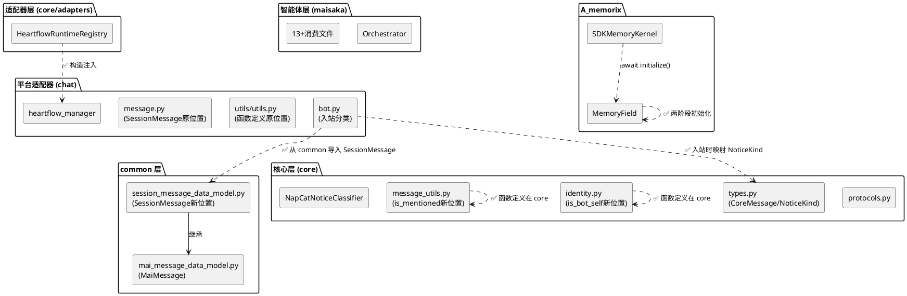
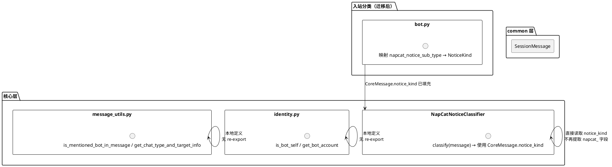
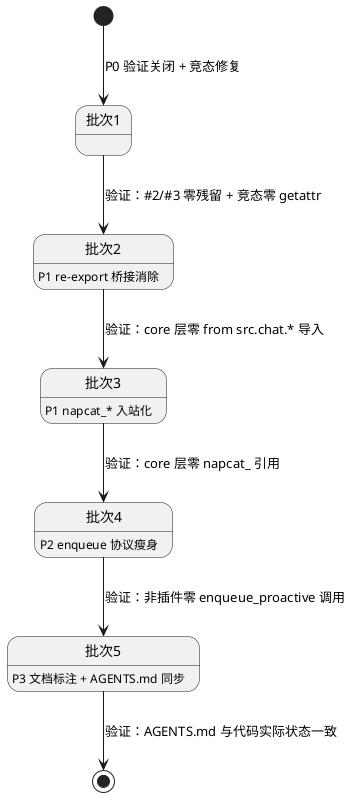
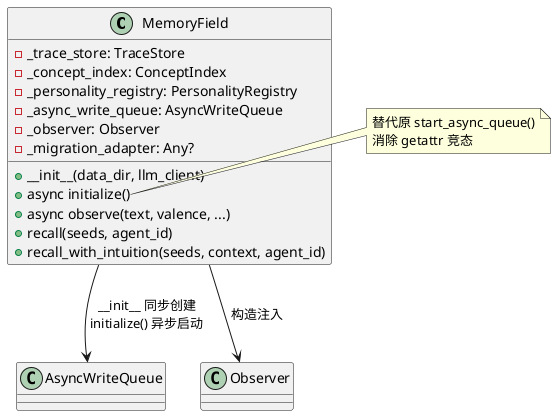
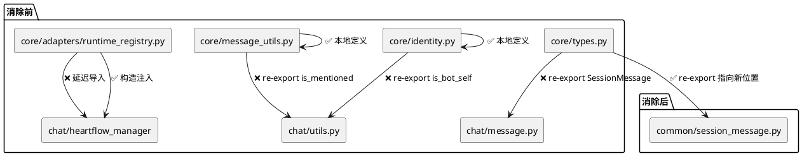
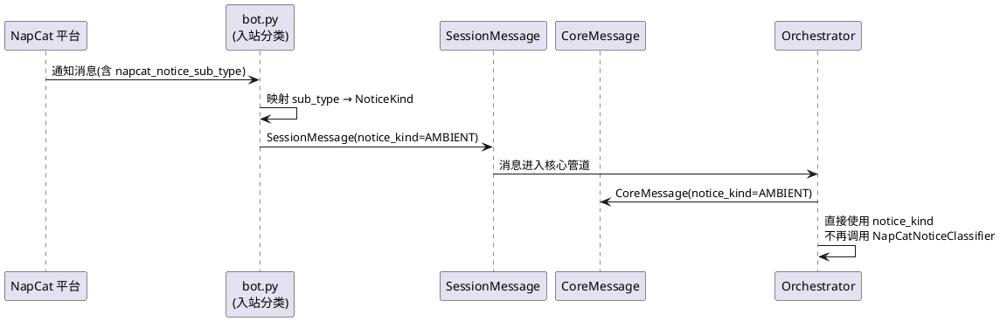

# 一、需求与存量功能关系分析

## 1.1 需求功能与存量功能对比

### 1.1.1 已实现功能

| 需求功能 | 存量功能 | 代码位置 | 匹配度 |
|---------|---------|---------|--------|
| #2 核心不访问 chat_manager._agent_router | ChatManagerRoutingAdapter 通过构造注入持有 AgentRouter，核心层不含 adapters 零引用 | `src/core/adapters/routing_adapter.py:18` | 100% |
| #3 核心不持有 BotChatSession 可变引用 | ChatManagerAdapter 从 session_store 获取后立即转为 SessionInfo 不可变快照，core/ 和 maisaka/ 零 BotChatSession 引用 | `src/core/adapters/chat_manager_adapter.py` | 100% |
| NoticeKind 枚举定义 | AMBIENT/INTERACTION/INPUT_STATUS/UNKNOWN 四值枚举已定义 | `src/core/types.py:431-447` | 100% |
| CoreMessage.notice_kind 字段 | CoreMessage dataclass 已含 notice_kind 字段，默认 UNKNOWN | `src/core/types.py:463` | 100% |
| Orchestrator 插话不走 enqueue_proactive_task | 插话通过 `_trigger_interjection_for` 直接调用 ThinkingOrgan | `src/maisaka/agent_autonomy/orchestrator.py` | 100% |
| enqueue_proactive_task 文档字符串约束 | ChatRuntime Protocol 中已有"仅用于插件主动对话，禁止用于多智能体插话"文档 | `src/core/protocols.py:134` | 100% |
| MemoryField.start_async_queue() | SDKMemoryKernel.initialize() 中已调用 `await self._memory_field.start_async_queue()` | `src/A_memorix/core/runtime/sdk_memory_kernel.py:413` | 100% |
| AsyncWriteQueue.start() 异步启动 | AsyncWriteQueue.start() 是 async 方法，通过 asyncio.create_task 启动消费协程 | `src/A_memorix/core/connectionist/async_write_queue.py:32-36` | 100% |

### 1.1.2 需要扩展的功能

| 需求功能 | 存量功能 | 差异说明 | 扩展方向 |
|---------|---------|---------|---------|
| #2/#3 AGENTS.md 状态更新 | AGENTS.md 中 #2/#3 仍标记为"未消除" | 代码已实际消除，但文档状态未同步 | 更新 AGENTS.md 核心禁止项 #2/#3 为 ✅ 已消除，附验证方法和日期 |
| #4 napcat_* 分类入站化 | NapCatNoticeClassifier 在适配器层拉取 napcat_notice_sub_type 进行分类 | 分类逻辑在核心适配器层而非入站点；核心层（含适配器）有 7 处 napcat_ 引用 | 将映射常量移至 bot.py 入站点，NapCatNoticeClassifier 改为使用 CoreMessage 中已填充的 notice_kind |
| #7 enqueue_proactive_task 协议瘦身 | ChatRuntime Protocol 中定义了 enqueue_proactive_task，文档已有约束，但无 ruff 守卫 | 缺少编译时/CI 级别的防护；chat_loop_adapter 代理层可能多余 | 新增 ruff banned-api 规则限制非插件调用方；评估移除 chat_loop_adapter 代理 |
| MemoryField._async_write_started 竞态修复 | observe() 中通过 `getattr(self, "_async_write_started", False)` 延迟检测队列启动状态 | 并发 observe() 可能在 _async_write_started 赋值前同时通过 getattr 检查，导致重复创建队列 | 消除 getattr 模式，改为在 __init__ 中同步创建 AsyncWriteQueue 对象，在 initialize() 中异步启动 |
| re-export 桥接消除 — SessionMessage | core/types.py:818 re-export SessionMessage from chat | SessionMessage 定义在 chat 层，core 层通过 re-export 桥接给 maisaka 使用 | 将 SessionMessage 物理迁移到 common 层，core/types.py re-export 指向新位置 |
| re-export 桥接消除 — identity | core/identity.py:10-11 re-export get_bot_account/is_bot_self from chat | 函数定义在 chat/utils/utils.py，core 层纯 re-export | 将函数及依赖的辅助函数物理迁移到 core/identity.py |
| re-export 桥接消除 — message_utils | core/message_utils.py:98-99 re-export is_mentioned_bot_in_message/get_chat_type_and_target_info from chat | 函数定义在 chat/utils/utils.py，core 层纯 re-export | 将函数物理迁移到 core/message_utils.py |
| re-export 桥接消除 — HeartflowRuntimeRegistry | runtime_registry.py:21 延迟导入 heartflow_manager | 每次方法调用都执行延迟导入，违反构造注入原则 | 改为构造注入 heartflow_manager 实例 |

### 1.1.3 需要新增的功能或接口

**1. bot.py 入站通知分类映射**

- 输入：napcat 通知消息的 `additional_config.napcat_notice_sub_type` 字段
- 输出：CoreMessage.notice_kind 枚举值（AMBIENT/INTERACTION/INPUT_STATUS/UNKNOWN）
- 核心逻辑：在 bot.py 的 `receive_message()` 或 `handle_notice_message()` 中，读取 napcat_notice_sub_type 并映射为 NoticeKind，写入 SessionMessage 的 notice_kind 字段
- 依赖：NapCatNoticeClassifier 中现有的 `_NAPCAT_*_SUBTYPES` 常量（需迁移或复制到 bot.py）
- 注意：当前 CoreMessage 和 SessionMessage 是不同类型，bot.py 处理的是 SessionMessage，需确认 SessionMessage 是否有 notice_kind 字段或需要新增

**2. ruff banned-api 规则新增**

- 输入：pyproject.toml 的 ruff 配置
- 输出：禁止在 src/core/（不含 adapters/）中使用 napcat_ 前缀字段名；禁止在 src/maisaka/agent_autonomy/ 中调用 enqueue_proactive_task
- 核心逻辑：扩展 banned-api 列表
- 依赖：pyproject.toml

**3. MemoryField 两阶段初始化**

- 输入：MemoryField 构造参数 + 异步初始化需求
- 输出：`__init__` 中同步创建 AsyncWriteQueue 对象 + `async def initialize()` 中启动异步消费协程
- 核心逻辑：将队列对象创建与异步启动分离，消除 getattr 竞态
- 依赖：SDKMemoryKernel.initialize() 中调用 await memory_field.initialize()

## 1.2 存量功能详细分析

### 1.2.1 NapCatNoticeClassifier 当前实现

**接口契约**：实现 NoticeClassifier Protocol，`classify(message: Any) -> NoticeKind`。

**业务规则**：
- `_extract_napcat_sub_type()` 从 message 的三种可能结构中提取 napcat_notice_sub_type
- 三级常量映射：`_NAPCAT_INPUT_STATUS_SUBTYPES` → INPUT_STATUS，`_NAPCAT_AMBIENT_SUBTYPES` → AMBIENT，`_NAPCAT_INTERACTION_SUBTYPES` → INTERACTION
- input_status 同时出现在 AMBIENT 和 INPUT_STATUS 中，INPUT_STATUS 优先匹配

**约束**：
- 适配器层是唯一允许感知平台特定字段的地方（当前合规）
- 但核心层（含适配器）不应出现 napcat_ 前缀字段名的硬编码引用（当前违规）
- `_extract_napcat_sub_type()` 使用 `hasattr` + `getattr` 动态探测消息结构，类型不安全

### 1.2.2 MemoryField._async_write_started 竞态根因

**当前流程**：
1. `MemoryField.__init__` — 不创建 AsyncWriteQueue，不设置 `_async_write_started`
2. `SDKMemoryKernel.initialize()` — 创建 MemoryField 后调用 `await self._memory_field.start_async_queue()`
3. `start_async_queue()` — `getattr(self, "_async_write_started", False)` 检查 → 创建队列 → 设置标志
4. `observe()` — `getattr(self, "_async_write_started", False)` 检查 → 未启动则调用 `start_async_queue()`

**竞态场景**：步骤 3 和 4 之间存在时间窗口——`getattr` 检查通过但 `_async_write_started` 尚未赋值时，另一个协程也通过 getattr 检查，导致重复创建队列。

**关键发现**：`AsyncWriteQueue.start()` 是 async 方法（`asyncio.create_task`），但 `AsyncWriteQueue.__init__` 是同步的。因此可以在 `MemoryField.__init__` 中同步创建队列对象（不启动消费协程），在 `initialize()` 中异步启动。这消除了 getattr 竞态，同时不需要改变 AsyncWriteQueue 本身。

**约束**：
- SDKMemoryKernel.initialize() 已在异步上下文中调用 `await self._memory_field.start_async_queue()`
- 改为 `await self._memory_field.initialize()` 对调用方透明
- host_service.py:558 也有 `await kernel.initialize()` 调用，不受影响

### 1.2.3 re-export 桥接依赖分析

**SessionMessage 依赖链**：
- 继承 `MaiMessage`（`src/common/data_models/mai_message_data_model.py`）
- 依赖 `Messages` 数据库模型（`src/common/database/database_model.py`）
- 依赖 `get_db_session`（`src/common/database/database.py`）
- 依赖 `MessageSequence`、各种 Component（`src/common/data_models/message_component_data_model.py`）
- 所有依赖均在 common 层，迁移到 common 可行

**is_bot_self/get_bot_account 依赖链**：
- 依赖 `global_config`（`src/config/config.py`）— 全局可访问
- 依赖 `_get_configured_qq_account()` — 纯配置读取函数，无 chat 层依赖
- 依赖 `parse_platform_accounts()` — 纯配置解析函数，无 chat 层依赖
- `is_bot_self` 依赖 `get_bot_account`（同文件内调用）
- 迁移到 core/identity.py 可行，需同时迁移辅助函数

**is_mentioned_bot_in_message 依赖链**：
- 依赖 `SessionMessage` 类型（迁移后在 common 层）
- 依赖 `global_config` — 全局可访问
- 依赖 `AtComponent`（common 层）
- 依赖 `get_bot_account`（迁移后在 core/identity.py）
- 依赖 `_has_at_component_targeting_bot`（同文件内辅助函数，需一起迁移）
- 迁移到 core/message_utils.py 可行

**get_chat_type_and_target_info 依赖链**：
- 依赖 `get_session_info`（`src/core/session_port_registry.py`）— 已在 core 层
- 依赖 `Person`（`src/person_info/person_info.py`）— 外部模块
- 依赖 `ChatTargetInfo`（`src/common/data_models/chat_target_info_data_model.py`）— common 层
- Person 依赖是跨模块的，但 person_info 不在 chat 层，迁移不引入 chat 依赖
- 迁移到 core/message_utils.py 可行

**HeartflowRuntimeRegistry 依赖链**：
- 延迟导入 `heartflow_manager`（`src/chat/heart_flow/heartflow_manager.py`）
- 使用 `heartflow_manager.heartflow_chat_list` 和 `heartflow_manager.get_or_create_heartflow_chat()`
- 适配器层允许导入 chat 层具体类，但应改为构造注入而非延迟导入

### 1.2.4 enqueue_proactive_task 调用方分析

| 调用方 | 文件 | 行号 | 用途 | 合规性 |
|--------|------|------|------|--------|
| plugin_runtime | `src/plugin_runtime/capabilities/core.py` | 240 | 插件主动对话 | ✅ 合法 |
| chat_loop_adapter | `src/maisaka/agent_autonomy/bridge/chat_loop_adapter.py` | 90-99 | 代理转发 | ⚠️ 评估是否多余 |
| MaisakaRuntime | `src/maisaka/runtime.py` | 648 | 实现 | ✅ 实现方 |
| ChatRuntime Protocol | `src/core/protocols.py` | 126 | 定义 | ✅ 定义方 |

**chat_loop_adapter 代理层评估**：
- 当前代理层将 `enqueue_proactive_task` 转发到 `_chat_loop_service`（即 MaisakaRuntime）
- plugin_runtime 已绕过代理层，直接通过 heartflow_manager 获取 runtime 调用
- 代理层的文档字符串说"让管家/提醒等核心模块触发 Planner"，但管家/提醒已改用 ThinkingOrgan 直接触发
- 结论：代理层可移除，但需确认无其他调用方

### 1.2.5 bot.py 通知处理流程分析

**当前流程**：
1. 适配器上报消息字典 → `message_process()` 构造 SessionMessage
2. `receive_message()` 处理消息 → `handle_notice_message()` 识别通知类型
3. 消息进入 Orchestrator → Orchestrator 调用 `_classify_notice()` → NapCatNoticeClassifier.classify()
4. NapCatNoticeClassifier 从 SessionMessage 的 additional_config 中提取 napcat_notice_sub_type

**关键发现**：bot.py 的 `handle_notice_message()` 当前仅做类型识别（返回 bool），不做 NoticeKind 映射。CoreMessage 有 notice_kind 字段，但 SessionMessage 没有。入站分类需要在 SessionMessage 层面增加 notice_kind 支持，或在构造 CoreMessage 时进行映射。

**SessionMessage 与 CoreMessage 的关系**：SessionMessage 是 chat 层的富消息类型（含数据库持久化、媒体处理），CoreMessage 是核心层的轻量消息类型（仅含核心关心的字段）。Orchestrator 消费 CoreMessage。入站分类的映射点应在 SessionMessage → CoreMessage 转换时完成。

# 二、增量设计方案

## 2.1 实现模型

### 2.1.1 上下文视图



### 2.1.2 服务/组件总体架构



### 2.1.3 实现设计文档

#### 编码批次状态机



#### 批次1：P0 验证关闭 + 竞态修复

**1a. #2/#3 验证关闭**

验证命令：
```bash
# #2 验证：核心层不含 adapters 零 chat_manager._agent_router
rg "chat_manager\._agent_router" src/core/ --glob '!adapters/**'
# 预期：零匹配

# #2 验证：全局零 chat_manager._agent_router（适配器层是自身私有属性，不是 ChatManager 的）
rg "chat_manager\._agent_router" src/
# 预期：零匹配（ChatManagerRoutingAdapter._agent_router 是适配器自身的属性，不是 ChatManager 的）

# #3 验证：核心层不含 adapters 零 BotChatSession
rg "BotChatSession" src/core/ --glob '!adapters/**'
# 预期：零匹配

# #3 验证：maisaka 层零 BotChatSession
rg "BotChatSession" src/maisaka/
# 预期：零匹配
```

AGENTS.md 更新内容：
- #2 状态改为 `✅ 已消除（构造注入 AgentRouter + ruff TID251 守卫，SSD-4 验证关闭）`
- #3 状态改为 `✅ 已消除（SessionInfo 不可变快照 + ChatManagerAdapter 立即转换，SSD-4 验证关闭）`

**1b. MemoryField._async_write_started 竞态修复**

当前代码问题定位：
- `memory_field.py:81` — `getattr(self, "_async_write_started", False)` 延迟检测
- `memory_field.py:88` — `self._async_write_started = True` 赋值
- `memory_field.py:117` — `getattr(self, "_async_write_started", False)` observe() 热路径检测

AsyncWriteQueue.start() 分析：
- `async_write_queue.py:32-36` — `start()` 是 async 方法，内部通过 `asyncio.create_task` 启动消费协程
- `async_write_queue.py:26-29` — `__init__` 是同步方法，创建 asyncio.Queue 和初始化状态
- 关键：队列对象的创建是同步的，只有消费协程的启动是异步的

推荐方案：两阶段初始化

```
阶段1（同步）：MemoryField.__init__ 中创建 AsyncWriteQueue 对象
    self._async_write_queue = AsyncWriteQueue(self._observer)

阶段2（异步）：MemoryField.initialize() 中启动消费协程
    async def initialize(self) -> None:
        await self._async_write_queue.start()

调用方：SDKMemoryKernel.initialize() 中
    await self._memory_field.initialize()  # 替换 await self._memory_field.start_async_queue()
```

变更范围：
1. `memory_field.py` — `__init__` 中创建 AsyncWriteQueue 对象；新增 `async def initialize()`；删除 `start_async_queue()` 方法；删除所有 `getattr(self, "_async_write_started", False)` 引用；`observe()` 中直接使用 `self._async_write_queue.enqueue()`
2. `sdk_memory_kernel.py:413` — `await self._memory_field.start_async_queue()` 改为 `await self._memory_field.initialize()`
3. `sdk_memory_kernel.py:418` — `await self._memory_field._async_write_queue.stop()` 保持不变（队列对象已在 __init__ 中创建）

验证方案：
```bash
# 零 getattr 竞态残留
rg "getattr.*_async_write_started" src/A_memorix/
# 预期：零匹配

# 零 start_async_queue 调用
rg "start_async_queue" src/A_memorix/
# 预期：零匹配

# initialize() 调用存在
rg "memory_field.*initialize\|_memory_field\.initialize" src/A_memorix/core/runtime/sdk_memory_kernel.py
# 预期：1 匹配
```

#### 批次2：P1 re-export 桥接消除

**迁移顺序**（按依赖关系，避免循环导入）：

```
步骤1: SessionMessage → common 层（无上游依赖）
步骤2: is_bot_self/get_bot_account → core/identity.py（依赖 global_config，无 chat 依赖）
步骤3: is_mentioned_bot_in_message → core/message_utils.py（依赖 SessionMessage[步骤1] + get_bot_account[步骤2]）
步骤4: get_chat_type_and_target_info → core/message_utils.py（依赖 get_session_info[core] + Person[外部]）
步骤5: HeartflowRuntimeRegistry 构造注入（独立）
步骤6: 验证 + 清理
```

**步骤1：SessionMessage 物理迁移到 common 层**

目标文件：`src/common/data_models/session_message_data_model.py`

迁移内容：
- `SessionMessage` 类（含 `__str__`、`__repr__`、`to_debug_string`、`process`、数据库方法等）
- `MsgIDMapping` 辅助类

导入链变更：
- `src/core/types.py:818` — re-export 改为 `from src.common.data_models.session_message_data_model import SessionMessage as SessionMessage`
- `src/chat/message_receive/message.py` — 改为 `from src.common.data_models.session_message_data_model import SessionMessage`，原文件保留 re-export 或删除
- `src/chat/message_receive/bot.py` — 从新位置导入 SessionMessage
- maisaka 13 文件 — 无需修改（从 core.types 导入路径不变）

chat 层反向兼容方案：
- `src/chat/message_receive/message.py` 保留 re-export：`from src.common.data_models.session_message_data_model import SessionMessage as SessionMessage`
- chat 层内部文件从原位置导入不受影响（re-export 指向新位置）
- 后续可逐步清理 chat 层内部导入

**步骤2：is_bot_self/get_bot_account 物理迁移到 core/identity.py**

迁移内容：
- `get_bot_account(platform: str) -> str`
- `is_bot_self(platform: str, user_id: str) -> bool`
- 辅助函数：`_get_configured_qq_account()`、`parse_platform_accounts()`、`get_all_bot_accounts()`
- 模块级变量：`_warned_unconfigured_platforms`

依赖分析：
- `global_config` — 全局可访问，无 chat 依赖
- `parse_platform_accounts` — 纯配置解析，无 chat 依赖
- 所有依赖均在 config/common 层，迁移无障碍

导入链变更：
- `src/core/identity.py` — 从 re-export 改为函数的真实定义
- `src/chat/utils/utils.py` — 保留 re-export 或删除（chat 层内部可能仍有调用方）
- maisaka 4 文件 — 无需修改（从 core.identity 导入路径不变）

chat 层反向兼容方案：
- `src/chat/utils/utils.py` 保留 re-export：`from src.core.identity import is_bot_self, get_bot_account`
- chat 层内部调用方无需修改

**步骤3：is_mentioned_bot_in_message 物理迁移到 core/message_utils.py**

迁移内容：
- `is_mentioned_bot_in_message(message: SessionMessage) -> tuple[bool, bool, float]`
- 辅助函数：`_has_at_component_targeting_bot(message: SessionMessage, platform: str) -> bool`

依赖分析：
- `SessionMessage` — 步骤1 已迁移到 common 层
- `global_config` — 全局可访问
- `AtComponent` — common 层
- `get_bot_account` — 步骤2 已迁移到 core/identity.py

导入链变更：
- `src/core/message_utils.py` — 从 re-export 改为函数的真实定义
- `src/chat/utils/utils.py` — 保留 re-export
- maisaka 1 文件 — 无需修改

**步骤4：get_chat_type_and_target_info 物理迁移到 core/message_utils.py**

迁移内容：
- `get_chat_type_and_target_info(chat_id: str) -> Tuple[bool, Optional[ChatTargetInfo]]`

依赖分析：
- `get_session_info` — `src/core/session_port_registry.py`（已在 core 层）
- `Person` — `src/person_info/person_info.py`（外部模块，不在 chat 层）
- `ChatTargetInfo` — `src/common/data_models/chat_target_info_data_model.py`（common 层）
- 迁移不引入 chat 层依赖

导入链变更：
- `src/core/message_utils.py` — 从 re-export 改为函数的真实定义
- `src/chat/utils/utils.py` — 保留 re-export
- maisaka 1 文件 — 无需修改

**步骤5：HeartflowRuntimeRegistry 构造注入**

变更内容：
- `HeartflowRuntimeRegistry.__init__` 新增 `heartflow_manager` 参数
- 删除 `_ensure_manager()` 方法
- 所有方法改为直接使用 `self._heartflow_manager`
- main.py 中构造 HeartflowRuntimeRegistry 时注入 heartflow_manager

```python
class HeartflowRuntimeRegistry:
    def __init__(self, heartflow_manager: Any) -> None:
        self._heartflow_manager = heartflow_manager

    async def get_runtime(self, session_id: str) -> Optional[ChatRuntime]:
        runtime = self._heartflow_manager.heartflow_chat_list.get(session_id)
        return runtime
```

**步骤6：验证 + 清理**

验证命令：
```bash
# core 层零 from src.chat.* 导入（不含 adapters/）
rg "from src\.chat\." src/core/ --glob '!adapters/**'
# 预期：零匹配

# core/adapters/ 中仅保留必要的 chat 层导入
rg "from src\.chat\." src/core/adapters/
# 预期：仅 chat_manager_adapter.py 和 notice_classifier.py 中的合理导入
```

#### 批次3：P1 napcat_* 入站化

**3a. 映射常量迁移**

将 `_NAPCAT_*_SUBTYPES` 常量从 `src/core/adapters/notice_classifier.py` 迁移到 `src/chat/message_receive/bot.py`（或其子模块）。

迁移后的常量位置：`src/chat/message_receive/notice_type_mapping.py`（新建文件）

```python
"""NapCat 通知子类型 → NoticeKind 映射常量。

仅由 bot.py 入站分类使用，核心层不引用此文件。
"""
from src.core.types import NoticeKind

NAPCAT_NOTICE_KIND_MAP: dict[str, NoticeKind] = {
    # INPUT_STATUS（最高优先级）
    "input_status": NoticeKind.INPUT_STATUS,
    # AMBIENT
    "group_ban": NoticeKind.AMBIENT,
    "group_increase": NoticeKind.AMBIENT,
    "group_decrease": NoticeKind.AMBIENT,
    "group_name": NoticeKind.AMBIENT,
    "group_upload": NoticeKind.AMBIENT,
    "group_msg_emoji_like": NoticeKind.AMBIENT,
    # INTERACTION
    "poke": NoticeKind.INTERACTION,
    "group_poke": NoticeKind.INTERACTION,
    "friend_add": NoticeKind.INTERACTION,
    "group_admin": NoticeKind.INTERACTION,
}
```

**3b. bot.py 入站分类实现**

在 `bot.py` 的 `handle_notice_message()` 或 `receive_message()` 中，对通知消息执行 NoticeKind 映射：

```python
# 在 receive_message() 中，构造 CoreMessage 之前
if message.is_notify:
    from src.chat.message_receive.notice_type_mapping import NAPCAT_NOTICE_KIND_MAP
    sub_type = message.message_info.additional_config.get("napcat_notice_sub_type", "")
    message.notice_kind = NAPCAT_NOTICE_KIND_MAP.get(sub_type, NoticeKind.UNKNOWN)
```

注意：SessionMessage 需要新增 `notice_kind` 属性（默认 `NoticeKind.UNKNOWN`），或在 CoreMessage 构造时从 additional_config 中提取。

**3c. NapCatNoticeClassifier 改造**

从"拉取分类"改为"使用已分类的 notice_kind"：

```python
class NapCatNoticeClassifier:
    """使用 CoreMessage.notice_kind 实现分类。

    入站分类由 bot.py 完成，此处仅读取已填充的 notice_kind。
    """

    def classify(self, message: Any) -> NoticeKind:
        # 优先使用 CoreMessage.notice_kind
        if hasattr(message, "notice_kind") and message.notice_kind != NoticeKind.UNKNOWN:
            return message.notice_kind
        # 兼容回退：从 additional_config 中读取（过渡期）
        sub_type = self._extract_napcat_sub_type(message)
        if not sub_type:
            return NoticeKind.UNKNOWN
        # ... 现有映射逻辑
```

过渡期策略：
- 保留 `_extract_napcat_sub_type()` 作为兼容回退，标注 `# TODO: SSD-5 移除`
- 删除 `_NAPCAT_*_SUBTYPES` 常量（已迁移到 notice_type_mapping.py）
- 新增 ruff banned-api 规则，禁止在 src/core/ 中新增 napcat_ 前缀引用

**3d. ruff banned-api 规则新增**

在 `pyproject.toml` 的 ruff 配置中新增：
```toml
# 禁止在核心层使用 napcat_ 前缀字段名
"napcat_notice_sub_type" = "禁止在核心层直接使用 napcat_ 字段，应通过 NoticeKind 枚举"
"napcat_notice_type" = "禁止在核心层直接使用 napcat_ 字段，应通过 NoticeKind 枚举"
"napcat_notice_payload" = "禁止在核心层直接使用 napcat_ 字段，应通过 NoticeKind 枚举"
```

限制范围：`src/core/` 目录（不含 `src/core/adapters/`），适配器层保留豁免。

验证命令：
```bash
# 核心层零 napcat_ 引用（不含适配器层过渡期代码）
rg "napcat_" src/core/ --glob '!adapters/**'
# 预期：零匹配

# 适配器层 napcat_ 引用仅剩兼容回退
rg "napcat_" src/core/adapters/notice_classifier.py
# 预期：仅 _extract_napcat_sub_type 方法内的兼容回退
```

#### 批次4：P2 enqueue_proactive_task 协议瘦身

**4a. chat_loop_adapter 代理移除评估**

当前调用方分析：
- `plugin_runtime/capabilities/core.py:240` — 直接通过 heartflow_manager 获取 runtime 调用，不经过 chat_loop_adapter
- `chat_loop_adapter.py:90-99` — 代理层，文档说"让管家/提醒等核心模块触发 Planner"，但管家/提醒已改用 ThinkingOrgan

结论：代理层可安全移除。chat_loop_adapter 中的 `enqueue_proactive_task` 方法删除，不影响任何现有功能。

**4b. ruff 守卫新增**

在 `pyproject.toml` 的 ruff 配置中新增自定义规则或 banned-api：
```toml
# 限制 enqueue_proactive_task 仅用于插件主动对话
# 通过 per-file-ignores 控制：仅 plugin_runtime/ 和 runtime.py 允许调用
```

具体方案：在 `src/maisaka/agent_autonomy/` 目录下禁止 `enqueue_proactive_task` 调用（ruff TID251 或自定义 flake8-bandit 规则）。

**4c. 兼容期策略**

- ChatRuntime Protocol 中的 `enqueue_proactive_task` 方法签名不变
- 文档字符串约束已存在（"仅用于插件主动对话，禁止用于多智能体插话"）
- chat_loop_adapter 代理方法删除
- 不从 Protocol 中移除方法（避免破坏插件兼容性）

验证命令：
```bash
# agent_autonomy 目录零 enqueue_proactive 调用（不含 bridge/）
rg "enqueue_proactive" src/maisaka/agent_autonomy/ --glob '!bridge/**'
# 预期：零匹配
```

#### 批次5：P3 文档标注 + AGENTS.md 同步

**5a. mem_core_gap 8 项差距标注**

AGENTS.md 更新内容：

| 差距 | 标注文本 |
|------|---------|
| G16 | `⚠️ 已知债务：host_service 31处 + admin 80+处访问 kernel._* 私有属性，修复成本高影响低，排期待定` |
| G18 | `⚠️ 部分完成：agent_id 参数已传递，深度联动（记忆性格影响检索权重）待后续` |
| G19 | `⚠️ 待后续：管家三层过滤第二层无法利用记忆关系数据，需新增关系查询接口` |
| G21 | `⚠️ 待后续：weave_narrative 已暴露在 MemoryServicePort，智能体思考时引用叙事上下文待集成` |
| G22 | `✅ SSD-4 修复：MemoryField 两阶段初始化根治 AsyncWriteQueue 延迟启动竞态` |
| G23 | `⚠️ 已有 None 保护：ModelConfigPort 注入时序无编译时检查，待后续` |
| G24 | `⚠️ 待后续：智能体记忆性格注册窗口期，需核心调度时序保证` |
| G28 | `⚠️ 已知债务：327处 bare except，逐个审查需单独排期` |

**5b. 核心禁止项状态同步**

AGENTS.md 核心禁止项更新：

| 编号 | 更新后状态 |
|------|-----------|
| #2 | `✅ 已消除（构造注入 AgentRouter + ruff TID251 守卫，SSD-4 验证关闭）` |
| #3 | `✅ 已消除（SessionInfo 不可变快照 + ChatManagerAdapter 立即转换，SSD-4 验证关闭）` |
| #4 | `✅ 已消除（入站分类 + NapCatNoticeClassifier 改造 + ruff banned-api 守卫，SSD-4 完成）` |
| #7 | `⚠️ 已限制（文档约束 + chat_loop_adapter 代理移除 + ruff 守卫，SSD-4 瘦身）` |

**5c. 存量债务表同步**

新增/更新条目：

| 债务 | 状态 |
|------|------|
| core 层 re-export 桥接 | ✅ 已消除（SessionMessage/identity/message_utils 物理迁移 + HeartflowRuntimeRegistry 构造注入，SSD-4 完成） |
| napcat_* 字段分类在适配器层 | ✅ 已消除（入站分类 + NapCatNoticeClassifier 改造，SSD-4 完成） |
| MemoryField._async_write_started 竞态 | ✅ 已修复（两阶段初始化，SSD-4 完成） |
| host_service 私有属性访问 | ⚠️ 已知债务（31+80处，排期待定） |
| A_memorix bare except | ⚠️ 已知债务（327处，逐个审查需单独排期） |

## 2.2 接口设计

### 2.2.1 总体设计

| 接口 | 类型 | 稳定性 | 说明 |
|------|------|--------|------|
| MemoryField.initialize() | 新增异步方法 | 稳定 | 替代 start_async_queue()，两阶段初始化 |
| NapCatNoticeClassifier.classify() | 行为变更 | 稳定 | 优先使用 CoreMessage.notice_kind，兼容回退 |
| HeartflowRuntimeRegistry.__init__() | 签名变更 | 稳定 | 新增 heartflow_manager 参数 |
| SessionMessage | 物理位置变更 | 稳定 | 从 chat 层迁移到 common 层，接口不变 |
| notice_type_mapping.NAPCAT_NOTICE_KIND_MAP | 新增常量 | 稳定 | 入站分类映射表 |

**接口变更策略**：所有 Protocol 签名不变，仅变更实现层和物理位置。消费方零修改。

### 2.2.2 接口清单

#### MemoryField.initialize()

```python
async def initialize(self) -> None:
    """异步初始化 — 启动 AsyncWriteQueue 消费协程。

    必须在首次 observe() 调用前完成。
    由 SDKMemoryKernel.initialize() 调用。
    """
    await self._async_write_queue.start()
```

**前置条件**：`__init__` 已同步创建 AsyncWriteQueue 对象
**后置条件**：消费协程已启动，observe() 可正常入队
**异常映射**：启动失败时抛出 RuntimeError，完整暴露错误

#### NapCatNoticeClassifier.classify()（改造后）

```python
def classify(self, message: Any) -> NoticeKind:
    """分类通知消息 — 优先使用 CoreMessage.notice_kind。

    入站分类由 bot.py 完成（napcat_notice_sub_type → NoticeKind）。
    此处仅读取已填充的 notice_kind，兼容回退读取 additional_config。
    """
    if hasattr(message, "notice_kind") and message.notice_kind != NoticeKind.UNKNOWN:
        return message.notice_kind
    # 兼容回退（过渡期，SSD-5 移除）
    ...
```

**前置条件**：bot.py 已在入站时填充 notice_kind
**后置条件**：返回 NoticeKind 枚举值
**异常映射**：无异常抛出，未知类型返回 NoticeKind.UNKNOWN

#### HeartflowRuntimeRegistry（改造后构造函数）

```python
class HeartflowRuntimeRegistry:
    def __init__(self, heartflow_manager: Any) -> None:
        self._heartflow_manager = heartflow_manager
```

**前置条件**：heartflow_manager 非 None
**后置条件**：Registry 持有 heartflow_manager 引用，可直接委托
**异常映射**：heartflow_manager 为 None 时方法调用抛出 AttributeError（完整暴露错误）

#### notice_type_mapping.NAPCAT_NOTICE_KIND_MAP

```python
NAPCAT_NOTICE_KIND_MAP: dict[str, NoticeKind] = {
    "input_status": NoticeKind.INPUT_STATUS,
    "group_ban": NoticeKind.AMBIENT,
    # ...
}
```

**前置条件**：NoticeKind 枚举已定义
**后置条件**：无状态变更
**异常映射**：无异常

## 2.3 数据模型

### 2.3.1 设计目标

1. 消除 core 层对 chat 层的 re-export 桥接，实现 core 层零 `from src.chat.*` 导入
2. 消除 MemoryField._async_write_started 竞态，保证异步写入队列在首次 observe() 前完成启动
3. 消除核心层 napcat_ 前缀字段名引用，实现通知分类入站化
4. 保持所有 Protocol 接口签名不变，消费方零修改

### 2.3.2 模型实现

#### MemoryField 内部结构（改造后）



#### re-export 桥接消除前后对比



#### 入站分类数据流（改造后）

