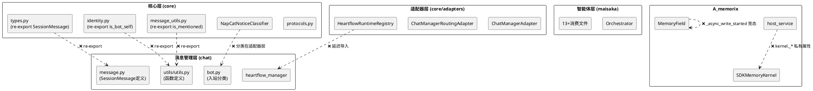
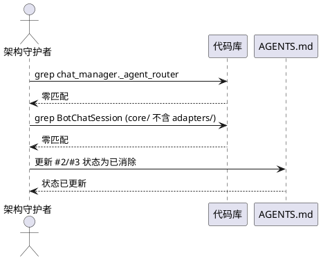
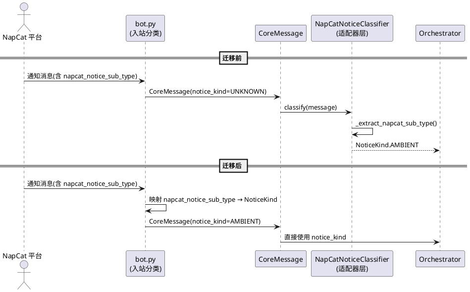
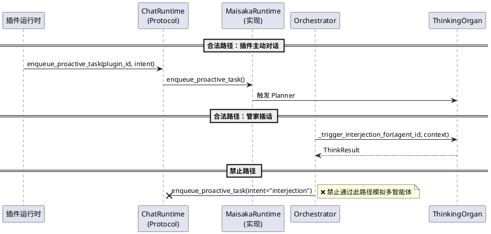
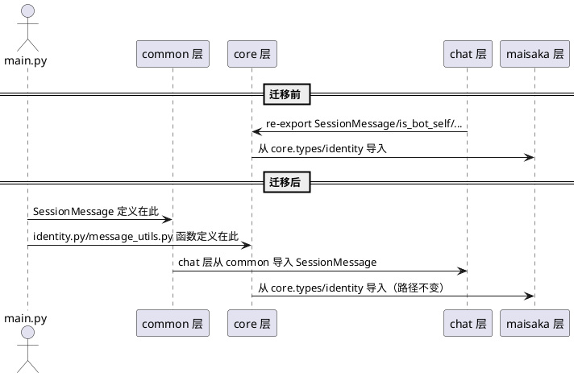
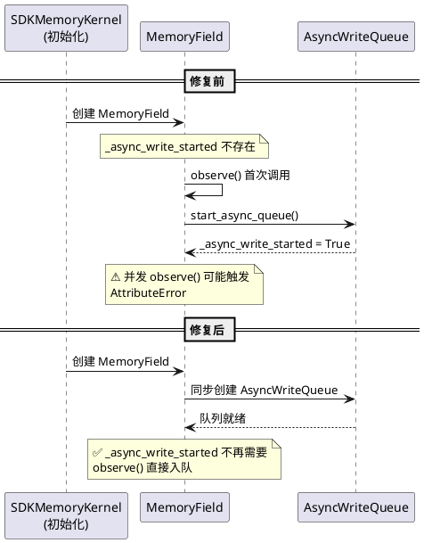
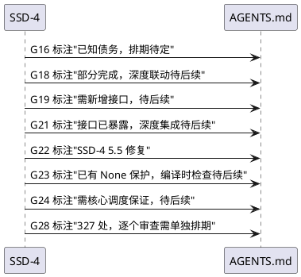

# **1. 组件定位**

## **1.1 核心职责**

本组件负责继续消除 MaiBot 核心架构的存量债务，包括 4 项未消除的核心禁止项、core 层对 chat 层的 re-export 桥接残留、运行时竞态 bug，以及 mem_core_gap 未覆盖差距中的可本期修复项。

## **1.2 核心输入**

1. **核心禁止项清单**（4/8 未消除）：#2 核心访问 chat_manager._agent_router、#3 核心持有 BotChatSession 可变引用、#4 核心硬编码 napcat_* 字段、#7 Orchestrator 通过 enqueue_proactive_task 模拟多智能体
2. **core 层 re-export 桥接清单**：SessionMessage（core/types.py）、is_bot_self/get_bot_account（core/identity.py）、is_mentioned_bot_in_message/get_chat_type_and_target_info（core/message_utils.py）、heartflow_manager 延迟导入（core/adapters/runtime_registry.py）
3. **运行时 bug**：MemoryField._async_write_started AttributeError（09:44-09:50 崩溃循环，已自愈但根因未修）、WebUI ResponseValidationError（10:31 一次性出现）
4. **mem_core_gap 未覆盖差距**（8 项）：G16/G18/G19/G21/G22/G23/G24/G28

## **1.3 核心输出**

1. **已消除的核心禁止项**：#2/#3 验证关闭并更新 AGENTS.md 状态；#4 napcat_* 字段分类从适配器层移至入站点；#7 enqueue_proactive_task 从 ChatRuntime Protocol 中移除或限制
2. **已消除的 re-export 桥接**：SessionMessage/identity/message_utils 的函数定义物理迁移到 core 或 common 层，re-export 降级为兼容别名或移除
3. **已修复的运行时 bug**：MemoryField._async_write_started 竞态根因修复
4. **已更新的 AGENTS.md**：核心禁止项状态、存量债务表、核心接口层表格与代码实际状态一致

## **1.4 职责边界**

1. 本组件**不负责**新增 Protocol 接口（仅消除债务，不扩展能力）
2. 本组件**不负责** A_memorix 内部 322 处 bare except 的逐个审查（G28，修复成本极高，需单独排期）
3. 本组件**不负责**管家系统与记忆系统的深度联动（G19，需新增关系查询接口）
4. 本组件**不负责**叙事弧接入智能体认知（G21，weave_narrative 已暴露，深度集成待后续）
5. 本组件**不负责**Agent-owns-Thinking 与记忆性格深度联动（G18，agent_id 参数已传递，深度联动待后续）
6. 本组件**不负责**WebUI ResponseValidationError（一次性出现，根因不明，无法稳定复现则不修）

# **2. 领域术语**

**核心禁止项**
: AGENTS.md 中定义的 8 条架构红线。新增代码禁止引入，存量代码逐步消除。当前已消除 4/8（#1 chat_manager 直接导入、#5 绕过 MessagePort、#6 导入 A_memorix 内部模块、#8 核心导入 config_manager），剩余 4 条为本期目标。

**re-export 桥接**
: core 层通过 `from src.chat.xxx import yyy` 导入 chat 层的类或函数，再以同名 re-export 给 maisaka 层使用。这是 SSD-3 阶段的过渡方案，注释中标注"后续架构演进将物理迁移"。SSD-4 要求消除这些桥接。

**入站分类**
: 通知消息在进入核心管道前，由平台适配器（bot.py）完成 napcat_* 字段到 NoticeKind 枚举的映射。核心只处理 NoticeKind，不感知平台特定字段名。

**enqueue_proactive_task**
: ChatRuntime Protocol 中的方法，用于插件主动对话。设计约束为"仅用于插件主动对话，禁止用于多智能体插话"。当前插话流已通过 `_trigger_interjection_for` 直接调用 ThinkingOrgan，不再走此方法。

**MemoryField._async_write_started**
: 连接主义记忆场（MemoryField）的异步写入队列启动标志。当前通过 `getattr(self, "_async_write_started", False)` 延迟初始化，存在竞态风险。

**host_service 私有属性访问**
: AMemorixHostService._dispatch() 中大量访问 `kernel._memory_field`、`kernel._migration_adapter` 等 SDKMemoryKernel 私有属性。当前 31 处在 host_service.py，80+ 处在 admin handlers。

**bare except**
: `except Exception` 捕获所有异常但不区分可恢复与不可恢复错误的模式。A_memorix 模块中有 327 处，部分是合理的 fire-and-forget 通知，但多数缺乏明确的错误处理策略。

# **3. 角色与边界**

## **3.1 核心角色**

- **架构守护者**：审核债务消除后代码是否符合"核心只依赖 Protocol"原则，更新 AGENTS.md 状态
- **系统启动流程**：在 main.py 中验证依赖注入链路完整性，确保 re-export 消除后启动正常

## **3.2 外部系统**

- **NapCat 平台适配器**（bot.py）：通知分类的入站执行点，需在消息进入核心管道前完成 napcat_* → NoticeKind 映射
- **ChatRuntime 实现方**（MaisakaRuntime）：enqueue_proactive_task 的当前实现者，需配合协议变更
- **插件运行时**（plugin_runtime/capabilities/core.py）：enqueue_proactive_task 的合法调用方，需适配接口变更
- **A_memorix**（host_service / SDKMemoryKernel / MemoryField）：私有属性访问和竞态 bug 的修复目标
- **maisaka 层**（13+ 文件）：SessionMessage/identity/message_utils 的消费方，需适配导入路径变更

## **3.3 交互上下文**

# **4. DFX约束**

## **4.1 性能**

1. 通知分类入站化后，单条通知分类延迟不得超过当前水平（当前在适配器层分类，移至入站点后应持平）
2. re-export 消除后，模块导入时间不得超过当前水平（物理迁移是同层引用，无额外开销）
3. enqueue_proactive_task 协议变更后，插件主动对话的触发延迟不得超过当前水平

## **4.2 可靠性**

1. 债务消除过程中所有 Protocol 端口的行为必须与消除前完全一致（零行为变更）
2. MemoryField._async_write_started 竞态修复后，异步写入队列必须保证在首次 observe() 前完成启动
3. re-export 消除后，所有消费方的导入必须正常解析（零 ImportError）

## **4.3 安全性**

1. 适配器层仍然是唯一允许导入组件具体类的地方，re-export 消除后此约束不变
2. napcat_* 字段分类入站化后，核心层不得出现任何 napcat_ 前缀的字段名引用
3. enqueue_proactive_task 限制后，插话流必须只通过 ThinkingOrgan 直接触发，不得有回退路径

## **4.4 可维护性**

1. 核心禁止项 #2/#3 验证关闭后，AGENTS.md 状态必须更新为"已消除"
2. re-export 消除后，core 层零 `from src.chat.*` 导入（ruff TID251 守卫覆盖）
3. 每项债务消除必须有 grep 验证步骤（零残留）

## **4.5 兼容性**

1. Protocol 接口签名变更必须向后兼容（enqueue_proactive_task 移除需评估影响）
2. SessionMessage 物理迁移后，chat 层内部导入不受影响
3. 外围模块（A_memorix/WebUI/插件运行时）零修改（除非直接依赖被消除的 re-export）

# **5. 核心能力**

## **5.1 核心禁止项 #2/#3 验证关闭**

### **5.1.1 业务规则**

1. **#2 验证规则**：核心层不得访问 `chat_manager._agent_router`。当前 ChatManagerRoutingAdapter 通过构造注入持有 AgentRouter 实例（`self._agent_router`），这是适配器自身的私有属性，不是 ChatManager 的私有属性。核心层（不含适配器）不得通过任何路径访问 ChatManager 的 `_agent_router` 属性。
   a. 验收条件：[grep `chat_manager._agent_router` 在 src/core/ 中] → [零匹配]；[grep `chat_manager\._agent_router` 在 src/ 中] → [零匹配]

2. **#3 验证规则**：核心层不得持有 BotChatSession 可变引用。当前 ChatManagerAdapter 从 session_store 获取 BotChatSession 对象后立即转换为 SessionInfo 不可变快照返回。核心层（不含适配器）不得持有 BotChatSession 类型的变量或属性。
   a. 验收条件：[grep `BotChatSession` 在 src/core/ 中（不含 adapters/）] → [零匹配]；[grep `BotChatSession` 在 src/maisaka/ 中] → [零匹配]

3. **状态更新规则**：验证通过后，AGENTS.md 中 #2 和 #3 的状态必须从"未消除"更新为"已消除"，并注明验证日期和验证方法。
   a. 验收条件：[AGENTS.md 核心禁止项 #2/#3] → [标记为 ✅ 已消除，含验证说明]

### **5.1.2 交互流程**

### **5.1.3 异常场景**

1. **验证发现残留访问**
   a. 触发条件：grep 发现核心层仍有 `chat_manager._agent_router` 或 `BotChatSession` 引用
   b. 系统行为：暂停关闭流程，先消除残留引用
   c. 用户感知：#2/#3 保持"未消除"状态，直到残留清除

## **5.2 核心禁止项 #4：napcat_* 字段分类入站化**

### **5.2.1 业务规则**

1. **入站分类规则**：通知分类必须在消息进入核心管道前完成。平台适配器（bot.py）在构造 CoreMessage 时必须将 napcat_notice_sub_type 映射为 NoticeKind 枚举值，写入 CoreMessage.notice_kind 字段。核心层只处理 NoticeKind，不感知 napcat_* 字段名。
   a. 验收条件：[bot.py 收到 napcat 通知消息] → [构造的 CoreMessage.notice_kind 为 AMBIENT/INTERACTION/INPUT_STATUS/UNKNOWN 之一，不包含 napcat_ 前缀字段]

2. **适配器层分类移除规则**：NapCatNoticeClassifier 中的 `_extract_napcat_sub_type()` 方法和 `_NAPCAT_*_SUBTYPES` 常量必须移除或降级为兼容回退。分类逻辑从"核心适配器层拉取"变为"平台入站点推送"。
   a. 验收条件：[NapCatNoticeClassifier.classify() 不再读取 napcat_notice_sub_type 字段] → [改为直接使用 CoreMessage 中已填充的 notice_kind]

3. **核心层零 napcat_ 引用规则**：核心层（含适配器）不得出现 `napcat_` 前缀的字段名引用。分类映射常量只允许存在于平台适配器层（bot.py 或其子模块）。
   a. 验收条件：[grep `napcat_` 在 src/core/ 中] → [零匹配]

4. **禁止项**：禁止核心层新增任何 `napcat_` 前缀的字段名引用；禁止 NapCatNoticeClassifier 保留 `_extract_napcat_sub_type()` 方法作为主分类路径
   a. 验收条件：[ruff banned-api 规则覆盖 `napcat_` 前缀在 src/core/ 中的使用] → [新增违规引用时 CI 不通过]

### **5.2.2 交互流程**

### **5.2.3 异常场景**

1. **入站分类缺失**
   a. 触发条件：bot.py 未对某类 napcat 通知进行分类，CoreMessage.notice_kind 为 UNKNOWN
   b. 系统行为：Orchestrator 按 UNKNOWN 处理（当前行为，保持不变）
   c. 用户感知：该类通知可能不触发正确的处理流程

2. **平台扩展新增通知类型**
   a. 触发条件：NapCat 新增通知子类型，bot.py 的映射常量未覆盖
   b. 系统行为：新类型映射为 NoticeKind.UNKNOWN，不崩溃
   c. 用户感知：新通知类型按未知处理，需手动添加映射

## **5.3 核心禁止项 #7：enqueue_proactive_task 协议瘦身**

### **5.3.1 业务规则**

1. **插话流不走 enqueue_proactive_task 规则**：Orchestrator 的插话流必须通过 `_trigger_interjection_for` 直接调用目标智能体的 ThinkingOrgan，不得通过 enqueue_proactive_task 间接触发。当前已实现此路径，需验证无回退。
   a. 验收条件：[grep `enqueue_proactive` 在 src/maisaka/agent_autonomy/orchestrator.py 中] → [零匹配]

2. **enqueue_proactive_task 限制规则**：ChatRuntime Protocol 中的 enqueue_proactive_task 方法必须明确限制为"仅插件主动对话"用途。方法签名、文档字符串、ruff 守卫必须三重约束。
   a. 验收条件：[enqueue_proactive_task 的文档字符串包含"仅用于插件主动对话，禁止用于多智能体插话"] → [ruff banned-api 或自定义规则覆盖非插件调用方]

3. **chat_loop_adapter 代理移除评估规则**：ChatLoopAdapter 中的 `enqueue_proactive_task` 代理方法应评估是否可以移除。如果插件运行时可以直接访问 MaisakaRuntime，则代理层是多余的。
   a. 验收条件：[评估 chat_loop_adapter.enqueue_proactive_task 的调用方] → [如果仅 plugin_runtime 使用，则改为 plugin_runtime 直接获取 runtime]

4. **禁止项**：禁止 Orchestrator/管家/提醒/VitalityManager 等核心模块通过 enqueue_proactive_task 触发插话或主动行为
   a. 验收条件：[grep `enqueue_proactive` 在 src/maisaka/agent_autonomy/ 中（不含 bridge/）] → [零匹配]

### **5.3.2 交互流程**

### **5.3.3 异常场景**

1. **插件运行时绕过 Protocol 直接访问 runtime**
   a. 触发条件：plugin_runtime/capabilities/core.py 通过 heartflow_manager 获取 MaisakaRuntime 实例
   b. 系统行为：当前已有此模式（第 232-240 行），需评估是否合规
   c. 用户感知：无感知（功能正常），但架构约束被绕过

2. **enqueue_proactive_task 移除后插件兼容性**
   a. 触发条件：从 ChatRuntime Protocol 移除 enqueue_proactive_task
   b. 系统行为：plugin_runtime 需要替代访问路径
   c. 用户感知：插件主动对话功能不可用，直到替代路径就绪

## **5.4 core 层 re-export 桥接消除**

### **5.4.1 业务规则**

1. **SessionMessage 物理迁移规则**：SessionMessage 类必须从 `src/chat/message_receive/message.py` 物理迁移到 `src/common/` 层。core/types.py 的 re-export 降级为兼容别名（指向新位置），chat 层内部改为从新位置导入。
   a. 验收条件：[SessionMessage 定义在 src/common/ 层] → [core/types.py re-export 指向新位置] → [maisaka 13+ 文件从 core.types 导入，无需修改]

2. **is_bot_self/get_bot_account 物理迁移规则**：这两个函数必须从 `src/chat/utils/utils.py` 物理迁移到 `src/core/identity.py`。当前 identity.py 是纯 re-export 桥接，迁移后变为函数的真实定义位置。
   a. 验收条件：[is_bot_self/get_bot_account 定义在 src/core/identity.py] → [src/chat/utils/utils.py 保留 re-export 或直接删除] → [maisaka 4 文件从 core.identity 导入，无需修改]

3. **is_mentioned_bot_in_message/get_chat_type_and_target_info 物理迁移规则**：这两个函数必须从 `src/chat/utils/utils.py` 物理迁移到 `src/core/message_utils.py`。当前 message_utils.py 是纯 re-export 桥接，迁移后变为函数的真实定义位置。
   a. 验收条件：[is_mentioned_bot_in_message/get_chat_type_and_target_info 定义在 src/core/message_utils.py] → [src/chat/utils/utils.py 保留 re-export 或直接删除]

4. **HeartflowRuntimeRegistry 延迟导入消除规则**：HeartflowRuntimeRegistry._ensure_manager() 中的 `from src.chat.heart_flow.heartflow_manager import heartflow_manager` 延迟导入必须消除，改为构造注入 heartflow_manager 实例。
   a. 验收条件：[HeartflowRuntimeRegistry 构造时注入 heartflow_manager] → [grep `_ensure_manager` 在 runtime_registry.py 中] → [零匹配]

5. **core 层零 chat 导入规则**：re-export 消除后，core 层不得包含任何 `from src.chat.*` 导入（ruff TID251 守卫覆盖，适配器层除外）。
   a. 验收条件：[grep `from src\.chat\.` 在 src/core/ 中（不含 adapters/）] → [零匹配]

6. **禁止项**：禁止 core 层新增任何 `from src.chat.*` re-export 桥接；禁止 maisaka 层直接导入 `from src.chat.*`（应通过 core 层或 common 层）
   a. 验收条件：[ruff TID251 守卫覆盖 src/maisaka/ 目录] → [新增违规导入时 CI 不通过]

### **5.4.2 交互流程**

### **5.4.3 异常场景**

1. **SessionMessage 迁移后 chat 层循环导入**
   a. 触发条件：SessionMessage 迁移到 common 层后，chat 层的导入链产生循环
   b. 系统行为：启动失败，ImportError
   c. 用户感知：系统无法启动

2. **函数迁移后依赖缺失**
   a. 触发条件：is_bot_self 等函数迁移到 core 层后，依赖的 chat 层内部函数未一起迁移
   b. 系统行为：core 层函数内部报 NameError 或 ImportError
   c. 用户感知：身份判断功能异常

3. **HeartflowRuntimeRegistry 注入时序问题**
   a. 触发条件：heartflow_manager 在 Registry 构造时尚未初始化
   b. 系统行为：Registry 方法调用时抛出 RuntimeError
   c. 用户感知：运行时获取失败，日志提示未注入

## **5.5 MemoryField._async_write_started 竞态修复**

### **5.5.1 业务规则**

1. **异步写入队列同步启动规则**：AsyncWriteQueue 必须在 MemoryField 创建时同步启动，不得延迟到首次 observe() 调用时才启动。`_async_write_started` 标志的 `getattr(self, "_async_write_started", False)` 模式必须消除。
   a. 验收条件：[MemoryField.__init__ 中启动 AsyncWriteQueue] → [grep `_async_write_started` 在 memory_field.py 中] → [零匹配]

2. **竞态保护规则**：如果 MemoryField 创建时 AsyncWriteQueue 无法同步启动（如依赖异步初始化），则必须使用 asyncio.Lock 或类似机制保护首次启动，确保并发 observe() 不会重复创建队列。
   a. 验收条件：[并发调用 observe() 时 AsyncWriteQueue 只创建一次] → [无 AttributeError 崩溃]

3. **禁止项**：禁止使用 `getattr(self, "_async_write_started", False)` 模式检测初始化状态；禁止在 observe() 热路径中执行条件性初始化
   a. 验收条件：[grep `getattr.*_async_write_started` 在 src/A_memorix/ 中] → [零匹配]

### **5.5.2 交互流程**

### **5.5.3 异常场景**

1. **AsyncWriteQueue 同步启动失败**
   a. 触发条件：MemoryField.__init__ 中 AsyncWriteQueue.start() 因依赖未就绪而失败
   b. 系统行为：MemoryField 构造失败，SDKMemoryKernel 初始化报错
   c. 用户感知：启动失败，日志明确提示 AsyncWriteQueue 启动失败原因

2. **AsyncWriteQueue 需要异步启动**
   a. 触发条件：AsyncWriteQueue.start() 是异步方法，无法在 __init__ 中同步调用
   b. 系统行为：改用 `async def initialize()` 两阶段初始化，或使用 `asyncio.get_event_loop().run_until_complete()` 在创建时启动
   c. 用户感知：无感知（功能正常）

## **5.6 mem_core_gap 未覆盖差距评估与处置**

### **5.6.1 业务规则**

1. **G16 host_service 私有属性访问**：host_service._dispatch() 中有 31 处访问 `kernel._*` 私有属性，admin handlers 中有 80+ 处。本期不修复（修复成本极高，影响低），但必须在 AGENTS.md 中标注为"已知债务"并设定排期。
   a. 验收条件：[AGENTS.md 存量债务表包含 G16 条目] → [标注"修复成本高，影响低，排期待定"]

2. **G18 Agent-owns-Thinking 与记忆性格未联动**：agent_id 参数已在 MemoryServicePort 方法中传递，但深度联动（如记忆性格影响检索权重）待后续。本期不修复。
   a. 验收条件：[AGENTS.md 标注 G18 为"部分完成，深度联动待后续"]

3. **G19 管家系统与记忆系统未联动**：管家三层过滤的第二层（管家 LLM 判断"谁会关心"）无法利用记忆系统中的关系数据。需新增关系查询接口，本期不修复。
   a. 验收条件：[AGENTS.md 标注 G19 为"需新增接口，待后续"]

4. **G21 叙事弧未接入智能体认知**：weave_narrative 已暴露在 MemoryServicePort，但智能体思考时无法引用叙事上下文。本期不修复。
   a. 验收条件：[AGENTS.md 标注 G21 为"接口已暴露，深度集成待后续"]

5. **G22 AsyncWriteQueue 延迟启动竞态**：已有 `getattr` 保护机制，且本期 5.5 将根治此问题。标记为"SSD-4 修复"。
   a. 验收条件：[5.5 修复完成后 G22 自动关闭]

6. **G23 ModelConfigPort 注入时序无检查**：已有 None 保护，但缺乏编译时或启动时检查。本期不修复（保护机制已足够）。
   a. 验收条件：[AGENTS.md 标注 G23 为"已有 None 保护，编译时检查待后续"]

7. **G24 记忆性格注册窗口期**：智能体在记忆性格注册前可能使用默认性格。需核心调度时序保证，本期不修复。
   a. 验收条件：[AGENTS.md 标注 G24 为"需核心调度保证，待后续"]

8. **G28 A_memorix 内部 322 处 bare except**：修复成本极高，需逐个审查判断是否为合理的 fire-and-forget。本期不修复，但必须排期。
   a. 验收条件：[AGENTS.md 标注 G28 为"327 处 bare except，逐个审查需单独排期"]

### **5.6.2 交互流程**

### **5.6.3 异常场景**

1. **G28 审查发现关键 bare except**
   a. 触发条件：运行时发现 A_memorix 的 bare except 掩盖了关键错误
   b. 系统行为：单独修复该处 bare except，不等全量审查
   c. 用户感知：错误完整暴露，便于定位根因

# **6. 数据约束**

## **6.1 re-export 桥接清单（迁移前）**

1. **SessionMessage**：类，定义在 `src/chat/message_receive/message.py`，被 `src/core/types.py:818` re-export。消费方：maisaka 13 文件从 core.types 导入，chat 层 20+ 文件从原位置导入，plugin_runtime 6 文件从原位置导入，common 层 3 文件从原位置导入
2. **is_bot_self**：函数，定义在 `src/chat/utils/utils.py`，被 `src/core/identity.py:11` re-export。消费方：maisaka 4 文件从 core.identity 导入
3. **get_bot_account**：函数，定义在 `src/chat/utils/utils.py`，被 `src/core/identity.py:10` re-export。消费方：maisaka 1 文件从 core.identity 导入
4. **is_mentioned_bot_in_message**：函数，定义在 `src/chat/utils/utils.py`，被 `src/core/message_utils.py:98` re-export。消费方：maisaka 1 文件从 core.message_utils 导入
5. **get_chat_type_and_target_info**：函数，定义在 `src/chat/utils/utils.py`，被 `src/core/message_utils.py:99` re-export。消费方：maisaka 1 文件从 core.message_utils 导入
6. **heartflow_manager**：模块级单例，定义在 `src/chat/heart_flow/heartflow_manager.py`，被 `src/core/adapters/runtime_registry.py:21` 延迟导入。消费方：HeartflowRuntimeRegistry 内部使用

## **6.2 核心禁止项状态（SSD-4 前后）**

1. **#1 禁止核心直接导入 chat_manager**：✅ 已消除（SSD-3 完成）
2. **#2 禁止核心访问 chat_manager._agent_router**：待验证关闭（预期已消除）
3. **#3 禁止核心持有 BotChatSession 可变引用**：待验证关闭（预期已消除）
4. **#4 禁止核心硬编码 napcat_* 字段**：本期消除（分类入站化）
5. **#5 禁止核心绕过 MessagePort 直接调用 send_service**：✅ 已消除（SSD-3 完成）
6. **#6 禁止核心导入 A_memorix 内部模块**：✅ 已消除（mem_core_gap 完成）
7. **#7 禁止 Orchestrator 通过 enqueue_proactive_task 模拟多智能体**：本期限制（协议瘦身 + 守卫）
8. **#8 禁止核心导入 config_manager 获取模型配置**：✅ 已消除（mem_core_gap 完成）

## **6.3 enqueue_proactive_task 调用方清单**

1. **plugin_runtime/capabilities/core.py:240**：合法调用方（插件主动对话），通过 heartflow_manager 获取 runtime 后调用
2. **maisaka/agent_autonomy/bridge/chat_loop_adapter.py:99**：代理层，转发到 MaisakaRuntime
3. **maisaka/runtime.py:648**：实现方，MaisakaRuntime.enqueue_proactive_task()

## **6.4 MemoryField._async_write_started 当前实现**

1. **memory_field.py:81**：`if getattr(self, "_async_write_started", False): return`
2. **memory_field.py:88**：`self._async_write_started = True`
3. **memory_field.py:117**：`if not getattr(self, "_async_write_started", False): await self.start_async_queue()`
4. **竞态场景**：并发 observe() 在 `_async_write_started` 赋值前同时通过 getattr 检查，可能重复创建 AsyncWriteQueue

---

# 附录：优先级排序

| 编号 | 债务项 | 影响范围 | 修复成本 | 优先级 | SSD-4 处置 |
|---|---|---|---|---|---|
| #2 | 核心访问 chat_manager._agent_router | 低（预期已消除） | 极低（验证+更新文档） | P0 | 验证关闭 |
| #3 | 核心持有 BotChatSession 可变引用 | 低（预期已消除） | 极低（验证+更新文档） | P0 | 验证关闭 |
| 5.5 | MemoryField._async_write_started 竞态 | 高（崩溃循环） | 低（改初始化模式） | P0 | 本期修复 |
| 5.4 | core 层 re-export 桥接消除 | 高（6处跨层导入） | 中（物理迁移+验证） | P1 | 本期消除 |
| #4 | 核心硬编码 napcat_* 字段 | 中（3处适配器引用） | 中（入站分类改造） | P1 | 本期消除 |
| #7 | enqueue_proactive_task 协议瘦身 | 中（3处调用方） | 中（守卫+评估移除） | P2 | 本期限制 |
| G22 | AsyncWriteQueue 延迟启动竞态 | 中（已有保护） | 低（5.5 修复后自动关闭） | P2 | 随 5.5 关闭 |
| G16 | host_service 私有属性访问 | 低（内部实现） | 极高（31+80处重构） | P3 | 标注排期 |
| G28 | A_memorix bare except | 低（掩盖错误） | 极高（327处逐个审查） | P3 | 标注排期 |
| G18 | Agent-owns-Thinking 记忆性格联动 | 低（参数已传递） | 高（需核心调度重构） | P3 | 标注待后续 |
| G19 | 管家系统与记忆系统联动 | 中（插话质量） | 高（需新增接口） | P3 | 标注待后续 |
| G21 | 叙事弧接入智能体认知 | 低（接口已暴露） | 高（需深度集成） | P3 | 标注待后续 |
| G23 | ModelConfigPort 注入时序 | 低（已有保护） | 中（需编译时检查） | P3 | 标注待后续 |
| G24 | 记忆性格注册窗口期 | 低（默认性格兜底） | 高（需核心调度保证） | P3 | 标注待后续 |

# 附录：风险评估

| 风险 | 概率 | 影响 | 缓解措施 |
|---|---|---|---|
| SessionMessage 迁移引发循环导入 | 中 | 高（启动失败） | 先在 lab 验证迁移安全性；chat 层改为从 common 导入 |
| napcat_* 入站分类遗漏通知类型 | 低 | 中（通知处理异常） | UNKNOWN 兜底；映射常量与 NapCatNoticeClassifier 现有常量对齐 |
| enqueue_proactive_task 移除后插件不兼容 | 中 | 高（插件功能失效） | 先限制再评估移除；保留兼容期 |
| 函数迁移后依赖链断裂 | 低 | 高（运行时错误） | 逐函数迁移，每步验证导入链 |
| MemoryField 同步启动与异步初始化冲突 | 低 | 中（启动失败） | 评估两阶段初始化方案 |