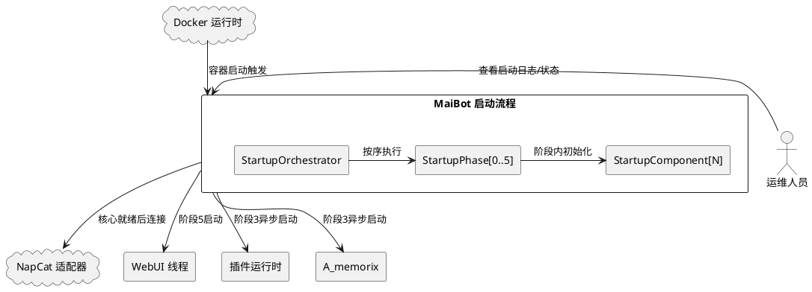
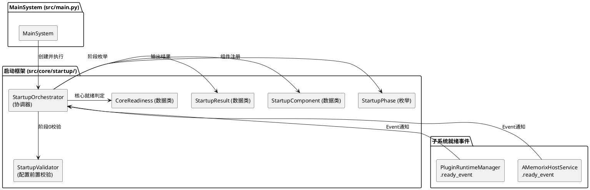
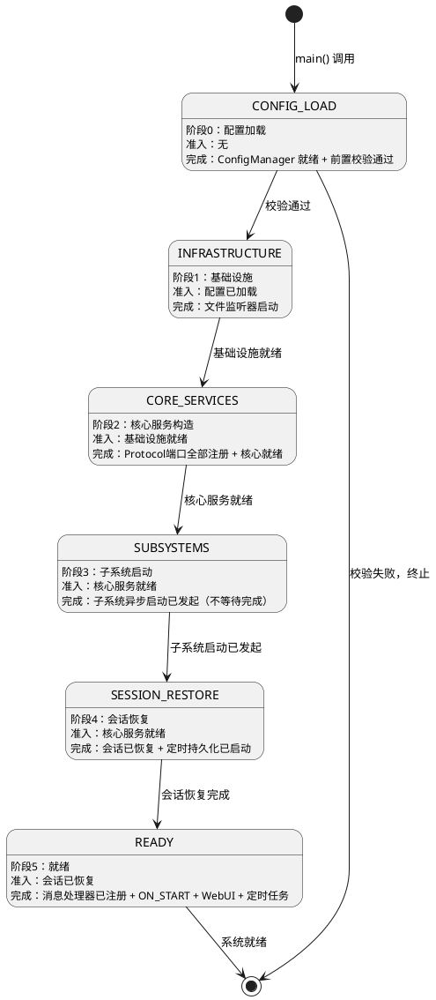
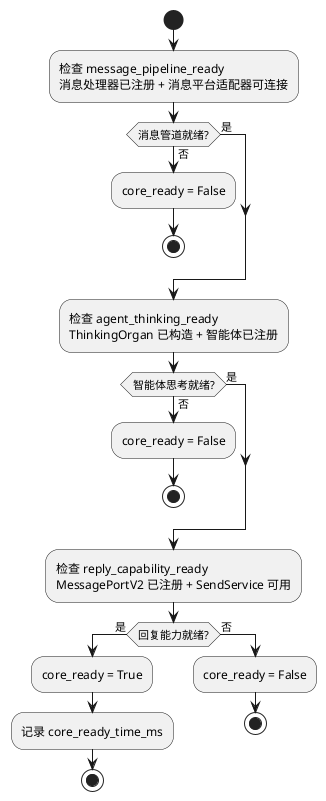
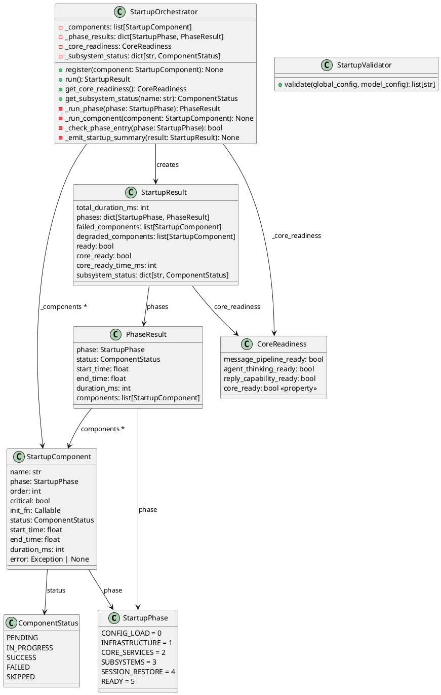

# 一、需求与存量功能关系分析

## 1.1 需求功能与存量功能对比

### 1.1.1 已实现功能

| 需求功能 | 存量功能 | 代码位置 | 匹配度 |
|---------|---------|---------|--------|
| 配置加载与校验 | ConfigManager.initialize() + model_post_init | `src/config/config.py:279-292` | 75% |
| ChatManager 子模块构造 | SessionStore/MessageRegistry/SessionNameCache/SessionResolver/BindingRestorer/SessionLifecycle 构造 | `src/main.py:127-152` | 100% |
| Protocol 端口注册 | 4 个 session_port + runtime_port + replyer_port + image_port 注册 | `src/main.py:166-194` | 100% |
| A_memorix 启动 | a_memorix_host_service.start() 异步启动 | `src/main.py:203-223` | 50% |
| 插件运行时启动 | plugin_runtime_manager.start() 异步启动 | `src/main.py:197-201` | 50% |
| 表情管理器加载 | emoji_manager.load_emojis_from_db() 异步加载 | `src/main.py:228-230` | 75% |
| 会话恢复 | lifecycle_port.initialize() + regularly_save_sessions() | `src/main.py:255-261` | 100% |
| 消息处理器注册 | _register_message_handlers() | `src/main.py:70-84` | 75% |
| WebUI 启动 | _start_webui_server() | `src/main.py:86-101` | 100% |
| ON_START 事件触发 | event_bus.emit(EventType.ON_START) | `src/main.py:280-283` | 100% |
| 定时任务启动 | async_task_manager.add_task() 系列 | `src/main.py:288-300` | 100% |
| 智能体交互调度器 | build_interaction_scheduler() | `src/main.py:303-318` | 100% |
| ModelConfigPort 注入 | ConfigManagerModelConfigPort 构造 + 4 处注入 | `src/main.py:211-275` | 100% |
| 启动总耗时统计 | time.time() 差值计算 | `src/main.py:321` | 25% |
| _ConfigProxy 热重载代理 | _ConfigProxy 类 + global_config/model_config 代理 | `src/config/config.py:730-755` | 100% |
| 文件监听器 | config_manager.start_file_watcher() | `src/main.py:123` | 100% |

### 1.1.2 需要扩展的功能

| 需求功能 | 存量功能 | 差异说明 | 扩展方向 |
|---------|---------|---------|---------|
| 6 阶段启动划分 | `_init_components()` 是 200 行线性函数，无阶段概念 | 无阶段划分、无准入/完成条件、无阶段状态输出。当前所有组件在一个函数中顺序执行，阶段边界靠注释标记 | 引入 StartupOrchestrator + StartupPhase 枚举，将 `_init_components()` 拆分为 6 个阶段方法 |
| 显式初始化顺序 | 组件初始化顺序靠代码行位置隐式保证 | 新增组件必须手动判断插入位置，放错就崩溃。无阶段归属、无阶段内序号声明 | 引入 StartupComponent 声明式注册（phase + order），启动框架按声明排序执行 |
| 阶段/组件计时 | 仅统计总耗时（1 行 time.time() 差值） | 无阶段分项耗时、无组件分项耗时，无法定位启动瓶颈 | 在 StartupOrchestrator 中为每个阶段和组件包裹计时逻辑 |
| 错误隔离与降级 | `asyncio.gather(plugin, a_memorix, emoji)` 全有或全无 | 任何一个失败就全部取消（缺陷 5）。非关键组件失败导致关键组件也被取消 | 非关键组件独立异常边界，失败仅标记降级；关键组件失败终止启动 |
| 微内核启动（核心先就绪） | 所有组件串行初始化完成后才注册消息处理器 | A_memorix 等子系统阻塞核心就绪，核心就绪时间 = 全部初始化时间 | 核心组件（消息管道+智能体+回复能力）先就绪，子系统异步加载不阻塞 |
| 就绪屏障 | `_register_message_handlers()` 在 `schedule_tasks()` 中调用 | NapCat 可能在注册前已推送消息（缺陷 7），存在消息丢失窗口 | 消息处理器注册必须在消息平台适配器连接之前完成 |
| 配置前置校验 | ConfigManager.model_post_init 有基本校验 | 无启动场景的完整性检查（如智能体目录存在性、API Provider 配置完整性） | 在阶段 0 增加启动场景专用校验 |
| 模块级副作用消除 | config.py 第 753-755 行模块级执行 `ConfigManager()` + `initialize()` | 导入即触发配置加载（缺陷 1）。47 个模块级单例导入即构造 | 渐进迁移：优先消除 config_manager/global_config 的模块级初始化 |
| 时序同步 | `await asyncio.sleep(0.02)` 轮询 + `await asyncio.sleep(0)` 让步 | 缺陷 3：轮询等待插件 Runner，getattr 访问私有属性 | 替换为 asyncio.Event 等待 + 公共接口查询 |

### 1.1.3 需要新增的功能或接口

**启动框架核心**

| 功能 | 输入 | 输出 | 核心逻辑 | 依赖 |
|------|------|------|---------|------|
| StartupOrchestrator | 组件注册列表 | StartupResult | 按 6 阶段顺序执行组件初始化，管理阶段状态和计时 | 无 |
| StartupPhase 枚举 | — | 6 个枚举值 | CONFIG_LOAD / INFRASTRUCTURE / CORE_SERVICES / SUBSYSTEMS / SESSION_RESTORE / READY | 无 |
| StartupComponent 数据类 | name, phase, order, critical, init_fn | status, duration_ms, error | 封装单个组件的初始化逻辑和状态 | StartupPhase |
| CoreReadiness 数据类 | — | message_pipeline_ready, agent_thinking_ready, reply_capability_ready | 核心就绪状态判定 | 无 |
| StartupResult 数据类 | phases, components | total_duration_ms, core_ready, degraded_components | 启动结果汇总 | StartupPhase, StartupComponent |

**就绪通知机制**

| 功能 | 输入 | 输出 | 核心逻辑 | 依赖 |
|------|------|------|---------|------|
| 插件运行时就绪事件 | plugin_runtime_manager.start() | ready_event.wait() | 替换 `_wait_for_plugin_runners_spawned()` 轮询 | PluginRuntimeManager 暴露 ready_event |
| A_memorix 就绪事件 | a_memorix_host_service.start() | ready_event.wait() | 供其他组件查询记忆服务可用状态 | AMemorixHostService 暴露 ready_event |
| 子系统就绪状态查询 | subsystem_name | PENDING / READY / FAILED / SKIPPED | 降级运行时查询子系统可用性 | CoreReadiness |

**配置前置校验**

| 功能 | 输入 | 输出 | 核心逻辑 | 依赖 |
|------|------|------|---------|------|
| validate_startup_prerequisites | global_config, model_config | 校验通过 / 失败项列表 | 检查文件存在性、API Provider、模型配置、智能体目录 | ConfigManager |

## 1.2 存量功能详细分析

### 1.2.1 `_init_components()` 启动链路

**接口契约**：`async def _init_components(self) -> None`

**业务规则**：
1. 串行执行所有组件初始化，无阶段概念
2. 组件顺序完全靠代码行位置保证：配置监听 → ChatManager 子模块 → 适配器 → Protocol 注册 → 插件运行时 → A_memorix → 表情 → 会话恢复 → ModelConfigPort 注入 → ON_START → WebUI → 定时任务 → 交互调度器
3. 非关键组件（插件、A_memorix、表情）通过 `asyncio.gather()` 并行启动，但全有或全无
4. 智能体交互调度器已有独立 try/except，是当前唯一的错误隔离案例

**扩展点**：
- 函数内部逻辑可完全重写为阶段化执行
- 外部接口 `initialize()` → `_init_components()` 调用链不变

**约束**：
- Protocol 端口注册时机不可变（A_memorix 注入依赖注册点）
- ModelConfigPort 必须在 A_memorix start 之前注入（EmbeddingAPIAdapter 依赖）
- `_ConfigProxy` 热重载机制依赖 `config_manager.get_global_config()` getter

### 1.2.2 ConfigManager 模块级初始化

**接口契约**：`config_manager = ConfigManager()` → `config_manager.initialize()` → `global_config: Config = _ConfigProxy(config_manager.get_global_config)`

**业务规则**：
1. 模块级执行 `ConfigManager()` 构造 + `initialize()` 加载配置文件
2. `_ConfigProxy` 代理确保热重载后旧导入也能读取最新配置
3. `initialize()` 执行配置迁移、校验、文件生成

**约束**：
- `_ConfigProxy` 的 `__getattr__` 代理模式必须保留，它是热重载的基石
- `config_manager` 和 `global_config` 被全项目 100+ 处导入，迁移影响面极大
- 模块级初始化是缺陷 1 的根源，但渐进迁移意味着不能一次性改 47 个文件

### 1.2.3 Protocol 端口注册点

**接口契约**：4 个 `register_*_port()` / `get_*_port()` 函数对（session_port_registry 4 对 + runtime_port_registry 2 对 + replyer_port_registry 1 对 + image_port_registry 1 对）

**业务规则**：
1. 全局模块级变量存储端口实例，`register_*` 写入，`get_*` 读取
2. 未注册时 `get_*` 返回 None（不抛异常），消费方自行处理
3. 注册时机在 `_init_components()` 中，必须在 A_memorix 启动之前

**约束**：
- 注册点的全局变量模式与模块级副作用消除目标冲突，但注册点本身是"启动时显式调用"而非"导入时自动执行"，属于可接受的模式
- 注册时机不可变——A_memorix 的 `set_session_info_port()` 依赖注册点

### 1.2.4 `_wait_for_plugin_runners_spawned()` 轮询

**接口契约**：`async def _wait_for_plugin_runners_spawned(plugin_runtime_manager, plugin_runtime_task, timeout=1.0) -> None`

**业务规则**：
1. 每 20ms 轮询检查 `supervisors` 和 `_runner_process` 是否就绪
2. 超时 1 秒后放弃等待
3. 通过 `getattr` 访问私有属性 `_runner_process`

**约束**：
- 这是缺陷 3（sleep 轮询）和缺陷 4（getattr 私有属性）的典型案例
- 需要替换为 Event 等待 + 公共接口，但 PluginRuntimeManager 需先暴露 ready_event

### 1.2.5 `schedule_tasks()` 消息处理器注册时序

**接口契约**：`async def schedule_tasks(self) -> None`

**业务规则**：
1. `_register_message_handlers()` 在 `schedule_tasks()` 中调用
2. `schedule_tasks()` 同时启动消息服务（`self.app.run()`, `self.server.run()`）
3. 消息处理器注册和消息服务启动在同一个 `asyncio.gather()` 中

**约束**：
- 缺陷 7：消息处理器注册和消息服务启动是并行的，存在消息处理器未注册但适配器已连接的窗口期
- 改革后消息处理器注册必须在消息服务启动之前完成（就绪屏障）

# 二、增量设计方案

## 2.1 实现模型

### 2.1.1 上下文视图



### 2.1.2 服务/组件总体架构



### 2.1.3 实现设计文档

#### 启动阶段状态机



#### 核心就绪判定流程



## 2.2 接口设计

### 2.2.1 总体设计

接口分类依据：启动框架内部数据结构 + 启动协调器公共 API + 子系统就绪通知接口。

| 接口/数据结构 | 分类 | 稳定性 | 说明 |
|-------------|------|--------|------|
| StartupPhase | 枚举 | 稳定 | 6 阶段枚举，新增阶段需递增 |
| ComponentStatus | 枚举 | 稳定 | 组件状态枚举 |
| StartupComponent | 数据类 | 稳定 | 组件声明与执行结果 |
| StartupResult | 数据类 | 稳定 | 启动结果汇总 |
| CoreReadiness | 数据类 | 稳定 | 核心就绪状态 |
| StartupOrchestrator | 协调器 | 稳定 | 启动流程编排，对外唯一入口 |
| StartupValidator | 校验器 | 稳定 | 配置前置校验 |
| PluginRuntimeManager.ready_event | 就绪通知 | 实验 | 替换轮询，需插件运行时配合改造 |
| AMemorixHostService.ready_event | 就绪通知 | 实验 | 替换隐式等待，需 A_memorix 配合改造 |

### 2.2.2 接口清单

#### StartupPhase 枚举

```python
class StartupPhase(enum.Enum):
    CONFIG_LOAD = 0       # 阶段0：配置加载
    INFRASTRUCTURE = 1    # 阶段1：基础设施
    CORE_SERVICES = 2     # 阶段2：核心服务构造
    SUBSYSTEMS = 3        # 阶段3：子系统启动
    SESSION_RESTORE = 4   # 阶段4：会话恢复
    READY = 5             # 阶段5：就绪
```

**业务说明**：定义系统启动的 6 个逻辑阶段，每个阶段有明确的准入条件和完成条件。

**前置条件**：无。

**后置条件**：StartupOrchestrator 按此枚举顺序执行阶段。

#### ComponentStatus 枚举

```python
class ComponentStatus(enum.Enum):
    PENDING = "pending"
    IN_PROGRESS = "in_progress"
    SUCCESS = "success"
    FAILED = "failed"
    SKIPPED = "skipped"
```

#### StartupComponent 数据类

```python
@dataclass
class StartupComponent:
    name: str                              # 组件唯一标识
    phase: StartupPhase                    # 所属阶段
    order: int                             # 阶段内序号
    critical: bool                         # 是否关键组件
    init_fn: Callable[[], Awaitable[None]] # 初始化函数
    status: ComponentStatus = ComponentStatus.PENDING
    start_time: float = 0.0                # time.monotonic()
    end_time: float = 0.0
    duration_ms: int = 0
    error: Exception | None = None
```

**业务说明**：封装单个组件的初始化逻辑和状态。`init_fn` 是异步函数，由 StartupOrchestrator 调用。

**init_fn 签名约定**：

```python
async def init_fn() -> None:
    """组件初始化函数。

    - 无参数：init_fn 不接收任何参数，所需依赖通过闭包或实例属性获取。
    - 无返回值：成功即返回，失败即抛异常。
    - 关键组件异常向上传播终止启动，非关键组件异常由 orchestrator 捕获标记降级。
    """
```

设计决策：init_fn 不接收 `ready_events` 参数。理由：(1) 阶段间依赖靠 StartupPhase 顺序保证，不需要跨阶段事件；(2) 阶段内依赖靠 order 序号保证，同阶段组件按序执行；(3) 子系统就绪通知通过 `ready_event` 属性暴露，消费方按需 await，不通过 init_fn 参数传递。

**前置条件**：`phase` 和 `order` 必须在注册时声明。

**后置条件**：执行后 `status` 更新为 SUCCESS / FAILED / SKIPPED。

**异常映射**：`init_fn` 抛出异常 → `status=FAILED`, `error=异常对象`。关键组件失败 → 终止启动；非关键组件失败 → 降级继续。

#### StartupResult 数据类

```python
@dataclass
class StartupResult:
    total_duration_ms: int
    phases: dict[StartupPhase, PhaseResult]
    failed_components: list[StartupComponent]
    degraded_components: list[StartupComponent]
    ready: bool
    core_ready: bool
    core_ready_time_ms: int
    subsystem_status: dict[str, ComponentStatus]
```

#### CoreReadiness 数据类

```python
@dataclass
class CoreReadiness:
    message_pipeline_ready: bool
    agent_thinking_ready: bool
    reply_capability_ready: bool

    @property
    def core_ready(self) -> bool:
        return self.message_pipeline_ready and self.agent_thinking_ready and self.reply_capability_ready
```

#### StartupOrchestrator 协调器

```python
class StartupOrchestrator:
    def __init__(self) -> None: ...
    def register(self, component: StartupComponent) -> None: ...
    async def run(self) -> StartupResult: ...
    def get_core_readiness(self) -> CoreReadiness: ...
    def get_subsystem_status(self, name: str) -> ComponentStatus: ...
```

**业务说明**：启动流程的唯一编排入口。开发者通过 `register()` 声明组件，`run()` 按阶段顺序执行。

**前置条件**：所有组件必须在 `run()` 调用前注册完成。

**后置条件**：返回 StartupResult，包含所有阶段和组件的执行结果。

**调用示例**：

```python
orchestrator = StartupOrchestrator()

# 注册组件（声明式，而非靠代码行位置）
orchestrator.register(StartupComponent(
    name="config_manager",
    phase=StartupPhase.CONFIG_LOAD,
    order=0,
    critical=True,
    init_fn=_init_config_manager,
))
orchestrator.register(StartupComponent(
    name="a_memorix",
    phase=StartupPhase.SUBSYSTEMS,
    order=10,
    critical=False,
    init_fn=_init_a_memorix,
))

result = await orchestrator.run()
```

#### StartupValidator 校验器

```python
class StartupValidator:
    @staticmethod
    def validate(global_config: Config, model_config: ModelConfig) -> list[str]: ...
```

**业务说明**：在阶段 0 执行配置前置校验，返回校验失败项列表。空列表表示通过。

**前置条件**：ConfigManager 已加载配置。

**后置条件**：返回校验结果，非空则终止启动。

**校验项**：
1. bot_config.toml 和 model_config.toml 文件存在性（ConfigManager 已保证）
2. model_config 中至少配置一个 API Provider
3. model_config 中至少配置一个模型
4. 每个模型的 api_provider 字段指向已定义的 Provider
5. 智能体配置目录存在且至少有一个智能体配置

#### 子系统就绪通知接口

**PluginRuntimeManager 扩展**：

```python
class PluginRuntimeManager:
    def __init__(self) -> None:
        # 新增
        self._ready_event: asyncio.Event = asyncio.Event()

    @property
    def ready_event(self) -> asyncio.Event:
        """供启动框架等待插件运行时就绪"""
        return self._ready_event

    async def start(self) -> None:
        # ... 现有逻辑 ...
        self._started = True
        self._ready_event.set()  # 新增：通知就绪
```

**AMemorixHostService 扩展**：

```python
class AMemorixHostService:
    def __init__(self) -> None:
        # 新增
        self._ready_event: asyncio.Event = asyncio.Event()

    @property
    def ready_event(self) -> asyncio.Event:
        """供启动框架等待记忆系统就绪"""
        return self._ready_event

    async def start(self) -> None:
        # ... 现有逻辑 ...
        self._ready_event.set()  # 新增：通知就绪
```

## 2.3 数据模型

### 2.3.1 设计目标

1. 支持启动过程的 6 阶段划分和阶段内组件排序
2. 支持核心就绪状态的独立判定（消息管道 + 智能体思考 + 回复能力）
3. 支持非关键组件的降级运行和子系统就绪状态查询
4. 支持启动耗时精确测量（阶段级 + 组件级，精度 10ms）
5. 与存量 Protocol 端口注册点兼容，不改变注册时机

### 2.3.2 模型实现



## 2.4 启动阶段详细设计

### 阶段 0 — 配置加载（CONFIG_LOAD）

**准入条件**：无（启动入口）

**完成条件**：ConfigManager.initialize() 完成 + StartupValidator 校验通过

**组件列表**：

| 序号 | 组件名 | 关键 | 说明 |
|------|--------|------|------|
| 0 | config_manager | 是 | ConfigManager 构造 + initialize() + 文件监听 |
| 1 | config_validator | 是 | StartupValidator 校验 |

**关键变更**：
- config_manager 的模块级初始化（`config.py:753-754`）在本阶段由 StartupOrchestrator 显式调用
- 新增 StartupValidator 校验，在配置加载后、组件初始化前执行

**缺陷追溯**：缺陷 1（模块级副作用）、缺陷 6（无分项计时）

### 阶段 1 — 基础设施（INFRASTRUCTURE）

**准入条件**：阶段 0 完成

**完成条件**：文件监听器已启动

**组件列表**：

| 序号 | 组件名 | 关键 | 说明 |
|------|--------|------|------|
| 0 | file_watcher | 是 | config_manager.start_file_watcher() |
| 1 | tool_record_vacuum | 否 | run_startup_tool_record_vacuum_if_needed() |

### 阶段 2 — 核心服务构造（CORE_SERVICES）

**准入条件**：阶段 1 完成

**完成条件**：所有 Protocol 端口已注册 + 核心就绪

**组件列表**：

| 序号 | 组件名 | 关键 | 说明 |
|------|--------|------|------|
| 0 | session_submodules | 是 | SessionStore + MessageRegistry + SessionNameCache + SessionResolver + BindingRestorer + SessionLifecycle 构造 |
| 1 | chat_manager_adapter | 是 | ChatManagerAdapter + ChatManagerRoutingAdapter 构造 |
| 2 | session_port_registry | 是 | 4 个 Session 端口注册 |
| 3 | replyer_port | 是 | ReplyerServiceAdapter 注册 |
| 4 | image_port | 是 | ImageDescriptionAdapter 注册 |
| 5 | runtime_port | 是 | HeartflowRuntimeRegistry + MaisakaRuntimeFactory 注册 |
| 6 | agent_registry | 是 | AgentConfigRegistry 加载 |
| 7 | model_config_port | 是 | ConfigManagerModelConfigPort 构造 + 注入到 a_memorix |
| 8 | prompt_manager | 是 | prompt_manager.load_prompts() |

**核心就绪判定**：
- `message_pipeline_ready`：消息 API + Server 可构造（延迟初始化，注册时即就绪）— 由 `session_port_registry`（序号 2）完成后设置
- `agent_thinking_ready`：AgentConfigRegistry 已加载 + ThinkingOrgan 可构造 — 由 `agent_registry`（序号 6）完成后设置
- `reply_capability_ready`：MessagePortV2 通过 SendServiceMessagePortV2 实现（端口注册时即就绪）— 由 `replyer_port`（序号 3）完成后设置

**CoreReadiness 设置时机**：阶段 2 完成后，StartupOrchestrator 根据上述组件状态自动判定。三个条件全部为 True 时 `core_ready = True`，记录 `core_ready_time_ms`。

**关键约束**：
- ModelConfigPort 必须在 a_memorix start 之前注入（当前代码已保证，改革后保持）
- session_submodules 内部有循环依赖（SessionStore ↔ MessageRegistry），需后注入解决

### 阶段 3 — 子系统启动（SUBSYSTEMS）

**准入条件**：阶段 2 完成（核心就绪）

**完成条件**：子系统启动已发起（不等待完成）

**组件列表**：

| 序号 | 组件名 | 关键 | 说明 |
|------|--------|------|------|
| 0 | plugin_runtime | 否 | plugin_runtime_manager.start()，异步启动 |
| 1 | a_memorix | 否 | a_memorix_host_service.start()，异步启动 |
| 2 | emoji_manager | 否 | emoji_manager.load_emojis_from_db()，异步加载 |
| 3 | model_config_port_inject | 否 | ModelConfigPort 注入到 4 个消费者模块 |

**关键变更**：
- 3 个子系统并行启动，各自独立异常边界
- 不使用 `asyncio.gather()`，改为各自 `asyncio.create_task()` + 独立 try/except
- 子系统通过 ready_event 通知就绪，启动框架不等待
- a_memorix 和 plugin_runtime 的 ready_event 在子系统内部 start() 完成后 set()
- 阶段 3 并行启动设置超时保护：`asyncio.wait_for(task, timeout=60.0)`，超时标记降级继续

**缺陷追溯**：缺陷 5（asyncio.gather 全有或全无）、缺陷 3（sleep 轮询）

**微内核理念**：
- 核心就绪后即可进入阶段 4 和阶段 5
- 子系统在后台异步初始化，不阻塞消息处理
- A_memorix 未就绪时，智能体无记忆上下文但可回复（降级运行）

### 阶段 4 — 会话恢复（SESSION_RESTORE）

**准入条件**：阶段 2 完成（核心就绪，不依赖阶段 3 子系统完成）

**完成条件**：会话已恢复 + 定时持久化已启动

**组件列表**：

| 序号 | 组件名 | 关键 | 说明 |
|------|--------|------|------|
| 0 | session_lifecycle | 是 | lifecycle_port.initialize() + regularly_save_sessions() |
| 1 | memory_automation | 否 | memory_automation_service.start() |

### 阶段 5 — 就绪（READY）

**准入条件**：阶段 4 完成

**完成条件**：消息处理器已注册 + ON_START 事件已触发 + WebUI 已启动 + 定时任务已添加

**组件列表**：

| 序号 | 组件名 | 关键 | 说明 |
|------|--------|------|------|
| 0 | message_handlers | 是 | _register_message_handlers()（就绪屏障） |
| 1 | on_start_event | 是 | event_bus.emit(EventType.ON_START) |
| 2 | webui_server | 否 | _start_webui_server() |
| 3 | online_time_task | 否 | OnlineTimeRecordTask |
| 4 | statistic_task | 否 | StatisticOutputTask |
| 5 | telemetry_tasks | 否 | TelemetryHeartBeatTask + TelemetryStatsUploadTask |
| 6 | interaction_scheduler | 否 | build_interaction_scheduler() |

**就绪屏障**：
- 消息处理器注册（序号 0）必须在消息服务启动之前完成
- 改革后 `schedule_tasks()` 中先完成消息处理器注册，再启动消息服务
- 消息处理器注册从 `schedule_tasks()` 移到阶段 5 的显式步骤

**缺陷追溯**：缺陷 7（消息处理器注册与消息服务启动存在时序窗口）

## 2.5 关键组件设计

### 2.5.1 StartupOrchestrator

**职责**：按阶段顺序执行组件初始化，管理阶段状态和计时，处理错误隔离与降级。

**核心逻辑**：

1. `register(component)` — 注册组件到内部列表，校验 name 唯一性和 phase+order 不冲突
2. `run()` — 按 StartupPhase 枚举顺序执行 6 个阶段，每个阶段内按 order 排序执行组件
3. `_run_phase(phase)` — 执行单个阶段：记录开始时间 → 检查准入条件 → 执行组件 → 记录结束时间
4. `_run_component(component)` — 执行单个组件：
   - 关键组件：直接 await init_fn()，异常向上传播终止启动
   - 非关键组件：try/except 包裹，失败标记降级继续
5. `_check_phase_entry(phase)` — 检查前一阶段的所有关键组件是否 SUCCESS
6. `_emit_startup_summary(result)` — 输出启动摘要日志

**阶段内并行策略**：
- 阶段 3（SUBSYSTEMS）的组件可并行启动（各自 asyncio.create_task()）
- 其余阶段组件按 order 顺序执行（阶段内有依赖关系）

**设计决策**：不使用 DAG 依赖解析
- 理由：6 阶段 + 阶段内序号足以表达所有依赖关系，DAG 过度工程化
- 阶段间依赖靠阶段顺序保证，阶段内依赖靠 order 序号保证
- 开发者新增组件时只需声明 phase + order，无需理解 DAG

### 2.5.2 StartupValidator

**职责**：在阶段 0 执行配置前置校验，提前暴露配置错误。

**校验项**：

| 校验项 | 失败行为 | 与现有机制的关系 |
|--------|---------|----------------|
| API Provider 非空 | 终止 | model_post_init 已校验，不重复报错 |
| 模型列表非空 | 终止 | model_post_init 已校验，不重复报错 |
| 模型 api_provider 引用有效 | 终止 | model_post_init 已校验，不重复报错 |
| 智能体配置目录存在 | 终止 | 新增校验 |
| 智能体配置至少一个 | 终止 | 新增校验 |

**设计决策**：不重复 ConfigManager 已有的校验
- StartupValidator 只做"启动场景完整性检查"，不替代 model_post_init
- ConfigManager 加载配置时 model_post_init 已执行，StartupValidator 在其后运行
- 如果 model_post_init 已报错，StartupValidator 不会再次报同类错误

## 2.6 模块级单例迁移策略

### 2.6.1 迁移原则

1. **渐进式**：不一次性改 47 个文件，优先处理影响启动流程的关键单例
2. **向后兼容**：迁移过程中旧代码的 `from xxx import singleton` 仍然可用
3. **不阻塞启动改革**：非关键单例可保持现状，不阻塞本次改革

### 2.6.2 迁移批次

**批次 1（本次改革必须）**：config_manager + global_config

| 文件 | 当前 | 迁移后 | 影响 |
|------|------|--------|------|
| `src/config/config.py:753-755` | `config_manager = ConfigManager()` + `initialize()` + `_ConfigProxy(...)` | `config_manager: ConfigManager | None = None` + `global_config: Config | None = None` | 全项目 100+ 处导入 |

迁移方案：
1. `config_manager` 和 `global_config` 改为模块级 `None`
2. 新增 `initialize_config()` 函数，在阶段 0 由 StartupOrchestrator 调用
3. `initialize_config()` 执行 `ConfigManager()` + `initialize()` + `_ConfigProxy` 设置
4. 全项目导入处改为延迟访问：`from src.config.config import config_manager` → 使用时 `config_manager.get_global_config()`（已有此方法，_ConfigProxy 已保证代理正确）

**兼容性保证**：
- `_ConfigProxy` 机制不变，`global_config.bot.nickname` 等访问方式不变
- `initialize_config()` 在阶段 0 调用后，所有后续导入都能获取到正确实例
- 测试中可直接调用 `initialize_config()` 而非依赖模块级副作用

**批次 2（后续可选）**：启动链路中的关键单例

| 单例 | 文件 | 迁移优先级 |
|------|------|-----------|
| `chat_bot` | `src/chat/message_receive/bot.py:623` | 高（消息处理器入口） |
| `heartflow_manager` | `src/chat/heart_flow/heartflow_manager.py:111` | 高（运行时管理） |
| `a_memorix_host_service` | `src/A_memorix/host_service.py:849` | 高（记忆系统入口） |
| `replyer_manager` | `src/chat/replyer/replyer_manager.py:74` | 中 |
| `image_manager` | `src/chat/image_system/image_manager.py:473` | 中 |
| `emoji_manager` | `src/emoji_system/emoji_manager.py:1322` | 低 |
| `event_bus` | `src/core/event_bus.py:225` | 低（无副作用构造） |

**批次 3（低优先级）**：其余模块级单例

- 学习器相关（jargon_learner, expression_learner, behavior_learner 等）
- WebUI 路由相关（APIRouter 实例，无业务副作用）
- 工具类（LLMServiceClient 实例，构造时有配置读取）

### 2.6.3 迁移模式

每个单例的迁移遵循同一模式：

1. 模块级变量改为 `None`（或移除）
2. 新增 `initialize_xxx()` 函数
3. 在 StartupOrchestrator 对应阶段注册为 StartupComponent
4. 全项目导入处改为延迟访问或通过注册点获取

## 2.7 错误处理与降级设计

### 2.7.1 关键/非关键组件分类

**关键组件**（初始化失败终止启动）：

| 阶段 | 组件 | 终止理由 |
|------|------|---------|
| 0 | config_manager | 无配置无法运行 |
| 0 | config_validator | 配置不完整无法运行 |
| 1 | file_watcher | 配置热重载依赖 |
| 2 | session_submodules | 会话管理核心 |
| 2 | chat_manager_adapter | Protocol 端口依赖 |
| 2 | session_port_registry | 核心接口契约 |
| 2 | replyer_port | 回复能力依赖 |
| 2 | image_port | 图片理解依赖 |
| 2 | runtime_port | 运行时管理依赖 |
| 2 | agent_registry | 智能体注册依赖 |
| 2 | model_config_port | LLM 调用依赖 |
| 2 | prompt_manager | 提示词管理依赖 |
| 4 | session_lifecycle | 会话恢复核心 |
| 5 | message_handlers | 消息接收核心 |

**非关键组件**（初始化失败降级运行）：

| 阶段 | 组件 | 降级影响 |
|------|------|---------|
| 1 | tool_record_vacuum | 工具记录未清理，无功能影响 |
| 3 | plugin_runtime | 插件功能不可用 |
| 3 | a_memorix | 智能体无记忆上下文 |
| 3 | emoji_manager | 表情功能不可用 |
| 3 | model_config_port_inject | 部分模块使用默认模型配置 |
| 4 | memory_automation | 记忆自动化不可用 |
| 5 | webui_server | WebUI 不可用 |
| 5 | online_time_task | 在线时间不统计 |
| 5 | statistic_task | 统计信息不输出 |
| 5 | telemetry_tasks | 遥测数据不上传 |
| 5 | interaction_scheduler | 智能体交互调度不可用 |

### 2.7.2 错误隔离策略

```
对于每个阶段:
    检查准入条件（前一阶段关键组件全部 SUCCESS）
    如果准入失败:
        终止启动，输出缺失的关键组件

    对于阶段内每个组件（按 order 排序）:
        记录 start_time
        如果是关键组件:
            直接 await init_fn()
            异常向上传播 → 终止启动
        如果是非关键组件:
            try:
                await init_fn()
                标记 SUCCESS
            except Exception as e:
                标记 FAILED + 记录 error
                记录降级警告日志
                继续下一个组件
        记录 end_time + duration_ms
```

### 2.7.3 子系统异步启动的错误隔离

阶段 3 的子系统（A_memorix、插件运行时、表情管理器）并行启动，各自独立异常边界：

```
# 阶段 3：子系统启动
tasks = []
for component in phase3_non_critical_components:
    task = asyncio.create_task(
        _run_component_safe(component),  # 独立 try/except
        name=f"startup_{component.name}",
    )
    tasks.append(task)

# 不使用 asyncio.gather()，避免全有或全无
# 各 task 独立完成，失败仅标记降级
# 超时保护：单个子系统启动超过 60 秒标记降级
for task in tasks:
    try:
        await asyncio.wait_for(task, timeout=60.0)
    except asyncio.TimeoutError:
        标记对应组件 FAILED + 降级警告
```

**缺陷追溯**：缺陷 5（当前 `asyncio.gather(plugin, a_memorix, emoji)` 全有或全无）

## 2.8 可观测性设计

### 2.8.1 阶段/组件计时

每个阶段和组件的计时由 StartupOrchestrator 统一管理：

```
阶段计时:
    phase.start_time = time.monotonic()
    执行阶段内所有组件
    phase.end_time = time.monotonic()
    phase.duration_ms = int((end_time - start_time) * 1000)

组件计时:
    component.start_time = time.monotonic()
    await component.init_fn()
    component.end_time = time.monotonic()
    component.duration_ms = int((end_time - start_time) * 1000)
```

### 2.8.2 启动摘要输出

系统启动完成后输出结构化摘要：

```
[启动摘要] 总耗时=15234ms | 核心就绪=3210ms
  阶段0 配置加载: 234ms ✓
    config_manager: 198ms ✓
    config_validator: 36ms ✓
  阶段1 基础设施: 156ms ✓
    file_watcher: 120ms ✓
    tool_record_vacuum: 36ms ✓
  阶段2 核心服务构造: 2820ms ✓
    session_submodules: 450ms ✓
    chat_manager_adapter: 120ms ✓
    session_port_registry: 15ms ✓
    ...
  阶段3 子系统启动: 89ms ✓ (异步，不等待完成)
    plugin_runtime: 已发起 ✓
    a_memorix: 已发起 ✓
    emoji_manager: 已发起 ✓
  阶段4 会话恢复: 8900ms ✓
    session_lifecycle: 8800ms ✓
    memory_automation: 100ms ✓
  阶段5 就绪: 3035ms ✓
    message_handlers: 15ms ✓
    on_start_event: 5ms ✓
    webui_server: 2000ms ✓
    ...
  降级组件: 无
```

### 2.8.3 阶段状态日志

每个阶段执行时输出状态日志：

```
[启动] 阶段0: 配置加载 状态=进行中
[启动] 阶段0: 配置加载 状态=成功 耗时=234ms
[启动] 阶段1: 基础设施 状态=进行中
...
```

## 2.9 与现有代码的兼容性分析

### 2.9.1 Protocol 端口注册时机

| 注册点 | 当前时机 | 改革后时机 | 变更 |
|--------|---------|-----------|------|
| register_session_info_port | _init_components() 中 | 阶段 2 序号 2 | 不变 |
| register_session_lifecycle_port | _init_components() 中 | 阶段 2 序号 2 | 不变 |
| register_session_query_port | _init_components() 中 | 阶段 2 序号 2 | 不变 |
| register_message_registry_port | _init_components() 中 | 阶段 2 序号 2 | 不变 |
| register_replyer_service_port | _init_components() 中 | 阶段 2 序号 3 | 不变 |
| register_image_description_port | _init_components() 中 | 阶段 2 序号 4 | 不变 |
| register_chat_runtime_registry | _init_components() 中 | 阶段 2 序号 5 | 不变 |
| register_chat_runtime_factory | _init_components() 中 | 阶段 2 序号 5 | 不变 |

**结论**：所有 Protocol 端口注册时机不变，仅在阶段 2 内按序号执行。

### 2.9.2 _ConfigProxy 热重载机制

- `_ConfigProxy` 代理模式不变
- `global_config` 的模块级赋值改为 `initialize_config()` 中执行
- 迁移后 `from src.config.config import global_config` 仍然可用（_ConfigProxy 代理保证）
- 热重载回调注册时机不变（在 config_manager.initialize() 内部完成）

### 2.9.3 main() 入口调用方式

```python
# 改革前
async def main() -> None:
    set_main_loop(asyncio.get_running_loop())
    system = MainSystem()
    await system.initialize()
    await system.schedule_tasks()

# 改革后
async def main() -> None:
    set_main_loop(asyncio.get_running_loop())
    system = MainSystem()
    await system.initialize()  # 内部使用 StartupOrchestrator
    await system.schedule_tasks()
```

**结论**：`main()` 函数签名和调用方式不变，`initialize()` 内部重构为使用 StartupOrchestrator。

### 2.9.4 插件运行时 start() 接口

- `plugin_runtime_manager.start()` 接口不变
- 新增 `ready_event` 属性，供启动框架等待就绪
- 启动框架不再调用 `_wait_for_plugin_runners_spawned()`
- 启动框架不再通过 `getattr` 访问 `_runner_process`

## 2.10 迁移策略

### 2.10.1 迁移批次

**批次 1：启动框架骨架 + 阶段划分**

| 任务 | 验证标准 |
|------|---------|
| 创建 `src/core/startup/` 目录 | 目录存在 |
| 实现 StartupPhase / ComponentStatus / StartupComponent / StartupResult / CoreReadiness 数据类 | 类型检查通过 |
| 实现 StartupOrchestrator（register + run + 计时 + 日志） | 单元测试通过 |
| 实现 StartupValidator | 单元测试通过 |
| 重构 MainSystem.initialize() 使用 StartupOrchestrator | 启动日志可见 6 阶段 |

**验证点**：启动日志可见 6 个阶段依次执行，每个阶段有开始/完成标记和耗时。

**批次 2：错误隔离与降级**

| 任务 | 验证标准 |
|------|---------|
| 阶段 3 子系统独立异常边界 | A_memorix 启动失败不影响插件运行时 |
| 非关键组件降级标记 | 降级组件在启动摘要中列出 |
| 关键组件失败终止 | session_submodules 失败时启动终止 |
| 删除 `_wait_for_plugin_runners_spawned()` | 函数已删除 |

**验证点**：模拟非关键组件失败，系统降级运行；模拟关键组件失败，系统终止。

**批次 3：时序同步与就绪屏障**

| 任务 | 验证标准 |
|------|---------|
| PluginRuntimeManager 暴露 ready_event | `ready_event` 属性可访问 |
| AMemorixHostService 暴露 ready_event | `ready_event` 属性可访问 |
| 替换 `_wait_for_plugin_runners_spawned()` 为 Event 等待 | 启动代码无 sleep 轮询 |
| 消息处理器注册移到阶段 5 序号 0 | 注册在消息服务启动之前 |
| 删除 `await asyncio.sleep(0)` 和 `await asyncio.sleep(0.02)` | 启动代码无 sleep hack |

**验证点**：启动代码中不存在 `asyncio.sleep()` 调用（测试/调试除外）；消息处理器在消息服务启动前注册。

**批次 4：模块级单例迁移（批次 1）**

| 任务 | 验证标准 |
|------|---------|
| config_manager / global_config 模块级初始化消除 | `from src.config.config import config_manager` 不触发 ConfigManager() |
| 新增 initialize_config() 函数 | 函数可调用 |
| 全项目 config_manager 导入兼容性验证 | 所有导入处正常工作 |

**验证点**：`import src.config.config` 不触发配置加载；`initialize_config()` 调用后配置可用。

**批次 5：微内核启动优化**

| 任务 | 验证标准 |
|------|---------|
| 核心就绪时间测量 | core_ready_time_ms ≤ 5000ms |
| 子系统异步启动不阻塞核心 | 阶段 3 不等待子系统完成即进入阶段 4 |
| 降级运行状态查询 | get_subsystem_status() 返回正确状态 |
| 启动摘要输出 | 日志包含结构化启动摘要 |

**验证点**：核心就绪时间 ≤ 5 秒；A_memorix 未就绪时智能体仍可回复。

### 2.10.2 回滚策略

每个批次独立可回滚：
- 批次 1-2：StartupOrchestrator 是新增代码，可安全删除回退到 MainSystem._init_components()
- 批次 3：ready_event 是新增属性，删除后回退到轮询
- 批次 4：config_manager 迁移可回退到模块级初始化
- 批次 5：微内核优化可回退到串行初始化

### 2.10.3 风险评估

| 风险 | 概率 | 影响 | 缓解措施 |
|------|------|------|---------|
| config_manager 迁移导致全项目导入失败 | 中 | 高 | 渐进迁移 + _ConfigProxy 代理保证兼容 |
| 阶段划分导致隐式依赖暴露 | 中 | 中 | 每批次独立验证 + 回滚策略 |
| 子系统异步启动导致竞态条件 | 低 | 中 | ready_event 等待 + 降级运行 |
| 启动耗时增加（框架开销） | 低 | 低 | 框架开销 ≤ 5%，计时逻辑极轻量 |