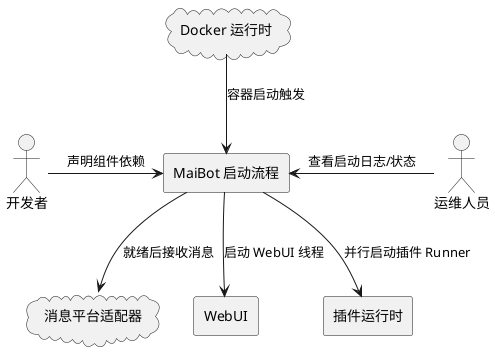
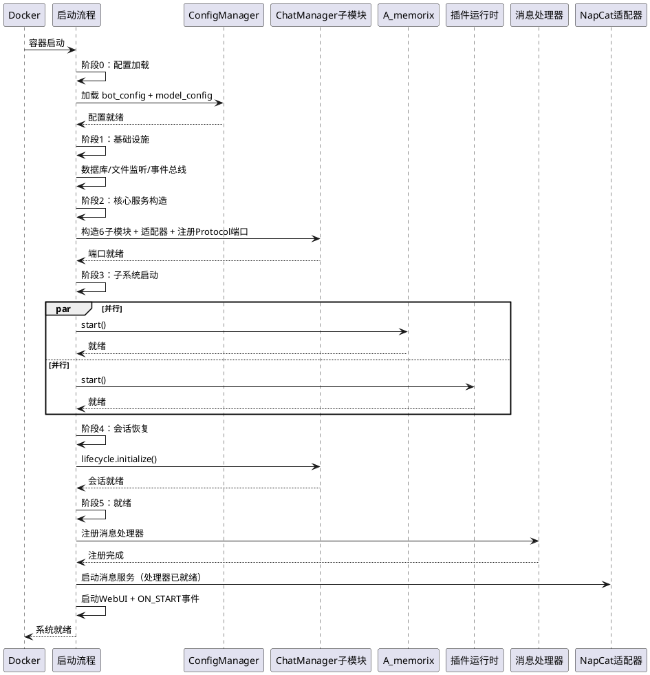
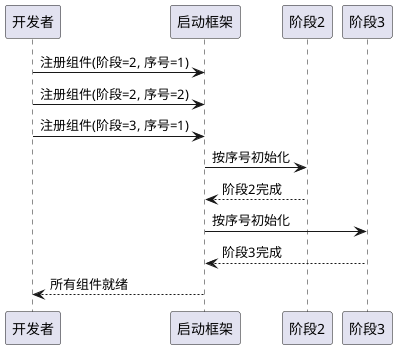
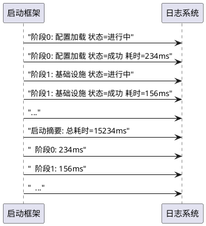
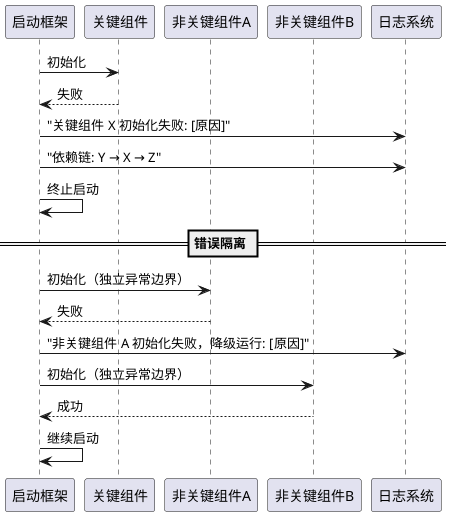
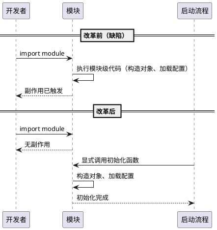
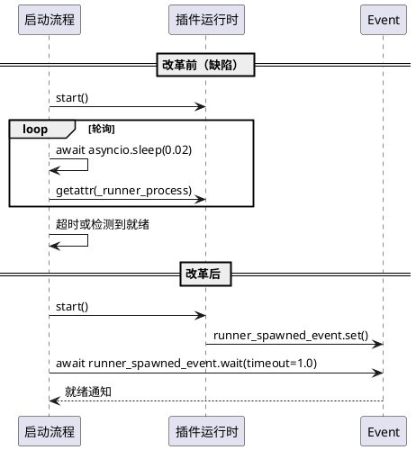
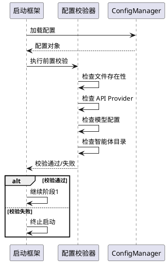
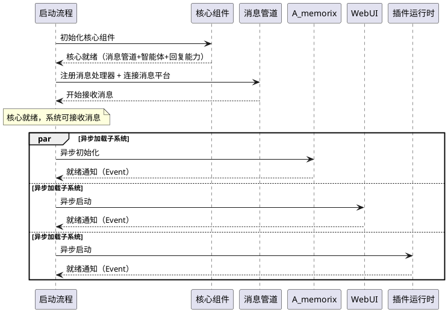
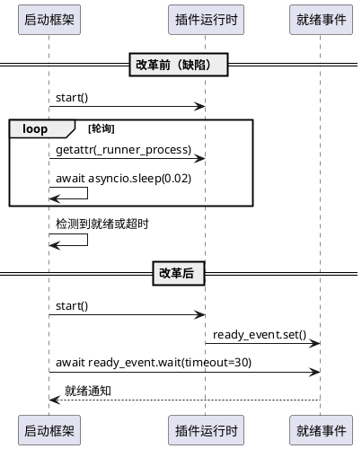

# **1. 组件定位**

## **1.1 核心职责**

本组件负责管理 MaiBot 系统的启动生命周期，消除模块级副作用、隐式初始化顺序和时序 hack，实现可观测、可诊断、可降级的启动过程。

## **1.2 核心输入**

1. **配置文件**：`bot_config.toml` 和 `model_config.toml`，由 ConfigManager 加载和热重载
2. **环境变量**：Docker 容器环境变量，影响数据库路径、日志级别等
3. **智能体配置目录**：`agents/` 目录下的智能体 YAML/TOML 配置文件
4. **插件清单**：`plugins/` 目录下的插件元数据
5. **数据库状态**：SQLite 数据库中的会话、记忆等持久化数据

## **1.3 核心输出**

1. **启动阶段状态**：当前系统处于哪个启动阶段、各阶段完成/失败状态
2. **初始化耗时报告**：各组件初始化耗时数据
3. **启动失败诊断信息**：失败组件、失败原因、依赖链路
4. **系统就绪信号**：所有核心组件初始化完成、消息处理器已注册、系统可接收消息

## **1.4 职责边界**

1. **不负责**：具体组件的初始化逻辑（如 A_memorix 如何初始化内核、ChatManager 如何加载会话）
2. **不负责**：配置文件的内容校验（由 ConfigManager 的 `model_post_init` 和 `load_config_from_file` 负责）
3. **不负责**：运行时组件间的消息路由（由 Orchestrator 和 AgentRouter 负责）
4. **不负责**：组件的热重载逻辑（由 ConfigManager 的文件监听和回调机制负责）
5. **不负责**：引入重量级框架（如依赖注入容器、声明式生命周期管理等过度工程化方案）

---

# **2. 领域术语**

**启动阶段（Startup Phase）**
: 系统启动过程中的一个逻辑阶段，包含一组具有相同依赖级别的组件初始化。阶段之间有严格的先后顺序。

**启动检查点（Startup Checkpoint）**
: 一个启动阶段完成后的验证点，用于确认该阶段的所有组件已正确初始化，可以安全进入下一阶段。

**降级启动（Degraded Startup）**
: 当非关键组件初始化失败时，系统跳过该组件继续启动，以受限功能运行的启动模式。

**关键组件（Critical Component）**
: 初始化失败会导致整个系统无法运行的组件。缺少关键组件时系统必须终止。

**非关键组件（Non-critical Component）**
: 初始化失败不会导致系统无法运行的组件。缺少非关键组件时系统可以降级运行。

**延迟初始化（Lazy Initialization）**
: 将模块级单例的创建从导入时延迟到启动流程中显式调用。导入模块不应触发任何业务对象的构造或 I/O 操作。

**显式等待（Explicit Wait）**
: 通过事件（asyncio.Event）、条件变量或回调等机制等待某个条件满足，而非通过 `asyncio.sleep()` 轮询。

**错误隔离（Error Isolation）**
: 非关键组件的初始化失败不应传播到其他组件。每个非关键组件应在独立的 try/except 中初始化，失败后仅标记降级。

**就绪屏障（Ready Barrier）**
: 消息处理器注册与消息平台适配器连接之间的时序保证——消息处理器必须在系统对外暴露消息接收端点之前完成注册，消除消息丢失窗口。

**公共接口（Public Interface）**
: 组件间交互应通过公开的方法或 Protocol 接口进行，禁止通过 getattr 访问其他组件的私有属性（以 `_` 开头的属性）。

**核心就绪（Core Ready）**
: 系统启动的最低就绪状态，满足消息管道可用 + 智能体可思考 + 可回复三个条件。核心就绪后系统即可接收和处理消息，无需等待非核心子系统。

**子系统延迟加载（Subsystem Lazy Loading）**
: 非核心子系统在核心就绪后异步初始化，不阻塞消息处理的启动策略。微内核架构配微内核启动——核心先就绪，子系统按需加载。

**降级运行（Degraded Operation）**
: 当非核心子系统未就绪时，相关功能不可用但不影响核心消息处理。与"降级启动"的区别：降级启动指启动时组件失败后的降级，降级运行指启动后子系统尚未就绪时的正常过渡状态。

**插件启动抽象（Plugin Startup Abstraction）**
: 启动框架只通过插件运行时的公共接口（如 start()、is_ready()）交互，不关心内部实现模型（子进程/进程内/混合）。启动框架与插件运行时之间是接口契约关系，不是实现细节耦合。

---

# **3. 角色与边界**

## **3.1 核心角色**

- **运维人员**：通过 Docker 容器日志监控启动状态，诊断启动失败原因
- **开发者**：新增组件时声明初始化依赖，确保组件在正确的阶段被初始化

## **3.2 外部系统**

- **Docker 运行时**：容器启动时触发 main.py，容器重启时需要快速恢复
- **消息平台适配器**：NapCat 等，系统就绪后开始接收消息
- **WebUI**：独立线程启动，展示系统状态
- **插件运行时**：子进程中的插件 Runner，与主进程并行启动

## **3.3 交互上下文**

---

# **4. DFX约束**

## **4.1 性能**

1. 启动总耗时应当不超过当前基线（约 10-30 秒，取决于 A_memorix 数据量和网络状况）
2. 改革后的启动流程不引入超过 5% 的额外开销（阶段管理、计时等基础设施）
3. 各组件初始化耗时应可独立测量，精度不低于 10ms
4. 核心就绪时间（消息管道可用 + 智能体可思考 + 可回复）应当不超过 5 秒，与 A_memorix 数据量和网络状况无关

## **4.2 可靠性**

1. 关键组件初始化失败时，系统应当立即终止并输出明确的错误信息
2. 非关键组件初始化失败时，系统应当继续启动并记录警告日志
3. 启动过程中不应出现因初始化顺序错误导致的运行时异常
4. 导入任何模块不应触发配置加载、数据库连接或网络请求等副作用

## **4.3 安全性**

1. 启动阶段状态不应暴露敏感配置信息（如 API Key）
2. 启动失败日志不应包含完整的配置文件内容

## **4.4 可维护性**

1. 每个启动阶段的日志应当包含阶段名称、开始时间、结束时间、耗时
2. 启动失败时应当输出失败组件名称、失败原因、依赖链路
3. 新增组件时应当能通过声明所属阶段自动归入正确的初始化位置，而非手动调整代码行位置
4. 组件间等待应通过显式机制（Event/回调），而非 sleep 轮询

## **4.5 兼容性**

1. 改革后的启动流程必须保持所有现有 Protocol 端口注册点（session_port_registry、runtime_port_registry、replyer_port_registry、image_port_registry）的注册时机不变
2. 改革后的启动流程必须保持 `_ConfigProxy` 热重载机制正常工作
3. 改革后的启动流程必须保持 `main()` 函数作为入口的调用方式不变

---

# **5. 核心能力**

## **5.1 启动阶段划分**

### **5.1.1 业务规则**

1. **阶段定义规则**：系统启动必须划分为以下阶段，每个阶段有明确的准入条件和完成条件：
   - **阶段 0 — 配置加载**：加载 bot_config.toml 和 model_config.toml，执行配置迁移和校验
   - **阶段 1 — 基础设施**：初始化数据库连接、文件监听器、事件总线等基础设施
   - **阶段 2 — 核心服务构造**：构造 ChatManager 子模块、适配器、Protocol 端口注册
   - **阶段 3 — 子系统启动**：并行启动 A_memorix、插件运行时、表情管理等子系统
   - **阶段 4 — 会话恢复**：从数据库恢复会话、绑定智能体、启动定时持久化
   - **阶段 5 — 就绪**：注册消息处理器、启动 WebUI、触发 ON_START 事件、启动定时任务

   a. 验收条件：[系统启动] → [日志中可见 6 个阶段依次执行，每个阶段有开始/完成标记]

2. **阶段准入规则**：每个阶段开始前必须验证前一阶段的所有关键组件已成功初始化
   a. 验收条件：[阶段 N-1 的关键组件未完成] → [阶段 N 不开始，输出等待日志或终止]

3. **阶段内并行规则**：同一阶段内无依赖关系的组件应当并行初始化
   a. 验收条件：[阶段 3 中 A_memorix 和插件运行时并行启动] → [总耗时接近 max(两者) 而非 sum(两者)]

4. **禁止项**：禁止跨阶段的前向依赖（即阶段 N 的组件不能依赖阶段 N+1 的组件）
   a. 验收条件：[代码审查发现阶段 2 的组件引用阶段 3 才初始化的对象] → [编译期或启动时报错]

5. **就绪屏障规则**：消息处理器必须在消息平台适配器开始接收消息之前完成注册，消除消息丢失窗口
   a. 验收条件：[NapCat 适配器连接并推送消息时] → [消息处理器已注册完成，消息不会丢失]
   b. 缺陷追溯：缺陷 7——当前 `_register_message_handlers()` 在 `schedule_tasks()` 中调用，NapCat 可能在注册前已推送消息

### **5.1.2 交互流程**

### **5.1.3 异常场景**

1. **配置文件缺失或格式错误**
   a. 触发条件：bot_config.toml 或 model_config.toml 不存在或 TOML 解析失败
   b. 系统行为：阶段 0 失败，终止启动
   c. 用户感知：日志输出 "配置文件缺失或解析失败" + 具体文件路径和错误信息

2. **关键组件初始化超时**
   a. 触发条件：A_memorix 或插件运行时在合理时间内未完成初始化
   b. 系统行为：记录超时警告，继续等待（不强制终止，因为可能是网络延迟）
   c. 用户感知：日志输出 "组件初始化耗时较长" + 组件名称 + 已等待时间

3. **非关键组件初始化失败**
   a. 触发条件：智能体交互调度器、表情管理等非关键组件初始化抛出异常
   b. 系统行为：记录警告日志，跳过该组件，继续后续阶段
   c. 用户感知：日志输出 "非关键组件初始化失败，系统将以受限功能运行" + 组件名称 + 错误信息

4. **Protocol 端口注册时序错误**
   a. 触发条件：某个模块在 Protocol 端口注册前尝试获取端口
   b. 系统行为：抛出 RuntimeError（与当前行为一致，不兜底）
   c. 用户感知：日志输出明确的端口名称 + "未注册" + 调用栈

5. **消息处理器注册前消息到达**
   a. 触发条件：消息平台适配器在消息处理器注册完成前推送消息
   b. 系统行为：消息被缓冲或拒绝（取决于就绪屏障的实现方式），不丢失
   c. 用户感知：日志输出 "消息在系统就绪前到达，已缓冲/拒绝"
   d. 缺陷追溯：缺陷 7——当前存在消息处理器未注册但适配器已连接的窗口期

## **5.2 显式初始化顺序**

### **5.2.1 业务规则**

1. **显式顺序规则**：`_init_components()` 中的组件初始化顺序必须通过显式声明（如阶段归属 + 阶段内序号）来保证，而非靠代码行位置隐式保证
   a. 验收条件：[开发者新增组件] → [必须声明其所属阶段和阶段内位置，否则启动框架拒绝注册]
   b. 缺陷追溯：缺陷 2——当前 `_init_components()` 是 200 行线性函数，新增组件必须手动判断插入位置，放错就崩溃

2. **阶段归属规则**：每个组件必须声明其所属的启动阶段，启动框架按阶段顺序依次初始化
   a. 验收条件：[组件声明阶段 3] → [该组件在阶段 3 中初始化，不会在阶段 2 或阶段 4 中被初始化]

3. **阶段内顺序规则**：同一阶段内有依赖关系的组件，必须通过显式的序号或依赖声明保证初始化顺序
   a. 验收条件：[阶段 2 中 ChatManager 子模块在适配器之前初始化] → [这是显式声明的，而非靠代码行位置]

4. **禁止项**：禁止通过调整代码行位置来解决初始化顺序问题
   a. 验收条件：[代码审查发现初始化顺序仅靠代码行位置保证] → [必须改为显式声明]

### **5.2.2 交互流程**

### **5.2.3 异常场景**

1. **阶段归属冲突**
   a. 触发条件：同一组件被注册到多个阶段
   b. 系统行为：启动时报告注册冲突错误并终止
   c. 用户感知：日志输出 "组件 X 重复注册到阶段 Y 和阶段 Z"

2. **阶段内循环依赖**
   a. 触发条件：同一阶段内的组件形成循环依赖
   b. 系统行为：启动时报告循环依赖错误并终止
   c. 用户感知：日志输出 "阶段 N 内检测到循环依赖: A → B → A"

## **5.3 启动可观测性**

### **5.3.1 业务规则**

1. **阶段计时规则**：每个启动阶段必须记录开始时间、结束时间、耗时（毫秒级）
   a. 验收条件：[系统启动完成] → [日志中可见每个阶段的耗时数据]
   b. 缺陷追溯：缺陷 6——当前只有总耗时，没有各组件/阶段的分项耗时

2. **组件计时规则**：每个组件的初始化必须记录耗时
   a. 验收条件：[系统启动完成] → [日志中可见每个组件的初始化耗时]
   b. 缺陷追溯：缺陷 6——无法知道哪个组件是启动瓶颈

3. **启动摘要规则**：系统启动完成后必须输出启动摘要，包含总耗时、各阶段耗时、各关键组件耗时
   a. 验收条件：[系统就绪] → [日志输出包含 "启动摘要" 的结构化信息]

4. **阶段状态规则**：每个阶段必须输出其状态（进行中/成功/失败/跳过）
   a. 验收条件：[阶段执行] → [日志输出 "阶段 N: [名称] 状态=进行中/成功/失败/跳过"]

### **5.3.2 交互流程**

### **5.3.3 异常场景**

1. **计时器异常**
   a. 触发条件：系统时钟跳变导致耗时计算为负数
   b. 系统行为：记录警告，耗时标记为 "N/A"
   c. 用户感知：日志输出 "阶段 N 耗时计算异常"

## **5.4 启动错误处理与降级**

### **5.4.1 业务规则**

1. **关键组件失败终止规则**：当关键组件初始化失败时，系统必须终止启动并输出诊断信息
   a. 验收条件：[A_memorix（启用状态下）初始化失败] → [系统终止，输出失败原因和依赖链]

2. **非关键组件失败降级规则**：当非关键组件初始化失败时，系统必须继续启动并标记该组件为降级状态
   a. 验收条件：[智能体交互调度器初始化失败] → [系统正常启动，日志记录降级警告]

3. **关键组件分类规则**：以下组件为关键组件，初始化失败必须终止：
    - ConfigManager（配置管理）
    - ChatManager 子模块 + 适配器（会话管理）
    - 消息处理器注册（消息接收）
    a. 验收条件：[上述任一组件初始化失败] → [系统终止]
    b. 设计依据：关键组件 = 核心就绪最小集（消息管道 + 智能体思考 + 回复能力）的必要组成部分

4. **非关键组件分类规则**：以下组件为非关键组件，初始化失败可以降级：
    - A_memorix（记忆系统——核心就绪后异步加载，未就绪时智能体无记忆上下文但可回复）
    - WebUI 服务器
    - 智能体交互调度器
    - 插件运行时
    - 表情管理器
    - 遥测心跳/统计上传
    - 图片路径维护
    a. 验收条件：[上述任一组件初始化失败] → [系统继续运行，日志记录降级]

5. **非关键组件错误隔离规则**：非关键组件的初始化必须在独立的异常边界中执行，一个非关键组件的失败不得导致其他组件被取消或跳过
   a. 验收条件：[emoji_manager 加载失败] → [A_memorix 和插件运行时不受影响，继续正常启动]
   b. 缺陷追溯：缺陷 5——当前 `asyncio.gather(plugin, a_memorix, emoji)` 任何一个失败就全部取消

6. **错误信息规则**：启动失败时的错误信息必须包含：失败组件名、异常类型、异常消息、依赖链路
   a. 验收条件：[组件初始化失败] → [日志输出包含上述 4 项信息]

7. **禁止项**：禁止用 try/except 吞掉关键组件的初始化异常
   a. 验收条件：[关键组件初始化异常被捕获后未重新抛出] → [代码审查不通过]

### **5.4.2 交互流程**

### **5.4.3 异常场景**

1. **多个非关键组件同时失败**
   a. 触发条件：WebUI 和智能体交互调度器同时初始化失败
   b. 系统行为：记录所有失败组件的警告，继续启动
   c. 用户感知：日志输出多个 "非关键组件初始化失败" 警告

2. **关键组件在非关键组件之后失败**
   a. 触发条件：阶段 3 的 A_memorix 失败，但阶段 2 的非关键组件已成功
   b. 系统行为：终止启动，回滚已启动的非关键组件
   c. 用户感知：日志输出 "关键组件失败，终止启动" + 回滚日志

3. **asyncio.gather 级联取消**
   a. 触发条件：并行初始化的多个非关键组件中，一个失败导致 asyncio.gather 取消其余任务
   b. 系统行为：不应发生——非关键组件必须在独立的异常边界中初始化，不使用共享的 asyncio.gather
   c. 用户感知：如果发生，日志输出 "非关键组件错误隔离失效" + 具体组件名
   d. 缺陷追溯：缺陷 5——当前 `asyncio.gather(plugin, a_memorix, emoji)` 的全有或全无行为

## **5.5 模块级副作用消除**

### **5.5.1 业务规则**

1. **导入无副作用规则**：导入任何模块不应触发配置加载、数据库连接、网络请求或业务对象的构造
   a. 验收条件：[执行 `from src.config.config import global_config`] → [不触发 ConfigManager.initialize()，不加载配置文件]
   b. 缺陷追溯：缺陷 1——当前 config.py 第 753-755 行在模块级执行 `ConfigManager()` + `initialize()`

2. **延迟初始化规则**：模块级单例（如 `chat_bot = ChatBot()`、`heartflow_manager = HeartflowManager()` 等）的创建必须延迟到启动流程中显式调用，而非在模块导入时自动执行
   a. 验收条件：[导入 `from src.chat.message_receive.bot import chat_bot`] → [不触发 ChatBot() 构造]
   b. 缺陷追溯：缺陷 1——当前存在 47 个模块级单例，任何导入都触发对象构造

3. **可测试性规则**：模块级单例延迟初始化后，测试中必须能够独立构造和注入依赖，无需触发完整的启动流程
   a. 验收条件：[单元测试中需要 mock 配置] → [可以直接构造 ConfigManager 实例并注入，无需启动流程]
   b. 缺陷追溯：缺陷 1——当前测试中无法 mock 配置，因为导入即初始化

4. **渐进迁移规则**：模块级单例的消除应渐进进行，优先处理影响测试和启动流程的关键单例（如 config_manager、global_config），非关键单例可后续处理
   a. 验收条件：[config_manager 和 global_config 的模块级初始化已消除] → [其余单例可保持现状，不阻塞本次改革]

5. **禁止项**：禁止在模块级执行任何有副作用的操作，包括但不限于：文件 I/O、网络请求、数据库连接、配置加载、对象构造
   a. 验收条件：[代码审查发现模块级有副作用的代码] → [必须延迟到函数/方法中执行]

### **5.5.2 交互流程**

### **5.5.3 异常场景**

1. **延迟初始化后首次访问未初始化**
   a. 触发条件：模块级单例改为延迟初始化后，代码在启动流程之前访问该单例
   b. 系统行为：抛出 RuntimeError（与 Protocol 端口未注册的行为一致，不兜底）
   c. 用户感知：日志输出 "组件 X 未初始化，请检查启动流程" + 调用栈

2. **循环导入暴露**
   a. 触发条件：消除模块级副作用后，原本被副作用掩盖的循环导入问题暴露
   b. 系统行为：启动时报告 ImportError
   c. 用户感知：日志输出循环导入链路

## **5.6 时序同步与接口规范**

### **5.6.1 业务规则**

1. **显式等待规则**：组件间需要等待某个条件满足时，必须使用显式机制（asyncio.Event、asyncio.Condition、回调等），禁止使用 `asyncio.sleep()` 轮询或让步
   a. 验收条件：[插件 Runner 子进程启动完成] → [通过 Event 通知，而非 `await asyncio.sleep(0.02)` 轮询]
   b. 缺陷追溯：缺陷 3——当前第 46 行 `await asyncio.sleep(0.02)` 轮询等待插件 Runner

2. **调度让步规则**：禁止使用 `await asyncio.sleep(0)` 作为调度让步的 hack
   a. 验收条件：[启动流程代码中不存在 `await asyncio.sleep(0)` 调用]
   b. 缺陷追溯：缺陷 3——当前第 225 行 `await asyncio.sleep(0)` 纯调度让步

3. **日志时序规则**：禁止使用 `asyncio.sleep()` 解决日志输出时序问题
   a. 验收条件：[启动流程代码中不存在为解决日志问题而添加的 sleep 调用]
   b. 缺陷追溯：缺陷 3——当前第 277 行（已注释）`await asyncio.sleep(0.5)` "防止logger输出飞了"

4. **公共接口规则**：组件间交互必须通过公开的方法或 Protocol 接口进行，禁止通过 getattr 访问其他组件的私有属性（以 `_` 开头的属性）
   a. 验收条件：[启动流程中访问其他组件的私有属性] → [代码审查不通过，必须改为公共接口]
   b. 缺陷追溯：缺陷 4——当前 `_wait_for_plugin_runners_spawned()` 访问 `_runner_process` 私有属性

5. **禁止项**：禁止在启动流程中使用 `asyncio.sleep()` 解决时序问题
   a. 验收条件：[启动流程代码中不存在 `asyncio.sleep()` 调用（测试/调试用途除外）]

### **5.6.2 交互流程**

### **5.6.3 异常场景**

1. **显式等待超时**
   a. 触发条件：Event 等待超时（如插件 Runner 子进程未在预期时间内启动）
   b. 系统行为：记录警告日志，继续启动（插件运行时是可降级的）
   c. 用户感知：日志输出 "插件 Runner 启动超时，系统将以受限功能运行"

2. **公共接口缺失**
   a. 触发条件：需要访问其他组件的状态，但该组件未暴露公共接口
   b. 系统行为：启动时报告接口缺失错误
   c. 用户感知：日志输出 "组件 X 缺少公共接口 Y，无法查询状态"

## **5.7 配置前置校验**

### **5.7.1 业务规则**

1. **启动前校验规则**：在进入组件初始化阶段前，必须对配置进行完整性校验，提前暴露配置错误
   a. 验收条件：[model_config.toml 中 API Provider 缺失] → [阶段 0 即报错终止，而非运行时崩溃]

2. **校验项规则**：配置前置校验必须至少包含以下检查：
   - bot_config.toml 和 model_config.toml 文件存在性
   - model_config.toml 中至少配置一个 API Provider
   - model_config.toml 中至少配置一个模型
   - 每个模型的 api_provider 字段指向已定义的 Provider
   - 智能体配置目录存在且至少有一个智能体配置
   a. 验收条件：[上述任一检查失败] → [启动在阶段 0 终止，输出具体校验失败项]

3. **校验与现有机制的关系**：前置校验不替代 ConfigManager 的 `model_post_init` 校验，而是在其基础上增加启动场景的完整性检查
   a. 验收条件：[ConfigManager.model_post_init 已校验的项] → [前置校验不重复报错]

### **5.7.2 交互流程**

### **5.7.3 异常场景**

1. **智能体配置目录不存在**
   a. 触发条件：`agents/` 目录不存在或为空
   b. 系统行为：阶段 0 失败，终止启动
   c. 用户感知：日志输出 "智能体配置目录不存在或为空: agents/"

2. **API Provider 配置不完整**
    a. 触发条件：模型引用了不存在的 API Provider
    b. 系统行为：阶段 0 失败，终止启动
    c. 用户感知：日志输出 "模型 X 引用的 API Provider Y 未定义"

## **5.8 微内核启动理念**

### **5.8.1 业务规则**

1. **核心就绪最小集规则**：系统就绪的最低条件是消息管道可用 + 智能体可思考 + 可回复。满足这三点即视为"核心就绪"，可以开始接收消息
   a. 验收条件：[消息管道已注册 + ThinkingOrgan 可用 + MessagePortV2 可发送] → [系统标记为"核心就绪"，开始接收消息]

2. **微内核-微启动一致规则**：MaiBot 的架构是微内核（Protocol 接口契约），启动流程应匹配架构——核心先就绪，子系统按需加载，而非一次性初始化所有组件
   a. 验收条件：[启动流程的组件初始化顺序] → [核心组件（消息管道+智能体+回复能力）先于所有子系统完成初始化]

3. **子系统延迟加载规则**：非核心子系统（A_memorix、WebUI、插件运行时、表情管理器等）可以在核心就绪后异步初始化，不阻塞消息处理
   a. 验收条件：[核心就绪后] → [A_memorix 在后台异步初始化，同时系统已可接收和处理消息]

4. **降级运行规则**：当非核心子系统未就绪时，相关功能不可用但不影响核心消息处理
   a. 验收条件：[A_memorix 未就绪时] → [智能体仍可回复但无记忆上下文，日志记录"记忆系统未就绪，降级运行"]
   b. 验收条件：[WebUI 未就绪时] → [消息处理不受影响，WebUI 后台启动完成后自动可用]
   c. 验收条件：[插件运行时未就绪时] → [消息处理不受影响，插件功能在运行时就绪后自动可用]

5. **子系统就绪通知规则**：每个非核心子系统应提供显式的就绪通知机制（asyncio.Event 或回调），供其他组件查询其可用状态
   a. 验收条件：[A_memorix 初始化完成] → [通过 Event 通知，其他组件可查询记忆服务是否可用]

6. **禁止项**：禁止将非核心子系统的就绪作为系统可接收消息的前置条件
   a. 验收条件：[A_memorix 初始化耗时 30 秒] → [系统在核心就绪后即可接收消息，不等待 A_memorix]

### **5.8.2 交互流程**

### **5.8.3 异常场景**

1. **子系统异步初始化失败**
   a. 触发条件：A_memorix 在核心就绪后的异步初始化中失败
   b. 系统行为：标记该子系统为降级状态，记录警告日志，核心消息处理不受影响
   c. 用户感知：日志输出 "子系统 A_memorix 初始化失败，相关功能不可用: [原因]"，智能体回复无记忆上下文

2. **核心就绪前消息到达**
   a. 触发条件：消息平台在核心就绪前推送消息
   b. 系统行为：消息被缓冲或拒绝（与就绪屏障规则一致），不丢失
   c. 用户感知：日志输出 "消息在核心就绪前到达，已缓冲/拒绝"

3. **子系统长时间未就绪**
   a. 触发条件：A_memorix 异步初始化超过 60 秒仍未完成
   b. 系统行为：记录警告日志，继续等待（不强制终止，可能是网络延迟）
   c. 用户感知：日志输出 "子系统 A_memorix 初始化耗时较长，已等待 N 秒"

## **5.9 插件实现无关性约束**

### **5.9.1 业务规则**

1. **插件启动抽象规则**：启动框架只调用插件运行时的 `start()` 接口，不关心内部是子进程还是进程内加载
   a. 验收条件：[启动框架调用 plugin_runtime.start()] → [不访问任何子进程/进程内相关的私有属性]

2. **禁止 getattr 偷窥规则**：启动框架不通过 getattr 访问插件运行时的私有属性（如 `_runner_process`）来判断就绪状态，应通过公共接口（如 `is_ready()` 或 `asyncio.Event`）
   a. 验收条件：[启动框架代码中不存在 getattr(plugin_runtime, "_runner_process")] → [代码审查通过]
   b. 缺陷追溯：缺陷 4——当前 `_wait_for_plugin_runners_spawned()` 访问 `_runner_process` 私有属性

3. **插件就绪通知规则**：插件运行时应提供显式的就绪通知机制（Event/Future），而非让启动框架轮询
   a. 验收条件：[插件 Runner 启动完成] → [通过 asyncio.Event 通知启动框架，而非启动框架轮询检查]
   b. 缺陷追溯：缺陷 3——当前 `await asyncio.sleep(0.02)` 轮询等待插件 Runner

4. **实现模型无关规则**：启动框架的代码不应包含任何假设插件运行时为子进程模型的逻辑（如进程管理、supervisor 引用等）
   a. 验收条件：[启动框架代码中不存在 `_runner_process`、`supervisors` 等子进程模型特有引用] → [代码审查通过]

5. **禁止项**：禁止启动框架依赖插件运行时的具体实现细节
   a. 验收条件：[插件运行时从子进程模型改为进程内加载] → [启动框架代码无需修改]

### **5.9.2 交互流程**

### **5.9.3 异常场景**

1. **插件就绪等待超时**
   a. 触发条件：插件运行时在 30 秒内未发出就绪通知
   b. 系统行为：记录警告日志，标记插件运行时为降级状态，核心消息处理不受影响
   c. 用户感知：日志输出 "插件运行时启动超时，插件功能不可用"

2. **插件运行时切换实现模型**
   a. 触发条件：插件运行时从子进程模型改为进程内加载
   b. 系统行为：启动框架无需修改，仅调用 start() 和等待 ready_event
   c. 用户感知：无感知，启动流程行为不变

3. **插件运行时未提供就绪通知接口**
   a. 触发条件：插件运行时未暴露 ready_event 或 is_ready() 等公共接口
   b. 系统行为：启动时报告接口缺失错误，标记插件运行时为降级状态
   c. 用户感知：日志输出 "插件运行时缺少就绪通知接口，无法确认启动状态"

---

# **6. 数据约束**

## **6.1 启动阶段（StartupPhase）**

1. **name**：阶段名称，必须是以下枚举值之一：CONFIG_LOAD / INFRASTRUCTURE / CORE_SERVICES / SUBSYSTEMS / SESSION_RESTORE / READY
2. **status**：阶段状态，必须是以下枚举值之一：PENDING / IN_PROGRESS / SUCCESS / FAILED / SKIPPED
3. **start_time**：阶段开始时间，浮点秒数（time.monotonic），阶段开始时设置
4. **end_time**：阶段结束时间，浮点秒数（time.monotonic），阶段结束时设置
5. **duration_ms**：阶段耗时毫秒数，由 end_time - start_time 计算
6. **components**：该阶段包含的组件列表

## **6.2 启动组件（StartupComponent）**

1. **name**：组件名称，唯一标识符，格式为模块路径（如 "a_memorix"、"chat_manager"）
2. **phase**：所属阶段，引用 StartupPhase.name
3. **order**：阶段内初始化序号，整数，同一阶段内按此序号依次初始化
4. **critical**：是否为关键组件，布尔值
5. **status**：组件状态，必须是以下枚举值之一：PENDING / IN_PROGRESS / SUCCESS / FAILED / SKIPPED
6. **start_time**：组件初始化开始时间
7. **end_time**：组件初始化结束时间
8. **duration_ms**：组件初始化耗时毫秒数
9. **error**：初始化失败时的异常信息，成功时为 None

## **6.3 启动结果（StartupResult）**

1. **total_duration_ms**：启动总耗时毫秒数
2. **phases**：所有阶段的执行结果列表
3. **failed_components**：失败的组件列表
4. **degraded_components**：降级的组件列表（非关键组件失败）
5. **ready**：系统是否就绪，布尔值
6. **core_ready**：核心是否就绪，布尔值（= message_pipeline_ready AND agent_thinking_ready AND reply_capability_ready）
7. **core_ready_time_ms**：核心就绪耗时毫秒数，从启动开始到核心就绪的时间

## **6.4 核心就绪状态（CoreReadiness）**

1. **message_pipeline_ready**：消息管道是否可用，布尔值（消息处理器已注册 + 消息平台适配器已连接）
2. **agent_thinking_ready**：智能体是否可思考，布尔值（ThinkingOrgan 已构造 + 智能体已注册）
3. **reply_capability_ready**：是否可回复，布尔值（MessagePortV2 已注册 + SendService 可用）
4. **core_ready**：核心是否就绪，= message_pipeline_ready AND agent_thinking_ready AND reply_capability_ready
5. **subsystem_status**：各子系统的就绪状态，字典（子系统名 → PENDING / READY / FAILED / SKIPPED）
