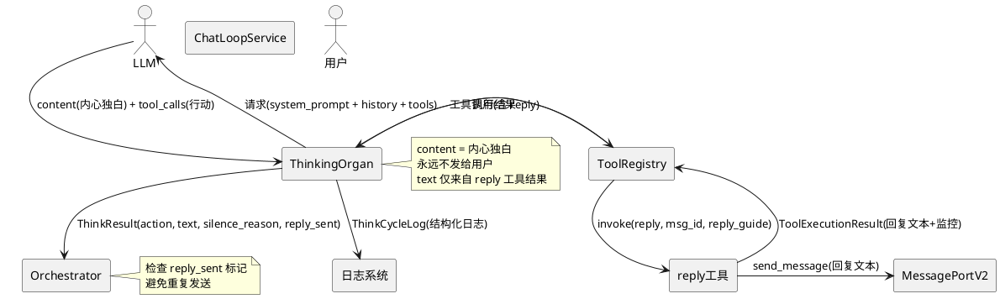
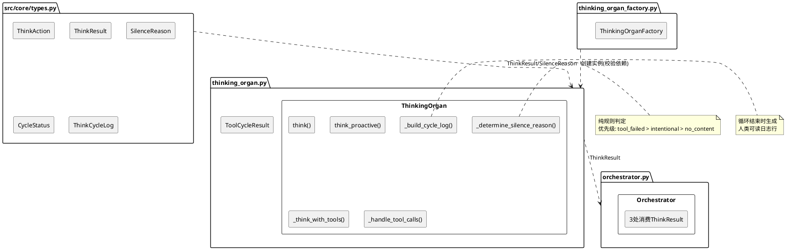
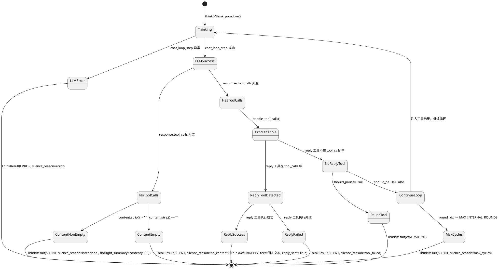

# 一、需求与存量功能关系分析

## 1.1 需求功能与存量功能对比

### 1.1.1 已实现功能

| 需求功能 | 存量功能 | 代码位置 | 匹配度 |
|---------|---------|---------|--------|
| 工具循环核心（_think_with_tools 多轮 LLM+工具执行） | 完整的工具循环实现，支持 MAX_INTERNAL_ROUNDS 轮迭代 | thinking_organ.py:146-314 | 100% |
| reply 内置工具注册与执行 | reply 工具已实现，通过 ToolRegistry 调用，内部走 replyer + MessagePortV2 发送 | builtin_tool/reply.py:133-391 | 100% |
| ThinkResult 数据类（action/text/tool_calls_count/rounds/wait_seconds） | ThinkResult 已定义，包含所有现有字段 | types.py:580-613 | 75% |
| ThinkAction 枚举（REPLY/SILENT/ERROR/WAIT/TOOL_CALL） | ThinkAction 已定义，5 种取值 | types.py:570-578 | 100% |
| ThinkContext 上下文传递 | ThinkContext 已定义，包含 messages/emotion/inner_voice/memory 等字段 | types.py:530-568 | 100% |
| ThinkingOrgan Protocol 接口 | Protocol 已定义，think()/think_proactive() 签名稳定 | protocols.py:394-428 | 100% |
| ThinkingOrganFactory 工厂 | 工厂已实现，注入 chat_loop_service/tool_registry/chat_loop_adapter | thinking_organ_factory.py:19-66 | 75% |
| Orchestrator 消费 ThinkResult | 3 处消费点（管家插话:276/提醒:333/主回复:686），统一检查 action=REPLY | orchestrator.py:276,333,686 | 75% |
| Embodied Prompt 三语模板 | zh-CN/en-US/ja-JP 三语模板已存在，包含工具使用说明 | prompts/{zh-CN,en-US,ja-JP}/maisaka_chat_embodied.prompt | 50% |
| 监控事件广播（_emit_finalized） | 已实现 planner.finalized 事件，供 WebUI 监控面板使用 | thinking_organ.py:477-513 | 100% |
| 相似度检测防死循环 | _should_replace_reasoning 已实现，SequenceMatcher > 0.9 触发替换 | thinking_organ.py:466-471 | 100% |

### 1.1.2 需要扩展的功能

| 需求功能 | 存量功能 | 差异说明 | 扩展方向 |
|---------|---------|---------|---------|
| content 永远不作为回复（架构级保证） | _think_with_tools:209-231 中，无 tool_calls 时 content 直接赋值给 ThinkResult.text，action=REPLY | 当前 content 非空→REPLY，为空→SILENT；迁移后统一 SILENT，text 仅来自 reply 工具结果 | 修改 _think_with_tools 的无 tool_calls 分支：删除 content→REPLY 路径，统一为 SILENT + silence_reason 判定 |
| 废除简化模式（_think_simple/_think_proactive_simple） | thinking_organ.py:574-651 实现了两个简化方法，当 has_full_capabilities=False 时走此路径 | 简化模式将 LLM content 直接当回复，是内心独白泄漏的根因；废除后所有路径走 _think_with_tools | 删除两个方法 + _call_llm 辅助方法；think()/think_proactive() 删除 has_full_capabilities 分支 |
| ThinkResult 新增 silence_reason 字段 | ThinkResult 无此字段，SILENT 时无法区分原因 | 新增 SilenceReason 枚举（7 种），ThinkResult 新增可选字段 | 在 types.py 新增 SilenceReason 枚举；ThinkResult 新增 silence_reason: SilenceReason \| None = None |
| ThinkResult 新增 thought_summary 字段 | ThinkResult 无此字段，内心独白无结构化记录 | 新增 thought_summary: str = ""，记录 content[:100] 供日志使用 | ThinkResult 新增字段；_think_with_tools 在循环结束时提取 content 摘要 |
| ThinkResult.text 语义变更 | 当前 text 来源为 LLM content（简化模式）或 content（完整模式无工具时） | 迁移后 text 仅来源于 reply 工具执行结果中的回复文本 | _think_with_tools 跟踪 reply 工具调用，从 ToolExecutionResult 提取回复文本赋值给 text |
| Embodied Prompt 强化"content 即内心独白" | 三语模板仅有弱约束"发言必须通过reply工具"（zh-CN:23），未明确 content 的语义 | 需要强约束措辞：content=内心独白（用户看不到）、reply=对外发言、不调工具=不回复 | 重写三语模板的工具使用说明部分，使用"必须""只有"等强约束措辞 |
| 构造时依赖校验 | ThinkingOrgan.__init__ 中 chat_loop_service/tool_registry 为可选参数，缺失时走简化模式 | 废除简化模式后，这些依赖必须存在；缺失应在构造时暴露而非运行时降级 | 构造函数校验必要依赖，缺失时抛出 ValueError；ThinkingOrganFactory 同步校验 |
| Orchestrator 避免重复发送 | 当前 reply 工具内部已通过 MessagePortV2 发送消息，Orchestrator 在 action=REPLY 时再次发送 | 迁移后需确保：reply 工具调用成功→Orchestrator 不重复发送；reply 工具失败→不降级为 content 发送 | ThinkResult 新增 reply_sent: bool = False 标记；Orchestrator 检查此标记决定是否发送 |
| 结构化思考日志（ThinkCycleLog） | 当前仅有 AutonomyLogger 的非结构化日志和 _emit_finalized 的监控事件 | 需新增 ThinkCycleLog 数据类，包含 agent_id/trigger/status/silence_reason/thought_summary 等字段 | 新增 ThinkCycleLog 数据类 + CycleStatus 枚举；_think_with_tools 循环结束时生成日志 |

### 1.1.3 需要新增的功能或接口

**数据模型层（src/core/types.py）**：
- `SilenceReason` 枚举：7 种沉默原因（INTENTIONAL / NO_CONTENT / ERROR / TIMEOUT / REJECTED / TOOL_FAILED / MAX_CYCLES）
- `CycleStatus` 枚举：循环状态（COMPLETED_REPLY / COMPLETED_SILENT / ERROR / TIMEOUT）
- `ThinkCycleLog` 数据类：结构化思考日志，13 个字段

**ThinkingOrgan 内部逻辑**：
- reply 工具调用检测与结果提取：在 _handle_tool_calls 中识别 reply 工具调用，从 ToolExecutionResult 中提取回复文本
- silence_reason 判定逻辑：按优先级 tool_failed > intentional > no_content > max_cycles 判定
- ThinkCycleLog 生成逻辑：循环结束时组装日志并输出

**Embodied Prompt 三语同步**：
- zh-CN/en-US/ja-JP 模板的工具使用说明部分重写

## 1.2 存量功能详细分析

### 1.2.1 _think_with_tools 工具循环

**接口契约**：
- 入参：ThinkContext + request_kind + reason
- 出参：ThinkResult
- 副作用：通过 _handle_tool_calls 执行工具（包括 reply 工具的直接发送）

**业务规则**：
- 最多 MAX_INTERNAL_ROUNDS=10 轮迭代
- 每轮调用 chat_loop_service.chat_loop_step 获取 LLM 响应
- 有 tool_calls → 执行工具，注入结果，继续循环
- 无 tool_calls → content 非空则 REPLY，为空则 SILENT（**此为迁移核心改造点**）
- 工具返回 pause_execution/wait_rest → 提前退出循环
- 达到上限 → SILENT

**扩展点**：
- _handle_tool_calls 返回 (should_pause, pause_tool_name, summaries, monitor_results)
- reply 工具当前不触发 pause，执行后循环继续
- 工具执行结果通过 summaries 注入下一轮对话

**约束**：
- 相似度检测防止死循环（SIMILARITY_THRESHOLD=0.9）
- LLM 调用异常 → 立即返回 ERROR
- 监控事件广播异常不影响主流程

### 1.2.2 _think_simple / _think_proactive_simple 简化模式

**接口契约**：
- 入参：ThinkContext（_think_proactive_simple 额外接收 reason）
- 出参：ThinkResult(action=REPLY, text=LLM输出) 或 ThinkResult(action=SILENT)

**业务规则**：
- 无工具循环，单次 LLM 调用
- 通过 _call_llm 辅助方法直接调用 LLMServiceClient
- LLM 输出非空 → REPLY（**内心独白泄漏根因**）
- LLM 输出为空 → SILENT

**约束**：
- 当 has_full_capabilities=False 时走此路径
- _call_llm 使用 LLMServiceClient(task_name="replyer")，不经过 ChatLoopService
- 无工具定义注入，无上下文管理

**迁移影响**：废除后需确保所有 ThinkingOrgan 实例都注入了 chat_loop_service 和 tool_registry。当前共居智能体的 ThinkingOrgan 可能未注入这些依赖——需检查 ThinkingOrganFactory 的调用链。

### 1.2.3 reply 内置工具

**接口契约**：
- 工具声明：name="reply"，必填参数 msg_id，可选参数 set_quote/reply_guide/expression_intent
- 执行结果：ToolExecutionResult(success=True/False, content=回复文本, metadata=监控详情)

**业务规则**：
- 通过 msg_id 查找目标消息
- 调用 replyer_manager 获取 Maisaka 回复生成器
- replyer 根据 latest_thought + chat_history + reply_tool_args 生成回复文本
- 可选 rich_reply 检查（二次润色）
- 通过 MessagePortV2.send_message 发送回复（**reply 工具内部直接发送**）
- 返回 ToolExecutionResult 包含回复文本和监控元数据

**关键约束**：
- reply 工具内部已通过 MessagePortV2 发送消息
- ToolExecutionResult.content 包含回复文本摘要
- ToolExecutionResult.metadata 包含 monitor_detail 等监控信息
- reply 工具失败时返回 build_failure_result

**迁移影响**：reply 工具的"内部直接发送"行为与迁移目标存在张力。迁移后 ThinkResult.text 需要从 reply 工具的执行结果中提取回复文本，同时需要避免 Orchestrator 重复发送。

### 1.2.4 Orchestrator ThinkResult 消费

**3 处消费点**：

1. **管家插话**（orchestrator.py:276）：
   - `result.action == ThinkAction.REPLY and result.text` → 通过 MessagePortV2 发送
   - 插话场景当前走 _think_with_tools（has_full_capabilities=True 时）

2. **提醒触发**（orchestrator.py:333）：
   - 同上逻辑
   - 提醒场景当前走 _think_proactive_simple（has_full_capabilities=False 时）或 _think_with_tools

3. **主回复**（orchestrator.py:686）：
   - 同上逻辑，额外处理 WAIT 和 SILENT 分支
   - SILENT 时记录 debug 日志（rounds/tools 信息）

**迁移影响**：消费逻辑本身不需要改（action=REPLY 时才发消息），但需确保：
- ThinkResult.text 仅在 reply 工具调用成功时有值
- reply 工具已发送的消息不被 Orchestrator 重复发送

### 1.2.5 Embodied Prompt 三语模板

**当前 zh-CN 版本**（maisaka_chat_embodied.prompt:23）：
```
发言必须通过reply工具，不然用户无法看见
```

**当前 en-US 版本**（maisaka_chat_embodied.prompt:24）：
```
Call reply when you decide to now formally send a visible reply to the user.
```

**当前 ja-JP 版本**（maisaka_chat_embodied.prompt:24）：
```
{bot_name}が今、正式にユーザーへ可視の返信を送るべきだと決めたときは reply を呼び出してください。
```

**差异分析**：
- zh-CN 使用了"必须"强约束，但仅约束了"发言通过 reply"，未约束 content 的语义
- en-US/ja-JP 使用了弱约束措辞（"Call reply when you decide"）
- 三语均未明确：content = 内心独白（用户看不到）
- 三语均未明确：不调 reply = 不回复

---

# 二、增量设计方案

## 2.1 实现模型

### 2.1.1 上下文视图



**关键设计决策——reply 工具发送责任**：

reply 工具当前内部通过 MessagePortV2 直接发送消息，且包含复杂的 replyer 二次润色、rich_reply 检查、多段发送等逻辑。将发送责任从 reply 工具迁移到 Orchestrator 是更干净的架构，但涉及 reply 工具的重大重构。

**决策**：本次迁移采用**标记-跳过策略**——reply 工具继续内部发送，ThinkResult 新增 `reply_sent: bool` 标记，Orchestrator 检查此标记避免重复发送。reply 工具的发送责任迁移作为后续独立任务。

**理由**：
1. 本次迁移的核心目标是"思考-行动分离"（content 不泄漏），不是"回复管道重构"
2. reply 工具的 replyer 二次润色 + rich_reply + 多段发送逻辑复杂，拆分发送责任风险高
3. 标记-跳过策略零风险：reply_sent=True 时 Orchestrator 跳过发送，行为与当前一致

### 2.1.2 服务/组件总体架构



**模块划分**：

| 模块 | 职责 | 改动范围 |
|------|------|---------|
| SilenceReason 枚举 | 7 种沉默原因定义 | 新增（types.py） |
| CycleStatus 枚举 | 4 种循环状态定义 | 新增（types.py） |
| ThinkCycleLog 数据类 | 结构化思考日志 | 新增（types.py） |
| ThinkResult 扩展 | 新增 silence_reason/thought_summary/reply_sent 字段 | 扩展（types.py） |
| _think_with_tools 改造 | content 不作为回复 + reply 工具检测 + silence_reason 判定 | 核心改造（thinking_organ.py） |
| _think_simple 删除 | 废除简化模式 | 删除（thinking_organ.py） |
| 构造时校验 | chat_loop_service/tool_registry 必须非空 | 新增（thinking_organ.py + factory） |
| Orchestrator 消费适配 | 检查 reply_sent 标记 | 小改（orchestrator.py） |
| Embodied Prompt 强化 | 三语模板重写工具使用说明 | 修改（3 个 prompt 文件） |

### 2.1.3 实现设计文档

#### 2.1.3.1 思考-行动循环状态流转



#### 2.1.3.2 silence_reason 判定优先级

```
判定时机：循环结束时（无 reply 工具调用 或 reply 工具失败）

优先级从高到低：
1. tool_failed  — 有工具执行失败（包括 reply 工具失败）
2. intentional  — content 非空（智能体有内心活动但选择不回复）
3. no_content   — content 为空（LLM 无输出）
4. max_cycles   — 循环达到上限

特殊情况（循环外判定）：
- error     — LLM 调用异常（在 catch 块中判定）
- timeout   — 思考超时（预留，当前无超时机制）
- rejected  — 激活被拒（在 Orchestrator 层判定，不经过 ThinkingOrgan）
```

#### 2.1.3.3 reply 工具调用检测与结果提取

**检测策略**：在 `_handle_tool_calls` 中遍历 tool_calls，识别 `func_name == "reply"` 的调用。

**结果提取**：reply 工具的 `ToolExecutionResult` 中：
- `success=True` 时：从 `result.structured_content["reply_text"]` 提取完整回复文本（非 `result.content`，后者是人工可读摘要如 `"银狼"已生成并向"刘妙奇"发送了回复"你好"`）
- `success=False` 时：标记 reply_failed=True，立即返回 SILENT（不继续循环，避免 LLM 下一轮再次调用 reply 导致重复发送）

**文本来源**：reply 工具内部通过 replyer 生成回复文本，并通过 MessagePortV2 发送。`ToolExecutionResult.structured_content["reply_text"]` 包含完整回复文本，`ToolExecutionResult.content` 仅是人工可读摘要。ThinkResult.text 必须从 `structured_content["reply_text"]` 提取。

**代码验证**（reply.py:414-427）：
```python
return tool_ctx.build_success_result(
    invocation.tool_name,
    f'"{bot_name}"已生成并向"{target_user_name}"发送了回复"{combined_reply_text}"',  # content = 摘要
    structured_content={"reply_text": combined_reply_text, ...},  # structured_content = 完整文本
    metadata=reply_metadata,
)
```

#### 2.1.3.4 构造时依赖校验

**校验时机**：ThinkingOrgan.__init__ 中

**校验逻辑**：
- chat_loop_service 为 None → 抛出 ValueError("ThinkingOrgan 需要 chat_loop_service，简化模式已废除")
- tool_registry 为 None → 抛出 ValueError("ThinkingOrgan 需要 tool_registry，简化模式已废除")

**工厂同步**：ThinkingOrganFactory.create() 中，如果 chat_loop_service_factory 或 tool_registry 为 None，应在创建前校验并抛出明确错误。

**影响范围**：需检查所有 ThinkingOrganFactory 的实例化点，确保 chat_loop_service_factory 和 tool_registry 都已注入。

**`is_degraded` 属性不受影响**：ThinkingOrgan.is_degraded 来自 prompt_builder.is_degraded，表示**提示词模板加载失败**（降级到默认模板），与"简化模式降级"无关。废除简化模式后，提示词降级仍然有意义（模板文件缺失时仍需降级运行），is_degraded 属性保持现有语义不变。Orchestrator.is_degraded 表示编排器降级为仅主发言模式，同样不受本次迁移影响。

## 2.2 接口设计

### 2.2.1 总体设计

| 接口/数据类 | 类型 | 稳定性 | 变更类型 |
|------------|------|--------|---------|
| SilenceReason | 枚举 | 稳定 | 新增 |
| CycleStatus | 枚举 | 稳定 | 新增 |
| ThinkCycleLog | 数据类 | 稳定 | 新增 |
| ThinkResult | 数据类 | 稳定 | 扩展（3 个新字段） |
| ThinkingOrgan.__init__ | 构造函数 | 稳定 | 收紧（可选→必填） |
| ThinkingOrgan.think() | 方法 | 稳定 | 无签名变更 |
| ThinkingOrgan.think_proactive() | 方法 | 稳定 | 无签名变更 |
| ThinkingOrganFactory.create() | 方法 | 稳定 | 无签名变更，内部校验收紧 |
| Orchestrator 消费逻辑 | 内部逻辑 | 稳定 | 小改（检查 reply_sent） |

**接口变更策略**：
- 新增字段均有默认值，向后兼容
- 现有字段语义不变（text 的语义从"LLM content"变为"reply 工具结果"，但类型和用途不变）
- ThinkingOrgan Protocol 签名不变，实现类内部改造

### 2.2.2 接口清单

#### SilenceReason 枚举

```python
class SilenceReason(Enum):
    INTENTIONAL = "intentional"    # 深思熟虑后决定不回复
    NO_CONTENT = "no_content"      # LLM 返回空内容
    ERROR = "error"                # LLM 调用出错
    TIMEOUT = "timeout"            # 思考超时
    REJECTED = "rejected"          # 被编排器拒绝激活
    TOOL_FAILED = "tool_failed"    # 工具调用失败
    MAX_CYCLES = "max_cycles"      # 循环达到上限
```

**业务说明**：当 ThinkResult.action=SILENT 时，silence_reason 必须有值。7 种原因覆盖所有沉默场景。

**判断优先级**：tool_failed > intentional > no_content > max_cycles。error/timeout/rejected 在循环外判定。

#### CycleStatus 枚举

```python
class CycleStatus(Enum):
    COMPLETED_REPLY = "completed_reply"    # 正常完成，有回复
    COMPLETED_SILENT = "completed_silent"  # 正常完成，无回复
    ERROR = "error"                        # 异常终止
    TIMEOUT = "timeout"                    # 超时终止
```

#### ThinkCycleLog 数据类

```python
@dataclass(slots=True)
class ThinkCycleLog:
    agent_id: str = ""
    session_name: str = ""
    trigger: str = ""
    status: CycleStatus = CycleStatus.COMPLETED_SILENT
    silence_reason: SilenceReason | None = None
    thought_summary: str = ""
    action_summary: str = ""
    reply_text: str = ""
    cycle_count: int = 0
    tool_calls_made: list[str] = field(default_factory=list)
    tool_errors: list[str] = field(default_factory=list)
    elapsed_ms: int = 0
    error_detail: str = ""

    def to_log_line(self) -> str: ...
```

**业务说明**：每次 think()/think_proactive() 调用产生一条 ThinkCycleLog。to_log_line() 生成人类可读日志行，格式为 `[think] agent=X trigger=Y status=Z reason=W why="..."`。

**前置条件**：ThinkingOrgan 持有 agent_id 和 session 信息。

**后置条件**：日志写入不影响 ThinkResult 返回。

**异常映射**：日志写入失败时 catch 并 debug 记录，不抛出。

#### ToolCycleResult 数据类

```python
@dataclass(slots=True)
class ToolCycleResult:
    """_handle_tool_calls 的返回值——替代原有 4 元组。"""
    should_pause: bool = False
    pause_tool_name: str = ""
    summaries: list[str] = field(default_factory=list)
    monitor_results: list[dict[str, Any]] = field(default_factory=list)
    reply_detected: bool = False
    reply_text: str = ""
    reply_failed: bool = False
```

**业务说明**：`_handle_tool_calls()` 原返回 4 元组 `(should_pause, pause_tool_name, summaries, monitor_results)`，新增 3 个 reply 检测字段后改为 dataclass，避免 7 元组可读性差的问题。

**reply_detected=True 且 reply_failed=False**：reply 工具调用成功，reply_text 从 `ToolExecutionResult.structured_content["reply_text"]` 提取。

**reply_detected=True 且 reply_failed=True**：reply 工具调用失败，应立即返回 SILENT + silence_reason=TOOL_FAILED，不继续循环（避免 LLM 下一轮再次调用 reply 导致重复发送）。

#### ThinkResult 扩展

```python
@dataclass(slots=True)
class ThinkResult:
    # 现有字段（保持不变）
    action: ThinkAction = ThinkAction.SILENT
    text: str = ""
    tool_calls: List[dict[str, Any]] = field(default_factory=list)
    emotion_type: str = ""
    emotion_intensity: float = 0.0
    error_message: str = ""
    thinking_time_ms: int = 0
    tool_calls_count: int = 0
    rounds: int = 1
    wait_seconds: float = 0.0

    # 新增字段
    silence_reason: SilenceReason | None = None
    thought_summary: str = ""
    reply_sent: bool = False
```

**新增字段说明**：

| 字段 | 类型 | 默认值 | 语义 |
|------|------|--------|------|
| silence_reason | SilenceReason \| None | None | 仅 action=SILENT 时有值，7 种沉默原因 |
| thought_summary | str | "" | 内心独白摘要（content[:100]），供日志使用 |
| reply_sent | bool | False | reply 工具是否已内部发送消息，Orchestrator 据此避免重复发送 |

**向后兼容**：新增字段均有默认值，现有消费者无需修改。silence_reason=None 时表示未判定（旧代码路径），reply_sent=False 时表示需要 Orchestrator 发送（旧行为）。

#### ThinkingOrgan.__init__ 校验

```python
def __init__(
    self,
    agent_id: str,
    prompt_builder: EmbodiedPlannerPromptBuilder,
    chat_loop_service: Any | None = None,  # 签名保持可选，内部校验
    tool_registry: Any | None = None,       # 签名保持可选，内部校验
    chat_loop_adapter: Any | None = None,
) -> None:
    # 校验必要依赖
    if chat_loop_service is None:
        raise ValueError(
            f"ThinkingOrgan(agent={agent_id}) 需要 chat_loop_service，"
            f"简化模式已废除，所有思考路径必须走工具循环"
        )
    if tool_registry is None:
        raise ValueError(
            f"ThinkingOrgan(agent={agent_id}) 需要 tool_registry，"
            f"简化模式已废除，所有思考路径必须走工具循环"
        )
    ...
```

**设计决策**：签名保持可选（`Any | None`），内部校验抛出 ValueError。理由：保持 Protocol 兼容性——Protocol 定义中 chat_loop_service 不在接口签名中，但实现类需要它。

#### ThinkingOrganFactory.create() 校验

```python
def create(self, agent_id: str, session_id: str) -> ThinkingOrganProtocol:
    if self._chat_loop_service_factory is None:
        raise ValueError(
            f"ThinkingOrganFactory 需要 chat_loop_service_factory，"
            f"简化模式已废除"
        )
    if self._tool_registry is None:
        raise ValueError(
            f"ThinkingOrganFactory 需要 tool_registry，"
            f"简化模式已废除"
        )
    ...
```

## 2.3 数据模型

### 2.3.1 设计目标

1. **支持思考-行动分离**：ThinkResult.text 仅来源于 reply 工具结果，不来源于 LLM content
2. **支持沉默原因可观测**：7 种 SilenceReason 覆盖所有沉默场景，结构化日志区分正常沉默和异常沉默
3. **向后兼容**：新增字段有默认值，现有消费者无需修改
4. **防止内心独白泄漏**：架构级保证——content 永远不进入 ThinkResult.text

### 2.3.2 模型实现

```plantuml
@startuml
skinparam classAttributeIconSize 0

class SilenceReason {
    INTENTIONAL
    NO_CONTENT
    ERROR
    TIMEOUT
    REJECTED
    TOOL_FAILED
    MAX_CYCLES
}

class CycleStatus {
    COMPLETED_REPLY
    COMPLETED_SILENT
    ERROR
    TIMEOUT
}

class ThinkCycleLog {
    agent_id: str
    session_name: str
    trigger: str
    status: CycleStatus
    silence_reason: SilenceReason?
    thought_summary: str
    action_summary: str
    reply_text: str
    cycle_count: int
    tool_calls_made: list[str]
    tool_errors: list[str]
    elapsed_ms: int
    error_detail: str
    + to_log_line(): str
}

class ThinkResult {
    action: ThinkAction
    text: str
    silence_reason: SilenceReason?
    thought_summary: str
    reply_sent: bool
    tool_calls: List[dict]
    emotion_type: str
    emotion_intensity: float
    error_message: str
    thinking_time_ms: int
    tool_calls_count: int
    rounds: int
    wait_seconds: float
}

ThinkCycleLog --> CycleStatus
ThinkCycleLog --> SilenceReason
ThinkResult --> SilenceReason

note right of ThinkResult::text : 迁移后：仅来源于\nreply 工具执行结果\n不来源于 LLM content
note right of ThinkResult::reply_sent : True = reply 工具已发送\nOrchestrator 跳过发送
@enduml
```

**对象关系**：
- ThinkResult 包含可选的 SilenceReason（1 对 0..1）
- ThinkCycleLog 包含可选的 SilenceReason（1 对 0..1）
- ThinkCycleLog 包含必选的 CycleStatus（1 对 1）

**对象创建策略**：
- SilenceReason/CycleStatus：枚举，全局单例
- ThinkCycleLog：每次 think() 调用创建一个实例，循环结束时填充
- ThinkResult：每次 think() 调用创建一个实例，由 _think_with_tools 组装

**持久化策略**：
- ThinkCycleLog：通过 logger.info 输出人类可读日志行，不做数据库持久化
- ThinkResult：作为内存数据传递给 Orchestrator，不持久化

### 2.3.3 Embodied Prompt 改造设计

**zh-CN 改造方案**（替换 maisaka_chat_embodied.prompt 第 22-33 行）：

```
# 思考与行动规则
- 你的文本输出（content）是你的内心独白，用户看不到。你在 content 中思考、推理、判断，这些内容不会展示给任何人。
- 要向用户说话，必须调用 reply 工具。只有通过 reply 工具发出的内容，用户才能看见。
- 只想不回时，不调用任何工具即可。你的内心独白会被保留在日志中，但不会发给用户。
- 当你决定现在应该正式对用户发出一条可见回复时调用 reply。你可以针对某个用户回复，也可以对所有用户回复。
{query_memory_rule}
- tool_search()：当你在 deferred tools 列表中需要其中某个工具时，先调用它来搜索并发现对应工具；它只负责让工具在后续轮次变为可用，不直接执行业务
- 你可以在一次回复中调用多个工具。聚合不同的信息源，进行多种操作来辅助你。如果多个工具调用之间没有依赖关系，请并行调用。但如果某些工具调用依赖前一次调用的结果，则必须按顺序调用。
- 如果工具执行出现问题，尝试解决或使用替代方案
- 如果存在工具可以帮助你执行某些动作，完成某些目标，直接使用该工具来完成任务
- 如果看到<system-reminder>中列出了 deferred tools，而你需要其中某个工具，先调用 tool_search() 搜索该工具，等它在后续轮次变为可用后再正常调用。
- view_forward_message: 查看指定 msg_id 的合并转发消息完整内容。在上下文出现转发消息预览、且需要更多转发细节时使用。
- wait(): 需要等待一段时间后再次判断时使用。
- 不使用工具: 当没有更多操作需要做时，或者等待长时间也没有最新内容时，结束思考，不要调用任何工具，其他情况都需要调用工具。
```

**en-US 改造方案**：

```
# Thinking and Action Rules
- Your text output (content) is your inner monologue — users cannot see it. You think, reason, and judge in content; none of this is shown to anyone.
- To speak to users, you MUST call the reply tool. Only content sent through the reply tool is visible to users.
- When you want to think without replying, simply do not call any tool. Your inner monologue will be preserved in logs but never sent to users.
- Call reply when you decide to now formally send a visible reply to the user. You can reply to a specific user, or to all users.
{query_memory_rule}
- tool_search(): When you need one of the tools listed in deferred tools, call this first to search for and discover the corresponding tool. It only makes the tool available in later rounds and does not directly perform business actions.
- You can call multiple tools in a single response. Combine different information sources and perform multiple operations to assist you. If you intend to call multiple tools and there are no dependencies between them, make all independent tool calls in parallel. Maximize use of parallel tool calls where possible to increase efficiency. However, if some tool calls depend on previous calls to inform dependent values, do NOT call these tools in parallel and instead call them sequentially.
- If a tool execution has problems, try to solve them or use an alternative approach.
- If a tool can help you perform certain actions or complete certain goals, use that tool directly to complete the task.
- If you see deferred tools listed in `<system-reminder>` and you need one of them, first call tool_search() to search for that tool, then call it normally after it becomes available in later rounds.
- view_forward_message: View the full content of a forwarded-message preview by msg_id. This tool is discovered through tool_search by default; use it only when the context shows a forwarded-message preview and you need more details.
- wait(): Use this only when you need to pause for a while and judge again after the wait ends.
- When there are no more operations to perform, do not call any tool; end this thinking round with your thoughts text only.
```

**ja-JP 改造方案**：

```
# 思考と行動のルール
- あなたのテキスト出力（content）は内なる独白であり、ユーザーには見えません。content で思考し、推論し、判断しますが、これらは誰にも表示されません。
- ユーザーに話すには、reply ツールを呼び出さなければなりません。reply ツールを通して送信された内容だけが、ユーザーに見えます。
- 考えるだけで返信しない場合は、ツールを呼び出さないでください。内なる独白はログに残りますが、ユーザーには送信されません。
- {bot_name}が今、正式にユーザーへ可視の返信を送るべきだと決めたときは reply を呼び出してください。特定のユーザーに返信しても、全ユーザーに向けて返信してもかまいません。
{query_memory_rule}
- tool_search()：deferred tools の一覧にあるツールが必要な場合、まずこれを呼び出して該当ツールを検索・発見してください。これは後続のラウンドでツールを利用可能にするだけで、業務処理を直接実行するものではありません。
- 1回のレスポンスで複数のツールを呼び出せます。複数の情報源を組み合わせ、複数の操作であなたを補助してください。複数のツール呼び出し間に依存関係がない場合は、並行して呼び出してください。ただし、前回の呼び出し結果に依存する場合は、順次呼び出しを行ってください。
- ツール実行に問題が発生した場合は、解決を試みるか代替案を使ってください。
- ある行動の実行や目標の達成を助けるツールが存在する場合は、そのツールを直接使ってタスクを完了してください。
- `<system-reminder>` に deferred tools が列挙されていて、その中のツールが必要な場合は、まず tool_search() でそのツールを検索し、後続のラウンドで利用可能になってから通常通り呼び出してください。
- view_forward_message：指定した msg_id の転送メッセージプレビューの全文を表示します。このツールは既定では tool_search から発見します。文脈に転送メッセージのプレビューがあり、さらに詳細が必要な場合にのみ使用してください。
- wait()：一定時間待ってから再判断する必要がある場合だけ使ってください。
- これ以上行う操作がない場合は、どのツールも呼ばず、思考テキストだけでこの思考を終了してください。
```

**三语同步校验清单**：
- [ ] zh-CN: 包含"content 是内心独白，用户看不到"
- [ ] zh-CN: 包含"必须调用 reply 工具"
- [ ] zh-CN: 包含"只想不回时不调用任何工具"
- [ ] en-US: 包含"content is your inner monologue — users cannot see it"
- [ ] en-US: 包含"you MUST call the reply tool"
- [ ] en-US: 包含"do not call any tool when you want to think without replying"
- [ ] ja-JP: 包含"content は内なる独白であり、ユーザーには見えません"
- [ ] ja-JP: 包含"reply ツールを呼び出さなければなりません"
- [ ] ja-JP: 包含"ツールを呼び出さないでください"