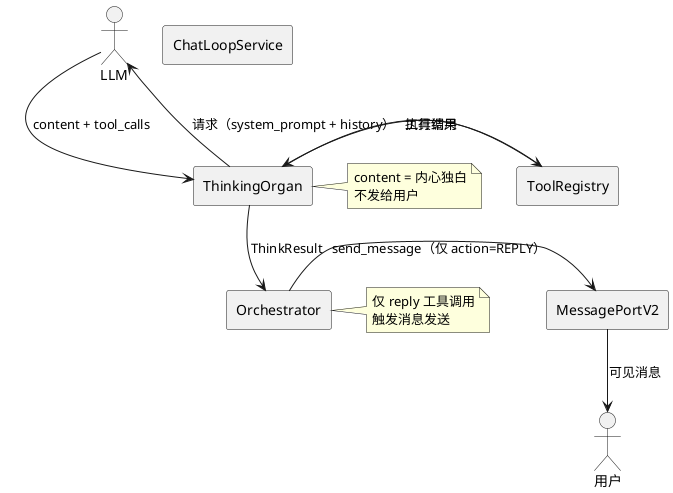
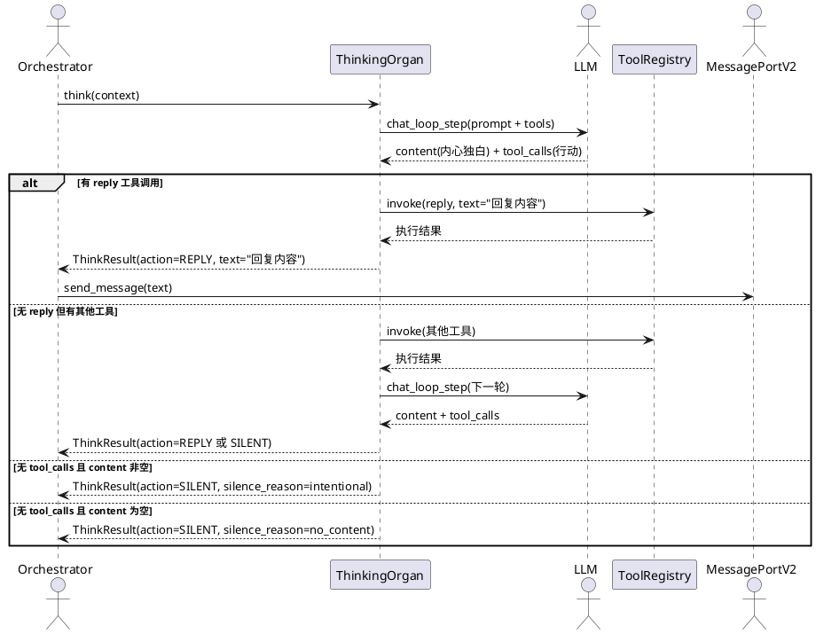
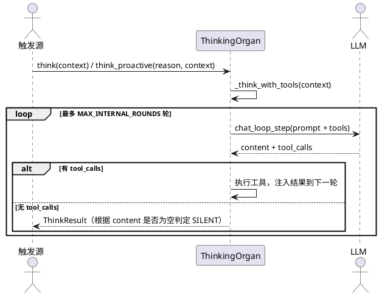
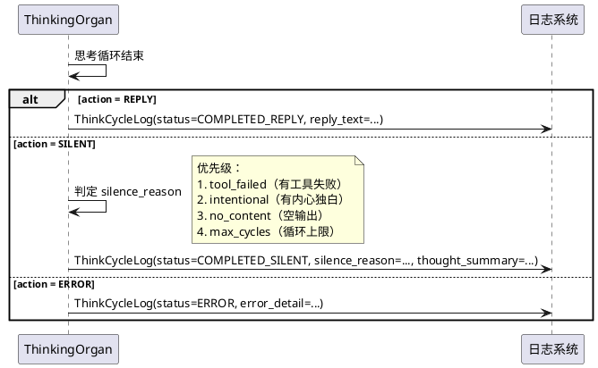
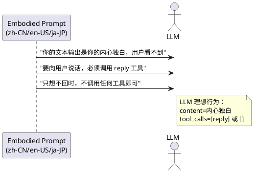

# 1. 组件定位

## 1.1 核心职责

本组件负责将 ThinkingOrgan 的思考-行动循环从"content 即回复"迁移到"content 即内心独白，回复即工具调用"，实现智能体内心世界与对外行动的架构级分离。

## 1.2 核心输入

1. **LLM 结构化输出**：ThinkingOrgan 每轮思考循环中 LLM 返回的 `content`（内心独白）和 `tool_calls`（对外行动）
2. **ThinkContext**：智能体思考时的上下文信息（消息、情绪、内心声音、记忆片段等）
3. **工具执行结果**：工具调用后的返回值，注入下一轮思考循环
4. **沉默原因判定信号**：LLM 错误、超时、工具失败、激活拒绝等异常信号

## 1.3 核心输出

1. **ThinkResult**：思考结果，包含 `action`（REPLY/SILENT/ERROR/WAIT）、`text`（仅 reply 工具调用的参数文本）、`silence_reason`（沉默原因）
2. **ThinkCycleLog**：结构化思考日志，区分 7 种沉默原因，供运维观测
3. **内心独白**：保留在日志/监控中，不发送给用户

## 1.4 职责边界

1. **不负责** reply 工具的具体执行逻辑（由 ToolRegistry 负责）
2. **不负责** 消息发送（由 MessagePortV2 负责）
3. **不负责** LLM 调用的底层实现（由 ChatLoopService 负责）
4. **不负责** 内心状态（情绪/欲望/记忆）的演化逻辑（由 EmotionManager/VitalityManager/MemoryServicePort 负责）
5. **不负责** 多智能体编排（由 Orchestrator 负责）

---

# 2. 领域术语

**内心独白（Inner Monologue）**
: LLM 输出中 `content` 字段的文本内容，代表智能体的内心思考、推理和决策过程，永远不发送给用户。

**对外行动（External Action）**
: LLM 输出中 `tool_calls` 字段包含的工具调用，代表智能体与外界交互的显式决策。所有对外行动必须通过工具调用，没有例外。

**人与手机范式（Person-Phone Paradigm）**
: 智能体行动模型的类比——智能体是人（有内心世界），工具接口是手机（与外界交互的唯一通道）。拿起手机 = 调用工具，放下手机继续想 = content 非空但无 tool_calls，不拿手机 = 不行动。

**思考-行动循环（Think-Act Cycle）**
: 智能体从感知到行动的完整循环：感知→思考→决策→行动→观察→再思考。所有触发源（消息、心跳、提醒、管家插话）走同一个循环。

**沉默原因（Silence Reason）**
: 当智能体不回复时，区分不回复的根因。包含 7 种：intentional（深思熟虑）、no_content（LLM 空输出）、error（LLM 报错）、timeout（超时）、rejected（激活被拒）、tool_failed（工具失败）、max_cycles（循环上限）。

**简化模式（Simple Mode）**
: 当前 ThinkingOrgan 中 `_think_simple()` 和 `_think_proactive_simple()` 的运行模式，无工具循环，LLM 输出直接当回复。本迁移将废除此模式。
: 备注：与"完整模式"（`_think_with_tools()`，有工具循环）对立。

**reply 工具**
: 内置工具之一，智能体通过调用此工具向用户发送可见回复。调用 `reply(text="...")` = 决定向用户说话，不调用 = 不说话。

---

# 3. 角色与边界

## 3.1 核心角色

- **ThinkingOrgan**：思维器官，执行思考-行动循环，产生 ThinkResult
- **Orchestrator**：编排器，消费 ThinkResult，根据 action 决定是否发送消息

## 3.2 外部系统

- **ChatLoopService**：提供 LLM 调用能力，返回包含 content 和 tool_calls 的结构化响应
- **ToolRegistry**：提供工具定义和执行能力，包含 reply 等内置工具
- **MessagePortV2**：消息发送端口，Orchestrator 通过它将回复发送给用户
- **Embodied Prompt 模板**：三语提示词模板（zh-CN/en-US/ja-JP），约束 LLM 的输出行为

## 3.3 交互上下文

---

# 4. DFX 约束

## 4.1 性能

1. 思考-行动循环的单轮 LLM 调用延迟不得超过当前水平（完整模式已有基线）
2. 废除 `_think_simple` 后，简化场景（插话/提醒）的 LLM 调用次数不应增加——简化场景仍为单轮，只是走统一的循环路径
3. 沉默原因判定逻辑必须是纯规则计算，不引入额外的 LLM 调用

## 4.2 可靠性

1. 迁移后，内心独白泄漏给用户的概率必须为零（架构级保证，非 prompt 级约定）
2. 迁移后，reply 工具调用失败时，不得将 content 当作降级回复发送
3. 迁移后，所有现有功能（消息回复、插话、提醒、wait、工具循环）必须保持正常工作

## 4.3 安全性

1. 内心独白不得出现在任何发送给用户的消息通道中
2. ThinkResult.text 字段仅当 action=REPLY 时有值，且值来源于 reply 工具调用的参数，不是 LLM 的 content
3. 结构化日志中的内心独白摘要仅用于运维观测，不进入用户可见的任何输出

## 4.4 可维护性

1. 思考-行动循环的日志必须包含 silence_reason 字段，支持 7 种沉默原因的结构化区分
2. 每次思考循环必须产生一条 ThinkCycleLog，包含 agent_id、trigger、status、silence_reason、thought_summary、action_summary
3. 日志格式必须人类可读，同时支持机器解析

## 4.5 兼容性

1. ThinkAction 枚举新增值不得破坏现有消费者（Orchestrator、WebUI 监控面板）
2. ThinkResult 数据结构变更必须向后兼容——新增字段有默认值，现有字段语义不变
3. embodied prompt 模板修改必须三语同步（zh-CN / en-US / ja-JP）

---

# 5. 核心能力

## 5.1 思考-行动分离

### 5.1.1 业务规则

1. **content 即内心独白**：LLM 输出的 content 字段必须被解释为智能体的内心思考，不得作为回复文本发送给用户
   - 验收条件：[LLM 输出 content 非空且无 tool_calls] → [ThinkResult.action = SILENT，ThinkResult.text 为空]

2. **回复即 reply 工具调用**：智能体向用户发送可见回复，必须且只能通过调用 reply 工具实现
   - 验收条件：[LLM 输出包含 reply 工具调用] → [ThinkResult.action = REPLY，ThinkResult.text = reply 工具的 text 参数值]

3. **不调 reply 即不回复**：当 LLM 输出无 reply 工具调用时，即使 content 非空，也不发送任何消息给用户
   - 验收条件：[LLM 输出 content="我居然在等一个消息" 且 tool_calls 为空] → [不发送消息给用户，日志记录 silence_reason=intentional]

4. **非 reply 工具调用不构成回复**：LLM 调用 query_memory、send_image 等非 reply 工具时，不触发消息发送
   - 验收条件：[LLM 输出 tool_calls 包含 query_memory 但不包含 reply] → [ThinkResult.action = SILENT 或 TOOL_CALL，不发送消息给用户]

5. **禁止项**：禁止将 LLM 的 content 字段直接作为 ThinkResult.text 返回
   - 验收条件：[任何 LLM 输出场景] → [ThinkResult.text 的值来源只能是 reply 工具调用的参数，不能是 content]

### 5.1.2 交互流程

### 5.1.3 异常场景

1. **LLM 不遵守 prompt 约定，在 content 中写了回复意图但未调 reply 工具**
   - 触发条件：LLM 输出 content 包含类似回复的内容但未调用 reply 工具
   - 系统行为：架构级强制——content 永远不发给用户，ThinkResult.action = SILENT
   - 用户感知：用户不会收到任何消息；运维日志记录 silence_reason=intentional，thought_summary 包含 content 摘要

2. **reply 工具调用失败**
   - 触发条件：reply 工具执行抛出异常或返回失败
   - 系统行为：ThinkResult.action = SILENT，silence_reason = tool_failed；不得将 content 作为降级回复
   - 用户感知：用户不会收到消息；运维日志记录 tool_failed 及错误详情

3. **LLM 调用报错**
   - 触发条件：ChatLoopService.chat_loop_step 抛出异常
   - 系统行为：ThinkResult.action = ERROR，silence_reason = error
   - 用户感知：用户不会收到消息；运维日志记录错误详情

## 5.2 统一思考循环

### 5.2.1 业务规则

1. **废除简化模式**：`_think_simple()` 和 `_think_proactive_simple()` 必须被移除，所有思考路径统一走 `_think_with_tools()` 的工具循环
   - 验收条件：[ThinkingOrgan 类中不存在 `_think_simple` 和 `_think_proactive_simple` 方法] → [所有 think()/think_proactive() 调用都走工具循环]

2. **简化场景仍为单轮**：废除简化模式不意味着所有场景都需要多轮循环。插话/提醒等轻量场景在统一循环中仍可单轮完成——LLM 单次输出包含 reply 工具调用即可
   - 验收条件：[插话场景 LLM 输出 content + reply 工具调用] → [单轮循环即返回 ThinkResult(action=REPLY)]

3. **所有触发源走同一循环**：消息触发、心跳触发、提醒触发、管家插话触发都走同一个思考-行动循环，区别仅在 ThinkContext.trigger_reason 不同
   - 验收条件：[think(trigger_reason="user_message") 和 think_proactive(reason="reminder")] → [都走 _think_with_tools 路径]

4. **禁止项**：禁止新增任何绕过工具循环直接将 LLM 输出当回复的代码路径
   - 验收条件：[代码审查] → [ThinkingOrgan 中不存在任何将 content 直接赋值给 ThinkResult.text 的代码路径]

### 5.2.2 交互流程

### 5.2.3 异常场景

1. **工具循环达到上限仍未回复**
   - 触发条件：思考-行动循环达到 MAX_INTERNAL_ROUNDS 轮仍未产生 reply 工具调用
   - 系统行为：ThinkResult.action = SILENT，silence_reason = max_cycles
   - 用户感知：用户不会收到消息；运维日志记录 max_cycles 及循环详情

2. **ChatLoopService 未注入导致降级**
   - 触发条件：ThinkingOrgan 构造时未注入 chat_loop_service 或 tool_registry
   - 系统行为：不应再走简化模式降级路径，应在构造时校验必要依赖，缺失时抛出明确错误
   - 用户感知：启动阶段即暴露配置错误，而非运行时静默降级到泄漏路径

## 5.3 沉默原因可观测性

### 5.3.1 业务规则

1. **7 种沉默原因**：当 ThinkResult.action = SILENT 时，必须附带 silence_reason 字段，取值限定为以下 7 种：
   - `intentional`：深思熟虑后决定不回复（content 非空但无 reply 工具调用）
   - `no_content`：LLM 返回空内容且无工具调用
   - `error`：LLM 调用出错
   - `timeout`：思考超时
   - `rejected`：智能体被编排器拒绝激活
   - `tool_failed`：工具调用失败导致回复未发出
   - `max_cycles`：循环达到上限仍未回复
   - 验收条件：[任何 SILENT 结果] → [silence_reason 为上述 7 种之一，不允许为空]

2. **判断优先级**：沉默原因的判定必须遵循 tool_failed > intentional > no_content 的优先级
   - 验收条件：[同一轮循环中有工具失败且有内心独白] → [silence_reason = tool_failed，而非 intentional]

3. **结构化日志**：每次思考循环必须产生一条 ThinkCycleLog，包含以下字段：
   - agent_id、session_name、trigger
   - status（COMPLETED_REPLY / COMPLETED_SILENT / ERROR / TIMEOUT）
   - silence_reason（仅 SILENT 时有值）
   - thought_summary（内心想法摘要，最多 100 字）
   - action_summary（行动摘要）
   - cycle_count、tool_calls_made、tool_errors、elapsed_ms
   - 验收条件：[每次 think() 或 think_proactive() 调用] → [产生一条完整的 ThinkCycleLog]

4. **人类可读日志行**：ThinkCycleLog 必须支持生成人类可读的日志行，格式为 `[think] agent=X trigger=Y status=Z reason=W why="..."` 
   - 验收条件：[intentional 沉默] → [日志行包含 why 字段，内容为 thought_summary]
   - 验收条件：[error/rejected 沉默] → [日志行包含 detail 字段，内容为错误详情]

5. **禁止项**：禁止在日志中仅记录 SILENT 而不记录 silence_reason
   - 验收条件：[代码审查] → [所有 ThinkResult.action=SILENT 的日志路径都附带 silence_reason]

### 5.3.2 交互流程

### 5.3.3 异常场景

1. **沉默原因判定冲突**
   - 触发条件：同一轮循环中既有工具失败又有内心独白
   - 系统行为：按优先级判定为 tool_failed，thought_summary 仍记录内心独白
   - 用户感知：运维日志同时包含 tool_failed 原因和 thought_summary 内容

2. **日志写入失败**
   - 触发条件：ThinkCycleLog 写入时日志系统异常
   - 系统行为：日志写入失败不得影响 ThinkResult 的正常返回
   - 用户感知：无影响；运维可能缺少该次循环的日志

## 5.4 Embodied Prompt 强化

### 5.4.1 业务规则

1. **三语同步约定**：embodied prompt 模板必须在 zh-CN、en-US、ja-JP 三个语言版本中同步添加以下约定：
   - 你的文本输出（content）是你的内心独白，用户看不到
   - 要向用户说话，必须调用 reply 工具
   - 只想不回时，不调用任何工具即可
   - 验收条件：[三语模板都包含上述三条约定] → [LLM 输出行为更可预测]

2. **约定措辞必须明确**：禁止使用"建议""尽量"等弱约束措辞，必须使用"必须""只有"等强约束措辞
   - 验收条件：[prompt 文本审查] → [不包含"建议调用 reply""尽量通过工具回复"等弱约束]

3. **禁止项**：prompt 约定不能替代架构级保证——即使 LLM 不遵守 prompt，代码层面也必须强制执行 content 不泄漏
   - 验收条件：[LLM 在 content 中写了回复意图但未调 reply] → [代码层面仍然不发送消息]

### 5.4.2 交互流程

### 5.4.3 异常场景

1. **LLM 不遵守 prompt 约定**
   - 触发条件：LLM 在 content 中写了回复内容但未调用 reply 工具
   - 系统行为：架构级保证生效——content 不发送，ThinkResult.action = SILENT
   - 用户感知：用户不会收到消息；运维日志记录 silence_reason=intentional

2. **LLM 在 reply 工具参数中复制了内心独白**
   - 触发条件：LLM 调用 reply(text="我居然在等一个消息")
   - 系统行为：这是 LLM 的语义错误，架构层面无法阻止——reply 工具的参数就是回复内容
   - 用户感知：用户收到消息；此场景属于 prompt 质量问题，需通过 prompt 优化解决

## 5.5 ThinkResult 数据模型扩展

### 5.5.1 业务规则

1. **新增 silence_reason 字段**：ThinkResult 数据类必须新增 `silence_reason` 字段，类型为可选枚举，默认为 None
   - 验收条件：[ThinkResult.action = SILENT] → [silence_reason 不为 None]
   - 验收条件：[ThinkResult.action = REPLY] → [silence_reason 为 None]

2. **新增 thought_summary 字段**：ThinkResult 数据类必须新增 `thought_summary` 字段，记录内心独白摘要（最多 100 字），供日志和监控使用
   - 验收条件：[LLM 输出 content 非空] → [thought_summary = content[:100]]
   - 验收条件：[LLM 输出 content 为空] → [thought_summary 为空字符串]

3. **text 字段语义变更**：ThinkResult.text 的值来源从"LLM 的 content"变更为"reply 工具调用的 text 参数"
   - 验收条件：[ThinkResult.text 非空] → [其值来源于 reply 工具调用参数，不是 LLM content]
   - 验收条件：[无 reply 工具调用] → [ThinkResult.text 为空字符串]

4. **向后兼容**：新增字段必须有默认值，现有字段的类型和语义不得破坏现有消费者
   - 验收条件：[Orchestrator 读取 ThinkResult] → [现有 action/text/error_message 等字段行为不变]

5. **禁止项**：禁止在 ThinkResult 中新增将 content 原文暴露给 Orchestrator 的字段
   - 验收条件：[ThinkResult 数据类] → [不包含 content 或 inner_monologue 等原始内心独白字段，仅包含 thought_summary 摘要]

### 5.5.2 交互流程

无独立交互流程，ThinkResult 作为数据载体在 5.1-5.3 的交互流程中传递。

### 5.5.3 异常场景

1. **旧代码读取新增字段**
   - 触发条件：未更新的消费者代码访问 silence_reason 字段
   - 系统行为：新增字段有默认值 None，旧代码不受影响
   - 用户感知：无影响

---

# 6. 数据约束

## 6.1 ThinkResult

1. **action**：ThinkAction 枚举值（REPLY / SILENT / ERROR / WAIT），必填，默认 SILENT
2. **text**：回复文本，仅当 action=REPLY 时有值，值来源为 reply 工具调用的 text 参数，默认空字符串
3. **silence_reason**：沉默原因枚举，仅当 action=SILENT 时有值，7 种取值（intentional / no_content / error / timeout / rejected / tool_failed / max_cycles），默认 None
4. **thought_summary**：内心独白摘要，最多 100 字，供日志使用，默认空字符串
5. **tool_calls**：工具调用列表，保持现有语义
6. **error_message**：错误信息，保持现有语义
7. **thinking_time_ms**：思考耗时毫秒，保持现有语义
8. **tool_calls_count**：工具调用总次数，保持现有语义
9. **rounds**：循环轮次，保持现有语义
10. **wait_seconds**：等待秒数，保持现有语义

## 6.2 SilenceReason（新增枚举）

1. **INTENTIONAL**：深思熟虑后决定不回复
2. **NO_CONTENT**：LLM 返回空内容
3. **ERROR**：LLM 调用出错
4. **TIMEOUT**：思考超时
5. **REJECTED**：被编排器拒绝激活
6. **TOOL_FAILED**：工具调用失败
7. **MAX_CYCLES**：循环达到上限

## 6.3 ThinkCycleLog（新增数据类）

1. **agent_id**：智能体 ID，必填
2. **session_name**：会话名称，必填
3. **trigger**：触发来源（message / heartbeat / reminder / interjection），必填
4. **status**：循环状态（COMPLETED_REPLY / COMPLETED_SILENT / ERROR / TIMEOUT），必填
5. **silence_reason**：沉默原因，仅 status=COMPLETED_SILENT 时有值
6. **thought_summary**：内心想法摘要，最多 100 字
7. **action_summary**：行动摘要
8. **reply_text**：最终回复文本（如果有）
9. **cycle_count**：循环轮数
10. **tool_calls_made**：调用的工具名称列表
11. **tool_errors**：工具错误列表
12. **elapsed_ms**：耗时毫秒
13. **error_detail**：错误详情