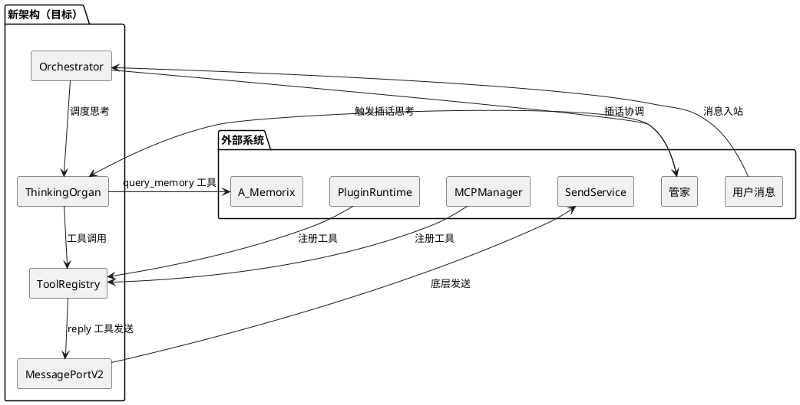
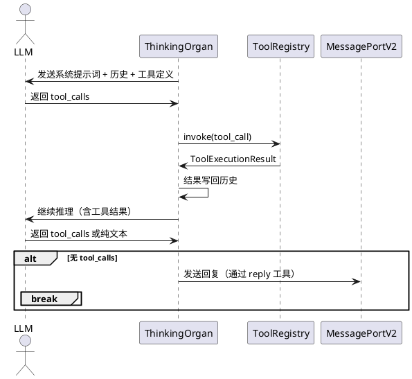
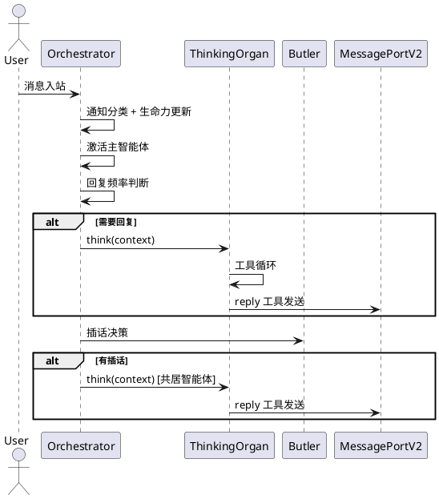

# 1. 组件定位

## 1.1 核心职责

本组件负责将智能体主回复生成从旧 Planner 迁移到 ThinkingOrgan，实现 Orchestrator 统一调度所有回复路径（主回复/插话/提醒），消除双路径并行架构。

## 1.2 核心输入

1. 用户消息 — 通过 Orchestrator.handle_message() 入站
2. 通知消息 — AMBIENT/INTERACTION/INPUT_STATUS 分类后的通知
3. 心跳信号 — 定时触发的生命力评估和欲望评估
4. 提醒信号 — 定时器触发的提醒到期事件
5. 工具调用请求 — LLM 输出的 tool_calls
6. 插件/MCP 工具注册 — 外部工具提供者注册

## 1.3 核心输出

1. 主回复消息 — 通过 MessagePortV2 发送
2. 插话消息 — 共居智能体通过管家协调后发送
3. 提醒消息 — 定时提醒到期后发送
4. 工具执行结果 — 工具调用后返回给 LLM 继续推理
5. 内心状态更新 — 情绪/欲望/记忆的持续演化

## 1.4 职责边界

- 不负责消息入站预处理（bot.py/ChatManager 负责）
- 不负责平台适配（NapCat Adapter 负责）
- 不负责记忆存储（A_Memorix 负责，通过 MemoryServicePort 访问）
- 不负责消息发送的底层实现（SendService 负责，通过 MessagePortV2 访问）
- 不负责插件/MCP 的生命周期管理（PluginRuntime/MCPManager 负责，只消费其工具注册）

# 2. 领域术语

**ThinkingOrgan**
: 智能体的思维管道，负责 LLM 调用、工具循环、上下文管理。每个智能体拥有独立实例。

**Orchestrator**
: 智能体协调器，决定"谁在思考"，不关心"怎么思考"。统一调度主回复/插话/提醒三条路径。

**工具循环（Tool Loop）**
: LLM 输出 tool_calls → 执行工具 → 结果写回历史 → LLM 继续推理的循环，最多 N 轮。

**replyer 管道**
: Planner 思考 → replyer 二次 LLM 生成回复文本 → 发送的回复质量管道。ThinkingOrgan 必须保留此管道。

**Deferred Tools**
: 不直接暴露给 LLM 的工具，需通过 tool_search 发现后才可见。减少 prompt 占用。

**行为表现参考（Behavior Reference）**
: 从历史行为模式中检索的参考消息，帮助 LLM 保持行为一致性。

**中期记忆参考（Mid-term Memory Reference）**
: 上下文裁切后生成的记忆摘要，防止长对话丢失早期信息。

**回复频率控制**
: talk_value + 消息阈值 + 回复必要性评分，决定群聊中是否回复的规则引擎。

**Planner 打断**
: 新消息到达时可打断正在进行的 Planner 推理，用新消息重试。

**边车架构（Sidecar）**
: 当前 Orchestrator 只做插话/管家/生命力，主回复走旧 Planner 的双路径并行状态。

# 3. 角色与边界

## 3.1 核心角色

- **用户**：发送消息、接收回复
- **管家（Butler）**：协调共居智能体的插话和提醒

## 3.2 外部系统

- **MaisakaChatLoopService**：旧 LLM 对话循环服务，迁移完成后退役
- **MaisakaReasoningEngine**：旧推理引擎，包含消息调度/去重/打断/频率控制，迁移完成后退役
- **ToolRegistry**：统一工具注册表，ThinkingOrgan 直接复用
- **MaisakaBuiltinToolProvider**：内置工具提供者（reply/wait/send_image 等），ThinkingOrgan 直接复用
- **PluginToolProvider**：插件工具提供者，ThinkingOrgan 直接复用
- **MCPToolProvider**：MCP 工具提供者，ThinkingOrgan 直接复用
- **MessagePortV2**：消息发送端口，ThinkingOrgan 通过 reply 工具间接使用
- **MemoryServicePort**：记忆服务端口，供 query_memory/query_person_profile 工具使用

## 3.3 交互上下文

# 4. DFX约束

## 4.1 性能

- ThinkingOrgan 单次思考（含工具循环）响应时间不超过旧 Planner 的 1.2 倍
- 13 个待命智能体单次心跳评估不超过 600ms（不变）
- 工具循环最多 10 轮内部 round（与旧 Planner 一致）

## 4.2 可靠性

- 迁移期间必须支持回退到旧 Planner（通过配置开关）
- 工具执行失败不得导致 ThinkingOrgan 崩溃，必须返回错误结果给 LLM 继续推理
- LLM 调用超时必须有兜底（SILENT 返回）

## 4.3 兼容性

- 旧 MaisakaChatLoopService 的 prompt 模板必须保持兼容（embodied 模板已存在）
- 旧 ReasoningEngine 的日志格式（结构化记录、WebUI 监控）必须保持
- 插件 Hook 系统（5 个 Hook 规格）必须保持兼容
- MCP Host sampling 回调必须保持兼容

## 4.4 可维护性

- ThinkingOrgan 的工具循环逻辑必须与旧 ReasoningEngine 的工具循环逻辑保持代码同构，方便对照验证
- 迁移完成后旧代码必须可整体删除，不留残留

# 5. 核心能力

## 5.1 ThinkingOrgan 工具循环

### 5.1.1 业务规则

1. **工具循环必须支持多轮**：LLM 输出 tool_calls 时，执行工具后将结果写回历史，继续 LLM 推理，最多 10 轮
   - 验收条件：LLM 输出 tool_call(reply) → 执行 reply → LLM 无 tool_calls → 循环结束

2. **工具循环必须支持 visible/deferred 分离**：visible 工具直接暴露给 LLM，deferred 工具需通过 tool_search 发现
   - 验收条件：LLM 看不到 view_forward_message 定义，但调用 tool_search 后可发现并使用

3. **工具执行失败必须返回错误结果**：工具抛异常时，将错误信息作为工具结果写回历史，LLM 可继续推理
   - 验收条件：send_image 工具失败 → LLM 收到错误信息 → LLM 可选择其他方式回复

4. **wait 工具必须暂停循环**：LLM 调用 wait 工具时，暂停当前循环，等待新消息后继续
   - 验收条件：LLM 调用 wait(60) → 循环暂停 → 60 秒后有新消息 → LLM 继续推理

5. **思考相似度检测**：连续两轮思考内容相似度 > 0.9 时，替换为重新思考提示，防止死循环
   - 验收条件：LLM 连续输出相同内容 → 注入重新思考提示 → LLM 输出不同内容

### 5.1.2 交互流程

### 5.1.3 异常场景

1. **LLM 调用超时**
   - 触发条件：LLM 响应超过配置的超时时间
   - 系统行为：返回 ThinkResult(action=SILENT)
   - 用户感知：无回复

2. **工具执行异常**
   - 触发条件：工具 invoke 抛出未预期异常
   - 系统行为：将异常信息作为工具错误结果写回历史，LLM 继续推理
   - 用户感知：LLM 可能选择其他方式回复

3. **循环达到上限**
   - 触发条件：工具循环达到 10 轮仍未结束
   - 系统行为：强制结束循环，记录警告日志
   - 用户感知：可能收到不完整的回复

## 5.2 Orchestrator 主回复调度

### 5.2.1 业务规则

1. **Orchestrator 必须接管主回复生成**：当 agent_autonomy.enabled=true 时，主回复由 Orchestrator 调用主智能体的 ThinkingOrgan.think() 生成，不再走旧 Planner
   - 验收条件：enabled=true → 用户消息 → Orchestrator.handle_message → ThinkingOrgan.think → 回复发送

2. **Orchestrator 必须跳过旧 Planner 路径**：接管主回复后，不再调用 _schedule_message_turn()
   - 验收条件：enabled=true → 日志中无 "Planner" 字样

3. **Orchestrator 必须保留消息调度能力**：消息去重、排队、打断等能力必须迁移到 Orchestrator 或 ThinkingOrgan
   - 验收条件：快速连发 3 条消息 → 只触发 1 次思考（去重生效）

4. **Orchestrator 必须保留回复频率控制**：群聊中的 talk_value/消息阈值/回复必要性评分
   - 验收条件：群聊低价值消息 → Orchestrator 判定不回复

5. **配置开关必须支持回退**：enabled=false 时完全回退到旧 Planner，无功能损失
   - 验收条件：enabled=false → 行为与迁移前完全一致

### 5.2.2 交互流程

### 5.2.3 异常场景

1. **ThinkingOrgan 思考失败**
   - 触发条件：LLM 调用失败或工具循环异常
   - 系统行为：记录错误日志，不发送回复
   - 用户感知：无回复

2. **回退到旧 Planner**
   - 触发条件：enabled=false 或 ThinkingOrgan 初始化失败
   - 系统行为：走旧 _schedule_message_turn() 路径
   - 用户感知：与迁移前一致

## 5.3 上下文管理迁移

### 5.3.1 业务规则

1. **上下文选择必须与旧 Planner 一致**：从最新消息向前计数，达到 max_context_size 时裁切，CONTEXT_RESTORE 类型始终保留
   - 验收条件：相同历史 → 相同的上下文选择结果

2. **上下文注入必须包含所有旧注入项**：deferred_tools_reminder、heuristic_memory、person_profile、行为表现参考、黑话参考、中期记忆参考
   - 验收条件：ThinkingOrgan 的注入消息与旧 Planner 完全一致

3. **视觉消息处理必须保留**：图片识图、占位刷新、最新图片数量限制
   - 验收条件：发送图片 → ThinkingOrgan 正确识图

4. **历史裁切必须保留**：每轮循环结束后保证用户消息数量不超过 max_context_size，被裁切消息用于生成中期记忆摘要
   - 验收条件：长对话 → 早期消息被裁切 → 中期记忆摘要生成

### 5.3.2 异常场景

1. **上下文过大**
   - 触发条件：历史消息超过 max_context_size
   - 系统行为：裁切早期消息，生成中期记忆摘要
   - 用户感知：回复仍包含早期对话的关键信息

## 5.4 replyer 管道保留

### 5.4.1 业务规则

1. **reply 工具必须保留 replyer 二次生成**：Planner 思考 → replyer 生成回复文本 → 发送
   - 验收条件：LLM 调用 reply 工具 → replyer 二次 LLM 生成 → 发送

2. **rich_reply 检查器必须保留**：回复质量检查、分段发送、混合内容（文本/图片/表情/AT）
   - 验收条件：rich_reply 启用 → 回复被检查器改写 → 分段发送

3. **表达方式选择必须保留**：expression_intent + 子代理选表达
   - 验收条件：LLM 指定 expression_intent → 子代理选择表达方式

## 5.5 插件 Hook 兼容

### 5.5.1 业务规则

1. **5 个 Hook 规格必须全部保留**：before_request/after_response/before_model_request 等
   - 验收条件：插件注册 Hook → ThinkingOrgan 工具循环中 Hook 被正确调用

2. **Hook 的改写能力必须保留**：before_request 可改写 messages 和 tool_definitions
   - 验收条件：插件改写 tool_definitions → ThinkingOrgan 使用改写后的定义

# 6. 数据约束

## 6.1 ThinkContext

1. **messages**：入站消息元组，不可为空
2. **emotion_state_text**：情绪状态文本，可为空字符串
3. **inner_voice_text**：内心声音文本，可为空字符串
4. **memory_personality_params**：记忆性格参数字典，可为 None
5. **trigger_reason**：触发原因，必须为 "message"/"butler_interjection"/"reminder"/"proactive" 之一
6. **metadata**：元数据字典，可为空字典

## 6.2 ThinkResult

1. **action**：必须为 REPLY/SILENT/ERROR 之一
2. **text**：回复文本，action=REPLY 时不可为空
3. **error_message**：错误信息，action=ERROR 时不可为空
4. **tool_calls_count**：本轮思考的工具调用次数
5. **duration_ms**：本轮思考的耗时（毫秒）